### [世界计划]想在版里开一个答疑讨论帖子，有问题咨询随时欢迎。

Made by ngapost2md (c) ludoux [GitHub Repo](https://github.com/ludoux/ngapost2md)

----

##### 0.[5] \<pid:0\> 2023-07-27 14:09:39 by 欲与深蓝丶c
主玩的是日服。烤OC里推得是望月穗波和宵崎奏两位。

也算从开服后两个月入坑的吧，到现在游戏水平大概在FC31下位的水平；知道自己不是天赋型选手，加上我自己也没有特地想要系统练习过手法和各种乐理，导致上限可能就停在这里了。不过也陆陆续续打了快18K把歌了也成为没有梦想随缘推的老咸鱼了。

有过一定冲榜经验，但是也很局限。(如果前1000也算冲榜的话)。

如果各位有不了解的地方欢迎随时咨询，包括游戏系统、在我水平内的谱面、冲榜相关。甚至是一些游戏外活动。

贴一张UNIBOT个人信息
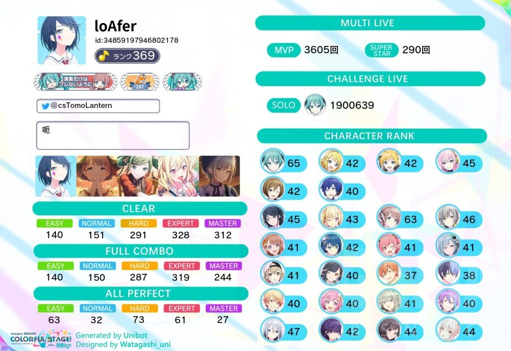<h4 class='subtitle'>2023-10-18 12:09</h4><b>楼主本人由于工作原因可能有的时候回复不及时，非常感谢能帮楼主回复的各位大佬。今后也要多多指教</b>

----

##### 1.[9] \<pid:705334572\> 2023-07-27 22:34:17 by 初音龙之介
提问:sbga什么时候暴毙

----

##### 2.[1] \<pid:705350080\> 2023-07-28 00:16:31 by 欲与深蓝丶c
>[jump](#pid705334572) 初音龙之介(2023-07-27 22:34) 说: 
>
>提问:sbga什么时候暴毙

期望早日归西

----

##### 3.[1] \<pid:705810193\> 2023-07-30 12:27:36 by 欧阳彧珝
不懂就问，组卡的时候，同色同组能有多少额外加成？

----

##### 4.[0] \<pid:705828160\> 2023-07-30 14:23:55 by 欲与深蓝丶c
>[jump](#pid705810193) 欧阳彧珝(2023-07-30 12:27):

~~说实话我也不是很懂那些术语但是大概看看应该是还可以。。。~~

在默认全区域满级(LV15)的情况下(即：单角色30%，原创组合7.5*2=15%，虚拟歌手组合1.5%*5=7.5%，队伍同色7.5*2=15%)

在不计算其它隐藏规则的前提下这边是原创角色60%，虚拟歌手为52.5%，

实际如果在编队成员同色和同组的前提下组合加成和虚拟歌手的综合力加成都是会翻倍的，原创角色同组同色即为60%+15%*2=90%，虚拟歌手即为52.5%+15%+7.5%=75%。

友情提醒，如果虚拟歌手存在应援组合的前提下，综合力数值会选择虚拟组合和应援组合两者中的更高的。

----

##### 5.[1] \<pid:705867258\> 2023-07-30 18:23:04 by 纤尘丘白
问问有什么练大小键读谱的曲吗

----

##### 6.[0] \<pid:705928102\> 2023-07-31 00:11:50 by 欲与深蓝丶c
>[jump](#pid705867258) 纤尘丘白(2023-07-30 18:23) 说: 
>
>问问有什么练大小键读谱的曲吗

这种类型的谱子30以上对我来说有点超纲了。。。

2829级的几首还不错，Drop Pop Candy、拟剧论、阿哞的节奏、Cinema、泡沫未来、帝国少女……

不过还是有一点经验的(不过也就那么点)，打大部分曲的小接大比较好读也比较好拆可以只读小键当交互打切记不要硬扛(虽然无尽灰我大部分都是硬扛的，但是能不硬扛还是别硬扛了)。

----

##### 7.[0] \<pid:705939777\> 2023-07-31 02:08:37 by Chrysoberyl
哪首歌的3D最色？哪里色？

----

##### 8.[0] \<pid:705983880\> 2023-07-31 10:41:34 by 音之幻风
>[jump](#pid705939777) Chrysoberyl(2023-07-31 02:08):

这什么奇怪的问题。。

各个组合的动作风格差异相当大。我想 25时 和 more more jump 的歌曲里应该有你想要的东西。。

再往下的话大概应该看你获得了多少服装了吧。。

----

##### 9.[3] \<pid:705997929\> 2023-07-31 11:38:17 by 欲与深蓝丶c
>[jump](#pid705939777) Chrysoberyl(2023-07-31 02:08):

说实话，烤3DMV印象里没有我个人感觉很色的。。。~~该说毕竟是个3+游戏吗~~

虽然说选曲屡次在3+游戏里显得不是很3+，但其实做的3DMV反而还倒是挺正常的。

硬要选一个可能会选罗密欧与辛德瑞拉，印象里好多CP向内容会用这个3DMV。

----

##### 10.[0] \<pid:706017961\> 2023-07-31 13:09:04 by 欧阳彧珝
不懂就问，pjsk后期无氪是不是很难获取钻石，大概多久能攒1井呢

----

##### 11.[0] \<pid:706091303\> 2023-07-31 19:07:19 by 欧阳彧珝
顺便想问一下，国内日服如果想氪金，有什么好方法吗()

----

##### 12.[2] \<pid:706148380\> 2023-08-01 03:04:14 by 欲与深蓝丶c
>[jump](#pid706017961) 欧阳彧珝(2023-07-31 13:09) 说: 
>
>不懂就问，pjsk后期无氪是不是很难获取钻石，大概多久能攒1井呢

好像有人统计过不氪金大概是一年攒一井。。。

到游戏后期获取水晶真的太困难了，我自己心底打算攒井全靠运营发福利，因为我自己能挖的矿基本都挖完了(指升游戏等级、看剧情、练卡、打歌、挑战Live的一次性里程碑奖励和游戏角色等级给的)

单靠白嫖攒井到后期真的太太太困难了，每日签到和挑战Live一抽都不到，好不容易愿意发一点也就不到两抽(各种生放送赠的500，结活Live300,活动剧情400、活动给500如果是5V5选边输了还会少给50)，
想攒井真的是遥遥无期。

我自己攒井全靠运营发大的(比如一年一次的周年半周年和新年，或者和二周年一样的给很多角色等级的经验让你升级拿这部分的石头)。

氪金的话一般是找的代充，之前日元汇率下去代充价格没调的时候也会找日本群友帮忙氪金。

----

##### 13.[1] \<pid:706226654\> 2023-08-01 13:05:01 by LegendGX
>[jump](#pid706017961) 欧阳彧珝(2023-07-31 13:09) 说: 
>
>不懂就问，pjsk后期无氪是不是很难获取钻石，大概多久能攒1井呢

假设矿全挖干的情况下，仅靠每个月固定更新的内容能获取的石头量大概在11000左右，纯无课硬攒300井理论要8个月左右，但实际上矿基本不可能挖完，26个角色去除已经升到极限的主推，其他25个角色的角色rank玩着玩着升一级拿个100钻很常见，再加自身升级也给个50-100，遇到周年五一新年还会有额外登录奖励，一般可以认为纯无课7个月左右攒出300抽1井，有攒下来绿票粉票的话更快到达下井需要的抽数
双大月卡的情况下每个月收入直接近似+1w钻就行

----

##### 14.[0] \<pid:706247860\> 2023-08-01 14:51:57 by Kaneymoe
什么图适合练四指？双指31上位图有点扛不住了。

----

##### 15.[0] \<pid:706260484\> 2023-08-01 15:50:21 by 欧阳彧珝
想问一下一般5v5怎么选择队伍，无脑右吗
顺便好像听说一般人少的胜率高()
有没有哪里能看队伍人数的()

----

##### 16.[0] \<pid:706305779\> 2023-08-01 19:09:59 by 欲与深蓝丶c
>[jump](#pid706247860) Kaneymoe(2023-08-01 14:51) 说: 
>
>什么图适合练四指？双指31上位图有点扛不住了。

烤这边紫鹅妈妈烧鸡班?各种EX28293031感觉都不错，再往上紫色テオ。

不过总归会感觉在很多双指能FC甚至AP的谱子里练4K还是有些练不太到，还是建议考虑考虑接触一些4K引诱。

----

##### 17.[0] \<pid:706306955\> 2023-08-01 19:16:10 by 欲与深蓝丶c
>[jump](#pid706226654) LegendGX(2023-08-01 13:05) 说: 
>
>假设矿全挖干的情况下，仅靠每个月固定更新的内容能获取的石头量大概在11000左右，纯无课硬攒300井理论要8个月左右，但实际上矿基本不可能挖完，26个角色去除已经升到极限的主推，其他25个角色的角色rank玩着玩着升一级拿个100钻很常见，再加自身升级也给个50-100，遇到周年五一新年还会有额外登录奖励，一般可以认为纯无课7个月左右攒出300抽1井，有攒下来绿票粉票的话更快到达下井需要的抽数
>双大月卡的情况下每个月收入直接近似+1w钻就行

这么看下来石头获取是比我想的乐观不少。感觉下来就是想白嫖的话下池要谨慎。什么游戏都是这样，什么都要只会倾家荡产。

不过这么算下来到自推角色的箱活和生日卡都稳拿到纯白嫖真的要一年左右的时间，要攒石还是要多多控制自己。

----

##### 18.[0] \<pid:706309025\> 2023-08-01 19:27:04 by 欲与深蓝丶c
>[jump](#pid706260484) 欧阳彧珝(2023-08-01 15:50) 说: 
>
>想问一下一般5v5怎么选择队伍，无脑右吗
>顺便好像听说一般人少的胜率高()
>有没有哪里能看队伍人数的()

普遍都是认为哪边急募胜率会更高一些，当然也有例外虽然也很个别。

5v5选边的话这边好像看的是33kit，应该可以直接百度到。

----

##### 19.[0] \<pid:706315311\> 2023-08-01 19:57:42 by 欧阳彧珝
>[jump](#pid706309025) 欲与深蓝丶c(2023-08-01 19:27):

啊感谢，找到了
[url](https://3-3.dev/pjsk-cheerful-predict)

----

##### 20.[0] \<pid:706386896\> 2023-08-02 07:36:52 by beeyoo
新人问一下这个游戏抽卡编队应该怎么弄
抽卡是凑同队还是同属性还是同角色啊

----

##### 21.[0] \<pid:706548154\> 2023-08-02 20:17:45 by 欲与深蓝丶c
>[jump](#pid706386896) beeyoo(2023-08-02 07:36):

非冲榜的话老逼打活动基本上都能凑同色同队，除非要在活动里练卡。

如果是萌新要打活动点数的话建议优先考虑上加成色的加成成员，再考虑单成员和单色里挑综合力高的上。

如果很纠结百分比和综合力优先哪个可以用计算器计算一下综合力×加成值，优先考虑数值高的。

其实更简单的方法就是编队页面的一键编队，有“活动加成值最高”的筛选选项可以勾上，再根据需求调整队伍。

如果是为了综合力抽卡就优先考虑同色同队吧，这样能吃到的区域道具加成最高。如果要考虑打歌分数的话还需要考虑卡面技能。

----

##### 22.[0] \<pid:706674683\> 2023-08-03 13:05:23 by FlyAdyss
不懂就问，为什么对话new有的点完了还是new，还有为什么有的角色没有和其他角色有羁绊

----

##### 23.[1] \<pid:706676839\> 2023-08-03 13:16:33 by LegendGX
>[jump](#pid706674683) FlyAdyss(2023-08-03 13:05) 说: 
>
>不懂就问，为什么对话new有的点完了还是new，还有为什么有的角色没有和其他角色有羁绊

一直new是网络问题，回主界面或者打一首歌出来就会+10钻然后这个对话就不再new了，不用太在意
羁绊的问题很简单，因为不是所有角色之间都有联系，剧情上还没有一点关联的角色或者只是见过但是话都没说上几句的角色之间凭啥有羁绊呢，等后续活动剧情里角色相遇并产生了能够形成羁绊的关联之后运营就会追加他们之间的羁绊等级和称号

----

##### 24.[0] \<pid:706678242\> 2023-08-03 13:24:02 by 欧阳彧珝
不懂就问，チケット交換所里换3星的那个券是怎么获取的

----

##### 25.[0] \<pid:706697245\> 2023-08-03 14:56:59 by 欲与深蓝丶c
>[jump](#pid706678242) 欧阳彧珝(2023-08-03 13:24):

其实我也记不太清了。。。

印象里是以前新手任务做完还是周年的时候送的一张券(大概。。。具体我也忘了。。。)

----

##### 26.[0] \<pid:706832211\> 2023-08-04 08:53:27 by FlyAdyss
>[jump](#pid706676839) LegendGX(2023-08-03 13:16) 说: 
>
>一直new是网络问题，回主界面或者打一首歌出来就会+10钻然后这个对话就不再new了，不用太在意
>羁绊的问题很简单，因为不是所有角色之间都有联系，剧情上还没有一点关联的角色或者只是见过但是话都没说上几句的角色之间凭啥有羁绊呢，等后续活动剧情里角色相遇并产生了能够形成羁绊的关联之后运营就会追加他们之间的羁绊等级和称号

是吗，主要是看到有些小对话明明两人有对话但没羁绊，包括这次活动，saki和mzk 都互换发型了都没羁绊的吗

----

##### 27.[0] \<pid:706847555\> 2023-08-04 10:01:36 by 欲与深蓝丶c
>[jump](#pid706832211) FlyAdyss(2023-08-04 08:53) 说: 
>
>是吗，主要是看到有些小对话明明两人有对话但没羁绊，包括这次活动，saki和mzk 都互换发型了都没羁绊的吗

后续会追加的，双人牌都不是随着活动的剧情实时追加的哦。

----

##### 28.[0] \<pid:707046505\> 2023-08-05 05:51:00 by ナカト
是氪金方面的疑问。想问问商店打不开怎么解决(？)
已经各种百度挂t子啥的都试过，好像说是要谷歌日区账号登录play商店才能连上吗，设备是安卓(可以用ios但是好像也不在日区……)想抽那个3000钻石自选4星角色的池子

----

##### 29.[0] \<pid:707076592\> 2023-08-05 10:46:48 by 欲与深蓝丶c
>[jump](#pid707046505) ナカト(2023-08-05 05:51) 说: 
>
>是氪金方面的疑问。想问问商店打不开怎么解决(？)
>已经各种百度挂t子啥的都试过，好像说是要谷歌日区账号登录play商店才能连上吗，设备是安卓(可以用ios但是好像也不在日区……)想抽那个3000钻石自选4星角色的池子

商店加载不出来很大原因是加载不出Google Play和日区Apple Store。

如果没有的话那其实没啥办法还是找代充吧。

日区Apple账号好像好弄一点，可以去网上搜一搜教程；Google Play 的话好像要绑一张日本银行卡。

----

##### 30.[0] \<pid:707756549\> 2023-08-08 16:40:14 by 月小炎
联机自己选啥难度有啥影响么
刚凑够15W战力，高级房我还打hard感觉有点怪不好意思的
但是ex又完全按不来

----

##### 31.[0] \<pid:707825519\> 2023-08-08 21:53:02 by 欲与深蓝丶c
>[jump](#pid707756549) 月小炎(2023-08-08 16:40):

难度对分数的影响其实没那么大

就我认知内在挑战Live里，对短歌来说比如打孜然EXAP分数是比准确度98%的孜然MA分高的。

还有就是由于5V5的协力最终结算的活动点数是有HP加成的，能不扣血还是别扣血分数会高一些。

所以对于5V5和挑战LIVE还是选择自己能打的难度就好，平常的马拉松活动倒是随便了。

----

##### 32.[0] \<pid:707889470\> 2023-08-09 09:16:11 by LegendGX
>[jump](#pid707756549) 月小炎(2023-08-08 16:40) 说: 
>
>联机自己选啥难度有啥影响么
>刚凑够15W战力，高级房我还打hard感觉有点怪不好意思的
>但是ex又完全按不来

你选啥难度对房间里的其他玩家影响近乎于0，唯一的影响是如果你选高难度死了导致分很低最后协力总评价没有达到S拿不到S档的奖励，不过这种情况非常少见
另外cheerful的时候如果你自己因为选了打不了的高难度死了分数很难看可能会导致输给对面进一步导致你选的阵营丢了1分，而这点影响实际上也不足以直接影响你选的阵营最终总分会不会输掉少拿50钻，所以本质上相当于没有影响

协力拿多少pt只跟自己的最终得分有关，你选什么难度影响不了别人的最终得分，只有队长技能会有影响，协力是5个人的队长都会开一次技能的，所以其中有一个人的队长是3星甚至2星的话房里的5个人的得分其实都降低了。
最近遇到过最离谱的一次野房，除了我都是3星队长，结果他们的平均分就110万，我本来能拿200万左右的歌最后也就150万多

----

##### 33.[0] \<pid:709464228\> 2023-08-16 17:36:44 by 欧阳彧珝
不懂就问，抽生日池以及生日卡的性价比如何

----

##### 34.[0] \<pid:709478075\> 2023-08-16 18:42:45 by 欲与深蓝丶c
>[jump](#pid709464228) 欧阳彧珝(2023-08-16 17:36):

生日卡技能是大回复，Lv.1的回复效果基本上是四星卡的两倍，但是加分性能很弱。

不需要使用彩瓶子开花后，但是开后编剧情需要而且数量和四星消耗相同。

整体综合力提供的比三星多但是没有四星多，但是MR点一次要1000碎片就很尴尬。属于比上不如直接点4星比下3星卡比生日卡便宜的那种。

总体来说没什么性价比，真爱可以随意。

----

##### 35.[0] \<pid:709503461\> 2023-08-16 21:01:26 by Ayakacess
请问一下，这游戏台服连初始号都没有，台服是有什么问题吗，不想去日服……看不懂日语

----

##### 36.[0] \<pid:709570625\> 2023-08-17 09:03:39 by Skyrim01
不懂就问，想小氪一点，如果纯粹为了攒钻抽卡的话，什么性价比高一点？

先谢过

----

##### 37.[0] \<pid:709729016\> 2023-08-17 20:43:19 by 欲与深蓝丶c
>[jump](#pid709503461) Ayakacess(2023-08-16 21:01):

~~其实我也没怎么关注过台服不是很了解。。。~~

据说台服好像是iOS和Google不互通的，成本会高一些，目前好像说是只有iOS有初始号。

如果是为了打歌还是更推荐去日服，界面UI认全了影响的话没有那么大的。

----

##### 38.[0] \<pid:709729892\> 2023-08-17 20:48:45 by 欲与深蓝丶c
>[jump](#pid709570625) Skyrim01(2023-08-17 09:03):

月卡和通行证是永远是最推荐买的，其它的氪金内容的话就看自己经济实力了。

其中月卡最推荐买小杯和大杯，中杯相对而言没那么划算但是其实还是可以买。
通行证的话需要肝一下，能打完收益是相当客观的。

----

##### 39.[0] \<pid:709768243\> 2023-08-18 00:46:08 by Skyrim01
>[jump](#pid709729892) 欲与深蓝丶c(2023-08-17 20:48) 说: 
>
>月卡和通行证是永远是最推荐买的，其它的氪金内容的话就看自己经济实力了。
>
>其中月卡最推荐买小杯和大杯，中杯相对而言没那么划算但是其实还是可以买。
>通行证的话需要肝一下，能打完收益是相当客观的。

感谢

----

##### 40.[0] \<pid:709774378\> 2023-08-18 01:38:40 by Ayakacess
>[jump](#pid709729016) 欲与深蓝丶c(2023-08-17 20:43) 说: 
>
>~~其实我也没怎么关注过台服不是很了解。。。~~
>
>据说台服好像是iOS和Google不互通的，成本会高一些，目前好像说是只有iOS有初始号。
>
>如果是为了打歌还是更推荐去日服，界面UI认全了影响的话没有那么大的。

感谢，其实我是来看剧情的，听说剧情不错，日服语言不通还是算了，某宝连ios的初始都没有，自建随便玩了

----

##### 41.[1] \<pid:709827197\> 2023-08-18 10:38:15 by 欲与深蓝丶c
>[jump](#pid709774378) Ayakacess(2023-08-18 01:38):

烤的剧情说实话实话不敢恭维。。。

但是如果想看剧情的话可以在B站上看资讯站的翻译，基本上都是有的。

一般新活动第三天还是第四天就会出翻译，如果想看的话可以关注下。

----

##### 42.[0] \<pid:709833309\> 2023-08-18 11:01:52 by Ayakacess
>[jump](#pid709827197) 欲与深蓝丶c(2023-08-18 10:38) 说: 
>
>烤的剧情说实话实话不敢恭维。。。
>
>但是如果想看剧情的话可以在B站上看资讯站的翻译，基本上都是有的。
>
>一般新活动第三天还是第四天就会出翻译，如果想看的话可以关注下。

看视频跟自己点沉浸感还是有点区别卡相关的视频没办法在游戏里看也只能去看视频了

----

##### 43.[0] \<pid:709839965\> 2023-08-18 11:26:42 by Skyrim01
>[jump](#pid709774378) Ayakacess(2023-08-18 01:38) 说: 
>
>感谢，其实我是来看剧情的，听说剧情不错，日服语言不通还是算了，某宝连ios的初始都没有，自建随便玩了

某宝有的，烤的账号可以用引继码登陆，登陆后可以绑定game center，所以无所谓是什么设备创建的账号，直接搜pjsk初始就可以  

~~啊不过我买了日服的，台服好像没关注~~  

再次编辑，刚搜了一下，有的店家写有繁中服，可以问问试试

----

##### 44.[0] \<pid:709842587\> 2023-08-18 11:36:33 by Ayakacess
>[jump](#pid709839965) Skyrim01(2023-08-18 11:26) 说: 
>
>某宝有的，烤的账号可以用引继码登陆，登陆后可以绑定game center，所以无所谓是什么设备创建的账号，直接搜pjsk初始就可以  
>
>~~啊不过我买了日服的，台服好像没关注~~  
>
>再次编辑，刚搜了一下，有的店家写有繁中服，可以问问试试

多谢，我去看看，原来是搜索姿势不对么  
看了一下，搜繁中还是没有，全是日服的，算了算了，音游就无所谓抽不抽卡了

----

##### 45.[0] \<pid:711071805\> 2023-08-24 11:29:29 by 欧阳彧珝
不懂就问，花前花后那些词汇都是什么意思，总是能在各种地方看到khn花前之类的表述

----

##### 46.[3] \<pid:711072881\> 2023-08-24 11:33:31 by 日野森镜华
>[jump](#pid711071805) 欧阳彧珝(2023-08-24 11:29) 说: 
>
>不懂就问，花前花后那些词汇都是什么意思，总是能在各种地方看到khn花前之类的表述

花前就是觉醒前，花后就是觉醒后，因为有的人把觉醒叫做开花

----

##### 47.[0] \<pid:711482396\> 2023-08-26 13:32:16 by 欧阳彧珝
>[jump](#pid711072881) 镜华_(2023-08-24 11:33) 说: 
>
>花前就是觉醒前，花后就是觉醒后，因为有的人把觉醒叫做开花

懂了懂了，感谢
顺便想问一下“柄”是什么意思

----

##### 48.[0] \<pid:711503438\> 2023-08-26 16:06:00 by 欲与深蓝丶c
>[jump](#pid711482396) 欧阳彧珝(2023-08-26 13:32):

应该是图案的意思，买周边吃谷那边会用到。

----

##### 49.[0] \<pid:711565021\> 2023-08-26 22:40:03 by 欧阳彧珝
>[jump](#pid711503438) 欲与深蓝丶c(2023-08-26 16:06):

嗷，感谢

----

##### 50.[0] \<pid:711600092\> 2023-08-27 05:55:21 by 美九诱宵
怎么快速获得音色水晶
想大歌

----

##### 51.[0] \<pid:711779503\> 2023-08-28 09:03:00 by Skyrim01
>[jump](#pid711600092) 美九诱宵(2023-08-27 05:55) 说: 
>
>怎么快速获得音色水晶
>想大歌

看往期活动，每个剧情两张票，不skip看完一期还有50钻

----

##### 52.[0] \<pid:711780374\> 2023-08-28 09:07:54 by Skyrim01
想问一下活动商店的兑换优先级，我现在都是角色-&gt;钻-&gt;表情券-&gt;特训水晶这样的需不需要先换种子之类的升加成道具的东西？那个50000的好贵

另外还想问一下有没有加快通行证进度的项目，比如有没有月卡打歌进度快这种。

感谢

----

##### 53.[0] \<pid:711789558\> 2023-08-28 09:55:22 by 欲与深蓝丶c
>[jump](#pid711780374) Skyrim01(2023-08-28 09:07):

这玩意比较通用的优先级是水晶&gt;卡牌&gt;歌券&gt;表情券&gt;其它了吧。

养成材料缺啥换啥，不同玩家到不同阶段缺的材料也是不同的，像我现在是缺心愿之泪我会考虑攒点点数换心愿之泪；
心愿之泪是解锁家具等级上限用的，前期换来基本没用只有溢出活动点数的时候考虑换，或者家具全满在养成材料里优先级会高一些。
彩瓶的话还真是从这游戏开服缺到现在，不过也是看个人如果练卡速度大于获取速度不换也可以；
种子的话因为平时掉落效率低也是可以考虑换的，但是如果是我不会优先考虑换；
还有就是碎片(思いのかけら)，碎片也是比较建议换的虽然不多但是能多一些还是一些吧，换完自己想换的基本上就可以去换碎片了。

最后有一个比较抽象的玩意是翻唱券，以前10000点数一张的时候我期期基本上必换，后来变30000一张了只有混活给的全角色翻唱卡会考虑换。这玩意只能说看个人了，喜欢一些Anvo就换吧。

有小月卡的话打通行证是会给两倍点数的，活动任务有给通行证点数有小月卡的前提下也是会直接翻倍的(PS：在有小月卡之前领过的任务得到的点数是不会补的)，平常不是很肝要打大月卡还是很建议弄一张小月卡再打的。

编辑了一次，补充了一些想到的。

----

##### 54.[0] \<pid:711794685\> 2023-08-28 10:18:57 by Skyrim01
>[jump](#pid711789558) 欲与深蓝丶c(2023-08-28 09:55) 说: 
>
>这玩意比较通用的优先级是水晶&gt;卡牌&gt;歌券&gt;表情券&gt;其它了吧。
>
>养成材料缺啥换啥，不同玩家到不同阶段缺的材料也是不同的，像我现在是缺心愿之泪我会考虑攒点点数换心愿之泪；
>彩瓶的话还真是从这游戏开服缺到现在，不过也是看个人如果练卡速度大于获取速度不换也可以；
>种子的话因为平时掉落效率低也是可以考虑换的，但是如果是我不会优先考虑换；
>还有就是碎片，碎片也是比较建议换的虽然不多但是能多一些还是一些吧，换完自己想换的基本上就可以去换碎片了。
>
>最后有一个比较抽象的玩意是翻唱券，以前10000点数一张的时

原来如此，超感谢

----

##### 55.[0] \<pid:711825854\> 2023-08-28 12:30:37 by 欲与深蓝丶c
>[jump](#pid711600092) 美九诱宵(2023-08-27 05:55):

楼上说的基本就是这游戏歌券的主要来源了，外加还有活动可以3000点数换10张(以前1000点数就有10张)

多补充一句如果要使用300有偿石抽一次卡可以考虑在商店里购买那个300有偿石的歌券或者表情券礼包，会有送一张抽卡券。
这样基本相当于白拿10张歌券或者3张表情券，但是每个月有次数限制。

----

##### 56.[0] \<pid:712389911\> 2023-08-30 23:08:14 by Skyrim01
还有个问题，看live的荧光棒是会刷新的消耗品吗，为啥有时有有时没

----

##### 57.[0] \<pid:712491496\> 2023-08-31 13:00:47 by LegendGX
>[jump](#pid712389911) Skyrim01(2023-08-30 23:08) 说: 
>
>还有个问题，看live的荧光棒是会刷新的消耗品吗，为啥有时有有时没

一直有的，也可以自己设置隐藏，点屏幕中心就会挥动，有些歌到了副歌部分会自动挥

----

##### 58.[0] \<pid:712495888\> 2023-08-31 13:24:37 by 時雨_
pjsk有类似bestdori的组队工具吗这期加成卡太少了

----

##### 59.[0] \<pid:712513242\> 2023-08-31 14:55:27 by 欲与深蓝丶c
>[jump](#pid712495888) 時雨_(2023-08-31 13:24) 说: 
>
>pjsk有类似bestdori的组队工具吗这期加成卡太少了

。。。印象里好像是没有的，我自己用的是游戏内一键编队加成最高然后再自己微调。

顺带说一句这期活动的加成真的很脑浆，不抽卡基本没加成。我自己也很久没打过8加成不到的活动了。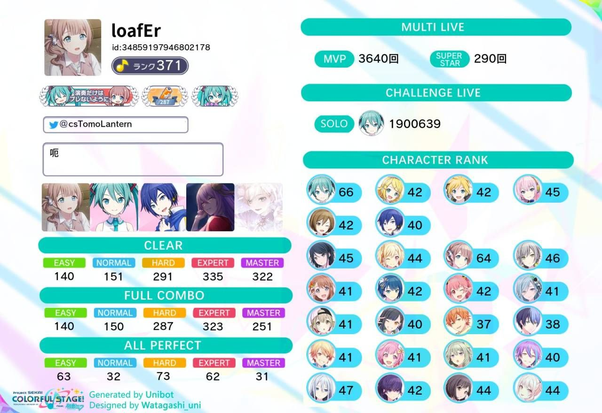

----

##### 60.[0] \<pid:712537926\> 2023-08-31 16:45:51 by 時雨_
>[jump](#pid712513242) 欲与深蓝丶c(2023-08-31 14:55) 说: 
>
>。。。印象里好像是没有的，我自己用的是游戏内一键编队加成最高然后再自己微调。
>
>顺带说一句这期活动的加成真的很脑浆，不抽卡基本没加成。我自己也很久没打过8加成不到的活动了。

好的感谢
是不是不同sekai的v也能触发同队双倍啊？换来换去好像是用一队粉v综合最高 还是我box不均衡的原因

----

##### 61.[0] \<pid:712587238\> 2023-08-31 21:13:51 by 想给夏尔米当狗
大佬我是刚入坑的萌新，我想知道打活动的时候，大部分的hard我能fc，然后master基本都连不了，会断，这种时候选哪个难度得分比较高啊，因为我已经没有材料升卡了，所以想尽量打的分高一点少拖队友一点点后腿

----

##### 62.[0] \<pid:712754128\> 2023-09-01 16:16:34 by 梿莱
>[jump](#pid712587238) 想给夏尔米当狗(2023-08-31 21:13):

自己去单人试啊

----

##### 63.[0] \<pid:712769242\> 2023-09-01 17:27:09 by LegendGX
>[jump](#pid712587238) 想给夏尔米当狗(2023-08-31 21:13) 说: 
>
>大佬我是刚入坑的萌新，我想知道打活动的时候，大部分的hard我能fc，然后master基本都连不了，会断，这种时候选哪个难度得分比较高啊，因为我已经没有材料升卡了，所以想尽量打的分高一点少拖队友一点点后腿

哪个能fc选哪个基本不会错，绝大部分情况都适用，断一次尤其是断中间亏的分都比不同难度之间的差距大，断次数多了就亏的更多

----

##### 64.[0] \<pid:712777213\> 2023-09-01 18:06:45 by 音之幻风
>[jump](#pid712587238) 想给夏尔米当狗(2023-08-31 21:13):

这个得根据实际情况判断了。。

关于谱面等级和combo加成的具体影响，可以试着在网上搜一下它们的精确算法。然后再根据自己的实力精度去判断。

简单理解的话，谱面每提升1级，分数系数+0.005(可以简单理解成你的理论分数倍率提高0.5%)
游戏期间combo每到100的倍数，分数倍率+1%，最高到1000combo时的+10%。

大多情况下，mas谱面能稳定过一半combo，成绩一般是足够碾压expFC了。

不过注意great是perfect的70%分数。如果mas会对精度产生额外影响的话，还得需要自己再想想。。

我自己的习惯是，单人能mas clear的谱面，协力必定直接mas。
除了分数影响通常比较小，这也更容易让自己适应谱面，方便于硬实力提升。

----

##### 65.[0] \<pid:712925333\> 2023-09-02 15:57:12 by 欲与深蓝丶c
>[jump](#pid712537926) 時雨_(2023-08-31 16:45):

可能是V的综合里加成高原因，家具这边是默认生效综合力更高的那个。

----

##### 66.[0] \<pid:712925665\> 2023-09-02 15:59:32 by 梿莱
>[jump](#pid712537926) 時雨_(2023-08-31 16:45):

全v能触发Vsinger同队加成

----

##### 67.[0] \<pid:714690256\> 2023-09-11 19:48:15 by 欧阳彧珝
不懂就问，多人live里那个总分有啥用，最后结算报酬的时候好像还是看自己的分数吧

----

##### 68.[0] \<pid:714755566\> 2023-09-12 08:36:38 by LegendGX
>[jump](#pid714690256) 欧阳彧珝(2023-09-11 19:48) 说: 
>
>不懂就问，多人live里那个总分有啥用，最后结算报酬的时候好像还是看自己的分数吧

影响评价，S评A评B评的基础经验和掉落素材有差别，只不过现在大家综合力高了基本上没啥可能掉下S评，很久以前大家综合力都还不算太高+掉线没改评价线的时候掉线一个人基本就告别S评价了，现在4个中高配猛男带个全1星萌新都是随便拿S的应该

----

##### 69.[0] \<pid:714885528\> 2023-09-12 19:30:19 by 欧阳彧珝
顺便想问一句，养成的主要方向大概是什么呢
master rank和技能等级是更优先倾斜给4星还是3星好
还有角色卡后篇的问题，需要开吗，优先3星还是4星呢
~~顺便好缺金币，有必要在活动商店里买吗~~

----

##### 70.[0] \<pid:714960118\> 2023-09-13 08:02:48 by 欲与深蓝丶c
>[jump](#pid714885528) 欧阳彧珝(2023-09-12 19:30):

~~刚看到这个问题我的第一反应还真就是就是喜欢什么练什么，无脑抽自推卡练。但是想了想还是抠点别的。~~
我个人而言，养成还是以自己为主，喜欢什么练什么，有奖励也顺便拿下。所以我认为的养成的主要方向是：
挖矿&gt;更好的打活动&gt;自推角色更高的综合力&gt;凑一队同色同队的满练四星&gt;其它。

关于MasterRank，个人认为无脑给喜欢的角色就可以，每个人都有不一样的的想法：
我个人的排序是：
全部1、2星卡(说白了为了挖矿)&gt;自推三星卡&gt;自推FES限定卡&gt;自推活动限定卡&gt;优质卡面三星&gt;其它限定卡的优质发型。
挑战LIVE的100W分数可以拿到很多水晶，我自己其实也练了不少三星凑综合力(还是为了挖矿)。

技能的话如果为了组队强度可以优先点那种有队伍组队技能加成的四星限定活动VS卡，点技能更多情况是为了凹自己的组队得分上限，如果不考虑喜欢什么卡就点什么卡的技能。
我个人更喜欢看技能种类点，优先考虑自推。其次就是冲榜时考虑技能类型点，哪张卡技能的效果更强点那张卡。我个人认为的优先级如下：
组队得分(只有活动限定的应援虚拟歌手有这类技能)&gt;血量得分(根据当前血量获得额外得分)&gt;判定得分(在出现判定good及以下前有额外加分)&gt;完美得分(打PERFECT判定有加分，其它判定等级不加分)&gt;无条件加分&gt;奶判卡，由于判卡技能提升等级是加持续时间，三星的话可以优先点判卡。

卡面后编有剧情，还能给卡面加综合力，顺便还能拿点水晶，何乐而不为。讲真也是一样喜欢谁开谁的，打活动组队哪张卡没开就开哪张卡。

以前只听说大概会在300级的时候家具满，金币这边自从开了家具等级上限之后就真的是无底洞了。活动商店里的金币无限的那个点数溢出了才考虑换一般都是不建议换的，那个10000点数的金币可以考虑换，但是在我这边其它材料的优先级会更高些。~~最近比较咸鱼，基本上都拿卡水晶拿完体力换完就走人了，以前还考虑过换心愿之泪再后来彻底摆烂。~~

如最开始说的，这游戏养成其实可以更随心所欲一点，我个人认为底线就是在保证活动奖励里的卡牌和水晶能拿到的前提下完全就可以喜欢谁练谁。卡面可以在萌百SEKAI角色个人页面/sekai.best/viewer.unipjsk.com都是查得到的，喜欢什么卡面练谁就可以，我自己还拿了不少卡面当幻灯片壁纸。~~感觉抠了一大段没啥用看着还挺累的字，后面想到什么再补吧。~~   

----

##### 71.[0] \<pid:714987040\> 2023-09-13 10:14:13 by LegendGX
>[jump](#pid714885528) 欧阳彧珝(2023-09-12 19:30) 说: 
>
>顺便想问一句，养成的主要方向大概是什么呢
>master rank和技能等级是更优先倾斜给4星还是3星好
>还有角色卡后篇的问题，需要开吗，优先3星还是4星呢
>~~顺便好缺金币，有必要在活动商店里买吗~~

楼主说的比较详细了，补充一些个人看法
养成的方向取决于你自己怎么玩或者说怎么看待这个游戏，有没有在游戏里找到自己主推的角色？还是说对各个角色的感觉都差不多没啥特别偏爱的。
如果是前者，那么后续一连串的问题呼之欲出，喜欢这个角色的程度有多深？想不想要收集这个角色的全4星卡？想不想把这个角色的角色rank升高来获得更高等级的粉丝牌来展示自己对这个角色的爱？想不想在这个角色封面的箱推活动上冲一次榜？如果想，那么你应该把几乎所有稀有资源都留给它，除非你很有钱能一直抽卡补充纯结晶和碎片，否则单推一个角色到极致的话双月卡的资源也是不够用的，当然少量的碎片给1/2星角色升 master rank和技能来提升其他角色的rank获取钻石的挖矿行为是完全合理的，这是重要的抽卡资源

如果是后者，主要为了活动多拿点pt的话，那楼主说的很详细了，都可以参考，卡面故事后篇这种只开你当前活动会用的卡就行，以这个方式去开的话到后期彩gem会溢出，但前中期集中开的时候会特别缺，比如你连着几期活动都要开好几张三四星，会一下子吃掉很多
金币的缺口对不冲前百的普通人来讲几乎是无底洞，每期活动交换所里那个10w金币我一般都会换掉，其他的重要选项都换完之后我会跳过次要选项直接换金币(加起来也就没多少其实)

----

##### 72.[0] \<pid:715038963\> 2023-09-13 13:53:26 by 欧阳彧珝
>[jump](#pid714960118) 欲与深蓝丶c[/uid] (2023-09-13 08:02)</b>
<b>Reply to [pid=714987040,37157108,4]Reply[/pid] Post by [uid=6221009]LegendGX(2023-09-13 10:14):

感谢两位大佬的回复~~好长~~

----

##### 73.[0] \<pid:715740686\> 2023-09-16 22:38:02 by Clathrate_
烤后期会对四指有硬性要求吗电脑玩md玩多了多指只会用键盘打了

----

##### 74.[0] \<pid:715758803\> 2023-09-17 00:32:59 by 以一持万
>[jump](#pid715740686) 北慕离殇(2023-09-16 22:38):

可以去b站搜搜高难度谱面的手元，我看36难度那几个还是有dalao双指扛大部分铺面的，37的好像就不是很行了
不过这已经是很后期很后期了，对我这种27、28选手来说就是纯看看

----

##### 75.[0] \<pid:716040798\> 2023-09-18 15:07:43 by 音之幻风
>[jump](#pid715740686) 北慕离殇(2023-09-16 22:38):

个人体感的话。。29往下的话一般没太大要求，甚至可能有双指游玩更舒服的情况。
30往上的话，会四指手法会更流畅一些，手指之间的压力也能平衡不少，尤其是出现大量从左到右一排楼梯键的时候。
37单独拉出来，它谱面是强制至少四指，而实际配置上可能需要用到六指的手法。

----

##### 76.[0] \<pid:716067927\> 2023-09-18 17:33:14 by 欲与深蓝丶c
>[jump](#pid715740686) 北慕离殇(2023-09-16 22:38):

个人认为如果理论真正意义上的双指打不了的谱只有37级谱面，包括36及以下的谱在B站上基本上都是有双指甚至是手持手元的。

31以下的谱子双指打基本上是不会有太大问题的。
31基本上就是分水岭了，纯双指就感觉就有些难度了，不过也不是不能打会多指肯定是更好一些。
直到37谱面内含四押双指严格意义上是打不了的也就是所谓的硬性要求四指。

----

##### 77.[0] \<pid:716552638\> 2023-09-21 01:05:36 by Luckyの小孩
请问一下活动没换的2x和3x角色还有机会再获得吗，我看pjsk没有活动复刻的说法

----

##### 78.[0] \<pid:716580920\> 2023-09-21 08:54:35 by 欲与深蓝丶c
>[jump](#pid716552638) Luckyの小孩(2023-09-21 01:05) 说: 
>
>请问一下活动没换的2x和3x角色还有机会再获得吗，我看pjsk没有活动复刻的说法

有的。

二星三星大概会在活动结束后半年之后进入卡池和贴纸商店，非限定四星会在活动结束后一年后进入贴纸商店。

----

##### 79.[0] \<pid:716653866\> 2023-09-21 14:13:56 by 欧阳彧珝
想问一点音游相关的问题，个人现在水平大概是能轻松fc大部分红谱26级左右的歌，红谱大部分27级歌和少部分28级歌都可以初见过
个人现在expert的melt结尾那一段交互，每次都会掉
因此想问一下类似的配置该怎么练习呢，或者有没有推荐的练习曲()

----

##### 80.[1] \<pid:716656798\> 2023-09-21 14:28:12 by Luckyの小孩
>[jump](#pid716653866) 欧阳彧珝(2023-09-21 14:13) 说: 
>
>想问一点音游相关的问题，个人现在水平大概是能轻松fc大部分红谱26级左右的歌，红谱大部分27级歌和少部分28级歌都可以初见过
>个人现在expert的melt结尾那一段交互，每次都会掉
>因此想问一下类似的配置该怎么练习呢，或者有没有推荐的练习曲()

可以只练パラソルサイダー紫谱一开始的交互(ex是25解锁应该没问题)，虽然比メルト最后交互速度稍快一点，但是可以打完就重新开效率最高  或者脑浆炸裂ガール ex(28)

----

##### 81.[0] \<pid:717237914\> 2023-09-24 16:49:06 by 延误列车
想问问fes池出的四个普限四星会复刻吗

----

##### 82.[0] \<pid:717267973\> 2023-09-24 20:14:24 by 佛系PCR
>[jump](#pid717237914) UID:65268678(2023-09-24 16:49):

会的

----

##### 83.[0] \<pid:717301187\> 2023-09-24 23:51:42 by 欲与深蓝丶c
>[jump](#pid717237914) 延误列车(2023-09-24 16:49):

普限会复刻，但是不是FES的池子抽卡概率还是3%。

友情提醒：抽卡有风险，下池需谨慎。

----

##### 84.[0] \<pid:717335272\> 2023-09-25 09:05:05 by 咻卡咻的蜜柑
通行证打完的要求大概是啥？我每日auto10次摸完，每天2体清体力，感觉还是差了一截，一个月自回体真的来得及？

----

##### 85.[0] \<pid:717360176\> 2023-09-25 11:02:48 by 日野森镜华
>[jump](#pid717335272) 咻卡咻的蜜柑(2023-09-25 09:05):

通行证开个小月卡会轻松很多，小月卡打歌拿的通行证点数会翻倍，不开就得猛肝了

----

##### 87.[2] \<pid:717375304\> 2023-09-25 12:08:51 by LegendGX
>[jump](#pid717335272) 咻卡咻的蜜柑(2023-09-25 09:05) 说: 
>
>通行证打完的要求大概是啥？我每日auto10次摸完，每天2体清体力，感觉还是差了一截，一个月自回体真的来得及？

之前好像跟群友算过，无课只靠自回体好像挺极限的
假设7小时睡眠+3体一把清体(2体一把实行起来过于折磨了)，每天清体是206点(溢出2小时自回体=每天可清22小时自回体=44点体力=14把3体+1把2体)，每天协力前3把额外送10点+每日挑战30点，每天共266点，30天共7989点，31天共8246点，加1500点活动任务(上中下旬各一期，每期500点)，加336点(8天)/378点(9天)cheerful白嫖体力，共9825点(30天)/10124点(31天)，再加升级送的体力，3级=30体=140点，30天的情况下勉强差一点，升级升的多则可能完全白嫖，31天则能有不少容错(可以周末多睡一会儿或者体力溢出忘记清几个小时)

有一个小技巧，31天的月份点数提前打满的情况下，第31天23点前5小时开始存体并留着当天的每日挑战和9点cheerful白嫖体力到23点刷新之后再清，则可以用来缓解后面一个月的压力，如果差一点点升级则更加需要留着给后一个月哪怕会溢出几个小时的自回体，我有小月卡也是这么干的，可以后让一个月的进度提前一点拿到奖励

----

##### 88.[0] \<pid:717402340\> 2023-09-25 14:26:51 by 咻卡咻的蜜柑
>[jump](#pid717360176) 镜华_(2023-09-25 11:02) 说: 
>
>通行证开个小月卡会轻松很多，小月卡打歌拿的通行证点数会翻倍，不开就得猛肝了

好好好这个方案好极了

----

##### 89.[2] \<pid:718338510\> 2023-09-30 08:17:21 by 欲与深蓝丶c
祝各位三周年快乐！

一更新游戏一切都变得那么的陌生。新视觉效果、新UI 、新键和我意料之中的渣优化(

希望大家能好好享受三周年～(更新完感受到自己的板子性能有些不够了)

以上！

----

##### 90.[0] \<pid:718339510\> 2023-09-30 08:28:45 by 夕下梨落
开周年池子来问问抽卡策略 这池子值得allin么？新娘池子以后一直在攒三个月憋了12w石头这池子是没普池角色还是只是单纯能歪出限定？

----

##### 91.[0] \<pid:718350787\> 2023-09-30 10:03:49 by 欧阳彧珝
想问问大佬有没有ios板子推荐，有点想买个2021

----

##### 92.[0] \<pid:718353615\> 2023-09-30 10:24:42 by 欲与深蓝丶c
>[jump](#pid718339510) 夕下梨落(2023-09-30 08:28):

这个池子会抽到普池卡但是没有up普池角色，FES卡池是可以歪出前几期FES限定卡的。如果有自推和冲榜需求建议是抽取。

我个人来说FES池子最少会抽一发试试水。周年卡池的<b>前5日</b>是2+4的6up的6%概率的FES池子~~大毒池~~，不说其他的4星概率翻倍还是挺香的，如果目标仅仅只是<b>想抽到更多的4星</b>(注意是<b>仅仅</b>)个人是很建议无脑抽FES池子的。开启5天后FES卡池会关闭，变成4up的3%概率的活动限定池子，<b>井券票继承FES卡池，且有偿10连1500水晶也重置</b>。

我个人所知的这个卡池可操作的空间可能就是转换池子的时候有偿十连重置和有偿每日一抽抽十次可以换一张限定井贴纸。

lz友情提醒：攒石头真的很辛苦，什么都想要只会倾家荡产。抽卡也有一定风险，在下池时一定要做好吃井的准备(如果多推甚至要考虑吃多次井的准备)。
最后祝大家抽卡顺利抽卡愉快！<h4 class='subtitle'>从这边开始是楼主的自说自话，瞎写的不看也没啥影响。</h4>抽卡池我个人喜欢从以下角度出发：
1.池内是否有自推。
2.FES池内up的是否有自己正好缺少组合的非自推角色和对应属性作为组件的限定卡需要抽取。(强度角度考虑，不在意可以忽略)
3.是否需要冲榜。
4.池内up的是否有自己正好缺少组合的非自推角色缺少和对应属性作为组件的四星卡牌需要抽取。(强度角度考虑，不在意可以忽略)

1.有可以无脑以自推为目标冲，但是如果是6捞1的话建议做好要吃井的觉悟。
2.非自推对我而言优先级不高，从强度考虑同队同色组队仅仅正好缺那么一张但是可以抽几发试试水但是不建议深入。
3.从效率和减轻压力的角度考虑，目标是3000以内的卡池内的活动4星建议是全抽(但不意味着3000以外的排行不抽卡就很好冲)。
4.如果仅仅只是单吊的话个人认为几乎是不考虑抽取，很容易为了醋包一桌饺子。但是如果正好目标比较多可以考虑抽。

有一个论外的是有应援组合的虚拟歌手的活动限定卡，此类卡牌从强度上来说用于带队是非常建议抽取的，不考虑强度抽不抽就看是否是自推或者卡面是否喜欢了。

----

##### 93.[0] \<pid:718355852\> 2023-09-30 10:40:07 by 欲与深蓝丶c
>[jump](#pid718350787) 欧阳彧珝(2023-09-30 10:03):

最近烤解锁了高帧率模式，这个时间点买板子不建议考虑非高刷屏板子。
iOS我自己是用的iPad 8(2020)，非全贴合屏幕眼睛盯得还蛮痛苦的而且没有高刷，再加上烤最近的优化也没做好游戏体验很一言难尽。
有条件建议是一步到位上iPad Pro，11还是12.9看自己了(但是就是确实挺贵的)。
没有高刷的iOS机器这边小尺寸的iPad Mini6以外游戏体验意外的不错；至于Air我个人不是很喜欢，Apple对他的定位有些模糊而且加一些钱可以直接上Pro了，对我而言确实没什么性价比，如果要考虑买Air其实可以看看安卓板子。

安卓这边我个人不是很了解，了解过一些：如果”想用米板玩的快乐需要有一定动手能力”这样的说法，至于其它品牌就属于完全不了解的范畴了。
在买之前可以上视频网站看看有没有人用对应型号的板子测一测音游。我个人来说有预算会直接买Apple，没有多少预算的话可以看看米板挺便宜的还大碗。

----

##### 94.[1] \<pid:718367825\> 2023-09-30 11:57:10 by 夕下梨落
>[jump](#pid718353615) 欲与深蓝丶c(2023-09-30 10:24) 说: 
>
>这个池子会抽到普池卡但是没有up普池角色，FES卡池是可以歪出前几期FES限定卡的。如果有自推和冲榜需求建议是抽取。
>
>我个人来说FES池子最少会抽一发试试水。周年卡池的<b>前5日</b>是2+4的6up的6%概率的FES池子~~大毒池~~，不说其他的4星概率翻倍还是挺香的，如果目标仅仅只是<b>想抽到更多的4星</b>(注意是<b>仅仅</b>)个人是很建议无脑抽FES池子的。开启5天后FES卡池会关闭，变成4up的3%概率的活动限定池子，[b]井券票继承FES卡池，且有偿10

我回来了 9w石头出去刚好警戒线出了想要的自选fes限up....差点在和毒池的搏斗中牺牲

----

##### 95.[0] \<pid:718374570\> 2023-09-30 12:40:26 by 欲与深蓝丶c
>[jump](#pid718367825) 夕下梨落(2023-09-30 11:57):

该说很符合我对烤大毒池的想象吧。。。。

----

##### 96.[0] \<pid:720272798\> 2023-10-10 20:58:27 by NoxiousYu
想问问大佬有没有什么看平面谱面比较方便的网页，Sekai Viewer有时候会加载不出来，日版的谱面保管所要翻出去有点麻烦orz

----

##### 97.[0] \<pid:720299488\> 2023-10-11 00:22:47 by 欲与深蓝丶c
>[jump](#pid720272798) NoxiousYu(2023-10-10 20:58):

我个人用QQ频道的Unibot和Unibot那个资料站([url](https://viewer.unipjsk.com/))会比较多一点。
其它倒是用的挺少的，之前SEKAI Viewer国内加速支持结束之后也很少用了属于偶尔会用。

----

##### 98.[0] \<pid:720338862\> 2023-10-11 09:49:02 by LegendGX
>[jump](#pid720272798) NoxiousYu(2023-10-10 20:58) 说: 
>
>想问问大佬有没有什么看平面谱面比较方便的网页，Sekai Viewer有时候会加载不出来，日版的谱面保管所要翻出去有点麻烦orz

还有个pjsek.ai 我手机开了下发现能打开，不过加载有点慢
在songs那页可以看谱

----

##### 99.[0] \<pid:720716130\> 2023-10-13 02:11:44 by 西窗语
想问一个协力live选曲的问题
个人偏好在稍微有点冲榜需求的活动里手选自己喜欢的曲子~~冲榜已经很痛苦了只有收藏夹随机才能让自己快乐一点~~
之前是单独收藏了一栏心头好列表，在solo里切到这一栏随便点一首，之后无论再进多少次协力都会固定显示收藏栏，沿着列表点下去或者随便糊一首都很方便(致力于把指定选曲提到和点おまかせ一个速度)
三周年更新之后这个方法好像不好使了，虽然进协力确实是之前选的曲子，但列表是默认的すべて
请问有没有什么设置可以达成之前那种效果的，还是从此只能再多点一次左边的栏了

----

##### 100.[0] \<pid:720791587\> 2023-10-13 12:42:59 by 欲与深蓝丶c
>[jump](#pid720716130) 西窗语(2023-10-13 02:11):

这个好像还真没有什么好办法。。。只能期待CP愿意修改页面的逻辑了

----

##### 101.[0] \<pid:720800253\> 2023-10-13 13:29:43 by 西窗语
>[jump](#pid720791587) 欲与深蓝丶c(2023-10-13 12:42):

谢谢解答
只能安慰自己打个5k1w也不需要选很多次了

----

##### 102.[0] \<pid:721136110\> 2023-10-15 13:48:28 by 欧阳彧珝
不懂就问
现在打好多26的红谱开始出现掉绿条的情况了，想请问一下大佬该怎么处理
每次协力的时候都经常能看到有人可以隐藏难度，想问一下怎么设置

----

##### 103.[0] \<pid:721150965\> 2023-10-15 15:41:30 by 欲与深蓝丶c
>[jump](#pid721136110) 欧阳彧珝(2023-10-15 13:48):

中长绿条应该都不难跟着按就可以了；短绿条跟着节奏可以稍微打快点；超短绿条可以当单点打。
键宽小的绿条可以用多指放置糊(PS：好像只有烤行，邦会掉的)，新键型的绿条没有尾判节点打上就可以了。

关于协力页面难度隐藏相关今天遇到了一把不知道是不是你说的那种，我遇到的属于是没有难度字但是还有难度主题色还是对应的。
所以我个人认为是新更新出来的显示bug，以前也有选难度难度标变成白板的显示bug。
(而且协力选完歌的选难度页面歌曲封面的左下角各难度的通关进度显示错误bug还是没修)

----

##### 104.[0] \<pid:721222494\> 2023-10-16 00:01:20 by 一只普通的兔子
之前玩邦邦的，感觉随便注册了一个国际服的号发现打打就20w名了。好奇日服多少人。国服邦邦的可是只有2w人参加活动的感觉。真的有那么多人玩么？就好奇

----

##### 105.[0] \<pid:721265417\> 2023-10-16 10:10:08 by 夕下梨落
>[jump](#pid721222494) 一只普通的兔子(2023-10-16 00:01) 说: 
>
>之前玩邦邦的，感觉随便注册了一个国际服的号发现打打就20w名了。好奇日服多少人。国服邦邦的可是只有2w人参加活动的感觉。真的有那么多人玩么？就好奇

之前17w左右战力每天三餐后各一把单人能基本卡在10w线上(什么饭后遛弯辅助小软件) 

----

##### 106.[0] \<pid:721268736\> 2023-10-16 10:25:11 by 一只普通的兔子
>[jump](#pid721265417) 夕下梨落(2023-10-16 10:10):

人好多好羡慕啊。感觉pjsk确实比邦邦进步很多。有些系统真的很想也能要。可惜没国服。

----

##### 107.[0] \<pid:721498799\> 2023-10-17 12:10:03 by 欲与深蓝丶c
>[jump](#pid721222494) 一只普通的兔子(2023-10-16 00:01):

日服活跃的大概也是15W左右吧，确实没有检索到一个具体的数据。。。

最近国邦的热度有MyGo!!!!!动画的输血明显会比之前好一些些，打协力也能看到从MyGo!!!!!人。
至于国烤的话上次放消息还是日服一周年的海外服企划有过一点风声，到现在也没有一点稍微详尽一点的消息，个人感觉还挺难的。
不过未来谁知道呢。

----

##### 108.[0] \<pid:721673243\> 2023-10-18 10:24:47 by mryest
我也是打邦的，但烤这个编队和加成这里有点整不明白

编队好像一定是4+1，编队里vs成员的区域加成是叠加的吗？比如我升了vbs世界里miku的加成道具，我ln标志的miku能吃到这个加成吗？

能吃到的话，那我想升满一个团队的全部加成是不是就是植物+世界里该团加成+全部世界的vs加成？

----

##### 109.[0] \<pid:721694321\> 2023-10-18 11:52:13 by 欲与深蓝丶c
>[jump](#pid721673243) mryest(2023-10-18 10:24):

MIKU由于初始的SEKAI每个都有所以区域加成道具是散落在每个SEKAI的，一共有5个满级(Lv.15)一个6%合计是30%，升级消耗的金币比起其他角色也是有所折算的。

而除了MIKU外其他VS的加成是基本上都是在初始登场的SEKAI那边，满级(Lv.15)直接给30%综合力加成。
比如LUKA在教室的SEKAI、RIN在舞台的SEKAI、LEN和MEIKAO在街道的SEKAI、KAITO在仙境的SEKAI，而没有人的SEKAI最开始只有MIKU登场所以是只有MIKU的加成道具。

结论：只要是点了VS相关的家具(包括VS组合和VS角色)的对应角色卡都是可以无视应援组合吃到加成的，如果组合加成有冲突会自动生效数值更高的那个。
如果想看到具体加成逻辑或者目前理论能达到多少加成可以看下#4，那边有说明。

----

##### 110.[0] \<pid:721784317\> 2023-10-18 19:54:31 by mryest
>[jump](#pid721694321) 欲与深蓝丶c(2023-10-18 11:52) 说: 
>
>MIKU由于初始的SEKAI每个都有所以区域加成道具是散落在每个SEKAI的，一共有5个满级(Lv.15)一个6%合计是30%，升级消耗的金币比起其他角色也是有所折算的。
>
>而除了MIKU外其他VS的加成是基本上都是在初始登场的SEKAI那边，满级(Lv.15)直接给30%综合力加成。
>比如LUKA在教室的SEKAI、RIN在舞台的SEKAI、LEN和MEIKAO在街道的SEKAI、KAITO在仙境的SEKAI，而没有人的SEKAI最开始只有MIKU登场所以是只有MIKU的加成道具。
>
>结论：只

完全明白了！非常感谢

----

##### 111.[0] \<pid:721815444\> 2023-10-18 23:44:44 by 欧阳彧珝
>[jump](#pid721150965) 欲与深蓝丶c(2023-10-15 15:41) 说: 
>
>中长绿条应该都不难跟着按就可以了；短绿条跟着节奏可以稍微打快点；超短绿条可以当单点打。
>键宽小的绿条可以用多指放置糊(PS：好像只有烤行，邦会掉的)，新键型的绿条没有尾判节点打上就可以了。
>
>关于协力页面难度隐藏相关今天遇到了一把不知道是不是你说的那种，我遇到的属于是没有难度字但是还有难度主题色还是对应的。
>所以我个人认为是新更新出来的显示bug，以前也有选难度难度标变成白板的显示bug。
>(而且协力选完歌的选难度页面歌曲封面的左下角各难度的通关进度显示错误bug还是没修)

啊这，原来是bug

----

##### 112.[0] \<pid:721884794\> 2023-10-19 11:40:02 by 欲与深蓝丶c
>[jump](#pid721784317) mryest(2023-10-18 19:54):

烤家具的好处：换队不用多点一键变更

----

##### 113.[0] \<pid:721884934\> 2023-10-19 11:40:38 by 欲与深蓝丶c
>[jump](#pid721815444) 欧阳彧珝(2023-10-18 23:44):

我个人倾向是BUG，现在好像底色都是新难度的确实是看不出来，不过结算界面应该是看得到的。

----

##### 114.[0] \<pid:722423130\> 2023-10-22 09:29:43 by mryest
>[jump](#pid721884794) 欲与深蓝丶c(2023-10-19 11:40) 说: 
>
>烤家具的好处：换队不用多点一键变更

你这么一说今天我突然想起来一个问题

因为貌似类型加成(happy，cool这些)也是不互相顶的，那先不考虑活动加成的情况下，似乎好像没有特别的必要组同type的队？

----

##### 115.[0] \<pid:722462984\> 2023-10-22 13:58:44 by 欲与深蓝丶c
>[jump](#pid722423130) mryest(2023-10-22 09:29):

不考虑极限综合力和活动加成是可以的。

不过三周年后的四星卡面即使是未提升MasterRank的前提下非加成角色和加成色都有至少10%的活动加成。个人感觉如果有高MR非加成色和加成角色的四星卡是可以顶替同色的加成角色二星卡的(三星还有待验证)。

但是如果在都有四星的前提下要考虑极限综合力还有加成的话还是很有必要的，毕竟同色卡的色卡家具加成是翻倍的。

----

##### 116.[0] \<pid:722470881\> 2023-10-22 15:01:14 by ahi912
激唱append完整版是怎么解锁的呀

----

##### 117.[0] \<pid:722506340\> 2023-10-22 18:50:31 by 欲与深蓝丶c
>[jump](#pid722470881) ahi912(2023-10-22 15:01):

是三周年的限时挑战，目前已经过期只能等下次上架了。

----

##### 118.[0] \<pid:722630214\> 2023-10-23 10:38:27 by LegendGX
>[jump](#pid722423130) mryest(2023-10-22 09:29) 说: 
>
>你这么一说今天我突然想起来一个问题
>
>因为貌似类型加成(happy，cool这些)也是不互相顶的，那先不考虑活动加成的情况下，似乎好像没有特别的必要组同type的队？

5张颜色一样的卡是有额外加成的(很简单的测试，5张同色，其中一张换个同角色的其他颜色，master rank保持一致，花草等级保持一致甚至更高，综合力反而下降1万多)
5人同属一个unit则可以吃翻倍的unit家具加成，4人同队+1张同色5破其他队的4星，把这张其他队的5破换成同色同队0破的4星综合力涨了8千
至于怎么取舍就看个人了

----

##### 119.[0] \<pid:724243475\> 2023-10-31 12:01:46 by 欧阳彧珝
不懂就问，原始组合的虚拟歌手，在组原创组合的队伍时，能否触发区域组合道具效果翻倍？

----

##### 120.[0] \<pid:724253631\> 2023-10-31 12:51:57 by LegendGX
>[jump](#pid724243475) 欧阳彧珝(2023-10-31 12:01) 说: 
>
>不懂就问，原始组合的虚拟歌手，在组原创组合的队伍时，能否触发区域组合道具效果翻倍？

这个自己拿同星级同色的换来换去试试就知道了，印象里以前试过一次是不触发的

----

##### 121.[0] \<pid:724369661\> 2023-10-31 23:24:20 by Skyrim01
问一下大佬野队送体力有什么说法吗，有要回礼的传统吗

有时候会收到别人送的3体力，一直以为是全队都有的，今天想试一下才发现好像只能送一个人？

----

##### 122.[0] \<pid:724417820\> 2023-11-01 09:39:18 by LegendGX
>[jump](#pid724369661) Skyrim01(2023-10-31 23:24) 说: 
>
>问一下大佬野队送体力有什么说法吗，有要回礼的传统吗
>
>有时候会收到别人送的3体力，一直以为是全队都有的，今天想试一下才发现好像只能送一个人？

一般来得及会随手回，每天可以免费送3次，收也是收3次，收益最大化的情况下每天3次都是要想办法收满的，和路人互换就是其中一种方式，还剩次数的时候可以找朋友互换

----

##### 123.[0] \<pid:724427394\> 2023-11-01 10:18:08 by Skyrim01
>[jump](#pid724417820) LegendGX(2023-11-01 09:39) 说: 
>
>一般来得及会随手回，每天可以免费送3次，收也是收3次，收益最大化的情况下每天3次都是要想办法收满的，和路人互换就是其中一种方式，还剩次数的时候可以找朋友互换

原来如此，感谢

----

##### 124.[0] \<pid:724560246\> 2023-11-01 20:44:30 by 莉莉丝一生推
想问一下交换所里面那个黄色的换三星卡的券是什么网上找半天没找到

----

##### 125.[0] \<pid:724594176\> 2023-11-02 00:47:14 by 欲与深蓝丶c
>[jump](#pid724427394) Skyrim01(2023-11-01 10:18):

我自己印象里好像是建号送的一张三星兑换券，我自己的已经被我换初始25葱用掉了。

----

##### 126.[0] \<pid:724599139\> 2023-11-02 01:53:14 by Skyrim01
>[jump](#pid724594176) 欲与深蓝丶c(2023-11-02 00:47) 说: 
>
>我自己印象里好像是建号送的一张三星兑换券，我自己的已经被我换初始25葱用掉了。

大佬应该是回复上面那条的吧，回错人啦

这个三星券我也有印象，我自建号的时候也送了，我换了三星Saki

----

##### 127.[0] \<pid:724645195\> 2023-11-02 10:43:12 by 欲与深蓝丶c
>[jump](#pid724599139) Skyrim01(2023-11-02 01:53):

。。。sry确实回错人了，当时刚下班有点神志不清+

总而言之我的印象里确实是有这么一回事

>[jump](#pid724560246) 莉莉丝一生推(2023-11-01 20:44) 说: 
>
>想问一下交换所里面那个黄色的换三星卡的券是什么网上找半天没找到

实在是很抱歉没有回到了，有空的话请务必看下#125

----

##### 128.[0] \<pid:724667987\> 2023-11-02 12:19:57 by Skyrim01
>[jump](#pid724645195) 欲与深蓝丶c(2023-11-02 10:43) 说: 
>
>。。。sry确实回错人了，当时刚下班有点神志不清+
>
>总而言之我的印象里确实是有这么一回事
>
>实在是很抱歉没有回到了，有空的话请务必看下#125

快1点才下班吗太辛苦了

----

##### 129.[0] \<pid:724673396\> 2023-11-02 12:47:11 by 欲与深蓝丶c
>[jump](#pid724667987) Skyrim01(2023-11-02 12:19):

感谢关心——
准确来说是刚到家洗漱完，最近的话是会比较忙一些不过平常也是差不多这个点。

如果有上NGA会来回帖，不过一般是倒头就睡了

----

##### 130.[0] \<pid:724806723\> 2023-11-03 02:43:13 by Asche1017
问问佬各种2dmv的曲绘有获取途径吗？只找到了高清卡面的网站，找不到曲绘的……打歌的时候突然被背景的漂亮妹妹吸引了注意力却找不到原图好悲伤

----

##### 131.[0] \<pid:724809733\> 2023-11-03 04:44:07 by nicamo9
>[jump](#pid724806723) Asche1017(2023-11-03 02:43) 说: 
>
>问问佬各种2dmv的曲绘有获取途径吗？只找到了高清卡面的网站，找不到曲绘的……打歌的时候突然被背景的漂亮妹妹吸引了注意力却找不到原图好悲伤

一般作者自己发推特，B站有搬运的可以找一下

----

##### 132.[0] \<pid:724885715\> 2023-11-03 13:25:34 by 夕下梨落
>[jump](#pid724806723) Asche1017(2023-11-03 02:43) 说: 
>
>问问佬各种2dmv的曲绘有获取途径吗？只找到了高清卡面的网站，找不到曲绘的……打歌的时候突然被背景的漂亮妹妹吸引了注意力却找不到原图好悲伤

所以大佬 求那个高清卡图的网站十分感谢

----

##### 133.[0] \<pid:724897408\> 2023-11-03 14:29:37 by Asche1017
>[jump](#pid724885715) 夕下梨落(2023-11-03 13:25):

[url](https://sekai.best/)

----

##### 134.[0] \<pid:724924202\> 2023-11-03 16:43:26 by 時雨_
一进协力就卡99被ban六小时是不是sbga提醒我该退坑了

----

##### 135.[0] \<pid:724960210\> 2023-11-03 19:35:22 by gsimp
重复的4星在哪找啊 我出了个重复的白葱 看网上说会加音符和碎片 但我啥都没加啊 原本的白葱潜能也没变

找到了 100发一个四星 好想死… 25时这种池子是不是不能抽的

----

##### 136.[0] \<pid:724970305\> 2023-11-03 20:30:15 by Skyrim01
>[jump](#pid724924202) 時雨_(2023-11-03 16:43) 说: 
>
>一进协力就卡99被ban六小时是不是sbga提醒我该退坑了

5v5要开一局可太难了

----

##### 137.[0] \<pid:725011234\> 2023-11-03 23:23:51 by 時雨_
>[jump](#pid724970305) Skyrim01(2023-11-03 20:30) 说: 
>
>5v5要开一局可太难了

噔 噔 咚
这下有不得不退坑的理由了
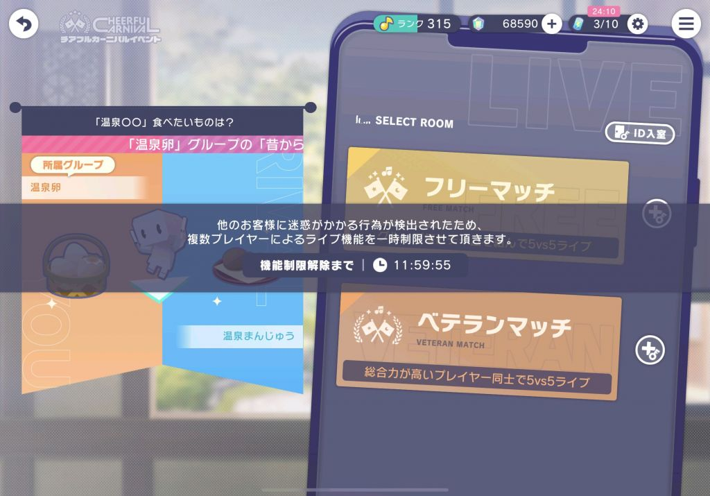

----

##### 138.[0] \<pid:725013936\> 2023-11-03 23:40:43 by Skyrim01
>[jump](#pid725011234) 時雨_(2023-11-03 23:23) 说: 
>
>噔 噔 咚
>这下有不得不退坑的理由了
>

Sega应该也意识到了自己的渣技术力不支持这样搞，尤其是这个5v5真的容易被动跳车今天好像发了个公告说要暂时放松处罚缓解状况来着

大佬这等级和钻量，退坑成本也太大了

----

##### 139.[0] \<pid:725015170\> 2023-11-03 23:48:38 by 欲与深蓝丶c
>[jump](#pid724924202) 時雨_(2023-11-03 16:43):

这种情况还挺常见了，我遇到的大多数其实只是单纯的卡99，实际上还在动能排到人的。

再有就是真卡了，会少见些。

----

##### 140.[0] \<pid:725015817\> 2023-11-03 23:52:49 by 欲与深蓝丶c
>[jump](#pid725013936) Skyrim01(2023-11-03 23:40):

只能感慨SBGA到现在才意识到，这种事情半周年第一次5V5到现在了还没有一个好的解决方法

希望他真的意识到了。希望。。。

----

##### 141.[0] \<pid:725019429\> 2023-11-04 00:18:22 by 時雨_
>[jump](#pid725013936) Skyrim01(2023-11-03 23:40) 说: 
>
>Sega应该也意识到了自己的渣技术力不支持这样搞，尤其是这个5v5真的容易被动跳车今天好像发了个公告说要暂时放松处罚缓解状况来着
>
>大佬这等级和钻量，退坑成本也太大了

真的有缓和吗没感觉到
我今天上午被ban从1小时一路叠到12小时 中间正常排进去打几局再卡掉线也不降级 这不就只能单人或者摆烂auto了吗 这期5v5档线低的原因找到了

----

##### 142.[0] \<pid:725019653\> 2023-11-04 00:19:55 by 時雨_
>[jump](#pid725015170) 欲与深蓝丶c(2023-11-03 23:48) 说: 
>
>这种情况还挺常见了，我遇到的大多数其实只是单纯的卡99，实际上还在动能排到人的。
>
>再有就是真卡了，会少见些。

我组队 匹配 加载阶段都能卡明天看看能不能被ban24小时

----

##### 143.[0] \<pid:725026396\> 2023-11-04 01:19:23 by 莉莉丝一生推
>[jump](#pid724594176) 欲与深蓝丶c(2023-11-02 00:47) 说: 
>
>我自己印象里好像是建号送的一张三星兑换券，我自己的已经被我换初始25葱用掉了。

感谢回复不过我自己的那张不知道去哪里了orz

----

##### 144.[0] \<pid:725103232\> 2023-11-04 14:10:30 by 時雨_
>[jump](#pid725019653) 時雨_(2023-11-04 00:19) 说: 
>
>我组队 匹配 加载阶段都能卡明天看看能不能被ban24小时

想笑
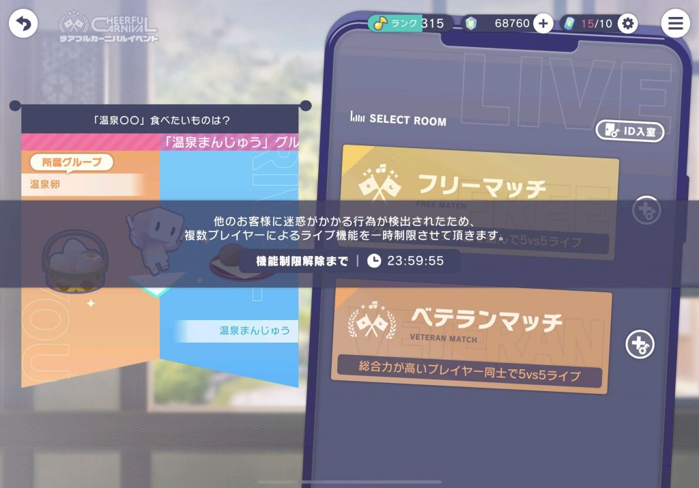

----

##### 145.[0] \<pid:725142745\> 2023-11-04 18:14:17 by LegendGX
>[jump](#pid725103232) 時雨_(2023-11-04 14:10) 说: 
>
>想笑
>

网络问题是比较无奈，5v5和其他时候用的应该不是同一个服务器，国内5v5直连网络质量明显比普通5人协力差很多，如果不介意亏的那点pt就直接solo清体，比较介意的话5v5期间还是开加速器为好
另外那个切断惩罚的缓和应该是本来固定时间减档，现在是不切断打完10把还是多少把给你减档，网络很差的时候救不了一点

----

##### 146.[0] \<pid:725143372\> 2023-11-04 18:17:27 by LegendGX
>[jump](#pid724960210) gsimp(2023-11-03 19:35) 说: 
>
>重复的4星在哪找啊 我出了个重复的白葱 看网上说会加音符和碎片 但我啥都没加啊 原本的白葱潜能也没变
>
>找到了 100发一个四星 好想死… 25时这种池子是不是不能抽的

重复的在菜单的控え室里，可以一键全部转化成碎片
现在开的这个25时的池子抽不了一点，不能井的，除非是买石头号转生的25厨扔点石头进去随便出啥都是赚(新号打下一个新活动还特别需要25的低星卡凑加成)，其他人应该都不建议抽这个池

----

##### 147.[0] \<pid:725147711\> 2023-11-04 18:35:52 by ROX-F
唔，用ourplay加速，一直断连参加不了虚拟live没开进去等没问题，开了立刻断
我只是想进去做个礼物任务罢了啊<h4 class='subtitle'></h4>不知道为什么歌曲开头的1~2秒没声音，进游戏念sega也是只剩ega
打完歌之后的评价是和卡有关是吗，我红谱全连了都是C

----

##### 148.[0] \<pid:725148455\> 2023-11-04 18:40:09 by 時雨_
>[jump](#pid725142745) LegendGX(2023-11-04 18:14) 说: 
>
>网络问题是比较无奈，5v5和其他时候用的应该不是同一个服务器，国内5v5直连网络质量明显比普通5人协力差很多，如果不介意亏的那点pt就直接solo清体，比较介意的话5v5期间还是开加速器为好
>另外那个切断惩罚的缓和应该是本来固定时间减档，现在是不切断打完10把还是多少把给你减档，网络很差的时候救不了一点

10把…好的我们下期活动再见  

----

##### 149.[0] \<pid:725626487\> 2023-11-07 06:45:37 by 丢你雷姆2233
演唱会live是啥玩意 ，给活动代币吗？给啥奖励？从来没进去玩过，只打歌

----

##### 150.[1] \<pid:725632294\> 2023-11-07 08:09:07 by LegendGX
>[jump](#pid725626487) 丢你雷姆2233(2023-11-07 06:45) 说: 
>
>演唱会live是啥玩意 ，给活动代币吗？给啥奖励？从来没进去玩过，只打歌

每期活动结束之后会有个afterlive，在新一期活动开始前参加的话能拿300钻和一个表情，开始时间固定为几个整点，在进虚拟live房间的按钮旁边有个日历一样的东西可以确认
如果错过了，那么新一期活动开始之后，往期活动的afterlive都能在看过去活动剧情的地方随时重看，但就没有那300钻了，只能获得表情

其他的live还有角色生日live和特殊节日live，前者参加会给一张该角色的another vocal券和称号，后者会给100碎片和称号

除了以上的常规live还有一种需要花费有偿石购买门票才能看的connect live，一般只有土豪和真爱才会买就不赘述了

----

##### 151.[0] \<pid:725738553\> 2023-11-07 16:36:57 by Skyrim01
问一下想要去年的情人节普限是不是暂时没戏了今年情人节好像复刻过了，目前没有二次复刻的先例？

----

##### 152.[0] \<pid:725762830\> 2023-11-07 18:30:20 by 欲与深蓝丶c
>[jump](#pid725738553) Skyrim01(2023-11-07 16:36) 说: 
>
>问一下想要去年的情人节普限是不是暂时没戏了今年情人节好像复刻过了，目前没有二次复刻的先例？

目前的话好像还没有，但是三周年的时候有过一次5000有偿抽一次的限定卡福袋。

----

##### 153.[0] \<pid:725771130\> 2023-11-07 19:15:55 by Skyrim01
>[jump](#pid725762830) 欲与深蓝丶c(2023-11-07 18:30) 说: 
>
>目前的话好像还没有，但是三周年的时候有过一次5000有偿抽一次的限定卡福袋。

好吧，那就当省钻了

福袋太傻了，基本是心想事不成的

----

##### 154.[0] \<pid:725801724\> 2023-11-07 22:36:25 by 丢你雷姆2233
>[jump](#pid725632294) LegendGX(2023-11-07 08:09) 说: 
>
>每期活动结束之后会有个afterlive，在新一期活动开始前参加的话能拿300钻和一个表情，开始时间固定为几个整点，在进虚拟live房间的按钮旁边有个日历一样的东西可以确认
>如果错过了，那么新一期活动开始之后，往期活动的afterlive都能在看过去活动剧情的地方随时重看，但就没有那300钻了，只能获得表情
>
>其他的live还有角色生日live和特殊节日live，前者参加会给一张该角色的another vocal券和称号，后者会给100碎片和称号
>
>除了以上的常规live还有一种需要花费有偿石购

多谢讲解

----

##### 155.[1] \<pid:725850317\> 2023-11-08 09:20:06 by LegendGX
>[jump](#pid725771130) Skyrim01(2023-11-07 19:15) 说: 
>
>好吧，那就当省钻了
>
>福袋太傻了，基本是心想事不成的

上个月生放的时候说复刻第二轮会来，但是顺序好像随机，等具体开的时候再看看是个什么情况

----

##### 156.[0] \<pid:725860559\> 2023-11-08 10:03:27 by Skyrim01
>[jump](#pid725850317) LegendGX(2023-11-08 09:20) 说: 
>
>上个月生放的时候说复刻第二轮会来，但是顺序好像随机，等具体开的时候再看看是个什么情况

原来如此，感谢

----

##### 157.[0] \<pid:725879785\> 2023-11-08 11:19:36 by 時雨_
>[jump](#pid725738553) Skyrim01(2023-11-07 16:36) 说: 
>
>问一下想要去年的情人节普限是不是暂时没戏了今年情人节好像复刻过了，目前没有二次复刻的先例？

看解包是每月随机复刻两个旧池 加上去年的总共三个复刻更能大撞特撞了

----

##### 158.[0] \<pid:725899271\> 2023-11-08 12:41:19 by Skyrim01
>[jump](#pid725879785) 時雨_(2023-11-08 11:19) 说: 
>
>看解包是每月随机复刻两个旧池 加上去年的总共三个复刻更能大撞特撞了
>

完蛋了

危 钻石 危

----

##### 159.[0] \<pid:725900188\> 2023-11-08 12:45:13 by 欲与深蓝丶c
>[jump](#pid725879785) 時雨_(2023-11-08 11:19) 说: 
>
>看解包是每月随机复刻两个旧池 加上去年的总共三个复刻更能大撞特撞了
>

已经感受到血压力

----

##### 160.[0] \<pid:725928894\> 2023-11-08 15:00:10 by 月小炎
这个新卡池啥意思？3DMV有特殊演出么？

----

##### 161.[0] \<pid:725931595\> 2023-11-08 15:12:34 by 欲与深蓝丶c
>[jump](#pid725928894) 月小炎(2023-11-08 15:00) 说: 
>
>这个新卡池啥意思？3DMV有特殊演出么？

新卡池是这次新活动类型的箱活限定卡池，这次活动的新卡是只能在箱活的卡池里抽到的新类型限定卡。技能来说好像和活动限定一样没有什么特殊的。  

目前来看箱活限定的卡面在Master Rank达到2级以后会在一些3DMV有一些特殊单人镜头取代别的限定四星卡有的发型。

----

##### 162.[0] \<pid:725935843\> 2023-11-08 15:31:07 by 月小炎
>[jump](#pid725931595) 欲与深蓝丶c(2023-11-08 15:12):

已经抽完了，120才出奏，想想咬牙直接补到200兑换了个绘名

----

##### 163.[0] \<pid:726001914\> 2023-11-08 20:38:25 by gsimp
25時新池子抽了200发目前，想拿100币换成10限定券给下个月的三丽鸥池子用，剩下那100币能继承到下个月池子的交换所吗

----

##### 164.[0] \<pid:726013274\> 2023-11-08 21:41:44 by nicamo9
>[jump](#pid726001914) gsimp(2023-11-08 20:38) 说: 
>
>25時新池子抽了200发目前，想拿100币换成10限定券给下个月的三丽鸥池子用，剩下那100币能继承到下个月池子的交换所吗

不能

----

##### 165.[0] \<pid:726015629\> 2023-11-08 21:55:26 by 滑雪课代表
>[jump](#pid726001914) gsimp(2023-11-08 20:38) 说: 
>
>25時新池子抽了200发目前，想拿100币换成10限定券给下个月的三丽鸥池子用，剩下那100币能继承到下个月池子的交换所吗

能继承的话，粉券还有存在的必要吗

----

##### 166.[0] \<pid:726086424\> 2023-11-09 10:07:11 by fxwuvxye
看了两遍新活动玩法介绍也没法确定活动币怎么掉的，商店兑换是四种右上角显示是两种，意思是个人期间打歌只有当期个人币，综合币只能换？
有哪里说了换人后上个人的活动币留不留吗，人比较咸还要考虑怎么肝
另外请问想いの小瓶是用来干嘛的呀，卖好贵

----

##### 167.[0] \<pid:726143428\> 2023-11-09 14:23:52 by LegendGX
>[jump](#pid726086424) fxwuvxye(2023-11-09 10:07) 说: 
>
>看了两遍新活动玩法介绍也没法确定活动币怎么掉的，商店兑换是四种右上角显示是两种，意思是个人期间打歌只有当期个人币，综合币只能换？
>有哪里说了换人后上个人的活动币留不留吗，人比较咸还要考虑怎么肝
>另外请问想いの小瓶是用来干嘛的呀，卖好贵

就是这个意思，打歌掉的就是当前角色的活动币，换完了有剩的能兑换成综合活动币(每个角色的交换所的最后一格)，换人之后币肯定留的，不然后天晚上7点切mzk之后你mfy币没换给你清空了还不报警？不可能这样设计的你说是不是

小瓶说是可以加character rank经验的道具，对主推rank比较在意的基本上必换，怎么规划看你自己时间了

----

##### 168.[0] \<pid:726210997\> 2023-11-09 20:13:44 by fxwuvxye
>[jump](#pid726143428) LegendGX(2023-11-09 14:23) 说: 
>
>就是这个意思，打歌掉的就是当前角色的活动币，换完了有剩的能兑换成综合活动币(每个角色的交换所的最后一格)，换人之后币肯定留的，不然后天晚上7点切mzk之后你mfy币没换给你清空了还不报警？不可能这样设计的你说是不是
>
>小瓶说是可以加character rank经验的道具，对主推rank比较在意的基本上必换，怎么规划看你自己时间了

多谢解答！
不清空就先肝着吧，最后再算怎么换

----

##### 169.[0] \<pid:728035226\> 2023-11-20 01:46:23 by 三木9美子
想请问一下，其实也是玩儿了一段时间(指两周)才反应过来可以搞个初始号这回事儿，目前等级慢慢打上来了，然后也氪了双月卡，新卡池也抽了全员2破，沉没成本现在到了一个不高不低的程度，所以想咨询一下楼主如果坚持玩儿自建号下去，体验会不会很差？感谢！

----

##### 170.[0] \<pid:728062167\> 2023-11-20 09:34:13 by 欲与深蓝丶c
>[jump](#pid728035226) 三木9美子(2023-11-20 01:46):

其实我自己也是纯自建，不过当时时间会比较早。
说没有影响确实也是有点扯，毕竟开局多点水心里还是放心一些的。

我自己觉得是不用太焦虑，如果自己喜欢的当期卡抽齐了其实真的可以不用太在意。
毕竟不管是不是初始，这期All in拿下了那下期要是有喜欢的卡怎么办。
所以我个人觉得<b>真正重要的是能不能管住手</b>，这种积少成多的东西很容易被冲动影响<b>。</b>
真的很在意的话可以买那种便宜初始号开两个号，要注意保存引继码。

----

##### 171.[1] \<pid:728138500\> 2023-11-20 16:09:18 by 三木9美子
>[jump](#pid728062167) 欲与深蓝丶c(2023-11-20 09:34) 说: 
>
>其实我自己也是纯自建，不过当时时间会比较早。
>说没有影响确实也是有点扯，毕竟开局多点水心里还是放心一些的。
>
>我自己觉得是不用太焦虑，如果自己喜欢的当期卡抽齐了其实真的可以不用太在意。
>毕竟不管是不是初始，这期All in拿下了那下期要是有喜欢的卡怎么办。
>所以我个人觉得<b>真正重要的是能不能管住手</b>，这种积少成多的东西很容易被冲动影响[b][size=100%]。[/s

好的好的谢谢！我是mfy推，所以这期虽然把矿挖了个七七八八，但好歹把卡抽齐了+手头还有3w水，打算憋到fes再抽卡了。
主要还是打了一段时间，和这个号也有感情(加上遇上了很可爱的野人好友)，不想玩儿的太功利了，总之感谢建议！会用现在这个号慢慢养慢慢打的！

----

##### 172.[0] \<pid:728907162\> 2023-11-24 20:55:53 by zaaaacccck
问问日服在新年会有fes池子吗？看了咨询站的前瞻直播，这次联动池子真的好想all in但是以我抽三周年fes的体验来说，抽fes应该是最容易出货的机会了现在就六万水不到，三周年才入的坑也没什么卡，要是有新年fes的话这次联动还要抽吗？

----

##### 173.[1] \<pid:728933700\> 2023-11-25 00:35:51 by LegendGX
>[jump](#pid728907162) zaaaacccck(2023-11-24 20:55) 说: 
>
>问问日服在新年会有fes池子吗？看了咨询站的前瞻直播，这次联动池子真的好想all in但是以我抽三周年fes的体验来说，抽fes应该是最容易出货的机会了现在就六万水不到，三周年才入的坑也没什么卡，要是有新年fes的话这次联动还要抽吗？

fes时间是固定的每3个月一次，12月31，3月30，6月30，9月30，每次开5天  
要我说的话如果喜欢这个联动那肯定是抽联动，复刻一次之后可能就绝版了，fes也就出货率高点，大不了抽完联动存到3月底的fes再抽

----

##### 174.[0] \<pid:728952666\> 2023-11-25 08:25:59 by zaaaacccck
>[jump](#pid728933700) LegendGX(2023-11-25 00:35) 说: 
>
>fes时间是固定的每3个月一次，12月31，3月30，6月30，9月30，每次开5天  
>要我说的话如果喜欢这个联动那肯定是抽联动，复刻一次之后可能就绝版了，fes也就出货率高点，大不了抽完联动存到3月底的fes再抽

是这样啊，谢谢大佬

----

##### 175.[0] \<pid:729457511\> 2023-11-28 13:24:59 by 无言_123
问问小月卡那个每周抽卡是三星必得单纯吗。

而且我看别人说可以15号氪小月卡然后打两张大月卡，请问肝度会上升多少呢。(就是想知道不氪月卡每天要打多少次，氪了要打多少次)

----

##### 176.[0] \<pid:729460897\> 2023-11-28 13:48:01 by LegendGX
>[jump](#pid729457511) 无言_123(2023-11-28 13:24) 说: 
>
>问问小月卡那个每周抽卡是三星必得单纯吗。
>
>而且我看别人说可以15号氪小月卡然后打两张大月卡，请问肝度会上升多少呢。(就是想知道不氪月卡每天要打多少次，氪了要打多少次)

第一个问题没看懂什么叫单纯吗，反正那个每周一次的3星必得我从去年实装抽到现在就刚好这周第一次出了4星，3%出率你就当是每周送你点母猪石

15号买小月卡确实可以打两张大月卡，每个月1号0点更新大月卡，小月卡则是买了之后持续30天，有小月卡的情况下不溢出太多体力基本上就是15号左右打满，没有小月卡的话具体计算在本贴87楼我写过了，看完有什么问题可以再问

----

##### 177.[0] \<pid:729483760\> 2023-11-28 15:54:32 by 无言_123
>[jump](#pid729460897) LegendGX(2023-11-28 13:48) 说: 
>
>第一个问题没看懂什么叫单纯吗，反正那个每周一次的3星必得我从去年实装抽到现在就刚好这周第一次出了4星，3%出率你就当是每周送你点母猪石
>
>15号买小月卡确实可以打两张大月卡，每个月1号0点更新大月卡，小月卡则是买了之后持续30天，有小月卡的情况下不溢出太多体力基本上就是15号左右打满，没有小月卡的话具体计算在本贴87楼我写过了，看完有什么问题可以再问

单抽 打错字了
感谢大佬解答 白葱池子提前下车了本来还是想0氪玩的 但是12月联动也想抽一下只能多搞点钻了。  
普限的红票能抵联动池子的井兑换吗，不能的话我就还差两万钻

----

##### 178.[0] \<pid:729500090\> 2023-11-28 17:17:05 by LegendGX
>[jump](#pid729483760) 无言_123(2023-11-28 15:54) 说: 
>
>单抽 打错字了
>感谢大佬解答 白葱池子提前下车了本来还是想0氪玩的 但是12月联动也想抽一下只能多搞点钻了。  
>普限的红票能抵联动池子的井兑换吗，不能的话我就还差两万钻

限定的票应该是同一种红票，不管是不是联动都通用的，攒够10张就是200抽下井

----

##### 179.[0] \<pid:729509042\> 2023-11-28 18:06:06 by 星光轨迹
我有一个问题
也不知道是不是bug还是什么原因
我能看见我朋友在游戏里的好友状态，就是在线啊打歌啊那些绿的粉的。
但是我的朋友看不见我的状态，一直是灰色的离线(明明我们甚至在一个协力房间打歌)
最离奇的是我的朋友能看见她其他好友的状态，就是看不见我的，我也用我的小号确认过了是能看见我的状态的。
我们线下也确认过了没有拉黑设置也都一样，但就是只有我能单方面看她。
我们也互相删来加去搞了好几次了但就是不知道怎么回事所以来问问大佬
(主要是每次我俩互相晚安之后我能在游戏里抓到她但是她抓不到我所以她急了)

----

##### 180.[0] \<pid:729527913\> 2023-11-28 20:09:15 by 欲与深蓝丶c
>[jump](#pid729509042) 星光轨迹(2023-11-28 18:06):

估计是开了隐身。

看下设置里第三栏&#39;システム&#39;的&#39; データ管理&#39;上面的三个选项中间的 &#39;オンライン表示 &#39;是否被调成off了。
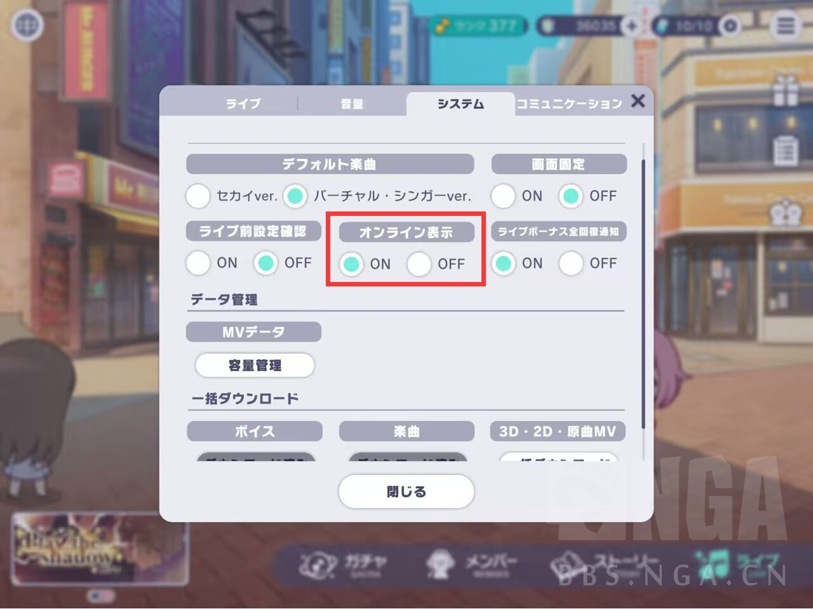

----

##### 181.[0] \<pid:729533459\> 2023-11-28 20:50:10 by 星光轨迹
>[jump](#pid729527913) 欲与深蓝丶c(2023-11-28 20:09) 说: 
>
>估计是开了隐身。
>
>看下设置里第三栏&#39;システム&#39;的&#39; データ管理&#39;上面的三个选项中间的 &#39;オンライン表示 &#39;是否被调成off了。
>

啊，真的是off！感谢感谢！
最开始玩的时候全部点上off了只想着提示少一点，结果拉朋友进来了反而闹了乌龙~~白玩2年~~
太感谢啦！！

----

##### 182.[0] \<pid:730072942\> 2023-12-01 19:20:21 by 星之咔哔
日服的pjsk空间占用多大？
美服歌更太慢了想去日服玩但是不知道手机空间够不够

----

##### 183.[0] \<pid:730100479\> 2023-12-01 22:35:51 by 欲与深蓝丶c
>[jump](#pid730072942) 星之咔哔(2023-12-01 19:20):

iOS日服平时不开MV可以参考下。我感觉有点虚高。。。

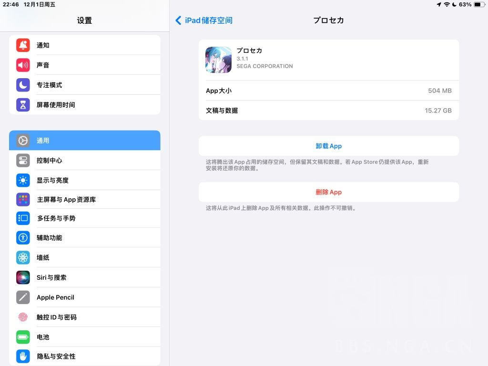

----

##### 184.[0] \<pid:730109110\> 2023-12-01 23:43:52 by 星之咔哔
>[jump](#pid730100479) 欲与深蓝丶c(2023-12-01 22:35) 说: 
>
>iOS日服平时不开MV可以参考下。我感觉有点虚高。。。
>
>

谢谢，不打算下日服了
美服只占了日服的一半左右

----

##### 185.[0] \<pid:730175594\> 2023-12-02 13:42:51 by LegendGX
>[jump](#pid730109110) 星之咔哔(2023-12-01 23:43) 说: 
>
>谢谢，不打算下日服了
>美服只占了日服的一半左右

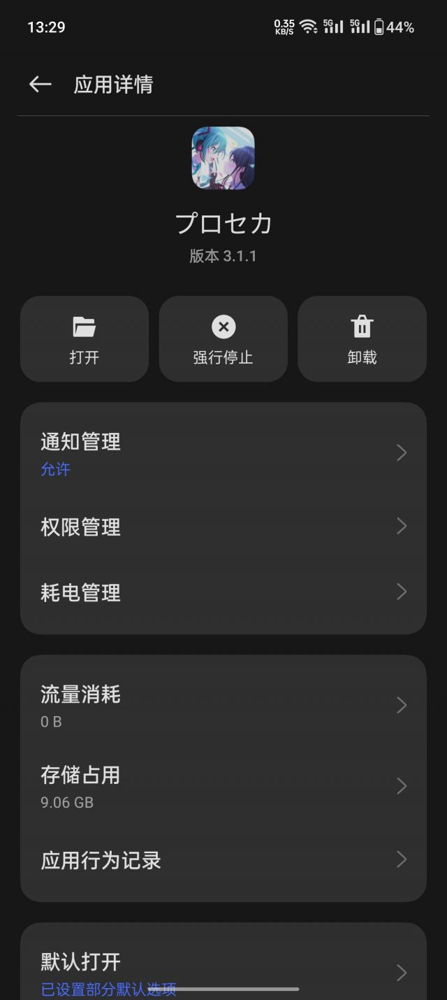
安卓手机占用9g左右，平时手机只用来挂自动清体，没下的歌大概十几首，ipad全曲无mv我这里是10.9g

----

##### 186.[0] \<pid:730340490\> 2023-12-03 15:47:18 by zaaaacccck
大佬们我又来问问题了
打协力的时候，选歌的难度有说法吗？同一首歌假设都能ap，是不是越难分数越高啊，我遇到ma和ex都fc了的歌想去打hard拿50水，对最后的分数影响很大吗？
还有就是打多人的时候经常遇到队伍解散的情况，是sbga自己的问题还是有玩家掉了啊，我有时候连着五六次都这样，都开始怀疑是自己的问题了

----

##### 187.[0] \<pid:730349018\> 2023-12-03 16:51:00 by 无言_123
氪了点现在有三千多有偿，那个4星选10值得抽吗？里面只有三张是我喜欢的卡

----

##### 188.[0] \<pid:730350235\> 2023-12-03 16:59:20 by 天空覆层的观测者
大佬，想问一下界面加载不出来怎么办用的日app账号下的，结果进去后加载不出来了，是要梯子吗，还有新人想快速上手的话练哪些比较好(arc红框11.87)

----

##### 189.[1] \<pid:730371022\> 2023-12-03 19:23:08 by 欲与深蓝丶c
>[jump](#pid730340490) zaaaacccck(2023-12-03 15:47):

理论上全难度可以AP的情况下难度阶级越高分越高，但是实际上影响的收获活动点数基本可以忽略不计。
~~因为真的不差那几十~~

Room解散一般是有人退了(手机卡了、自己切出去了、呼出通知栏了、网掉了等等等等)。5V5协力这种情况特别常见。
也有很多那种互送完火然后退了自己去Auto的，有条件的话不嫌麻烦可以在twi(X)/频道/开车bot找车。

----

##### 190.[0] \<pid:730371753\> 2023-12-03 19:28:11 by 欲与深蓝丶c
>[jump](#pid730349018) 无言_123(2023-12-03 16:51):

氪金一般是不建议硬氪的(1:1真的很贵)，有偿水我这边大部分的获取途径是大小月卡。

现在普池四星出卡一年后可以在商店用井票换。我这边来说的话想要的卡过一半我会抽，主要还是看个人。
我个人是认为抱着“歪其它卡能够接受“的心态的话是可以抽的。

----

##### 191.[0] \<pid:730372676\> 2023-12-03 19:35:12 by zaaaacccck
>[jump](#pid730371022) 欲与深蓝丶c(2023-12-03 19:23) 说: 
>
>理论上全难度可以AP的情况下难度阶级越高分越高，但是实际上影响的收获活动点数基本可以忽略不计。
>~~因为真的不差那几十~~
>
>Room解散一般是有人退了(手机卡了、自己切出去了、呼出通知栏了、网掉了等等等等)。5V5协力这种情况特别常见。
>也有很多那种互送完火然后退了自己去Auto的，有条件的话不嫌麻烦可以在twi(X)/频道/开车bot找车。

感谢大佬

----

##### 192.[0] \<pid:730373397\> 2023-12-03 19:40:25 by 欲与深蓝丶c
>[jump](#pid730350235) 天空覆层的观测者(2023-12-03 16:59):

最好的话是使用付费加速器(我个人用的是UU，但是有点贵。不常玩的话可以看看免费加速器当纯音游打)。

我其实不太懂Arcaea的11.87是什么水平。。。我个人感觉可以从HD/EX22-23打起看看。(不合适的话求轻点喷)。

----

##### 193.[0] \<pid:730405925\> 2023-12-03 23:54:34 by Laityの城灬沐
>[jump](#pid730373397) 欲与深蓝丶c(2023-12-03 19:40) 说: 
>
>最好的话是使用付费加速器(我个人用的是UU，但是有点贵。不常玩的话可以看看免费加速器当纯音游打)。
>
>我其实不太懂Arcaea的11.87是什么水平。。。我个人感觉可以从HD/EX22-23打起看看。(不合适的话求轻点喷)。

Arcaea挺难的，虽然我也不知道11.87是多少，但大致是触手怪
对标pjsk难度可能30以上了，从MA开始玩起都没问题的大佬玩家

----

##### 194.[0] \<pid:730407271\> 2023-12-04 00:05:40 by 天空覆层的观测者
>[jump](#pid730373397) 欲与深蓝丶c(2023-12-03 19:40) 说: 
>
>最好的话是使用付费加速器(我个人用的是UU，但是有点贵。不常玩的话可以看看免费加速器当纯音游打)。
>
>我其实不太懂Arcaea的11.87是什么水平。。。我个人感觉可以从HD/EX22-23打起看看。(不合适的话求轻点喷)。

感谢大佬

----

##### 195.[1] \<pid:730433550\> 2023-12-04 08:53:34 by LegendGX
>[jump](#pid730340490) zaaaacccck(2023-12-03 15:47) 说: 
>
>大佬们我又来问问题了
>打协力的时候，选歌的难度有说法吗？同一首歌假设都能ap，是不是越难分数越高啊，我遇到ma和ex都fc了的歌想去打hard拿50水，对最后的分数影响很大吗？
>还有就是打多人的时候经常遇到队伍解散的情况，是sbga自己的问题还是有玩家掉了啊，我有时候连着五六次都这样，都开始怀疑是自己的问题了

解散的情况也有很多种类
1. 5人凑齐的瞬间解散
2. 准备阶段和匹配对手的这段时间里解散
3. 歌选出来之后解散

第三种是纯人为，第二种有一半是sega的问题，具体来说就是5v5的时候匹配到对手的瞬间会有一次额外的网络请求，导致掉线率变高(我昨天因为这个掉线4次)，另一半就是玩家因为各种原因自己退了导致解散的，第一种最近已经比较少见，但是从开服以来一直存在，理论上是因为5人凑齐的瞬间有人退出，但我见过4=1的时候那个1进来不到0.5秒就退了的，并不是人为能控制的情况

还有就是解散的时候弹出来的通知也有两种，一般“房间已解散”的日语说明不是你的问题，另一种“连接已切断”的日语就是自己的网络问题了

----

##### 196.[1] \<pid:730453194\> 2023-12-04 10:39:18 by 時雨_
>[jump](#pid730340490) zaaaacccck(2023-12-03 15:47) 说: 
>
>大佬们我又来问问题了
>打协力的时候，选歌的难度有说法吗？同一首歌假设都能ap，是不是越难分数越高啊，我遇到ma和ex都fc了的歌想去打hard拿50水，对最后的分数影响很大吗？
>还有就是打多人的时候经常遇到队伍解散的情况，是sbga自己的问题还是有玩家掉了啊，我有时候连着五六次都这样，都开始怀疑是自己的问题了

你被ban了就是你掉线 没被ban就是别人掉

----

##### 197.[0] \<pid:730497294\> 2023-12-04 14:33:45 by 红鱼菌
刚入坑两周的萌新想问几个新手问题

之前有看攻略知道要多打协力，今天看到个说法说协力最好不要选效率曲，这个是有啥说法嘛，虽然平常都是选随机没咋注意这个

还有就是挑战live是不是也不要选效率曲，是不是类似的原因呀，之前都是拿挑战live当练习用(音游废打18经常死)，感觉是应该挑战live打些能fc的，再单独找时间去练习的好

----

##### 198.[1] \<pid:730502790\> 2023-12-04 15:05:04 by LegendGX
>[jump](#pid730497294) 红鱼菌(2023-12-04 14:33) 说: 
>
>刚入坑两周的萌新想问几个新手问题
>
>之前有看攻略知道要多打协力，今天看到个说法说协力最好不要选效率曲，这个是有啥说法嘛，虽然平常都是选随机没咋注意这个
>
>还有就是挑战live是不是也不要选效率曲，是不是类似的原因呀，之前都是拿挑战live当练习用(音游废打18经常死)，感觉是应该挑战live打些能fc的，再单独找时间去练习的好

选效率曲会招人厌，就容易散房，因为经常有人选都听烦了，而且时间效率曲单次游玩收益最低，对于不赶时间冲活动榜的清体党来说，一次活动总共可能就手动打几十次协力，遇到时间效率曲的次数越多，亏的活动点数越多(体力效率曲一把比较久而且听厌的人比较多也容易散)

每日挑战恰恰相反，每日挑战每个角色都有分数矿，而且给你选择的角色增加挑战等级的那个点数，由于每天只能打一次，那个点数和单曲得分完全正相关，而得分高的又全是效率曲，所以每日适合打效率曲(而且要尽量ap拿高分)
当然你要是觉得这个点数涨的快还是慢没啥所谓那每日挑战随便打啥都行，只要打满7天别漏了7天那个奖励才是比较重要的

----

##### 199.[0] \<pid:730542750\> 2023-12-04 18:28:06 by 红鱼菌
>[jump](#pid730502790) LegendGX(2023-12-04 15:05) 说: 
>
>选效率曲会招人厌，就容易散房，因为经常有人选都听烦了，而且时间效率曲单次游玩收益最低，对于不赶时间冲活动榜的清体党来说，一次活动总共可能就手动打几十次协力，遇到时间效率曲的次数越多，亏的活动点数越多(体力效率曲一把比较久而且听厌的人比较多也容易散)
>
>每日挑战恰恰相反，每日挑战每个角色都有分数矿，而且给你选择的角色增加挑战等级的那个点数，由于每天只能打一次，那个点数和单曲得分完全正相关，而得分高的又全是效率曲，所以每日适合打效率曲(而且要尽量ap拿高分)
>当然你要是觉得这个点数涨的快还是慢没啥所

好的，感谢大佬回答！但好像和我理解的不一样，以前看MV的弹幕和评论，以为效率曲说的是短的，长的是叫耐力曲，我看都说孓然妒火是效率曲，看起来确实很短，有点迷糊了  

编辑：刚刚去b站查了查，了解了，原来还有体力效率和时间效率的说法，所以挑战应该是打体力效率曲吧！

----

##### 200.[0] \<pid:730580915\> 2023-12-04 23:04:22 by LegendGX
>[jump](#pid730542750) 红鱼菌(2023-12-04 18:28) 说: 
>
>好的，感谢大佬回答！但好像和我理解的不一样，以前看MV的弹幕和评论，以为效率曲说的是短的，长的是叫耐力曲，我看都说孓然妒火是效率曲，看起来确实很短，有点迷糊了  
>
>编辑：刚刚去b站查了查，了解了，原来还有体力效率和时间效率的说法，所以挑战应该是打体力效率曲吧！

每日挑战如果像我说的一样追求高分应该打的是短的那种时间效率曲，孑然妒火正合适  
这游戏绝大部分情况都是歌越短分越高，因为技能加分的持续时间是固定的，歌越短则技能覆盖比例的越高容易出高分

----

##### 201.[0] \<pid:730748519\> 2023-12-05 20:16:47 by 月小炎
这期60抽抽到想要的卡了，但是限定2星好像没全。
好像也没有快速查看缺那个的办法，一个个点感觉好憨比啊。
不知道是补几发10连划算还是拿币换2星划算

----

##### 202.[0] \<pid:730795749\> 2023-12-06 05:31:07 by 三木9美子
我又来问问题了(哭)现在的协力断线惩罚重置机制是怎么样的啊，今天一直莫名其妙掉线目前被ban到了15分钟，是要打多少首歌才能重置的吗？

----

##### 203.[0] \<pid:730805900\> 2023-12-06 08:37:09 by LegendGX
>[jump](#pid730795749) 三木9美子(2023-12-06 05:31) 说: 
>
>我又来问问题了(哭)现在的协力断线惩罚重置机制是怎么样的啊，今天一直莫名其妙掉线目前被ban到了15分钟，是要打多少首歌才能重置的吗？

是的，要正常打一定把数的协力然后这个惩罚会降一档，具体多少把没测试过，体感好像不到10把就可以维持惩罚不升档(上次掉线罚5分钟这次掉线还是5分钟没变高)  
连续掉线3次开始触发惩罚了就先别头硬继续排了，该开加速的开加速，不行就solo先清

----

##### 204.[0] \<pid:730855019\> 2023-12-06 12:25:25 by 欲与深蓝丶c
>[jump](#pid730748519) 月小炎(2023-12-05 20:16):

首先恭喜出货。

接下来要抽还是直接换就完全看自己了，我自己这边换完自推卡我就不打算继续抽了。
(顺带吐槽SBGA的卡池歪的太抽象力)

----

##### 205.[0] \<pid:730870544\> 2023-12-06 13:52:16 by 三木9美子
>[jump](#pid730805900) LegendGX(2023-12-06 08:37) 说: 
>
>是的，要正常打一定把数的协力然后这个惩罚会降一档，具体多少把没测试过，体感好像不到10把就可以维持惩罚不升档(上次掉线罚5分钟这次掉线还是5分钟没变高)  
>连续掉线3次开始触发惩罚了就先别头硬继续排了，该开加速的开加速，不行就solo先清

好的谢谢！现在大概已经有10来把过去了，应该...能降一点点(吧)
顺便你游卡池太抽象了，想要ena结果把攒的石头都快砸进去了也没有(连当期up和彩都没几个)，最后忍痛换出来了(但又要重新攒一波水了，哭)

----

##### 206.[0] \<pid:730873306\> 2023-12-06 14:06:54 by 月小炎
>[jump](#pid730855019) 欲与深蓝丶c(2023-12-06 12:25):

就是因为卡池太抽象了我才纠结，毕竟钻难攒。
2星也得20碎换一张呢。这次缺的二星也不少

----

##### 207.[0] \<pid:730983184\> 2023-12-07 01:42:05 by 三木9美子
已经被累积惩罚到一个小时了……今天真的好奇怪，不仅是我一直在时不时断线，协力的时候也是时常会跳出房间解散的提醒……本来还以为可能只是我自己的问题，想问问有没有人遇到过类似的情况，以及难道sbga的服务器一直都是这样的吗

----

##### 208.[0] \<pid:731003547\> 2023-12-07 08:48:53 by LegendGX
>[jump](#pid730983184) 三木9美子(2023-12-07 01:42) 说: 
>
>已经被累积惩罚到一个小时了……今天真的好奇怪，不仅是我一直在时不时断线，协力的时候也是时常会跳出房间解散的提醒……本来还以为可能只是我自己的问题，想问问有没有人遇到过类似的情况，以及难道sbga的服务器一直都是这样的吗

5v5的服务器和平时不同，国内打5v5活动经常卡到飞起

----

##### 209.[0] \<pid:731022912\> 2023-12-07 10:24:12 by 乄Before？
想问下pjsk里需要左右手打结/三押及以上的谱子多吗？
还有pjsk里的黄键是什么，每张卡的技能是怎么个触发方式

----

##### 210.[0] \<pid:731045372\> 2023-12-07 12:02:38 by LegendGX
>[jump](#pid731022912) 乄Before？(2023-12-07 10:24) 说: 
>
>想问下pjsk里需要左右手打结/三押及以上的谱子多吗？
>还有pjsk里的黄键是什么，每张卡的技能是怎么个触发方式

目前不多，3键以上的谱大概20个左右，出张的话高难用的比较多，不出张硬扛其实也能混，会出张比较有优势一点
黄键只是单纯3倍得分而已没啥特别的(有一个说法是黄键的pf判定会宽1帧，不过没有代码求证只是有人录像看见这个现象，用处不算大)

solo的话你用的编队每张卡技能都会发动一次，顺序随机但直接按retry的话不会变顺序，要退出这首歌再重新开才会变，在每张卡都开完一次之后，在最后会额外发动一次队长的技能(如果编队不足5人就会相应减少一次发动，比如每日挑战你没解锁5个位置的时候假如只能上两张卡那总共就只会发动3次)
多人协力就是把每张卡发动一次变成每个人的队长卡发动一次，然后会判定一个最牛的人再发动一次，这个最牛的人怎么判定貌似是根据判定瞬间谁的分最高发动谁的，人数少的时候同solo一样发动次数就会变少，但有人掉线不影响，5个人进去就一定会发动6次

技能发动时机：每首歌每个难度技能发动的位置是分别写死的，具体什么时候发动要自己打一遍或者录一遍看

----

##### 211.[0] \<pid:731046198\> 2023-12-07 12:06:34 by 乄Before？
>[jump](#pid731045372) LegendGX(2023-12-07 12:02) 说: 
>
>目前不多，3键以上的谱大概20个左右，出张的话高难用的比较多，不出张硬扛其实也能混，会出张比较有优势一点
>黄键只是单纯3倍得分而已没啥特别的(有一个说法是黄键的pf判定会宽1帧，不过没有代码求证只是有人录像看见这个现象，用处不算大)
>
>solo的话你用的编队每张卡技能都会发动一次，顺序随机但直接按retry的话不会变顺序，要退出这首歌再重新开才会变，在每张卡都开完一次之后，在最后会额外发动一次队长的技能(如果编队不足5人就会相应减少一次发动，比如每日挑战你没解锁5个位置的时候假如只能上两张卡那总

明白了，谢谢大佬的解答

----

##### 212.[0] \<pid:731055805\> 2023-12-07 12:56:57 by Luckyの小孩
>[jump](#pid730873306) 月小炎(2023-12-06 14:06) 说: 
>
>就是因为卡池太抽象了我才纠结，毕竟钻难攒。
>2星也得20碎换一张呢。这次缺的二星也不少

我就补充一下快速查看缺卡的方法
进入交换所，点击角色
已经获得的卡在最下面会提示你已经获得了还要交换吗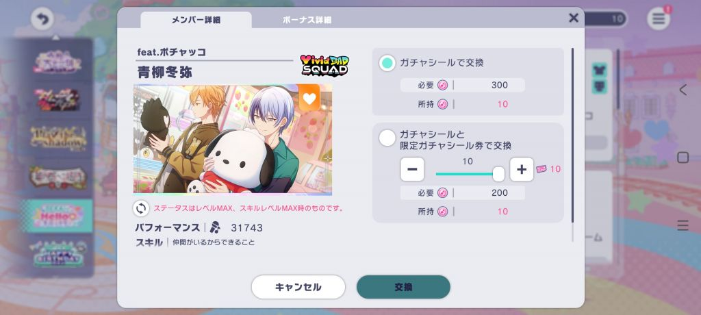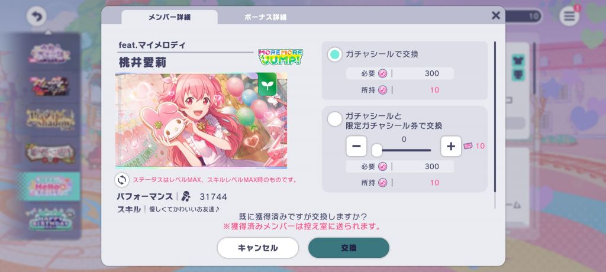

----

##### 213.[0] \<pid:731340178\> 2023-12-08 21:31:58 by Horitensia
请问一下 我的任务栏哪里有个红点显示为1 但是点进去没有任何可以领取的东西 游戏重进还是这样 该怎么解决

----

##### 214.[0] \<pid:731472053\> 2023-12-09 18:29:24 by LegendGX
>[jump](#pid731340178) Horitensia(2023-12-08 21:31) 说: 
>
>请问一下 我的任务栏哪里有个红点显示为1 但是点进去没有任何可以领取的东西 游戏重进还是这样 该怎么解决

上图看下，最近没遇到这种情况

----

##### 215.[0] \<pid:731527207\> 2023-12-10 01:56:40 by Horitensia
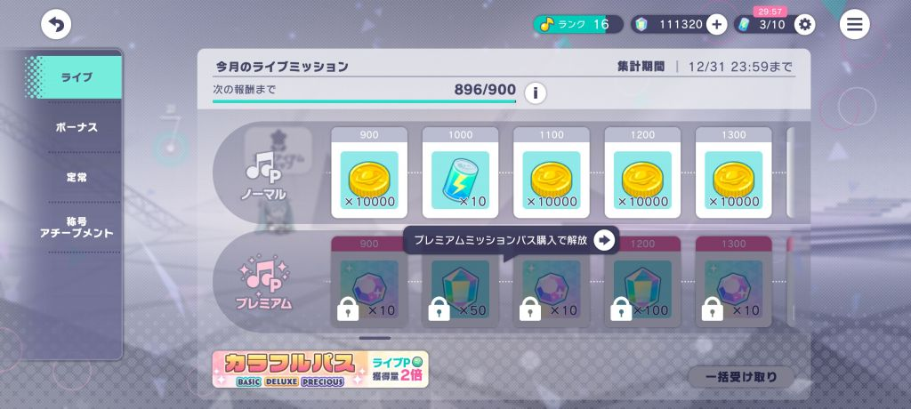
已经没有东西可以领取了 但是就是有这个红点

----

##### 216.[0] \<pid:731595924\> 2023-12-10 15:32:26 by LegendGX
>[jump](#pid731527207) Horitensia(2023-12-10 01:56) 说: 
>
>
>已经没有东西可以领取了 但是就是有这个红点

光看这个图看不出问题，有可能是其他3个标签里有什么东西能领但是没跳感叹号

----

##### 217.[0] \<pid:731604901\> 2023-12-10 16:40:03 by Horitensia
>[jump](#pid731595924) LegendGX(2023-12-10 15:32) 说: 
>
>光看这个图看不出问题，有可能是其他3个标签里有什么东西能领但是没跳感叹号

但是我三个表情里面可以领取的键 显示是灰色的 退出来之后还是有提示

----

##### 218.[0] \<pid:731683430\> 2023-12-11 02:27:28 by majomajomajo
楼主是双指吗 想问一下怎么提升的 打那种下位4k底力曲有点吃力 磕了很久 但是感觉自己又打不明白4k 没办法手法逃课
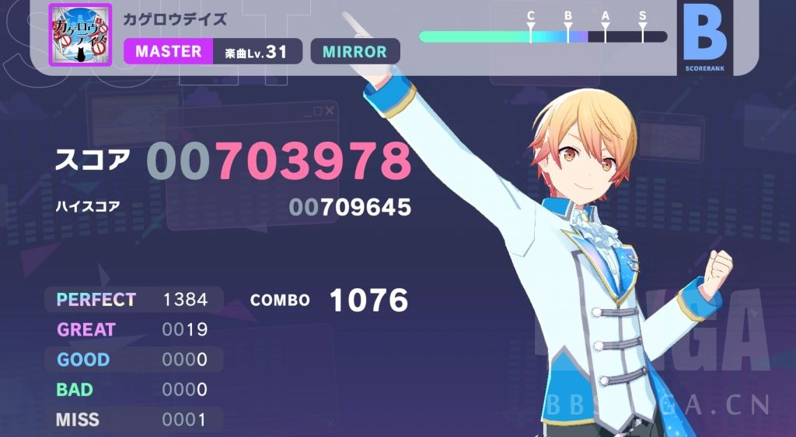
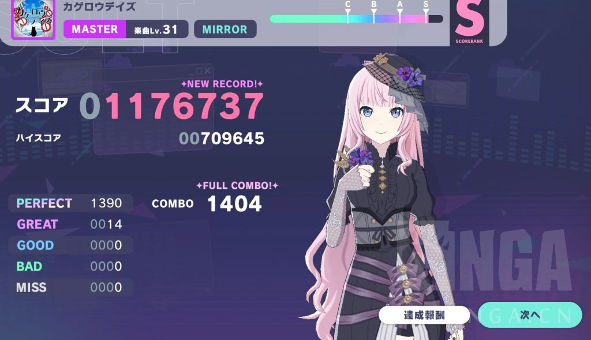

----

##### 219.[0] \<pid:731912677\> 2023-12-12 11:11:57 by 刚果战士
新人想问下，除了5v5活动以外的协力有什么说法吗，收益比单人更高？为什么马拉松活动我看也有挺多人在打协力的

还有协力有的时候房间里人满了，但是不会出现“队伍成员确定”的提示，也不会自动开始选歌，请问是什么情况？

另外还有“箱曲”，“箱活”，请问是什么意思

----

##### 220.[0] \<pid:731916556\> 2023-12-12 11:28:54 by LegendGX
>[jump](#pid731912677) 刚果战士(2023-12-12 11:11) 说: 
>
>新人想问下，除了5v5活动以外的协力有什么说法吗，收益比单人更高？为什么马拉松活动我看也有挺多人在打协力的
>
>还有协力有的时候房间里人满了，但是不会出现“队伍成员确定”的提示，也不会自动开始选歌，请问是什么情况？
>
>另外还有“箱曲”，“箱活”，请问是什么意思

很简单的道理，协力收益要是不如单人那我干嘛要打协力呢，大家都不打协力了这个功能就跟摆设没啥区别了。
活动点数收益单人和协力的差距你自己各打一把对比一下就知道了，掉落素材方面协力略多一点点

5人满不开也不解散就是5个人里有一个人网不好，这个时候左上角返回通常是亮着的，直接返回匹配下一房就行了

----

##### 221.[0] \<pid:731940444\> 2023-12-12 13:30:12 by 刚果战士
>[jump](#pid731916556) LegendGX(2023-12-12 11:28) 说: 
>
>很简单的道理，协力收益要是不如单人那我干嘛要打协力呢，大家都不打协力了这个功能就跟摆设没啥区别了。
>活动点数收益单人和协力的差距你自己各打一把对比一下就知道了，掉落素材方面协力略多一点点
>
>5人满不开也不解散就是5个人里有一个人网不好，这个时候左上角返回通常是亮着的，直接返回匹配下一房就行了

谢谢lz！还有能否请问下箱曲箱活是什么意思

----

##### 222.[1] \<pid:731983770\> 2023-12-12 17:11:38 by LegendGX
>[jump](#pid731940444) 刚果战士(2023-12-12 13:30) 说: 
>
>谢谢lz！还有能否请问下箱曲箱活是什么意思

我不是lz(
箱活就是指某一个团的活动，活动剧情不牵涉其他团的成员，主要是与混合活动形成区别，每个箱活都有专门找p主写的歌，就是箱曲，混活则没有
每个团的箱活都有周期，四个角色会轮流当一次活动的主角(活动缩略图上画的那个)然后进入下一轮周期，第n轮的某个角色的箱曲一般就会叫做某个角色的n箱

----

##### 223.[0] \<pid:732222136\> 2023-12-13 22:29:27 by 樋口小圆不香
请问看mv的时候有显示歌词的设置吗

----

##### 224.[0] \<pid:732224799\> 2023-12-13 22:48:49 by 欲与深蓝丶c
>[jump](#pid732222136) 樋口小圆不香(2023-12-13 22:29):

貌似是没有相关歌词的。

可以看游戏外资讯站或者其它up的自投稿。

----

##### 225.[0] \<pid:732633309\> 2023-12-16 03:19:29 by KuяeNAi
想问抽到重复四星分解获得的那个音符结晶有什么用吗？我现在一共有两张重复四星留着没有分解，给的音符结晶作用很大我就分了，作用不大我就想保留着~~看看这游戏到底能给我重复多少张卡~~~~开服的时候自闭玩了半年，当时这游戏给我的印象就是up卡池纯粹up了个寂寞，笑死根本抽不到全是歪卡()第一个活动还爬到前三千还是前四千位来着，结果引继码弄丢了~~
协力的话我选随机会对队伍的选歌有什么影响吗，爬楼看难度对队友没什么影响就想试试打把协力来着
  
以及最近刚从hard爬上来，简单的25级谱子打很多次可能可以fc，但没法复现，note稍微密集一点大脑就宕机，目前是10.5速，需要把速度再把速度调高一点吗本人没有了解过音游相关的任何信息，纯靠自己闷头打，所以这么多年一直按照玩其他游戏的手法用拇指打歌，但明显感觉自己的手速慢，而手机屏幕太宽手又太小，对一些跨度大的键实在是没辙，请问hold的时候换指hold会掉吗？还是说我干脆就用多指打会比较简单？求指教

----

##### 226.[0] \<pid:732633919\> 2023-12-16 03:38:43 by KuяeNAi
对了，请问一个角色出卡有什么规律可言吗？最喜欢的是miku~~这不用说了我就是为她来的~~但是很喜欢日野森雫的声音所以也有点喜欢她了，想以后抽卡尽量多抽一点她的，有规律的话我就憋，没有规律的话感觉很难给自己一个憋的理由~~刚刚好不容易攒的钻一时上头又拿去抽卡了，还重复了一个，啊笑死~~

----

##### 227.[0] \<pid:732678313\> 2023-12-16 12:58:43 by LegendGX
>[jump](#pid732633919) KuяeNAi(2023-12-16 03:38) 说: 
>
>对了，请问一个角色出卡有什么规律可言吗？最喜欢的是miku~~这不用说了我就是为她来的~~但是很喜欢日野森雫的声音所以也有点喜欢她了，想以后抽卡尽量多抽一点她的，有规律的话我就憋，没有规律的话感觉很难给自己一个憋的理由~~刚刚好不容易攒的钻一时上头又拿去抽卡了，还重复了一个，啊笑死~~

重复的卡分解给的结晶有若干种作用，第一是用来突破，也就是master rank，最高5凸，4星卡每一凸会增加综合力并且解锁衣服的款式(限定卡的2凸解锁发型)，第二是用来升级技能，当你技能书不够用的时候可以用结晶升，第三是这个结晶可以和重复2星3星分解得到的碎片互相转化，而有个交换所可以用碎片买东西(虽然除了真土豪应该不太会有人用这个交换所)

协力おまかせ没任何影响

拇指的手速一般天生都会比食指差一些，而且有些排列只能硬扛(加上现在手机屏幕越来越宽)，劣势比较大，要不要用食指中指或者干脆换个pad来打就看你自己了，绝大部分人用pad肯定会比手机拇指打更强，不过没用过食指打图的话需要适应。
速度的话每个人的感觉不一样，25级的ex，10.5速个人认为是完全够的，密度并没有高到10.5速会觉得挤的程度，甚至如果你的读图力不足的时候可能降一点速度反而来得及反应过来
长键换指不会断而且有些master难度会鼓励你换

卡池的规律几乎没有，但是每个月的下旬会有生放送预告下个月的箱活，如果是自己主推在的箱就可以做点心理准备。憋是不需要理由的，因为即使是双月卡，只抽主推和fes，非起来钻都是不够用的，推两个角色全抽则是绝对不可能够用(除非纯种欧洲狗每次10连20连出货)

----

##### 228.[0] \<pid:732684616\> 2023-12-16 13:45:00 by KuяeNAi
>[jump](#pid732678313) LegendGX(2023-12-16 12:58) 说: 
>
>重复的卡分解给的结晶有若干种作用，第一是用来突破，也就是master rank，最高5凸，4星卡每一凸会增加综合力并且解锁衣服的款式(限定卡的2凸解锁发型)，第二是用来升级技能，当你技能书不够用的时候可以用结晶升，第三是这个结晶可以和重复2星3星分解得到的碎片互相转化，而有个交换所可以用碎片买东西(虽然除了真土豪应该不太会有人用这个交换所)
>
>协力おまかせ没任何影响
>
>拇指的手速一般天生都会比食指差一些，而且有些排列只能硬扛(加上现在手机屏幕越来越宽)，劣势比较大，要不要用食指中指或者干脆换个p

感谢回答！

----

##### 229.[0] \<pid:732768049\> 2023-12-17 01:04:51 by flycxzz
请问一下日服初始号安全吗？

----

##### 230.[0] \<pid:732810704\> 2023-12-17 12:45:41 by 红鱼菌
再请问一下大佬！活动后live看过一次之后，在之后还有办法看吗，我看live房间里板子上有几个live，但不知道是啥
然后区域道具这个前期有优先级嘛，现在钱少我是打算先把活动的角色拉到5级左右，然后努力升主推打挑战，但不知道除角色外道具要升多少(花花草草和全团的道具)。后面几个加全团的道具有点不太理解，说是编入同团成员会再加1%，是假设编入一个人，就是加1%，编入两个人，就是每人2%，编入三个人，就是每人3%，这样叠加的吗，另外全团的这种在挑战live有用吗，是按挑战live可以算同时有5个人吗

----

##### 231.[0] \<pid:732853449\> 2023-12-17 18:13:14 by LegendGX
>[jump](#pid732810704) 红鱼菌(2023-12-17 12:45) 说: 
>
>再请问一下大佬！活动后live看过一次之后，在之后还有办法看吗，我看live房间里板子上有几个live，但不知道是啥
>然后区域道具这个前期有优先级嘛，现在钱少我是打算先把活动的角色拉到5级左右，然后努力升主推打挑战，但不知道除角色外道具要升多少(花花草草和全团的道具)。后面几个加全团的道具有点不太理解，说是编入同团成员会再加1%，是假设编入一个人，就是加1%，编入两个人，就是每人2%，编入三个人，就是每人3%，这样叠加的吗，另外全团的这种在挑战live有用吗，是按挑战live可以算同时有5个人吗

活动live在过去的活动剧情那可以看，自己找下アフターライブ这个键

你想冲主推的分就只升主推的家具和那个团的家具，团的家具是编队里5个人同团的时候额外加，4个人同团剩下一个不同都没额外加的那个数值，每日挑战的时候解锁5位置之后也是有效的(但是virtual singer分不同团，得要上5个属于同一团的卡才有)，活动角色的家具前几级比较便宜你想升也随意
花花草草就平均升吧，吃那个种子的，越吃越多，或者你的挑战配队里某个颜色的卡比较多可以优先升那个颜色的花草

----

##### 232.[0] \<pid:732864010\> 2023-12-17 19:29:30 by 红鱼菌
>[jump](#pid732853449) LegendGX(2023-12-17 18:13) 说: 
>
>活动live在过去的活动剧情那可以看，自己找下アフターライブ这个键
>
>你想冲主推的分就只升主推的家具和那个团的家具，团的家具是编队里5个人同团的时候额外加，4个人同团剩下一个不同都没额外加的那个数值，每日挑战的时候解锁5位置之后也是有效的(但是virtual singer分不同团，得要上5个属于同一团的卡才有)，活动角色的家具前几级比较便宜你想升也随意
>花花草草就平均升吧，吃那个种子的，越吃越多，或者你的挑战配队里某个颜色的卡比较多可以优先升那个颜色的花草

好的，谢谢大佬再读了一遍描述原来有写个のみ

----

##### 233.[0] \<pid:732923538\> 2023-12-18 03:32:54 by 刚果战士
>[jump](#pid731983770) LegendGX(2023-12-12 17:11) 说: 
>
>我不是lz(
>箱活就是指某一个团的活动，活动剧情不牵涉其他团的成员，主要是与混合活动形成区别，每个箱活都有专门找p主写的歌，就是箱曲，混活则没有
>每个团的箱活都有周期，四个角色会轮流当一次活动的主角(活动缩略图上画的那个)然后进入下一轮周期，第n轮的某个角色的箱曲一般就会叫做某个角色的n箱

谢谢dalao终于看懂了这些黑话

----

##### 234.[0] \<pid:732951443\> 2023-12-18 10:13:28 by merciestarry
想入坑，请问iOS和安卓跨平台引继会清空付费钻吗(隔壁邦邦会)

如果清空的话就要考虑用什么设备了

----

##### 235.[0] \<pid:732975262\> 2023-12-18 12:03:55 by LegendGX
>[jump](#pid732951443) merciestarry(2023-12-18 10:13) 说: 
>
>想入坑，请问iOS和安卓跨平台引继会清空付费钻吗(隔壁邦邦会)
>
>如果清空的话就要考虑用什么设备了

日服不会清，繁中服不清楚

----

##### 236.[0] \<pid:733063302\> 2023-12-18 20:22:18 by KuяeNAi
联动卡池会复刻吗，让我有点念想(最后还是没捞到miku)

----

##### 237.[0] \<pid:733184269\> 2023-12-19 15:10:43 by LegendGX
>[jump](#pid733063302) KuяeNAi(2023-12-18 20:22) 说: 
>
>联动卡池会复刻吗，让我有点念想(最后还是没捞到miku)

公告写的是 存在再登场的可能
那大概率是会复刻的，多久不好说，应该是至少隔一年

----

##### 238.[0] \<pid:733407053\> 2023-12-20 18:16:15 by 红鱼菌
大佬们我又来了最近基本都能打hard了，但是感觉hard快了不敢眨眼，感觉眨一下就会看漏，都是找空余时间去眨，导致打一半眼睛就很酸。速度是10.8，慢了会点快按不到以及太多看不清就不太敢调低速度。想问问快速的大佬们，你们打高级谱会出现这种情况嘛，是怎么缓解的

----

##### 239.[0] \<pid:733497118\> 2023-12-21 09:09:10 by LegendGX
>[jump](#pid733407053) 红鱼菌(2023-12-20 18:16) 说: 
>
>大佬们我又来了最近基本都能打hard了，但是感觉hard快了不敢眨眼，感觉眨一下就会看漏，都是找空余时间去眨，导致打一半眼睛就很酸。速度是10.8，慢了会点快按不到以及太多看不清就不太敢调低速度。想问问快速的大佬们，你们打高级谱会出现这种情况嘛，是怎么缓解的

你打个hard说10.8速不敢调低怕note太多看不清。。。那你是眨不了眼啊，我开服master慢慢提速打到现在也就10.7速感觉足够用了更别说你才打个note密度那么低的hard。
初学者大多数起手告诉他们调个9-10之间的速度然后打几天hard就能适应的比较好去冲击ex了，打ex和ma的时候再逐渐把速度提上去，最后落在10.5-11速的比较多，常人在打hard的时候应该都会觉得10.8速快到来不及反应，没听说过怕调低了看不清的

----

##### 240.[0] \<pid:733712332\> 2023-12-22 11:10:43 by 欲与深蓝丶c
>[jump](#pid733407053) 红鱼菌(2023-12-20 18:16) 说: 
>
>大佬们我又来了最近基本都能打hard了，但是感觉hard快了不敢眨眼，感觉眨一下就会看漏，都是找空余时间去眨，导致打一半眼睛就很酸。速度是10.8，慢了会点快按不到以及太多看不清就不太敢调低速度。想问问快速的大佬们，你们打高级谱会出现这种情况嘛，是怎么缓解的

hard相对来说密度没有那么大，可以稍微的调慢一点点。优先让自己打的没那么难受再慢慢提升。

我自己是从9.8开始打hard入门的。打了一会用10.2-10.4打EXP和MAS。

现在已经是10.8的形状了，真到密度很大的谱子估计要再往上。

----

##### 241.[0] \<pid:734100096\> 2023-12-24 17:47:13 by ghaha1
游戏开始选择的团可以换吗

----

##### 242.[1] \<pid:734143424\> 2023-12-24 23:02:13 by 欲与深蓝丶c
>[jump](#pid734100096) ghaha1(2023-12-24 17:47) 说: 
>
>游戏开始选择的团可以换吗

其实不重要，选哪个团只是率先阅读选择的团的剧情和编队。

后续看了其他团的主线第一章也会送对应团体的卡。

----

##### 243.[0] \<pid:734199729\> 2023-12-25 10:44:43 by GROOK
最近的二次复刻池里面
刚好200抽，拿到了想要的绿草mnr
换了点券以后，现在是140贴纸10张券

因为1. 我只抽mmj 2.现在很缺大音符 3. 后面有新年
想问下是该再60抽拿个大音符(60抽有点多了...)
还是省点石头和券，留给新年(新年有没有mmj呀...)

----

##### 244.[0] \<pid:734275860\> 2023-12-25 16:59:31 by nicamo9
>[jump](#pid734199729) GROOK(2023-12-25 10:44) 说: 
>
>最近的二次复刻池里面
>刚好200抽，拿到了想要的绿草mnr
>换了点券以后，现在是140贴纸10张券
>
>因为1. 我只抽mmj 2.现在很缺大音符 3. 后面有新年
>想问下是该再60抽拿个大音符(60抽有点多了...)
>还是省点石头和券，留给新年(新年有没有mmj呀...)

看个人吧，钻的获取其实还是比较少的，贴纸可以换母猪石，2000母猪石就是一个大音符了
缺大音符把钻留到1月新年fes可能更好，而且按照往年经验会有免费十连送

----

##### 245.[0] \<pid:735548943\> 2024-01-01 16:12:18 by 初野之风
翻了翻楼，问题解决编辑了

----

##### 246.[0] \<pid:736471425\> 2024-01-06 20:20:43 by KuяeNAi
想问5v5匹配队伍的时候时间卡住不走了但我还能发表情喝体力药，而且强退的话会有惩罚，这种情况该怎么办啊？五分钟过去了没有任何提示一直在匹配是不是我网不好成单机版了？

----

##### 247.[0] \<pid:736521905\> 2024-01-07 08:45:04 by LegendGX
>[jump](#pid736471425) KuяeNAi(2024-01-06 20:20) 说: 
>
>想问5v5匹配队伍的时候时间卡住不走了但我还能发表情喝体力药，而且强退的话会有惩罚，这种情况该怎么办啊？五分钟过去了没有任何提示一直在匹配是不是我网不好成单机版了？

只有你能发表情包没人会回你的话就是你自己卡了，5v5网不好的话这种情况很常见，连着出现3次就搞加速器吧，不然就会吃惩罚时间

----

##### 248.[0] \<pid:736551365\> 2024-01-07 12:35:05 by 刚果战士
问问5v5活动的时候应该换阵营以求获胜吗

----

##### 249.[0] \<pid:736566086\> 2024-01-07 14:17:51 by 欲与深蓝丶c
>[jump](#pid736551365) 刚果战士(2024-01-07 12:35):

如果考虑到奖励的话是应该求胜的，5V5商店里的水晶比起马拉松活动里的水晶是有少那么一部分的，而这一部分在阵营胜利奖励里补回来了。

不过如果是为了和朋友选一边的话就无所谓了。

----

##### 250.[0] \<pid:736572434\> 2024-01-07 15:06:49 by 初野之风
萌新第二次打活动，平刷3火，看了看和5000名预测大概差11 12瓶左右大火罐(已排除升级火)的距离，不谈推只谈为了500钻和技能书值得冲一下吗

----

##### 251.[0] \<pid:736666561\> 2024-01-08 07:52:32 by LegendGX
>[jump](#pid736572434) 初野之风(2024-01-07 15:06) 说: 
>
>萌新第二次打活动，平刷3火，看了看和5000名预测大概差11 12瓶左右大火罐(已排除升级火)的距离，不谈推只谈为了500钻和技能书值得冲一下吗

(虽然活动已经结束了)5000是个提升奖励档位的线，竞争会有一些，你要是有把握10管出头就能稳住前5000那冲一下其实也挺好，前提得是用的免费的体力药

----

##### 252.[1] \<pid:736781573\> 2024-01-08 18:15:53 by yjjj已经存在
>[jump](#pid733407053) 红鱼菌(2023-12-20 18:16) 说: 
>
>大佬们我又来了最近基本都能打hard了，但是感觉hard快了不敢眨眼，感觉眨一下就会看漏，都是找空余时间去眨，导致打一半眼睛就很酸。速度是10.8，慢了会点快按不到以及太多看不清就不太敢调低速度。想问问快速的大佬们，你们打高级谱会出现这种情况嘛，是怎么缓解的

速度其实不是越快越好的，高速是用更短的反应时间换取屏幕中同一时间更少的note数量以降低读谱难度，合适的速度应该能让你清晰快速地判断出屏幕中的note下落顺序，pjsk后期高速人多主要是因为master难度下慢速大小键读谱太困难了，打困难用这么高速反而因为note太少容易被偷袭
你说的慢速会点早是因为刚接触音游完全依赖目押，紧张之下感觉note快到判定线了就按下去了，只打打下位hard也够用，但是还是推荐养成跟着音乐节拍去击打的习惯
我个人觉得初次接触音游用10.8速打hard可能太快了，可能会让你反应不过来，推荐从9.5左右开始慢慢往上加，找一个适合的速度

----

##### 253.[0] \<pid:736839530\> 2024-01-09 02:35:55 by 红鱼菌
>[jump](#pid736781573) yjjj已经存在(2024-01-08 18:15) 说: 
>
>速度其实不是越快越好的，高速是用更短的反应时间换取屏幕中同一时间更少的note数量以降低读谱难度，合适的速度应该能让你清晰快速地判断出屏幕中的note下落顺序，pjsk后期高速人多主要是因为master难度下慢速大小键读谱太困难了，打困难用这么高速反而因为note太少容易被偷袭
>你说的慢速会点早是因为刚接触音游完全依赖目押，紧张之下感觉note快到判定线了就按下去了，只打打下位hard也够用，但是还是推荐养成跟着音乐节拍去击打的习惯
>我个人觉得初次接触音游用10.8速打hard可能太快了，可能会

好的，感谢大佬，也感谢之前几个回复的大佬我之前发现看不清看的难受的原因了，是刷新率只有60，改成120帧后一下子看得舒服也看的清了。目前是hard20以下正常状态都能FC，expert目前才22能活不能保证FC速度其实目前用10.8感觉hard打的挺舒服的就继续用了，expert感觉主要是很多新的谱型还不熟(比如一手长条，另一手干别的事，然后互换)，导致眼睛看懂了，手不懂用怎么按，感觉应该是多练让手记住这些谱型的处理方式

----

##### 254.[0] \<pid:736988151\> 2024-01-09 20:49:11 by Moekazuki
想问下这次wl……社畜冲花牌估计是不行了，尽量还是想清火保下羽牌，清火还是通常3火，结束前10火冲比较好吗

----

##### 255.[0] \<pid:737016017\> 2024-01-10 00:08:15 by 红鱼菌
想问一下是不是不同活动给的点数比率不一样呀，新年的嘉年华活动，我这队18w左右+275%用3火清体力平均+1500~1700左右的代币，但这次world link活动我还是18w左右，代币加成319%，却只有1200~1400的代币

----

##### 256.[0] \<pid:737024891\> 2024-01-10 01:37:37 by 欲与深蓝丶c
>[jump](#pid737016017) 红鱼菌(2024-01-10 00:08) 说: 
>
>想问一下是不是不同活动给的点数比率不一样呀，新年的嘉年华活动，我这队18w左右+275%用3火清体力平均+1500~1700左右的代币，但这次world link活动我还是18w左右，代币加成319%，却只有1200~1400的代币

5V5活动协力的歌曲结算是有生命值加成的。
HP1000就封顶，归零就就没有这部分加成了哈。

所以5V5活动会比马拉松活动结算的代币多一些哦。

----

##### 257.[0] \<pid:737026209\> 2024-01-10 02:00:53 by 欲与深蓝丶c
>[jump](#pid736988151) Moekazuki(2024-01-09 20:49) 说: 
>
>想问下这次wl……社畜冲花牌估计是不行了，尽量还是想清火保下羽牌，清火还是通常3火，结束前10火冲比较好吗

看自己的时间成本吧我个人体感上来说3火5火说实话差距不大，但是及时清掉才是关键。个人羽的话我没冲击过对强度不是很了解。

如果是活动羽的话战线会拉的很长，我自己本身也有两年没有冲过榜了不是很了解现在的强度(我推还是大冷门说实话确实没啥参考价值，但是估计大烫团估计强度高不少吧)。

建议平时有时间就多打打，火消耗可以稍微拉高一些。举一个很简单的例子就是3火打10把是30火150*收益，但是5火打6把也是30火138*收益；相差的这12*收益有的时候起不了决定性因素，但是同样的时间成本3火打到最后要用10火冲的时候那亏的就不是这点了。

要冲高排名的话就尽量避免活动结束火还烂在手里吃不完的情况(3箱的痛仿佛就在昨天)。到目标档位附近能稳住可以慢慢打，意识到情况不对榜冲不动的话甚至可能要看情况多吃火多拉消耗打。

~~不过10000名左右应该还好，1000的话火不够要碎石甚至氪金吃体力了~~

----

##### 258.[0] \<pid:737053728\> 2024-01-10 09:50:19 by Moekazuki
>[jump](#pid737026209) 欲与深蓝丶c(2024-01-10 02:00) 说: 
>
>看自己的时间成本吧我个人体感上来说3火5火说实话差距不大，但是及时清掉才是关键。个人羽的话我没冲击过对强度不是很了解。
>
>如果是活动羽的话战线会拉的很长，我自己本身也有两年没有冲过榜了不是很了解现在的强度(我推还是大冷门说实话确实没啥参考价值，但是估计大烫团估计强度高不少吧)。
>
>建议平时有时间就多打打，火消耗可以稍微拉高一些。举一个很简单的例子就是3火打10把是30火150*收益，但是5火打6把也是30火138*收益；相差的这12*收益有的时候起不了决定性因素，但是同样的时间成本3火打到最后要

好好！烫团真是打个羽牌感觉都比之前箱活强度大，主要社畜没办法一直盯着排名，还是晚上有空的时候尽量冲高点

----

##### 259.[0] \<pid:737055876\> 2024-01-10 10:01:18 by LegendGX
>[jump](#pid736988151) Moekazuki(2024-01-09 20:49) 说: 
>
>想问下这次wl……社畜冲花牌估计是不行了，尽量还是想清火保下羽牌，清火还是通常3火，结束前10火冲比较好吗

只冲某个角色的花牌的话社畜其实也是能冲的，就是需要高加成(600以上最好)+足够的时间，得五六点能下班回家，七八点晚饭+洗澡都能搞定然后推特上找周回班子10体打虾狂冲到12点睡觉，结束的那天如果不是双休日最好请假保一下排名因为7点就结束了比其他活动更早。
冲一个角色的花牌其他3个角色纯清体随便拿综合羽牌，如果只是想低限度的保一个羽牌，那从第一天开始5体打歌吃体力药进前1w，后面就每天清完体看看排名，要是掉了就吃体打回去一点，尽量多留点空间，前面多吃点体在最后一天之前保持个7-8k名，这样最后一天就是在前面被别人追而不是被动的在后面追别人

----

##### 260.[0] \<pid:737215109\> 2024-01-11 02:50:37 by KuяeNAi
想问下商店里的小瓶有什么作用，好贵一个

----

##### 261.[0] \<pid:737244399\> 2024-01-11 10:04:04 by LegendGX
>[jump](#pid737215109) KuяeNAi(2024-01-11 02:50) 说: 
>
>想问下商店里的小瓶有什么作用，好贵一个

生放里说了，一个等于对应角色1点角色经验，在所有团的wl活动都结束之后可以使用好像

----

##### 262.[0] \<pid:737262727\> 2024-01-11 11:20:16 by 否则孤独
pjsk这个账号绑定太麻烦了，我号没绑，有一次引继弄掉了就在没上过了

----

##### 263.[0] \<pid:737295105\> 2024-01-11 14:01:49 by KuяeNAi
>[jump](#pid737244399) LegendGX(2024-01-11 10:04) 说: 
>
>生放里说了，一个等于对应角色1点角色经验，在所有团的wl活动都结束之后可以使用好像

那是不是越憋到高等级再用效果越好啊

----

##### 264.[0] \<pid:737302351\> 2024-01-11 14:39:14 by LegendGX
>[jump](#pid737295105) KuяeNAi(2024-01-11 14:01) 说: 
>
>那是不是越憋到高等级再用效果越好啊

没差的，升级的经验总量是固定的，30级还是多少级开始后面都是10经验1级，你换一个谁的瓶子就是谁的当前经验+1罢了

----

##### 265.[0] \<pid:737715647\> 2024-01-13 22:05:25 by KuяeNAi
请问周年卡会复刻吗，好喜欢周年的葱葱

----

##### 266.[0] \<pid:737759861\> 2024-01-14 09:32:39 by nicamo9
>[jump](#pid737715647) KuяeNAi(2024-01-13 22:05) 说: 
>
>请问周年卡会复刻吗，好喜欢周年的葱葱

1周年葱是fes 所有fes池都可以捞
1.5周年普限白葱 已经复刻过两次，下次不知道啥时候了
2周年葱也是fes fes池捞
3周年fes池除了当期up可以多自选几个fes up但是不能用井换，大概4周年也可以选吧

----

##### 267.[0] \<pid:737766669\> 2024-01-14 10:28:27 by KuяeNAi
>[jump](#pid737759861) nicamo9(2024-01-14 09:32) 说: 
>
>1周年葱是fes 所有fes池都可以捞
>1.5周年普限白葱 已经复刻过两次，下次不知道啥时候了
>2周年葱也是fes fes池捞
>3周年fes池除了当期up可以多自选几个fes up但是不能用井换，大概4周年也可以选吧

啊，那早知道新年的fes多抽点了下次fes大概是什么时候呢

----

##### 268.[0] \<pid:737787570\> 2024-01-14 12:56:43 by 红鱼菌
想问下挑战live的hard难度有推荐歌曲嘛，之前看了b站视频的推荐去打了jsg，感觉是比之前在打的灰姑娘高点，但看得是master难度下的推荐，理论上在hard难度下谱面不一样应该不是最优。
也想问一下expert下是打虾最优吗，也想多练练换成打expert了

----

##### 269.[0] \<pid:737793702\> 2024-01-14 13:41:13 by nicamo9
>[jump](#pid737766669) KuяeNAi(2024-01-14 10:28):

3月底 3.5周年

----

##### 270.[0] \<pid:737794361\> 2024-01-14 13:46:08 by nicamo9
>[jump](#pid737787570) 红鱼菌(2024-01-14 12:56):

一般越短的歌技能覆盖率高所以分高，具体的歌曲时长可以去sekai.best看，配卡能凑到纯加分卡是最好的

----

##### 271.[0] \<pid:737796895\> 2024-01-14 14:05:03 by 不热心网友
打歌前每次都会白屏大约一分钟，导致协力每次会被卡退怎么办啊，我看挺多人玩日服也最多就几秒，加速器是uu

----

##### 272.[0] \<pid:737808057\> 2024-01-14 15:37:10 by 初野之风
想问一下那些冲榜车之类的除了主卡练度以外有技术要求吗？个人水平只能做到hard全fc

----

##### 273.[1] \<pid:737853575\> 2024-01-14 21:28:42 by 欲与深蓝丶c
>[jump](#pid737808057) 初野之风(2024-01-14 15:37):

有组织有纪律的冲榜车在宣发的时候一般都是有标注要求的，如果没有标注技术相关就是没有要求了。。。

----

##### 274.[0] \<pid:737854150\> 2024-01-14 21:33:12 by 欲与深蓝丶c
>[jump](#pid737796895) 不热心网友(2024-01-14 14:05):

我这边用的UU暂时没有出现这种情况。。。
感觉是网络条件不好、设备卡了或者SBGA噶了。

此条需要请知道的朋友们回复了。

----

##### 275.[0] \<pid:737854487\> 2024-01-14 21:35:36 by 欲与深蓝丶c
>[jump](#pid737262727) 否则孤独(2024-01-11 11:20):

其实没有想象中的那么麻烦，引继码这边的话是日服游戏惯例了。

Google Play和Game Center登录绑定连携就可以，Google绑定处理的时候一般是需要代理加速。
绑定后一般就不会丢了，除非Google账号和Apple账号跟着一起丢了。

----

##### 276.[0] \<pid:737911214\> 2024-01-15 10:01:46 by fxwuvxye
之前打歌一直是点自动配队直接用的，最近后知后觉performance？相近的卡里分卡比奶卡最后得分高
请问如果打歌准度一般(即使fc也会有几十great)的情况下判卡会比纯分卡好吗，虽然加成会少20%但是判定不同分也不一样吧
然后看上面讨论也想起来之前贴吧看过一个说法单曲的话是时长越长活动点数越高，短歌连打冲榜单位时间点数更高(实际同队伍试过打虾确实比打melt少几百
想说楼上是不是说错了，又想起来是不是在说结算分数？确实没注意过结算分和活动点数是不是成正比的……所以是除了加成还有别的附加项计入活动点数吗

~~顺便一问昨天刷到个视频说kaito白情那张因为技能是队伍加成所以冲榜佬都会带，这个对都不一定能凑齐一队加成四星的非冲榜人也一样吗~~

----

##### 277.[0] \<pid:737937462\> 2024-01-15 12:08:40 by 時雨_
>[jump](#pid737911214) fxwuvxye(2024-01-15 10:01) 说: 
>
>之前打歌一直是点自动配队直接用的，最近后知后觉performance？相近的卡里分卡比奶卡最后得分高
>请问如果打歌准度一般(即使fc也会有几十great)的情况下判卡会比纯分卡好吗，虽然加成会少20%但是判定不同分也不一样吧
>然后看上面讨论也想起来之前贴吧看过一个说法单曲的话是时长越长活动点数越高，短歌连打冲榜单位时间点数更高(实际同队伍试过打虾确实比打melt少几百
>想说楼上是不是说错了，又想起来是不是在说结算分数？确实没注意过结算分和活动点数是不是成正比的……所以是除了加成还有别的附加项计入

技能覆盖时间只有几秒钟 所以还是优先加成
歌大体上越短点数越高的是挑战live(一天一次那个) 单人和协力都是歌越长点数越高
冲榜用白情kai是因为他是紫月+vbs团分，wl活动组五色队加成最高，当期四张四星属性缺紫月
卡不全的话根据个人情况组尽可能颜色多的vbs四人+剩下的颜色的vbs副队v

----

##### 278.[0] \<pid:737940790\> 2024-01-15 12:26:55 by fxwuvxye
>[jump](#pid737937462) 時雨_(2024-01-15 12:08) 说: 
>
>技能覆盖时间只有几秒钟 所以还是优先加成
>歌大体上越短点数越高的是挑战live(一天一次那个) 单人和协力都是歌越长点数越高
>冲榜用白情kai是因为他是紫月+vbs团分，wl活动组五色队加成最高，当期四张四星属性缺紫月
>卡不全的话根据个人情况组尽可能颜色多的vbs四人+剩下的颜色的vbs副队v

谢谢谢谢，最近挑战live也一直打melt感觉亏爆了

----

##### 279.[0] \<pid:737955163\> 2024-01-15 13:53:41 by Luckyの小孩
正好问一下pjsk有像隔壁bestdori一样的输入自己卡查最优组的网站吗

----

##### 280.[0] \<pid:737959864\> 2024-01-15 14:20:56 by LegendGX
>[jump](#pid737955163) Luckyの小孩(2024-01-15 13:53) 说: 
>
>正好问一下pjsk有像隔壁bestdori一样的输入自己卡查最优组的网站吗

看了下33 kit好像有这个功能，不过要输入用户id，我没试能不能行
其实了解活动加成原理之后自己组也是很简单的

----

##### 281.[0] \<pid:737963944\> 2024-01-15 14:43:38 by sanyouQAQ
>[jump](#pid737955163) Luckyの小孩(2024-01-15 13:53):

类似的网站只有一个sekai.best 但是你说的这个功能好像没有

----

##### 282.[0] \<pid:739073806\> 2024-01-21 19:26:59 by SsdMaid
台服无情打歌人有个疑问，挑战live所有角色都打到100万拿了水晶，之后的挑战live是拿来练卡，还是用最高分阵容刷角色等级？
不考虑活动/最高分，日常清火满级角色会比未满级角色多掉落吗？

----

##### 283.[0] \<pid:739076357\> 2024-01-21 19:45:58 by 团子A
打活动的话队伍bouns加成和队伍综合力哪个更重要

----

##### 285.[0] \<pid:739079709\> 2024-01-21 20:09:36 by a12311221
请问一下缓解打歌手腕酸痛的药膏买什么推荐吗，上次冲完前排右手手腕一直隐隐作痛

----

##### 286.[0] \<pid:739089559\> 2024-01-21 21:22:06 by LegendGX
>[jump](#pid739073806) SsdMaid(2024-01-21 19:26) 说: 
>
>台服无情打歌人有个疑问，挑战live所有角色都打到100万拿了水晶，之后的挑战live是拿来练卡，还是用最高分阵容刷角色等级？
>不考虑活动/最高分，日常清火满级角色会比未满级角色多掉落吗？

第一个问题问你自己就行了，你想不想冲某个角色的挑战等级，想就冲不想就练卡呗，分高的话有活动的时候活动pt也会多点，如果不在乎这点差距就纯看喜好
第二个问题，掉落是看分数评价的，最高是S评价，你拿特别低级的卡就不容易拿s评价，只要能拿s那就都一样

----

##### 287.[0] \<pid:739091503\> 2024-01-21 21:35:50 by LegendGX
>[jump](#pid739076357) 团子A(2024-01-21 19:45) 说: 
>
>打活动的话队伍bouns加成和队伍综合力哪个更重要

一般都是加成更重要，组好最高加成的队然后把能提升的综合力提升到最大就行了，可以组完之后跟自己最高综合力的卡组打同一首歌比较一下拿点数的区别就知道了

----

##### 288.[0] \<pid:739848995\> 2024-01-26 02:22:01 by 因果交流电灯闪耀
>[jump](#pid739076491) Roxas1(2024-01-21 19:46):

手综区的麻辣仙人都跑到这了？&quot;有男不玩&quot;建议左转邦邦(那边河豚居多你发老婆党言论大概率被骂)，这游戏的卖点的C社六子就有两男的你觉得会没男的？讨论社区也是以手踪区恶心的厕妹所主导的你还来沾边还真是婊子立牌坊啊，你可别把我当龟男，建议你这&quot;有男不玩&quot;的言论发在ML游戏里面，这游戏也没国服你还发这还真是贱

----

##### 289.[0] \<pid:739901891\> 2024-01-26 11:59:10 by 初野之风
>[jump](#pid739848995) 因果交流电灯闪耀(2024-01-26 02:22) 说: 
>
>手综区的麻辣仙人都跑到这了？&quot;有男不玩&quot;建议左转邦邦(那边河豚居多你发老婆党言论大概率被骂)，这游戏的卖点的C社六子就有两男的你觉得会没男的？讨论社区也是以手踪区恶心的厕妹所主导的你还来沾边还真是婊子立牌坊啊，你可别把我当龟男，建议你这&quot;有男不玩&quot;的言论发在ML游戏里面，这游戏也没国服你还发这还真是贱

与其咬钩不如点个举报

----

##### 290.[0] \<pid:739919467\> 2024-01-26 13:37:57 by 因果交流电灯闪耀
>[jump](#pid739901891) 初野之风(2024-01-26 11:59):

我查了下那人的成分，基本都是在手踪区发言像个复读机一直发&quot;有男不玩&quot;真的当麻辣仙人魔怔了，而且也是不玩这破游看见帖子就发

----

##### 291.[0] \<pid:740565299\> 2024-01-30 10:15:42 by 梦回河下1996
大佬，这游戏升级券是不是掉落太少了。
我的卡完全升不了级，只能去协力蹭车，结果分数太低真心有点难堪。
而明天活动加成出来后我的符合条件的卡还是1级，开活动了也只能去自由房磨蹭着升级吗

----

##### 292.[0] \<pid:740599776\> 2024-01-30 12:52:36 by 红鱼菌
>[jump](#pid740565299) 梦回河下1996(2024-01-30 10:15) 说: 
>
>大佬，这游戏升级券是不是掉落太少了。
>我的卡完全升不了级，只能去协力蹭车，结果分数太低真心有点难堪。
>而明天活动加成出来后我的符合条件的卡还是1级，开活动了也只能去自由房磨蹭着升级吗
>另外wl是啥意思呢？

这里也是新人来回答一下，我两个月前刚入坑当时第一次活动也是在低级房先打，蹭到15w后就去高级房了，打一轮活动后，第二次开始就是用券先把综合力拉到15w，然后进去再慢慢升满打，因为卡不多也在攒钻，所以为了保证加成和分数练满后就用满级队在打。因为最好是进高级房，如果券不够的场景，我是先把全部经验分给活动的卡，不够15w就先带一两张之前练满的卡用来拉综合力，等活动卡练上去加起来有15w了再全换活动卡

wl就是world link，是一个针对一个团的相对特殊的活动，有个人榜和个人商店，加成的模式也不一样，可以去b站专栏搜搜，有大佬详细讲解

----

##### 293.[0] \<pid:740604833\> 2024-01-30 13:19:54 by fxwuvxye
两天登不上去日服了，开了科学也能正常上管和x，就是登录白屏转圈圈然后回到登录界面，流量wifi地区改日本都不行
有大佬知道怎么解决吗，我商店都不记得有哪些还没换了

----

##### 294.[0] \<pid:740607749\> 2024-01-30 13:35:58 by 梦回河下1996
>[jump](#pid740599776) 红鱼菌(2024-01-30 12:52):

好的，感谢回答。顺便问下大概什么时候能知道下次活动的加成对象和属性？

----

##### 295.[0] \<pid:740617754\> 2024-01-30 14:28:20 by 红鱼菌
一般前一天下午两点吧，明天开的活动现在已经有情报了，这次是hrk,khn,toya,ena,vbsluka紫月加成的混活，在贴吧看的，好像游戏内也发公告了。
(hrk啥属性都有就缺紫月，哭了

