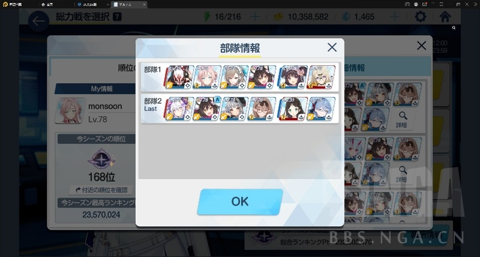
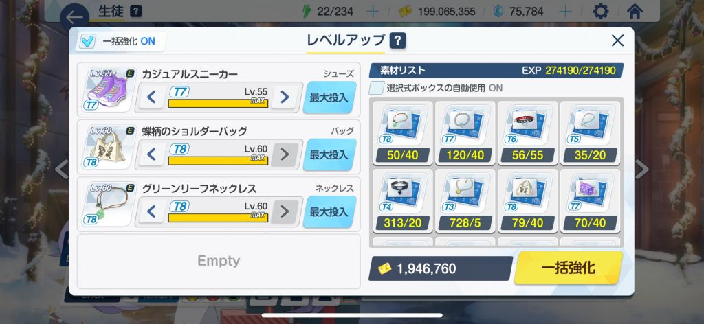
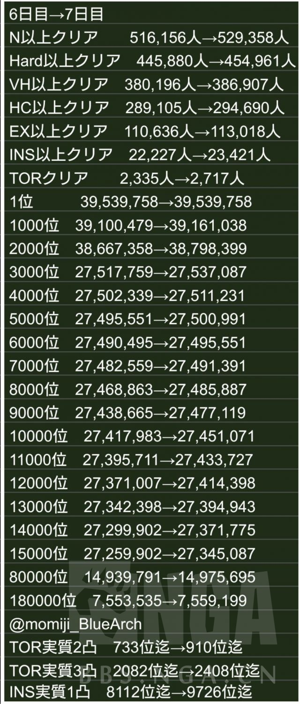

### [破事氵]xx：xxxx玩不下去了，下个蔚蓝档案玩玩，听说pcr强化版？

Made by ngapost2md (c) ludoux [GitHub Repo](https://github.com/ludoux/ngapost2md)

##### 热门回复

- [1楼](#pid723968234): 只要你不是冲着游戏性来玩的，一切好说……...
- [2楼](#pid723968246): 游戏上比pcr佛系，没有工会战只有可以摆...
- [3楼](#pid723968265): 相信我，如果你pcr玩不下去，别去玩ba...
- [7楼](#pid723968973): 强化版吗?不好说[s:ac:哭笑]<br...

----

##### 0.[0] \<pid:0\> 2023-10-29 23:29:14 by 4vt
当初台服pcr玩了好久，天天凌晨公会战为了个前排不要命一样，实在是佛了。这次佛系游玩，听说剧情不错

----

##### 1.[172] \<pid:723968234\> 2023-10-29 23:30:18 by KZ1931
只要你不是冲着游戏性来玩的，一切好说……

----

##### 2.[50] \<pid:723968246\> 2023-10-29 23:30:22 by 泡泡茶壶_。
游戏上比pcr佛系，没有工会战只有可以摆烂的自己打的总力战，而且所有角色共用一管tp，简化了不少。竞技场奖励差距非常小，福利不如pcr，剧情比pcr好看很多  。总体上和pcr非常像上手就能无缝游玩的程度

----

##### 3.[302] \<pid:723968265\> 2023-10-29 23:30:29 by 钦心
相信我，如果你pcr玩不下去，别去玩ba

----

##### 4.[11] \<pid:723968524\> 2023-10-29 23:32:16 by 十月音落
BA如果你不抄作业去打总力战，游戏深度还是有的

----

##### 5.[0] \<pid:723968633\> 2023-10-29 23:33:08 by cilence6
只要你不打总力战就好说

----

##### 6.[0] \<pid:723968920\> 2023-10-29 23:35:08 by 4vt
>[jump](#pid723968265) 钦心(2023-10-29 23:30) 说: 
>
>相信我，如果你pcr玩不下去，别去玩ba

这么哈人？其实我不满意pcr就两点，露娜塔后两年没见新玩法和剧情实在是看不下去，太幼稚了，弱智主角设定我真绷不住。后面实在是腻了，大概晶阿姨出之前那段时间退坑了，好像是叫这个

----

##### 7.[107] \<pid:723968973\> 2023-10-29 23:35:31 by 浜木弦
强化版吗?不好说
母猪石取得量更少，素材卡很死，pcr我记得升技能只要马那
还有就是ba活动有角色加成，少角色刷活动挺烦的，跑圈和占领战操作也都比pcr麻烦一点
总力虽然卷，但确实是比pcr还无所谓毕竟挡位间给的差不多，pvp也是

----

##### 8.[0] \<pid:723969624\> 2023-10-29 23:40:38 by 扛不住了丶
主线只有序章有语音

----

##### 9.[0] \<pid:723969701\> 2023-10-29 23:41:11 by Musousai
PCR我玩着更舒服一点(月卡党不卷会战)，不过人设更喜欢BA

----

##### 10.[8] \<pid:723969735\> 2023-10-29 23:41:28 by o5-9
ba比PCR负担轻点但是抠门的多

----

##### 11.[0] \<pid:723969923\> 2023-10-29 23:42:54 by ee艺术家～
>[jump](#pid723968524) 十月音落(2023-10-29 23:32) 说: 
>
>BA如果你不抄作业去打总力战，游戏深度还是有的

我就喜欢自己凹总力战，所以觉得游戏性拉满。。站位，轴都是看个大概然后自己摸

----

##### 12.[1] \<pid:723970230\> 2023-10-29 23:45:16 by 一个NGA用户吧
港澳大舞台

----

##### 13.[11] \<pid:723971104\> 2023-10-29 23:51:44 by 风--冷傲雷
游戏性方面比pcr要折磨，但是如果你躺平的话，亏的资源基本可以忽略不急(远不像pcr卷工会战和jjc的收益差距大)
然后剧情比pcr好，其他方面这两游戏真的就没啥区别了，真的是差不多
如果因为无聊而弃坑pcr的话，去ba也就是持续个一年不到然后因为同样理由弃坑的结局(亲身体会)

----

##### 14.[0] \<pid:723972088\> 2023-10-29 23:59:08 by nemesis00
这游戏话题性还是有，玩是真不好玩，福利和资源都卡得比PCR还紧，我玩得很难受，随时弃坑的状态

----

##### 15.[0] \<pid:723972204\> 2023-10-30 00:00:03 by cnspike
别玩。
如果你喜欢卷，pcr卷起来收益远比ba大的多。
如果你喜欢躺平，pcr只是损失一点点钻，根本不影响你养成，而ba不打总力战你几乎没有高级材料升技能。
如果你说半躺平，ba凹总力战的时间也要远长于pcr凹凸3刀/1刀。
而且由于ba卡资源严重，你躺平/半躺平 连个作业都没得抄。

----

##### 16.[1] \<pid:723972272\> 2023-10-30 00:00:30 by linkaM
感觉论玩法的话比pcr更无聊

----

##### 17.[0] \<pid:723972539\> 2023-10-30 00:02:32 by czx2012
比pcr强的地方是个单机，不用去社交公会战。角色不够齐打不过躺平妥协打也没那么难受。战斗模式释放技能自己拉范围游戏反馈还是比pcr强一点。收菜也算比较墨迹的游戏，这个pcr强多了

----

##### 18.[13] \<pid:723972716\> 2023-10-30 00:03:56 by 廷达罗斯之主
游戏性感觉比pcr坐牢

----

##### 19.[1] \<pid:723973095\> 2023-10-30 00:07:12 by q373295365
>[jump](#pid723969624) 扛不住了丶(2023-10-29 23:40):

如果能接受国服的话，主线有中文有全语音。

----

##### 20.[0] \<pid:723973285\> 2023-10-30 00:08:36 by 阿比舒
总力战可比工会战舒服多了

----

##### 21.[0] \<pid:723973538\> 2023-10-30 00:10:34 by 无水碳酸钠ek
游戏性基本是扫荡游戏，无论是开新主线还是开新活动都没啥玩的
但剧情和跟角色互动体验秒杀大部分二次元游戏，日本热度那么高不是靠买量买上去的，一点不看剧情的人不建议玩

----

##### 22.[0] \<pid:723973821\> 2023-10-30 00:12:54 by 吾妻蘇芳
那就是说玩真不如pcr，但pcr和ba都玩的也很多，厨力游戏，玩起来都有坐牢的地方，摆起来pcr比ba起码在游戏里更舒服

----

##### 23.[0] \<pid:723974051\> 2023-10-30 00:14:43 by 扛不住了丶
>[jump](#pid723973095) q373295365(2023-10-30 00:07):

卧槽，还有这种事？一会下个国服看看看

----

##### 24.[8] \<pid:723975640\> 2023-10-30 00:27:53 by gradenia
总力战做爱丽丝的伙伴还是很摆烂的，pcr的公会战是真的受不来，你上线晚了甚至还有人直接call你的

----

##### 25.[8] \<pid:723978762\> 2023-10-30 00:57:34 by Congyul
只要没奖励获取强迫症，pcr抽卡和养成方面都相比ba舒服一大截。其他方面各有各的特点，喜好就分人了
Pcr其实轻量玩法(2800auto+jjc一把躺500)，也能抽个爽，稳全限定，角色练度拉个爽

我个人单纯是因为pcr档位差距大，因为强迫症去卷无效钻把自己卷恶心了就跑路了(卷会战50，双场前10)，钻越抽越多，都是无效钻，但就是忍不住去卷
现在在玩ba因为档位差距小，安心摆烂。虽然什么都卡，福利差的也不是一点半点，但玩的反而更轻松(纯纯心态问题)

----

##### 26.[0] \<pid:723980053\> 2023-10-30 01:11:07 by 隐身中的阿卡林
如果你可以接受盆栽游戏但是讨厌强社交内容的话，ba确实比pcr舒服。
起码我以前弃坑pcr的原因跟你主楼一样，被强社交的公会战恶心到，干脆弃坑也不选择当盆栽玩。

----

##### 27.[6] \<pid:723980449\> 2023-10-30 01:15:19 by mmmm3110
BA好就好在随便加个群就是涩图满天飞，情绪价值更高

----

##### 28.[5] \<pid:723981143\> 2023-10-30 01:22:47 by 希引力lu
ba真的是什么都好，无论是小人模型还是剧情走向都是一等一的上品，更不用提那纯血ml的加成，所有学生都是为师的翅膀！
但就是无聊不好玩
我pcr玩了有两年，退坑后幼瞬活动买号入坑ba，正好赶上服务器疯狂爆炸(用维护钻抽了幼瞬哈哈)
后面到日服第一次ins难度黑白老鼠开，打完弃坑。
一趟子玩下来回味感觉就是无聊，纯纯的无聊
如果你pcr玩不进去了转ba也是一样的，就跟楼上老哥说的，也不会坚持多久
上图防云

当时用冰激凌上debuff卡个位让boss自己创自己确实有点爽，有一种泥头车的美哈哈

----

##### 29.[0] \<pid:723981830\> 2023-10-30 01:30:52 by particle002
我是冲着二创和盆栽去玩的，别考虑游戏性，反正没有工会战，咸鱼也不会被踢。

----

##### 30.[0] \<pid:723982101\> 2023-10-30 01:34:49 by 是萝卜
ba没有公会战好多了 jjc收益差距也不大还不用蹲点背刺

如果你因为pcr公会战弃坑一定要来试试ba

别相信前排说pcr玩不下去别玩ba 
我pcr台服+国服pcr会长
ba日服长期二档 偶尔一档

----

##### 31.[9] \<pid:723982400\> 2023-10-30 01:38:59 by 夏娜·F·清英
推荐投入的精力：
观看二创&gt;游戏内养成，看剧情&gt;&gt;&gt;&gt;&gt;当卷狗
当你彻底摆烂 这游戏就很好玩

----

##### 32.[0] \<pid:723982964\> 2023-10-30 01:49:04 by 以初
当初不玩ba的原因，就是已经被pcr的各种pvp搞到心累，不想碰有一点类似要素的了。
手游永远是能云就云。

----

##### 33.[0] \<pid:723983238\> 2023-10-30 01:53:52 by 闵玟木
ba玩社区比玩游戏有意思多了看沙雕网友用各种姿势发电

----

##### 34.[0] \<pid:723992585\> 2023-10-30 05:04:40 by mmimm101
>[jump](#pid723973285) 阿比舒(2023-10-30 00:08) 说: 
>
>总力战可比工会战舒服多了

复议 摆烂除外
喜欢我凹到时间结束还没凹出成绩吗

----

##### 35.[0] \<pid:723998130\> 2023-10-30 07:26:28 by arancebiu
界世：耀荣者王

----

##### 36.[0] \<pid:724000063\> 2023-10-30 07:49:59 by 剧毒鬼剑
卖相其实是和pcr有差距的，优势是晚出了几年   毕竟cy和悠星

----

##### 37.[0] \<pid:724002054\> 2023-10-30 08:09:59 by 阿比舒
>[jump](#pid723992585) mmimm101(2023-10-30 05:04) 说: 
>
>复议 摆烂除外
>喜欢我凹到时间结束还没凹出成绩吗

感觉不如工会战三刀不重复一杯茶一包烟一个尾刀卡一天

----

##### 38.[0] \<pid:724003234\> 2023-10-30 08:19:02 by 陈酿老韭
剧情比pcr强的单机版pcr，自己摸作业挺有意思的，如果想凹一档那就是地狱了
送得比pcr少，不是特别非的话，零氪可以全限定

国服一档很卷，二档就很摆了，摆到开服玩家不抽卡都能躺二档
想入坑现在是个好时机，正好第一个限定池，买个带1700母猪石的石头号开抽就完事了

----

##### 39.[0] \<pid:724003294\> 2023-10-30 08:19:25 by 滑坡战神dl
奔着玩法去那不推荐，比pcr可能无聊点。
嫌弃pcr剧情幼稚的话那倒是可以试试
总之这类游戏自己去玩玩才最清楚，没必要听楼上的
因为我自己创的一个pcr群都快变成ba群了，明明ba卖相不如pcr，但是最近几个月在日服热度高的离谱，玩玩才知道咯  
另外国服可能稍微比日服坐牢一点点毕竟是怀旧服

----

##### 40.[0] \<pid:724007661\> 2023-10-30 08:43:24 by jy02565111
>[jump](#pid723968265) 钦心(2023-10-29 23:30):

不至于不至于，pcr我玩不下去了，ba玩的飞起。主要pcr的工会战太哈人了

----

##### 41.[0] \<pid:724024032\> 2023-10-30 10:01:32 by lawliet2007
ba云剧情的体验比你上手去玩好多了

----

##### 42.[0] \<pid:724025621\> 2023-10-30 10:08:52 by q1726942187
不太好玩，养成比pcr难，升专武母猪石需求量不少还要大量资源

----

##### 43.[0] \<pid:724029469\> 2023-10-30 10:25:08 by RainTune
这游戏最好体验是b站上看剧情了解人设,云游戏。这句话可不是乱讲

----

##### 44.[0] \<pid:724031256\> 2023-10-30 10:32:22 by 是锤芽不是豆芽
ba这个ui是我觉得收菜都累的那种类型
最长坚持时间是连续收菜一周
nikke那个星空式加载收菜都比ba方便

----

##### 45.[6] \<pid:724033299\> 2023-10-30 10:40:59 by 不再嘴硬
那得看你想强化PCR哪方面
卷度方面的话确实，档位差距比PCR小，而且不像公会战可能会拖30人后腿，这里你只对自己负责
但是资源方面卡的比PCR厉害多了

----

##### 46.[0] \<pid:724033615\> 2023-10-30 10:42:15 by ZX_John
BA啥都好 就是不好玩

----

##### 47.[0] \<pid:724035225\> 2023-10-30 10:48:59 by 惠晴sama
主要ba一档和二档差别不大，就200钻，1.6抽
随便摆烂

----

##### 48.[0] \<pid:724035734\> 2023-10-30 10:50:56 by 老shift
我现在玩的几个游戏，退坑肯定先退ba，FGO都可以挂着，反正根本不用打

----

##### 49.[4] \<pid:724039325\> 2023-10-30 11:06:05 by 橘ひなの
每个人对二游的需求不同，或者简单的说分成“二”的一面和“游”的一面
从游的方面来说，BA谈不上好玩，甚至可以说无聊；但在二的方面我认为在现有的手游范围内做到了几乎最好

如果你像我一样对二游最大的需求是收集喜欢的妹子，那BA一定能满足你的需求(除非大面积XP不合)
反过来说如果对什么强度、数值、PVP排名有一定的要求，那可能没法玩的很开心

----

##### 50.[0] \<pid:724040328\> 2023-10-30 11:10:16 by 黑暗炒股界
还不如BCR呢，主线活动过图那叫一个墨迹，纯浪费时间，恶心的要死

----

##### 51.[2] \<pid:724042138\> 2023-10-30 11:17:43 by 香草帕琪Ruri
pcr不是盆栽游戏吗？我感觉pcr一直在做减法做优化，生怕你在这个游戏上多花一点时间，这和别的厂商谋求在线时长完全背道而驰

----

##### 52.[1] \<pid:724044216\> 2023-10-30 11:25:57 by gradenia
>[jump](#pid724035225) 惠晴sama(2023-10-30 10:48):

主要差距是白金奖杯，

----

##### 53.[0] \<pid:724045246\> 2023-10-30 11:30:02 by 谢谢我不喝
ba的核心玩法，指游戏上看看剧情，认认角色
然后去看二创发癫

----

##### 54.[0] \<pid:724137450\> 2023-10-30 19:32:12 by 暗夜云霄
我两个都玩感觉pcr还简单点蔚蓝档案jjc还得每天领，活动还要走格子挺烦的

----

##### 55.[0] \<pid:724140153\> 2023-10-30 19:49:24 by Valano
pcr有妈妈帮你代刷，ba里阿罗娜只会喝牛奶

----

##### 56.[0] \<pid:724140172\> 2023-10-30 19:49:32 by 司马忍
我感觉BA的PVP不如PCR有意思，太TM看脸了，而且角色差距特太大了，能玩的阵容少了很多。其他方面倒是还好。

----

##### 57.[0] \<pid:724181396\> 2023-10-31 01:15:00 by ZS断罪之剑
>[jump](#pid723972204) cnspike(2023-10-30 00:00) 说: 
>
>别玩。
>如果你喜欢卷，pcr卷起来收益远比ba大的多。
>如果你喜欢躺平，pcr只是损失一点点钻，根本不影响你养成，而ba不打总力战你几乎没有高级材料升技能。
>如果你说半躺平，ba凹总力战的时间也要远长于pcr凹凸3刀/1刀。
>而且由于ba卡资源严重，你躺平/半躺平 连个作业都没得抄。

你真的有在玩ba吗？

----

##### 58.[0] \<pid:724265917\> 2023-10-31 13:58:40 by cnspike
>[jump](#pid724181396) ZS断罪之剑(2023-10-31 01:15) 说: 
>
>你真的有在玩ba吗？

你好，国寄服 国服双休玩家，bcr开服玩家。泥潭不是喜欢查成分吗？你翻回复记录啊。

----

##### 59.[7] \<pid:724268002\> 2023-10-31 14:08:59 by 巡璃子
ui交互很逆天，怎么没人说。
道具箱在邮件那
当你想升级一个角色的技能又缺少材料，点击技能，只能一键跳转到对应关卡而没有一键兑换材料。
然后你需要翻表格/wiki，计算出需要多少多少材料并记录，点击回到主页，点击邮箱，点击道具菜单，选择道具，打开使用。。。。循环往复
我真的快被这个逼疯了，太弱智了，就像问问外服这个功能有没有优化，不然真的受不了

----

##### 60.[0] \<pid:724268120\> 2023-10-31 14:09:33 by 谷雨天，晒咸鱼
>[jump](#pid723972204) cnspike(2023-10-30 00:00):

就算是日服也随便摆烂到二档，一、二档资源差的又不多。

----

##### 61.[4] \<pid:724269927\> 2023-10-31 14:18:34 by 平之下雪乃
剧情可以b站看，瑟图可以p站看，本子可以e站看二创可以小蓝鸟看
你入坑是为了什么，卷总力战吗？
当然你要是能佛下来，每天五分钟扫荡也要不了多少时间

----

##### 62.[1] \<pid:724269932\> 2023-10-31 14:18:35 by ZS断罪之剑
>[jump](#pid724265917) cnspike(2023-10-31 13:58) 说: 
>
>你好，国寄服 国服双休玩家，bcr开服玩家。泥潭不是喜欢查成分吗？你翻回复记录啊。

不查成分 你pcr那么好怎么还玩ba啊，还多修呢

礼问你现在pcr工会战出刀要多久 ba总力打个ex算躺平吧要多久
然后pcr jjc和ba jjc是有什么区别？

----

##### 63.[2] \<pid:724282010\> 2023-10-31 15:17:07 by 阿比舒
>[jump](#pid723972204) cnspike(2023-10-30 00:00) 说: 
>
>别玩。
>如果你喜欢卷，pcr卷起来收益远比ba大的多。
>如果你喜欢躺平，pcr只是损失一点点钻，根本不影响你养成，而ba不打总力战你几乎没有高级材料升技能。
>如果你说半躺平，ba凹总力战的时间也要远长于pcr凹凸3刀/1刀。
>而且由于ba卡资源严重，你躺平/半躺平 连个作业都没得抄。

你是怎么说出口凹总力战时间比三刀长的 30人每人打三刀和1人打一刀+扫荡哪个快都想不明白吗
国服我不知道 台服ex稍微打打还是能二档的吧？

----

##### 64.[4] \<pid:724282435\> 2023-10-31 15:19:08 by cnspike
>[jump](#pid724269932) ZS断罪之剑(2023-10-31 14:18) 说: 
>
>不查成分 你pcr那么好怎么还玩ba啊，还多修呢
>
>礼问你现在pcr工会战出刀要多久 ba总力打个ex算躺平吧要多久
>然后pcr jjc和ba jjc是有什么区别？

bcr自动3刀10分钟 600会。ba总力凹发牌就凹了20多分钟，算上凹炸弹打了40分钟。你HC也得凹发牌吧？
bcr jjc 根本没那么卷，每天1次30秒保前50. 你ba现在保住了吗？
笑死，说bcr jjc卷差距大的，不看看bcr发多少，我摆烂一样随便抽卡。你看看ba区分个场在那鬼叫多少天了你是不亏钻，都在算亏多少体力，乐

----

##### 65.[4] \<pid:724283250\> 2023-10-31 15:23:22 by cnspike
>[jump](#pid724282010) 阿比舒(2023-10-31 15:17) 说: 
>
>你是怎么说出口凹总力战时间比三刀长的 30人每人打三刀和1人打一刀+扫荡哪个快都想不明白吗
>国服我不知道 台服ex稍微打打还是能二档的吧？

你多久没玩bcr了？除了几个前排会，根本不用排刀了，你是不是还活在2022年？你看看你总力凹发牌就凹了多久吧，凹大蛇飞弹，凹黑白炸弹，凹暴击，凹了多久，一堆炸票的帖子看不见是吧？你一刀就打1小时还叫什么呢？

----

##### 66.[0] \<pid:724283973\> 2023-10-31 15:27:11 by 阿比舒
>[jump](#pid724283250) cnspike(2023-10-31 15:23) 说: 
>
>你多久没玩bcr了？除了几个前排会，根本不用排刀了，你是不是还活在2022年？你看看你总力凹发牌就凹了多久吧，凹大蛇飞弹，凹黑白炸弹，凹暴击，凹了多久，一堆炸票的帖子看不见是吧？你一刀就打1小时还叫什么呢？

啊对那请问为什么是bcr和国服ba比？没选牌没水静子可不得凹炸弹吗？

----

##### 67.[4] \<pid:724285822\> 2023-10-31 15:36:17 by cnspike
>[jump](#pid724283973) 阿比舒(2023-10-31 15:27) 说: 
>
>啊对那请问为什么是bcr和国服ba比？没选牌没水静子可不得凹炸弹吗？

咋的 bcr不是国服？你日服优化过了，pcr也优化了jjc，你在说什么？还在那刻板印象呢？

----

##### 68.[0] \<pid:724286517\> 2023-10-31 15:39:32 by 阿比舒
>[jump](#pid724285822) cnspike(2023-10-31 15:36) 说: 
>
>咋的 bcr不是国服？你日服优化过了，pcr也优化了jjc，你在说什么？还在那刻板印象呢？

是是是 我选牌爽了一年了看国服凹炸弹好能感同身受哦

----

##### 69.[5] \<pid:724289583\> 2023-10-31 15:54:01 by cnspike
>[jump](#pid724268120) 谷雨天，晒咸鱼(2023-10-31 14:09) 说: 
>
>就算是日服也随便摆烂到二档，一、二档资源差的又不多。

ba摆烂是不亏多少钻，你亏养成素材，总力摆烂缺技能书 、光盘，jjc摆烂亏体力。而ba在养成资源上卡的又很死。

bcr摆烂是亏钻亏的多，但是结哥他发的实在太多了，天热天冷发5000，没事想你了发3000，甚至周年半周年能发一井，摆烂一样随便抽卡。

----

##### 70.[0] \<pid:724306497\> 2023-10-31 17:12:11 by ZS断罪之剑
>[jump](#pid724282435) cnspike(2023-10-31 15:19) 说: 
>
>bcr自动3刀10分钟 600会。ba总力凹发牌就凹了20多分钟，算上凹炸弹打了40分钟。你HC也得凹发牌吧？
>bcr jjc 根本没那么卷，每天1次30秒保前50. 你ba现在保住了吗？
>笑死，说bcr jjc卷差距大的，不看看bcr发多少，我摆烂一样随便抽卡。你看看ba区分个场在那鬼叫多少天了你是不亏钻，都在算亏多少体力，乐

pcr现在咋样不评论，我弃坑有段时间了
ba国服我也不评论，因为我玩的是日服。
但是为啥ba对你来说那么不行你还在玩啊？

----

##### 71.[3] \<pid:724313296\> 2023-10-31 17:44:11 by cnspike
>[jump](#pid724306497) ZS断罪之剑(2023-10-31 17:12) 说: 
>
>pcr现在咋样不评论，我弃坑有段时间了
>ba国服我也不评论，因为我玩的是日服。
>但是为啥ba对你来说那么不行你还在玩啊？

笑死，如果我说war3不如星际好玩，我就不能玩war3了？什么逻辑？

----

##### 72.[0] \<pid:724313701\> 2023-10-31 17:46:13 by aaa0564444
游戏性来说的话。
强化 X
劣化 √

----

##### 73.[0] \<pid:724315030\> 2023-10-31 17:52:38 by 职业的咸鱼
>[jump](#pid724268002) 巡璃子(2023-10-31 14:08):

有啊，日服现在有那个“勾选自动使用自选材料”的按钮了
还有一键升级啥的，你可以在升级规划里直接看到拉到你需要的练度合计需要多少材料，你有多少材料，还差多少材料，会用掉多少自选材料，直接给一份列表  

----

##### 74.[0] \<pid:724315821\> 2023-10-31 17:56:35 by 远离互联网
你要是能接受摆烂躺二档的话那入坑ba没啥问题

----

##### 75.[0] \<pid:724317947\> 2023-10-31 18:07:52 by ZS断罪之剑
>[jump](#pid724313296) cnspike(2023-10-31 17:44) 说: 
>
>笑死，如果我说war3不如星际好玩，我就不能玩war3了？什么逻辑？

挺好的 边骂边玩 祝福你

----

##### 76.[1] \<pid:724324139\> 2023-10-31 18:40:35 by cnspike
>[jump](#pid724317947) ZS断罪之剑(2023-10-31 18:07) 说: 
>
>挺好的 边骂边玩 祝福你

云了就承认就得了，还嘴硬，你给你举个游戏不是边玩边骂的呗？

来来来，别硬杠，你给我举一个贴吧论坛都一边倒赞扬厂商赞扬的运营的游戏。

----

##### 77.[1] \<pid:724325930\> 2023-10-31 18:49:48 by xyzith
总力战其实更像PVE，每日通关+扫荡都能拿到对应难度的资源。玩久了通关ex、ins难度都不是什麽问题。
但如果要打tm难度或是竞速拚排名那就就要多花大量资源养更多人，然后只能多换到一点点资源。
所以在ba你越是认真拚排名会越穷，量力而為或乾脆躺平反而海阔天空。 

初期的几个总力boss比较单调，新的机制都越来越複杂了，其实打起来还挺有趣的，但这也代表难度更高及需要更多的对策。

然后ba的重点是在人物塑造和剧情。

----

##### 78.[0] \<pid:724329776\> 2023-10-31 19:10:50 by 巡璃子
>[jump](#pid724315030) 职业的咸鱼(2023-10-31 17:52):

太好了
国服啥时候能上，等不及了

----

##### 79.[0] \<pid:724330639\> 2023-10-31 19:15:39 by herlincoder
>[jump](#pid724282435) cnspike(2023-10-31 15:19) 说: 
>
>bcr自动3刀10分钟 600会。ba总力凹发牌就凹了20多分钟，算上凹炸弹打了40分钟。你HC也得凹发牌吧？
>bcr jjc 根本没那么卷，每天1次30秒保前50. 你ba现在保住了吗？
>笑死，说bcr jjc卷差距大的，不看看bcr发多少，我摆烂一样随便抽卡。你看看ba区分个场在那鬼叫多少天了你是不亏钻，都在算亏多少体力，乐

现在auto 3刀都能600啦？我当初玩了一年国服pcr，大月卡拉满，农场拉满，礼包拉满，弃坑的时候还有10w钻，在1200打轴打半天感觉太累了，前面一个个交号排刀的不想去，又没法接受去特别后排的会auto，干脆不玩了。
打了几次ba的总力战，一档比以前pcr出刀容易太多了，box差不多随便打打就够了，一周有一把打的还行剩下都随便了，尤其是我打的好不好也不影响别人，舒服多了好吧。jjc感觉也挺轻松的，反正大家钻和币差别也就那样吧，以前在pcr我还得双场卡时间背刺，尤其是在1位简直勾心斗角。
每个人看重的点不一样，我只能说都是开服体验，ba这个我舒服多了。

----

##### 80.[1] \<pid:724330955\> 2023-10-31 19:17:15 by Ltsknight
ba这游戏云就行，本身的gameplay一坨，资源可以说卡的比米家还死

----

##### 81.[0] \<pid:724330985\> 2023-10-31 19:17:23 by 职业的咸鱼
>[jump](#pid724329776) 巡璃子(2023-10-31 19:10) 说: 
>
>太好了
>国服啥时候能上，等不及了

如果不加速进度的话
现在这个完整的功能可能得等2.5周年
主要我对国服照搬代码导致bug都原样复刻的技术力没多少信心

----

##### 82.[4] \<pid:724331000\> 2023-10-31 19:17:27 by 虚无信徒
如果你是冲着剧情和妹子来的，那蔚蓝档案真就挺不错的
但如果你是冲着玩法的话....蔚蓝档案基本就是个高血压版的pcr

pcr我是玩到团本挂树才开始高血压，蔚蓝档案刚出门打个剧情关我就开始高血压了

----

##### 83.[3] \<pid:724331158\> 2023-10-31 19:18:26 by ccggrrppkk
pcr玩家表示，那走格子能不能删掉？？你真的玩的想死，走格子没有比这更折磨的了

----

##### 84.[0] \<pid:724334469\> 2023-10-31 19:38:35 by 阿比舒
>[jump](#pid724331158) ccggrrppkk(2023-10-31 19:18) 说: 
>
>pcr玩家表示，那走格子能不能删掉？？你真的玩的想死，走格子没有比这更折磨的了

走格子不是闭眼抄作业？

----

##### 85.[0] \<pid:724334907\> 2023-10-31 19:41:22 by cnspike
>[jump](#pid724330639) herlincoder(2023-10-31 19:15) 说: 
>
>现在auto 3刀都能600啦？我当初玩了一年国服pcr，大月卡拉满，农场拉满，礼包拉满，弃坑的时候还有10w钻，在1200打轴打半天感觉太累了，前面一个个交号排刀的不想去，又没法接受去特别后排的会auto，干脆不玩了。
>打了几次ba的总力战，一档比以前pcr出刀容易太多了，box差不多随便打打就够了，一周有一把打的还行剩下都随便了，尤其是我打的好不好也不影响别人，舒服多了好吧。jjc感觉也挺轻松的，反正大家钻和币差别也就那样吧，以前在pcr我还得双场卡时间背刺，尤其是在1位简直勾心斗角。
>每个

都多少年的游戏了，只剩些ldx了，600会有1、2个打时停刀的大佬，其余只要不跟大佬抢怪，随便auto，不信你去bcr招募区自己看
我两边都玩，bcr那边出刀可比ba舒服多了，ba是一档不难，但是凹的闹心，还得手操，不如bcr进图直接auto，我人不在都可以。
jjc也是，老游戏了，场子早就没那么多人了，每天1次稳稳前百，每天5次稳定前30，卡点背刺稳定前十，越前面越卷，bcr和ba都一样。
bcr现在一个场子多说1000活人，里面每天打的不超过150，比ba的5000活人还每天打满5次舒服多了。

----

##### 86.[1] \<pid:724336230\> 2023-10-31 19:49:04 by herlincoder
>[jump](#pid724334907) cnspike(2023-10-31 19:41) 说: 
>
>都多少年的游戏了，只剩些ldx了，600会有1、2个打时停刀的大佬，其余只要不跟大佬抢怪，随便auto，不信你去bcr招募区自己看
>我两边都玩，bcr那边出刀可比ba舒服多了，ba是一档不难，但是凹的闹心，还得手操，不如bcr进图直接auto，我人不在都可以。
>jjc也是，老游戏了，场子早就没那么多人了，每天1次稳稳前百，每天5次稳定前30，卡点背刺稳定前十，越前面越卷，bcr和ba都一样。
>bcr现在一个场子多说1000活人，里面每天打的不超过150，比ba的500

这么说人少了游戏就会玩起来轻松很多啊。不过很多弃坑pcr的人可能都和我一样是之前的时间点弃坑的，所以ba只要比那时候体验好就能拉我进来玩。

----

##### 87.[0] \<pid:724337387\> 2023-10-31 19:55:35 by 昂翼天使11
>[jump](#pid724334907) cnspike(2023-10-31 19:41) 说: 
>
>都多少年的游戏了，只剩些ldx了，600会有1、2个打时停刀的大佬，其余只要不跟大佬抢怪，随便auto，不信你去bcr招募区自己看
>我两边都玩，bcr那边出刀可比ba舒服多了，ba是一档不难，但是凹的闹心，还得手操，不如bcr进图直接auto，我人不在都可以。
>jjc也是，老游戏了，场子早就没那么多人了，每天1次稳稳前百，每天5次稳定前30，卡点背刺稳定前十，越前面越卷，bcr和ba都一样。
>bcr现在一个场子多说1000活人，里面每天打的不超过150，比ba的500

你说的这些BCR的优点，两年后BA国服也会有的

----

##### 88.[0] \<pid:724340251\> 2023-10-31 20:14:00 by cnspike
>[jump](#pid724337387) 昂翼天使11(2023-10-31 19:55) 说: 
>
>你说的这些BCR的优点，两年后BA国服也会有的

错误的，ba的总力战/大决战就永远不可能auto打。。甚至ba的活动小游戏至今不能扫荡，一票手刷一次。虽然我不是日服进度，国寄服也是领先1年半的，国服要吃多久的shi我还是有数的

我不想踩ba，因为我也一直在玩，但是说到“懒人”“盆栽”，ba还是差bcr不少，毕竟bcr上到会战高难，下到过图全都可以auto搞定，我可以随便干其他的事。以我个人为例，下了班有5个游戏要打日课，其中还有wws这种端游，放着不管就是最大的利好了，毕竟wws的日课那是出了名的傻逼。

----

##### 89.[5] \<pid:724342074\> 2023-10-31 20:25:35 by 昂翼天使11
>[jump](#pid724340251) cnspike(2023-10-31 20:14) 说: 
>
>错误的，ba的总力战/大决战就永远不可能auto打。。甚至ba的活动小游戏至今不能扫荡，一票手刷一次。虽然我不是日服进度，国寄服也是领先1年半的，国服要吃多久的shi我还是有数的
>
>我不想踩ba，因为我也一直在玩，但是说到“懒人”“盆栽”，ba还是差bcr不少，毕竟bcr上到会战高难，下到过图全都可以auto搞定，我可以随便干其他的事。以我个人为例，下了班有5个游戏要打日课，其中还有wws这种端游，放着不管就是最大的利好了，毕竟wws的日课那是出了名的傻逼。

不不，是你认知偏差了，BCR的600会是几档？为啥要对标BA一档？你怎么不拿前50对标BA一档？
BA两年后开服千里眼玩家凹凸不能二档？我不信的。按日服群友的说法，BA现在摆烂也是总力战以外全凹凸，每天就上线摸一次头。
至于小游戏，BCR不也有傻逼棒球之类的玩意？

----

##### 90.[0] \<pid:724343375\> 2023-10-31 20:34:13 by cnspike
>[jump](#pid724342074) 昂翼天使11(2023-10-31 20:25) 说: 
>
>不不，是你认知偏差了，BCR的600会是几档？为啥要对标BA一档？你怎么不拿前50对标BA一档？
>BA两年后开服千里眼玩家凹凸不能二档？我不信的。按日服群友的说法，BA现在摆烂也是总力战以外全凹凸，每天就上线摸一次头。
>至于小游戏，BCR不也有傻逼棒球之类的玩意？

ba摆烂也不能凹凸的，不然真是团灭炸票(<h4 class='subtitle'></h4>)，而且我之前说了，ba摆烂是实打实的亏总力币亏书亏碟，bcr就亏钻但是他发的多，ldx人均5井以上，不在乎了，ba能到不在乎紫书紫碟的程度吗？ bcr小游戏确实很傻逼，但是就给称号，不影响养成啊，ba的可是给素材的。

----

##### 91.[0] \<pid:724343995\> 2023-10-31 20:38:17 by 巡璃子
>[jump](#pid724330985) 职业的咸鱼(2023-10-31 19:17):

2.5……噔噔咚

----

##### 92.[2] \<pid:724346155\> 2023-10-31 20:51:27 by ccggrrppkk
>[jump](#pid724334469) 阿比舒(2023-10-31 19:38):

 为什么觉得抄作业是一种理所应当的事情，人能从抄作业得到什么快乐吗？我没有从里面得到快乐，我只觉得这个游戏成了负担，至少pcr没有什么逆天走格子，ba格子走的又慢，一步等半天，玩了真不习惯，这是我对于同玩pcr玩家的意见，你如果没有玩过，就不用评论了，你自己玩得开心就好

----

##### 93.[0] \<pid:724346280\> 2023-10-31 20:52:12 by 昂翼天使11
>[jump](#pid724343375) cnspike(2023-10-31 20:34) 说: 
>
>ba摆烂也不能凹凸的，不然真是团灭炸票(<h4 class='subtitle'></h4>)，而且我之前说了，ba摆烂是实打实的亏总力币亏书亏碟，bcr就亏钻但是他发的多，ldx人均5井以上，不在乎了，ba能到不在乎紫书紫碟的程度吗？ bcr小游戏确实很傻逼，但是就给称号，不影响养成啊，ba的可是给素材的。

摆烂哪来那么多角色可以养，就好像我现在经验书一大堆没用，但有些人就缺的要命，对比了下BOX，我不练黑猫桃绿等一堆角色，自然材料没那么缺。
群里部分日服期期一档的玩家表示，现在也就钱是最缺的，其他没你吹的那么缺。

----

##### 94.[0] \<pid:724347115\> 2023-10-31 20:57:18 by cnspike
>[jump](#pid724346280) 昂翼天使11(2023-10-31 20:52) 说: 
>
>摆烂哪来那么多角色可以养，就好像我现在经验书一大堆没用，但有些人就缺的要命，对比了下BOX，我不练黑猫桃绿等一堆角色，自然材料没那么缺。
>群里部分日服期期一档玩家表示，现在也就钱是最缺的，其他没你吹的那么缺。

所以说摆烂已有不同，ba摆烂直接影响养成，你问问金桑的户口本有谁比较富裕
你要用到时候自然就缺了。

bcr的摆烂基本什么都不影响，钻多的是，玛娜也是多的溢出，用谁直接拉满都不带犹豫的。
举个例子，我bcr一直都是摆烂，地下城开EX4，拉7队堆尸，心不疼手不抖，ba能做到吗？

----

##### 95.[0] \<pid:724347708\> 2023-10-31 21:01:10 by 职业的咸鱼
>[jump](#pid724346155) ccggrrppkk(2023-10-31 20:51) 说: 
>
>为什么觉得抄作业是一种理所应当的事情，人能从抄作业得到什么快乐吗？我没有从里面得到快乐，我只觉得这个游戏成了负担，至少pcr没有什么逆天走格子，ba格子走的又慢，一步等半天，玩了真不习惯，这是我对于同玩pcr玩家的意见，你如果没有玩过，就不用评论了，你自己玩得开心就好

所以现在活动图走格子全删了
问题主线图全部都是走格子
祖宗之法把大概，唯一好点的是几个月才出一张新图，点auto推完就能直接扫荡了

----

##### 96.[0] \<pid:724348411\> 2023-10-31 21:05:38 by 昂翼天使11
>[jump](#pid724347115) cnspike(2023-10-31 20:57) 说: 
>
>所以说摆烂已有不同，ba摆烂直接影响养成，你问问金桑的户口本有谁比较富裕
>你要用到时候自然就缺了。
>
>bcr的摆烂基本什么都不影响，钻多的是，玛娜也是多的溢出，用谁直接拉满都不带犹豫的。

你把话题不知道歪到哪去了，我说的是BA在两年后的内卷程度会和BCR一样轻松，你偏要扯BA摆烂影响养成所以没BCR摆烂轻松，那只能摆烂和摆烂也是有区别的，就如同氪佬和氪佬也是有区别的。

----

##### 97.[0] \<pid:724348821\> 2023-10-31 21:08:05 by ccggrrppkk
>[jump](#pid724347708) 职业的咸鱼(2023-10-31 21:01):

 这还算一个正向优化

----

##### 98.[0] \<pid:724350571\> 2023-10-31 21:19:35 by cnspike
>[jump](#pid724348411) 昂翼天使11(2023-10-31 21:05) 说: 
>
>你把话题不知道歪到哪去了，我说的是BA在两年后的内卷程度会和BCR一样轻松，你偏要扯BA摆烂影响养成所以没BCR摆烂轻松，那只能摆烂和摆烂也是有区别的，就如同氪佬和氪佬也是有区别的。

好吧，那我总结一下，ba先不说1档2档，不打最高难度，是不是就会亏币亏养成？然而最高难度和次高难度永远没办法auto，你明白了吧。
我之前也说了，我之所以玩盆栽游戏，是因为纯当副游，毕竟主游是端游，不可能盯着副游玩。而ba如果真打能auto的难度，亏损并不像bcr那样可以忽视。跟何况ba还有很多活动不能auto，放弃不打就是纯亏。

----

##### 99.[0] \<pid:724356235\> 2023-10-31 21:55:21 by ZS断罪之剑
>[jump](#pid724324139) cnspike(2023-10-31 18:40) 说: 
>
>云了就承认就得了，还嘴硬，你给你举个游戏不是边玩边骂的呗？
>
>来来来，别硬杠，你给我举一个贴吧论坛都一边倒赞扬厂商赞扬的运营的游戏。

都祝福你了，你的意思是你玩的所有游戏都是边骂边玩吗？那你开心就好啦

----

##### 100.[0] \<pid:724358225\> 2023-10-31 22:08:03 by ZS断罪之剑
>[jump](#pid724324139) cnspike(2023-10-31 18:40) 说: 
>
>云了就承认就得了，还嘴硬，你给你举个游戏不是边玩边骂的呗？
>
>来来来，别硬杠，你给我举一个贴吧论坛都一边倒赞扬厂商赞扬的运营的游戏。

还有，我可没上升到说玩一个游戏就得所有玩家都得不骂这游戏，你别想带歪了。
另外，按我玩ba日服1年半，国际服一年的情况来看，你说ba的什么总力战不好打，然后不打总力战就没资源，高一点难度不能auto啥的，同时说pcr工会战和jjc很舒适这几点，我完全不认同

或者是我外服ba的号练度很高，你pcr的号也很强导致的看法不同

反正我认识的基本都认为ba的总力不用像pcr那样要社交的同时并不好打，jjc奖励也不如pcr多显示不是很重要(再加上jjc每天的奖励领取机制
pcr是到时间点自动结算，而ba自己领取一天内可以多个人领到同一层次的奖励，明显后者更宽松)

最后，如果你的观点是基于ba和pcr国服那我不评论了，国服都是卷王，环境不一样

----

##### 101.[0] \<pid:724361372\> 2023-10-31 22:28:41 by xyzith
>[jump](#pid724350571) cnspike(2023-10-31 21:19):

日服TM难度现在也没多少个人能打，如果你觉得打不到全体玩家的前1%就叫做亏资源，那我真的也只能說这遊戏不适合你。

----

##### 102.[0] \<pid:724361712\> 2023-10-31 22:30:51 by kangrg008
不懂楼上怎么得出ba内卷程度往后变轻松的结论的，ba环境越往后越逼人凹暴击，轮亚出来后的总力打法早就畸形了，mika更是把环境变得更极端，凹全爆凹安定凹到吐，一档从一开始box过关就能进变成只有卷狗才配进。很多boss的轴是少暴击一次甚至暴击伤害过高过低都行不通的，只能靠不断的凹来赌那一次ex和小技能全都暴击，而且还有大蛇这种会因为伤害浮动导致提前转阶段的。
今年才回过头来搞不需要轮亚一爆的新总力，但有点太晚了，日服国际服新入坑的玩家一边要抽练新总力的对策角，一边又要老牌强角来应对新内容实装周期的老内容填充物
虽然越早玩往后资源越充足也是真的，我号里5亿信用点都不知道怎么用出去，还有一堆材料自选道具开服玩到基本就没开过几次，但后期这些真不太影响卷总力，随手拉满对策角又怎么样，没满级的新人自备拐再借个墨镜c，有心卷能卷过老咸鱼
如果你想摆烂那其实我可以建议你不需要继续玩，总力以外的所有内容都有别的体验手段根本不必要下游戏，真想持续保持对这个游戏的注意力是很需要一种对总力成绩有需求的心态的当然只是图那一点参与感我也不阻止你

----

##### 103.[0] \<pid:724369952\> 2023-10-31 23:26:19 by 一颗魔法螺丝
建议随便注册一个号然后上班攒石攒到一井然后放在那里
看到对xp的再上线拿下
然后继续重新开始攒到1井然后继续摆烂

----

##### 104.[0] \<pid:724374008\> 2023-10-31 23:55:40 by 阿比舒
>[jump](#pid724346155) ccggrrppkk(2023-10-31 20:51) 说: 
>
>为什么觉得抄作业是一种理所应当的事情，人能从抄作业得到什么快乐吗？我没有从里面得到快乐，我只觉得这个游戏成了负担，至少pcr没有什么逆天走格子，ba格子走的又慢，一步等半天，玩了真不习惯，这是我对于同玩pcr玩家的意见，你如果没有玩过，就不用评论了，你自己玩得开心就好

哦 那你看起来很享受一套阵容三倍速全自动推图
主线剧情又臭又长 推图完全不用过脑子带几个群攻全自动也不见得好玩在哪我首通还自己算步数重开打呢 又要鬼叫又不舍得抄作业

----

##### 105.[2] \<pid:724421581\> 2023-11-01 09:55:23 by 太平洋幽灵
卧槽，真的有人喜欢走格子这设计啊，绷不住了

----

##### 106.[1] \<pid:724458117\> 2023-11-01 12:11:46 by 昂翼天使11
>[jump](#pid724350571) cnspike(2023-10-31 21:19) 说: 
>
>好吧，那我总结一下，ba先不说1档2档，不打最高难度，是不是就会亏币亏养成？然而最高难度和次高难度永远没办法auto，你明白了吧。
>我之前也说了，我之所以玩盆栽游戏，是因为纯当副游，毕竟主游是端游，不可能盯着副游玩。而ba如果真打能auto的难度，亏损并不像bcr那样可以忽视。跟何况ba还有很多活动不能auto，放弃不打就是纯亏。

亏也是分三六九等的，BCR在你眼里亏钻都不算亏，因为你是狗啊，我BCR这一年多见过因为钻抽光而弃坑的人都有一大堆，我自己都因为连着井而转生过。
BA亏的这点东西在我眼里就是蚊子腿，压根没钻重要，你还是不懂玩家和玩家之间是有区别的，这边建议去有工会战的游戏去当几个月第一档负责踢人招人的管理层，你现在太甜了

----

##### 107.[0] \<pid:724460211\> 2023-11-01 12:20:40 by 暗夜云霄
bcr缺钻只能说规划的不太好只抽强的全井也够了

----

##### 108.[0] \<pid:740737733\> 2024-01-31 04:15:27 by 无贤
个人感觉看看本子小动画得了 我也是玩不下去pcr

----

##### 109.[0] \<pid:740738785\> 2024-01-31 05:08:25 by 无瑕之时
论强化版PCR我觉得Eversoul才是，我是看论坛里有人推荐去玩的，现在快小一个月了，体验很不错。
这游戏玩法基本上和PCR完全一样，但是做了很多优化。
PCR公会战坐牢，这游戏公会战不坐牢，只需要打一刀，之后每天点下扫荡就行了，别说和BA总力战一样，总力战是个人战，公会战是以公会战为单位的，所以内卷程度很低，因为人真的很少，分成公会就更少了。此外他的公会战奖励大头不是看公会排名给了，而是全公会总伤害达到就能领，目标设置的还很低。
PCR的PVP非常卷，这游戏PVP就很摆烂，和PCR一样分为JJC和PJJC，但是JJC一周才给一抽多一点的钻，PJJC一天下来收获不到50，而这游戏基本上没断过的签到活动每天送你200钻
再一个是养成简单，只有钱和经验材料以及装备，另外这游戏本质上是个放置游戏，这些养成材料和装备都会随着时间直接给你
这类养成二游有一个巨大缺点那就是新手追赶会非常累，而游戏好死不死的还内置了各种PVP玩法，所以越是弱化PVP奖励和玩法时间，就越是值得新人入坑。
哦对了，还忘了一点，这游戏也是全女，2D画风类似BA，干净明亮，3D建模也不错。

----

##### 110.[0] \<pid:740738864\> 2024-01-31 05:13:03 by herrlu
说直白一点，BA是个比米哈游都更宗教的产品(非贬义
BA没有玩不玩，只有入不入教。入了教，游戏好不好玩根本不是事儿，上线戳戳小人儿就很开心了。

----

##### 111.[0] \<pid:740740451\> 2024-01-31 06:40:41 by 出差一周交公积金回来
当云玩家获得100%游戏体验
入坑日服降低20%游戏体验
入坑国服降低50%游戏体验

