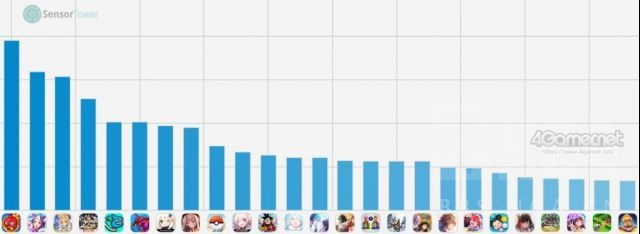
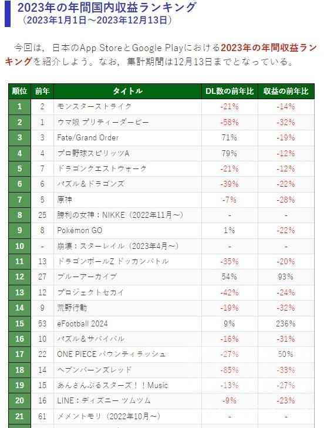

### [搬运] 2023日本手游营收排行榜

Made by ngapost2md (c) ludoux [GitHub Repo](https://github.com/ludoux/ngapost2md)

##### 热门回复

- [1楼](#pid734111864): 这是st榜 二之国后起码日本就没人信了<...
- [2楼](#pid734112058): 怪物弹珠那么高的流水，国内某些up在做流...
- [6楼](#pid734113804): [quote][pid=0,387903...

----

##### 0.[0] \<pid:0\> 2023-12-24 19:05:58 by 黯斋听羽
其实出来有几天了，看版里一直没人搬

明年妮姬和BA分别能不能超过原和铁呢，我们拭目以待

----

##### 1.[75] \<pid:734111864\> 2023-12-24 19:07:55 by miyama
这是st榜 二之国后起码日本就没人信了
等game-i1月1后的榜吧
game-i榜妮姬已经超原神了

----

##### 2.[158] \<pid:734112058\> 2023-12-24 19:09:18 by 纯路人，有一说一
怪物弹珠那么高的流水，国内某些up在做流水饼图的时候都自动屏蔽，很奇妙吧

----

##### 3.[1] \<pid:734112843\> 2023-12-24 19:15:03 by 德国黑兔
赛马娘国服到底是个啥情况，想试试结果都找不到？？

----

##### 4.[0] \<pid:734112956\> 2023-12-24 19:15:45 by AIchanchannel
ba应该会涨，nikke感觉比较难，估计明年会掉。

----

##### 5.[9] \<pid:734113026\> 2023-12-24 19:16:19 by 卓芙我老婆
>[jump](#pid734112843) 德国黑兔(2023-12-24 19:15) 说: 
>
>赛马娘国服到底是个啥情况，想试试结果都找不到？？

开了一周下架到现在，评论区有人分享安装包

----

##### 6.[44] \<pid:734113804\> 2023-12-24 19:21:51 by 刹那一瞬间阿摩罗
>[jump](#pid0) 黯斋听羽(2023-12-24 19:05) 说: 
>其实出来有几天了，看版里一直没人搬
>
>&lt;br/......

st的数据就TM瞎编的
前几天出个研报，好家伙鹰角收入日本占大头还40%
收入更是和gamei算的差一倍，简直逼着眼睛按倍率

----

##### 7.[9] \<pid:734114165\> 2023-12-24 19:24:17 by 幻化乄飞雪
>[jump](#pid734112956) AIchanchannel(2023-12-24 19:15):

以ba现在的产能，三周年直播再没活的话不可能涨

----

##### 8.[0] \<pid:734115098\> 2023-12-24 19:31:01 by AIchanchannel
>[jump](#pid734114165) 幻化乄飞雪(2023-12-24 19:24):

我只是说目前的形势，ba是很明显同人很多然后下载量增加。作为一个老游戏，能逆向上涨说明确实有在拉新人。

nikke感觉就是那波玩家了，不知道它拉没拉倒新玩家。

----

##### 9.[0] \<pid:734115432\> 2023-12-24 19:33:23 by Konakonakonata
>[jump](#pid734113804) 刹那一瞬间阿摩罗(2023-12-24 19:21):

其实并不完全是……因为那个st的数据算的是2020年1月到2023年11月国服iOS和外服iOS+安卓的收入，没把19年国服收入和四年多安卓收入算进来，你想想这差了多少吧

----

##### 10.[0] \<pid:734115491\> 2023-12-24 19:33:49 by 东方妖
呜呜ba，尼姬怎么还混的这么好呢，一定是少前2还没有登录日服和国际服给这些垃圾媚宅游戏带来降维打击吧

----

##### 11.[2] \<pid:734115696\> 2023-12-24 19:35:20 by wdty007
>[jump](#pid734115098) AIchanchannel(2023-12-24 19:31):

nikke周年拉了一大波，但是留存率很一般，主要还是出村后过于漫长的养成节奏很多人适应不了，周年期间加的好友和群很多现在都没什么活人了

----

##### 12.[4] \<pid:734115778\> 2023-12-24 19:36:06 by 逍遥丶洛易
别说超了，就nikke这开服前俩月用bug堆起来的，这游戏成本和o站一块妮游都不知道是不是在乳o

----

##### 13.[7] \<pid:734115843\> 2023-12-24 19:36:36 by 刹那一瞬间阿摩罗
>[jump](#pid734115432) Konakonakonata(2023-12-24 19:33) 说: 
>其实并不完全是……因为那个st的数据算的是2020年1月到2023年11月国服iOS和外服iOS+安卓的收入，没把19年国服收入和四年多安卓收入算进来，你想想这差了多少吧

我说的是只算日服的，和国服没关系。
gamei又不统计国内，st和gamei算的日服收入差一倍，总不能方舟也有迷之pc系数吧？
而且平时方舟的iOS顺位就100名左右，st能算出这么多收入，真是难为它了。

----

##### 14.[3] \<pid:734116071\> 2023-12-24 19:38:23 by wmysh1627
别尬黑 nikke跟原平起平坐是因为原还有PC没算进来
啊什么 nikke也有pc端啊 那没事了

----

##### 15.[1] \<pid:734116527\> 2023-12-24 19:41:32 by CureFlora
>[jump](#pid734112843) 德国黑兔(2023-12-24 19:15):

emm…为什么非得找陈叔叔的马呢？
真想玩中文的话，台服马上新版本
可以直连，还支持wx和支付宝

----

##### 16.[0] \<pid:734117227\> 2023-12-24 19:46:41 by glotia
马娘还是太高了，原今年这么烂居然才-7%？

----

##### 17.[1] \<pid:734119156\> 2023-12-24 19:59:55 by UID64792814
翻了下game-i
跟我的瞎猜比较近1+1=1.1
不过我对国内的龟龟更有信心一点

----

##### 18.[0] \<pid:734119482\> 2023-12-24 20:02:20 by 司马忍
这图前几天看过了，基本符合印象。
仅看二游的话。原神还是保住了二游第五。今年妮姬挺猛的，但可惜还是没超原，我倒很好奇明年能不能战胜原；
铁8个月的成绩比BA12个月高，MHY今年日服的成绩单还是不差的。
不得不感慨，太君还真买账……明年MHY3部游戏，只要不出大问题，韩国系要不再来个热门新二游的话，可能还是会打不过老米。

----

##### 19.[1] \<pid:734128404\> 2023-12-24 21:08:05 by a7sama2000
有没有可能 这就是我发的： 
[url](https://nga.178.com/read.php?tid=38768478)

----

##### 20.[1] \<pid:734129366\> 2023-12-24 21:15:27 by coldknight
>[jump](#pid734116527) CureFlora(2023-12-24 19:41):

虽然，但是
台服的代理也是叔叔家的
所以也是叔叔的马

----

##### 21.[1] \<pid:734130132\> 2023-12-24 21:21:05 by 卓芙我老婆
虽然这榜不准但基本也是这帮游戏上下浮动了

----

##### 22.[0] \<pid:734131476\> 2023-12-24 21:31:05 by 五八九
龙珠激战真的是打不过龙珠爆裂啊，都没上榜

----

##### 23.[0] \<pid:734131853\> 2023-12-24 21:33:41 by AAO233
太君还是信gamei的吧，那边原只有去年一半来着

----

##### 24.[0] \<pid:734133134\> 2023-12-24 21:43:01 by CureFlora
>[jump](#pid734129366) coldknight(2023-12-24 21:15):

咦，我看台服代理是家不认识的公司，原来是这样吗

----

##### 25.[0] \<pid:734134294\> 2023-12-24 21:51:56 by HNFTYH
没方舟？方舟今年都登顶好几次了，这都没有？

----

##### 26.[0] \<pid:734148174\> 2023-12-24 23:38:25 by HyLo_
看起来除了ba和E足球别的都带红色

----

##### 27.[1] \<pid:734154386\> 2023-12-25 00:32:09 by coldknight
>[jump](#pid734133134) CureFlora(2023-12-24 21:43) 说: 
>
>咦，我看台服代理是家不认识的公司，原来是这样吗

是的，当初台服开服的时候就被人扒光了
管理、法人都是叔叔系的人

----

##### 28.[1] \<pid:734162702\> 2023-12-25 02:31:25 by 我老婆是圣人惠
>[jump](#pid734112956) AIchanchannel(2023-12-24 19:15) 说: 
>
>ba应该会涨，nikke感觉比较难，估计明年会掉。

BA如果三周年没有大活的话，那可能不是涨不涨的问题了，是还能剩多少人

----

##### 29.[0] \<pid:740937882\> 2024-02-01 02:58:46 by 鸣濑白羽12
老哥请问能告知一下原帖地址吗

