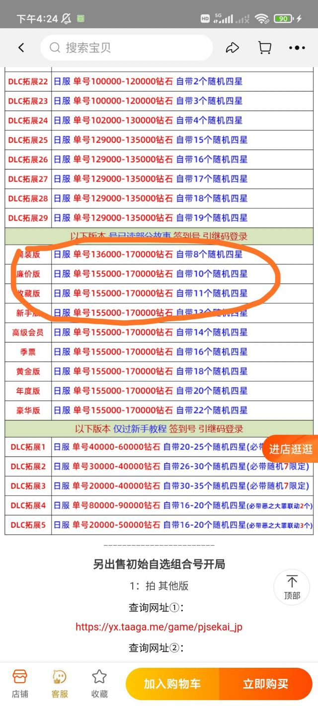
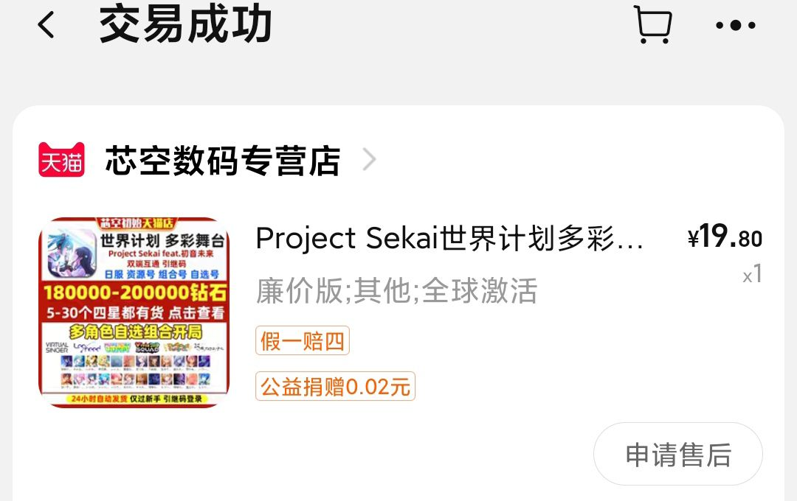
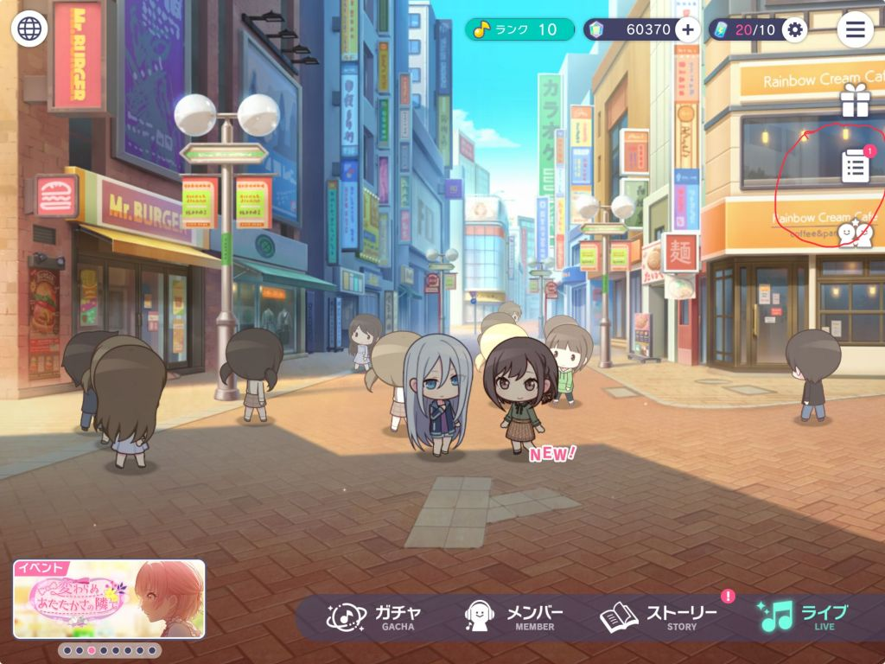
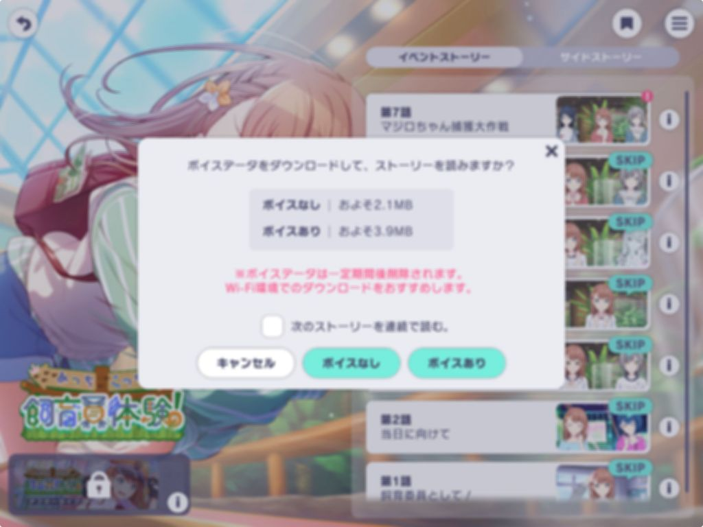

### [PJSK]避雷！最近暂时请不要购买部分初始号！

Made by ngapost2md (c) ludoux [GitHub Repo](https://github.com/ludoux/ngapost2md)

----

##### 0.[8] \<pid:0\> 2024-01-01 16:45:56 by wp75843
以下内容都是本人亲历<b>rpg4000+</b>
不知道我的经历是不是圈子内的默认规则。要是大家都知道，只是本人犯蠢，没好好了解踩坑了，请班务帮忙删帖。

正文
我于今年十月入坑，十二月开始陆续购买数个初始号。这些在12月后购买的初始号有以下共同特点：
1.<b>淘宝界面含有号已读部分故事字样</b>
如图，我买的19.8元自抽号，淘宝店家说明。

2.<b>奖励领取界面一直有一个红点未领取显示且无法去除</b>
如图
该红点确定不是任何未领取奖励，不是大月卡提示

3.<b>领取月卡奖励和剧情奖励需要点两次</b>
领取奖励后会卡住，然后再点一下，会有奖励领取的提示音，但不会弹出奖励领取的界面。实际上奖励也到账了。

4.<b>连续领取过剧情奖励会卡死</b>
如图，游戏画面变模糊，卡死。

然后我做了一些验证：
1.不同自抽号对比：带有<b>已读部分故事</b>字样的自抽号，只有一开始十月份购买的是正常的，12月开始购买的都不正常。
带有<b>仅签到</b>的初始号只购买一个，没有出问题。
2.卸载重下：没用。卡的依然卡。
3.iOS版本：15.6和17.2都一样，和iOS无关。

最后，我的问题只在贴吧和本区答疑高楼的后排(13还是14页)有同样例子，被坑的朋友应该不多。(或者当bug处理了)
其实以上bug都不影响打歌，但是很膈应人，领东西总要卡一下，也不知道店家的科技会不会出另外的问题，还是不推荐大家购买带有<b>已读部分章节</b>字样的初始号。  

编辑：有问题的号，以上bug都是<b>必定触发</b>，无一例外。

----

##### 1.[15] \<pid:735562829\> 2024-01-01 17:44:15 by 国电36计
这种大概率就是用科技过图导致的问题

----

##### 2.[0] \<pid:735564932\> 2024-01-01 17:58:44 by 天體觀测
确实中招了，和lz描述得完全一样，我还以为是我网的问题

----

##### 3.[1] \<pid:735865506\> 2024-01-03 11:21:16 by 远坂凛赛高哒
买初始记得问店家注册设备不然号丢了找都找不回

----

##### 4.[0] \<pid:740620300\> 2024-01-30 14:41:32 by Blessed995
同中招 这样是只能换个号了吗 已经玩了一个月了 红点和变模糊玩的好难受

----

##### 5.[0] \<pid:740626098\> 2024-01-30 15:09:15 by wp75843
>[jump](#pid740620300) Blessed995(2024-01-30 14:41) 说: 
>
>同中招 这样是只能换个号了吗 已经玩了一个月了 红点和变模糊玩的好难受

我的几个号都没有变正常，看你愿意愿意凑合玩了

