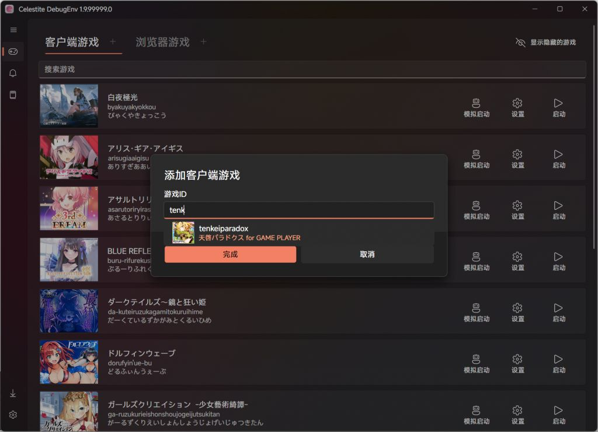
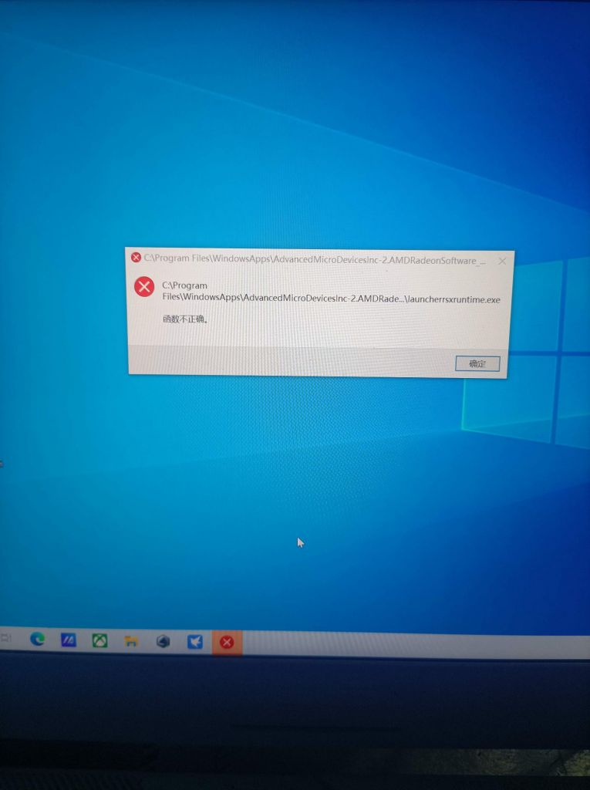

### [破事氵] [工具发布] Celestite 2 - 跨平台的自制DMMGamePlayer

Made by ngapost2md (c) ludoux [GitHub Repo](https://github.com/ludoux/ngapost2md)

----

##### 0.[86] \<pid:0\> 2024-01-20 00:43:37 by Switch46

<h4>Celestite 2</h4>Celestite 是一款提供完全<b>本地直连</b>功能的第三方 [DMMGamePlayer](https://player.games.dmm.com/)，最初的原型是专门为<b>白夜极光</b>的PC版开发的直连启动器，因群友~~本人~~实在受不了 DGP 曾经(指Java版)和现在(指Electron版)的低下性能和连接速度(还有区域限制)，现将其功能拓展到了整个 DMM Games 的范围。
Celestite 2 是曾经发布过的 [Celestite 1.x](https://bbs.nga.cn/read.php?tid=33485345) 的重制版，提供了更健壮的实现，更美观的UI和跨平台支持。
~~花了我两个小时做了个这么个图标出来~~<h4>功能</h4><ul><li>  在<b>不通过</b>第三方代理的情况下使用 DMMGamePlayer 的部分服务[^1]。
      </li><li> 支持使用 DMMGamePlayer 的登录态数据登录Celestite。
      </li><li> 对 DMM Games 中客户端游戏和直营网页游戏的完整下载/启动支持。
      </li><li> 支持在账号内快速添加游戏和基于桌面快捷方式/托盘的快速启动。
      </li><li> 支持自定义启动命令行。
      </li><li> 支持Linux，允许用户配置Wine或Proton等兼容层来启动Windows游戏。
      </li><li> 支持启动器内完成 [DMM POINT GET MISSION](https://mission.games.dmm.com/)[^2]。
      </li><li> 与 DMMGamePlayer 配置同步，双方均能正确读取对方的游戏数据，无需重新下载游戏[^3]。
      </li><li> 还有更多功能正在开发中...</li></ul>[^1]: 大部分服务是可以本地绕过区域限制的(包括下载和启动等常用请求)，对于部分无法绕过的机制，启动器内提供了 Himari Proxy 功能来反代这部分请求，见启动器内 Himari Proxy 部分的简介。
[^2]: 目前版本启动器内实现了对任务系统的完整解析，包括了一个模拟启动模块来实现不下载对应的游戏完成相应游戏任务的功能，但现在获取Medal后仍然需要自行手动前往官网换取DMMP。
[^3]: 很抱歉的是，这代表 Celestite 2 无法与 Celestite 1.x 同步数据。<h4>下载地址</h4>[百度网盘](https://pan.baidu.com/s/1t1aFedMFSVUBatHD7GxbZg?pwd=xwng)<h4>预览图</h4>

<a href="javascript:;" onclick="collapse(this);">+</a>点击展开 ...

<h4>部分问题解答</h4><ul><li> 对系统的兼容性怎么样？</li></ul>Celestite 主要为 Windows 10 及以上系统的用户开发，对于更低的系统版本尚未进行测试。
对于Linux版本，只在 Ubuntu 22.04(需要FreeDesktop)上进行过测试，对其他发行版的兼容性未知。
没有支持 macOS 的计划。<ul><li> 目前的适配范围是多少？</li></ul>Celestite 目前理论上适配 DMM Games 中提供的所有<b>免费</b>游戏(不包括模拟器版本)，对直营的网页游戏提供外置启动，有在本体内实现网页组件的计划。<ul><li> 有源代码吗？</li></ul>和 [Celestite 1.x](https://bbs.nga.cn/read.php?tid=33485345) 一致，Celestite 2 没有开源的计划。<ul><li> 现在的版本规划是什么样的？</li></ul>Celestite 2 仍处于 Beta 阶段，接受关于新功能和修正的各种建议。<ul><li> 我的数据安全吗？</li></ul>Celestite 会加密本地的用户数据，同时只和 DMM 官方的域名连接，不会连接其他域名，甚至不包含版本检查功能。[^4]
[^4]: 在开启 Himari Proxy 的情况下，部分数据需要发送到 Celestite 的服务器以完成功能，该功能默认关闭。<h4>特定游戏的已知问题解答</h4><ul><li> 启动 舰队Collection 时出现白屏</li></ul>这是因为浏览器自动把域名跳到了https，暂时没有找到合适的解决方法。<ul><li> Linux 下部分游戏启动失败</li></ul>这是因为部分游戏的反作弊无法在Wine/Proton环境下兼容。

----

##### 1.[1] \<pid:738819279\> 2024-01-20 00:52:12 by 谷朔
你是伟大的

----

##### 2.[3] \<pid:738819621\> 2024-01-20 00:55:37 by 平原兆力使
好好好，你是真的伟大。另外下载后还是默认在C盘吗？

----

##### 3.[0] \<pid:738819708\> 2024-01-20 00:56:26 by 亜珀
前排白兵前来报道！

----

##### 4.[0] \<pid:738819774\> 2024-01-20 00:57:07 by Switch46
>[jump](#pid738819621) 平原兆力使(2024-01-20 00:55):

游戏本体的下载和DGP一样都是可以调的 但是游戏后面下数据下到哪里就不在Celestite能管的范畴里了

----

##### 5.[0] \<pid:738819843\> 2024-01-20 00:57:50 by floraDM
好人一生平安

----

##### 6.[0] \<pid:738819984\> 2024-01-20 00:59:20 by 无名好萌萌即正义义眼把妹
正在用1.9的来lz点个赞

----

##### 7.[0] \<pid:738820128\> 2024-01-20 01:00:53 by Switch46
>[jump](#pid738819984) 无名好萌萌即正义义眼把妹(2024-01-20 00:59):

~~1.9现在看来就是当时赶工的纯纯黑历史了~~

----

##### 8.[0] \<pid:738820441\> 2024-01-20 01:04:39 by 平原兆力使
>[jump](#pid738819774) Switch46(2024-01-20 00:57):

游戏数据下载到C盘是真的麻，只能说日本程序员真的拉

----

##### 9.[0] \<pid:738820498\> 2024-01-20 01:05:15 by liuhao_909
s佬，神

----

##### 10.[0] \<pid:738820607\> 2024-01-20 01:06:31 by Switch46
>[jump](#pid738820441) 平原兆力使(2024-01-20 01:04):

这个倒不是日本程序员的问题
以常见的Unity3d引擎为例，他的默认持久化目录就在C盘

----

##### 11.[0] \<pid:738820730\> 2024-01-20 01:07:59 by lclsaber
资瓷~

----

##### 12.[0] \<pid:738820757\> 2024-01-20 01:08:16 by 平原兆力使
>[jump](#pid738820607) Switch46(2024-01-20 01:06):

懂了，那就只能用古法来转移了

----

##### 13.[0] \<pid:738821024\> 2024-01-20 01:11:12 by 炎萧
牛哇牛哇

----

##### 14.[0] \<pid:738910023\> 2024-01-20 16:54:06 by 平原兆力使
大佬，怎么切换成汉化的啊

----

##### 15.[0] \<pid:738911926\> 2024-01-20 17:07:58 by Switch46
>[jump](#pid738910023) 平原兆力使(2024-01-20 16:54) 说: 
>
>大佬，怎么切换成汉化的啊

什么汉化

----

##### 16.[0] \<pid:738912529\> 2024-01-20 17:12:09 by 平原兆力使
就是换成中文，我打开来默认是英文的

----

##### 17.[0] \<pid:738912818\> 2024-01-20 17:14:09 by 有冇搞錯
能打开fanza区吗？

----

##### 18.[0] \<pid:738913219\> 2024-01-20 17:17:09 by Switch46
>[jump](#pid738912529) 平原兆力使(2024-01-20 17:12) 说: 
>
>就是换成中文，我打开来默认是英文的

目前是按照系统语言来的 简中以外默认英文 暂时没有提供切换

----

##### 19.[0] \<pid:738913288\> 2024-01-20 17:17:39 by Switch46
>[jump](#pid738912818) 有冇搞錯(2024-01-20 17:14) 说: 
>
>能打开fanza区吗？

可以

----

##### 20.[0] \<pid:738915957\> 2024-01-20 17:36:53 by 米卡猛干诺艾尔
好好好

----

##### 21.[0] \<pid:738916682\> 2024-01-20 17:41:54 by 死んだ塩魚
有双开多开的功能吗

我两个号经常要切来切去

----

##### 22.[0] \<pid:738916913\> 2024-01-20 17:43:20 by 流流流、星
这是可以不用加速器直连吗？这也太dio了

----

##### 23.[0] \<pid:738917113\> 2024-01-20 17:44:44 by Sugar玲
握草，以前嫌麻烦不想试的有机会了

----

##### 24.[0] \<pid:738918456\> 2024-01-20 17:53:28 by Switch46
>[jump](#pid738916682) 死んだ塩魚(2024-01-20 17:41):

可以考虑引入 不是特别麻烦

----

##### 25.[0] \<pid:738918863\> 2024-01-20 17:56:11 by Akikaede
wc，是大佬，插个眼帮忙顶一下

----

##### 26.[0] \<pid:738919061\> 2024-01-20 17:57:27 by berrysmithy
mark…

----

##### 27.[0] \<pid:738921598\> 2024-01-20 18:15:50 by fgowhut
有点东西在里面的。

----

##### 28.[0] \<pid:738922252\> 2024-01-20 18:21:00 by 流浪地图
无敌啊！！！！！！！！！！！！

----

##### 29.[0] \<pid:738965928\> 2024-01-20 23:59:22 by Switch46
>[jump](#pid738916913) 流流流、星(2024-01-20 17:43):

是的 但能不能连上还要看你连日本的网络质量 只是解锁区域限制了

----

##### 30.[0] \<pid:738983467\> 2024-01-21 06:00:35 by 水硕小留
用来试试LO

----

##### 31.[0] \<pid:738999158\> 2024-01-21 10:19:55 by 流流流、星
>[jump](#pid738965928) Switch46(2024-01-20 23:59) 说: 
>
>是的 但能不能连上还要看你连日本的网络质量 只是解锁区域限制了

我试了一下lo真的可以流畅直连，大佬nb，但试网页游戏的时候就连不太上了

----

##### 32.[0] \<pid:738999937\> 2024-01-21 10:26:16 by PatayAngInahansaFA
不明觉厉

----

##### 33.[0] \<pid:739009419\> 2024-01-21 11:40:36 by 来打局昆特牌吧
大佬，想问一下我启动游戏提示这个是什么原因呀

----

##### 34.[0] \<pid:739011570\> 2024-01-21 11:56:16 by 来打局昆特牌吧
没事了大佬，我把之前dmm下载的游戏文件删掉重装就好了，很好用，谢谢大佬

----

##### 35.[0] \<pid:739019742\> 2024-01-21 12:52:44 by BBBBBSM
大佬登录DMM账号的时候显示 Dns server : Connectionreset ( evo.dmmapis.com : 443 )

这是什么意思

----

##### 36.[0] \<pid:739036454\> 2024-01-21 14:57:51 by Switch46
>[jump](#pid739011570) 来打局昆特牌吧(2024-01-21 11:56) 说: 
>
>没事了大佬，我把之前dmm下载的游戏文件删掉重装就好了，很好用，谢谢大佬

这个问题其实原因不明 目前只有少数近期修改过密码的用户有这个问题 暂定解决方法是重新登陆一次原版dgp即可修复

----

##### 37.[0] \<pid:739036739\> 2024-01-21 15:00:01 by Switch46
>[jump](#pid739019742) BBBBBSM(2024-01-21 12:52) 说: 
>
>大佬登录DMM账号的时候显示 Dns server : Connectionreset ( evo.dmmapis.com : 443 )
>
>这是什么意思

连接时自带了几个常用dns dns服务器连接失败了 建议重新打开尝试

----

##### 38.[0] \<pid:739039765\> 2024-01-21 15:24:35 by BBBBBSM
>[jump](#pid739036739) Switch46(2024-01-21 15:00) 说: 
>
>连接时自带了几个常用dns dns服务器连接失败了 建议重新打开尝试

我之后又重新打开了几次，重启电脑也试了几次，还是显示上述错误。不知道是不是我网络问题

----

##### 39.[0] \<pid:739041502\> 2024-01-21 15:37:12 by Switch46
>[jump](#pid738999158) 流流流、星(2024-01-21 10:19) 说: 
>
>我试了一下lo真的可以流畅直连，大佬nb，但试网页游戏的时候就连不太上了

网页游戏如果能弹出新窗口 celestite的职责就结束了 后面每个游戏可能有自己的区域管制就没法解决了

----

##### 40.[1] \<pid:739090459\> 2024-01-21 21:28:28 by Switch46
>[jump](#pid738916682) 死んだ塩魚(2024-01-20 17:41):

2.0.24021.4开始已经实现账号管理啦 可以直接在启动器里切号了 重新下载覆盖更新就行

----

##### 41.[0] \<pid:739090625\> 2024-01-21 21:29:36 by Switch46
>[jump](#pid738912529) 平原兆力使(2024-01-20 17:12):

新版本支持手动切换语言了 重新下载覆盖更新就可以

----

##### 42.[0] \<pid:739090777\> 2024-01-21 21:30:32 by Switch46
>[jump](#pid739039765) BBBBBSM(2024-01-21 15:24):

新版本调整了一下DNS相关的逻辑 自带DNS失败会尝试使用本机DNS 可以更新下试试

----

##### 43.[0] \<pid:739094317\> 2024-01-21 21:57:06 by IUUs
感谢大佬，立刻更新

----

##### 44.[0] \<pid:739104640\> 2024-01-21 23:16:50 by 清风袭花
想问大佬一个问题，我玩dmm的网页游戏，但是运行在浏览器上就会报错，但是用你的1.9版本单独出现一个窗口的时候就可以玩了，这是怎么回事？(这个问题导致我用2.0版本启动不了游戏，1.9却可以)

----

##### 45.[0] \<pid:739105295\> 2024-01-21 23:22:03 by 完全搞不懂在干什么
大佬这什么情况啊

----

##### 46.[0] \<pid:739105979\> 2024-01-21 23:27:05 by da苏da
吊的一比

----

##### 47.[0] \<pid:739110500\> 2024-01-22 00:04:18 by Switch46
>[jump](#pid739104640) 清风袭花(2024-01-21 23:16):

什么游戏

----

##### 48.[0] \<pid:739110568\> 2024-01-22 00:04:55 by Switch46
>[jump](#pid739105295) 完全搞不懂在干什么(2024-01-21 23:22):

网络不好，能直连=不用加速≠能连上

----

##### 49.[0] \<pid:739110688\> 2024-01-22 00:06:09 by 平原兆力使
>[jump](#pid739090625) Switch46(2024-01-21 21:29):

牛啊，大佬。神速

----

##### 50.[0] \<pid:739129835\> 2024-01-22 07:41:01 by 清风袭花
>[jump](#pid739110500) Switch46(2024-01-22 00:04) 说: 
>
>什么游戏

大佬没事了，我尝试了一下在chrome打开了，火狐则是报错，可能是浏览器内核原因。(顺便游戏是r18游戏)

----

##### 51.[0] \<pid:739130173\> 2024-01-22 07:46:42 by ilcyj
666可以的

----

##### 52.[0] \<pid:739134852\> 2024-01-22 08:37:50 by featherine1988
好啊好活啊
终于可以直连了

登录账号时候提示参数设置不正确是怎么回事

DmmOpenApi: パラメータが正しく設定されていません

----

##### 53.[0] \<pid:739155456\> 2024-01-22 10:34:54 by 洛缘_
您是真正的英雄

----

##### 54.[0] \<pid:739172954\> 2024-01-22 11:55:22 by 冬日里的落鹰
赞美大佬

----

##### 55.[0] \<pid:739182282\> 2024-01-22 12:46:54 by 苍空扬虹
艾斯老

----

##### 56.[0] \<pid:739183280\> 2024-01-22 12:52:47 by 2022happy
群u来给大佬点赞了

----

##### 57.[0] \<pid:739206792\> 2024-01-22 15:05:54 by Anstanno
埃斯佬，您是我的神

----

##### 58.[0] \<pid:739223971\> 2024-01-22 16:29:53 by 呱969527
资瓷~

----

##### 59.[0] \<pid:739236576\> 2024-01-22 17:32:22 by 茄子自走炮
mark一下

----

##### 60.[0] \<pid:739252842\> 2024-01-22 19:04:30 by yeyingyang
您是伟大的

----

##### 61.[0] \<pid:739277985\> 2024-01-22 22:11:24 by Mabour3
大佬牛逼！！！
而你，我的朋友，你是真正的英雄！

----

##### 63.[0] \<pid:739279169\> 2024-01-22 22:21:39 by cool836

----

##### 64.[0] \<pid:739291753\> 2024-01-23 00:07:54 by Switch46
>[jump](#pid739277985) Mabour3(2024-01-22 22:11) 说: 
>
>大佬牛逼！！！
>而你，我的朋友，你是真正的英雄！
>
>有个我耍的游戏能搜，但是添加它又搜不出来，麻了。
>
>

要设置里切表里站 游戏列表是不一样的

----

##### 65.[0] \<pid:739292285\> 2024-01-23 00:12:52 by Mabour3
>[jump](#pid739291753) Switch46(2024-01-23 00:07):

多谢大佬回复，原来我以前不知道什么时候手贱隐藏了游戏，我刚在隐藏列表挖出来了

----

##### 66.[0] \<pid:739331798\> 2024-01-23 10:09:04 by wtq
好好好，支持一下。我梯子流量大部分就是玩DMM页游的。

----

##### 67.[0] \<pid:739395655\> 2024-01-23 15:44:23 by xiongleda
提示 正在登陆.....
然后就没反应了，怎么回事？

----

##### 68.[0] \<pid:739414293\> 2024-01-23 17:11:37 by D1008208820
感谢dalao的工具. 非常好用.!

这里有个问题.

下载了这2个游戏, 同时只有1个能启动.
如果检查不能启动的游戏文件, 会下载约88M的更新, 之后这个游戏能启动, 另1个游戏不能启动.
然后检查另1个游戏文件...原来的游戏又不能启动.
求发生了什么.

----

##### 69.[0] \<pid:739420034\> 2024-01-23 17:38:15 by Switch46
>[jump](#pid739414293) D1008208820(2024-01-23 17:11):

无法复现，需要更多细节 比如是不是两个游戏下载目录放到一起了(正常情况下同目录下载会提供隔离)

----

##### 70.[0] \<pid:739420263\> 2024-01-23 17:39:23 by Switch46
>[jump](#pid739395655) xiongleda(2024-01-23 15:44):

网络问题，因为全程直连所以比较吃国际网络质量

----

##### 71.[0] \<pid:739439571\> 2024-01-23 19:28:34 by D1008208820
>[jump](#pid739420034) Switch46(2024-01-23 17:38):

疑似文件路径错误, 我把第1个游戏点了卸载结果连着放游戏的文件夹也删了...所有游戏都删没了...之后再下回来就没有问题...
能不能加个删除提示.?

----

##### 72.[0] \<pid:739442363\> 2024-01-23 19:47:13 by Switch46
>[jump](#pid739439571) D1008208820(2024-01-23 19:28):

增加提示这点可以考虑

但是正常情况下无论是DGP还是Celestite下载游戏都是有隔离的，而且共享同一个游戏记录文件(这样DGP和Celestite就能共享下载的文件)
最后处理游戏时(包括下载/更新/卸载)都是只处理记录里隔离的文件夹的(比如图中的girlscreation)，游戏根本不会下载到一起，所以你这种情况我不是很清楚是怎么产生的

----

##### 73.[0] \<pid:739447697\> 2024-01-23 20:26:23 by D1008208820
>[jump](#pid739442363) Switch46(2024-01-23 19:47):

我也很好奇.

目前无法复现当时的情况, 先这样吧...

----

##### 74.[0] \<pid:739462508\> 2024-01-23 22:17:40 by 袁卫英
直连启动出现这个提示是不是只能魔法上了？

----

##### 75.[0] \<pid:739476126\> 2024-01-24 00:00:47 by Switch46
>[jump](#pid739462508) 袁卫英(2024-01-23 22:17):

检查一下本地有没有那种全局的需要装证书的代理，如果过了这种代理就会出这个提示

----

##### 76.[0] \<pid:739477819\> 2024-01-24 00:15:42 by Switch46
>[jump](#pid739134852) featherine1988(2024-01-22 08:37):

是在什么界面显示的？一般情况下这个提示是说发送到DMM服务器的账号和密码不符合规范(比如长度不足之类的)

----

##### 77.[0] \<pid:739482755\> 2024-01-24 01:06:32 by 轻露
好东西，先点个眼

----

##### 78.[0] \<pid:739500798\> 2024-01-24 08:39:32 by 流浪地图
请教大佬.  我登录Fanza游戏以后,  为了保持加速效果, 还需要一直开着Cel吗?  还是说可以关了

----

##### 79.[0] \<pid:739519599\> 2024-01-24 10:21:46 by featherine1988
>[jump](#pid739477819) Switch46(2024-01-24 00:15) 说: 
>
>是在什么界面显示的？一般情况下这个提示是说发送到DMM服务器的账号和密码不符合规范(比如长度不足之类的)

就是登录界面，一进去的时候啊

不过我多试几次，或者挂了魔法，就能登录

反正主账号已经登录上了

小号没登陆上

已经可以使用了，感谢

----

##### 80.[0] \<pid:739579863\> 2024-01-24 15:39:19 by qwaeld114514
艾斯佬，我的超人！

----

##### 81.[0] \<pid:739605908\> 2024-01-24 17:52:30 by Switch46
>[jump](#pid739500798) 流浪地图(2024-01-24 08:39):

Celestite<b>不是</b>加速器，与你的网络没有关系，你的网页游戏启动之后就和它无关了

----

##### 82.[0] \<pid:739628092\> 2024-01-24 20:22:21 by 流浪地图
>[jump](#pid739605908) Switch46(2024-01-24 17:52) 说: 
>
>Celestite<b>不是</b>加速器，与你的网络没有关系，你的网页游戏启动之后就和它无关了

我是PC版LO。。。UU加速LO会很卡， 听说Cel不卡就来试试

----

##### 83.[0] \<pid:739629016\> 2024-01-24 20:29:15 by Switch46
>[jump](#pid739628092) 流浪地图(2024-01-24 20:22):

误解了一点，不过我本来的意思就是Celestite只是个启动器，是用来过<b>DMM的限制</b>的，所以<b>DMM上的游戏</b>有什么限制(例如锁IP等)Celestite无法处理也和它无关

----

##### 84.[0] \<pid:739635201\> 2024-01-24 21:17:11 by 豐國大明神
伟大无需多言！

----

##### 85.[0] \<pid:739697658\> 2024-01-25 10:17:33 by 未来福音S
大佬，旧版对网页游戏的置顶和单独浏览器窗口的支持我很喜欢，新版基本按照DMM官方启动器逻辑运行，客户端类还行，网页游戏就感觉很别扭，主要我网页游戏列表实在太多了(DMM游戏程序员太低级，已经关服了的游戏都还在列表里，一个一个删太麻烦了，我也不好分辨，排列也不是按最新启动时间排列的)，有没有办法添加置顶网页游戏的选项

----

##### 86.[0] \<pid:739711643\> 2024-01-25 11:22:08 by ZX_John
NewBee

----

##### 87.[0] \<pid:739811341\> 2024-01-25 20:32:47 by 符永恩
这个软件把我的Users文件夹下面的数据给扬了，把我桌面也给扬了，文件资源管理器的一些信息也给扬了
桌面上是我用过的软件、安装的galgame，我的Users文件夹里面有我好不容易玩过的游戏的数据

----

##### 88.[0] \<pid:739811616\> 2024-01-25 20:35:14 by Custaw
>[jump](#pid739811341) 符永恩(2024-01-25 20:32) 说: 
>
>这个软件把我的Users文件夹下面的数据给扬了，把我桌面也给扬了，文件资源管理器的一些信息也给扬了
>桌面上是我用过的软件、安装的galgame，我的Users文件夹里面有我好不容易玩过的游戏的数据

卸载的时候？

----

##### 89.[0] \<pid:739814544\> 2024-01-25 20:59:05 by 符永恩
>[jump](#pid739811616) Custaw(2024-01-25 20:35) 说: 
>
>卸载的时候？

我的确有在DMM Games配置里面有选过卸载选项，但它没有第一时间触发，之后我又选了指定现有游戏文件，因为我有那个游戏的程序，只是不能更新而已
可以正常打开那个游戏，但还是要我去更新，之后我在试验的过程中，我的安全软件弹出来了一条消息，是关于这个软件的行为进程的，我还以为是要更新那个游戏，就点了允许，结果在那后面我桌面上除了一个回收站和文件夹之外就没有其他东西了，桌面也变成了黑的，任务栏上一些图标也没了，Users文件夹里的文件基本上全没了，只有一些空的文件夹留了下来

----

##### 90.[0] \<pid:739868258\> 2024-01-26 09:14:45 by 符永恩
被清楚数据之后隔天弹出了这个，不知道有没有关系

----

##### 91.[0] \<pid:739919587\> 2024-01-26 13:38:43 by Switch46
>[jump](#pid739697658) 未来福音S(2024-01-25 10:17) 说: 
>
>大佬，旧版对网页游戏的置顶和单独浏览器窗口的支持我很喜欢，新版基本按照DMM官方启动器逻辑运行，客户端类还行，网页游戏就感觉很别扭，主要我网页游戏列表实在太多了(DMM游戏程序员太低级，已经关服了的游戏都还在列表里，一个一个删太麻烦了，我也不好分辨，排列也不是按最新启动时间排列的)，有没有办法添加置顶网页游戏的选项

DMM没有给页游提供官方的置顶功能，1.x的置顶功能是本地实现的，不走服务器，如果需要可以考虑在后续版本中更新。
单独浏览器窗口的问题受新框架限制暂时无法直接实现，后续更新中可能会以附加程序的方式实现(仍然使用系统WebView2，不会自带cef环境)。

----

##### 92.[0] \<pid:739924546\> 2024-01-26 14:06:45 by Switch46
>[jump](#pid739814544) 符永恩(2024-01-25 20:59):

Celestite 已经在 2.0.24025.1 开始增加删除和定位游戏时的二次提示，以防止类似的事件发生(如果在二次提示上出现不明目录请回帖告诉我)。

<a href="javascript:;" onclick="collapse(this);">+</a>点击展开 ...

对您发生的情况深感抱歉，我需要阐述一些事实说明相关功能的行为。

Celestite 和 DMMGamePlayer 共享配置文件 (%appdata%/dmmgameplayer5/dmmgame.cnf，文件结构见下)，而且卸载这部分的代码是基本一致的(截图见下，第一部分是 Celestite 的代码，其中选择的部分是2.0.24025.1开始增加的删除提示，第二部分是逆向的 DMMGamePlayer 的代码)。

<a href="javascript:;" onclick="collapse(this);">+</a>dmmgame.cnf ...

<a href="javascript:;" onclick="collapse(this);">+</a>Celestite ...

<a href="javascript:;" onclick="collapse(this);">+</a>DMMGamePlayer ...

根据您的描述，您第一步的操作是<b>卸载</b>，我的猜测是可能此时 DMMGamePlayer 的文件中的path已经被错误设置到 C:&#92;Users 或其他重要的根目录。
Celestite 只有在下载游戏和定位游戏时会修改path，下载游戏时会根据 install/cl 请求创建对应的隔离文件夹，而<b>定位游戏直接使用您选择的exe所在的文件夹</b>(因为 Celestite <b>默认</b>用户的游戏是从 DMMGamePlayer/Celestite 下载的，在其上下载<b>一定</b>有目录隔离)。
68楼提交过类似的问题，<b>但是我和提交者均无法在后续复现</b>，而且我在NGA上发布之前群里的内测人员也没有提过类似的问题，所以我倾向于这是 DMMGamePlayer 的BUG或者用户的操作问题，导致 dmmgame.cnf 被错误修改。

----

##### 93.[0] \<pid:740107817\> 2024-01-27 17:03:20 by cbd777
求教登录之后，软件直接闪退消失了是啥情况？

----

##### 94.[0] \<pid:740125944\> 2024-01-27 19:17:54 by 经验加三
>[jump](#pid739036454) Switch46(2024-01-21 14:57):

好像是因为DMM之前要求密码太简单的改一次密码，但是网页版能直接用绑定的其他平台账号快捷登录，所以之前网页版的游戏不改也可以进去，客户端这边要是不改密码会弹个改密码的页面，不改进不去，导致通过客户端启动的游戏都打不开，我去把密码更新了就能进去了

----

##### 95.[0] \<pid:740129047\> 2024-01-27 19:42:59 by Switch46
>[jump](#pid740107817) cbd777(2024-01-27 17:03):

请提交一下Log文件夹里最新的文件

----

##### 96.[0] \<pid:740129187\> 2024-01-27 19:43:59 by Switch46
>[jump](#pid740125944) 经验加三(2024-01-27 19:17):

会弹吗 我之前用群友的号测试 出这个东西之后重新上下DGP就好了 不知道为啥(Celestite 和 DGP 用的登录接口不一样，Celestite用的是DMM OpenAPI的，就是以前Java版的接口)

----

##### 97.[0] \<pid:740134114\> 2024-01-27 20:19:33 by 经验加三
>[jump](#pid740129187) Switch46(2024-01-27 19:43):

我刚刚就是下了客户端，输入密码他会弹个强制改密码的界面，我的密码是很早很早以前的纯数字密码，登录一直是用快捷登录

----

##### 98.[0] \<pid:740186753\> 2024-01-28 02:09:27 by 永夜的尘

大佬，为啥我一直启动失败的，重装游戏还是跳这个错误

----

##### 99.[0] \<pid:740196750\> 2024-01-28 07:32:26 by ms200tswd
大佬有没有群啊?海外用不了百度盘,别的谷歌盘onedrive盘都行谢谢大佬

----

##### 100.[0] \<pid:740197796\> 2024-01-28 07:54:33 by bigBandito
>[jump](#pid740196750) ms200tswd(2024-01-28 07:32):

1.x的群好像炸了，我在海外可以从度盘下啊

----

##### 101.[0] \<pid:740203710\> 2024-01-28 09:11:59 by ms200tswd
>[jump](#pid740197796) bigBandito(2024-01-28 07:54) 说: 
>
>1.x的群好像炸了，我在海外可以从度盘下啊

不是度盘问题，我没账号

----

##### 102.[0] \<pid:740257233\> 2024-01-28 15:33:30 by 永夜的尘
>[jump](#pid739036454) Switch46(2024-01-21 14:57):

大佬，我没用过dgp，还是意志跳这个错误，咋办呀

----

##### 103.[0] \<pid:740264564\> 2024-01-28 16:27:59 by Switch46
>[jump](#pid740257233) 永夜的尘(2024-01-28 15:33) 说: 
>
>大佬，我没用过dgp，还是意志跳这个错误，咋办呀

不是用不用dgp的问题 是dmm判定你这个密码不安全 要求你改密码 然后你改过之后用celestite就会弹这个错误 原因不明 目前解决方法就是用dgp登录一次

----

##### 104.[0] \<pid:740417800\> 2024-01-29 14:05:58 by cbd777
>[jump](#pid740129047) Switch46(2024-01-27 19:42) 说: 
>
>请提交一下Log文件夹里最新的文件

大佬，我还是闪退啊，请问具体怎么搞？log文件夹里的文件就是个日志文件吧？

----

##### 105.[0] \<pid:740445740\> 2024-01-29 16:16:53 by Switch46
>[jump](#pid740417800) cbd777(2024-01-29 14:05) 说: 
>
>大佬，我还是闪退啊，请问具体怎么搞？log文件夹里的文件就是个日志文件吧？

对 提交这个日志文件
我才能分析为什么闪退

----

##### 106.[0] \<pid:740481787\> 2024-01-29 19:16:09 by cbd777
>[jump](#pid740445740) Switch46(2024-01-29 16:16) 说: 
>
>对 提交这个日志文件
>我才能分析为什么闪退

特别长，我贴这合适么？还是贴出来吧，感谢诊断

[11:14:54.4200814] [THREAD-#1/INFO] App: Preparing for Avalonia env
[11:14:54.4563078] [THREAD-#1/INFO] App: Avalonia is loaded
[11:15:07.9217417] [THREAD-#1/FATAL] App: 
System.NullReferenceException: Object reference not set to an instance of an object.
   at Celestite.Utils.ConfigUtils.&lt;&gt;c.&lt;.cctor&gt;b__14_0(Object currentUserInfo, EventArgs _) + 0x45
   at Celestite.Network.DmmGamePlayerApiHelper.&lt;GetUserInfo&gt;d__24.MoveNext() + 0x23d
--- End of stack trace from previous location ---
   at System.Runtime.ExceptionServices.ExceptionDispatchInfo.Throw() + 0x20
   at Cysharp.Threading.Tasks.UniTaskCompletionSourceCore`1.GetResult(Int16) + 0xca
   at Cysharp.Threading.Tasks.CompilerServices.AsyncUniTask`2.GetResult(Int16) + 0x2e
   at Celestite.ViewModels.DefaultVM.LoginPageViewModel.&lt;ProcessUser&gt;d__11.MoveNext() + 0x132
--- End of stack trace from previous location ---
   at System.Runtime.ExceptionServices.ExceptionDispatchInfo.Throw() + 0x20
   at Cysharp.Threading.Tasks.CompilerServices.AsyncUniTask`1.GetResult(Int16) + 0xd2
   at Celestite.ViewModels.DefaultVM.LoginPageViewModel.&lt;ShowDefaultLoginButton&gt;d__14.MoveNext() + 0x340
--- End of stack trace from previous location ---
   at System.Runtime.ExceptionServices.ExceptionDispatchInfo.Throw() + 0x20
   at System.Runtime.CompilerServices.TaskAwaiter.ThrowForNonSuccess(Task) + 0xb2
   at System.Runtime.CompilerServices.TaskAwaiter.HandleNonSuccessAndDebuggerNotification(Task, ConfigureAwaitOptions) + 0x4b
   at CommunityToolkit.Mvvm.Input.AsyncRelayCommand.&lt;AwaitAndThrowIfFailed&gt;d__40.MoveNext() + 0x94
--- End of stack trace from previous location ---
   at System.Runtime.ExceptionServices.ExceptionDispatchInfo.Throw() + 0x20
   at System.Threading.Tasks.Task.&lt;&gt;c.&lt;ThrowAsync&gt;b__128_0(Object state) + 0x28
   at Avalonia.Threading.SendOrPostCallbackDispatcherOperation.InvokeCore() + 0x18a
   at Avalonia.Threading.DispatcherOperation.Execute() + 0x73
   at Avalonia.Threading.Dispatcher.ExecuteJob(DispatcherOperation) + 0x5d
   at Avalonia.Threading.Dispatcher.ExecuteJobsCore(Boolean) + 0xa4
   at Avalonia.Threading.Dispatcher.Signaled() + 0x3e
   at Avalonia.Win32.Win32Platform.WndProc(IntPtr hWnd, UInt32 msg, IntPtr wParam, IntPtr lParam) + 0x58
   at Celestite.Desktop!&lt;BaseAddress&gt;+0x1471a9a

----

##### 107.[0] \<pid:740614727\> 2024-01-30 14:12:25 by 棟方愛海
大佬，不想重新下载游戏了，所以就继续用1.9，但是每次打开都会跳更新公告，有办法关掉吗

----

##### 108.[0] \<pid:740661400\> 2024-01-30 17:44:40 by Switch46
>[jump](#pid740614727) 棟方愛海(2024-01-30 14:12):

1.9的更新服务器已经退回之前的版本了 不会弹了

