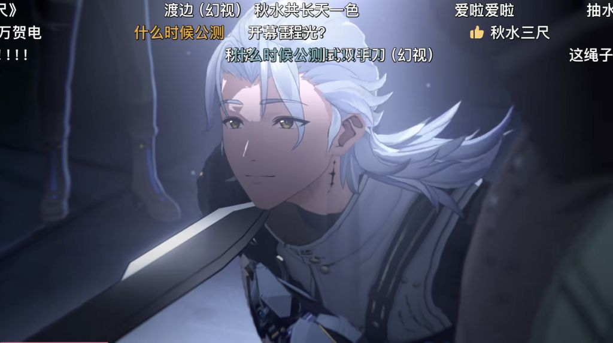

### [破事氵]鸣潮和原神的区别在哪里

Made by ngapost2md (c) ludoux [GitHub Repo](https://github.com/ludoux/ngapost2md)

##### 热门回复

- [1楼](#pid739458104): 开服男人更多一点
- [6楼](#pid739458422): 原末鸣初
- [8楼](#pid739458788): 有一种玩家不用担心某天说错话被开盒的安全感
- [12楼](#pid739459400): <b>Reply to [pid=739...

----

##### 0.[0] \<pid:0\> 2024-01-23 21:43:19 by 社区管理员工
好像今年要公测？想知道有哪些优势

----

##### 1.[217] \<pid:739458104\> 2024-01-23 21:43:56 by 多拉贡娘
开服男人更多一点

----

##### 2.[10] \<pid:739458190\> 2024-01-23 21:44:30 by 喋血小卖部
鸣潮的角色有鼻孔

----

##### 3.[26] \<pid:739458192\> 2024-01-23 21:44:32 by 普通上班族吉良吉影_
两坨屎有什么好比较的

----

##### 4.[24] \<pid:739458246\> 2024-01-23 21:44:54 by 炒股起家
shitgay PLUS

----

##### 5.[29] \<pid:739458304\> 2024-01-23 21:45:20 by 哒哒块
更多的男宝

----

##### 6.[52] \<pid:739458422\> 2024-01-23 21:46:17 by 石渡渡鸟
原末鸣初

----

##### 7.[0] \<pid:739458499\> 2024-01-23 21:46:58 by abasiyaluo2
等他公测再说吧，现在都没几个玩过的，要怎么比？
目前来看就是动作元素更足一些，特色是可以捕捉和变身成怪物。
缺点就是有男，有米氏三件套。

----

##### 8.[108] \<pid:739458788\> 2024-01-23 21:49:14 by 主打滑轨投降
有一种玩家不用担心某天说错话被开盒的安全感

----

##### 9.[6] \<pid:739459012\> 2024-01-23 21:50:55 by 鑫森淼燚垚
明朝是要取代元朝的

----

##### 10.[0] \<pid:739459109\> 2024-01-23 21:51:43 by RNG丶黛烟教坊司
虽然我是男的，但是我也觉得鸣潮男角色帅

----

##### 11.[31] \<pid:739459359\> 2024-01-23 21:53:34 by Redbaby
男角色得到的偏爱比女角色多多了，女角色是米式那种捏着鼻子卖女色的设计，俗称“高级色”露出了却又很普通，可以说一开始出生点就是须弥后期枫丹前期。。

建议不要带着“想玩女角色的人”入坑，男女混厕的社区会让你扭曲自己本来玩游戏的目的

----

##### 12.[59] \<pid:739459400\> 2024-01-23 21:53:49 by 加贺烧
>[jump](#pid739459109) RNG丶黛烟教坊司(2024-01-23 21:51):

你怎么还在

----

##### 13.[11] \<pid:739459554\> 2024-01-23 21:55:00 by sky丶鸣泣
社区管理领域大神

----

##### 14.[0] \<pid:739460724\> 2024-01-23 22:04:33 by 2和3谁最可爱
优势是相对的，特点的话鸣潮重动作一些。

----

##### 15.[27] \<pid:739461096\> 2024-01-23 22:07:08 by 我不会。
优势是相对的，特点的话鸣潮更重视xxn一些。

----

##### 16.[0] \<pid:739461169\> 2024-01-23 22:07:39 by 炎弹
区别在于米哈游本米和它的精神孝子

----

##### 17.[4] \<pid:739461535\> 2024-01-23 22:10:20 by 不灭英杰罗兰
等战双月卡到期就跑了下个月的手游开销又-98了呢

----

##### 18.[11] \<pid:739461713\> 2024-01-23 22:11:37 by 神圣的卡苟斯
有男不玩和多男不玩

----

##### 19.[8] \<pid:739461879\> 2024-01-23 22:12:49 by ihzuxnix
有剧情跳过，动作+1，跑图轻松+1
画面较暗-1，有男-1，

----

##### 20.[16] \<pid:739464672\> 2024-01-23 22:32:57 by 绝望之诗
理性的说，鸣潮比原微优化了一点，动作跟概率啥的，但是米家的“精华”被很好的保留了下来

----

##### 21.[15] \<pid:739465024\> 2024-01-23 22:35:36 by 鸟鸟howl
明朝男人比原多

----

##### 22.[0] \<pid:739466549\> 2024-01-23 22:47:12 by Linares
有武器池不玩

----

##### 23.[22] \<pid:739466878\> 2024-01-23 22:49:47 by 黎明星hai
绝对有xxn打拳举报，女角色设计保守，就我一个人代入不了主角，我男我也，男女角色剧情分配之类的贵物

----

##### 24.[21] \<pid:739467855\> 2024-01-23 22:57:14 by ZGDX夜
目前看男人比原开服多社区xxn也比原开服的时候多

----

##### 25.[3] \<pid:739470003\> 2024-01-23 23:12:37 by 平原兆力使
怎么说，米家的一些“美好精髓”也一起保留继承了

----

##### 26.[13] \<pid:739470089\> 2024-01-23 23:13:15 by 蓝梦公司
男的更多，女的更粽子

----

##### 27.[4] \<pid:739745527\> 2024-01-25 14:21:04 by 全部席卷而去
依我对库洛的了解，他必把原神踩的坑都踩一遍

----

##### 28.[3] \<pid:739753208\> 2024-01-25 15:00:33 by mushishixian
和原神的区别的就是,到时候库洛不仅会恶心男玩家,更会恶心女玩家,人家米桑目前至少在服务xxn,库洛那蠢b肯定是两头都顾不好

----

##### 29.[0] \<pid:739757167\> 2024-01-25 15:18:54 by lgthesun
没区别。
不玩。

----

##### 30.[0] \<pid:739761775\> 2024-01-25 15:41:42 by 放生才是真理
对呀，这是我最想不通的点
鸣潮像是故意往原神的方向靠一样
几乎不做区分
这拿自己当小米就算了
还真打算跟大米抢米虫啊

----

##### 31.[0] \<pid:740277287\> 2024-01-28 18:00:30 by 血腥鵺死战
大世界解密轻量化了
大世界正常奔跑无需体力条，只有攀爬飞檐走壁游泳时会出现
并且加入了障碍物飞跃、不卡房檐
除了每月活动还有肉鸽、飙车.挑战，深渊爬塔等玩法
剧情没跳过，但有快进
每日任务轻量化，控制在10分钟内
可变身的声骸可无限制在世界怪物、boss等地点刷取获得。对标原神使用体力获取的圣遇物
体力上限为240点，主要负责用于突破等材料.为了方便一些嫌肝地图麻烦的玩家，现在刷体力本也有概率掉落已有声骸
男女主可在角色栏随意更换使用
剧情角色全部大改已确认均无爆雷
鸣潮解包45级送自选五星武器
卡池角色80抽0.8概率小保底比原少10抽多0.2概率且会掉4/5碎片合成角色和命座
武器池单up80必出无原神两次小保底
你在原神歪的那些破烂够在鸣潮当中上阶层的玩家了
上面几点都是这两年玩家给老米提意见提到起老茧的东西，每个对原神都是降维打击，其他比较主观，例如角色精度.场景美术优化迭代，动作性玩法深度，无娘化.媚腐角色.无弱智保姆软件,无机制阉割拆分等等就不详细说了

----

##### 32.[0] \<pid:740277600\> 2024-01-28 18:02:39 by 在纽约的企鹅
看着有乳摇，有沟，比原神领先很多了

----

##### 33.[0] \<pid:740278009\> 2024-01-28 18:05:26 by 人生如梦a55
可以跳过人生

----

##### 34.[0] \<pid:740278253\> 2024-01-28 18:07:24 by 厄咒
>[jump](#pid740277287) 血腥鵺死战(2024-01-28 18:00):

有人说角色绑定专武，这个是真的不？别现在就打包票说角色没机制拆分，战双去年甚至打算整个烂活，角色动作打算拆分，当然最后被喷回去了

----

##### 35.[0] \<pid:740278944\> 2024-01-28 18:12:11 by 血腥鵺死战
>[jump](#pid740278253) 厄咒(2024-01-28 18:07):

UP武器基本就是拿来当提升数值的工具，角色自带攻击效果，例如忌炎耍枪的他专武是刀
提升数值方向也是针对某一种攻击类型进行加强，并不存在UP角色能用，同类型角色不能用的说法，就算是原神雷神剃刀其实泛用性也是有一点点的
机制拆分的理解属于是你不抽命座就自身循环输出或无法得到该角色职能的完整体验.会玩的相当不爽.例如雷神不抽2命就无法在全辅助构成的队伍里当主C.例如一斗不抽2命就无法达到自身大招循环，例如夜兰不抽1,2命就无法多量挂水.快速跑图，特殊例子如卢姥爷不到6命输出就低180%等等
如果你只说拆分了角色伤害或攻击特效，那请问有影响到他原本的输出职能定位么，命座不就是拿来卖数值伤害的所以不存在.除非和卢姥爷这样拆分伤害到非常严重导致你无法正常游玩的情况出现

----

##### 36.[0] \<pid:740280523\> 2024-01-28 18:22:37 by 厄咒
>[jump](#pid740278944) 血腥鵺死战(2024-01-28 18:12):

我当然知道原神角色拆分严重，但我是为了告诉你别现在就替kl说角色机制不拆分

----

##### 37.[0] \<pid:740280889\> 2024-01-28 18:24:55 by wyfmmmmm
女玩家说kl厌女
你们说kl厌男

确实有可能学厂。毕竟鸡屎本屎。但目前看要直的多

几个男五星 一个是fgo狗哥 一个是萨菲罗斯

也不算媚女 暂时。

八十抽小保底  武器100up 有自选 三人小队

但是我认为他的问题主要在数值策划和剧情编剧

----

##### 38.[0] \<pid:740280926\> 2024-01-28 18:25:08 by yaemikochan
更偏向动作游戏了  氛围也是那种灰蒙蒙的末世

----

##### 39.[0] \<pid:740281440\> 2024-01-28 18:28:45 by 血腥鵺死战
>[jump](#pid740280523) 厄咒(2024-01-28 18:22):

这个也属于主观问题了，你可以去外网[url](https://encore.moe/character/1302) 看下命座介绍，我个人认为属于纯粹增伤就没拆分

----

##### 40.[0] \<pid:740282120\> 2024-01-28 18:33:15 by 对对双双
>[jump](#pid740278944) 血腥鵺死战(2024-01-28 18:12):

跟战双那样命座拆分机制么？会有2S可肝但是3S完全体的现象存在么？感觉输出无限循环播片大招这个现在说肯定还是太早了

----

##### 41.[4] \<pid:740282161\> 2024-01-28 18:33:28 by 厄咒
>[jump](#pid740280889) wyfmmmmm(2024-01-28 18:24):

剧情我相信kl会改，毕竟战双现在就这个还不算完全崩盘但说真的，kl的运营和数值真的牛p而且手综有人说不建议玩鸣潮也是因为现在大环境激化矛盾了，不是以前战双开服有男女角色那样了有人明知会招来奇怪生物搞事，自然就不想从一开始再投入进去

----

##### 42.[4] \<pid:740282177\> 2024-01-28 18:33:35 by ZGDX夜
不是这回轮到库学长挖坟了是吧

----

##### 43.[11] \<pid:740282248\> 2024-01-28 18:34:08 by 林间小树
有男不玩，优势在于男的更多，开局就有xxn。

----

##### 44.[0] \<pid:740282494\> 2024-01-28 18:35:52 by 血腥鵺死战
>[jump](#pid740282161) 厄咒(2024-01-28 18:33):

我反正只是谁有需要知道鸣潮环境，我就随便说一说提供帮助，至于该版的男的不玩，我接不住

----

##### 45.[4] \<pid:740282660\> 2024-01-28 18:37:08 by 厄咒
>[jump](#pid740281440) 血腥鵺死战(2024-01-28 18:28):

你要听清楚我说的话，鸣潮现在确实角色没机制拆分，专武我不清楚有没有下位替代，但就以战双的发展趋势看下去，还是别现在就替他们保证为好

----

##### 46.[0] \<pid:740282764\> 2024-01-28 18:37:56 by 纪灵玥
开局男女更平衡一点。

----

##### 47.[2] \<pid:740282972\> 2024-01-28 18:39:18 by 厄咒
>[jump](#pid740282494) 血腥鵺死战(2024-01-28 18:35):

是的，玩不玩确实还是个人的选择罢了

----

##### 48.[1] \<pid:740283127\> 2024-01-28 18:40:19 by 血腥鵺死战
>[jump](#pid740282660) 厄咒(2024-01-28 18:37):

说了嘛，我只提供现有讯息，未来的事这谁说得准呢？谁也不知道老米为啥会突然跑去卖了1年男角色还都是粪到极品的，库洛你骂了起码他还会滑跪不是

----

##### 49.[0] \<pid:740283139\> 2024-01-28 18:40:25 by 有男不玩
>[jump](#pid0) 社区管理员工(2024-01-23 21:43) 说: 
>
>好像今年要公测？想知道有哪些优势

名字不同？

----

##### 50.[0] \<pid:740284841\> 2024-01-28 18:52:01 by 捏噗涅噗涅
这段时间的内测也不能直播吧？我反正没看到直播的。你们都在和原比，但我却在和绝区零比，对我来说根本就是，是不是米家的养成，绝区零不是米家体系的概率比他们的池子概率还低，鸣潮在此之上可能还有那么一丢丢进步，概率上大一点。要是还是命座+专武，池子保底+概率就优化了一点点，还是刷圣遗物整二级词条然后给你体力限制卡死你的养成进度，我肯定玩不了一点。随机二级词条还有体力限制不让你刷，这是最难受的，我完全不能接受。角色好不好看决定我会不会下游戏，养成舒不舒服决定玩不玩下去。

----

##### 51.[0] \<pid:740284946\> 2024-01-28 18:52:32 by 最后一个马甲了
动作怪物设计都秒杀原那种低幼把

女角色也够瑟

----

##### 52.[7] \<pid:740287603\> 2024-01-28 19:08:47 by 三无酱
战双几个版本的辅助机早就不是当初允诺的提升队伍体验的东西了，这种对角色的延伸物的尝试，本身就是对机制拆分的试探。

这游戏一直难拉新，就是因为每个版本玩家的队伍阵容和对下个版本的收益预期卡的太死了。

这就是为什么渡边那个版本出了个火属性之后，玩家对库洛“自由”的调侃，已经不是那种中性的调侃了。

也是为什么新版本直接开了个新属性赛道。

为什么会有人觉得鸣潮会是战双基础上的优化呢。

我玩了这么多年战双更倾向于认为他们新项目就是在对标米哈游。

我感觉库洛是真的眼馋米哈游的一般向，因为战双这么多年的二创基本等于没有。

库洛肯定是想吃二创红利想的要死的。

那这恰恰就是我不看好库洛的原因，一般向我为什么不去试王者荣耀世界，那个社交价值不比你库洛的新项目大的多。

我会思考一个问题，我在鸣潮里认识的会是一个什么样的用户呢。 我在王者荣耀世界里遇到正常人的概率会大一些。

你们还记得曾经库洛会为了玩家删除比安卡和渡边的一些文字设定，好断绝cp党的念头，给比安卡ml的营收方向让路。

那你们能想象如果不删除当初那个设定，会有多少比安卡和渡边的cp党吗。

这些东西，我已经可以想象到，你在一般向的鸣潮里都会看到————而我选择不去看到。

----

##### 53.[0] \<pid:740287960\> 2024-01-28 19:11:15 by 厄咒
>[jump](#pid740287603) 三无酱(2024-01-28 19:08):

说起来也好笑，战双二创半死不活好像还跟kl曾经插手有关，至少我听过有人这样说

----

##### 54.[4] \<pid:740288156\> 2024-01-28 19:12:36 by wyfmmmmm
>[jump](#pid740287603) 三无酱(2024-01-28 19:08) 说: 
>
>战双几个版本的辅助机早就不是当初允诺的提升队伍体验的东西了，这种对角色的延伸物的尝试，本身就是对机制拆分的试探。
>
>这游戏一直难拉新，就是因为每个版本玩家的队伍阵容和对下个版本的收益预期卡的太死了。
>
>这就是为什么渡边那个版本出了个火属性之后，玩家对库洛“自由”的调侃，已经不是那种中性的调侃了。
>
>也是为什么新版本直接开了个新属性赛道。
>
>
>
>
>
>
>为什么会有人觉得鸣潮会是战双基础上的优化呢。
>
>我玩了这么多年战双更倾向于认为他们新项目就是在对标米哈游。
>
>
>
>我感觉库洛是真的眼馋米哈游的一般向

还在二创 牢大不早告诉你时代变了 都是商单

----

##### 55.[0] \<pid:740288629\> 2024-01-28 19:16:05 by wyfmmmmm
>[jump](#pid740282161) 厄咒(2024-01-28 18:33) 说: 
>
>剧情我相信kl会改，毕竟战双现在就这个还不算完全崩盘但说真的，kl的运营和数值真的牛p而且手综有人说不建议玩鸣潮也是因为现在大环境激化矛盾了，不是以前战双开服有男女角色那样了有人明知会招来奇怪生物搞事，自然就不想从一开始再投入进去

虽说是有三个男五星

但是这三个 一个狗哥 一个萨菲罗斯 一个舞狮的
这几个暂时说不上媚女

从女角色来讲，说实话不如其他手游女角色烧

他的数值策划我不谈。 但是pv里面那个两级反转，从枪指你变成膝枕加gc脸  而且时间那么短，真的能把剧情改好吗？

----

##### 56.[2] \<pid:740288878\> 2024-01-28 19:17:45 by 厄咒
>[jump](#pid740283127) 血腥鵺死战(2024-01-28 18:40):

怎么说呢，现在有人传kl打算也搞米商单二创那一套，加上去年kl也开始装死提纯，我个人觉得他们就是在向米运营靠拢

----

##### 57.[0] \<pid:740289055\> 2024-01-28 19:18:44 by 科尔斯·斯林顿
是有男不玩和有男不玩的区别

----

##### 58.[0] \<pid:740289720\> 2024-01-28 19:23:27 by 厄咒
>[jump](#pid740288629) wyfmmmmm(2024-01-28 19:16):

如果是战双那边文案改应该大差不差吧？我看有人说的类似角色突破之后每个角色都感谢主角借他们力量有点类似我以前的灵感，比如既然主角可以用葫芦收boss的力量别人用不了还会暴走，完全可以说主角借给人物力量所以每个自机才能使用boss的技能但我从主角定成漂泊者就觉得怪怪的，毕竟漂泊在汉语里可不是什么褒义词，原的旅行者虽然摄像机化了，但人家只是旅行好歹还会回家，漂泊者给我感觉就是家都没了只能四处流浪

----

##### 59.[1] \<pid:740290087\> 2024-01-28 19:26:04 by 厄咒
>[jump](#pid740288629) wyfmmmmm(2024-01-28 19:16):

实际上成男还是偏向媚女的，就有一个细节可能你没注意，比如忌炎的胸口，还特地给nipples弄了凸起装饰

----

##### 60.[0] \<pid:740290390\> 2024-01-28 19:28:02 by LKWeng
>[jump](#pid739459109) RNG丶黛烟教坊司(2024-01-23 21:51) 说: 
>
>虽然我是男的，但是我也觉得鸣潮男角色帅
>

还行吧，有男不玩也不是讨厌男性角色，是讨厌随之而来的腐女(性别女？)+没有精力为了一款游戏和腐女(性别女？)辩经

----

##### 61.[0] \<pid:740290439\> 2024-01-28 19:28:26 by wyfmmmmm
>[jump](#pid740289720) 厄咒(2024-01-28 19:23) 说: 
>
>如果是战双那边文案改应该大差不差吧？我看有人说的类似角色突破之后每个角色都感谢主角借他们力量有点类似我以前的灵感，比如既然主角可以用葫芦收boss的力量别人用不了还会暴走，完全可以说主角借给人物力量所以每个自机才能使用boss的技能但我从主角定成漂泊者就觉得怪怪的，毕竟漂泊在汉语里可不是什么褒义词，原的旅行者虽然摄像机化了，但人家只是旅行好歹还会回家，漂泊者给我感觉就是家都没了只能四处流浪

时间太短了

而且他所有的泄漏视频全是打怪

大地图玩法呢？ 没有一个超远程狙击角色很怀疑他大地图的利用率

----

##### 62.[0] \<pid:740596601\> 2024-01-30 12:36:46 by 血腥鵺死战
>[jump](#pid740288878) 厄咒(2024-01-28 19:17):

首先游戏质量过硬吹是没毛病的，wow早前版本为啥吹了这么多年没人质疑不就这个原因。二创这种东西就只属于作料，既增进对游戏的热情，也能带动视频作者的经济效益.如果游戏不好玩，你看二创大概看个3,4个月就腻味了.
只有当游戏质量不符合他吹的要求时，你才会觉得这套运营出现病症.就是所谓的xz和社管尬吹。
现在鸣潮改了90%游戏资产已经表明他的态度了，老米的3纠缠5天换到现在也得到一个宁愿B站买僵尸粉对冲掉粉也不愿意多给一个纠缠.
其实游戏小节奏装死可以理解，因为极可能是一小部分玩家引起的骚乱不足以动摇游戏进程，大节奏装死那可就是米哈游的特权，主祭没进局子前你看谁敢在B站放个屁，现在那些进去了才有人敢站出来说话.
到现在我都还没见到什么冰清玉洁的游戏厂家能不被骂上两句的，你不可否认库洛对玩家的态度属于是矮子里面挑高个的了，你对任何一家游戏公司抱有质疑时先看同行的表现如何，不然只能是带有偏见和攻击目的性质的演说罢了.

