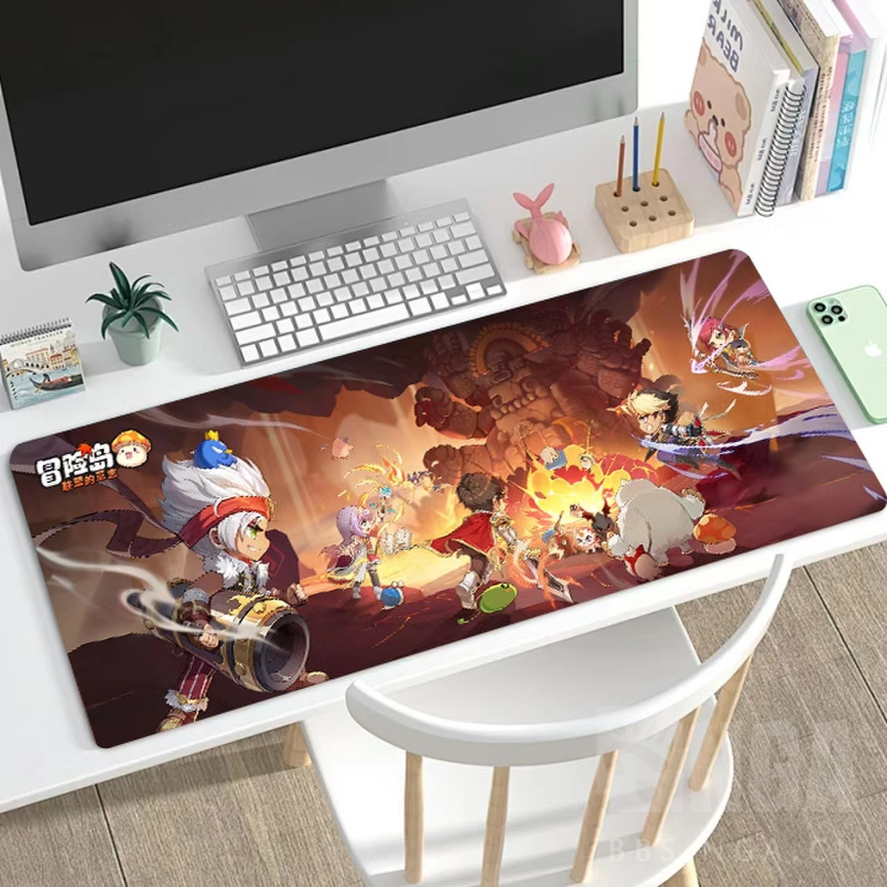
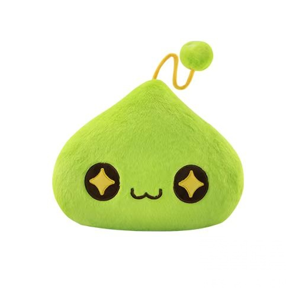
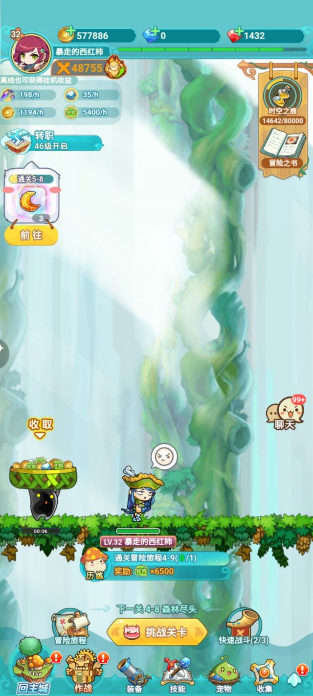
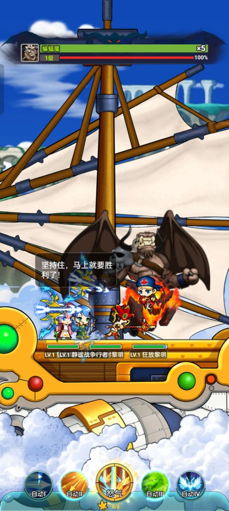
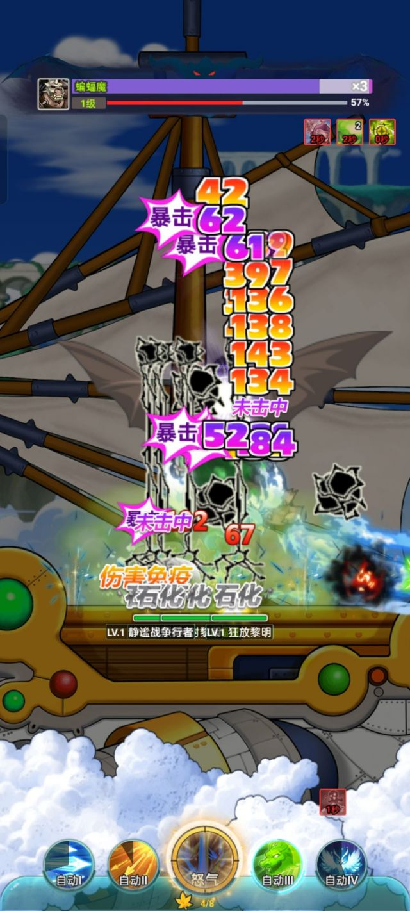
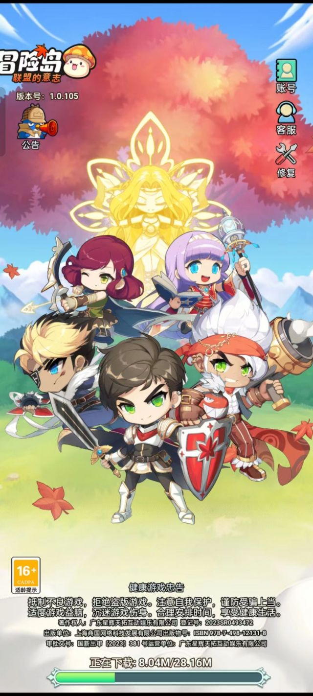

### [活动]  NGAx《冒险岛:联盟的意志》公测活动，分享游戏感想，抽京东卡奖品

Made by ngapost2md (c) ludoux [GitHub Repo](https://github.com/ludoux/ngapost2md)

----

##### 0.[0] \<pid:0\> 2024-01-24 16:01:00 by PolygonPanda

[url](http://music.163.com/outchain/player?type=2&amp;id=27901823&amp;auto=1&amp;height=66)

不知你是否还记得这首BGM，那么当你听到这个BGM是否有对冒险岛美好的记忆慢慢浮现出来？如今你是否还记得冒险岛，可否与我们一起分享这一份美好的记忆。

<b>活动时间：</b>
1/24~2/04

<b>参与方式：</b>
<b>在评论中分享你与冒险岛的记忆，并说出《冒险岛:联盟的意志》的游戏体验感受(注意是“联盟的意志”不是别的冒险岛游戏哦)</b>

我们将从所有符合条件的回复中抽取：
<b>活动奖品：</b>
京东卡100 x 10
主题鼠标垫 x5

主题抱枕 x3(款式随机发出)

游戏下载链接：
[url](https://mxd.rastargame.com/ad1/nga)

<b>注意事项：</b>
1. 为了公平抽奖，每个论坛账号只能参与一次活动，如发生有人恶意多开小号参与活动将会取消中奖资格；
2. 活动奖品将会在获奖名单公布之后，由论坛工作人员私信联系获奖者(请认准相关用户组，谨防受骗上当)，请务必在私信起7天内回复中奖信息，逾期视为放弃奖品；
3.发表的游戏体验感受需符合《冒险岛:联盟的意志》的实际情况，不能复用别人的评论，不能发表别的游戏的体验感受，否则判定为不符合活动规则
4. 回帖内容必须符合NGA论坛规则，对于在活动帖捣乱的用户(包括但不限于攻击游戏、回复非活动相关内容等)，最低处以6天+扣300声望处罚；
5. 若回复未满足活动规则的楼层中选，将自动顺延至下一楼层，直至满足活动规则；
6. 本活动最终解释权归NGA所有。

----

##### 1.[0] \<pid:739628844\> 2024-01-24 20:28:03 by Vlscounts
小时候第一次玩就跟进入异世界一样，轻松舒适的BGM，可爱的怪物，还有漂亮的角色，给我了一个非常快乐的童年。 我记得当时70多级，刷图刷一天都升级不了，真的算是这辈子我玩过升级最慢的游戏。希望冒险岛:联盟的意志游戏大卖

----

##### 2.[0] \<pid:739634573\> 2024-01-24 21:12:01 by wyf9163
勇士部落，射手村，扎昆
感觉《冒险岛:联盟的意志》很不错

----

##### 3.[1] \<pid:739636191\> 2024-01-24 21:25:37 by Captain墨白
冒险岛啊 那可是童年啊 小时候跟着表哥入坑 那个音乐真的刻入DNA了 最记得是坐船去很远的地图 可以挂机很久哈哈哈

----

##### 4.[0] \<pid:739636510\> 2024-01-24 21:28:06 by Doutundog
冒险岛就一直断断续续的玩，一年回坑一次属于是
很喜欢bgm 冒险岛的bgm真的非常出色，不说了该肝6转了  
联盟的意志今天刚下了玩，感觉整体比枫之传说好那个太肝了，不如联盟轻松还是竖屏

----

##### 5.[0] \<pid:739660257\> 2024-01-25 00:48:36 by 流动偏好
《冒险岛:联盟的意志》的游戏体验感受挺好的，BGM很好听

----

##### 6.[0] \<pid:739676085\> 2024-01-25 08:07:53 by 休比啊
作为一个放置类游戏，冒险岛真的很全面了，上手容易，职业细化，刺客，法师都挺好玩的

----

##### 7.[0] \<pid:739697607\> 2024-01-25 10:17:17 by 羊腿先森
游戏画质极具美感，色调丰富并且鲜明，带给玩家一种清新愉悦的体验。在游戏中，我们可以操作角色在不同场景间自由穿越，探寻未曾踏足的区域，解决各类谜题与任务。
游戏不仅包含基本任务和剧情线，还有许多有趣的副本与活动供玩家挑战，从而不断提升自己的实力。尤其是游戏中的PVP玩法，令人乐在其中，难以自拔！

----

##### 8.[0] \<pid:739699229\> 2024-01-25 10:24:50 by 江火风
冒险岛啊，小时候的游戏了。这个新游戏我看了下，感觉还原的不错，有点内味了。

----

##### 9.[0] \<pid:739703265\> 2024-01-25 10:44:05 by dez1313
高中的回忆了，那时候每次放假都玩一会冒险岛

----

##### 10.[0] \<pid:739714543\> 2024-01-25 11:34:18 by wodeshi3
我是一个从小就喜欢玩冒险岛的老玩家，我还记得当年和朋友们一起在射手村、天空之城、水下世界等地图冒险的快乐时光。当我听说有一款新的冒险岛手游《冒险岛:联盟的意志》要上线时，我非常激动，立刻下载了游戏，准备重温那些美好的回忆。
游戏一开始，我就被它的画面和音乐所吸引，它完美地还原了经典的冒险岛风格，让我感觉自己又回到了那个熟悉的世界。我选择了我最喜欢的飞侠职业，开始了我的冒险之旅。游戏的操作非常简单，只需要单手就可以完成各种动作，而且还可以自由切换自动和手动模式，让我可以根据自己的喜好和情况来选择玩法。游戏的挂机放置功能也非常方便，让我在忙碌的时候也不用担心错过任何资源和奖励，只要定时回来收取就可以了。
游戏中的内容非常丰富，除了有各种经典的副本和BOSS，还有很多新的玩法和系统，让我可以不断地探索和发现。我特别喜欢游戏中的宠物系统，它让我可以收集和培养各种可爱的宠物，还可以和它们一起战斗和互动，感受它们的忠诚和温暖。游戏中的宠物不仅有各种不同的品质和形态，还有各种不同的技能和属性，让我可以根据自己的战斗风格来搭配它们。宠物之间还有羁绊系统，让我可以激活它们之间的特殊效果，增强它们的战斗力。

----

##### 11.[0] \<pid:739719122\> 2024-01-25 11:55:04 by zhj2002
《冒险岛:联盟的意志》是我大学的回忆啊
那时候上课偷偷玩

----

##### 12.[0] \<pid:739728477\> 2024-01-25 12:43:39 by lq0182
记得上高中时候，去同学家看他玩《冒险岛:联盟的意志》，每天在学校和他讨论游戏的内容，很开心，如今过了这么多年，同学已经不再联系，只有《冒险岛:联盟的意志》依然陪伴着我

----

##### 13.[0] \<pid:739763986\> 2024-01-25 15:52:31 by UID43353307
怀念当年和同学在网吧通宵刷绿水灵和刺蘑菇的日子吖，魔法密林和水灵洞的音乐到现在还回经常循环播放，现在想听的话登录《冒险岛:联盟的意志》就能随时听啦

----

##### 14.[1] \<pid:739781707\> 2024-01-25 17:21:37 by 瞄服小萨满
我特么楼上全是机器人是吧 XXXX关键字填空，但凡下载玩过的 你就知道这游戏有多垃圾

----

##### 15.[0] \<pid:739783188\> 2024-01-25 17:28:51 by 佩佩～
《冒险岛:联盟的意志》玩起来还不错，做任务给的奖励挺丰厚的，回忆感满满~

----

##### 16.[0] \<pid:739804016\> 2024-01-25 19:39:18 by 库库库玛玛
《冒险岛:联盟的意志》玩起来轻松休闲

----

##### 17.[0] \<pid:739836292\> 2024-01-25 23:45:56 by 忠心选择源泉
这游戏满满是情怀和青春啊，怎么说呢，游戏的确多了很多创新，但是也保留了很多经典的东西，主线任务和剧情不肝，任务还是挺容易就完成的，玩得也比较轻松。游戏在画面上也精致，眼睛不疼，色彩饱满好看，让我们一下子又回到了当年的青涩模样，这对于怀旧玩家来说无疑是满满的福利，期待后续的剧情和角色多样化！

----

##### 18.[0] \<pid:739837424\> 2024-01-25 23:55:54 by czx32167qq
以前小时候和同学小伙伴一起玩冒险岛很开心，现在玩《冒险岛:联盟的意志》人物形象很喜欢还找到了好朋友，玩法还不错。

----

##### 19.[0] \<pid:739868811\> 2024-01-26 09:17:53 by 丛木
放置游戏还不错

----

##### 20.[1] \<pid:739869710\> 2024-01-26 09:22:41 by HalberMond
卧槽全是社管

----

##### 21.[0] \<pid:739902675\> 2024-01-26 12:03:16 by calrabe
小时候接触的第一款网游就是冒险岛了。联盟的意志真的是情怀拉满了

----

##### 22.[0] \<pid:739907958\> 2024-01-26 12:31:32 by lelfuy
最开始还是红白机玩的冒险岛，特别喜欢。童年的回忆了。前几年玩过手游冒险岛，纯属回忆杀了。不知道是不是山寨。
联盟意志还不错，占用空间不是很大。pad玩的，还是双手好用。

----

##### 23.[0] \<pid:739908471\> 2024-01-26 12:34:26 by 蓝梦公司
这是……机器人军团?

----

##### 24.[0] \<pid:739929666\> 2024-01-26 14:34:57 by 丛林冒险猴
《冒险岛:联盟的意志》的BGM挺还原的，还是熟悉的味道
作为一个休闲游戏来说还是可以的，玩起来不肝

----

##### 25.[0] \<pid:739936820\> 2024-01-26 15:13:02 by 单手举贾玲
熟悉的bmg直呼爷青回啦，它完美地还原了经典的冒险岛卡通画风，画风有新的内容，感觉还是以前的感觉，那些熟悉的场景和NPC让人眼前一亮，游戏中的角色设定也比较丰富多彩，每个角色都有他们的特点，新出的挂机机制让玩家们不用那么累，上班摸鱼也能玩，哈哈哈这个好评！

----

##### 26.[0] \<pid:739970286\> 2024-01-26 18:04:41 by 螃蟹秘密
最开始玩的是黄卡冒险岛，主人翁好胖，过不了一关。后来有网络了就和弟弟们一起在网吧玩，小青春ye  

当时喜欢那种Q萌的感觉

----

##### 27.[0] \<pid:739981376\> 2024-01-26 19:09:51 by speed音乐盒
小时候第一次接触冒险岛就爱上了，当初跟小伙伴一起打蜗牛，打花蘑菇 毒蘑菇 漂漂猪真的很欢乐，bgm是真的好听。
时隔那么多年，现在出了冒险岛联盟的意志，果然下载玩起来，进去就选了飞侠，各种飞镖打怪真的好帅，角色还是原来q版萌萌哒的感觉，怪物也是一模一样，真的好玩，手机随时想玩就玩一下也方便。

----

##### 28.[0] \<pid:739994517\> 2024-01-26 20:35:29 by 光炮人柱力
以前没电脑，都是去有电脑的同学家里看他们玩冒险岛的，现在这个联盟的意志满足了我再次体验冒险岛的愿望，很棒

----

##### 29.[0] \<pid:740004421\> 2024-01-26 21:45:47 by 阿翔233
冒险岛一直在玩，联盟的意志刚下载，还没开始

----

##### 30.[0] \<pid:740008697\> 2024-01-26 22:19:00 by 嫌疑人nice
新游戏不错

----

##### 31.[0] \<pid:740011512\> 2024-01-26 22:41:23 by mib3301
冒险岛真是这辈子玩的最久的游戏了，从038版本开始玩起到现在六转版本，无数的大号小号体验了各种职业，真的是独一档的游戏回忆

最开始看到联盟的意志还挺奇怪的，印象里冒险岛手游出了好几个了，玩过几个都感觉不过如此。后来发现这次的竟然是放置类，这可是我最喜欢的游戏类型，毫不犹豫就下载来玩了，冒险岛的画面搭配挂机养老的玩法，真是非常安逸。

----

##### 32.[0] \<pid:740023173\> 2024-01-27 00:22:23 by Kings丶冰
比较简单的策略运营游戏，适合想要更加轻松体验游戏的冒险家，提供一个“单手就能玩的正版冒险岛”。最重要的是，比起现在很多动不动就要几十G，甚至几百G的手游客户端，本作游戏大小不过几百MB，且对游戏硬件的兼容度也非常之高，哪怕是前几年的普通款安卓机，也能轻松驾驭，在硬件层面上可谓相当友好，让你不用再为卡顿而焦虑。

----

##### 33.[0] \<pid:740090830\> 2024-01-27 14:56:07 by 老匹夫
冒险岛是童年回忆啊。冒险岛:联盟的意志玩起来还不错，推荐

----

##### 34.[0] \<pid:740091076\> 2024-01-27 14:57:59 by 掐卡拉卡
冒险岛:联盟的意志无聊的时候玩玩还不错。小时候玩过冒险岛，现在玩的是情怀。挺有意思的游戏

----

##### 35.[0] \<pid:740091647\> 2024-01-27 15:02:18 by 锦鲤附体888
以前跟老表在小霸王上玩冒险岛。现在有冒险岛:联盟的意志玩也不错，奖励丰富，背景音乐也不错。好玩

----

##### 36.[0] \<pid:740121733\> 2024-01-27 18:45:00 by morula
冒险岛是童年的回忆啊
冒险岛:联盟的意志非常可爱

----

##### 37.[0] \<pid:740122332\> 2024-01-27 18:49:23 by yaha07
原来冒险岛不用外挂肝不行，现在可以放置挺好的

----

##### 38.[0] \<pid:740138801\> 2024-01-27 20:44:47 by 野心梦
经典的网游，当年可是风靡大江南北。联盟的意志玩起来很舒服，不累

----

##### 39.[0] \<pid:740144433\> 2024-01-27 21:08:37 by 亦。。。萧
冒险岛的音乐很好听，《冒险岛:联盟的意志》玩起来也很不错，玩耍很舒适

----

##### 40.[0] \<pid:740221379\> 2024-01-28 11:27:02 by intofar
约上自己初中的好朋友 那会的法师 飞镖 骑士 一起通宵刷本的快乐又回来了！
《冒险岛:联盟的意志》简化了很多，少了以前枯燥的刷怪，同时也能找到当时的游戏乐趣

----

##### 41.[0] \<pid:740271747\> 2024-01-28 17:22:19 by turtles000
冒险岛是我从小接触的第一款横版2d动作网游，风格清新可爱，音乐更是上乘，这款联盟的意志也有不少当年端游的影子，而且针对手机用户的适配玩法及ui也都不错，挺有趣的

----

##### 42.[0] \<pid:740272427\> 2024-01-28 17:27:09 by 啵啵儿酱
冒险岛:联盟的意志 技能都不是自己控制的

----

##### 43.[0] \<pid:740296654\> 2024-01-28 20:13:21 by sx19910418
好多年前玩的冒险岛，就记得为了法师的完美加点，一直靠平A升到19级。
《冒险岛:联盟的意志》玩着一下子感觉又回到了从前一样，顺便竖版是真的好文明，摸鱼超方便。

----

##### 44.[0] \<pid:740297329\> 2024-01-28 20:18:14 by 全黑射手座
冒险岛的BGM还是那么的熟悉，《冒险岛:联盟的意志》作为一款放置类手游很适合碎片时间玩上一会。

----

##### 45.[0] \<pid:740318736\> 2024-01-28 22:49:36 by 莫若海
冒险岛是我初中时期最喜欢的游戏，没有之一！那时天天最盼望的就是周末放假了能去表哥家玩玩电脑，登录我的冒险岛畅游一番。时隔多年听到这熟悉的BGM差点内牛满面，太怀念了！悬崖峭壁上的雪怪，狼人，地底深处藏匿的巨大怪猫，森林里会飞的魔法师，还有牛魔王等等……
人生若只如初见，何事秋风悲画扇。曾经的种种美好回忆终究是过去了，看到冒险岛:联盟的意志这款手游问世，立马去下载了试玩一下，感觉到游戏制作方还是挺用心的，很多地方还原的很好。我决定要长期玩下去啦，找找当初的感觉，冒险岛一起来战！

----

##### 46.[0] \<pid:740320188\> 2024-01-28 23:00:42 by 妙可蓝少
这游戏以前是真喜欢，可惜当时国内代理运营的不行

----

##### 47.[0] \<pid:740339487\> 2024-01-29 02:11:09 by 牙白跌斯
童年玩冒险岛时错过了最火的时候，只能一个人摸到转职就没什么人玩了
冒险岛:联盟的意志BGM很还原，居然能挂机还不错吧

----

##### 48.[0] \<pid:740350042\> 2024-01-29 08:08:15 by Rouge丶ii
冒险岛脚本跑图，《冒险岛:联盟的意志》希望也可以

----

##### 49.[0] \<pid:740360106\> 2024-01-29 09:22:50 by 茶茶OnO
《冒险岛:联盟的意志》是我高中的回忆了
那时候上课偷偷玩

----

##### 50.[0] \<pid:740399117\> 2024-01-29 12:25:29 by Hydray
《冒险岛:联盟的意志》音乐很好听，游戏很休闲

----

##### 51.[0] \<pid:740427829\> 2024-01-29 14:53:45 by 神华彩池
不得不说联盟的意志是款好游戏，带给我不少快乐，操作感不错

----

##### 52.[0] \<pid:740431529\> 2024-01-29 15:11:28 by 梨小安
冒险岛:联盟的意志这款手游确实做的很棒，整体是竖屏版方便放技能解放双手，平时在工作时间摸鱼玩一玩用单手就可以操作咯，实时操作和挂机一键练级也可以随心切换，太方便我们这些社畜工作党了！再说说游戏内容，挂着冒险岛的ip当然是以曾经大火的冒险岛端游为内核啦，玩家扮演“冒险家”在各大地图和副本里探险打怪，Q版的画风，有趣的装备和宠物养成系统。足以证明游戏还原的相当到位，说是手游版冒险岛都不过分！搭配上冒险岛经典的背景音乐，能让很多老玩家梦回曾经的冒险岛时光。竖版冒险，轻松养成，一起来玩冒险岛:联盟的意志吧

----

##### 53.[0] \<pid:740505227\> 2024-01-29 21:53:28 by 小小勒比
以前第一个玩的网游就是冒险岛，联盟的意志玩的还行

----

##### 54.[0] \<pid:740517211\> 2024-01-29 23:25:13 by 燃尘落雨
小时候暑假去表哥家玩，看他在玩冒险岛，被可爱的人物吸引了，从那以后就爱上了，经常去表哥家让他给我玩冒险岛，最近玩了联盟的意志，很休闲单手就能玩，重温儿时的快乐很不错还是小时候那种感觉。

----

##### 55.[0] \<pid:740561019\> 2024-01-30 09:54:26 by li845035347
冒险岛真的是儿时回忆
《冒险岛:联盟的意志》很休闲放松，bgm还不错

----

##### 56.[0] \<pid:740608281\> 2024-01-30 13:38:55 by 椎名游离缘
童年回忆冒险岛，bgm很耳熟
《冒险岛:联盟的意志》现在当个小游戏空余时间消遣消遣还不错

----

##### 57.[0] \<pid:740623845\> 2024-01-30 14:59:09 by 白将军初心未改
拼团成功免费领价值5400元游戏成长基金！就差你啦，快来：[url](https://mxdplay.rastargame.com/team/?team_name=%E6%9E%AB%E7%9A%84%E6%9C%80%E5%90%8E%E4%B8%80%E5%8F%A5&amp;invite_code=K9b698LaEv)

没加团的来呀白嫖一千块

----

##### 58.[0] \<pid:740727145\> 2024-01-31 00:49:18 by 白将军初心未改
10神石20裁缝棒可以拿v搜索“冒险岛联盟的意志”，进入公众号5400活动，搜索“枫的最后一句”进团，大家一起得奖品。

----

##### 59.[0] \<pid:740811470\> 2024-01-31 13:42:14 by gamedruid117
当时第一次玩冒险岛 联盟意志时还上学呢，当时玩上就一发不可收拾，导致学习成绩直线下降 到家被暴打，之后就借了，是款好游戏。

