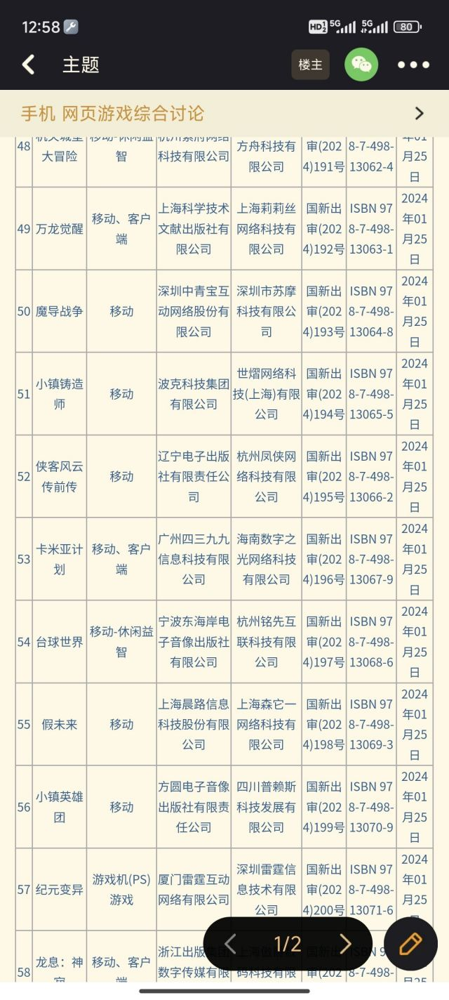

### [搬运] 2024年1月份国产网络游戏审批信息

Made by ngapost2md (c) ludoux [GitHub Repo](https://github.com/ludoux/ngapost2md)

##### 热门回复

- [1楼](#pid739845621): 来古弥新还真的改名了，终于过了啊
- [2楼](#pid739845791): 泡姆泡姆真的四妹变三姐了这下
- [8楼](#pid739846351): “来古”这个词哪里有问题[s:ac:委屈]
- [13楼](#pid739848240): <del class='gray'> 你...

----

##### 0.[5] \<pid:0\> 2024-01-26 01:23:18 by 永恒艾zhen
原文链接：[url](https://www.nppa.gov.cn/bsfw/jggs/yxspjg/gcwlyxspxx/202401/t20240125_830360.html)
<table cellspacing='0px' style='border:1px solid #aaa;width:99.9%'><tr><td  style='border-left:1px solid #aaa;border-bottom:1px solid #aaa'>序号</td><td  style='border-left:1px solid #aaa;border-bottom:1px solid #aaa'>名称</td><td  style='border-left:1px solid #aaa;border-bottom:1px solid #aaa'>申报类别</td><td  style='border-left:1px solid #aaa;border-bottom:1px solid #aaa'>出版单位</td><td  style='border-left:1px solid #aaa;border-bottom:1px solid #aaa'>运营单位</td><td  style='border-left:1px solid #aaa;border-bottom:1px solid #aaa'>批复文号</td><td  style='border-left:1px solid #aaa;border-bottom:1px solid #aaa'>出版物号</td><td  style='border-left:1px solid #aaa;border-bottom:1px solid #aaa'>批准时间</td></tr><tr><td  style='border-left:1px solid #aaa;border-bottom:1px solid #aaa'>1</td><td  style='border-left:1px solid #aaa;border-bottom:1px solid #aaa'>萌猫生活</td><td  style='border-left:1px solid #aaa;border-bottom:1px solid #aaa'>移动</td><td  style='border-left:1px solid #aaa;border-bottom:1px solid #aaa'>上海商国网络科技发展有限公司</td><td  style='border-left:1px solid #aaa;border-bottom:1px solid #aaa'>上海启炬科技有限公司</td><td  style='border-left:1px solid #aaa;border-bottom:1px solid #aaa'>国新出审(2024)144号</td><td  style='border-left:1px solid #aaa;border-bottom:1px solid #aaa'>ISBN 978-7-498-13015-0</td><td  style='border-left:1px solid #aaa;border-bottom:1px solid #aaa'>2024年01月25日</td></tr><tr><td  style='border-left:1px solid #aaa;border-bottom:1px solid #aaa'>2</td><td  style='border-left:1px solid #aaa;border-bottom:1px solid #aaa'>布丁精灵大冒险</td><td  style='border-left:1px solid #aaa;border-bottom:1px solid #aaa'>移动-休闲益智</td><td  style='border-left:1px solid #aaa;border-bottom:1px solid #aaa'>黑龙江科学技术出版社有限公司</td><td  style='border-left:1px solid #aaa;border-bottom:1px solid #aaa'>南京蓝讯五迈信息技术有限公司</td><td  style='border-left:1px solid #aaa;border-bottom:1px solid #aaa'>国新出审(2024)145号</td><td  style='border-left:1px solid #aaa;border-bottom:1px solid #aaa'>ISBN 978-7-498-13016-7</td><td  style='border-left:1px solid #aaa;border-bottom:1px solid #aaa'>2024年01月25日</td></tr><tr><td  style='border-left:1px solid #aaa;border-bottom:1px solid #aaa'>3</td><td  style='border-left:1px solid #aaa;border-bottom:1px solid #aaa'>桌球之王</td><td  style='border-left:1px solid #aaa;border-bottom:1px solid #aaa'>移动</td><td  style='border-left:1px solid #aaa;border-bottom:1px solid #aaa'>方圆电子音像出版社有限责任公司</td><td  style='border-left:1px solid #aaa;border-bottom:1px solid #aaa'>广州霸玩信息科技有限公司</td><td  style='border-left:1px solid #aaa;border-bottom:1px solid #aaa'>国新出审(2024)146号</td><td  style='border-left:1px solid #aaa;border-bottom:1px solid #aaa'>ISBN 978-7-498-13017-4</td><td  style='border-left:1px solid #aaa;border-bottom:1px solid #aaa'>2024年01月25日</td></tr><tr><td  style='border-left:1px solid #aaa;border-bottom:1px solid #aaa'>4</td><td  style='border-left:1px solid #aaa;border-bottom:1px solid #aaa'>钓鱼大神</td><td  style='border-left:1px solid #aaa;border-bottom:1px solid #aaa'>移动-休闲益智</td><td  style='border-left:1px solid #aaa;border-bottom:1px solid #aaa'>上海乐蜀网络科技股份有限公司</td><td  style='border-left:1px solid #aaa;border-bottom:1px solid #aaa'>长沙指色网络科技有限公司</td><td  style='border-left:1px solid #aaa;border-bottom:1px solid #aaa'>国新出审(2024)147号</td><td  style='border-left:1px solid #aaa;border-bottom:1px solid #aaa'>ISBN 978-7-498-13018-1</td><td  style='border-left:1px solid #aaa;border-bottom:1px solid #aaa'>2024年01月25日</td></tr><tr><td  style='border-left:1px solid #aaa;border-bottom:1px solid #aaa'>5</td><td  style='border-left:1px solid #aaa;border-bottom:1px solid #aaa'>疯狂桌球</td><td  style='border-left:1px solid #aaa;border-bottom:1px solid #aaa'>移动-休闲益智</td><td  style='border-left:1px solid #aaa;border-bottom:1px solid #aaa'>江西高校出版社有限责任公司</td><td  style='border-left:1px solid #aaa;border-bottom:1px solid #aaa'>深圳市神龙科技有限公司</td><td  style='border-left:1px solid #aaa;border-bottom:1px solid #aaa'>国新出审(2024)148号</td><td  style='border-left:1px solid #aaa;border-bottom:1px solid #aaa'>ISBN 978-7-498-13019-8</td><td  style='border-left:1px solid #aaa;border-bottom:1px solid #aaa'>2024年01月25日</td></tr><tr><td  style='border-left:1px solid #aaa;border-bottom:1px solid #aaa'>6</td><td  style='border-left:1px solid #aaa;border-bottom:1px solid #aaa'>剑侠向前冲</td><td  style='border-left:1px solid #aaa;border-bottom:1px solid #aaa'>移动-休闲益智</td><td  style='border-left:1px solid #aaa;border-bottom:1px solid #aaa'>杭州润趣科技有限公司</td><td  style='border-left:1px solid #aaa;border-bottom:1px solid #aaa'>南阳嘉翔软件有限公司</td><td  style='border-left:1px solid #aaa;border-bottom:1px solid #aaa'>国新出审(2024)149号</td><td  style='border-left:1px solid #aaa;border-bottom:1px solid #aaa'>ISBN 978-7-498-13020-4</td><td  style='border-left:1px solid #aaa;border-bottom:1px solid #aaa'>2024年01月25日</td></tr><tr><td  style='border-left:1px solid #aaa;border-bottom:1px solid #aaa'>7</td><td  style='border-left:1px solid #aaa;border-bottom:1px solid #aaa'>足球经营大师</td><td  style='border-left:1px solid #aaa;border-bottom:1px solid #aaa'>移动</td><td  style='border-left:1px solid #aaa;border-bottom:1px solid #aaa'>杭州美盛游戏技术开发有限公司</td><td  style='border-left:1px solid #aaa;border-bottom:1px solid #aaa'>广州丰天豫科技有限公司</td><td  style='border-left:1px solid #aaa;border-bottom:1px solid #aaa'>国新出审(2024)150号</td><td  style='border-left:1px solid #aaa;border-bottom:1px solid #aaa'>ISBN 978-7-498-13021-1</td><td  style='border-left:1px solid #aaa;border-bottom:1px solid #aaa'>2024年01月25日</td></tr><tr><td  style='border-left:1px solid #aaa;border-bottom:1px solid #aaa'>8</td><td  style='border-left:1px solid #aaa;border-bottom:1px solid #aaa'>诸国争霸</td><td  style='border-left:1px solid #aaa;border-bottom:1px solid #aaa'>移动</td><td  style='border-left:1px solid #aaa;border-bottom:1px solid #aaa'>江苏凤凰电子音像出版社有限公司</td><td  style='border-left:1px solid #aaa;border-bottom:1px solid #aaa'>南京凤侠网络科技有限公司</td><td  style='border-left:1px solid #aaa;border-bottom:1px solid #aaa'>国新出审(2024)151号</td><td  style='border-left:1px solid #aaa;border-bottom:1px solid #aaa'>ISBN 978-7-498-13022-8</td><td  style='border-left:1px solid #aaa;border-bottom:1px solid #aaa'>2024年01月25日</td></tr><tr><td  style='border-left:1px solid #aaa;border-bottom:1px solid #aaa'>9</td><td  style='border-left:1px solid #aaa;border-bottom:1px solid #aaa'>魔力佣兵团</td><td  style='border-left:1px solid #aaa;border-bottom:1px solid #aaa'>移动</td><td  style='border-left:1px solid #aaa;border-bottom:1px solid #aaa'>广州盈正信息技术有限公司</td><td  style='border-left:1px solid #aaa;border-bottom:1px solid #aaa'>浙江裙黑网络科技有限公司</td><td  style='border-left:1px solid #aaa;border-bottom:1px solid #aaa'>国新出审(2024)152号</td><td  style='border-left:1px solid #aaa;border-bottom:1px solid #aaa'>ISBN 978-7-498-13023-5</td><td  style='border-left:1px solid #aaa;border-bottom:1px solid #aaa'>2024年01月25日</td></tr><tr><td  style='border-left:1px solid #aaa;border-bottom:1px solid #aaa'>10</td><td  style='border-left:1px solid #aaa;border-bottom:1px solid #aaa'>钓鱼英雄</td><td  style='border-left:1px solid #aaa;border-bottom:1px solid #aaa'>移动</td><td  style='border-left:1px solid #aaa;border-bottom:1px solid #aaa'>江苏凤凰数字传媒有限公司</td><td  style='border-left:1px solid #aaa;border-bottom:1px solid #aaa'>广州格斗之星科技有限公司</td><td  style='border-left:1px solid #aaa;border-bottom:1px solid #aaa'>国新出审(2024)153号</td><td  style='border-left:1px solid #aaa;border-bottom:1px solid #aaa'>ISBN 978-7-498-13024-2</td><td  style='border-left:1px solid #aaa;border-bottom:1px solid #aaa'>2024年01月25日</td></tr><tr><td  style='border-left:1px solid #aaa;border-bottom:1px solid #aaa'>11</td><td  style='border-left:1px solid #aaa;border-bottom:1px solid #aaa'>元气合合</td><td  style='border-left:1px solid #aaa;border-bottom:1px solid #aaa'>移动-休闲益智</td><td  style='border-left:1px solid #aaa;border-bottom:1px solid #aaa'>华东师范大学电子音像出版社有限公司</td><td  style='border-left:1px solid #aaa;border-bottom:1px solid #aaa'>轩克科技(上海)有限公司</td><td  style='border-left:1px solid #aaa;border-bottom:1px solid #aaa'>国新出审(2024)154号</td><td  style='border-left:1px solid #aaa;border-bottom:1px solid #aaa'>ISBN 978-7-498-13025-9</td><td  style='border-left:1px solid #aaa;border-bottom:1px solid #aaa'>2024年01月25日</td></tr><tr><td  style='border-left:1px solid #aaa;border-bottom:1px solid #aaa'>12</td><td  style='border-left:1px solid #aaa;border-bottom:1px solid #aaa'>封魔大陆</td><td  style='border-left:1px solid #aaa;border-bottom:1px solid #aaa'>移动</td><td  style='border-left:1px solid #aaa;border-bottom:1px solid #aaa'>辽宁电子出版社有限责任公司</td><td  style='border-left:1px solid #aaa;border-bottom:1px solid #aaa'>绍兴快飞网络科技有限公司</td><td  style='border-left:1px solid #aaa;border-bottom:1px solid #aaa'>国新出审(2024)155号</td><td  style='border-left:1px solid #aaa;border-bottom:1px solid #aaa'>ISBN 978-7-498-13026-6</td><td  style='border-left:1px solid #aaa;border-bottom:1px solid #aaa'>2024年01月25日</td></tr><tr><td  style='border-left:1px solid #aaa;border-bottom:1px solid #aaa'>13</td><td  style='border-left:1px solid #aaa;border-bottom:1px solid #aaa'>荣耀堡垒</td><td  style='border-left:1px solid #aaa;border-bottom:1px solid #aaa'>移动-休闲益智</td><td  style='border-left:1px solid #aaa;border-bottom:1px solid #aaa'>炫彩互动网络科技有限公司</td><td  style='border-left:1px solid #aaa;border-bottom:1px solid #aaa'>重庆邦邦科技有限公司</td><td  style='border-left:1px solid #aaa;border-bottom:1px solid #aaa'>国新出审(2024)156号</td><td  style='border-left:1px solid #aaa;border-bottom:1px solid #aaa'>ISBN 978-7-498-13027-3</td><td  style='border-left:1px solid #aaa;border-bottom:1px solid #aaa'>2024年01月25日</td></tr><tr><td  style='border-left:1px solid #aaa;border-bottom:1px solid #aaa'>14</td><td  style='border-left:1px solid #aaa;border-bottom:1px solid #aaa'>八荒旅途</td><td  style='border-left:1px solid #aaa;border-bottom:1px solid #aaa'>移动</td><td  style='border-left:1px solid #aaa;border-bottom:1px solid #aaa'>杭州渡口网络科技有限公司</td><td  style='border-left:1px solid #aaa;border-bottom:1px solid #aaa'>厦门任势网络科技有限公司</td><td  style='border-left:1px solid #aaa;border-bottom:1px solid #aaa'>国新出审(2024)157号</td><td  style='border-left:1px solid #aaa;border-bottom:1px solid #aaa'>ISBN 978-7-498-13028-0</td><td  style='border-left:1px solid #aaa;border-bottom:1px solid #aaa'>2024年01月25日</td></tr><tr><td  style='border-left:1px solid #aaa;border-bottom:1px solid #aaa'>15</td><td  style='border-left:1px solid #aaa;border-bottom:1px solid #aaa'>森林与家园</td><td  style='border-left:1px solid #aaa;border-bottom:1px solid #aaa'>移动-休闲益智</td><td  style='border-left:1px solid #aaa;border-bottom:1px solid #aaa'>上海同济大学电子音像出版社有限公司</td><td  style='border-left:1px solid #aaa;border-bottom:1px solid #aaa'>上海水晶葡萄网络科技有限公司</td><td  style='border-left:1px solid #aaa;border-bottom:1px solid #aaa'>国新出审(2024)158号</td><td  style='border-left:1px solid #aaa;border-bottom:1px solid #aaa'>ISBN 978-7-498-13029-7</td><td  style='border-left:1px solid #aaa;border-bottom:1px solid #aaa'>2024年01月25日</td></tr><tr><td  style='border-left:1px solid #aaa;border-bottom:1px solid #aaa'>16</td><td  style='border-left:1px solid #aaa;border-bottom:1px solid #aaa'>最强猎人</td><td  style='border-left:1px solid #aaa;border-bottom:1px solid #aaa'>移动-休闲益智</td><td  style='border-left:1px solid #aaa;border-bottom:1px solid #aaa'>杭州美盛游戏技术开发有限公司</td><td  style='border-left:1px solid #aaa;border-bottom:1px solid #aaa'>北京盈云科技文化有限公司</td><td  style='border-left:1px solid #aaa;border-bottom:1px solid #aaa'>国新出审(2024)159号</td><td  style='border-left:1px solid #aaa;border-bottom:1px solid #aaa'>ISBN 978-7-498-13030-3</td><td  style='border-left:1px solid #aaa;border-bottom:1px solid #aaa'>2024年01月25日</td></tr><tr><td  style='border-left:1px solid #aaa;border-bottom:1px solid #aaa'>17</td><td  style='border-left:1px solid #aaa;border-bottom:1px solid #aaa'>妙趣萌萌消</td><td  style='border-left:1px solid #aaa;border-bottom:1px solid #aaa'>移动-休闲益智</td><td  style='border-left:1px solid #aaa;border-bottom:1px solid #aaa'>上海商国网络科技发展有限公司</td><td  style='border-left:1px solid #aaa;border-bottom:1px solid #aaa'>上海亿柠网络科技有限公司</td><td  style='border-left:1px solid #aaa;border-bottom:1px solid #aaa'>国新出审(2024)160号</td><td  style='border-left:1px solid #aaa;border-bottom:1px solid #aaa'>ISBN 978-7-498-13031-0</td><td  style='border-left:1px solid #aaa;border-bottom:1px solid #aaa'>2024年01月25日</td></tr><tr><td  style='border-left:1px solid #aaa;border-bottom:1px solid #aaa'>18</td><td  style='border-left:1px solid #aaa;border-bottom:1px solid #aaa'>水银疗养院</td><td  style='border-left:1px solid #aaa;border-bottom:1px solid #aaa'>移动、客户端</td><td  style='border-left:1px solid #aaa;border-bottom:1px solid #aaa'>海南省电子音像出版社有限公司</td><td  style='border-left:1px solid #aaa;border-bottom:1px solid #aaa'>海南超诺星科技有限公司</td><td  style='border-left:1px solid #aaa;border-bottom:1px solid #aaa'>国新出审(2024)161号</td><td  style='border-left:1px solid #aaa;border-bottom:1px solid #aaa'>ISBN 978-7-498-13032-7</td><td  style='border-left:1px solid #aaa;border-bottom:1px solid #aaa'>2024年01月25日</td></tr><tr><td  style='border-left:1px solid #aaa;border-bottom:1px solid #aaa'>19</td><td  style='border-left:1px solid #aaa;border-bottom:1px solid #aaa'>寻物大侦探</td><td  style='border-left:1px solid #aaa;border-bottom:1px solid #aaa'>移动-休闲益智</td><td  style='border-left:1px solid #aaa;border-bottom:1px solid #aaa'>江苏凤凰电子音像出版社有限公司</td><td  style='border-left:1px solid #aaa;border-bottom:1px solid #aaa'>西安点扣软件科技有限公司</td><td  style='border-left:1px solid #aaa;border-bottom:1px solid #aaa'>国新出审(2024)162号</td><td  style='border-left:1px solid #aaa;border-bottom:1px solid #aaa'>ISBN 978-7-498-13033-4</td><td  style='border-left:1px solid #aaa;border-bottom:1px solid #aaa'>2024年01月25日</td></tr><tr><td  style='border-left:1px solid #aaa;border-bottom:1px solid #aaa'>20</td><td  style='border-left:1px solid #aaa;border-bottom:1px solid #aaa'>欢乐钓鱼大师</td><td  style='border-left:1px solid #aaa;border-bottom:1px solid #aaa'>移动-休闲益智</td><td  style='border-left:1px solid #aaa;border-bottom:1px solid #aaa'>上海双盟网络科技有限公司</td><td  style='border-left:1px solid #aaa;border-bottom:1px solid #aaa'>奇迹互动(北京)科技有限公司</td><td  style='border-left:1px solid #aaa;border-bottom:1px solid #aaa'>国新出审(2024)163号</td><td  style='border-left:1px solid #aaa;border-bottom:1px solid #aaa'>ISBN 978-7-498-13034-1</td><td  style='border-left:1px solid #aaa;border-bottom:1px solid #aaa'>2024年01月25日</td></tr><tr><td  style='border-left:1px solid #aaa;border-bottom:1px solid #aaa'>21</td><td  style='border-left:1px solid #aaa;border-bottom:1px solid #aaa'>火力向前</td><td  style='border-left:1px solid #aaa;border-bottom:1px solid #aaa'>移动-休闲益智</td><td  style='border-left:1px solid #aaa;border-bottom:1px solid #aaa'>杭州紫府网络科技有限公司</td><td  style='border-left:1px solid #aaa;border-bottom:1px solid #aaa'>北京赛诺斯科技发展有限责任公司</td><td  style='border-left:1px solid #aaa;border-bottom:1px solid #aaa'>国新出审(2024)164号</td><td  style='border-left:1px solid #aaa;border-bottom:1px solid #aaa'>ISBN 978-7-498-13035-8</td><td  style='border-left:1px solid #aaa;border-bottom:1px solid #aaa'>2024年01月25日</td></tr><tr><td  style='border-left:1px solid #aaa;border-bottom:1px solid #aaa'>22</td><td  style='border-left:1px solid #aaa;border-bottom:1px solid #aaa'>重生之最强输出</td><td  style='border-left:1px solid #aaa;border-bottom:1px solid #aaa'>移动</td><td  style='border-left:1px solid #aaa;border-bottom:1px solid #aaa'>广州盈正信息技术有限公司</td><td  style='border-left:1px solid #aaa;border-bottom:1px solid #aaa'>苏州风之力网络科技有限公司</td><td  style='border-left:1px solid #aaa;border-bottom:1px solid #aaa'>国新出审(2024)165号</td><td  style='border-left:1px solid #aaa;border-bottom:1px solid #aaa'>ISBN 978-7-498-13036-5</td><td  style='border-left:1px solid #aaa;border-bottom:1px solid #aaa'>2024年01月25日</td></tr><tr><td  style='border-left:1px solid #aaa;border-bottom:1px solid #aaa'>23</td><td  style='border-left:1px solid #aaa;border-bottom:1px solid #aaa'>雷霆坦克</td><td  style='border-left:1px solid #aaa;border-bottom:1px solid #aaa'>移动-休闲益智</td><td  style='border-left:1px solid #aaa;border-bottom:1px solid #aaa'>吉林音像出版社有限责任公司</td><td  style='border-left:1px solid #aaa;border-bottom:1px solid #aaa'>苏州灵爽信息科技有限公司</td><td  style='border-left:1px solid #aaa;border-bottom:1px solid #aaa'>国新出审(2024)166号</td><td  style='border-left:1px solid #aaa;border-bottom:1px solid #aaa'>ISBN 978-7-498-13037-2</td><td  style='border-left:1px solid #aaa;border-bottom:1px solid #aaa'>2024年01月25日</td></tr><tr><td  style='border-left:1px solid #aaa;border-bottom:1px solid #aaa'>24</td><td  style='border-left:1px solid #aaa;border-bottom:1px solid #aaa'>堡垒行动</td><td  style='border-left:1px solid #aaa;border-bottom:1px solid #aaa'>移动-休闲益智</td><td  style='border-left:1px solid #aaa;border-bottom:1px solid #aaa'>华中科技大学电子音像出版社</td><td  style='border-left:1px solid #aaa;border-bottom:1px solid #aaa'>武汉游戏群科技有限公司</td><td  style='border-left:1px solid #aaa;border-bottom:1px solid #aaa'>国新出审(2024)167号</td><td  style='border-left:1px solid #aaa;border-bottom:1px solid #aaa'>ISBN 978-7-498-13038-9</td><td  style='border-left:1px solid #aaa;border-bottom:1px solid #aaa'>2024年01月25日</td></tr><tr><td  style='border-left:1px solid #aaa;border-bottom:1px solid #aaa'>25</td><td  style='border-left:1px solid #aaa;border-bottom:1px solid #aaa'>雷鸣行动</td><td  style='border-left:1px solid #aaa;border-bottom:1px solid #aaa'>客户端</td><td  style='border-left:1px solid #aaa;border-bottom:1px solid #aaa'>浙江无端科技股份有限公司</td><td  style='border-left:1px solid #aaa;border-bottom:1px solid #aaa'>浙江无端科技股份有限公司</td><td  style='border-left:1px solid #aaa;border-bottom:1px solid #aaa'>国新出审(2024)168号</td><td  style='border-left:1px solid #aaa;border-bottom:1px solid #aaa'>ISBN 978-7-498-13039-6</td><td  style='border-left:1px solid #aaa;border-bottom:1px solid #aaa'>2024年01月25日</td></tr><tr><td  style='border-left:1px solid #aaa;border-bottom:1px solid #aaa'>26</td><td  style='border-left:1px solid #aaa;border-bottom:1px solid #aaa'>梦境护卫队</td><td  style='border-left:1px solid #aaa;border-bottom:1px solid #aaa'>移动</td><td  style='border-left:1px solid #aaa;border-bottom:1px solid #aaa'>成都超级梦网络技术股份有限公司</td><td  style='border-left:1px solid #aaa;border-bottom:1px solid #aaa'>广州诗悦网络科技有限公司</td><td  style='border-left:1px solid #aaa;border-bottom:1px solid #aaa'>国新出审(2024)169号</td><td  style='border-left:1px solid #aaa;border-bottom:1px solid #aaa'>ISBN 978-7-498-13040-2</td><td  style='border-left:1px solid #aaa;border-bottom:1px solid #aaa'>2024年01月25日</td></tr><tr><td  style='border-left:1px solid #aaa;border-bottom:1px solid #aaa'>27</td><td  style='border-left:1px solid #aaa;border-bottom:1px solid #aaa'>小小首富2</td><td  style='border-left:1px solid #aaa;border-bottom:1px solid #aaa'>移动-休闲益智</td><td  style='border-left:1px solid #aaa;border-bottom:1px solid #aaa'>广州盈正信息技术有限公司</td><td  style='border-left:1px solid #aaa;border-bottom:1px solid #aaa'>珠海市烛墨科技有限公司</td><td  style='border-left:1px solid #aaa;border-bottom:1px solid #aaa'>国新出审(2024)170号</td><td  style='border-left:1px solid #aaa;border-bottom:1px solid #aaa'>ISBN 978-7-498-13041-9</td><td  style='border-left:1px solid #aaa;border-bottom:1px solid #aaa'>2024年01月25日</td></tr><tr><td  style='border-left:1px solid #aaa;border-bottom:1px solid #aaa'>28</td><td  style='border-left:1px solid #aaa;border-bottom:1px solid #aaa'>梦境守卫</td><td  style='border-left:1px solid #aaa;border-bottom:1px solid #aaa'>移动</td><td  style='border-left:1px solid #aaa;border-bottom:1px solid #aaa'>海南动网先锋网络科技有限公司</td><td  style='border-left:1px solid #aaa;border-bottom:1px solid #aaa'>海南动网先锋网络科技有限公司</td><td  style='border-left:1px solid #aaa;border-bottom:1px solid #aaa'>国新出审(2024)171号</td><td  style='border-left:1px solid #aaa;border-bottom:1px solid #aaa'>ISBN 978-7-498-13042-6</td><td  style='border-left:1px solid #aaa;border-bottom:1px solid #aaa'>2024年01月25日</td></tr><tr><td  style='border-left:1px solid #aaa;border-bottom:1px solid #aaa'>29</td><td  style='border-left:1px solid #aaa;border-bottom:1px solid #aaa'>紫禁十二时辰</td><td  style='border-left:1px solid #aaa;border-bottom:1px solid #aaa'>移动</td><td  style='border-left:1px solid #aaa;border-bottom:1px solid #aaa'>福建电子音像出版社有限责任公司</td><td  style='border-left:1px solid #aaa;border-bottom:1px solid #aaa'>厦门寻乐网络科技有限公司</td><td  style='border-left:1px solid #aaa;border-bottom:1px solid #aaa'>国新出审(2024)172号</td><td  style='border-left:1px solid #aaa;border-bottom:1px solid #aaa'>ISBN 978-7-498-13043-3</td><td  style='border-left:1px solid #aaa;border-bottom:1px solid #aaa'>2024年01月25日</td></tr><tr><td  style='border-left:1px solid #aaa;border-bottom:1px solid #aaa'>30</td><td  style='border-left:1px solid #aaa;border-bottom:1px solid #aaa'>漂移飞车传奇</td><td  style='border-left:1px solid #aaa;border-bottom:1px solid #aaa'>移动-休闲益智</td><td  style='border-left:1px solid #aaa;border-bottom:1px solid #aaa'>海南省电子音像出版社有限公司</td><td  style='border-left:1px solid #aaa;border-bottom:1px solid #aaa'>海南闪电互娱网络信息科技有限公司</td><td  style='border-left:1px solid #aaa;border-bottom:1px solid #aaa'>国新出审(2024)173号</td><td  style='border-left:1px solid #aaa;border-bottom:1px solid #aaa'>ISBN 978-7-498-13044-0</td><td  style='border-left:1px solid #aaa;border-bottom:1px solid #aaa'>2024年01月25日</td></tr><tr><td  style='border-left:1px solid #aaa;border-bottom:1px solid #aaa'>31</td><td  style='border-left:1px solid #aaa;border-bottom:1px solid #aaa'>奇兵布阵</td><td  style='border-left:1px solid #aaa;border-bottom:1px solid #aaa'>移动</td><td  style='border-left:1px solid #aaa;border-bottom:1px solid #aaa'>湖北省扬子江影音有限责任公司</td><td  style='border-left:1px solid #aaa;border-bottom:1px solid #aaa'>深圳市奇迅新游科技股份有限公司</td><td  style='border-left:1px solid #aaa;border-bottom:1px solid #aaa'>国新出审(2024)174号</td><td  style='border-left:1px solid #aaa;border-bottom:1px solid #aaa'>ISBN 978-7-498-13045-7</td><td  style='border-left:1px solid #aaa;border-bottom:1px solid #aaa'>2024年01月25日</td></tr><tr><td  style='border-left:1px solid #aaa;border-bottom:1px solid #aaa'>32</td><td  style='border-left:1px solid #aaa;border-bottom:1px solid #aaa'>酷喵大作战</td><td  style='border-left:1px solid #aaa;border-bottom:1px solid #aaa'>移动-休闲益智</td><td  style='border-left:1px solid #aaa;border-bottom:1px solid #aaa'>上海商国网络科技发展有限公司</td><td  style='border-left:1px solid #aaa;border-bottom:1px solid #aaa'>上海乐钻科技有限公司</td><td  style='border-left:1px solid #aaa;border-bottom:1px solid #aaa'>国新出审(2024)175号</td><td  style='border-left:1px solid #aaa;border-bottom:1px solid #aaa'>ISBN 978-7-498-13046-4</td><td  style='border-left:1px solid #aaa;border-bottom:1px solid #aaa'>2024年01月25日</td></tr><tr><td  style='border-left:1px solid #aaa;border-bottom:1px solid #aaa'>33</td><td  style='border-left:1px solid #aaa;border-bottom:1px solid #aaa'>大家乐智力竞技消除赛</td><td  style='border-left:1px solid #aaa;border-bottom:1px solid #aaa'>移动-休闲益智</td><td  style='border-left:1px solid #aaa;border-bottom:1px solid #aaa'>杭州紫府网络科技有限公司</td><td  style='border-left:1px solid #aaa;border-bottom:1px solid #aaa'>短竞科技(成都)有限公司</td><td  style='border-left:1px solid #aaa;border-bottom:1px solid #aaa'>国新出审(2024)176号</td><td  style='border-left:1px solid #aaa;border-bottom:1px solid #aaa'>ISBN 978-7-498-13047-1</td><td  style='border-left:1px solid #aaa;border-bottom:1px solid #aaa'>2024年01月25日</td></tr><tr><td  style='border-left:1px solid #aaa;border-bottom:1px solid #aaa'>34</td><td  style='border-left:1px solid #aaa;border-bottom:1px solid #aaa'>趣味足球大作战</td><td  style='border-left:1px solid #aaa;border-bottom:1px solid #aaa'>移动-休闲益智</td><td  style='border-left:1px solid #aaa;border-bottom:1px solid #aaa'>杭州群游科技有限公司</td><td  style='border-left:1px solid #aaa;border-bottom:1px solid #aaa'>厦门简创网络科技有限公司</td><td  style='border-left:1px solid #aaa;border-bottom:1px solid #aaa'>国新出审(2024)177号</td><td  style='border-left:1px solid #aaa;border-bottom:1px solid #aaa'>ISBN 978-7-498-13048-8</td><td  style='border-left:1px solid #aaa;border-bottom:1px solid #aaa'>2024年01月25日</td></tr><tr><td  style='border-left:1px solid #aaa;border-bottom:1px solid #aaa'>35</td><td  style='border-left:1px solid #aaa;border-bottom:1px solid #aaa'>海岛文明</td><td  style='border-left:1px solid #aaa;border-bottom:1px solid #aaa'>移动</td><td  style='border-left:1px solid #aaa;border-bottom:1px solid #aaa'>上海科学技术文献出版社有限公司</td><td  style='border-left:1px solid #aaa;border-bottom:1px solid #aaa'>上海常游网络科技有限公司</td><td  style='border-left:1px solid #aaa;border-bottom:1px solid #aaa'>国新出审(2024)178号</td><td  style='border-left:1px solid #aaa;border-bottom:1px solid #aaa'>ISBN 978-7-498-13049-5</td><td  style='border-left:1px solid #aaa;border-bottom:1px solid #aaa'>2024年01月25日</td></tr><tr><td  style='border-left:1px solid #aaa;border-bottom:1px solid #aaa'>36</td><td  style='border-left:1px solid #aaa;border-bottom:1px solid #aaa'>香域</td><td  style='border-left:1px solid #aaa;border-bottom:1px solid #aaa'>移动</td><td  style='border-left:1px solid #aaa;border-bottom:1px solid #aaa'>重庆华龙网集团股份有限公司</td><td  style='border-left:1px solid #aaa;border-bottom:1px solid #aaa'>海南钒堡互娱科技有限公司</td><td  style='border-left:1px solid #aaa;border-bottom:1px solid #aaa'>国新出审(2024)179号</td><td  style='border-left:1px solid #aaa;border-bottom:1px solid #aaa'>ISBN 978-7-498-13050-1</td><td  style='border-left:1px solid #aaa;border-bottom:1px solid #aaa'>2024年01月25日</td></tr><tr><td  style='border-left:1px solid #aaa;border-bottom:1px solid #aaa'>37</td><td  style='border-left:1px solid #aaa;border-bottom:1px solid #aaa'>少年大文豪</td><td  style='border-left:1px solid #aaa;border-bottom:1px solid #aaa'>移动-休闲益智</td><td  style='border-left:1px solid #aaa;border-bottom:1px solid #aaa'>杭州哲信信息技术有限公司</td><td  style='border-left:1px solid #aaa;border-bottom:1px solid #aaa'>海南维纳奇通科技有限公司</td><td  style='border-left:1px solid #aaa;border-bottom:1px solid #aaa'>国新出审(2024)180号</td><td  style='border-left:1px solid #aaa;border-bottom:1px solid #aaa'>ISBN 978-7-498-13051-8</td><td  style='border-left:1px solid #aaa;border-bottom:1px solid #aaa'>2024年01月25日</td></tr><tr><td  style='border-left:1px solid #aaa;border-bottom:1px solid #aaa'>38</td><td  style='border-left:1px solid #aaa;border-bottom:1px solid #aaa'>山海异兽图</td><td  style='border-left:1px solid #aaa;border-bottom:1px solid #aaa'>移动-休闲益智</td><td  style='border-left:1px solid #aaa;border-bottom:1px solid #aaa'>江苏凤凰电子音像出版社有限公司</td><td  style='border-left:1px solid #aaa;border-bottom:1px solid #aaa'>南京魔度互娱信息技术有限公司</td><td  style='border-left:1px solid #aaa;border-bottom:1px solid #aaa'>国新出审(2024)181号</td><td  style='border-left:1px solid #aaa;border-bottom:1px solid #aaa'>ISBN 978-7-498-13052-5</td><td  style='border-left:1px solid #aaa;border-bottom:1px solid #aaa'>2024年01月25日</td></tr><tr><td  style='border-left:1px solid #aaa;border-bottom:1px solid #aaa'>39</td><td  style='border-left:1px solid #aaa;border-bottom:1px solid #aaa'>涂色达人</td><td  style='border-left:1px solid #aaa;border-bottom:1px solid #aaa'>移动-休闲益智</td><td  style='border-left:1px solid #aaa;border-bottom:1px solid #aaa'>杭州润趣科技有限公司</td><td  style='border-left:1px solid #aaa;border-bottom:1px solid #aaa'>上海海之水网络科技有限公司</td><td  style='border-left:1px solid #aaa;border-bottom:1px solid #aaa'>国新出审(2024)182号</td><td  style='border-left:1px solid #aaa;border-bottom:1px solid #aaa'>ISBN 978-7-498-13053-2</td><td  style='border-left:1px solid #aaa;border-bottom:1px solid #aaa'>2024年01月25日</td></tr><tr><td  style='border-left:1px solid #aaa;border-bottom:1px solid #aaa'>40</td><td  style='border-left:1px solid #aaa;border-bottom:1px solid #aaa'>合合大厨</td><td  style='border-left:1px solid #aaa;border-bottom:1px solid #aaa'>移动-休闲益智</td><td  style='border-left:1px solid #aaa;border-bottom:1px solid #aaa'>三辰影库音像出版社有限公司</td><td  style='border-left:1px solid #aaa;border-bottom:1px solid #aaa'>大乐至简科技(北京)有限公司</td><td  style='border-left:1px solid #aaa;border-bottom:1px solid #aaa'>国新出审(2024)183号</td><td  style='border-left:1px solid #aaa;border-bottom:1px solid #aaa'>ISBN 978-7-498-13054-9</td><td  style='border-left:1px solid #aaa;border-bottom:1px solid #aaa'>2024年01月25日</td></tr><tr><td  style='border-left:1px solid #aaa;border-bottom:1px solid #aaa'>41</td><td  style='border-left:1px solid #aaa;border-bottom:1px solid #aaa'>成语小夫子</td><td  style='border-left:1px solid #aaa;border-bottom:1px solid #aaa'>移动-休闲益智</td><td  style='border-left:1px solid #aaa;border-bottom:1px solid #aaa'>上海同济大学电子音像出版社有限公司</td><td  style='border-left:1px solid #aaa;border-bottom:1px solid #aaa'>上海星翼网络信息有限公司</td><td  style='border-left:1px solid #aaa;border-bottom:1px solid #aaa'>国新出审(2024)184号</td><td  style='border-left:1px solid #aaa;border-bottom:1px solid #aaa'>ISBN 978-7-498-13055-6</td><td  style='border-left:1px solid #aaa;border-bottom:1px solid #aaa'>2024年01月25日</td></tr><tr><td  style='border-left:1px solid #aaa;border-bottom:1px solid #aaa'>42</td><td  style='border-left:1px solid #aaa;border-bottom:1px solid #aaa'>火与剑</td><td  style='border-left:1px solid #aaa;border-bottom:1px solid #aaa'>移动</td><td  style='border-left:1px solid #aaa;border-bottom:1px solid #aaa'>湖北省扬子江影音有限责任公司</td><td  style='border-left:1px solid #aaa;border-bottom:1px solid #aaa'>海南好玩互动娱乐有限公司</td><td  style='border-left:1px solid #aaa;border-bottom:1px solid #aaa'>国新出审(2024)185号</td><td  style='border-left:1px solid #aaa;border-bottom:1px solid #aaa'>ISBN 978-7-498-13056-3</td><td  style='border-left:1px solid #aaa;border-bottom:1px solid #aaa'>2024年01月25日</td></tr><tr><td  style='border-left:1px solid #aaa;border-bottom:1px solid #aaa'>43</td><td  style='border-left:1px solid #aaa;border-bottom:1px solid #aaa'>重生世界</td><td  style='border-left:1px solid #aaa;border-bottom:1px solid #aaa'>移动</td><td  style='border-left:1px solid #aaa;border-bottom:1px solid #aaa'>方圆电子音像出版社有限责任公司</td><td  style='border-left:1px solid #aaa;border-bottom:1px solid #aaa'>北京雷兔科技有限公司</td><td  style='border-left:1px solid #aaa;border-bottom:1px solid #aaa'>国新出审(2024)186号</td><td  style='border-left:1px solid #aaa;border-bottom:1px solid #aaa'>ISBN 978-7-498-13057-0</td><td  style='border-left:1px solid #aaa;border-bottom:1px solid #aaa'>2024年01月25日</td></tr><tr><td  style='border-left:1px solid #aaa;border-bottom:1px solid #aaa'>44</td><td  style='border-left:1px solid #aaa;border-bottom:1px solid #aaa'>脑洞猜猜</td><td  style='border-left:1px solid #aaa;border-bottom:1px solid #aaa'>移动-休闲益智</td><td  style='border-left:1px solid #aaa;border-bottom:1px solid #aaa'>上海双盟网络科技有限公司</td><td  style='border-left:1px solid #aaa;border-bottom:1px solid #aaa'>广州指上科技有限公司</td><td  style='border-left:1px solid #aaa;border-bottom:1px solid #aaa'>国新出审(2024)187号</td><td  style='border-left:1px solid #aaa;border-bottom:1px solid #aaa'>ISBN 978-7-498-13058-7</td><td  style='border-left:1px solid #aaa;border-bottom:1px solid #aaa'>2024年01月25日</td></tr><tr><td  style='border-left:1px solid #aaa;border-bottom:1px solid #aaa'>45</td><td  style='border-left:1px solid #aaa;border-bottom:1px solid #aaa'>冲吧小精灵</td><td  style='border-left:1px solid #aaa;border-bottom:1px solid #aaa'>移动-休闲益智</td><td  style='border-left:1px solid #aaa;border-bottom:1px solid #aaa'>黑龙江龙华数字出版股份有限公司</td><td  style='border-left:1px solid #aaa;border-bottom:1px solid #aaa'>武汉福多多信息技术有限公司</td><td  style='border-left:1px solid #aaa;border-bottom:1px solid #aaa'>国新出审(2024)188号</td><td  style='border-left:1px solid #aaa;border-bottom:1px solid #aaa'>ISBN 978-7-498-13059-4</td><td  style='border-left:1px solid #aaa;border-bottom:1px solid #aaa'>2024年01月25日</td></tr><tr><td  style='border-left:1px solid #aaa;border-bottom:1px solid #aaa'>46</td><td  style='border-left:1px solid #aaa;border-bottom:1px solid #aaa'>幸福甜品屋</td><td  style='border-left:1px solid #aaa;border-bottom:1px solid #aaa'>移动-休闲益智</td><td  style='border-left:1px solid #aaa;border-bottom:1px solid #aaa'>吉林音像出版社有限责任公司</td><td  style='border-left:1px solid #aaa;border-bottom:1px solid #aaa'>海南元年科技有限公司</td><td  style='border-left:1px solid #aaa;border-bottom:1px solid #aaa'>国新出审(2024)189号</td><td  style='border-left:1px solid #aaa;border-bottom:1px solid #aaa'>ISBN 978-7-498-13060-0</td><td  style='border-left:1px solid #aaa;border-bottom:1px solid #aaa'>2024年01月25日</td></tr><tr><td  style='border-left:1px solid #aaa;border-bottom:1px solid #aaa'>47</td><td  style='border-left:1px solid #aaa;border-bottom:1px solid #aaa'>超级匹配王</td><td  style='border-left:1px solid #aaa;border-bottom:1px solid #aaa'>移动-休闲益智</td><td  style='border-left:1px solid #aaa;border-bottom:1px solid #aaa'>上海晨路信息科技股份有限公司</td><td  style='border-left:1px solid #aaa;border-bottom:1px solid #aaa'>上海麦博文化传播有限公司</td><td  style='border-left:1px solid #aaa;border-bottom:1px solid #aaa'>国新出审(2024)190号</td><td  style='border-left:1px solid #aaa;border-bottom:1px solid #aaa'>ISBN 978-7-498-13061-7</td><td  style='border-left:1px solid #aaa;border-bottom:1px solid #aaa'>2024年01月25日</td></tr><tr><td  style='border-left:1px solid #aaa;border-bottom:1px solid #aaa'>48</td><td  style='border-left:1px solid #aaa;border-bottom:1px solid #aaa'>机关城堡大冒险</td><td  style='border-left:1px solid #aaa;border-bottom:1px solid #aaa'>移动-休闲益智</td><td  style='border-left:1px solid #aaa;border-bottom:1px solid #aaa'>杭州紫府网络科技有限公司</td><td  style='border-left:1px solid #aaa;border-bottom:1px solid #aaa'>深圳市掌上方舟科技有限公司</td><td  style='border-left:1px solid #aaa;border-bottom:1px solid #aaa'>国新出审(2024)191号</td><td  style='border-left:1px solid #aaa;border-bottom:1px solid #aaa'>ISBN 978-7-498-13062-4</td><td  style='border-left:1px solid #aaa;border-bottom:1px solid #aaa'>2024年01月25日</td></tr><tr><td  style='border-left:1px solid #aaa;border-bottom:1px solid #aaa'>49</td><td  style='border-left:1px solid #aaa;border-bottom:1px solid #aaa'>万龙觉醒</td><td  style='border-left:1px solid #aaa;border-bottom:1px solid #aaa'>移动、客户端</td><td  style='border-left:1px solid #aaa;border-bottom:1px solid #aaa'>上海科学技术文献出版社有限公司</td><td  style='border-left:1px solid #aaa;border-bottom:1px solid #aaa'>上海莉莉丝网络科技有限公司</td><td  style='border-left:1px solid #aaa;border-bottom:1px solid #aaa'>国新出审(2024)192号</td><td  style='border-left:1px solid #aaa;border-bottom:1px solid #aaa'>ISBN 978-7-498-13063-1</td><td  style='border-left:1px solid #aaa;border-bottom:1px solid #aaa'>2024年01月25日</td></tr><tr><td  style='border-left:1px solid #aaa;border-bottom:1px solid #aaa'>50</td><td  style='border-left:1px solid #aaa;border-bottom:1px solid #aaa'>魔导战争</td><td  style='border-left:1px solid #aaa;border-bottom:1px solid #aaa'>移动</td><td  style='border-left:1px solid #aaa;border-bottom:1px solid #aaa'>深圳中青宝互动网络股份有限公司</td><td  style='border-left:1px solid #aaa;border-bottom:1px solid #aaa'>深圳市苏摩科技有限公司</td><td  style='border-left:1px solid #aaa;border-bottom:1px solid #aaa'>国新出审(2024)193号</td><td  style='border-left:1px solid #aaa;border-bottom:1px solid #aaa'>ISBN 978-7-498-13064-8</td><td  style='border-left:1px solid #aaa;border-bottom:1px solid #aaa'>2024年01月25日</td></tr><tr><td  style='border-left:1px solid #aaa;border-bottom:1px solid #aaa'>51</td><td  style='border-left:1px solid #aaa;border-bottom:1px solid #aaa'>小镇铸造师</td><td  style='border-left:1px solid #aaa;border-bottom:1px solid #aaa'>移动</td><td  style='border-left:1px solid #aaa;border-bottom:1px solid #aaa'>波克科技集团有限公司</td><td  style='border-left:1px solid #aaa;border-bottom:1px solid #aaa'>世熠网络科技(上海)有限公司</td><td  style='border-left:1px solid #aaa;border-bottom:1px solid #aaa'>国新出审(2024)194号</td><td  style='border-left:1px solid #aaa;border-bottom:1px solid #aaa'>ISBN 978-7-498-13065-5</td><td  style='border-left:1px solid #aaa;border-bottom:1px solid #aaa'>2024年01月25日</td></tr><tr><td  style='border-left:1px solid #aaa;border-bottom:1px solid #aaa'>52</td><td  style='border-left:1px solid #aaa;border-bottom:1px solid #aaa'>侠客风云传前传</td><td  style='border-left:1px solid #aaa;border-bottom:1px solid #aaa'>移动</td><td  style='border-left:1px solid #aaa;border-bottom:1px solid #aaa'>辽宁电子出版社有限责任公司</td><td  style='border-left:1px solid #aaa;border-bottom:1px solid #aaa'>杭州凤侠网络科技有限公司</td><td  style='border-left:1px solid #aaa;border-bottom:1px solid #aaa'>国新出审(2024)195号</td><td  style='border-left:1px solid #aaa;border-bottom:1px solid #aaa'>ISBN 978-7-498-13066-2</td><td  style='border-left:1px solid #aaa;border-bottom:1px solid #aaa'>2024年01月25日</td></tr><tr><td  style='border-left:1px solid #aaa;border-bottom:1px solid #aaa'>53</td><td  style='border-left:1px solid #aaa;border-bottom:1px solid #aaa'>卡米亚计划</td><td  style='border-left:1px solid #aaa;border-bottom:1px solid #aaa'>移动、客户端</td><td  style='border-left:1px solid #aaa;border-bottom:1px solid #aaa'>广州四三九九信息科技有限公司</td><td  style='border-left:1px solid #aaa;border-bottom:1px solid #aaa'>海南数字之光网络科技有限公司</td><td  style='border-left:1px solid #aaa;border-bottom:1px solid #aaa'>国新出审(2024)196号</td><td  style='border-left:1px solid #aaa;border-bottom:1px solid #aaa'>ISBN 978-7-498-13067-9</td><td  style='border-left:1px solid #aaa;border-bottom:1px solid #aaa'>2024年01月25日</td></tr><tr><td  style='border-left:1px solid #aaa;border-bottom:1px solid #aaa'>54</td><td  style='border-left:1px solid #aaa;border-bottom:1px solid #aaa'>台球世界</td><td  style='border-left:1px solid #aaa;border-bottom:1px solid #aaa'>移动-休闲益智</td><td  style='border-left:1px solid #aaa;border-bottom:1px solid #aaa'>宁波东海岸电子音像出版社有限公司</td><td  style='border-left:1px solid #aaa;border-bottom:1px solid #aaa'>杭州铭先互联科技有限公司</td><td  style='border-left:1px solid #aaa;border-bottom:1px solid #aaa'>国新出审(2024)197号</td><td  style='border-left:1px solid #aaa;border-bottom:1px solid #aaa'>ISBN 978-7-498-13068-6</td><td  style='border-left:1px solid #aaa;border-bottom:1px solid #aaa'>2024年01月25日</td></tr><tr><td  style='border-left:1px solid #aaa;border-bottom:1px solid #aaa'>55</td><td  style='border-left:1px solid #aaa;border-bottom:1px solid #aaa'>假未来</td><td  style='border-left:1px solid #aaa;border-bottom:1px solid #aaa'>移动</td><td  style='border-left:1px solid #aaa;border-bottom:1px solid #aaa'>上海晨路信息科技股份有限公司</td><td  style='border-left:1px solid #aaa;border-bottom:1px solid #aaa'>上海森它一网络科技有限公司</td><td  style='border-left:1px solid #aaa;border-bottom:1px solid #aaa'>国新出审(2024)198号</td><td  style='border-left:1px solid #aaa;border-bottom:1px solid #aaa'>ISBN 978-7-498-13069-3</td><td  style='border-left:1px solid #aaa;border-bottom:1px solid #aaa'>2024年01月25日</td></tr><tr><td  style='border-left:1px solid #aaa;border-bottom:1px solid #aaa'>56</td><td  style='border-left:1px solid #aaa;border-bottom:1px solid #aaa'>小镇英雄团</td><td  style='border-left:1px solid #aaa;border-bottom:1px solid #aaa'>移动</td><td  style='border-left:1px solid #aaa;border-bottom:1px solid #aaa'>方圆电子音像出版社有限责任公司</td><td  style='border-left:1px solid #aaa;border-bottom:1px solid #aaa'>四川普赖斯科技发展有限公司</td><td  style='border-left:1px solid #aaa;border-bottom:1px solid #aaa'>国新出审(2024)199号</td><td  style='border-left:1px solid #aaa;border-bottom:1px solid #aaa'>ISBN 978-7-498-13070-9</td><td  style='border-left:1px solid #aaa;border-bottom:1px solid #aaa'>2024年01月25日</td></tr><tr><td  style='border-left:1px solid #aaa;border-bottom:1px solid #aaa'>57</td><td  style='border-left:1px solid #aaa;border-bottom:1px solid #aaa'>纪元变异</td><td  style='border-left:1px solid #aaa;border-bottom:1px solid #aaa'>游戏机(PS)游戏</td><td  style='border-left:1px solid #aaa;border-bottom:1px solid #aaa'>厦门雷霆互动网络有限公司</td><td  style='border-left:1px solid #aaa;border-bottom:1px solid #aaa'>深圳雷霆信息技术有限公司</td><td  style='border-left:1px solid #aaa;border-bottom:1px solid #aaa'>国新出审(2024)200号</td><td  style='border-left:1px solid #aaa;border-bottom:1px solid #aaa'>ISBN 978-7-498-13071-6</td><td  style='border-left:1px solid #aaa;border-bottom:1px solid #aaa'>2024年01月25日</td></tr><tr><td  style='border-left:1px solid #aaa;border-bottom:1px solid #aaa'>58</td><td  style='border-left:1px solid #aaa;border-bottom:1px solid #aaa'>龙息：神寂</td><td  style='border-left:1px solid #aaa;border-bottom:1px solid #aaa'>移动、客户端</td><td  style='border-left:1px solid #aaa;border-bottom:1px solid #aaa'>浙江出版集团数字传媒有限公司</td><td  style='border-left:1px solid #aaa;border-bottom:1px solid #aaa'>上海傲爵数码科技有限公司</td><td  style='border-left:1px solid #aaa;border-bottom:1px solid #aaa'>国新出审(2024)201号</td><td  style='border-left:1px solid #aaa;border-bottom:1px solid #aaa'>ISBN 978-7-498-13072-3</td><td  style='border-left:1px solid #aaa;border-bottom:1px solid #aaa'>2024年01月25日</td></tr><tr><td  style='border-left:1px solid #aaa;border-bottom:1px solid #aaa'>59</td><td  style='border-left:1px solid #aaa;border-bottom:1px solid #aaa'>第六区</td><td  style='border-left:1px solid #aaa;border-bottom:1px solid #aaa'>移动</td><td  style='border-left:1px solid #aaa;border-bottom:1px solid #aaa'>北京联合出版有限责任公司</td><td  style='border-left:1px solid #aaa;border-bottom:1px solid #aaa'>北京指上缤纷科技股份有限公司</td><td  style='border-left:1px solid #aaa;border-bottom:1px solid #aaa'>国新出审(2024)202号</td><td  style='border-left:1px solid #aaa;border-bottom:1px solid #aaa'>ISBN 978-7-498-13073-0</td><td  style='border-left:1px solid #aaa;border-bottom:1px solid #aaa'>2024年01月25日</td></tr><tr><td  style='border-left:1px solid #aaa;border-bottom:1px solid #aaa'>60</td><td  style='border-left:1px solid #aaa;border-bottom:1px solid #aaa'>贪吃小英雄</td><td  style='border-left:1px solid #aaa;border-bottom:1px solid #aaa'>移动-休闲益智</td><td  style='border-left:1px solid #aaa;border-bottom:1px solid #aaa'>华东师范大学电子音像出版社有限公司</td><td  style='border-left:1px solid #aaa;border-bottom:1px solid #aaa'>上海坚豆网络科技有限公司</td><td  style='border-left:1px solid #aaa;border-bottom:1px solid #aaa'>国新出审(2024)203号</td><td  style='border-left:1px solid #aaa;border-bottom:1px solid #aaa'>ISBN 978-7-498-13074-7</td><td  style='border-left:1px solid #aaa;border-bottom:1px solid #aaa'>2024年01月25日</td></tr><tr><td  style='border-left:1px solid #aaa;border-bottom:1px solid #aaa'>61</td><td  style='border-left:1px solid #aaa;border-bottom:1px solid #aaa'>漂移王者</td><td  style='border-left:1px solid #aaa;border-bottom:1px solid #aaa'>移动-休闲益智</td><td  style='border-left:1px solid #aaa;border-bottom:1px solid #aaa'>杭州润趣科技有限公司</td><td  style='border-left:1px solid #aaa;border-bottom:1px solid #aaa'>海南乐否互动网络科技有限公司</td><td  style='border-left:1px solid #aaa;border-bottom:1px solid #aaa'>国新出审(2024)204号</td><td  style='border-left:1px solid #aaa;border-bottom:1px solid #aaa'>ISBN 978-7-498-13075-4</td><td  style='border-left:1px solid #aaa;border-bottom:1px solid #aaa'>2024年01月25日</td></tr><tr><td  style='border-left:1px solid #aaa;border-bottom:1px solid #aaa'>62</td><td  style='border-left:1px solid #aaa;border-bottom:1px solid #aaa'>无尽冬日</td><td  style='border-left:1px solid #aaa;border-bottom:1px solid #aaa'>移动</td><td  style='border-left:1px solid #aaa;border-bottom:1px solid #aaa'>上海科学技术文献出版社有限公司</td><td  style='border-left:1px solid #aaa;border-bottom:1px solid #aaa'>上海青笛科技有限公司</td><td  style='border-left:1px solid #aaa;border-bottom:1px solid #aaa'>国新出审(2024)205号</td><td  style='border-left:1px solid #aaa;border-bottom:1px solid #aaa'>ISBN 978-7-498-13076-1</td><td  style='border-left:1px solid #aaa;border-bottom:1px solid #aaa'>2024年01月25日</td></tr><tr><td  style='border-left:1px solid #aaa;border-bottom:1px solid #aaa'>63</td><td  style='border-left:1px solid #aaa;border-bottom:1px solid #aaa'>破晓的曙光</td><td  style='border-left:1px solid #aaa;border-bottom:1px solid #aaa'>移动</td><td  style='border-left:1px solid #aaa;border-bottom:1px solid #aaa'>重庆华龙网集团股份有限公司</td><td  style='border-left:1px solid #aaa;border-bottom:1px solid #aaa'>安徽九娱网络技术有限公司</td><td  style='border-left:1px solid #aaa;border-bottom:1px solid #aaa'>国新出审(2024)206号</td><td  style='border-left:1px solid #aaa;border-bottom:1px solid #aaa'>ISBN 978-7-498-13077-8</td><td  style='border-left:1px solid #aaa;border-bottom:1px solid #aaa'>2024年01月25日</td></tr><tr><td  style='border-left:1px solid #aaa;border-bottom:1px solid #aaa'>64</td><td  style='border-left:1px solid #aaa;border-bottom:1px solid #aaa'>小小梦幻旅程</td><td  style='border-left:1px solid #aaa;border-bottom:1px solid #aaa'>移动-休闲益智</td><td  style='border-left:1px solid #aaa;border-bottom:1px solid #aaa'>杭州哲信信息技术有限公司</td><td  style='border-left:1px solid #aaa;border-bottom:1px solid #aaa'>北京辰兴互娱网络科技有限公司</td><td  style='border-left:1px solid #aaa;border-bottom:1px solid #aaa'>国新出审(2024)207号</td><td  style='border-left:1px solid #aaa;border-bottom:1px solid #aaa'>ISBN 978-7-498-13078-5</td><td  style='border-left:1px solid #aaa;border-bottom:1px solid #aaa'>2024年01月25日</td></tr><tr><td  style='border-left:1px solid #aaa;border-bottom:1px solid #aaa'>65</td><td  style='border-left:1px solid #aaa;border-bottom:1px solid #aaa'>运动之森</td><td  style='border-left:1px solid #aaa;border-bottom:1px solid #aaa'>客户端</td><td  style='border-left:1px solid #aaa;border-bottom:1px solid #aaa'>江苏凤凰数字传媒有限公司</td><td  style='border-left:1px solid #aaa;border-bottom:1px solid #aaa'>苏州运智互动科技有限公司</td><td  style='border-left:1px solid #aaa;border-bottom:1px solid #aaa'>国新出审(2024)208号</td><td  style='border-left:1px solid #aaa;border-bottom:1px solid #aaa'>ISBN 978-7-498-13079-2</td><td  style='border-left:1px solid #aaa;border-bottom:1px solid #aaa'>2024年01月25日</td></tr><tr><td  style='border-left:1px solid #aaa;border-bottom:1px solid #aaa'>66</td><td  style='border-left:1px solid #aaa;border-bottom:1px solid #aaa'>热血美职篮</td><td  style='border-left:1px solid #aaa;border-bottom:1px solid #aaa'>移动</td><td  style='border-left:1px solid #aaa;border-bottom:1px solid #aaa'>海南省电子音像出版社有限公司</td><td  style='border-left:1px solid #aaa;border-bottom:1px solid #aaa'>海南腾讯互动娱乐有限公司</td><td  style='border-left:1px solid #aaa;border-bottom:1px solid #aaa'>国新出审(2024)209号</td><td  style='border-left:1px solid #aaa;border-bottom:1px solid #aaa'>ISBN 978-7-498-13080-8</td><td  style='border-left:1px solid #aaa;border-bottom:1px solid #aaa'>2024年01月25日</td></tr><tr><td  style='border-left:1px solid #aaa;border-bottom:1px solid #aaa'>67</td><td  style='border-left:1px solid #aaa;border-bottom:1px solid #aaa'>龙场大冒险</td><td  style='border-left:1px solid #aaa;border-bottom:1px solid #aaa'>移动</td><td  style='border-left:1px solid #aaa;border-bottom:1px solid #aaa'>杭州烈焰网络技术有限公司</td><td  style='border-left:1px solid #aaa;border-bottom:1px solid #aaa'>北京贝塔科技有限公司</td><td  style='border-left:1px solid #aaa;border-bottom:1px solid #aaa'>国新出审(2024)210号</td><td  style='border-left:1px solid #aaa;border-bottom:1px solid #aaa'>ISBN 978-7-498-13081-5</td><td  style='border-left:1px solid #aaa;border-bottom:1px solid #aaa'>2024年01月25日</td></tr><tr><td  style='border-left:1px solid #aaa;border-bottom:1px solid #aaa'>68</td><td  style='border-left:1px solid #aaa;border-bottom:1px solid #aaa'>悠星大陆</td><td  style='border-left:1px solid #aaa;border-bottom:1px solid #aaa'>移动、客户端</td><td  style='border-left:1px solid #aaa;border-bottom:1px solid #aaa'>深圳冰川网络股份有限公司</td><td  style='border-left:1px solid #aaa;border-bottom:1px solid #aaa'>深圳冰川网络股份有限公司</td><td  style='border-left:1px solid #aaa;border-bottom:1px solid #aaa'>国新出审(2024)211号</td><td  style='border-left:1px solid #aaa;border-bottom:1px solid #aaa'>ISBN 978-7-498-13082-2</td><td  style='border-left:1px solid #aaa;border-bottom:1px solid #aaa'>2024年01月25日</td></tr><tr><td  style='border-left:1px solid #aaa;border-bottom:1px solid #aaa'>69</td><td  style='border-left:1px solid #aaa;border-bottom:1px solid #aaa'>蜀门世界</td><td  style='border-left:1px solid #aaa;border-bottom:1px solid #aaa'>移动</td><td  style='border-left:1px solid #aaa;border-bottom:1px solid #aaa'>上海云蟾网络科技有限公司</td><td  style='border-left:1px solid #aaa;border-bottom:1px solid #aaa'>上海云蟾数码科技有限公司</td><td  style='border-left:1px solid #aaa;border-bottom:1px solid #aaa'>国新出审(2024)212号</td><td  style='border-left:1px solid #aaa;border-bottom:1px solid #aaa'>ISBN 978-7-498-13083-9</td><td  style='border-left:1px solid #aaa;border-bottom:1px solid #aaa'>2024年01月25日</td></tr><tr><td  style='border-left:1px solid #aaa;border-bottom:1px solid #aaa'>70</td><td  style='border-left:1px solid #aaa;border-bottom:1px solid #aaa'>全民企业家</td><td  style='border-left:1px solid #aaa;border-bottom:1px solid #aaa'>移动</td><td  style='border-left:1px solid #aaa;border-bottom:1px solid #aaa'>深圳中青宝互动网络股份有限公司</td><td  style='border-left:1px solid #aaa;border-bottom:1px solid #aaa'>深圳市蜂玩科技有限公司</td><td  style='border-left:1px solid #aaa;border-bottom:1px solid #aaa'>国新出审(2024)213号</td><td  style='border-left:1px solid #aaa;border-bottom:1px solid #aaa'>ISBN 978-7-498-13084-6</td><td  style='border-left:1px solid #aaa;border-bottom:1px solid #aaa'>2024年01月25日</td></tr><tr><td  style='border-left:1px solid #aaa;border-bottom:1px solid #aaa'>71</td><td  style='border-left:1px solid #aaa;border-bottom:1px solid #aaa'>城堡攻防战</td><td  style='border-left:1px solid #aaa;border-bottom:1px solid #aaa'>移动-休闲益智</td><td  style='border-left:1px solid #aaa;border-bottom:1px solid #aaa'>上海双盟网络科技有限公司</td><td  style='border-left:1px solid #aaa;border-bottom:1px solid #aaa'>广州杰游网络科技有限公司</td><td  style='border-left:1px solid #aaa;border-bottom:1px solid #aaa'>国新出审(2024)214号</td><td  style='border-left:1px solid #aaa;border-bottom:1px solid #aaa'>ISBN 978-7-498-13085-3</td><td  style='border-left:1px solid #aaa;border-bottom:1px solid #aaa'>2024年01月25日</td></tr><tr><td  style='border-left:1px solid #aaa;border-bottom:1px solid #aaa'>72</td><td  style='border-left:1px solid #aaa;border-bottom:1px solid #aaa'>人人大乐斗</td><td  style='border-left:1px solid #aaa;border-bottom:1px solid #aaa'>移动-休闲益智</td><td  style='border-left:1px solid #aaa;border-bottom:1px solid #aaa'>杭州群游科技有限公司</td><td  style='border-left:1px solid #aaa;border-bottom:1px solid #aaa'>北京浩游网讯科技有限公司</td><td  style='border-left:1px solid #aaa;border-bottom:1px solid #aaa'>国新出审(2024)215号</td><td  style='border-left:1px solid #aaa;border-bottom:1px solid #aaa'>ISBN 978-7-498-13086-0</td><td  style='border-left:1px solid #aaa;border-bottom:1px solid #aaa'>2024年01月25日</td></tr><tr><td  style='border-left:1px solid #aaa;border-bottom:1px solid #aaa'>73</td><td  style='border-left:1px solid #aaa;border-bottom:1px solid #aaa'>宿命绘卷</td><td  style='border-left:1px solid #aaa;border-bottom:1px solid #aaa'>移动</td><td  style='border-left:1px solid #aaa;border-bottom:1px solid #aaa'>上海商国网络科技发展有限公司</td><td  style='border-left:1px solid #aaa;border-bottom:1px solid #aaa'>上海派柯斯网络科技有限公司</td><td  style='border-left:1px solid #aaa;border-bottom:1px solid #aaa'>国新出审(2024)216号</td><td  style='border-left:1px solid #aaa;border-bottom:1px solid #aaa'>ISBN 978-7-498-13087-7</td><td  style='border-left:1px solid #aaa;border-bottom:1px solid #aaa'>2024年01月25日</td></tr><tr><td  style='border-left:1px solid #aaa;border-bottom:1px solid #aaa'>74</td><td  style='border-left:1px solid #aaa;border-bottom:1px solid #aaa'>飞碟炮手</td><td  style='border-left:1px solid #aaa;border-bottom:1px solid #aaa'>移动-休闲益智</td><td  style='border-left:1px solid #aaa;border-bottom:1px solid #aaa'>杭州烈焰网络技术有限公司</td><td  style='border-left:1px solid #aaa;border-bottom:1px solid #aaa'>上海威逗网络科技有限公司</td><td  style='border-left:1px solid #aaa;border-bottom:1px solid #aaa'>国新出审(2024)217号</td><td  style='border-left:1px solid #aaa;border-bottom:1px solid #aaa'>ISBN 978-7-498-13088-4</td><td  style='border-left:1px solid #aaa;border-bottom:1px solid #aaa'>2024年01月25日</td></tr><tr><td  style='border-left:1px solid #aaa;border-bottom:1px solid #aaa'>75</td><td  style='border-left:1px solid #aaa;border-bottom:1px solid #aaa'>异尘之旅</td><td  style='border-left:1px solid #aaa;border-bottom:1px solid #aaa'>移动</td><td  style='border-left:1px solid #aaa;border-bottom:1px solid #aaa'>方圆电子音像出版社有限责任公司</td><td  style='border-left:1px solid #aaa;border-bottom:1px solid #aaa'>深圳市浩信科技有限公司</td><td  style='border-left:1px solid #aaa;border-bottom:1px solid #aaa'>国新出审(2024)218号</td><td  style='border-left:1px solid #aaa;border-bottom:1px solid #aaa'>ISBN 978-7-498-13089-1</td><td  style='border-left:1px solid #aaa;border-bottom:1px solid #aaa'>2024年01月25日</td></tr><tr><td  style='border-left:1px solid #aaa;border-bottom:1px solid #aaa'>76</td><td  style='border-left:1px solid #aaa;border-bottom:1px solid #aaa'>物华弥新</td><td  style='border-left:1px solid #aaa;border-bottom:1px solid #aaa'>移动</td><td  style='border-left:1px solid #aaa;border-bottom:1px solid #aaa'>四川数字出版传媒有限公司</td><td  style='border-left:1px solid #aaa;border-bottom:1px solid #aaa'>成都龙渊网络科技有限公司</td><td  style='border-left:1px solid #aaa;border-bottom:1px solid #aaa'>国新出审(2024)219号</td><td  style='border-left:1px solid #aaa;border-bottom:1px solid #aaa'>ISBN 978-7-498-13090-7</td><td  style='border-left:1px solid #aaa;border-bottom:1px solid #aaa'>2024年01月25日</td></tr><tr><td  style='border-left:1px solid #aaa;border-bottom:1px solid #aaa'>77</td><td  style='border-left:1px solid #aaa;border-bottom:1px solid #aaa'>动物爱挑战</td><td  style='border-left:1px solid #aaa;border-bottom:1px solid #aaa'>移动-休闲益智</td><td  style='border-left:1px solid #aaa;border-bottom:1px solid #aaa'>杭州乐港科技有限公司</td><td  style='border-left:1px solid #aaa;border-bottom:1px solid #aaa'>北京光耀大地科技有限公司</td><td  style='border-left:1px solid #aaa;border-bottom:1px solid #aaa'>国新出审(2024)220号</td><td  style='border-left:1px solid #aaa;border-bottom:1px solid #aaa'>ISBN 978-7-498-13091-4</td><td  style='border-left:1px solid #aaa;border-bottom:1px solid #aaa'>2024年01月25日</td></tr><tr><td  style='border-left:1px solid #aaa;border-bottom:1px solid #aaa'>78</td><td  style='border-left:1px solid #aaa;border-bottom:1px solid #aaa'>爆战联盟</td><td  style='border-left:1px solid #aaa;border-bottom:1px solid #aaa'>移动</td><td  style='border-left:1px solid #aaa;border-bottom:1px solid #aaa'>湖北省扬子江影音有限责任公司</td><td  style='border-left:1px solid #aaa;border-bottom:1px solid #aaa'>福州柯基网络科技有限公司</td><td  style='border-left:1px solid #aaa;border-bottom:1px solid #aaa'>国新出审(2024)221号</td><td  style='border-left:1px solid #aaa;border-bottom:1px solid #aaa'>ISBN 978-7-498-13092-1</td><td  style='border-left:1px solid #aaa;border-bottom:1px solid #aaa'>2024年01月25日</td></tr><tr><td  style='border-left:1px solid #aaa;border-bottom:1px solid #aaa'>79</td><td  style='border-left:1px solid #aaa;border-bottom:1px solid #aaa'>开心点点消</td><td  style='border-left:1px solid #aaa;border-bottom:1px solid #aaa'>移动-休闲益智</td><td  style='border-left:1px solid #aaa;border-bottom:1px solid #aaa'>上海双盟网络科技有限公司</td><td  style='border-left:1px solid #aaa;border-bottom:1px solid #aaa'>上海游双网络科技有限公司</td><td  style='border-left:1px solid #aaa;border-bottom:1px solid #aaa'>国新出审(2024)222号</td><td  style='border-left:1px solid #aaa;border-bottom:1px solid #aaa'>ISBN 978-7-498-13093-8</td><td  style='border-left:1px solid #aaa;border-bottom:1px solid #aaa'>2024年01月25日</td></tr><tr><td  style='border-left:1px solid #aaa;border-bottom:1px solid #aaa'>80</td><td  style='border-left:1px solid #aaa;border-bottom:1px solid #aaa'>大侠飞剑</td><td  style='border-left:1px solid #aaa;border-bottom:1px solid #aaa'>移动</td><td  style='border-left:1px solid #aaa;border-bottom:1px solid #aaa'>广州盈正信息技术有限公司</td><td  style='border-left:1px solid #aaa;border-bottom:1px solid #aaa'>海南昆磐网络技术有限公司</td><td  style='border-left:1px solid #aaa;border-bottom:1px solid #aaa'>国新出审(2024)223号</td><td  style='border-left:1px solid #aaa;border-bottom:1px solid #aaa'>ISBN 978-7-498-13094-5</td><td  style='border-left:1px solid #aaa;border-bottom:1px solid #aaa'>2024年01月25日</td></tr><tr><td  style='border-left:1px solid #aaa;border-bottom:1px solid #aaa'>81</td><td  style='border-left:1px solid #aaa;border-bottom:1px solid #aaa'>暴走噗噗侠</td><td  style='border-left:1px solid #aaa;border-bottom:1px solid #aaa'>移动-休闲益智</td><td  style='border-left:1px solid #aaa;border-bottom:1px solid #aaa'>杭州乐港科技有限公司</td><td  style='border-left:1px solid #aaa;border-bottom:1px solid #aaa'>海南神乐网络科技有限公司</td><td  style='border-left:1px solid #aaa;border-bottom:1px solid #aaa'>国新出审(2024)224号</td><td  style='border-left:1px solid #aaa;border-bottom:1px solid #aaa'>ISBN 978-7-498-13095-2</td><td  style='border-left:1px solid #aaa;border-bottom:1px solid #aaa'>2024年01月25日</td></tr><tr><td  style='border-left:1px solid #aaa;border-bottom:1px solid #aaa'>82</td><td  style='border-left:1px solid #aaa;border-bottom:1px solid #aaa'>烽火千旗</td><td  style='border-left:1px solid #aaa;border-bottom:1px solid #aaa'>客户端</td><td  style='border-left:1px solid #aaa;border-bottom:1px solid #aaa'>上海晨路信息科技股份有限公司</td><td  style='border-left:1px solid #aaa;border-bottom:1px solid #aaa'>上海日矢科技有限公司</td><td  style='border-left:1px solid #aaa;border-bottom:1px solid #aaa'>国新出审(2024)225号</td><td  style='border-left:1px solid #aaa;border-bottom:1px solid #aaa'>ISBN 978-7-498-13096-9</td><td  style='border-left:1px solid #aaa;border-bottom:1px solid #aaa'>2024年01月25日</td></tr><tr><td  style='border-left:1px solid #aaa;border-bottom:1px solid #aaa'>83</td><td  style='border-left:1px solid #aaa;border-bottom:1px solid #aaa'>要塞纪元</td><td  style='border-left:1px solid #aaa;border-bottom:1px solid #aaa'>移动</td><td  style='border-left:1px solid #aaa;border-bottom:1px solid #aaa'>湖北省扬子江影音有限责任公司</td><td  style='border-left:1px solid #aaa;border-bottom:1px solid #aaa'>成都鲸秋科技有限公司</td><td  style='border-left:1px solid #aaa;border-bottom:1px solid #aaa'>国新出审(2024)226号</td><td  style='border-left:1px solid #aaa;border-bottom:1px solid #aaa'>ISBN 978-7-498-13097-6</td><td  style='border-left:1px solid #aaa;border-bottom:1px solid #aaa'>2024年01月25日</td></tr><tr><td  style='border-left:1px solid #aaa;border-bottom:1px solid #aaa'>84</td><td  style='border-left:1px solid #aaa;border-bottom:1px solid #aaa'>英勇之地</td><td  style='border-left:1px solid #aaa;border-bottom:1px solid #aaa'>网页、移动、客户端</td><td  style='border-left:1px solid #aaa;border-bottom:1px solid #aaa'>厦门大学电子出版社有限责任公司</td><td  style='border-left:1px solid #aaa;border-bottom:1px solid #aaa'>厦门御长风网络科技有限公司</td><td  style='border-left:1px solid #aaa;border-bottom:1px solid #aaa'>国新出审(2024)227号</td><td  style='border-left:1px solid #aaa;border-bottom:1px solid #aaa'>ISBN 978-7-498-13098-3</td><td  style='border-left:1px solid #aaa;border-bottom:1px solid #aaa'>2024年01月25日</td></tr><tr><td  style='border-left:1px solid #aaa;border-bottom:1px solid #aaa'>85</td><td  style='border-left:1px solid #aaa;border-bottom:1px solid #aaa'>勇者的命运</td><td  style='border-left:1px solid #aaa;border-bottom:1px solid #aaa'>移动-休闲益智</td><td  style='border-left:1px solid #aaa;border-bottom:1px solid #aaa'>杭州渡口网络科技有限公司</td><td  style='border-left:1px solid #aaa;border-bottom:1px solid #aaa'>合肥常春藤移动科技有限公司</td><td  style='border-left:1px solid #aaa;border-bottom:1px solid #aaa'>国新出审(2024)228号</td><td  style='border-left:1px solid #aaa;border-bottom:1px solid #aaa'>ISBN 978-7-498-13099-0</td><td  style='border-left:1px solid #aaa;border-bottom:1px solid #aaa'>2024年01月25日</td></tr><tr><td  style='border-left:1px solid #aaa;border-bottom:1px solid #aaa'>86</td><td  style='border-left:1px solid #aaa;border-bottom:1px solid #aaa'>王者迷阵</td><td  style='border-left:1px solid #aaa;border-bottom:1px solid #aaa'>移动-休闲益智</td><td  style='border-left:1px solid #aaa;border-bottom:1px solid #aaa'>杭州群游科技有限公司</td><td  style='border-left:1px solid #aaa;border-bottom:1px solid #aaa'>上海久宜网络科技有限公司</td><td  style='border-left:1px solid #aaa;border-bottom:1px solid #aaa'>国新出审(2024)229号</td><td  style='border-left:1px solid #aaa;border-bottom:1px solid #aaa'>ISBN 978-7-498-13100-3</td><td  style='border-left:1px solid #aaa;border-bottom:1px solid #aaa'>2024年01月25日</td></tr><tr><td  style='border-left:1px solid #aaa;border-bottom:1px solid #aaa'>87</td><td  style='border-left:1px solid #aaa;border-bottom:1px solid #aaa'>异星飞行</td><td  style='border-left:1px solid #aaa;border-bottom:1px solid #aaa'>移动-休闲益智</td><td  style='border-left:1px solid #aaa;border-bottom:1px solid #aaa'>安徽新华电子音像出版社</td><td  style='border-left:1px solid #aaa;border-bottom:1px solid #aaa'>南京罗布网络科技有限公司</td><td  style='border-left:1px solid #aaa;border-bottom:1px solid #aaa'>国新出审(2024)230号</td><td  style='border-left:1px solid #aaa;border-bottom:1px solid #aaa'>ISBN 978-7-498-13101-0</td><td  style='border-left:1px solid #aaa;border-bottom:1px solid #aaa'>2024年01月25日</td></tr><tr><td  style='border-left:1px solid #aaa;border-bottom:1px solid #aaa'>88</td><td  style='border-left:1px solid #aaa;border-bottom:1px solid #aaa'>动物闯关大冒险</td><td  style='border-left:1px solid #aaa;border-bottom:1px solid #aaa'>移动-休闲益智</td><td  style='border-left:1px solid #aaa;border-bottom:1px solid #aaa'>炫彩互动网络科技有限公司</td><td  style='border-left:1px solid #aaa;border-bottom:1px solid #aaa'>南京标节网络科技有限公司</td><td  style='border-left:1px solid #aaa;border-bottom:1px solid #aaa'>国新出审(2024)231号</td><td  style='border-left:1px solid #aaa;border-bottom:1px solid #aaa'>ISBN 978-7-498-13102-7</td><td  style='border-left:1px solid #aaa;border-bottom:1px solid #aaa'>2024年01月25日</td></tr><tr><td  style='border-left:1px solid #aaa;border-bottom:1px solid #aaa'>89</td><td  style='border-left:1px solid #aaa;border-bottom:1px solid #aaa'>我的三体：2277</td><td  style='border-left:1px solid #aaa;border-bottom:1px solid #aaa'>移动、客户端</td><td  style='border-left:1px solid #aaa;border-bottom:1px solid #aaa'>上海游族信息技术有限公司</td><td  style='border-left:1px solid #aaa;border-bottom:1px solid #aaa'>上海游族信息技术有限公司</td><td  style='border-left:1px solid #aaa;border-bottom:1px solid #aaa'>国新出审(2024)232号</td><td  style='border-left:1px solid #aaa;border-bottom:1px solid #aaa'>ISBN 978-7-498-13103-4</td><td  style='border-left:1px solid #aaa;border-bottom:1px solid #aaa'>2024年01月25日</td></tr><tr><td  style='border-left:1px solid #aaa;border-bottom:1px solid #aaa'>90</td><td  style='border-left:1px solid #aaa;border-bottom:1px solid #aaa'>每天数独</td><td  style='border-left:1px solid #aaa;border-bottom:1px solid #aaa'>移动-休闲益智</td><td  style='border-left:1px solid #aaa;border-bottom:1px solid #aaa'>黑龙江科学技术出版社有限公司</td><td  style='border-left:1px solid #aaa;border-bottom:1px solid #aaa'>北京鸣虫科技有限公司</td><td  style='border-left:1px solid #aaa;border-bottom:1px solid #aaa'>国新出审(2024)233号</td><td  style='border-left:1px solid #aaa;border-bottom:1px solid #aaa'>ISBN 978-7-498-13104-1</td><td  style='border-left:1px solid #aaa;border-bottom:1px solid #aaa'>2024年01月25日</td></tr><tr><td  style='border-left:1px solid #aaa;border-bottom:1px solid #aaa'>91</td><td  style='border-left:1px solid #aaa;border-bottom:1px solid #aaa'>球球冲击</td><td  style='border-left:1px solid #aaa;border-bottom:1px solid #aaa'>移动-休闲益智</td><td  style='border-left:1px solid #aaa;border-bottom:1px solid #aaa'>上海科学技术文献出版社有限公司</td><td  style='border-left:1px solid #aaa;border-bottom:1px solid #aaa'>上海邮塔网络科技有限公司</td><td  style='border-left:1px solid #aaa;border-bottom:1px solid #aaa'>国新出审(2024)234号</td><td  style='border-left:1px solid #aaa;border-bottom:1px solid #aaa'>ISBN 978-7-498-13105-8</td><td  style='border-left:1px solid #aaa;border-bottom:1px solid #aaa'>2024年01月25日</td></tr><tr><td  style='border-left:1px solid #aaa;border-bottom:1px solid #aaa'>92</td><td  style='border-left:1px solid #aaa;border-bottom:1px solid #aaa'>奥特曼系列：对决</td><td  style='border-left:1px solid #aaa;border-bottom:1px solid #aaa'>移动</td><td  style='border-left:1px solid #aaa;border-bottom:1px solid #aaa'>辽宁电子出版社有限责任公司</td><td  style='border-left:1px solid #aaa;border-bottom:1px solid #aaa'>上海友型网络科技有限公司</td><td  style='border-left:1px solid #aaa;border-bottom:1px solid #aaa'>国新出审(2024)235号</td><td  style='border-left:1px solid #aaa;border-bottom:1px solid #aaa'>ISBN 978-7-498-13106-5</td><td  style='border-left:1px solid #aaa;border-bottom:1px solid #aaa'>2024年01月25日</td></tr><tr><td  style='border-left:1px solid #aaa;border-bottom:1px solid #aaa'>93</td><td  style='border-left:1px solid #aaa;border-bottom:1px solid #aaa'>烧脑开宝箱</td><td  style='border-left:1px solid #aaa;border-bottom:1px solid #aaa'>移动-休闲益智</td><td  style='border-left:1px solid #aaa;border-bottom:1px solid #aaa'>杭州乐港科技有限公司</td><td  style='border-left:1px solid #aaa;border-bottom:1px solid #aaa'>北京掌上易游科技有限公司</td><td  style='border-left:1px solid #aaa;border-bottom:1px solid #aaa'>国新出审(2024)236号</td><td  style='border-left:1px solid #aaa;border-bottom:1px solid #aaa'>ISBN 978-7-498-13107-2</td><td  style='border-left:1px solid #aaa;border-bottom:1px solid #aaa'>2024年01月25日</td></tr><tr><td  style='border-left:1px solid #aaa;border-bottom:1px solid #aaa'>94</td><td  style='border-left:1px solid #aaa;border-bottom:1px solid #aaa'>客人请留步</td><td  style='border-left:1px solid #aaa;border-bottom:1px solid #aaa'>移动</td><td  style='border-left:1px solid #aaa;border-bottom:1px solid #aaa'>三七互娱(上海)科技有限公司</td><td  style='border-left:1px solid #aaa;border-bottom:1px solid #aaa'>上海硬通网络科技有限公司</td><td  style='border-left:1px solid #aaa;border-bottom:1px solid #aaa'>国新出审(2024)237号</td><td  style='border-left:1px solid #aaa;border-bottom:1px solid #aaa'>ISBN 978-7-498-13108-9</td><td  style='border-left:1px solid #aaa;border-bottom:1px solid #aaa'>2024年01月25日</td></tr><tr><td  style='border-left:1px solid #aaa;border-bottom:1px solid #aaa'>95</td><td  style='border-left:1px solid #aaa;border-bottom:1px solid #aaa'>遇见龙2</td><td  style='border-left:1px solid #aaa;border-bottom:1px solid #aaa'>移动</td><td  style='border-left:1px solid #aaa;border-bottom:1px solid #aaa'>成都电子科大出版社有限责任公司</td><td  style='border-left:1px solid #aaa;border-bottom:1px solid #aaa'>北京卓越晨星科技有限公司</td><td  style='border-left:1px solid #aaa;border-bottom:1px solid #aaa'>国新出审(2024)238号</td><td  style='border-left:1px solid #aaa;border-bottom:1px solid #aaa'>ISBN 978-7-498-13109-6</td><td  style='border-left:1px solid #aaa;border-bottom:1px solid #aaa'>2024年01月25日</td></tr><tr><td  style='border-left:1px solid #aaa;border-bottom:1px solid #aaa'>96</td><td  style='border-left:1px solid #aaa;border-bottom:1px solid #aaa'>恐龙大暴走</td><td  style='border-left:1px solid #aaa;border-bottom:1px solid #aaa'>移动-休闲益智</td><td  style='border-left:1px solid #aaa;border-bottom:1px solid #aaa'>杭州美盛游戏技术开发有限公司</td><td  style='border-left:1px solid #aaa;border-bottom:1px solid #aaa'>成都力比科技有限公司</td><td  style='border-left:1px solid #aaa;border-bottom:1px solid #aaa'>国新出审(2024)239号</td><td  style='border-left:1px solid #aaa;border-bottom:1px solid #aaa'>ISBN 978-7-498-13110-2</td><td  style='border-left:1px solid #aaa;border-bottom:1px solid #aaa'>2024年01月25日</td></tr><tr><td  style='border-left:1px solid #aaa;border-bottom:1px solid #aaa'>97</td><td  style='border-left:1px solid #aaa;border-bottom:1px solid #aaa'>恐龙别嚣张</td><td  style='border-left:1px solid #aaa;border-bottom:1px solid #aaa'>移动-休闲益智</td><td  style='border-left:1px solid #aaa;border-bottom:1px solid #aaa'>黑龙江龙华数字出版股份有限公司</td><td  style='border-left:1px solid #aaa;border-bottom:1px solid #aaa'>成都千墨科技有限公司</td><td  style='border-left:1px solid #aaa;border-bottom:1px solid #aaa'>国新出审(2024)240号</td><td  style='border-left:1px solid #aaa;border-bottom:1px solid #aaa'>ISBN 978-7-498-13111-9</td><td  style='border-left:1px solid #aaa;border-bottom:1px solid #aaa'>2024年01月25日</td></tr><tr><td  style='border-left:1px solid #aaa;border-bottom:1px solid #aaa'>98</td><td  style='border-left:1px solid #aaa;border-bottom:1px solid #aaa'>兵来箭挡</td><td  style='border-left:1px solid #aaa;border-bottom:1px solid #aaa'>移动-休闲益智</td><td  style='border-left:1px solid #aaa;border-bottom:1px solid #aaa'>黑龙江龙华数字出版股份有限公司</td><td  style='border-left:1px solid #aaa;border-bottom:1px solid #aaa'>北京爱视游科技文化有限公司</td><td  style='border-left:1px solid #aaa;border-bottom:1px solid #aaa'>国新出审(2024)241号</td><td  style='border-left:1px solid #aaa;border-bottom:1px solid #aaa'>ISBN 978-7-498-13112-6</td><td  style='border-left:1px solid #aaa;border-bottom:1px solid #aaa'>2024年01月25日</td></tr><tr><td  style='border-left:1px solid #aaa;border-bottom:1px solid #aaa'>99</td><td  style='border-left:1px solid #aaa;border-bottom:1px solid #aaa'>荣耀之争</td><td  style='border-left:1px solid #aaa;border-bottom:1px solid #aaa'>移动</td><td  style='border-left:1px solid #aaa;border-bottom:1px solid #aaa'>辽宁电子出版社有限责任公司</td><td  style='border-left:1px solid #aaa;border-bottom:1px solid #aaa'>苏州信大思维软件技术有限公司</td><td  style='border-left:1px solid #aaa;border-bottom:1px solid #aaa'>国新出审(2024)242号</td><td  style='border-left:1px solid #aaa;border-bottom:1px solid #aaa'>ISBN 978-7-498-13113-3</td><td  style='border-left:1px solid #aaa;border-bottom:1px solid #aaa'>2024年01月25日</td></tr><tr><td  style='border-left:1px solid #aaa;border-bottom:1px solid #aaa'>100</td><td  style='border-left:1px solid #aaa;border-bottom:1px solid #aaa'>铸仙之境</td><td  style='border-left:1px solid #aaa;border-bottom:1px solid #aaa'>移动</td><td  style='border-left:1px solid #aaa;border-bottom:1px solid #aaa'>成都电子科大出版社有限责任公司</td><td  style='border-left:1px solid #aaa;border-bottom:1px solid #aaa'>成都幻爵科技有限公司</td><td  style='border-left:1px solid #aaa;border-bottom:1px solid #aaa'>国新出审(2024)243号</td><td  style='border-left:1px solid #aaa;border-bottom:1px solid #aaa'>ISBN 978-7-498-13114-0</td><td  style='border-left:1px solid #aaa;border-bottom:1px solid #aaa'>2024年01月25日</td></tr><tr><td  style='border-left:1px solid #aaa;border-bottom:1px solid #aaa'>101</td><td  style='border-left:1px solid #aaa;border-bottom:1px solid #aaa'>小小飞行员</td><td  style='border-left:1px solid #aaa;border-bottom:1px solid #aaa'>移动-休闲益智</td><td  style='border-left:1px solid #aaa;border-bottom:1px solid #aaa'>海南省电子音像出版社有限公司</td><td  style='border-left:1px solid #aaa;border-bottom:1px solid #aaa'>海南瑞宏网络科技有限公司</td><td  style='border-left:1px solid #aaa;border-bottom:1px solid #aaa'>国新出审(2024)244号</td><td  style='border-left:1px solid #aaa;border-bottom:1px solid #aaa'>ISBN 978-7-498-13115-7</td><td  style='border-left:1px solid #aaa;border-bottom:1px solid #aaa'>2024年01月25日</td></tr><tr><td  style='border-left:1px solid #aaa;border-bottom:1px solid #aaa'>102</td><td  style='border-left:1px solid #aaa;border-bottom:1px solid #aaa'>神王角斗</td><td  style='border-left:1px solid #aaa;border-bottom:1px solid #aaa'>移动-休闲益智</td><td  style='border-left:1px solid #aaa;border-bottom:1px solid #aaa'>杭州哲信信息技术有限公司</td><td  style='border-left:1px solid #aaa;border-bottom:1px solid #aaa'>广州金科文化科技有限公司</td><td  style='border-left:1px solid #aaa;border-bottom:1px solid #aaa'>国新出审(2024)245号</td><td  style='border-left:1px solid #aaa;border-bottom:1px solid #aaa'>ISBN 978-7-498-13116-4</td><td  style='border-left:1px solid #aaa;border-bottom:1px solid #aaa'>2024年01月25日</td></tr><tr><td  style='border-left:1px solid #aaa;border-bottom:1px solid #aaa'>103</td><td  style='border-left:1px solid #aaa;border-bottom:1px solid #aaa'>原零守望</td><td  style='border-left:1px solid #aaa;border-bottom:1px solid #aaa'>移动、客户端</td><td  style='border-left:1px solid #aaa;border-bottom:1px solid #aaa'>浙江出版集团数字传媒有限公司</td><td  style='border-left:1px solid #aaa;border-bottom:1px solid #aaa'>上海竹子互联网信息服务有限公司</td><td  style='border-left:1px solid #aaa;border-bottom:1px solid #aaa'>国新出审(2024)246号</td><td  style='border-left:1px solid #aaa;border-bottom:1px solid #aaa'>ISBN 978-7-498-13117-1</td><td  style='border-left:1px solid #aaa;border-bottom:1px solid #aaa'>2024年01月25日</td></tr><tr><td  style='border-left:1px solid #aaa;border-bottom:1px solid #aaa'>104</td><td  style='border-left:1px solid #aaa;border-bottom:1px solid #aaa'>异星守护者</td><td  style='border-left:1px solid #aaa;border-bottom:1px solid #aaa'>客户端</td><td  style='border-left:1px solid #aaa;border-bottom:1px solid #aaa'>广州多益网络股份有限公司</td><td  style='border-left:1px solid #aaa;border-bottom:1px solid #aaa'>成都利为网络科技有限公司</td><td  style='border-left:1px solid #aaa;border-bottom:1px solid #aaa'>国新出审(2024)247号</td><td  style='border-left:1px solid #aaa;border-bottom:1px solid #aaa'>ISBN 978-7-498-13118-8</td><td  style='border-left:1px solid #aaa;border-bottom:1px solid #aaa'>2024年01月25日</td></tr><tr><td  style='border-left:1px solid #aaa;border-bottom:1px solid #aaa'>105</td><td  style='border-left:1px solid #aaa;border-bottom:1px solid #aaa'>甜心射手</td><td  style='border-left:1px solid #aaa;border-bottom:1px solid #aaa'>移动-休闲益智</td><td  style='border-left:1px solid #aaa;border-bottom:1px solid #aaa'>宁波东海岸电子音像出版社有限公司</td><td  style='border-left:1px solid #aaa;border-bottom:1px solid #aaa'>深圳市禅游科技股份有限公司</td><td  style='border-left:1px solid #aaa;border-bottom:1px solid #aaa'>国新出审(2024)248号</td><td  style='border-left:1px solid #aaa;border-bottom:1px solid #aaa'>ISBN 978-7-498-13119-5</td><td  style='border-left:1px solid #aaa;border-bottom:1px solid #aaa'>2024年01月25日</td></tr><tr><td  style='border-left:1px solid #aaa;border-bottom:1px solid #aaa'>106</td><td  style='border-left:1px solid #aaa;border-bottom:1px solid #aaa'>狂想建造家</td><td  style='border-left:1px solid #aaa;border-bottom:1px solid #aaa'>移动</td><td  style='border-left:1px solid #aaa;border-bottom:1px solid #aaa'>深圳中青宝互动网络股份有限公司</td><td  style='border-left:1px solid #aaa;border-bottom:1px solid #aaa'>深圳市比格互动科技有限公司</td><td  style='border-left:1px solid #aaa;border-bottom:1px solid #aaa'>国新出审(2024)249号</td><td  style='border-left:1px solid #aaa;border-bottom:1px solid #aaa'>ISBN 978-7-498-13120-1</td><td  style='border-left:1px solid #aaa;border-bottom:1px solid #aaa'>2024年01月25日</td></tr><tr><td  style='border-left:1px solid #aaa;border-bottom:1px solid #aaa'>107</td><td  style='border-left:1px solid #aaa;border-bottom:1px solid #aaa'>泡姆泡姆</td><td  style='border-left:1px solid #aaa;border-bottom:1px solid #aaa'>客户端、游戏机(PS4、PS5)游戏</td><td  style='border-left:1px solid #aaa;border-bottom:1px solid #aaa'>上海文艺音像电子出版社有限公司</td><td  style='border-left:1px solid #aaa;border-bottom:1px solid #aaa'>上海鹰角塔罗斯网络科技有限公司</td><td  style='border-left:1px solid #aaa;border-bottom:1px solid #aaa'>国新出审(2024)250号</td><td  style='border-left:1px solid #aaa;border-bottom:1px solid #aaa'>ISBN 978-7-498-13121-8</td><td  style='border-left:1px solid #aaa;border-bottom:1px solid #aaa'>2024年01月25日</td></tr><tr><td  style='border-left:1px solid #aaa;border-bottom:1px solid #aaa'>108</td><td  style='border-left:1px solid #aaa;border-bottom:1px solid #aaa'>旋风跑车</td><td  style='border-left:1px solid #aaa;border-bottom:1px solid #aaa'>移动-休闲益智</td><td  style='border-left:1px solid #aaa;border-bottom:1px solid #aaa'>吉林音像出版社有限责任公司</td><td  style='border-left:1px solid #aaa;border-bottom:1px solid #aaa'>杭州惟科信息技术有限公司</td><td  style='border-left:1px solid #aaa;border-bottom:1px solid #aaa'>国新出审(2024)251号</td><td  style='border-left:1px solid #aaa;border-bottom:1px solid #aaa'>ISBN 978-7-498-13122-5</td><td  style='border-left:1px solid #aaa;border-bottom:1px solid #aaa'>2024年01月25日</td></tr><tr><td  style='border-left:1px solid #aaa;border-bottom:1px solid #aaa'>109</td><td  style='border-left:1px solid #aaa;border-bottom:1px solid #aaa'>刺激滑雪场</td><td  style='border-left:1px solid #aaa;border-bottom:1px solid #aaa'>移动-休闲益智</td><td  style='border-left:1px solid #aaa;border-bottom:1px solid #aaa'>黑龙江龙华数字出版股份有限公司</td><td  style='border-left:1px solid #aaa;border-bottom:1px solid #aaa'>北京创想乐地科技有限公司</td><td  style='border-left:1px solid #aaa;border-bottom:1px solid #aaa'>国新出审(2024)252号</td><td  style='border-left:1px solid #aaa;border-bottom:1px solid #aaa'>ISBN 978-7-498-13123-2</td><td  style='border-left:1px solid #aaa;border-bottom:1px solid #aaa'>2024年01月25日</td></tr><tr><td  style='border-left:1px solid #aaa;border-bottom:1px solid #aaa'>110</td><td  style='border-left:1px solid #aaa;border-bottom:1px solid #aaa'>孤堡英雄</td><td  style='border-left:1px solid #aaa;border-bottom:1px solid #aaa'>移动-休闲益智</td><td  style='border-left:1px solid #aaa;border-bottom:1px solid #aaa'>杭州乐港科技有限公司</td><td  style='border-left:1px solid #aaa;border-bottom:1px solid #aaa'>宿州手游互联信息技术有限公司</td><td  style='border-left:1px solid #aaa;border-bottom:1px solid #aaa'>国新出审(2024)253号</td><td  style='border-left:1px solid #aaa;border-bottom:1px solid #aaa'>ISBN 978-7-498-13124-9</td><td  style='border-left:1px solid #aaa;border-bottom:1px solid #aaa'>2024年01月25日</td></tr><tr><td  style='border-left:1px solid #aaa;border-bottom:1px solid #aaa'>111</td><td  style='border-left:1px solid #aaa;border-bottom:1px solid #aaa'>排球少年：新的征程</td><td  style='border-left:1px solid #aaa;border-bottom:1px solid #aaa'>移动</td><td  style='border-left:1px solid #aaa;border-bottom:1px solid #aaa'>北京目标在线科技有限公司</td><td  style='border-left:1px solid #aaa;border-bottom:1px solid #aaa'>北京目标在线科技有限公司</td><td  style='border-left:1px solid #aaa;border-bottom:1px solid #aaa'>国新出审(2024)254号</td><td  style='border-left:1px solid #aaa;border-bottom:1px solid #aaa'>ISBN 978-7-498-13125-6</td><td  style='border-left:1px solid #aaa;border-bottom:1px solid #aaa'>2024年01月25日</td></tr><tr><td  style='border-left:1px solid #aaa;border-bottom:1px solid #aaa'>112</td><td  style='border-left:1px solid #aaa;border-bottom:1px solid #aaa'>超能车神</td><td  style='border-left:1px solid #aaa;border-bottom:1px solid #aaa'>移动-休闲益智</td><td  style='border-left:1px solid #aaa;border-bottom:1px solid #aaa'>杭州紫府网络科技有限公司</td><td  style='border-left:1px solid #aaa;border-bottom:1px solid #aaa'>盐城昌兴科技有限公司</td><td  style='border-left:1px solid #aaa;border-bottom:1px solid #aaa'>国新出审(2024)255号</td><td  style='border-left:1px solid #aaa;border-bottom:1px solid #aaa'>ISBN 978-7-498-13126-3</td><td  style='border-left:1px solid #aaa;border-bottom:1px solid #aaa'>2024年01月25日</td></tr><tr><td  style='border-left:1px solid #aaa;border-bottom:1px solid #aaa'>113</td><td  style='border-left:1px solid #aaa;border-bottom:1px solid #aaa'>界限王者</td><td  style='border-left:1px solid #aaa;border-bottom:1px solid #aaa'>移动-休闲益智</td><td  style='border-left:1px solid #aaa;border-bottom:1px solid #aaa'>上海晨路信息科技股份有限公司</td><td  style='border-left:1px solid #aaa;border-bottom:1px solid #aaa'>上海霸者网络科技有限公司</td><td  style='border-left:1px solid #aaa;border-bottom:1px solid #aaa'>国新出审(2024)256号</td><td  style='border-left:1px solid #aaa;border-bottom:1px solid #aaa'>ISBN 978-7-498-13127-0</td><td  style='border-left:1px solid #aaa;border-bottom:1px solid #aaa'>2024年01月25日</td></tr><tr><td  style='border-left:1px solid #aaa;border-bottom:1px solid #aaa'>114</td><td  style='border-left:1px solid #aaa;border-bottom:1px solid #aaa'>指尖沙场</td><td  style='border-left:1px solid #aaa;border-bottom:1px solid #aaa'>移动-休闲益智</td><td  style='border-left:1px solid #aaa;border-bottom:1px solid #aaa'>杭州浮云网络科技有限公司</td><td  style='border-left:1px solid #aaa;border-bottom:1px solid #aaa'>杭州游猫网络科技有限公司</td><td  style='border-left:1px solid #aaa;border-bottom:1px solid #aaa'>国新出审(2024)257号</td><td  style='border-left:1px solid #aaa;border-bottom:1px solid #aaa'>ISBN 978-7-498-13128-7</td><td  style='border-left:1px solid #aaa;border-bottom:1px solid #aaa'>2024年01月25日</td></tr><tr><td  style='border-left:1px solid #aaa;border-bottom:1px solid #aaa'>115</td><td  style='border-left:1px solid #aaa;border-bottom:1px solid #aaa'>伊瑟·重启日</td><td  style='border-left:1px solid #aaa;border-bottom:1px solid #aaa'>移动、客户端</td><td  style='border-left:1px solid #aaa;border-bottom:1px solid #aaa'>宁波东海岸电子音像出版社有限公司</td><td  style='border-left:1px solid #aaa;border-bottom:1px solid #aaa'>上海隐志网络科技有限公司</td><td  style='border-left:1px solid #aaa;border-bottom:1px solid #aaa'>国新出审(2024)258号</td><td  style='border-left:1px solid #aaa;border-bottom:1px solid #aaa'>ISBN 978-7-498-13129-4</td><td  style='border-left:1px solid #aaa;border-bottom:1px solid #aaa'>2024年01月25日</td></tr></table>

----

##### 1.[61] \<pid:739845621\> 2024-01-26 01:24:16 by 1975邮车
来古弥新还真的改名了，终于过了啊

----

##### 2.[85] \<pid:739845791\> 2024-01-26 01:26:51 by Konakonakonata
泡姆泡姆真的四妹变三姐了这下

----

##### 3.[8] \<pid:739845818\> 2024-01-26 01:27:10 by 银发三千雪满头
我的三体和泡姆泡姆的版号过了啊

----

##### 4.[18] \<pid:739845942\> 2024-01-26 01:29:21 by 水中蜂鸟
怎么这个点发版号

----

##### 5.[5] \<pid:739845980\> 2024-01-26 01:29:48 by 凉山湾
来古弥新有版号了？

----

##### 6.[18] \<pid:739846303\> 2024-01-26 01:34:38 by 1975邮车
>[jump](#pid739845980) 凉山湾(2024-01-26 01:29) 说: 
>
>来古弥新有版号了？

是的，物华弥新就是来古

----

##### 7.[16] \<pid:739846315\> 2024-01-26 01:34:49 by 伊落玛丽
来古弥新→物华弥新

改名了终于过审了

----

##### 8.[33] \<pid:739846351\> 2024-01-26 01:35:21 by 子善α
“来古”这个词哪里有问题

----

##### 9.[0] \<pid:739846382\> 2024-01-26 01:35:53 by 梓桐菌2333
为啥半夜发啊

----

##### 10.[1] \<pid:739847625\> 2024-01-26 01:55:53 by 2B清除者
莉莉丝这个是山寨的部落冲突吗？

----

##### 11.[9] \<pid:739847719\> 2024-01-26 01:57:29 by killerluo
>[jump](#pid739845791) Konakonakonata(2024-01-26 01:26) 说: 
>
>泡姆泡姆真的四妹变三姐了这下

三姐？二姐！

----

##### 12.[4] \<pid:739847930\> 2024-01-26 02:01:25 by 初冬与夏末
泡姆泡姆！

----

##### 13.[74] \<pid:739848240\> 2024-01-26 02:07:16 by 齐布_
~~你这个悠星大陆会和鹰角大陆联合与散爆群岛隔海相望吗~~

----

##### 14.[16] \<pid:739848584\> 2024-01-26 02:13:26 by Konakonakonata
>[jump](#pid739847719) killerluo(2024-01-26 01:57):

那不至于，星尘昨天刚有动静，今天大概率发pv，肯定在泡姆之前上

----

##### 15.[0] \<pid:739853002\> 2024-01-26 05:11:23 by nihil456
来古弥新！？终於拿到版号了！？
等测试了！

----

##### 16.[0] \<pid:739853093\> 2024-01-26 05:17:27 by 辰砂shinsya
居然一下子发了一百多个哎~不过也不意外，毕竟之前那个通告吓退了不少厂商，多发点安抚一下算是。

----

##### 17.[0] \<pid:739855219\> 2024-01-26 07:05:31 by will·alter·williams
快端上来吧，我要看看你这泡姆泡姆什么成色

----

##### 18.[0] \<pid:739860174\> 2024-01-26 08:19:27 by impact4
龙息神寂这个伪DND游戏都能过审

----

##### 19.[25] \<pid:739885316\> 2024-01-26 10:43:25 by UID2283314
>[jump](#pid739848240) 齐布_(2024-01-26 02:07) 说: 
>
>~~你这个悠星大陆会和鹰角大陆联合与散爆群岛隔海相望吗~~
>

瞄了一眼这家公司官网  基本都是大翅膀换皮页游  这次换皮的大陆大概正好叫“悠星”   下次可以叫“鹰角”
希望他家下次换皮可以大陆叫“米哈游大陆” 出来就自带顶级流量

----

##### 20.[0] \<pid:739898713\> 2024-01-26 11:44:21 by endlessroad86
职场浮生记，又双叒叕寄

----

##### 21.[10] \<pid:739908599\> 2024-01-26 12:35:07 by ssc5515
中国什么时候把“益智”从游戏里去掉了游戏市场就能好了

----

##### 22.[1] \<pid:739962956\> 2024-01-26 17:25:52 by judynails
封建余孽。 z

----

##### 23.[17] \<pid:739963143\> 2024-01-26 17:26:41 by Fiddlestick
>[jump](#pid739908599) ssc5515(2024-01-26 12:35) 说: 
>
>中国什么时候把“益智”从游戏里去掉了游戏市场就能好了

把“移动”游戏审批毙掉三分之二，中国的游戏市场才有希望

----

##### 24.[0] \<pid:739969981\> 2024-01-26 18:03:09 by 螃蟹秘密
版号的含金量越来越差了

毫无兴趣

----

##### 25.[9] \<pid:739993550\> 2024-01-26 20:29:09 by 纪寒宸
>[jump](#pid739969981) 螃蟹秘密(2024-01-26 18:03) 说: 
>
>版号的含金量越来越差了
>
>毫无兴趣

毕竟不是“倒逼精品”时各家内部先养蛊出一个最好的上报。现在不过是恢复到了17年水平，不过还好没到当时30%棋牌30%传奇的地步

----

##### 26.[0] \<pid:739994229\> 2024-01-26 20:33:27 by 长门cjy
>[jump](#pid0) 永恒艾zhen(2024-01-26 01:23) 说: 
>
>原文链接：[url](https://www.nppa.gov.cn/bsfw/jggs/yxspjg/gcwlyxspxx/202401/t20240125_830360.html)
>[table]
>[tr]
>[td]序号[/td]
>[td]名称[/td]
>[td]申报类别[/td]
>[td]出版单位[/td]
>[td]运营单位[/td]
>[td]批复文号[/td]
>[td]出版物号[/td]
>[td]批准时间[/td][/tr]
>[tr]
>[td]1[/td]
>[td]萌猫生活[/t

申报类别的这个移动和客户端是有什么区别吗？

----

##### 27.[0] \<pid:740011668\> 2024-01-26 22:42:51 by 阿斯普洛斯lc
水银疗养院是超级福瑞控游戏....

----

##### 28.[0] \<pid:740057445\> 2024-01-27 10:54:42 by 用户名已存在淦
说好的审查不过来呢

----

##### 30.[0] \<pid:740083491\> 2024-01-27 13:58:31 by 死水浑水
>[jump](#pid739963143) Fiddlestick(2024-01-26 17:26) 说: 
>
>把“移动”游戏审批毙掉三分之二，中国的游戏市场才有希望

扯。。 取消版号制度 。放宽内容限制才对！。  你这办法又是另外一种限制。。怎么会有希望？

----

##### 31.[1] \<pid:740129923\> 2024-01-27 19:49:20 by 4nnvcwtt
版号增补里，女神异闻录手游版有PC端了这敲键盘就有很幽默的感觉

----

##### 32.[0] \<pid:740192304\> 2024-01-28 04:25:39 by 啦啦啦啦拉拉拉拉
其实我对模拟经营还挺感兴趣的，但模拟经营加上氪金付费还是太折磨了

----

##### 33.[0] \<pid:740287948\> 2024-01-28 19:11:10 by 一女王陛下一
合着有主机端的，就一个鹰角的游戏？

----

##### 34.[2] \<pid:740294858\> 2024-01-28 20:00:09 by 夜喵使
>[jump](#pid739908599) ssc5515(2024-01-26 12:35) 说: 
>
>中国什么时候把“益智”从游戏里去掉了游戏市场就能好了

限制gacha和每日是手伸太长
审查低质量游戏又是力度不够了
你们是不是对行政有什么误会啊
让垃圾游戏充斥市场纯属从业者的无能好嘛

----

##### 35.[0] \<pid:740320758\> 2024-01-28 23:05:12 by impact4
>[jump](#pid739994229) 长门cjy(2024-01-26 20:33) 说: 
>
>申报类别的这个移动和客户端是有什么区别吗？

后一个就是PC版啊

----

##### 36.[0] \<pid:740353586\> 2024-01-29 08:40:29 by 淋雨趴
>[jump](#pid739898713) endlessroad86(2024-01-26 11:44) 说: 
>
>职场浮生记，又双叒叕寄

他家还在？

----

##### 37.[0] \<pid:740356836\> 2024-01-29 09:02:50 by 墨YOUYOU
>[jump](#pid739846315) 伊落玛丽(2024-01-26 01:34) 说: 
>
>来古弥新→物华弥新
>
>改名了终于过审了

为啥改名就过审了

----

##### 38.[0] \<pid:740367280\> 2024-01-29 10:00:51 by Molotov鸡尾酒
看看这波有没有能玩的游戏 找个好玩适合自己能玩的游戏真难

----

##### 39.[0] \<pid:740405558\> 2024-01-29 12:59:08 by 归功于扯淡。

这个侠客风云传前传是什么情况，归属于河洛吗

----

##### 40.[0] \<pid:740423910\> 2024-01-29 14:35:17 by dkas333
运动之森什么鬼

----

##### 41.[0] \<pid:740490432\> 2024-01-29 20:08:27 by 啦啦里拉
有无懂哥讲一下侠客风云传前传

----

##### 42.[0] \<pid:740544102\> 2024-01-30 07:59:38 by 0083星辰回忆
这么躲毒害青少年的新游戏，要我说一年批2、3个就可以了，这么多不害人嘛

