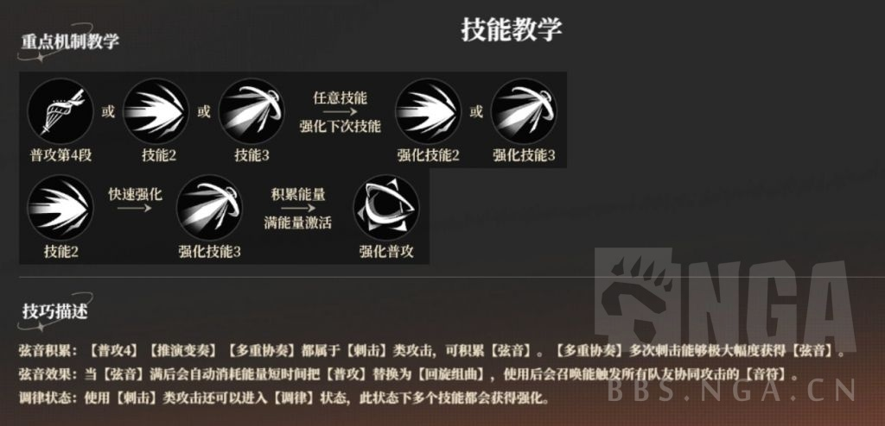
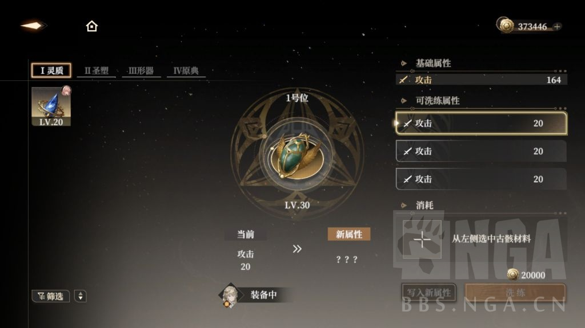
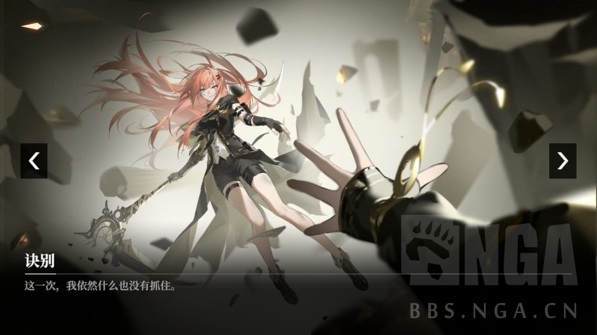

### [安利] 黑色信标二测，编剧属名的神话科幻俯视角arpg，主观剧情瞎水与一点考据

Made by ngapost2md (c) ludoux [GitHub Repo](https://github.com/ludoux/ngapost2md)

----

##### 0.[13] \<pid:0\> 2024-01-26 17:55:40 by nihil456
[quote]<b>
前言
</b>[/quote][quote]

太忙了，真的没时间玩……而且测试只有七天，真的打不完，只能随便写点纪录。

只打到第五章，end game玩法都没碰，所以玩法也略写。
加上之前总有人说我写得太长，这次也想换个方式排版。
最後<b>叠甲</b>：纯正<b>弱保软手残党</b>，游戏理解一般，如有任何错误疏漏，都欢迎指正，看到就改！
[/quote][quote]<b>
简单介绍游戏本体
</b>[/quote][quote]
<b>一、简要玩法概述</b>

<a href="javascript:;" onclick="collapse(this);">+</a>没啥干货，纯粹纪录 ...
玩法是：<b>俯视角arpg</b>

可以上场三人，~~主线其中一人可借陌生大佬助战乱杀~~。
角色有：<b>平a、闪避、切人技、技能12、终结技</b>，并且每个角色都有连招跟特殊机制。
例如萝歌斯的<b>连招表</b>：

还有特殊机制<b>音符</b>，可以协助攻击，奶当前场上的角色。

所以说好不好玩，每个角色都有特殊机制设计，大佬玩起来上限很高，手残党只要照着连招表按技能也能打出伤害，不至於玩不了。还有些角色，算特别弱保软简单好用，例如青、伊蕾什安都是简单易用，不过上限可能就没需要掌握节奏的铂鸢高。
并且每个角色都有手把手保姆教程关卡：

此外，主线还有些解谜、跑酷等小设计，也还算挺用心。
end game也有自选难度打积分、自选buff等等挑战关卡。~~不过我真的没时间，所以都没啥玩~~

<b>二、卡池纪录</b>

<a href="javascript:;" onclick="collapse(this);">+</a>虽然说测试还有改善空间，但…… ...
抽卡票分普池跟限定池。

<b>限定池：</b>

<b>金卡曜日0.8%，含保底1.79%，up概率70%，80抽小保底，160抽大保底。</b>
只能说原汁原味，0.8%看似比0.6好点。
但是……
抽满要<b>七命</b>！也就是加本体8张卡。

虽然逼不逼氪，还是要看福利如何，~~如果一个卡池送180抽一个大保底那行~~。
可现在福利不明确的情况下，光这七命就能劝退一堆玩家。
另外，本测抽卡代币可以换叠卡道具，甚至可以换限定角色，但限量换一次。

<b>常驻池：</b>

<b>金卡曜日0.8%，含保底1.79%，80抽小保底。</b>

<b>武器池：</b>

<b>金卡完美1.5%，含保底3.11%，up概率70%，50抽小保底，100抽大保底。</b>
好消息是：可以自选up，中途换up不会清空水位。
坏消息是：只能用限定票抽，并且非常专，武器只有对应角色能用，包含紫卡角色都有对应专武。
并且，专武提升非常大！
专武同样可以叠卡，叠卡提升也很大。抽满要叠几张卡，我不知道……非常深。

这原汁原味，对一个俯视角，没开放世界，没箱庭可舔卡的arpg，我只能说太自信了。

~~建议改成忘却前夜同款，高福利+最多3命+可共用武器，至少没这么吓人……~~

<b>三、简要养成纪录</b>

<a href="javascript:;" onclick="collapse(this);">+</a>虽然说测试还有改善空间，但……x2 ...
<b>没自动、没扫荡，只有4倍体力消耗手动。</b>

养成除了常见的技能等级突破，还有：
<b>4件套圣遗物。</b>
可以洗词条，词条可以重复：~~但我没洗过~~

此外还有个重量级的<b>武器本源</b>：

武器要先叠同名两张卡开插槽。
然後刷周本命运之书，拿到代币去商店兑换，再插入插槽。
金本源效果很强：

本源同样可以吃同名提升。

开插靠氪，或者周本代币也可以换叠卡道具。~~但多久刷新不知道~~
只一把金专武，只有一个插槽，只能插入紫本源。
两把金专武，仍然只有一个插槽，但能插入金本源。
三把金专武，才多第二个插槽，但一金一蓝。
四把专武，两个插槽，一金一紫。
最高是三个插槽，但我不知道是否能叠到三金，所以我仍不知武器池的上限……
另外紫卡抽满要5张同卡，最高只有两个插槽，一金一紫，差距很大。
可以说是又肝又氪，巨恶心的养成。

反正这养成我是玩不了一点。
公测不改，光凭你游文案，跟中游美术建模，我选择看视频云玩。

<b>四、美术建模等</b>

<a href="javascript:;" onclick="collapse(this);">+</a>好消息有乳摇，坏消息有男 ...
本测所有角色都在此：

可以看到有两个蒙面男，跟一个黑皮小男孩，三张紫卡。
老实说……
我觉得把男角全性转或者全砍也没问题。
~~虽然剧情中有出场，人设合理，但也没必要是男，性转成女角也不影响剧情展开~~

其实我觉得建模还行，但也没特别突出。
有乳摇，有战斗开始，跟结算动作。
但是没有箱庭方便舔角色，看板放角色非常小：

可以拉近互动，但<b>目前没有任何触碰动作</b>。

看角色就这样傻站，是真的舔不起来……

此外，剧情全配音，演出是l2d，也有3d动画，个人觉得还行。
不过剧情很严肃~~科幻~~正剧。
~~但不是末日背景，也不是啥黑深残。~~
真正ml的角色目前只有一个，女主<b>零</b>：

剧情写得挺好，随着剧情展开共患难，零对玩家越来越爱，玩家会填补她的一切，成为她最重要的唯一，~~想想挺涩的~~。

~~除了零，铂鸢或许有机会，因为祖上对玩家签订誓约x~~
[/quote][quote]<b>
剧情跟一点考据
</b>[/quote][quote]<b>这就是编剧属名的底气！</b>

每一章节，都会标注是谁写的。~~虽然现在就日晶与滕野两人轮流~~
日晶据说是原战双文案，写过绝海星火，但我没玩战双，也是跟群友水才知道。

不过也不用过度吹，其实满多设定在别处都看过，也有些细节不能细想……一细想就圆不回来。

<a href="javascript:;" onclick="collapse(this);">+</a>详细主观剧情感想+吐槽，有大量剧透折叠 ...
简短一句话介绍剧情：失忆的主角(玩家)获得巨牛b神秘组织(巴别图书馆)最高权限成为馆长，然後带着逐渐忠心护主的女主(零)解决各种神秘现象(异象)。经典王道开头，但剧情展开引人入胜，悬念伏笔翻转应有尽有，角色逻辑自恰，设定跟现实捏他也玩得有趣。

其实看第一章还觉得有点慢热，介绍巴别图书馆的无限猴子定理，我还记得刘慈欣也玩过这梗写了篇《诗云》，看看文案会怎么玩。
看到後续&quot;神的语言是二进制&quot;也平静无波，战锤机械神教我熟。
看到巴别图书馆时间维度空间化，主角能任意传送任何时空座标，我还想着：那不简单？主角能传未来看到伊蕾什安警告，而且不是平行多重宇宙，也无视祖父悖论这类因果矛盾，那就直接再传送更遥远的未来，问未来的人是怎么解决这次危机的不就行了？

但我还是很爱看。

开头人物性格一直让我想到eva(其实也没有很像)，零=绫波、伊蕾什安=明日香、南娜=美里，所以我一开始非常喜欢伊蕾，抽到也非常开心当主力练，然後……

你是这种设定！？

啊啊啊啊啊啊！不要啊！！！

後半高速翻转，把之前各种线索串连起来，并且刻画角色的行为动机，都让我觉得，不错，人物立起来了。
这是我想看的二游文案——不仅仅把剧情写好，更重要的是刻画好角色。
~~想看硬核科幻，我选择雨果星云~~

虽然後面看到零脸接光炮，我还是忍不住想呐喊：怎么不传送啊！？
之前不是面对大利乌、萨尔维斯包围都传送很快吗！？

~~感觉补一句，时空不稳定传送不了啥的，好像都比较说得过去。~~
不过也能明白，文案是想培养零跟玩家的感情，~~独处共患难~~，看到零的心态转变描写还是很香……

四章换地图去乾也很不错。
很少能看到二游文案把国家个机构职能写入剧情中，之後的立意跟反转也很喜欢。
可还是想bb几句，四章开始太爱引经据典掉书袋了……
让播种者大段引用释义《苦昼短》《道德经》就算了，~~我当你文输~~，连一个农夫都要引用诗经《苕之华》真的有亿点让我出戏……
~~有一说一，我觉得用文中也出现的谐音梗，给孩子取名阿宝(饱)是土味点，没苕华好听，但也没取名後还要大字告诉玩家典故出戏。不然苕华当彩蛋也行，爱考据的玩家自然会考据……~~

最後想水一下姬夏，明显捏他炎帝神农氏。
但真的看得我想好打他！
先不说动物饮青之水狂燥，或者青疠患者思维持缓问题。~~因为他本人可能就是无副作用成功案例~~
不会真的有人觉得，让一个人永远停留在幼儿体型是大善事吧！？要么心智不成长，一辈子当小婴儿，要么心智成年人身体小婴儿……更不用说怀孕在肚子里停滞，一辈子活在肚子里，这是啥畸形秀吗？别说他做为一个可能活了千年的学者没想过这些。

实在对他共情不了一点……只觉得他有病，希望早点亮血条！

<a href="javascript:;" onclick="collapse(this);">+</a>关於男角，一点个人主观想法瞎bb，有些许剧透 ...
首先亮pg，我铁直女，但我支持男不玩。
能理解文案想写正剧，不想受限於性别框架啥的。剧情中，也没卖啥ml(除了女主零)，其他角色都心系天下~~是无情的事业机器~~，一点儿女情长也没。
不过目前三紫卡男，蒙面硬汉、蒙面苦逼男、黑皮小男孩，~~不代表别人只代表自己~~，真的都没媚到我。

~~相比之下老东家鸣潮是真的媚女，我在小群贴忌炎、卡卡罗都是好好好，你游紫卡男是真的起不了水花。身边统计学，黑皮小男孩更是小众xp，小男孩控都跑原了，你游打得过原吗？~~
塞了男角却没媚女，吸引不来女玩家，更少了一批全女男玩家，感觉得不偿失。~~如果塞男角目标是媚男，那就当我没说。~~

即便把主线五章剧情看完，我还是觉得，男角性转成女角没啥问题。
沙玛什其实戏份不多，换成无口御姐也不影响？
恩基跟宁莎是双子，改成黑皮罗莉也行？
无实，算是剧情多，文案也刻意设定成苦情大哥形象，但我觉得改成姊姊照顾妹妹也行吧？
至於没落地的姬夏，捏他炎帝确实很难性转，但还是别落地了，人设太重量级感觉洗不回来。渊泉还没人物形象，改成女角也无妨？~~除非渊泉是姬夏四章开头的好基友~~

不过也没绑架或者指导的意思，就像我当年也支持尘白删男(不是很明白瓦尔基里游戏，为啥塞男)，支持交错战线删男(当年还叫交错核心)。
我现在也还是同样立场，如果不是真心想逆舆论做男角，真的没必要像爆裂魔女那样塞个低星男……

之後来点随兴考据：
叠甲：我本身也不是史学专业，所以也没多少干货，纯粹一些网上搜得到的史料整理。如有任何错误，都欢迎指正，感谢！

<b>黑色信标、埃利什、洞穴之喻</b>

<a href="javascript:;" onclick="collapse(this);">+</a>可能有些微剧透，所以同样折叠 ...

看到石碑与巴别图书馆介绍的时候，我脑子里第一反应就是：

《2001太空漫游》，~~要说文案没看过我不信，不说八成，有九成像。~~
如果你自认科幻迷，那推荐一看。
看完也能明白，为何游戏名称叫&quot;黑色信标&quot;，而不叫啥巴别图书馆、楔文会、异象管制联盟啥的。

不过像也没啥，科幻题材中也很多类似的，例如同样以知识重构时空的黑色不明物体《降临》：

~~当然具体题材内容差很多，只是想说这类黑色不明物体梗也算玩烂了~~

至於巴别图书馆，跟巴别塔，应该也不用我bb，也是在二次元中被玩烂了。
剧情开头动画的：来吧，我们要建造一座塔……也是引用自创世纪。
楔文中的bab-ilu，则是上帝之门的意思：

楔文会的创始人埃利什，应该是源自巴比伦创始史诗《埃努玛·埃立什》。

不过这不是人名，而是首句&quot;天之高兮&quot;的音译。
内容是阿勃祖与迪亚马特(对，就是fgo的提妈)创世，创造众神，又互相争斗，最後巴比伦主神马尔杜克杀死象徵混沌的迪亚马特，跟她的新丈夫金固(呃对也是fgo)，建造巴比伦的第一坐城市埃利都(Eridu，zzz那个埃利都)。

游戏开头的洞穴说，就是柏拉图《理想国》中的寓言，应该也算常见了，不多bb。

<b>长生军、大利乌、安息帝国</b>

<a href="javascript:;" onclick="collapse(this);">+</a>可能有些微剧透，所以同样折叠 ...
长生军这名号在游戏中也算常见了，出自古希腊史学家希罗多德写的《历史》，是波斯帝国的精锐部队。
大利乌常见的翻译的是：大流士。
大利乌大帝，也就是大流士一世，常在影视游戏作品中听见的：万王之王。

欧贝德(Ubaid)则是在伊拉克南部：

是两河文明(美索不达米亚)那一带，有乌鲁克(对就是fgo的乌鲁克)文化遗址(埃利都遗址)附近，也有一段史前文明叫欧贝德文化，~~跟大流士大帝的波斯帝国时间差几千年~~。

安息帝国(Arsacid Empire)，是大流士大帝的阿契美尼德王朝，他子孙大流士三世被亚历山大gg後，伊朗人在两河流域建立的新帝国。

可以看得出文案是跨时间线，融了不少东西。

<b>孟斐斯、阿顿、阿肯那顿、埃赫塔顿</b>

<a href="javascript:;" onclick="collapse(this);">+</a>可能有些微剧透，所以同样折叠 ...
孟斐斯，就是古埃及在尼罗河三角洲的首都：

阿肯那顿(Akhenaten)，是古埃及第十八王朝的法老，也就是阿蒙霍特普四世。

原名阿蒙霍特普，延续他老爸三世的名字，意思是阿蒙的仆人，阿蒙则是底比斯的主神。
但阿蒙霍特普四世一上位就开始搞宗教改革，崇拜新太阳神阿顿。

史学家推断是为了集中权力，打击底比斯的阿蒙祭司。在位第五年开始兴建埃赫塔頓(Akhetaton)，意为阿顿的视线，并迁都。并同年改名阿肯那顿，意为阿顿的仆人，或者如文案所述阿顿的灵魂。
当然因为他整天搞宗教改革，对亚洲附庸国被赫梯人侵略不予理会，削弱了埃及帝国对外影响力。同时在他统治期间也爆发一场大瘟疫，扩散到中东，搞死了赫梯国王。
他的儿子就是大名鼎鼎的图坦卡蒙(Tutankhamun)，意思是阿蒙的形象，对……结果他儿子又信回去阿蒙了。

<b>雅弗、图里努斯、碧露芳丹</b>

<a href="javascript:;" onclick="collapse(this);">+</a>可能有些微剧透，所以同样折叠 ...
先从图里努斯(Thurinus)说起，就是屋大维，他全名叫盖乌斯·屋大维乌斯·图里努斯(Gaius Octavius Thurinus)。

罗马帝国的第一位元首，恺撒的养子跟继承人，被元老院赐封为&quot;奥古斯都&quot;(Augustus)，意为高贵神圣的，也就是封神了，同时也是现在英文八月August的字源。

游戏剧情中的继任者卢比孔(Rubico)，只是意大利北部的河流名称，跟历史上屋大维的继任者提比略没啥关系。
比较有名的典故是恺撒跨越了卢比孔河，开启5年罗马内战，斗掉庞培与元老院共和派，成为独裁官。
~~萨尔维斯更是纯属原创，光这读音就不像拉丁文。~~

雅弗(Japheth)，不是拉丁语，是创世纪的典故。
大洪水受天启建造方舟的挪亚，有三子分别是闪、含、雅弗，代表中东、北非、欧洲人种。

至於碧露芳丹，又是一个跟其他名字格格不入的地名，盲猜是枫丹白露(Fontainebleau)改改的。
当地最有名的就是枫丹白露宫，是法国最大的行宫：

这也是为啥铂鸢家主受封公爵(Duke或法语的Duc)。但这其实是古罗马时期，日耳曼或凯尔特等蛮族出生受雇于罗马军队的将帅，但没有正式军衔被称为Dux。在罗马帝国灭亡後，各地军事领袖也就纷纷成了独立小国君主，被称为大公，後来经过合并或并吞，成为欧洲国王授予的爵位。

<b>以法他之星、黑洛德、非利士海</b>

<a href="javascript:;" onclick="collapse(this);">+</a>可能有些微剧透，所以同样折叠 ...

以法他(Ephatah)就是伯利恒。
伯利恒之星，则是圣经中描写耶稣出生时，一颗星引导着东方三王来朝圣，也译三贤士。因为原文Magi(对，就魔笛Magi那个Magi)辞意不明，现代学者怀疑是从波斯语的占星术士Magus转化来。

黑洛德(Herod)也就是犹太王国的大希律王。他的孙女就是有名的莎乐美。

不过希律王不是犹太人，是以东人。因为父亲安提帕特受恺撒信赖，还曾带兵帮忙打赢了托勒密十三世(埃及艳后克里奧帕特拉七世的亲弟跟前夫，被亲姐联合恺撒政变篡位)，因此希律成为加利利省长(今以色列北部)。
之後他娶了猶太哈斯蒙尼王朝的公主米利暗一世，当上犹太国王，成为罗马附属国。顺便说，十二年後，希律王就担心哈斯蒙尼威胁自己王位，於是把老婆一家全杀了。
他儿子(Herod Archelaus)因为太残暴不得民心，後来被罗马罢免，犹太王国又成了犹太行省。

非利士海就是地中海。

<b>德尔菲、神谕隐所</b>

<a href="javascript:;" onclick="collapse(this);">+</a>可能有些微剧透，所以同样折叠 ...
德尔菲就是现今希腊的德尔菲遗址。

有供奉雅典娜、阿波罗的神庙建筑群。
其中最有名的就是阿波罗神庙入口的三句箴言：
认识你自己(ΓΝΩΘΙ ΣEΑΥΤΟΝ)、凡事勿过度( ΜΗΔΕΝ ΑΓΑΝ)、妄立誓則禍近(ΕΓΓΥΑ, ΠΑΡΑ ΔΑΤΗ)
跟德尔菲神谕：由女祭司传达的神谕。~~希腊人真的很爱问神谕。~~
比较有名的就是萨拉米斯海战(也就是电影300勇士：帝国崛起的那场战役)。
红色是波斯，蓝色是希腊雅典：

先前大流士一世(就上面提过的大利乌原型)对希腊战争在马拉松战役失利，他儿子薛西斯一世(Xerxes)又继续来打希腊。希腊人求问雅典娜该如何避免灾厄，得到宙斯(雅典娜爸)一个意义不明的神谕：&quot;a wall of wood alone shall be uncaptured, a boon to you and your children.&quot;(我没找到准确翻译，只好自己翻：一段不被攻陷的木墙，将惠及汝与子孙)
当时希腊人就对着何为木墙争论不休，直到在阿提密西安(Artemisium)有场风暴席卷波斯船舰，希腊船只却无损伤。当时的指挥官地米斯托克利(Themistocles)游说木墙就是海军，将波斯舰队引入萨拉米斯湾，靠更灵活的船舰撞击获胜。
不过，胜利後希腊人担心出现军事独裁者，就把地米斯托克利陶片放逐了。
[/quote][quote]<b>
结尾
</b>[/quote][quote]原本没打算写的……而且只测试七天真的太短了。~~至少测试个十天吧~~
完全是被剧情炸出来。~~大概是因为，这种用神话包装科幻，不时让我想起永远无法完结的圣魔之血，缅怀感叹，所以好感拉满。~~

~~然後摸鱼+写考据写了一阵子~~
还是老样子，感谢老哥们看到这里，有任何错漏都欢迎指正，我看到就改！谢谢！
[/quote]

----

##### 1.[14] \<pid:739984507\> 2024-01-26 19:29:23 by 林夕之
多谢楼主排雷，有男不玩

----

##### 2.[1] \<pid:740000220\> 2024-01-26 21:14:29 by 江河湖海之主
楼主的考据挺有意思现在是我的了

但我还是要说，有男不玩

----

##### 3.[0] \<pid:740015486\> 2024-01-26 23:15:04 by 咸鱼啊大咸鱼
这游戏目前阶段除了氪金、出卡率之外最大的问题毫无疑问是又丑又难用的UI

----

##### 4.[0] \<pid:740016739\> 2024-01-26 23:25:04 by 胖哒人
感谢楼主分享有几个角色还挺对我胃口的，可惜了。有男不玩。

----

##### 5.[0] \<pid:740022286\> 2024-01-27 00:13:45 by 某方向
有男人吗，有男不玩

----

##### 6.[0] \<pid:740024388\> 2024-01-27 00:34:18 by 李群的光
他的玩法像周常这些基本就是个小战双，而且默认女指。注定小众了。

----

##### 7.[2] \<pid:740026825\> 2024-01-27 01:03:19 by 北羽共辰
多谢楼主考据并分享见解。

----

##### 8.[5] \<pid:740029400\> 2024-01-27 01:42:32 by 三费最强
这年头的新游戏是哪里来的自信，一个二个都要抄米家氪金模式？

自从玩了崩铁被恶心到了以后，我再也不会碰这种模式的游戏了，掉落率低于1.2%外加专武的都是流氓游戏。

----

##### 9.[2] \<pid:740039501\> 2024-01-27 07:52:33 by Milan米兰
辛苦测评了!
可选男女主吗，还是锁男主的?
听说有什么女boss男助手姐弟什么的?这怎么给我一股那么重的战双味(虽然一直有人说战双很ml但我玩到21年底退坑，开头搞比安卡渡边的cp还有露娜后面跟个那个叫啥的罗兰吗加三头犬连体讲真都挺不符合男玩家喜好的)
美术感觉不错。就这命座武器加看起来一般向的路子。。不是很看好

----

##### 10.[0] \<pid:740086523\> 2024-01-27 14:22:42 by nanimonoK
感谢楼主排雷

----

##### 11.[1] \<pid:740086871\> 2024-01-27 14:25:11 by nihil456
>[jump](#pid740024388) 李群的光[/uid] (2024-01-27 00:34)</b>
<b>Reply to [pid=740039501,39110531,1]Reply[/pid] Post by [uid=65556031]Milan米兰[/uid] (2024-01-27 07:52)</b>
两位老哥的一起回复。
游戏中玩家是馆长，没有具体形象，可以参考小碧蓝老师，或者大碧蓝指挥官。~~(不是像少前或者交错那种有选主角性别，也不是舟那种有博士形象)~~
文案中描述玩家比女主零高大(在背人那段剧情)，但其他都没啥描述。

因为时间不够，周常我都没啥玩。
目前主线五章boss没啥女的，甚至反派都没几个女的。~~再说要剧透了~~
也没有男助手，自机三个紫卡男，都不是玩家助手。三个紫卡男不是跟玩家没啥互动，就是呃根本不同时代或立场。~~再说要剧透了x2~~
目前ml只有女主零，其他都是心系天下，无儿女情长。

<b>Reply to [pid=740029400,39110531,1]Reply[/pid] Post by [uid=36141169]三费最强(2024-01-27 01:42):

我也搞不懂为啥这么自信……

不会真以为米三件套能给年一游新价格锚定吧？能接受的早玩米家桶，哪看得上其他游戏；不能接受的，看到打不过米还抄米，更不可能玩了……
另外我觉得这测养成比米三件套更重量级，问就是武器本源，光看都麻了。

----

##### 12.[2] \<pid:740174248\> 2024-01-28 00:01:56 by tina2231
写的非常好，点个赞

不过这定价属实是自信的让人笑出声，我是肯定不会玩的

----

##### 13.[0] \<pid:740185649\> 2024-01-28 01:52:07 by 鱼我所乐也
是不是那个公告概率含保底的神仙游戏

----

##### 14.[0] \<pid:740664506\> 2024-01-30 17:59:15 by 阿良良木逸

贴一个自己之前参加内侧的评价，这游戏是真的别碰

