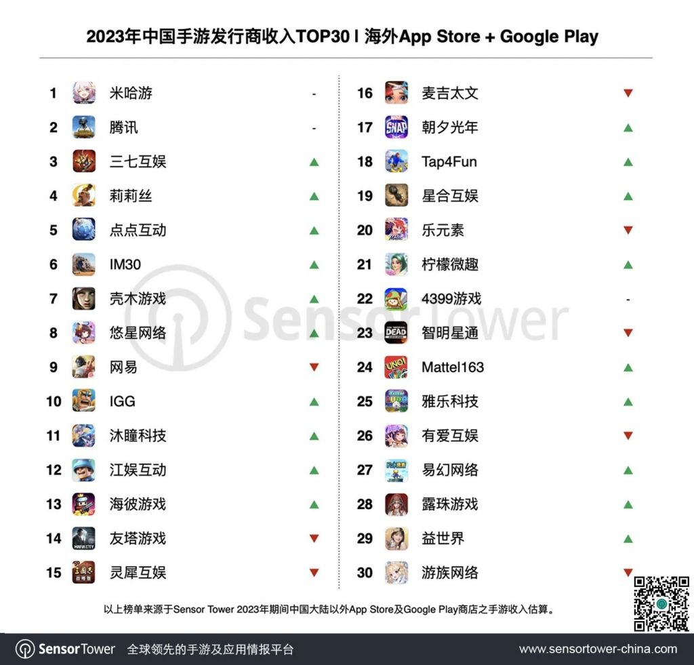
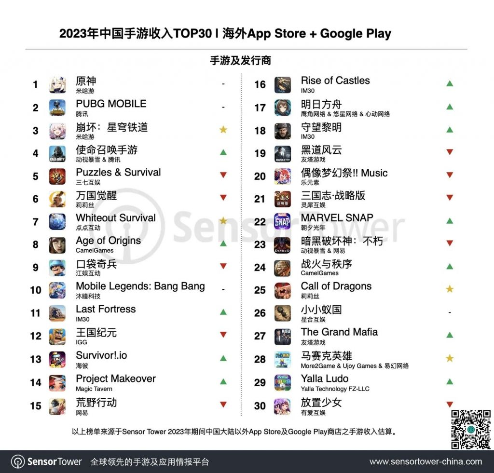
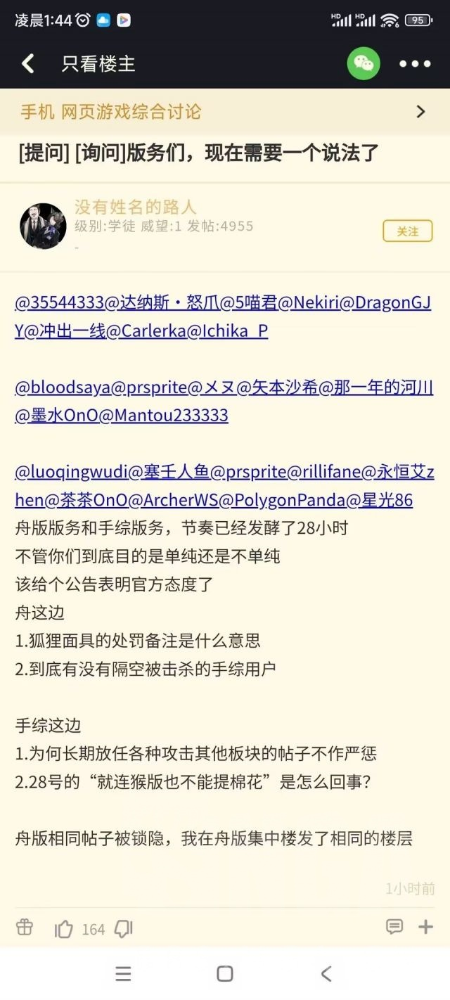
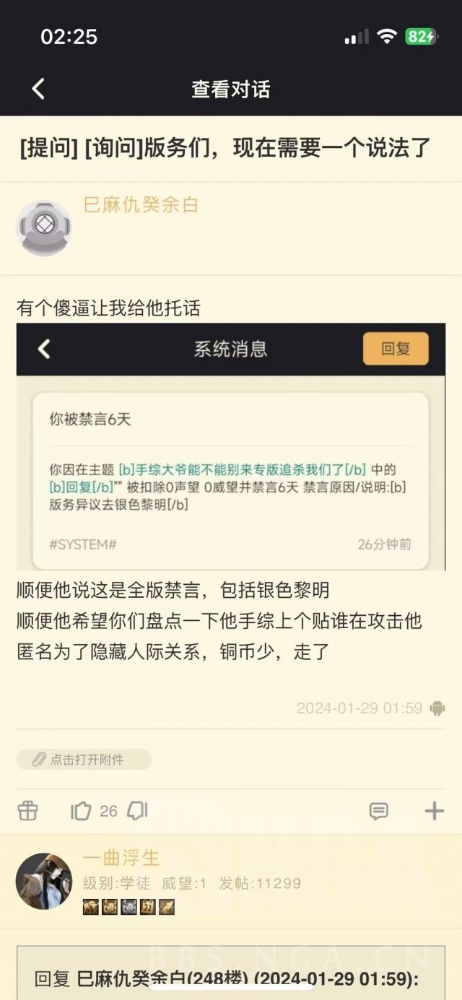
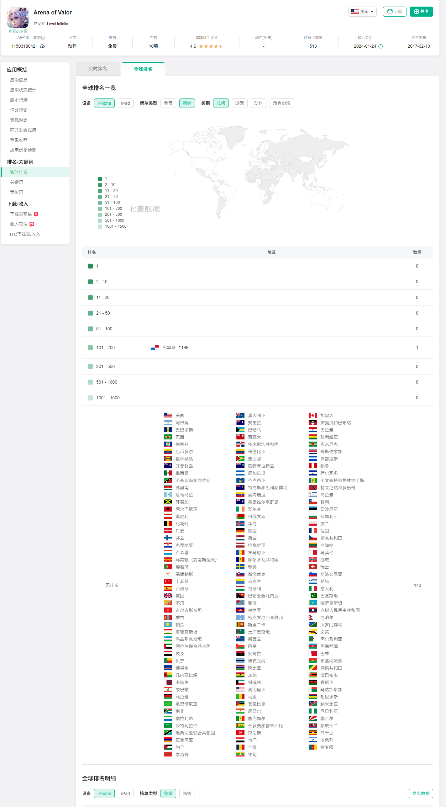
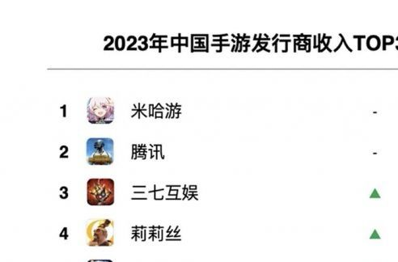

### [杂谈氵]2023年海外手游市场总体萎缩2.7%，但是。。。

Made by ngapost2md (c) ludoux [GitHub Repo](https://github.com/ludoux/ngapost2md)

##### 热门回复

- [1楼](#pid740381141): 已阅，有男不玩
- [2楼](#pid740381182): 1+1=1.14，还不是&lt;2，这打...
- [3楼](#pid740381344): 说得好，[s:ng:呲牙笑]，但是我们手...
- [4楼](#pid740381427): 那赚的钱是新加坡交税还是上海交税啊[s:...

----

##### 0.[0] \<pid:0\> 2024-01-29 11:02:08 by beyond1916
Sensor Tower数据显示，2023年海外手游玩家在App Store和Google Play的总支出为616亿美元(不含pc)，小幅下滑2.7%，与2022年相比有所减缓。TOP30中国出海手游在App Store和Google Play的总收入为78亿美元，较2022年有所减少。

但是，凭借《崩坏：星穹铁道》在全球市场的亮眼表现，米哈游2023年海外收入提升14%，创历史新高，稳坐出海手游发行商收入冠军。2023年，《原神》仍是米哈游旗下收入最高的手游，《崩坏：星穹铁道》已贡献了近40%的海外总收入。

不是说好的全靠pc系数抬一手吗?不是说好的1+1&lt;1吗？说好的盒厂今年开始下坡路，明年就要死了呢？

转载自:[url](https://mp.weixin.qq.com/s/cYSKXjduOJWwhyUQehrKvg)

ps:就喜欢发点手综米黑不爱看的新闻，打击感可太好了。

*---下挂评论---*

1.[27] \<pid:740382961\>2024-01-29 11:12:06 by 荒谬蝴蝶:
大家好，这里是明………事件集中贴，大家请写下自己的想法吧。

2.[25] \<pid:740383777\>2024-01-29 11:15:45 by 八舞的剑舞:
原来粥真的打不过米啊，那不是纯纯小丑垃圾

3.[13] \<pid:740387002\>2024-01-29 11:29:37 by 松愛推:
今天mhy捐了吗？

----

##### 1.[150] \<pid:740381141\> 2024-01-29 11:04:02 by coldse
已阅，有男不玩

----

##### 2.[235] \<pid:740381182\> 2024-01-29 11:04:14 by sbsx123
1+1=1.14，还不是&lt;2，这打击感  

哦改&lt;1了啊，对对，1.14确实比1大那么点，你米赢麻了

----

##### 3.[165] \<pid:740381344\> 2024-01-29 11:04:57 by 爱姆汉德桑
说得好，，但是我们手综人会一种神奇的帖子消失魔术，我们只要提到一个名字，你这个帖子就会被锁隐。

----

##### 4.[102] \<pid:740381427\> 2024-01-29 11:05:22 by 红色蜜蜂
那赚的钱是新加坡交税还是上海交税啊

----

##### 5.[3] \<pid:740381516\> 2024-01-29 11:05:45 by 泡泡猪酱
海外营收算国内的嘛？

----

##### 6.[40] \<pid:740381709\> 2024-01-29 11:06:38 by 八舞的剑舞
你发帖归发帖，我只要提一个名字，你帖子就会没有，你知道是谁吗

----

##### 7.[24] \<pid:740381750\> 2024-01-29 11:06:52 by 伤逝遐汐
你这证明1+1&gt;2了？怎么感觉连1+1&gt;√2都没看到     

编辑 好编辑期待1+1+1

----

##### 8.[36] \<pid:740381781\> 2024-01-29 11:07:01 by 阿特拉斯院长

已阅，现在没空搭理你，一边排队去

----

##### 9.[37] \<pid:740381856\> 2024-01-29 11:07:19 by SANAX
明日方舟。

----

##### 10.[9] \<pid:740381894\> 2024-01-29 11:07:28 by inficyclone
学长是不是算不明白1.14和2的关系啊

----

##### 11.[35] \<pid:740381958\> 2024-01-29 11:07:46 by 猫助啊
来晚了，阿米娅怎么说。

----

##### 12.[21] \<pid:740381986\> 2024-01-29 11:07:51 by vernhooo
1+1=1.14看把你乐的

----

##### 13.[5] \<pid:740382038\> 2024-01-29 11:08:08 by 咕咕鸡九号
所以有没有人来说说现在是什么版本
杀的太狠了，没有姓名的路人怎么没了

----

##### 14.[8] \<pid:740382084\> 2024-01-29 11:08:20 by jljhu

----

##### 15.[18] \<pid:740382258\> 2024-01-29 11:09:11 by 爱姆汉德桑
>[jump](#pid740381856) SANAX(2024-01-29 11:07) 说: 
>
>明日方舟。

这个帖子不被隐藏，那这里就当集中贴吧。

让我们看看哪个阵营更强大。

----

##### 16.[7] \<pid:740382292\> 2024-01-29 11:09:21 by 流离琉璃666
悠星网络为什么用的是猫粮雀魂作为头像姚老板真的没有自己的公司logo吗？

----

##### 17.[18] \<pid:740382316\> 2024-01-29 11:09:25 by 安塞腰鼓对
1.14还是把上半年原的巅峰卡池跟铁的开服红利算进去

----

##### 18.[10] \<pid:740382368\> 2024-01-29 11:09:38 by coldse
话说在盒厂社管的帖子里讨论隔壁社管会怎么样

----

##### 19.[7] \<pid:740382376\> 2024-01-29 11:09:40 by 巴基和比约恩
>[jump](#pid740381182) sbsx123(2024-01-29 11:04) 说: 
>
>1+1=1.14，还不是&lt;2，这打击感  
>
>哦改&lt;1了啊，对对，1.14确实比1大那么点，你米赢麻了

成本增加了多少捏 米桑现在可是5000人的大企业了喵
比之前增加了几倍
天呐

----

##### 20.[7] \<pid:740382397\> 2024-01-29 11:09:45 by 帧的弧
放心，今年只是衰退的开始
你米叠明年1+1能不能大于0.5都难说

----

##### 21.[40] \<pid:740382429\> 2024-01-29 11:09:53 by Dorothy_Goddess
我超，原神崩铁明日方舟同框了！米鹰99是真的！

----

##### 22.[6] \<pid:740382444\> 2024-01-29 11:09:58 by 晨於羽
1+1=1.14。猜猜之后1+1+1=多少？

----

##### 23.[31] \<pid:740382479\> 2024-01-29 11:10:05 by imfyz
有点幽默了，要不你自己打开二观看看5月6月铁道流水多少，10月11月流水多少

如果你连统计图表都不会看，理解不了“下滑”两字是什么意思，那建议回去写寒假作业。早点写完寒假作业正好趁过年玩新版本

----

##### 24.[3] \<pid:740382511\> 2024-01-29 11:10:13 by 一的亿次幂
哥，版本落后了，现在是明日……之后的版本

----

##### 25.[41] \<pid:740382540\> 2024-01-29 11:10:19 by 纳西妲真太可爱了
你们mxz不会对粥粥是真爱吧，看不得粥粥被骂非要跳出来挨打是吧

----

##### 26.[3] \<pid:740382595\> 2024-01-29 11:10:34 by 噬祂
我要发红色高棉你要如何应对呢

----

##### 27.[14] \<pid:740382635\> 2024-01-29 11:10:42 by Redbaby
明年再来个1+1+1+1=1.5，暴涨50%，我们米桑真是势不可挡啊！！！

----

##### 28.[9] \<pid:740382705\> 2024-01-29 11:11:01 by As17324720374
明日方舟

----

##### 29.[0] \<pid:740382756\> 2024-01-29 11:11:15 by 路过的白毛团子
先不说1+1=1.14了
这大活不都是今年下半年曝出来的？上半年都没人氪金，全部是下半年氪的是吧

----

##### 30.[0] \<pid:740382879\> 2024-01-29 11:11:45 by 夏萤firefly
哦，那关我什么事呢？反正我不玩有的是人玩

----

##### 31.[34] \<pid:740382880\> 2024-01-29 11:11:45 by mk32777777
大家不如来风险对冲吧

米孝子吹爹的帖，底下多提提舟

看删不删帖

----

##### 32.[2] \<pid:740382892\> 2024-01-29 11:11:49 by 请看我签名
>[jump](#pid740382376) 巴基和比约恩(2024-01-29 11:09) 说: 
>
>成本增加了多少捏 米桑现在可是5000人的大企业了喵
>比之前增加了几倍
>天呐

你对我们宇宙科技公司米哈游有什么意见
鸟鸟怪叫终不掩鸟鸟清音

----

##### 33.[11] \<pid:740382898\> 2024-01-29 11:11:52 by 爷裸奔
不带情绪的说一句  光看收入不看支出，没有任何意
今年mhy在海外的广告投放比往年大得不是一两点，主要是日本市场

----

##### 34.[20] \<pid:740382904\> 2024-01-29 11:11:52 by 奸奇至尊巫师
趁乱发帖还狼狈到要临时改数字，很委屈吧，这种时候

----

##### 35.[27] \<pid:740382961\> 2024-01-29 11:12:06 by 荒谬蝴蝶
>[jump](#pid0) beyond1916(2024-01-29 11:02):

大家好，这里是明………事件集中贴，大家请写下自己的想法吧。

----

##### 36.[6] \<pid:740383163\> 2024-01-29 11:12:55 by S-C23
好好好，今年能不能1+1+1+1+1&gt;1.4呢？   

----

##### 37.[7] \<pid:740383205\> 2024-01-29 11:13:06 by 纯纯fenkeng
3000人团队跟300人打平，o友赢马了

----

##### 38.[17] \<pid:740383230\> 2024-01-29 11:13:14 by kingred鸢尾花
不是，op这么不要脸啊，俩游戏加起来是原来的1.14倍，轨子还是个今年出的新游，有点逻辑的都知道害臊吧，这居然拿出来吹我是没想到的

----

##### 39.[11] \<pid:740383386\> 2024-01-29 11:13:58 by 一的亿次幂
米粥69，祝福锁死

----

##### 40.[2] \<pid:740383419\> 2024-01-29 11:14:07 by 不可切割的石块
米桑盒厂闹麻了，1+1=1.14，赢赢赢！

----

##### 41.[0] \<pid:740383434\> 2024-01-29 11:14:10 by 一曲浮生
刚才这贴不是隐藏了？还能复活?还是说刚才看错了

----

##### 42.[0] \<pid:740383504\> 2024-01-29 11:14:30 by 被ban了了了
1+2&lt;17   

----

##### 43.[5] \<pid:740383540\> 2024-01-29 11:14:41 by 刚帝企鹅
>[jump](#pid740383434) 一曲浮生(2024-01-29 11:14) 说: 
>刚才这贴不是隐藏了？还能复活?还是说刚才看错了

编辑，把2改成1了，就要过审核

----

##### 44.[0] \<pid:740383583\> 2024-01-29 11:14:52 by 止水-3
mxz好不容易打会顺风闹麻了

----

##### 45.[1] \<pid:740383602\> 2024-01-29 11:14:57 by 你说的对但NGA是
这是新的密码吗

----

##### 46.[6] \<pid:740383606\> 2024-01-29 11:14:57 by biuuu0
>[jump](#pid740381182) sbsx123(2024-01-29 11:04) 说: 
>
>1+1=1.14，还不是&lt;2，这打击感  
>
>哦改&lt;1了啊，对对，1.14确实比1大那么点，你米赢麻了

孝子1+1后边那个1宣发成本不算，开发成本不算，运营成本不算，典麻了。

----

##### 47.[0] \<pid:740383663\> 2024-01-29 11:15:14 by 镇魂石aom
原年初跟崩铁开服那流水跟年末两个游戏的流水，只要你看过就不会有脸来嘲讽了，看了一下还是个纯正撸狗ti10跑到刀区带假赛节奏的节奏狗，味是真大吧

----

##### 48.[25] \<pid:740383777\> 2024-01-29 11:15:45 by 八舞的剑舞
>[jump](#pid0) beyond1916(2024-01-29 11:02):

原来粥真的打不过米啊，那不是纯纯小丑垃圾

----

##### 49.[6] \<pid:740383778\> 2024-01-29 11:15:45 by 天笙梦绘
粥畜和米畜真是一股子脑瘫味道

----

##### 50.[26] \<pid:740383854\> 2024-01-29 11:16:09 by 爱姆汉德桑
我草这楼竟然真可以提哎

终于可以有集中楼屹立不倒了嘛

----

##### 51.[0] \<pid:740384003\> 2024-01-29 11:16:44 by 小小松003
1+1=1.14

----

##### 52.[23] \<pid:740384012\> 2024-01-29 11:16:45 by 不再嘴硬
你等会，我去帮你问问阿米娅怎么看

----

##### 53.[14] \<pid:740384658\> 2024-01-29 11:19:28 by jljhu

测试

----

##### 54.[0] \<pid:740384784\> 2024-01-29 11:20:01 by 女人离我远点
学长还会自己改啊，1+1&lt;1不会是你编的吧   

----

##### 55.[11] \<pid:740385003\> 2024-01-29 11:20:53 by 荒谬蝴蝶

----

##### 56.[0] \<pid:740385335\> 2024-01-29 11:22:21 by 爱姆汉德桑
>[jump](#pid740384658) jljhu(2024-01-29 11:19) 说: 
>
>
>
>测试

顶一下顶上去，看看会有啥效果。

----

##### 58.[8] \<pid:740386318\> 2024-01-29 11:26:42 by 吾王的骑士ll
wc，不会这帖子可以当集中楼吧，这要是成了就太地狱笑话了

----

##### 59.[1] \<pid:740386688\> 2024-01-29 11:28:22 by 安塞腰鼓对
>[jump](#pid740386318) 吾王的骑士ll(2024-01-29 11:26):

社管：你们还是喷米哈游吧

----

##### 60.[9] \<pid:740386744\> 2024-01-29 11:28:35 by 腾米暴易任索软
倭+倭=叩

----

##### 61.[13] \<pid:740387002\> 2024-01-29 11:29:37 by 松愛推
>[jump](#pid0) beyond1916(2024-01-29 11:02):

今天mhy捐了吗？

----

##### 62.[18] \<pid:740387271\> 2024-01-29 11:30:47 by 坑爹鄕
卧槽楼中楼是吧
不能聊的躲米楼里面放出就ok？
还是逛论坛好玩，搁这打游击呢。

----

##### 63.[4] \<pid:740387355\> 2024-01-29 11:31:09 by 御原凛音
等一个1+1+1&lt;2

----

##### 64.[6] \<pid:740387435\> 2024-01-29 11:31:29 by 因果交流电波
隔壁的纯良米友集中楼没了？

----

##### 65.[4] \<pid:740387497\> 2024-01-29 11:31:47 by 汤圆史莱姆
我日，看见这种贴鸡皮疙瘩都起来了。别墅已经扣好了

----

##### 66.[0] \<pid:740387776\> 2024-01-29 11:33:06 by 彻木
你米爹牛逼行了吧我又不玩

----

##### 67.[5] \<pid:740387932\> 2024-01-29 11:33:44 by 作死的路人
建立在去年半年巅峰原神和崩铁开服上所取得的1.14成绩，怎么感觉有点好笑呢，配上1+1&lt;2改成1+1&lt;1就更好笑了   

----

##### 68.[12] \<pid:740388006\> 2024-01-29 11:34:04 by JonathanJoestar
这不是那个著名的泽野弘之给高达配乐是给高达脸的碧阳德哥吗？

----

##### 69.[2] \<pid:740388273\> 2024-01-29 11:35:14 by 五月773
>[jump](#pid740387435) 因果交流电波(2024-01-29 11:31):

秒没，根本集中不了一点

----

##### 71.[4] \<pid:740388424\> 2024-01-29 11:35:57 by sans147
1+1&lt;根号2闹麻了

----

##### 72.[4] \<pid:740388454\> 2024-01-29 11:36:05 by 爱姆汉德桑
>[jump](#pid740388273) 五月773(2024-01-29 11:35) 说: 
>
>秒没，根本集中不了一点

但是这个帖子里可以活相关内容

----

##### 73.[7] \<pid:740388533\> 2024-01-29 11:36:22 by 作死的路人
>[jump](#pid740388006) JonathanJoestar(2024-01-29 11:34) 说: 
>
>这不是那个著名的泽野弘之给高达配乐是给高达脸的碧阳德哥吗？

好像还拿别人号装氪佬？

----

##### 74.[11] \<pid:740388577\> 2024-01-29 11:36:36 by ayase252
改动
在2024-01-29 11:06修改

笑点解析

----

##### 75.[8] \<pid:740388663\> 2024-01-29 11:36:57 by 三月三儿三
改主贴还打击感呢

----

##### 76.[8] \<pid:740389029\> 2024-01-29 11:38:35 by 伤逝遐汐
>[jump](#pid740388577) ayase252(2024-01-29 11:36) 说: 
>
>改动
>在2024-01-29 11:06修改
>
>笑点解析

这就是我们原友的打击感啊，你们有没有这样的打击感啊

----

##### 77.[4] \<pid:740389614\> 2024-01-29 11:41:10 by o5-9
看23年的话肯定涨啊。崩铁卖相是好，但是开服时候火成那样确实想不到。但是崩铁和原神都高速下滑，23年才1+1=1.14的话，绝区零还得也这么爆火一波才能整体不下滑吧。到时候就是1+1+1=1了，说不定还保不住1。

----

##### 78.[2] \<pid:740389736\> 2024-01-29 11:41:43 by 点得着火的折子
你爹捐款了吗？
你爹1+1&lt;2都怪你不孝顺

----

##### 79.[0] \<pid:740389758\> 2024-01-29 11:41:50 by UID3249092
原神的流水巅峰也是在去年，就这样年底两个游戏加一起也就这点，今年想想就滋润，说不定1+1&lt;0.5，今年可没有胡夜池这样的老本可以吃了

----

##### 80.[8] \<pid:740390667\> 2024-01-29 11:45:56 by 五月773
诶..为什么手游就这么多孝子贤孙呢
开服玩铁就被学长恶心到了
之后终末地开测，看着卖相还不错，开始期待终末地，虽然粥学长大名远扬，我还以为已经式微了没想到这么嚣张猖狂，一想到以后终末地又是一堆孝子瞬间就不期待了呢

----

##### 81.[7] \<pid:740393572\> 2024-01-29 11:59:32 by keyanlly
自从手综和弓弓共同抵抗米有已过去半年，尽管成功驱逐了MXZ的入侵，挽救了手综。如今脆弱的协议已荡然无存，如今震天的战鼓再一次响起！

----

##### 82.[0] \<pid:740394524\> 2024-01-29 12:03:57 by aisqgl
1+1&lt;2的打击感   

----

##### 83.[6] \<pid:740395574\> 2024-01-29 12:08:55 by 有泪是清欢
这玩意也能开香槟吗，新闻不是正反怎么说都行，比如题目改成这个～米哈游主力产品海外降温明显，扛鼎产品原神收入尚不如去年的70%(1.14×0.6)。

----

##### 84.[2] \<pid:740395888\> 2024-01-29 12:10:24 by 调皮的小灵通
大胆，我先润了

----

##### 85.[4] \<pid:740396460\> 2024-01-29 12:13:08 by HCHGC
吹一个新加坡公司，真是闹麻了

----

##### 86.[2] \<pid:740398036\> 2024-01-29 12:20:37 by foehnX
根据回归性原则，去年1.14，今年就是5.14了，赢了又赢

----

##### 87.[0] \<pid:740398090\> 2024-01-29 12:20:50 by 看着就难绷
看来确实没上过班，数学也不太行，脑子里流满水现在溢出来给大伙看笑话

----

##### 88.[2] \<pid:740398858\> 2024-01-29 12:24:15 by ＃∨＃
建议在这里聊节奏，应该不会锁隐

----

##### 89.[0] \<pid:740411111\> 2024-01-29 13:29:57 by 抗韩奇侠米哈游
不仅不玩xxn设计的游戏   更不信xxn统计的数据

问就是有男不玩

----

##### 90.[0] \<pid:740413832\> 2024-01-29 13:44:53 by 流离琉璃666
>[jump](#pid740389758) UID3249092(2024-01-29 11:41) 说: 
>
>原神的流水巅峰也是在去年，就这样年底两个游戏加一起也就这点，今年想想就滋润，说不定1+1&lt;0.5，今年可没有胡夜池这样的老本可以吃了

水人水龙错过头汤的强度党可能会冲一波但也就一波了，枫丹其他新角色都没见过什么强度节奏，本来林尼有望吹一下毕竟当时有人在版里吹什么一箭10w？但吐舌黑丝小男孩，男女玩家都不爱闹麻了

----

##### 91.[7] \<pid:740415215\> 2024-01-29 13:52:02 by Mélusine003
无所谓，CP我只磕神鹰帝国x大米王朝

----

##### 92.[0] \<pid:740415445\> 2024-01-29 13:53:12 by UID3249092
>[jump](#pid740413832) 流离琉璃666(2024-01-29 13:44) 说: 
>
>水人水龙错过头汤的强度党可能会冲一波但也就一波了，枫丹其他新角色都没见过什么强度节奏，本来林尼有望吹一下毕竟当时有人在版里吹什么一箭10w？但吐舌黑丝小男孩，男女玩家都不爱闹麻了

妖王首次up也就60+的超抖，没血崩时候海森水平罢了。当时连续挂0太久而已，其实妖王的流水也够拉了，复刻更不用想

----

##### 93.[0] \<pid:740416800\> 2024-01-29 14:00:38 by sxakln2015
原撸狗确实很认白皮叠的涨幅

----

##### 94.[2] \<pid:740417193\> 2024-01-29 14:02:44 by 火前流明
哦天呐，1+1等于1.14

----

##### 95.[1] \<pid:740418790\> 2024-01-29 14:10:59 by 绝望之诗
他营收多了14%，你不会觉得成本没有变化吧

----

##### 96.[0] \<pid:740420199\> 2024-01-29 14:17:41 by Ayona
仙粥69，嗦死！

----

##### 97.[3] \<pid:740422348\> 2024-01-29 14:28:01 by 老鬼195
这不里茶知名小丑吗？跑这来当孝子了。原版又混不下去了？1+1=1米又赢麻了是吧？还嫌自己爆的典太少是吧

----

##### 98.[1] \<pid:740423529\> 2024-01-29 14:33:19 by majalis123
“明年就死”这不是米孝子编排米黑的夸张说法吗？米黑是骂加速、祝褒姒，又不是下定论说米哪年死，你搁这虚空打靶呢？
铁是五月开的吧，借着23上半年原巅峰期红利和病毒营销实现开局大爆，然后就持续下坡了；原则是3.5开始下坡，也是下半年的事，按年总额当然不明显，但从年中的1+1有2降到最后年总量只有1.14，怎么个趋势没瞎的都看得出来。
每次看到你这种嘴硬的，还有比如破站懂某人那种，我都会疑惑你们到底是一点经济知识都不懂，还是抓住最后的机会嘴硬呢？23下半年原铁两游都是长期看跌，原开始下坡时铁弥补了跌量，使颓势未马上凸显。24年这两依然看跌，而米新游怎么看都不足以挽回颓势，这时候跳出来嘲笑？我诚挚建议你去炒股
24年了，马上就可以按月看同比涨跌幅了，哪怕用那个系数成谜的二观数据，不提五月开始的2比2，现在可是2:1，你猜这1.14守不守得住

----

##### 99.[0] \<pid:740425537\> 2024-01-29 14:42:43 by 里昂人
今天mhy捐了吗，哥们甘肃人

----

##### 100.[0] \<pid:740435871\> 2024-01-29 15:31:55 by 问政山车神
说起来借个楼后排问两个问题
1、第二个榜单为什么没有王者？是真的海外成绩稀烂还是因为某些原因没有确切数据所以不计入统计？
2、第一个榜单里的发行公司排名是否只计算“国内手游”的成绩？比如悠星代理的碧蓝档案是否会计入？

----

##### 101.[0] \<pid:740437607\> 2024-01-29 15:39:50 by 风来xq
海外赚再多也是新加坡的，闹麻了，现在软文都不敢提外汇了
话说某个润润是不是还要把国内的42%带走

----

##### 102.[0] \<pid:740438403\> 2024-01-29 15:43:36 by 1296dmh
半年掉了1/3
和之前算的差不多

----

##### 103.[1] \<pid:740439792\> 2024-01-29 15:49:53 by 苍色洋流
1+1=1.14
赢麻了，赢赢赢！

----

##### 104.[0] \<pid:740441247\> 2024-01-29 15:56:41 by 噢你可惜呀
双榜第一这是要发多少福利啊！

我猜是三个粉球。

----

##### 105.[0] \<pid:740441909\> 2024-01-29 15:59:46 by devil19850501
能够赚外国人钱的都要支持

----

##### 106.[0] \<pid:740445283\> 2024-01-29 16:14:51 by 641_
>[jump](#pid740382444) 晨於羽(2024-01-29 11:09):

0.514(即答)

----

##### 107.[0] \<pid:740445938\> 2024-01-29 16:17:55 by 蓝梦公司
我是想看你们米学长反攻的，不是来看周处米÷各显神通，退钱！

----

##### 108.[0] \<pid:740452171\> 2024-01-29 16:45:40 by 胡桃夹子幻想曲
鉴定为来洗等级的

----

##### 109.[0] \<pid:740452269\> 2024-01-29 16:46:10 by 衝破雷神槌
已阅，明日方舟，有男不玩

----

##### 110.[0] \<pid:740476720\> 2024-01-29 18:47:11 by 荆条花3
八个蛋已经被告了，你不出来对你的帖子发表一下见解吗脸都肿烂了，疼不疼啊

----

##### 111.[0] \<pid:740479691\> 2024-01-29 19:03:57 by clarisfan
>[jump](#pid740382444) 晨於羽(2024-01-29 11:09) 说: 
>
>1+1=1.14。猜猜之后1+1+1=多少？

那就只能是1.14514了

----

##### 112.[0] \<pid:740481201\> 2024-01-29 19:12:27 by 云云边又在偷懒了
挺有意思的数据分析，虽然大家准确性就是图一乐。它里面写米哈游在日本市场是销冠，啊，应该是非日本公司收入第一吧。在日本它跟悠星并列第七第八，第十是腾讯。
其次在日本收入增长榜第一是腾讯啊，米哈游的孝子想不到吧，说米蒸蒸日上吧，这“蒸”的强度，怎么就滑到第七了啊。
还有海外手游最大收入一个美国一个是日本，你看美国还有原神的流水登顶了吗？我好久没听到27平行宇宙登顶的故事了。

----

##### 113.[1] \<pid:740481383\> 2024-01-29 19:13:32 by 哒哒块2号机
希望他们投入也只提高了14%

----

##### 114.[1] \<pid:740482667\> 2024-01-29 19:21:26 by UID65550053
>[jump](#pid740481383) 哒哒块2号机(2024-01-29 19:13) 说: 
>
>希望他们投入也只提高了14%

如果投入提高了14%的话，那么利润也会提高14%。按照光明日报报道的2023年的利润率约60%，投入需要提高35%以上才会让利润降低

----

##### 115.[0] \<pid:740483143\> 2024-01-29 19:24:15 by 第二纲集
接下来我要念一个召唤咒语了
你们两打吧，我有男不玩

----

##### 116.[0] \<pid:740483591\> 2024-01-29 19:26:59 by 东方辉针城城主
天才我操，可以完全不理sb楼主的话，而聊外面发生的节奏，不会被锁隐制裁，好方略啊

----

##### 117.[0] \<pid:740483808\> 2024-01-29 19:28:14 by 随机生成的id
知道了，有男不玩

----

##### 118.[0] \<pid:740484138\> 2024-01-29 19:30:09 by 化骨咩咩掌
你别急。我喜欢你的义父苟延残喘

----

##### 119.[0] \<pid:740484233\> 2024-01-29 19:30:43 by 月酱月酱
难绷，腾讯几个游戏出门啊要不要算上nike？或者手游lol？建议米雏把脑子装上，流水就是你的钱是吧？天天盯着这个逼玩意？你是公司董事长啊

----

##### 120.[0] \<pid:740485251\> 2024-01-29 19:37:03 by daxi101
>[jump](#pid740435871) 问政山车神(2024-01-29 15:31) 说: 
>
>说起来借个楼后排问两个问题
>1、第二个榜单为什么没有王者？是真的海外成绩稀烂还是因为某些原因没有确切数据所以不计入统计？
>2、第一个榜单里的发行公司排名是否只计算“国内手游”的成绩？比如悠星代理的碧蓝档案是否会计入？

给你看看你TX爹的王者出海成绩，还有脸问呢。

这是国际服，其他服只有泰国能收点米了。

----

##### 121.[0] \<pid:740487885\> 2024-01-29 19:53:09 by Nekonya_
那27国登顶和超抖100小时什么时候打赢复活赛  

----

##### 122.[0] \<pid:740489524\> 2024-01-29 20:02:58 by 问政山车神
>[jump](#pid740485251) daxi101(2024-01-29 19:37):

懂了谢谢解答，没了解过相关内容，主要是一直在听说王者有在推进海外赛事，以为国外市场还不小来着，原来烂成这样，有点好笑的

----

##### 123.[0] \<pid:740491300\> 2024-01-29 20:14:01 by Koko2048
>[jump](#pid740485251) daxi101(2024-01-29 19:37) 说: 
>
>给你看看你TX爹的王者出海成绩，还有脸问呢。
>
>这是国际服，其他服只有泰国能收点米了。
>

就是！王者都把腾讯的出海成绩拉后腿了！米哈游海外都第一了，加上国内收入绝对薄纱腾讯捏！

----

##### 124.[0] \<pid:740491486\> 2024-01-29 20:15:18 by Koko2048
>[jump](#pid740489524) 问政山车神(2024-01-29 20:02) 说: 
>
>懂了谢谢解答，没了解过相关内容，主要是一直在听说王者有在推进海外赛事，以为国外市场还不小来着，原来烂成这样，有点好笑的

确实，王者在海外就和七圣一样烂泥扶不上墙罢了

----

##### 125.[0] \<pid:740492447\> 2024-01-29 20:21:52 by daxi101
>[jump](#pid740491300) Koko2048(2024-01-29 20:14) 说: 
>
>
>就是！王者都把腾讯的出海成绩拉后腿了！米哈游海外都第一了，加上国内收入绝对薄纱腾讯捏！

你腾讯爹就靠俩买来的外国IP撑场面了，自己的IP出海一坨屎，APP也出不去被抖音薄纱，没了国内老本的社交帝国谁都打不过，快别吹了

----

##### 126.[0] \<pid:740493310\> 2024-01-29 20:28:00 by 单手杰斯
俩游戏一点几还挺美，不愧是玩鸡游的智商

----

##### 127.[3] \<pid:740493717\> 2024-01-29 20:30:50 by Koko2048
>[jump](#pid740492447) daxi101(2024-01-29 20:21) 说: 
>
>你腾讯爹就靠俩买来的外国IP撑场面了，自己的IP出海一坨屎，APP也出不去被抖音薄纱，没了国内老本的社交帝国谁都打不过，快别吹了

那你的吹点不就是收入吗？转移话题不就是比不过吗？

----

##### 128.[1] \<pid:740493947\> 2024-01-29 20:32:33 by fangxinqq
我去，原来1+1=1.14这么值得骄傲啊？！开香槟喽

----

##### 129.[0] \<pid:740495111\> 2024-01-29 20:40:48 by daxi101
>[jump](#pid740493717) Koko2048(2024-01-29 20:30) 说: 
>
>那你的吹点不就是收入吗？转移话题不就是比不过吗？

你咋不把腾讯财报搬出来捏，米哈游更比不过，这贴在聊出海收入，你直接说咱们加上国内的，是谁因为比不过在转移话题啊？

