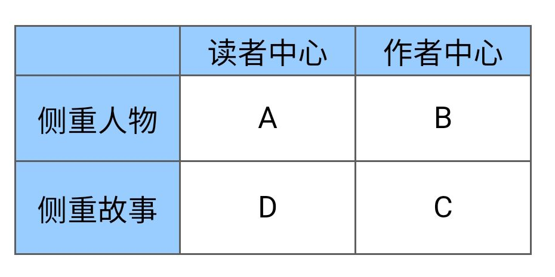
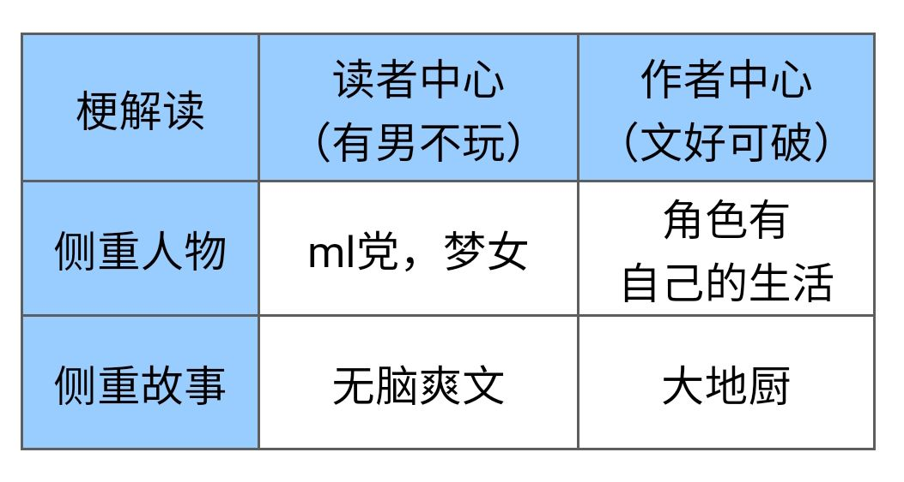
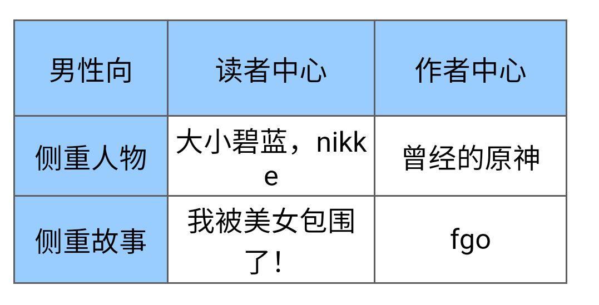
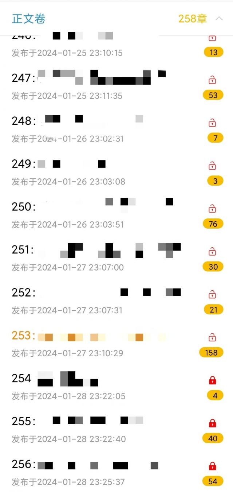

### [杂谈氵]四宫格理解二游纷争

Made by ngapost2md (c) ludoux [GitHub Repo](https://github.com/ludoux/ngapost2md)

##### 热门回复

- [1楼](#pid740412638): 你说得对，关我屁事，有男不玩就完了，爱出...

----

##### 0.[0] \<pid:0\> 2024-01-29 13:36:34 by 翻翻羊

读者中心：以服务读者需求为主，游戏就是个装潢公司，负责把需求落地，最好不要有自己的想法(俗称塞私货)

作者中心：以自我表达为主，创作出内核优秀的作品，依靠出色的质量吸引受众。(对质量要求高，创作者实力不够格还硬要朝这方面发展，就会发展成行为艺术——也就是所谓的文青病。)

侧重人物：故事是个背景板，依照人物需要展开

故事中心：人物是演员，服务于故事发展。

ml党和梦女的需求：渴望一个(或者一群)全心全意爱自己的爱人(们)。

我认为，AD侧玩家可以为了自己想要的东西付费，BC侧不往这里发力还想要玩家付费，那自然得有点硬菜才行。游戏性/美术/世界观/人物塑造/故事流畅度等等因素，总得拿的出手一项才行。如果这些都没有，又不愿意媚玩家，通常会死的很快。

原神依托于基本盘A，逐步往BC扩展为一般向游戏。在3.3版本之前，跟同期手游相比，它的质量一直处于领先状态。然而3.3之后逐步拉胯，BC崩盘，变成了混厕游戏。

少前想学习原神的先进经验，然而实力不足，成为了文青病行为艺术典范。

C区进行了修正。

fgo自带系列IP，请的专业作者。你可以说他游戏粗制滥造，但是在剧情方面的投入很大手笔。
(而且人家卖AD也不赖，ml的发源地)

剩下沾边的游戏有
《明日方舟》讲故事+游戏性为主，xp为辅

《重返未来1999》《白荆回廊》讲故事为主+xp为辅。

《无期迷途》可归类为AC合体。

C区这三个游戏目前处于讲故事为主+xp为辅的状态。

《无期迷途》可归类为AC合体。

至于百合耽美cp向，基本盘在D中的同人领域，热衷于寄生在BC区。所以会出现一个很怪的现象：cp向热门作的往往不是纯cp向作品，而是大热的优质一般向作品。专门服务于cp向的反而热不起来。

D区主战场为网文/短视频领域，游戏不多，主打低成本，捞一波就跑。

顺带最近很有话题度的乙游《世界之外》也可划分为D。

从厂商角度出发——

AD性价比高，受众稳定，缺点是事儿多，乙方当的憋屈。

BC扩圈容易，上限高，缺点是投入也高，需要比AD至少高出两档才能赚钱。扩不了圈的话基本不如AD赚钱。

最成功的BC侧公司：迪斯尼
人真不卖xp，硬核一般向。

PS：回贴说的好，二次元免费gacha手游往往是免费部分BC，付费内容AD。BC扩圈吸引足够多的人群(小额付费)，再在人群里钓出愿意给AD买单的648大鱼。这部分人被转移支付了，故而对一般向混厕游戏有怨言。

我主张细化赛道，男女分厕，一般向自食其力，少卖xp，大家都有美好的未来

前几天琢磨出的理论，纯自创，能力有限，划分相当简单粗暴，没考虑到游戏党/强度党/收集党/风景党/休闲娱乐党/社交党/cpdd党的需求。欢迎各位补充说明。

----

##### 1.[88] \<pid:740412638\> 2024-01-29 13:38:28 by 帝辛子受
你说得对，关我屁事，有男不玩就完了，爱出出，不出拉倒，我不玩国游还能死了？

----

##### 2.[0] \<pid:740413441\> 2024-01-29 13:42:48 by 翻翻羊
>[jump](#pid740412638) 帝辛子受(2024-01-29 13:38):

你说你的，我发我的，又不冲突

----

##### 3.[18] \<pid:740413628\> 2024-01-29 13:43:49 by 帝辛子受
>[jump](#pid740413441) 翻翻羊(2024-01-29 13:42):

是不冲突啊，厂商想做什么随意，会有什么后果厂商也清楚就行，此处不留爷自有留爷处

----

##### 4.[8] \<pid:740413824\> 2024-01-29 13:44:50 by yaoguanh
有男不玩秒了

----

##### 5.[17] \<pid:740413893\> 2024-01-29 13:45:10 by 恶灵骑士圣白莲
已阅，米粥99，有男不玩

----

##### 6.[17] \<pid:740413993\> 2024-01-29 13:45:40 by 七十二处女
>[jump](#pid740413441) 翻翻羊(2024-01-29 13:42) 说: 
>
>你说你的，我发我的，又不冲突

感情您搁这儿自嗨呢  

我们这是玩家论坛，不是厂商论坛。别不冲突，冲突大了去了  

特么玩个游戏，我还得考虑个厂商的角度，不纯有病吗

----

##### 7.[7] \<pid:740414165\> 2024-01-29 13:46:29 by 黄昏印记
突然发现中国的男性向文娱是越来越薄弱了，越来越向女性靠拢了，二次元游戏有xxn，小说上有男频大女主文，这样下去会变成怎样我都不敢想

----

##### 8.[6] \<pid:740414568\> 2024-01-29 13:48:37 by 潜水企鹅
有男不玩，厂商要搞名义上一般向实质女性向的随便搞，反正有男不玩。

----

##### 9.[9] \<pid:740414857\> 2024-01-29 13:50:10 by 纯纯fenkeng
迪士尼又不ghs拿来跟这帮子卖rsq的下三滥手游比真有你的

----

##### 10.[0] \<pid:740415006\> 2024-01-29 13:50:56 by 翻翻羊
>[jump](#pid740413993) 七十二处女(2024-01-29 13:45):

我是分赛道支持论者，我支持有男不玩呀，
市场又不是只能养活一个游戏

这不列了个表格让人各回各家各找各妈？

----

##### 11.[5] \<pid:740415023\> 2024-01-29 13:51:01 by 贝斯提尔

惹不起，惹不起

----

##### 12.[3] \<pid:740415294\> 2024-01-29 13:52:23 by 我是社管有男不玩
帝国没有第二种信仰 
滚吧异端

----

##### 13.[0] \<pid:740415614\> 2024-01-29 13:54:05 by 灵魂大批量生产
总结的很好

----

##### 14.[0] \<pid:740415617\> 2024-01-29 13:54:06 by 翻翻羊
>[jump](#pid740414857) 纯纯fenkeng(2024-01-29 13:50):

一般向确实不搞黄色，这帮一般向的主要问题是质量不够xp来救。关键是质量不够。

----

##### 15.[0] \<pid:740415999\> 2024-01-29 13:56:22 by 七十二处女
>[jump](#pid740415006) 翻翻羊(2024-01-29 13:50) 说: 
>
>我是分赛道支持论者，我支持有男不玩呀，
>市场又不是只能养活一个游戏
>
>这不列了个表格让人各回各家各找各妈？

市场？再强调一遍，这是玩家论坛，我们是玩家，没听说过玩个游戏还得了解市场  

我有男不玩就完事儿了，用你列个表格指导我玩什么？

----

##### 16.[5] \<pid:740416065\> 2024-01-29 13:56:45 by 小丑Rubick
想提一嘴，所有内容都有文好可破这个要求，但目前的大部分二游厂做不到。
麻辣只不过要求更低一点，
但即使是麻辣，SB这种厂也能整出送电动牙刷这种让人摸不着头脑的活。

----

##### 17.[0] \<pid:740416697\> 2024-01-29 14:00:04 by Ayona
我觉得很多节奏都是性别大战在二游圈这个分战场的体现，男女玩家存在根本上的利益冲突，像你列出来的在一个格子里的ml男和梦女，根本没有共同利益，梦女也要吵着混厕向游戏多出媚她们的男角色。

----

##### 18.[7] \<pid:740416732\> 2024-01-29 14:00:14 by bwbbs
>[jump](#pid740416065) 小丑Rubick(2024-01-29 13:56) 说: 
>想提一嘴，所有内容都有文好可破这个要求，但目前的大部分二游厂做不到。
>麻辣只不过要求更低一点，
>但即使是麻辣，SB这种厂也能整出送电动牙刷这种让人摸不着头脑的活。

sb哪里麻辣了你是真的有误解还是洗地啊

----

##### 19.[0] \<pid:740417184\> 2024-01-29 14:02:40 by 小丑Rubick
>[jump](#pid740416732) bwbbs(2024-01-29 14:00) 说: 
>
>sb哪里麻辣了你是真的有误解还是洗地啊

SB整个送电动牙刷，不就是想整个ML骗人留下来，玩砸了而已呀。
不然完全可以不提这一嘴的嘛

----

##### 20.[1] \<pid:740417724\> 2024-01-29 14:05:33 by HEARTUNDERBLΛDE
没这么复杂，二游纷争归根到底是付费方式与塑造理念的冲突。

想收648氪金的赛博彩礼卖角色，角色还想不鸟玩家过自己的生活，这是又当又立行为。
你想有角色自己生活可以，请让角色免费，章节dlc收费，不会不敢吧

----

##### 21.[1] \<pid:740417802\> 2024-01-29 14:05:58 by bwbbs
>[jump](#pid740417184) 小丑Rubick(2024-01-29 14:02) 说: 
>
>SB整个送电动牙刷，不就是想整个ML骗人留下来，玩砸了而已呀。
>不然完全可以不提这一嘴的嘛

牙刷是玩砸了，雷蒙先生也是玩砸了？

----

##### 22.[0] \<pid:740417988\> 2024-01-29 14:06:59 by 玩他喵的
为什么BC类投入高，这有什么必然联系吗，去年小厂也没少做啊，还有FGO这个例子

----

##### 23.[0] \<pid:740418264\> 2024-01-29 14:08:17 by 小丑Rubick
>[jump](#pid740417802) bwbbs(2024-01-29 14:05) 说: 
>
>牙刷是玩砸了，雷蒙先生也是玩砸了？

我哪里提雷蒙了，我说的是送电动牙刷这一段不就是想写ML结果玩砸了

----

##### 24.[0] \<pid:740418425\> 2024-01-29 14:09:05 by 翻翻羊
>[jump](#pid740416697) Ayona(2024-01-29 14:00):

这个限于表格没有细分，梦女和ml党确实存在冲突。无可否认。

我很支持男女分厕，如果想走一般向，最好少点xp放送，多点真材实料。

AD区整活我觉得是写手写high了，以己度人了，以为自己喜欢的就一定是受众喜欢的，“缺少反馈”+“不受制约”的问题。网文这点就好很多。

----

##### 25.[3] \<pid:740419192\> 2024-01-29 14:12:55 by 旱獭邮箱
最成功的BC是任天堂 苹果
不光很成功，不光教你做事，还要当下级厂商的爹

----

##### 26.[0] \<pid:740419430\> 2024-01-29 14:14:06 by 翻翻羊
>[jump](#pid740417988) 玩他喵的(2024-01-29 14:06):

fgo请的职业写手，单就剧情投入范畴来说，这个成本真不高吗？

我认为AD侧玩家可以为了自己想要的东西付费，BC侧不往这里发力还想要玩家付费，那自然得有点硬菜才行。游戏性/美术/世界观/人物塑造/故事流畅度等等因素，总得拿的出手一项才行。如果这些都没有，又不愿意媚玩家，那死的很快的。

----

##### 27.[0] \<pid:740419595\> 2024-01-29 14:14:54 by 翻翻羊
>[jump](#pid740419192) 旱獭邮箱(2024-01-29 14:12):

你说的很对，这就补充上

----

##### 28.[0] \<pid:740419814\> 2024-01-29 14:15:56 by 旱獭邮箱
>[jump](#pid740419595) 翻翻羊(2024-01-29 14:14) 说: 
>
>你说的很对，这就补充上

别，我劝你别加任天堂，不然一会歪楼帖子没了  
毕竟还是手机游戏板块，我不是楼主但你是

----

##### 29.[0] \<pid:740419899\> 2024-01-29 14:16:20 by bwbbs
>[jump](#pid740418264) 小丑Rubick(2024-01-29 14:08) 说: 
>
>我哪里提雷蒙了，我说的是送电动牙刷这一段不就是想写ML结果玩砸了

所以写了雷蒙还能麻辣？宁和羽中什么关系

----

##### 30.[0] \<pid:740421149\> 2024-01-29 14:22:15 by 翻翻羊
>[jump](#pid740417724) HEARTUNDERBLΛDE(2024-01-29 14:05):

你说的很对，免费氪金手游往往是免费部分用BC吊着，付费内容让AD买单。BC吸引足够多的人群(小额付费)，再在人群里钓出愿意给AD买单的648大鱼。

这是我欠考虑的一点。

----

##### 31.[0] \<pid:740421551\> 2024-01-29 14:24:11 by 司马忍
gacha卖角色的，需要以读者为中心，或者作者站在读者的角度来思考。别想gacha的暴利，否则做买断制去，老老实实卖内容去。

----

##### 32.[0] \<pid:740422664\> 2024-01-29 14:29:22 by 热舞老司机
分析来分析去不还是有男不玩。解构大神收收味。

----

##### 33.[0] \<pid:740423583\> 2024-01-29 14:33:35 by 翻翻羊
>[jump](#pid740422664) 热舞老司机(2024-01-29 14:29):

可是有男不玩还整出了一个
“有男不玩不等于有男不玩”不等式啊
我就自己试着理解了一下。

就跟这楼里一个回帖的意思一样，
任何形式都需要质量兜底，只是ml要求低了一些。那些在ml没被满足的需求就只能在非ml游戏中得到满足了。比如说ml游戏普遍没啥游戏性，就需要去别的游戏里满足一下。

----

##### 34.[0] \<pid:740424552\> 2024-01-29 14:38:07 by 翻翻羊
>[jump](#pid740421551) 司马忍(2024-01-29 14:24):

换言之就是BC领域天然不适合gacha游戏，买断制更合适一点。
~~我也这么觉得~~

----

##### 35.[0] \<pid:740425667\> 2024-01-29 14:43:22 by 小丑Rubick
>[jump](#pid740419899) bwbbs(2024-01-29 14:16) 说: 
>
>所以写了雷蒙还能麻辣？宁和羽中什么关系

嘴是真的硬啊，
我说 SB写 送电动牙刷这一段 是麻辣，结果写砸了，
你非要说什么SB还能麻辣，
请问在你眼中写电动牙刷这段写作目的不是麻辣是什么。

----

##### 36.[0] \<pid:740426333\> 2024-01-29 14:46:40 by 你说的对但NGA是
你这是个P的一图流

----

##### 37.[0] \<pid:740426475\> 2024-01-29 14:47:22 by 玩他喵的
>[jump](#pid740419430) 翻翻羊(2024-01-29 14:14) 说: 
>
>fgo请的职业写手，单就剧情投入范畴来说，这个成本真不高吗？
>
>我认为AD侧玩家可以为了自己想要的东西付费，BC侧不往这里发力还想要玩家付费，那自然得有点硬菜才行。游戏性/美术/世界观/人物塑造/故事流畅度等等因素，总得拿的出手一项才行。如果这些都没有，又不愿意媚玩家，那死的很快的。

那我建议你在主楼里补上后面这段，作为理论指导一下二游开发
毕竟从现有游戏再看回来的话，很多游戏的分类是对不上的，唯一共同点上活得都不怎么样

----

##### 38.[0] \<pid:740426659\> 2024-01-29 14:48:19 by 翻翻羊
>[jump](#pid740426333) 你说的对但NGA是(2024-01-29 14:46):

好的，标题已改

----

##### 39.[0] \<pid:740428172\> 2024-01-29 14:55:26 by 我不懂饭圈
楼主写的不错，分析的很具体。~~你这个ID我好眼熟~~

但我有些观点希望能交流一下，以下是我的观点。

首先是手综大伙聊的游戏，基本全是长线gachagame，天生更偏向于ad，卖卡空间更大，可以长线更新，以单元剧模式走。即典型的xx活动更新，顺带开两个卡池。

bc更偏向于买断短线(一锤子买卖)游戏，比如单机剧情类的，galgame/荒野大镖客等。完整故事一次性讲完，有头有尾，卖的就是这个故事。而在gacha中，42天一更，上版本啥事早忘了。
所以bc类的gacha game，本就是逆天行事。

其次，个人认为，ad并不仅仅是受众固定，而且背叛受众的代价也更大；
此外，ad还难以吸引非客户群体，就像IP改编作，很难吸引不知道这个IP的人一样，理论受众大伙一眼丁真了。两者一结合，所谓的破圈难就来了。
~~近期白荆回廊有点意思，有IP，但不全是IP，有待观察~~

bc虽然理论受众群体广，但实际操作起来，总会有一个问题，就是无法讨好所有玩家。
因为一个版本内，只有某一类或几类玩家会被满足，其他玩家会被吊着。即所谓的混厕问题。
这个时候游戏任意方面一但出现下滑，就会快速口碑崩坏。但问题是，bc能不能找到稳定的，水平足够的编剧/建模/美术等等等？其实不太能，最起码fgo也没解决稳定性问题。

----

##### 40.[1] \<pid:740428785\> 2024-01-29 14:58:11 by 放生才是真理
bc哪里扩圈容易
你都说了是作者中心了

而且作者中心，写作者想表达的，和赛作者私货，和媚作者，这个区别也是有的，不能单纯的总结到一块

----

##### 41.[0] \<pid:740429811\> 2024-01-29 15:03:03 by fsssfgn
突然想起，《完蛋》要不要算进有男不玩呢

----

##### 42.[0] \<pid:740430351\> 2024-01-29 15:05:40 by 翻翻羊
>[jump](#pid740426475) 玩他喵的(2024-01-29 14:47):

好的，加进去了

----

##### 43.[0] \<pid:740430512\> 2024-01-29 15:06:24 by 巴基和比约恩
一坨屎不配放进任何格子里

----

##### 44.[0] \<pid:740430971\> 2024-01-29 15:08:44 by 假正经ò
付费小说第63章上架。
怎落到如此境地呢？

----

##### 45.[0] \<pid:740431110\> 2024-01-29 15:09:31 by 翻翻羊
>[jump](#pid740428785) 放生才是真理(2024-01-29 14:58):

我想说的作者中心是传统领域中的创作者模式，成为作者的门槛很高，跟现如今有部手机水个几万字满足自己的“作者”并不是一回事。

大概就是《流浪地球》《隐秘的角落》《狂飙》这种制作思路。好作品总是容易扩圈的。

----

##### 46.[0] \<pid:740433057\> 2024-01-29 15:18:30 by abasiyaluo2
我的成分是作者中心+角色中心/故事中心
但是个人觉得，读者/作者中心这一组，可能有个更准确的说法是需求/质量中心。我尊重作者，主要是因为他们比我更明白怎么写出高质量作品，但我并不太在意作者自己想什么，你的私货如果无助于提升作品质量和升华主题，那最好别让我看出来。

----

##### 47.[0] \<pid:740433461\> 2024-01-29 15:20:31 by 放生才是真理
这种高门槛的定义的话
那就不该随便往那几个游戏上贴啊

----

##### 48.[0] \<pid:740434648\> 2024-01-29 15:25:43 by 翻翻羊
>[jump](#pid740428172) 我不懂饭圈(2024-01-29 14:55):

对，你说的很对，我发这贴就是想查漏补缺来着。

我也认为BC更适合买断制，但目前这状态，买断制不太能起得来。于此同时，ml虽然对质量要求低，但说他们完全不在乎质量吧，那也未必。如果BC游戏内容好到即便只消费一部分内容，都能获得比AD更好的体验，那么AD受众也是有可能去BC里面消费的。只是按你说的，这一切都建立在BC能提供远超AD的体验这一基础上。如果不行，就会变成原神现如今这副模样，本体坍缩，彼此互斥的AD受众没有了缓冲地带，掐的不亦乐乎。

文案无法稳定更新这点，我也注意到了。(有一阵都考虑不再玩任何二游，转而去翻翻实体书。)我自己的理解是手游是多人合作项目，但是目前国内文案大抵是单兵作战，导致出色的文案超常发挥，拉跨的文案随地拉屎。可他们都在一个地方产出，玩家就只能开盲盒了。即便都是有名的作者，也会因缺乏统一规划彼此吃书。

这就跟单人赛和团体赛的区别一样，两者是逻辑不同的两条赛道。可能得等啥时候市场成熟了，规范了，养出了专业的人才供给体系才能解决吧。

----

##### 49.[0] \<pid:740435410\> 2024-01-29 15:29:34 by 翻翻羊
>[jump](#pid740433057) abasiyaluo2(2024-01-29 15:18):

嗯呢，考虑修改一下分类。
(修改起来比较麻烦，稍等一下哈)

----

##### 50.[0] \<pid:740435957\> 2024-01-29 15:32:24 by 翻翻羊
>[jump](#pid740433461) 放生才是真理(2024-01-29 15:20):

这就是问题所在了，BC倾向的质量不够高，但又很难算进AD里面去。

他们更像是知道AD受众固定，不容易扩圈，所以弱化了AD需求，换取圈外人更高的接受度。然后再在圈外人中捞取潜在的AD受众，年一游总是更好骗一点。

----

##### 51.[0] \<pid:740436024\> 2024-01-29 15:32:44 by 我不懂饭圈
>[jump](#pid740434648) 翻翻羊(2024-01-29 15:25):

很赞同。
游戏倾向就像是口味，喜欢吃辣的人，遇到好吃的不辣的菜，也有可能去试试。
不过个人感受是质量不稳定不仅仅是文案，美术，音乐，建模，全不稳定。
说到底，做游戏并不是打螺丝钉，没法稳定保证质量，甚至在上市前不一定能观测质量。

----

##### 52.[0] \<pid:740437564\> 2024-01-29 15:39:40 by bwbbs
>[jump](#pid740425667) 小丑Rubick(2024-01-29 14:43) 说: 
>
>嘴是真的硬啊，
>我说 SB写 送电动牙刷这一段 是麻辣，结果写砸了，
>你非要说什么SB还能麻辣，
>请问在你眼中写电动牙刷这段写作目的不是麻辣是什么。

反正写了雷蒙原来是麻辣现在也不是了，怪谁呢

----

##### 53.[0] \<pid:740437847\> 2024-01-29 15:41:01 by 翻翻羊
>[jump](#pid740436024) 我不懂饭圈(2024-01-29 15:32):

还有一个问题是作者自带滤镜，很难判断出自己写的是神还是屎。之前看一个电影杂谈就说，演员在拍片过程中就能感受到电影是否是烂作，但是编剧和导演往往没有自知之明。

我觉得这可以解释一下内部爱的现象——也不一定是主观意愿上想推一坨屎，而是他们真认为这坨屎是神，能爆，可以赚大钱。

