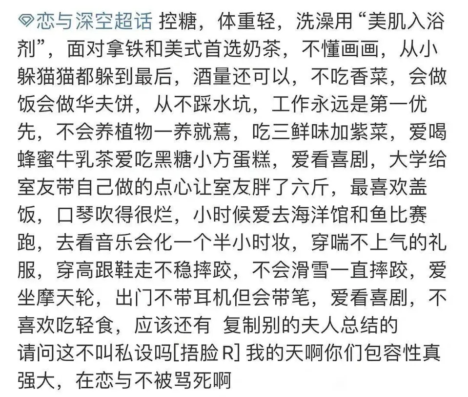

### [杂谈氵]其实我一开始觉得有男不玩没什么意义的

Made by ngapost2md (c) ludoux [GitHub Repo](https://github.com/ludoux/ngapost2md)

----

##### 0.[8] \<pid:0\> 2024-01-29 15:04:01 by 道格努尔
如题，我一开始觉得圣言录只是手综部分麻辣仙人在两次赛博割地后又一次发癫，仅此而已，毕竟字面意义上的有男不玩太极端了，比第二次赛博割地的删除女自机还抽象，不说别的，我现在摸鱼偷偷玩的杀戮尖塔初始人物就是男的，甚至手综指定神游妮基都有几个塑造很好的男npc，真有男不玩就没几个游戏剩下了，这是我对圣言录第一阶段的认识，只停留在字面认识上，我相信大部分不混手综的人也基本就这个态度
接着是第二阶段，明朝和白荆回廊的社管/学长跑过来被破防以及在此时发生的举报某游戏事件，此时因为有男不玩到处刷，所以有人解释了有男不玩的真正含义，也就是你的有男不玩≠我的有男不玩，所以有男不玩其实是成为了手综的一个实际上没什么特定意义的暗号，这表示的意思只是，我对某游戏不看好，不感兴趣，因此我不想玩，但对外人来看就是单纯的字面意义了，此时我认为有男不玩其实还是有一定正面意义的，起码引起了对某游戏的举报，而且确实能让几个游戏的社管/学长破防，虽然我还是对圣言录没什么兴趣
接着就是紧张刺激的第三阶段，有男不练这个其实是很久前就有的玩法了，纯女队/纯男队真不是什么少见的事儿，我以前也这么做过(虽然后来还是屈服于游戏体验了)，不过这不重要，重要的是，有人被连字面意义上远比有男不玩轻的多的有男不练破防了，只能说非常有趣，圣言录还真挺有用的

至于我的成分，真要算的话对万国宣战书我起码有七八个称号，而隔壁几位挂的O笑话我相信大家已经评鉴的够多了，此处让我用皱皮的身份给大家看个棉花的乐子
[url](https://ngabbs.com/read.php?tid=39091911)
这个帖子大概就能说明为什么有人会破防了

----

##### 1.[9] \<pid:740431405\> 2024-01-29 15:11:01 by 咸鱼二十九号
觉得有男不玩只是用来破xxn防的....确实没什么意义哈

----

##### 2.[6] \<pid:740431843\> 2024-01-29 15:12:57 by 762pkm
有男不玩很极端吗？

----

##### 3.[4] \<pid:740432992\> 2024-01-29 15:18:14 by Bogration_2
你要理解，粥解喷你只是因为你揭了她们结了四五年晶、孝顺上供依然只能从钟骑翔匪帮那勉强维持一个婢妾般的内容供给的老伤疤而已，为了忘却这种痛苦还不是只能从宅男哥那一刻不停地找茬骗自己，什么萝莉什么汝窑都是找茬借口而已

----

##### 4.[2] \<pid:740433074\> 2024-01-29 15:18:35 by 绝望之诗
其实就是不玩的理由多了，你说一大堆说烦了对面还打滚，少前2也全女不妨碍他垃圾啊，虽然我玩的手游都有男但是提出这个口号的时候我就理解意思了，真的想不通到底为什么能破这么大范围的防，难道真有这么多人喜欢管别人闲事？还是说对商家比他爹还孝，看见收益要少了就开始急？

----

##### 5.[0] \<pid:740433291\> 2024-01-29 15:19:42 by Zhaozige
我一开始也觉得这口号有点der，但真没想到能这么大面积的破防，毕竟这口号好像都没走出手粽就这么大威力了

----

##### 6.[0] \<pid:740433405\> 2024-01-29 15:20:15 by ljn23500
>[jump](#pid740431843) 762pkm(2024-01-29 15:12) 说: 
>
>有男不玩很极端吗？

不极端啊…个人爱好而已，无非是增加自己游玩难度而已，比如我玩博得之门3，就弄了队纯女队，也没去追求啥最大化加点，依然玩的非常开心
应该说，好游戏怎么玩都可以

----

##### 7.[0] \<pid:740433428\> 2024-01-29 15:20:20 by futurewqx
你的有男不玩≠我的有男不玩，说是自由心证，事实上就是允许了双重标准的存在。我真不认为这种定义暧昧的东西能当什么指导思想用。

有男不玩当当团结群众的口号也就算了，结果有人把它当成了庆祝胜利的香槟，好像破防了几个xxn就已经赢了一样。厂商可不管这些，一边嘴上喊着有男不玩一边还在爆米，那么所谓的有男不玩也就是杂音罢了

----

##### 8.[0] \<pid:740433439\> 2024-01-29 15:20:22 by UID3244105
昨天有人说有男不玩是圈地，我寻思圈地明明是女拳那种对宅男审美指指点点搞“高级审美”、一切男性审美我女拳说了算，这才叫圈地。有男不玩意味着放弃和跑路，跑路还能圈地？
<b>是不玩极端，还是看到别人不玩就觉得别人极端的思维极端？</b>
有男不玩和不吃香菜一样有啥极端的。

----

##### 9.[0] \<pid:740433493\> 2024-01-29 15:20:39 by 帝辛子受
注意：亚空间中的魅魅魍魉畏惧与祂的伟力，便化作似人的形体，用那黑暗大能赋予的尖牙利嘴试图定义篡改那圣言，却在忠于自身信念的人面前不得寸进。<b>不要解释圣言，自己清楚内心明白就行</b>
而此刻暗潮怒涨，似要吞没万物，关城倾塌，死亡遍布银河，在这危难关头，帷幕震荡，祂的话语响彻所有怀有信念者的耳边<b>“你和你的钱包都有自己的生活”“你所坚持的一切，值得你有更好的体验”</b>

----

##### 10.[2] \<pid:740433964\> 2024-01-29 15:22:41 by 762pkm
>[jump](#pid740433405) ljn23500(2024-01-29 15:20):

你看一下主楼，原话是&quot;毕竟字面意义上的有男不玩太极端了&quot;。

----

##### 11.[2] \<pid:740434412\> 2024-01-29 15:24:44 by Asahi丶Minato
很极端吗，看来是没见过更极端的我一开始听这话都觉得说这话还不够极端，过于保守了

----

##### 12.[0] \<pid:740434703\> 2024-01-29 15:26:00 by 奇妙的后缀
我记得这个一开始还有个不等式啊，有男不玩≠有男不玩。
主打一个自由心证，我想玩就玩，不想玩就有男不玩。感觉不极端，我看挺好的。

----

##### 13.[0] \<pid:740434917\> 2024-01-29 15:27:01 by 己顾杜壬魏张
>[jump](#pid740433074) 绝望之诗(2024-01-29 15:18) 说: 
>
>其实就是不玩的理由多了，你说一大堆说烦了对面还打滚，少前2也全女不妨碍他垃圾啊，虽然我玩的手游都有男但是提出这个口号的时候我就理解意思了，真的想不通到底为什么能破这么大范围的防，难道真有这么多人喜欢管别人闲事？还是说对商家比他爹还孝，看见收益要少了就开始急？

想了想，用一句话概括大概是男角色孝子。

----

##### 14.[0] \<pid:740435032\> 2024-01-29 15:27:33 by 帝辛子受
>[jump](#pid740434412) Asahi丶Minato(2024-01-29 15:24):

越保守越容易大规模执行，越容易取得成果，之前也有激进的觉得我发言太保守了，所以攻击我的，事实就是保守措施可以一步一步来，但是激进措施容易遭到大规模反对

----

##### 15.[2] \<pid:740435288\> 2024-01-29 15:28:58 by 叶楼坛浩
我也很奇怪，这口号的极端度还不如以前网文的全处全收

结果一看反应，好家伙

----

##### 16.[0] \<pid:740435401\> 2024-01-29 15:29:31 by 火前流明
>[jump](#pid740433405) ljn23500(2024-01-29 15:20) 说: 
>
>不极端啊…个人爱好而已，无非是增加自己游玩难度而已，比如我玩博得之门3，就弄了队纯女队，也没去追求啥最大化加点，依然玩的非常开心
>应该说，好游戏怎么玩都可以

有男不玩其实性质上来说类似于不玩跑团，不玩fps这种，都是某一种类不玩

----

##### 17.[0] \<pid:740435916\> 2024-01-29 15:32:12 by Asahi丶Minato
>[jump](#pid740435032) 帝辛子受(2024-01-29 15:27) 说: 
>
>越保守越容易大规模执行，越容易取得成果，之前也有激进的觉得我发言太保守了，所以攻击我的，事实就是保守措施可以一步一步来，但是激进措施容易遭到大规模反对

我觉得这话不够极端是因为这四个字是对内作用的，类似有男不玩始终是个人的约束行为，同样是倾向一刀切，对外作用的攻击性远比对内作用大的多
只是我没想到因为这四个字，让有些团体的打击感变得这么好

----

##### 18.[0] \<pid:740436267\> 2024-01-29 15:33:50 by QQ新新
乙游已经在因为主角私设太多自己不好带入打的不可开交了，这边还有男不玩太极端了

----

##### 19.[0] \<pid:740436972\> 2024-01-29 15:36:59 by 王小乐乐lelele
>[jump](#pid740435288) 叶楼坛浩(2024-01-29 15:28) 说: 
>
>我也很奇怪，这口号的极端度还不如以前网文的全处全收
>
>结果一看反应，好家伙

因为这句口号也算是应运而生吧，原神跟少前2都因为媚女剧情收入狂跌不止，之前上Steam的ml短剧，交错跟尘白禁区最近也收入不错，就

----

##### 20.[0] \<pid:740437073\> 2024-01-29 15:37:27 by ABananas
>[jump](#pid740433439) UID3244105(2024-01-29 15:20) 说: 
>昨天有人说有男不玩是圈地，我寻思圈地明明是女拳那种对宅男审美指指点点搞“高级审美”、一切男性审美我女拳说了算，这才叫圈地。有男不玩意味着放弃和跑路，跑路还能圈地？
>......

不玩是消费者的选择权，圈地&#39;xxx不对！必须xxx这样！&#39;是指导权   

----

##### 21.[0] \<pid:740437092\> 2024-01-29 15:37:33 by 少封号多积德
有意义啊

这个口号是从消费者玩家自己角度出发的

内容是啥不重要 重要的 是“我”自己做决定

----

##### 22.[0] \<pid:740437789\> 2024-01-29 15:40:42 by 热舞老司机
>[jump](#pid740433428) futurewqx(2024-01-29 15:20) 说: 
>
>你的有男不玩≠我的有男不玩，说是自由心证，事实上就是允许了双重标准的存在。我真不认为这种定义暧昧的东西能当什么指导思想用。
>
>有男不玩当当团结群众的口号也就算了，结果有人把它当成了庆祝胜利的香槟，好像破防了几个xxn就已经赢了一样。厂商可不管这些，一边嘴上喊着有男不玩一边还在爆米，那么所谓的有男不玩也就是杂音罢了

你猜到底是不是杂音呢

----

##### 23.[0] \<pid:740448414\> 2024-01-29 16:28:53 by azae
我15年就有男不玩，fgo只看过几集动漫游戏至今没入坑

----

##### 24.[0] \<pid:740453603\> 2024-01-29 16:52:07 by 黛朵的悲歌
以当下论坛气氛来讲，有男不玩大概很快就会变成“有男的，你们不许玩”了，也可以进一步滑坡成你玩***有男的，你就是**的帽子大赛。
产生联系有时候并不需要有直接或者间接关系

----

##### 25.[0] \<pid:740454669\> 2024-01-29 16:57:07 by VVVVBBS
>[jump](#pid740453603) 黛朵的悲歌(2024-01-29 16:52):

在这个口号出的第一天你说的这种帖子充斥着整个版面

没什么意义，当人发现钱包在自己身上的时候
随便你怎么解构，因为发觉这一点的人，会自动的认识到所有来解构的人
不是给厂家尽孝的孝子就是社管，4000+就是他们唯一想说的话。

----

##### 26.[0] \<pid:740457115\> 2024-01-29 17:09:04 by 869isjOvcUZ
太长不看，反正我从14年就坚持国内不玩了

----

##### 27.[0] \<pid:740457307\> 2024-01-29 17:10:03 by 灵光sama
>[jump](#pid740433074) 绝望之诗(2024-01-29 15:18):

 但是会影响刚来的...影响跟风蝗一波的那种..

----

##### 28.[0] \<pid:740458064\> 2024-01-29 17:13:40 by 灵光sama
>[jump](#pid740436267) QQ新新(2024-01-29 15:33):

 震惊!

----

##### 29.[0] \<pid:740458390\> 2024-01-29 17:15:08 by dr_k
我本人一直认为论娇妻程度米家仙女真的不如粥姐一根毛，毕竟米家当娇妻刘伟真给你出奶窗男，但粥姐冲再凶丫丁也不会给他们多出哪怕一个男六星

