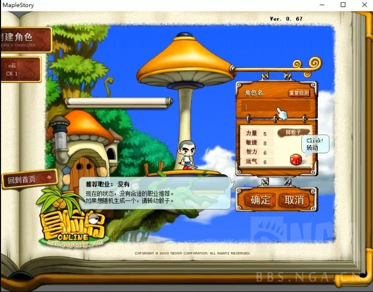
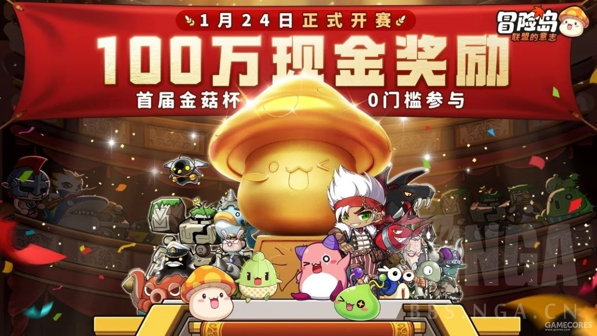

### [新闻] 爷青回，那个熟悉的冒险岛回来了

Made by ngapost2md (c) ludoux [GitHub Repo](https://github.com/ludoux/ngapost2md)

----

##### 0.[0] \<pid:0\> 2024-01-29 15:18:36 by PolygonPanda
二十年前，随着《Start the adventure》在格兰蒂斯大陆奏响，开启的是一段属于所有《冒险岛OL》玩家的神秘冒险旅程，港口边的和煦海风，森林中的耀眼阳光，遗迹中的危险敌人，地牢深处的诱人宝藏......
我们都曾怀念那个2004年的夏天，卡通风格的《冒险岛OL》，带来了无数玩家有着瑰丽色彩的童年奇幻冒险，随后《冒险岛OL》经历了漫长的版本更新。而在最近，冒险岛也重焕新生。

<b>二十年前的经典回忆，《冒险岛OL》的慢与生活</b>
最早登岛的那批朋友，可能还记得蓝蜗牛、蘑菇仔和绿水灵，彼时风之大陆和光之大陆等后来被人熟知的专区还没有出现，创建角色的时候要玩家还需要通过摇骰子来得到随机四维属性，为了极品属性，我们甚至可以摇一天。
在其背后，是《冒险岛》一种和其他游戏截然不同的气质，那就是它提供了一种MMO中难得一见的“慢生活”。
《冒险岛OL》的地图庞大且复杂，由于区域间没有快捷的传送点，玩家想要抵达某个城镇，就只能依靠步行，而野外地区路程漫长又危险重重，漫长的跋涉为玩家带来了一种旅途的体验。
加上后期每提升一级都需要花费很长的时间，和装备的低掉率，让《冒险岛》的玩家在当时就表现出了“佛系”“休闲”的特点，也让《冒险岛OL》的游戏体验真正有了“冒险”的味道。

慢生活不仅仅是节奏慢，更重要的是生活化——在20年前，《冒险岛OL》给许多第一次接触网游的玩家带来了“生活在此处”的感觉。
游戏中的自由市场总是热闹非凡，玩家可以像真实的集市那样，在个人店铺里用金币淘到不少好东西，也能聚集在店铺门口闲聊唠嗑。

开往天空之城的船每天有固定的出港时间，船从港口飞到目的地也需要时间，同船旅行因此成了不少孤立无援的冒险家结交新朋友的途径。
甚至“五子棋竞赛”——玩家在港口候船时打发时间玩的小游戏都受到了热烈的追捧。

<b>更轻松的放置玩法，更欢快的组队乐趣 </b>
作为20年后的继任者，《冒险岛：联盟的意志》首先带来的是当年冒险的热血和感动。
无论是射手村、明珠港、天空之城等经典地图，还是飞侠、弓手、战士等20种熟悉的职业，还有扎昆、贝伦、暗黑龙王等经典BOSS，你所能在这里相遇的，是一份阔别20年之久的琥珀中的时光回忆。

但另一方面，《冒险岛：联盟的意志》也带来了新时代的和煦暖风：免费挂机+自动战斗的机制让冒险家们在线时可以解放双手；随身携带最高7只宠物助力冒险，闯关刷本更加丝滑爽快；更丰富的战斗社交与休闲社交玩法，给予冒险家们更自由的社交选择……贯彻了轻松好玩的宗旨，但也让很多忙于工作和生活的朋友可以单手轻松操作，随玩随停。

此外游戏更有1v1PK赛“决斗场”、3v3旗帜争夺战“假面者派对”、跨服赛事“金银岛争霸”等诸多新玩法，以及更有个性时装搭配、家园布置等休闲玩法，在欢乐的冒险岛怀旧时光之中，也可享受来自新时代的游戏趣味。

<b>金菇杯与七宠寻宝大冒险，百万赏金等你来赢</b>
伴随着《冒险岛：联盟的意志》全平台公测的开启，游戏内的PVP顶尖赛事“金菇杯百万赏金赛”的竞逐也将正式开始！冒险家们都可以0门槛参与，在1v1PK赛“决斗场”、3v3旗帜争夺战“假面者派对”、跨服赛事“金银岛争霸”瓜分总额超过100万人民币现金的奖金池！

 
<b>时光机开启，《冒险岛：联盟的意志》带你回到旧日的冒险</b>

20年后，正版授权的《冒险岛：联盟的意志》全平台公测即将在新春之前再临，熟悉的旋律再次在耳边响起，指尖的世界演绎那温暖的回忆，在枫叶照亮的格兰蒂斯大陆，超过100万名冒险者已经完成值机登船。点击链接下载游戏[url](https://mxd.rastargame.com/ad1/nga) 让我们全服装满状态登岛，一段原汁原味的全新冒险旅程就要开启。

----

##### 1.[0] \<pid:740433247\> 2024-01-29 15:19:30 by 屑屑屑屑屑屑
一股清流

