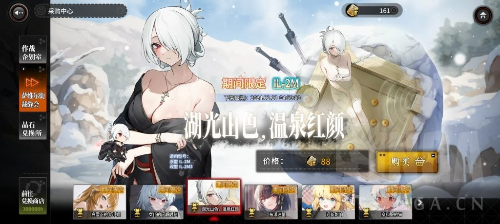
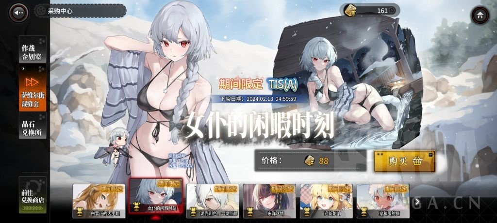
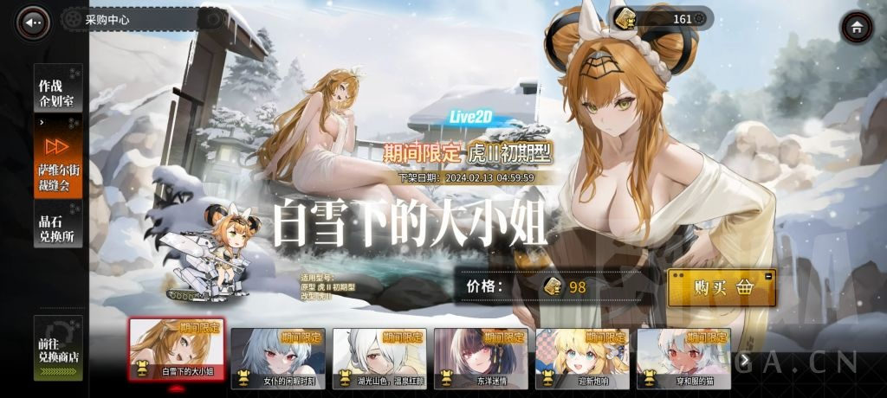

### [提问] 手综有人玩过灰烬战线么？怎么看？

Made by ngapost2md (c) ludoux [GitHub Repo](https://github.com/ludoux/ngapost2md)

----

##### 0.[0] \<pid:0\> 2024-01-29 15:32:59 by 寓观
这游戏类似二维战棋版碧蓝航线，clike，但是有些肝。

海军陆军空军什么的，好像没人提过这个混合作战的游戏。
个人观点，这个游戏生不逢时，否则按照官方的态度，不至于这么惨淡。
……好吧，有点过于惨了，sensor tower数据舰r30k，灰烬才5k不到。

按理说这么凉了，官方要么捞一笔跑路，要么停更等关服，不过，却一直在更新，包括新机制，而且不氪体验99%内容，属实看不懂。

<a href="javascript:;" onclick="collapse(this);">+</a>游戏里刚出的皮肤 ...

----

##### 1.[3] \<pid:740439902\> 2024-01-29 15:50:26 by 随机生成的id
看起来不错啊

----

##### 2.[0] \<pid:740440192\> 2024-01-29 15:51:49 by 彼养的卡丘
刚出的时候经常和少钱1比 好像     后面就没消息了

----

##### 3.[0] \<pid:740440231\> 2024-01-29 15:51:59 by 762pkm
与少前同时代的游戏，先日服后国服，国服开的很晚。

----

##### 4.[2] \<pid:740440275\> 2024-01-29 15:52:13 by 帝辛子受
我只说一点，这游戏有过雷，而且现在都没改吧

----

##### 5.[0] \<pid:740440403\> 2024-01-29 15:52:47 by 北辰琉歌
感觉国日两边都算努力的让这游戏活着(
可惜，感觉是生太晚了

----

##### 6.[0] \<pid:740440493\> 2024-01-29 15:53:14 by 汐翱
出的有些迟了，当时开服的时候蝗过两星期，好玩又不好玩玩起来有些像战旗，玩的挺累的就不想玩了，而且印象里是先有的外服才有的国服，所以才能一直更新？

----

##### 7.[0] \<pid:740440502\> 2024-01-29 15:53:17 by 绮罗愿景
换运营之前偶尔挂机扫荡
换运营之后帐号会自动登出 有时候就没热情进游戏了
送的石头很多 高稀有卡也不怎么缺 
通行证的皮肤和直购皮肤都挺好的
有点像nikke 
在手机里很久没打开了

----

##### 8.[0] \<pid:740440539\> 2024-01-29 15:53:28 by 孝子别举报了
国服开的时候 冲过36块钱好像 然后感觉还是老一套  卸载了

----

##### 9.[1] \<pid:740440686\> 2024-01-29 15:53:58 by 莫洛AAA
玩过，曾经想拿来当B的替代品，但感觉战斗系统太复杂了，玩了一阵就放弃了。

----

##### 10.[2] \<pid:740440701\> 2024-01-29 15:54:02 by CourierSix
我在玩
全女，而且确实有涩涩
主角在主线中的待遇也很好，举个例子的话大概是拿破仑那样的战争英雄，被解除职务之后还能煽动叛乱，镇压的士兵见到主角直接倒戈了
说完了优点说说缺点
以前有卖百合的前科，虽然后续明着卖百合的那对设定成分手(据说)，另一对不明确卖的被拆掉了卖ml
前期主线，也就是四境剧情谜语人而且并不优秀，优秀的剧情要到大后期的红帷幕

----

##### 11.[0] \<pid:740440826\> 2024-01-29 15:54:38 by 94646843z
外服不是抽卡抽角色么？国服还没开的时候玩外服那抽卡又扣又黑，这也算clike？

----

##### 12.[0] \<pid:740440829\> 2024-01-29 15:54:39 by RavenFubuki
这个卡过版号几年，之前是靠日服流水撑着的

----

##### 13.[0] \<pid:740440881\> 2024-01-29 15:54:54 by 谁知道是第几个号了
这些blike(甚至都不叫clike)的游戏要想明白一个问题，

如今是公“原”5年了，玩家为什么要来玩你的游戏，我游戏的优势在哪里，目标客户长什么样

----

##### 14.[0] \<pid:740441085\> 2024-01-29 15:55:54 by CourierSix
>[jump](#pid740440826) 94646843z(2024-01-29 15:54) 说: 
>
>外服不是抽卡抽角色么？国服还没开的时候玩外服那抽卡又扣又黑，这也算clike？

国服送的还挺多，玩的久的是不缺资源的
日服什么情况不清楚

----

##### 15.[0] \<pid:740441100\> 2024-01-29 15:55:57 by 逝者森林
不是，这些流水数据本身就图一乐啊，平时吹逼也就行了，真信不是被二观当傻子了。
就我了解的这两家公司人数，真要这个流水每个月工资每人平均1w工资(管理层远高于1w，有些岗位在8000-1w)都发不出来，这还不算年终和约稿等开支呢。

----

##### 16.[0] \<pid:740441295\> 2024-01-29 15:56:53 by VanDarg
我印象比较深的是，这游戏的好感度好像有些是从负的开始的)

0好感形同陌路甚至还有点疏远，满好感就像柚子社进了个人线的角色一样变成没有男主(玩家)的OO就活不下去的废人

↑以上是道听途说的

开局好像是自带无限重置？当时挂脚本跑了一晚上没跑出来设置好的开局，愤而跑路

----

##### 17.[0] \<pid:740441676\> 2024-01-29 15:58:46 by CourierSix
>[jump](#pid740441295) VanDarg(2024-01-29 15:56) 说: 
>
>我印象比较深的是，这游戏的好感度好像有些是从负的开始的)
>
>0好感形同陌路甚至还有点疏远，满好感就像柚子社进了个人线的角色一样变成没有男主(玩家)的OO就活不下去的废人
>
>↑以上是道听途说的
>
>开局好像是自带无限重置？当时挂脚本跑了一晚上没跑出来设置好的开局，愤而跑路

嗯，具体来说的话零好感的特殊触碰语音一般是被陌生人性骚扰的回应
满好感是离确定关系只差临门一脚
送戒指结婚之后一般会暗示上垒

----

##### 18.[1] \<pid:740442063\> 2024-01-29 16:00:30 by 王子和玉
没海军，陆军也只有载具什么的。日服玩了半年放弃了，国服从开服玩到现在。
主要问题还是好玩，但不一直好玩，游戏难度和乐趣都有，但是养成拿资源之类的什么的太花时间了，而且一直也不优化，开服的时候什么样，现在还是什么样。
现在皮肤质量上来了，可以走传统c类游戏卖皮肤赚钱(而且大部分是礼包值购相当舒服)以前有事现作画崩坏，没事裹得太严实了一点东西都看不到，的时候才是真的凉。
有耐心深入玩的话，当做副游体验还是不错的。

----

##### 19.[0] \<pid:740442575\> 2024-01-29 16:02:53 by 嘻嘻哈哈1992
这游戏开服玩过，当时还和局座合作直播来着

----

##### 20.[0] \<pid:740442695\> 2024-01-29 16:03:25 by 帝辛子受
>[jump](#pid740442063) 王子和玉(2024-01-29 16:00):

我曹，牢玉，你放出来啦！

----

##### 21.[0] \<pid:740442970\> 2024-01-29 16:04:28 by RavenFubuki
>[jump](#pid740440881) 谁知道是第几个号了(2024-01-29 15:54) 说: 
>
>这些blike(甚至都不叫clike)的游戏要想明白一个问题，
>
>如今是公“原”5年了，玩家为什么要来玩你的游戏，我游戏的优势在哪里，目标客户长什么样

这游戏立项是公原前四年了，怎么跨时空策划呢

----

##### 22.[0] \<pid:740443076\> 2024-01-29 16:04:53 by 平原兆力使
这游戏我已经被贴吧骗进去玩过。说有百合，然后贴吧那边就乱战。一边说没有百合，另一边说谁不喜欢看两个妹子磨豆腐的。还有一个说是你不乐意？
接下来我那时看大部分都说有白但都喜欢主角的。结果一周年情人节是百合，二周年也是百合。喜欢我一朵紫罗兰大于九十九朵玫瑰吗？
哦，99朵玫瑰是一个女孩子送给另一个女孩子的

----

##### 23.[0] \<pid:740443095\> 2024-01-29 16:04:58 by Shanger5124
这游戏怕找回吗，想买个号试试

----

##### 24.[2] \<pid:740443867\> 2024-01-29 16:08:24 by 寓观
>[jump](#pid740443095) Shanger5124(2024-01-29 16:04):

应该不会吧，不过这游戏上手难度高，比较肝

补充一下，如果是石头号，完全没必要。这游戏福利比较好，我退坑后，如果想du博了，就把这游戏下回来抽，抽了8、9个限定都没用完一半的石头。

如果是成品号，更没必要了，因为会被复杂的系统直接绕晕，碰上一些机制怪，就只能去b站抄作业

----

##### 25.[1] \<pid:740444017\> 2024-01-29 16:09:02 by CourierSix
>[jump](#pid740443095) Shanger5124(2024-01-29 16:04) 说: 
>
>这游戏怕找回吗，想买个号试试

买号的体验大概介于好与坏之间
一方面这游戏最好的游戏体验就是开荒时利用自己有限的box和材料想出解法
另一方面最差的游戏体验也是因为开荒时练错角色被卡关，直到材料足够把对策卡练起来
如果买主线全通的号的话，剩下的玩法就只剩刷材料和等活动开了打高难了

----

##### 26.[0] \<pid:740445547\> 2024-01-29 16:16:04 by bloodse
玩过很长一段时间，肝度其实不高，卡隔日结算每天摆烂扫荡20次战令都能大幅溢出，周末还有双倍进度结算，剩下也就打看三次材料本的录像，随便给妹子塞4个礼物就把日常全做完了。
强度焦虑基本没有，前期自选雨燕，再捞个br5，直接平推大部分图。
养成方面也轻松，抽卡完全不需要命座，升星道具很容易获取，只要肯收菜，整一页满破轻轻松松。后面开了阿滋斑石养成，让一些低星卡更的战斗力接飞升，强化力度相当离谱
皮肤一般吧，色度够，但那动态技术真的不太行
然后剧情也挺乐的，熬过前5章的莫名其妙后，整体就开始朝气突苏的方向高歌猛进，这么红的剧情我第一次在手游里见到
到2周年前后质量就下去了了，估计是文案换人，味不正了

----

##### 27.[0] \<pid:740446159\> 2024-01-29 16:19:02 by CourierSix
>[jump](#pid740445547) bloodse(2024-01-29 16:16) 说: 
>
>玩过很长一段时间，肝度其实不高，卡隔日结算每天摆烂扫荡20次战令都能大幅溢出，周末还有双倍进度结算，剩下也就打看三次材料本的录像，随便给妹子塞4个礼物就把日常全做完了。
>强度焦虑基本没有，前期自选雨燕，再捞个br5，直接平推大部分图。
>养成方面也轻松，抽卡完全不需要命座，升星道具很容易获取，只要肯收菜，整一页满破轻轻松松。后面开了阿滋斑石养成，让一些低星卡更的战斗力接飞升，强化力度相当离谱
>皮肤一般吧，色度够，但那动态技术真的不太行
>然后剧情也挺乐的，熬过前5章

红帷幕的剧情是真的……夸张
我之前都没想过手游能有这种剧情，要不是红帷幕我可能早就退坑了
最近的活动好像又换文案了，不过走的是欢乐玩梗的路线，neta了一大堆游戏和动漫的梗，还转向卖ml了

----

##### 28.[0] \<pid:740446453\> 2024-01-29 16:20:23 by ch65771955
公测蝗了下只能说要啥没啥的程度，你除非放在CLIKE盛行的时代要不放在哪都属于平庸那一档的。

----

##### 29.[0] \<pid:740446664\> 2024-01-29 16:21:22 by ズルくてすごい
灰宝的游戏机制实在是太有意思了……真的很难见到这么有趣的原创玩法(问了很多人都说没见过这种玩法)在现在玩法方面基本大摆烂的二游市场很清流 个人觉得游戏性在二游里是第一档的级别的 当然难度也是真的高 开服玩家当时推主线真的是一关以小时为单位地凹
一周年的时候还给满级玩家送了周边大套装，雨伞鼠标垫文件夹什么的加一起估计市值得一百往上，联动水月雨的耳机价格没比原版高多少但是送了一大堆多的东西，包括色纸还有耳机套什么的，而且质量都特别好，用了很久直到现在还在用，总之我肯定会玩到灰宝关服的。。。

----

##### 30.[0] \<pid:740447003\> 2024-01-29 16:22:53 by 彼养的卡丘
>[jump](#pid740440231) 762pkm(2024-01-29 15:51):

这是和云图同时代的吧

----

##### 31.[0] \<pid:740447411\> 2024-01-29 16:24:42 by CourierSix
>[jump](#pid740446664) ズルくてすごい(2024-01-29 16:21) 说: 
>
>灰宝的游戏机制实在是太有意思了……真的很难见到怎么有趣的原创玩法(问了很多人都说没见过这种玩法)在现在玩法方面基本大摆烂的二游市场很清流 当然难度也是真的高 开服玩家当时推主线真的是一关小时为单位地凹

我还记得刚开服的时候不少人遇上茧子被即死秒杀了就直接退游了
开服的时候没有委托也没有代理，自动战斗更是蠢的离谱，那时候是真的玩不下去，后面再回去的时候标记和br5改了，可以一回合内上标+清图，这才继续玩下去

----

##### 32.[0] \<pid:740447671\> 2024-01-29 16:25:50 by 罗马之花mkⅡ
>[jump](#pid740441295) VanDarg(2024-01-29 15:56) 说: 
>
>我印象比较深的是，这游戏的好感度好像有些是从负的开始的)
>
>0好感形同陌路甚至还有点疏远，满好感就像柚子社进了个人线的角色一样变成没有男主(玩家)的OO就活不下去的废人
>
>↑以上是道听途说的
>
>开局好像是自带无限重置？当时挂脚本跑了一晚上没跑出来设置好的开局，愤而跑路

好感是战国兰斯那边借的，刚抓到的就是险恶

----

##### 33.[0] \<pid:740447724\> 2024-01-29 16:26:01 by ズルくてすごい
>[jump](#pid740447411) CourierSix(2024-01-29 16:24) 说: 
>
>我还记得刚开服的时候不少人遇上茧子被即死秒杀了就直接退游了
>开服的时候没有委托也没有代理，自动战斗更是蠢的离谱，那时候是真的玩不下去，后面再回去的时候标记和br5改了，可以一回合内上标+清图，这才继续玩下去

可不是。。。当时攻略还少，开服那会我甚至研究了几个小时打过去之后自己出了好几个攻略。。。。。

----

##### 34.[0] \<pid:740448280\> 2024-01-29 16:28:15 by CourierSix
>[jump](#pid740447724) ズルくてすごい(2024-01-29 16:26) 说: 
>
>可不是。。。当时攻略还少，开服那会我甚至研究了几个小时打过去之后自己出了好几个攻略。。。。。

可惜的是之前的muv和彩虹联动那会没怎么玩，联动没拿到，也不知道以后会不会复刻

----

##### 35.[0] \<pid:740448505\> 2024-01-29 16:29:18 by adglmnox
目前在玩，个人观点
皮肤立绘还行，有些还挺色的。不过有点参差不齐，小作坊。
游戏玩法是有的，就是有点复杂。看个人喜好了。
还有这游戏没扫荡，挺多玩法方面的不是很适合现在游戏的节奏。

