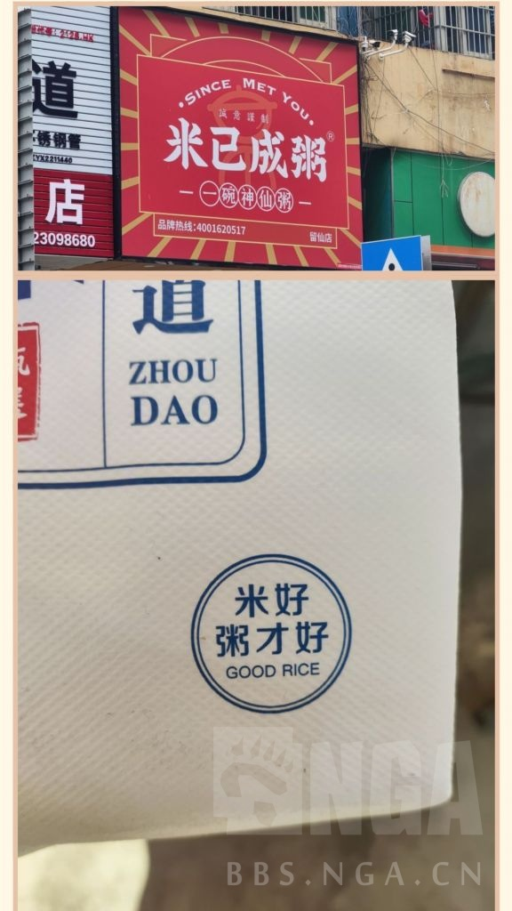

### [破事氵] 想熬出好喝的粥，就得选用优质的米

Made by ngapost2md (c) ludoux [GitHub Repo](https://github.com/ludoux/ngapost2md)

----

##### 0.[27] \<pid:0\> 2024-01-29 16:34:49 by 世末的歌者
身心俱疲了，来聊点健康传统美食
无米不成粥，米粥99，我永远喜欢喝小米粥

----

##### 1.[2] \<pid:740450354\> 2024-01-29 16:37:44 by 鬼岛巨人一米四
那这俩谁是嫡皇帝，谁是庶皇帝

----

##### 2.[8] \<pid:740450431\> 2024-01-29 16:38:06 by yaoguanh
米已成粥米已成粥

----

##### 3.[1] \<pid:740450721\> 2024-01-29 16:39:23 by csood211
根本难不倒他，简直就是天才

----

##### 4.[0] \<pid:740450764\> 2024-01-29 16:39:34 by 因果交流电波
一个是凯撒，一个是奥古斯都

----

##### 6.[0] \<pid:740451923\> 2024-01-29 16:44:42 by 顺劈带暴击
坏了
米已成粥→木已成粥→污渍
dna已经混乱了哼啊啊啊啊啊啊

