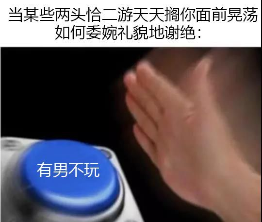
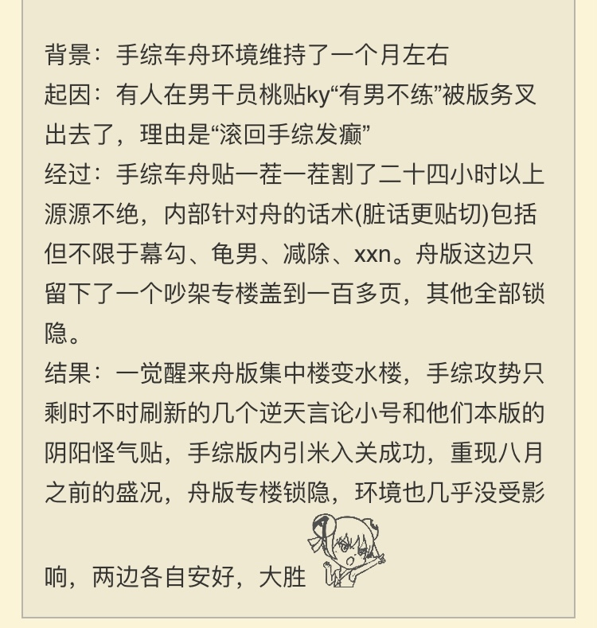

### [杂谈氵] 总结一下这次事件吧

Made by ngapost2md (c) ludoux [GitHub Repo](https://github.com/ludoux/ngapost2md)

----

##### 0.[0] \<pid:0\> 2024-01-29 16:42:47 by 吠瑠璃の炎落ち
1.“有男不玩”的目的是为了明确自己的诉求，“有男不玩”的口号是为了最大化凝聚起共识，决定这个口号胜利与否的，不是嘴仗上打赢了哪个群体，也不是占领了哪些板面，而是有多少潜在的朋友觉醒了。越是有人反对，越是有利于这句口号的传播。

2.赛博割头皮并不是真正的割头皮，岁月史书也变不成世界树，事实上最后决定捂好钱包的人不会因此就回去继续转移支付，反而更加坚定；而不管再怎么岁，该支持的也会支持，想龟的再怎么说都没用。

3.速胜论总是会滑向投降主义，现状一时半会虽然不会马上彻底改变，但是，愿意明确目标群体讨好受众的，比以前取得了更高的商业成果；继续转移支付恶心玩家的，被人唾弃，这也是看得见的事实，成果自然有市场来体现。太阳当然不是手综的有男不玩叫出来的，但手综显然是日出的征兆之一。

4.还是我一开始的说法，一边虽然受了气，但是认清楚了我是谁、敌人是谁，这是好事；另一边打赢了嘴仗，但是朋友并没有变多，在厂商那里的话语权也没有变大，还失去了受害者这层甲。从达成目的看，到底是谁赢了呢？

----

##### 1.[14] \<pid:740452949\> 2024-01-29 16:49:13 by hudhdk
太长不看但是

----

##### 2.[1] \<pid:740454337\> 2024-01-29 16:55:34 by 咸鱼二十九号
我记得有位老哥说的不错，大概是

有男不玩这个口号让你解放身心摆脱规训，真正掌握住自己的钱包那一刻就已经达到属于个人上的完全胜利了。

如果让自己做不到身心完全爽快，那就不玩手游呗，手游不行还有单机，单机不行就多出去走走。宅男的还有小说漫画动漫大把东西。

现在复读口号是为了调戏社管，看他们花样破防还解构不了只能嘬回麻辣仙人的样子真的很可笑

----

##### 3.[4] \<pid:740454834\> 2024-01-29 16:57:53 by 我是社管有男不玩
意义就是4你也就敢在手综发

----

##### 4.[0] \<pid:740454962\> 2024-01-29 16:58:30 by wmysh1627
权限狗想删帖就删呗 想封就封呗
就敢玩点这下三滥

----

##### 5.[0] \<pid:740455171\> 2024-01-29 16:59:28 by 己顾杜壬魏张
粥版藓女会说只要楠铜安科更新了，一切都会好起来的。

----

##### 6.[0] \<pid:740468537\> 2024-01-29 18:05:26 by 缩小帽设定是神
总结：袁世凯闹麻了

----

##### 7.[2] \<pid:740469080\> 2024-01-29 18:08:02 by Schachleo
来看看某版是怎么总结的吧

