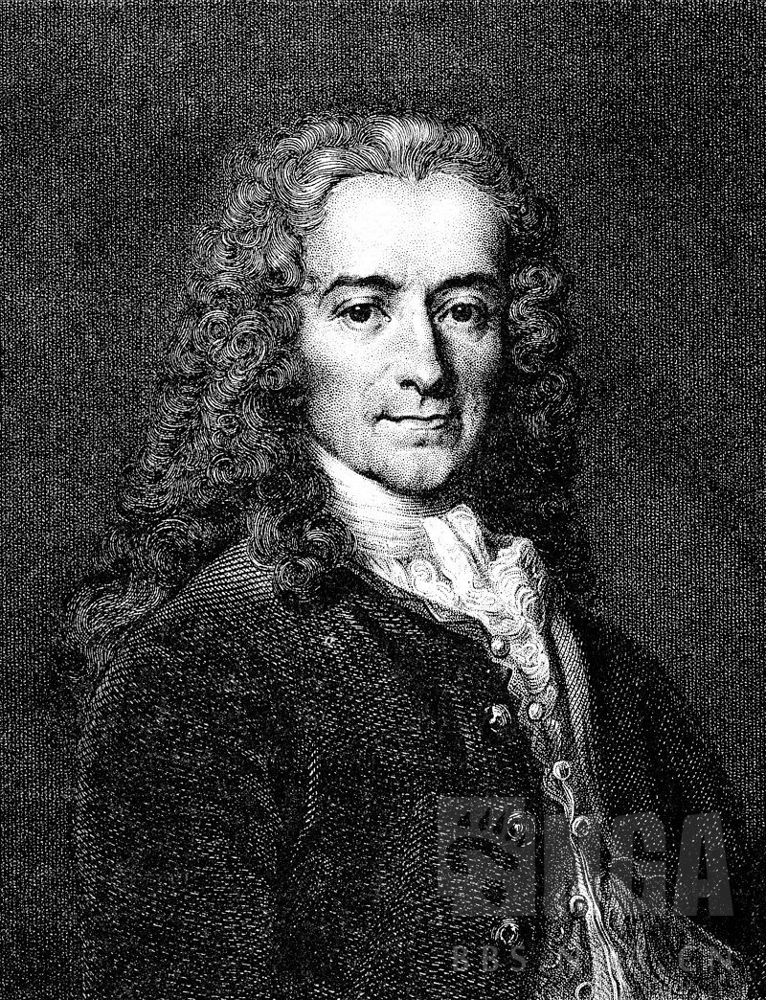

### [破事氵] 想起了伏尔泰的一句名言

Made by ngapost2md (c) ludoux [GitHub Repo](https://github.com/ludoux/ngapost2md)

----

##### 0.[0] \<pid:0\> 2024-01-29 16:59:55 by 大卫伟德恩

<b>假如你想知道是谁控制了你，那就看看谁是你不能批评的人。</b>
To learn who rules over you, simply find out who you are not allowed to criticize.
                                                                                     ---------------伏尔泰(出自Kevin Alfred Strom)

