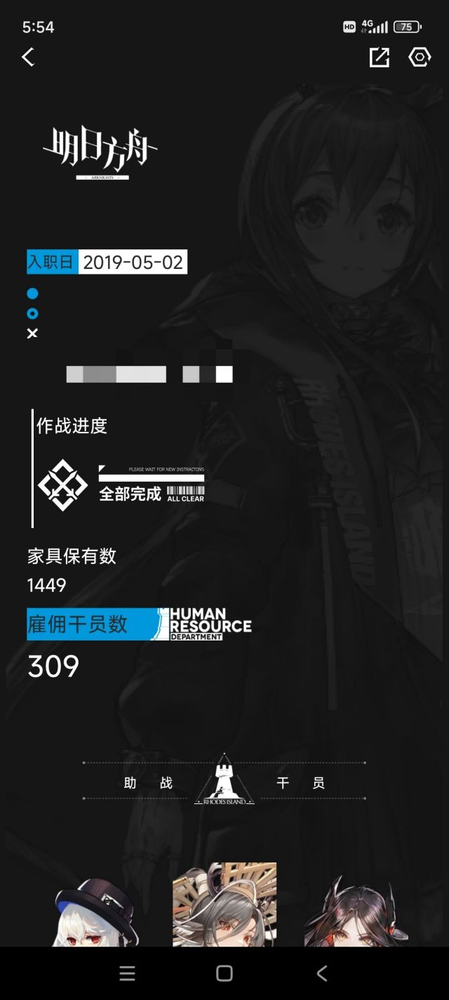

### [破事氵]原来真有方舟玩家只知道所谓的大静谧不知道圣子降临的

Made by ngapost2md (c) ludoux [GitHub Repo](https://github.com/ludoux/ngapost2md)

----

##### 0.[7] \<pid:0\> 2024-01-29 18:11:31 by 问笔轩※主

方舟开服玩家，截图和发帖记录为证。
开服那段时间粥版的舆论环境完全是被厂商孝子统治的，说不得一点yj的坏话，直到年池才好一些。
圣子降临当晚正巧在现场，然后被禁言。后来因为骂yj又被禁言一次，再之后就很少去粥版了。

所以这次棉花事件我是一点也不意外，因为作为一名方舟玩家，我是真被割过头皮。全版冲水，很壮观吧

----

##### 1.[0] \<pid:740470362\> 2024-01-29 18:14:07 by sadudas
我就是只知道大静谧不知道圣子降临的，因为我直到19年10月才开始看b站官号，20年才开始看NGA舟版。
倒是没觉得这很不正常。

