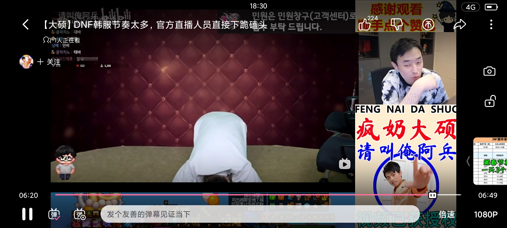

### [破事氵]什么才是有诚意的道歉？

Made by ngapost2md (c) ludoux [GitHub Repo](https://github.com/ludoux/ngapost2md)

----

##### 0.[5] \<pid:0\> 2024-01-29 18:23:11 by 机巧704
我很喜欢如龙系列的剧情，因为里面一个核心思想，就是人做错了事情，光道歉是没用的，需要“给个交代”
久濑大作的交代，是切掉了自己的小拇指，因为他随意将桐生开除，又没打过桐生。
真岛吾朗的交代，是他费尽心思重回东城会，等他兄弟出狱，对自己的食言复仇，虽然错不在真岛身上。
桐生一马的交代，是自己主动进监狱关了4年，为了给养女一个清白的背景
海藤正治的交代，是被组里开除，尽管丢钱的事，是被陷害的

总之，无论是有心还是无心的过失，都必须用相应的代价去弥补，而不是一句简单的道歉就可以解决的

----

##### 2.[9] \<pid:740472771\> 2024-01-29 18:26:29 by E_FrostBlade
我怀疑你在公鸡伴舞

----

##### 3.[2] \<pid:740472839\> 2024-01-29 18:26:46 by 有男不玩，是米不碰
问题阐述→解决方案→赔偿标准→事后保证。
初中生都会写

----

##### 4.[3] \<pid:740473000\> 2024-01-29 18:27:38 by 机巧704
>[jump](#pid740472629) LadyLex睡觉滚下床(2024-01-29 18:25) 说: 
>
>要么有明确的补偿，要么有明确的惩罚

别说补偿了，整篇文章甚至都没说具体哪里错了，全都归结到沟通问题

----

##### 5.[0] \<pid:740473036\> 2024-01-29 18:27:50 by dtvjde
要么切手指，要么鞠个躬，干脆点就跪一个吧

----

##### 6.[0] \<pid:740473128\> 2024-01-29 18:28:19 by 关注无限机兵喵
你可以效仿当年的冯骥
冯骥当年怎么做的你再做一遍就行

----

##### 8.[1] \<pid:740473288\> 2024-01-29 18:29:06 by 寒风彻夜
你不会觉得羽中能干出爷们事吧，能干出就不会点赞女拳了。

----

##### 9.[0] \<pid:740473490\> 2024-01-29 18:30:06 by 腾米暴易任索软
道歉就是95出皮肤了，龟龟们速买

----

##### 10.[3] \<pid:740473678\> 2024-01-29 18:31:00 by 咕咕咕咕咕咕丶丶

----

##### 11.[1] \<pid:740473882\> 2024-01-29 18:32:07 by saluttunny
都这时候了 不痛不痒的道歉没意义了 要是羽中出来给大伙磕几个 也许还有点用

----

##### 12.[0] \<pid:740473958\> 2024-01-29 18:32:32 by aisqgl
道歉？少前1出二手烟皮肤了，龟龟快充钱，不要不识好歹

----

##### 13.[0] \<pid:740475886\> 2024-01-29 18:42:29 by 932661769A
羽中从一代开始就突出一个如滑，压根看不见诚意，我甚至有种错觉就是他的滑轨是为了配合云卫兵发动反攻，一旦他滑了，云卫兵就硬气了，又可以开始吹逆风超神了。
一代大破和谐，全服发一千钻就是例子。说的难听点，他这一千钻投进皮肤池里只能出一堆时尚小垃圾，这一千钻不仅起不到安抚氪佬的作用，还给了云卫兵反攻倒算的底气。氪佬本身还在玩这游戏是图啥，不就是你皮肤吗。结果现在大破没了，氪佬上论坛想多冲点补偿，结果被一堆白嫖云卫兵追着骂喂不饱的狼，好了，两头受气，氪佬也不全是包子，游戏一卸载直接再见。接着就是流水腰斩，越来越烂，烂到现在一年一个活动憋不出。不知道这种时候硬气的云卫兵还能不能说话。哦现在他们会说少前1太良心了，骗氪都不会骗。
希望散爆接着硬气下去，一代套了小几千块在里面就当给羽中买赛博骨灰盒了，二代再接再历

