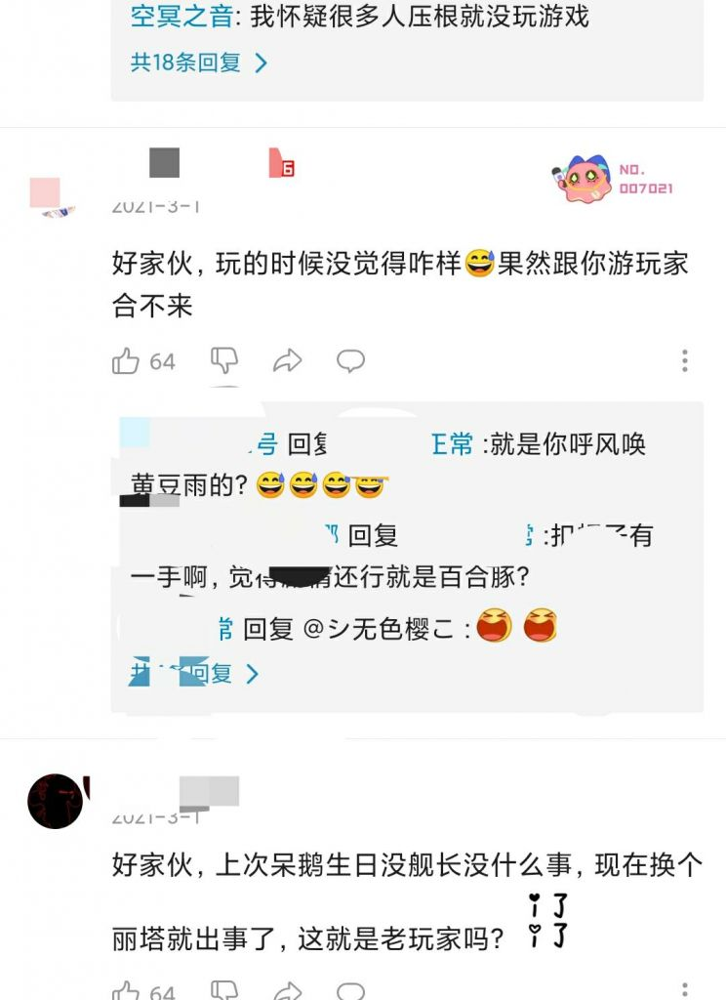
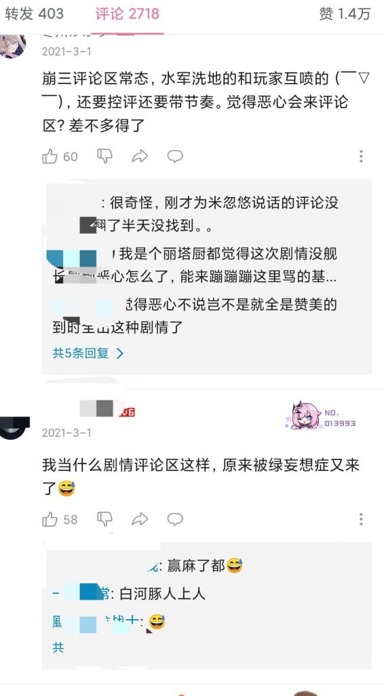
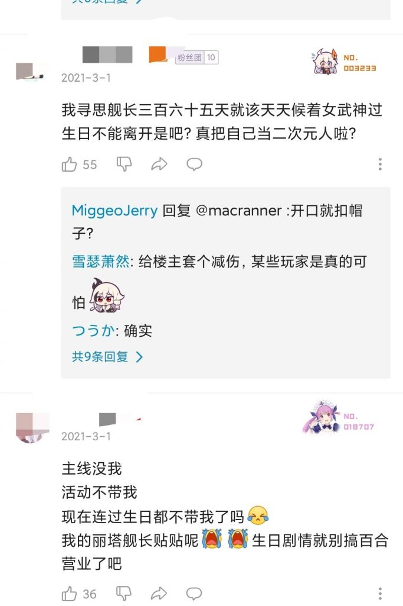
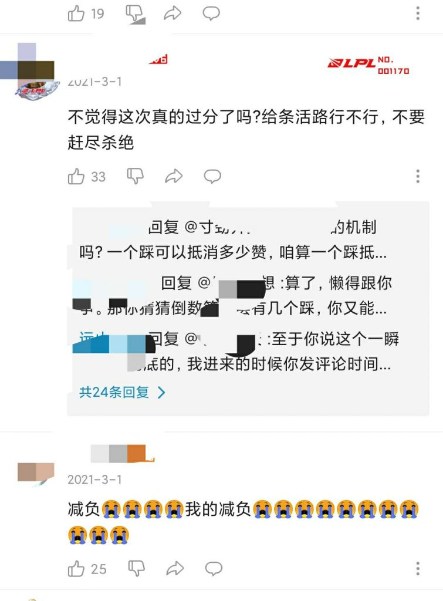

### [杂谈氵] 米桑真是二游界的生化母体啊

Made by ngapost2md (c) ludoux [GitHub Repo](https://github.com/ludoux/ngapost2md)

----

##### 0.[0] \<pid:0\> 2024-01-29 19:23:12 by fnvv
各种二游公司干的恶心事情，它基本上都干过。

如果哪个二游公司出了问题，那么只要去看一下米桑有没有相关的节奏，就可以知道后续的发展，甚至节奏后孝子们在评论区的洗地都是那样的一致。

比如说粥的缪尔赛思的秘录约会事件。

我通过崩坏三吧，查找到了米桑相应的节奏。

与?3的丽塔的生日舰长不在事件相同。

简述一下

这是在tnl节奏爆发前的一个节奏，在?3里普遍百合的女武神里少见的ml角色丽塔。

虽然还又和另外一个角色幽兰黛尔组成了百合cp。

不过没关系，米桑自有骚操作可以洗，他熟练地应用了平行世界切割大法，又在丽塔这个角色上创造了平行世界失落迷迭丽塔。

2021年3月1日，是这个角色的生日，一般来说就是给透明人贱长刷存在感的时候。

可是当时的玩家却惊奇的发现，贱长出差了。

丽塔要和观星过生日。

鉴于米桑的前科，以及一年半未出现的愤怒，贱长罕见地叛逆了一下。

他们质疑为什么贱长又没有出现，并且在这一层又加上了一层质疑，米桑是不是又要搞这一对cp?

与缪尔赛思与贾斯汀相同的是，当时粥好不容易出了一个ml角色，结果密录竟然对博士查无此人?而出现了一个花花公子一样的角色来恶心玩家。

这两个节奏过去之后，mxz和粥都采用了相同的洗地方法。

时间不允许

舰长/博士赶不上

经典对着日常查无此人的玩家骂xx皇帝，问为什么一定要写玩家，自己不代入。

自绿人差不多得了。

对家又来带节奏。

----

##### 1.[3] \<pid:740487389\> 2024-01-29 19:49:55 by 清风挽伈

----

##### 2.[2] \<pid:740492904\> 2024-01-29 20:25:04 by 葛饰北宅
仔细盘算下，国内二游玩家群体应激和滑坡的开始不就是米桑游戏先整出来的烂活，先是崩三整一手国外兔女郎国内花嫁皮的恶俗操作——赛博ntr，后又是o神对男性ml玩家重量级的散草99和肖宫散兵小树林谜之剧情，为什么23年下半年会冒出那么多所谓ml玩家群体，不就正好发生在3.6剧情之后(加全年无女五限定)，再加上粥博士没存在感以及少前2二手烟等一系列节奏，只能说国内一些二游厂根本不懂商业游戏剧本和同人游戏剧本创作的区别

