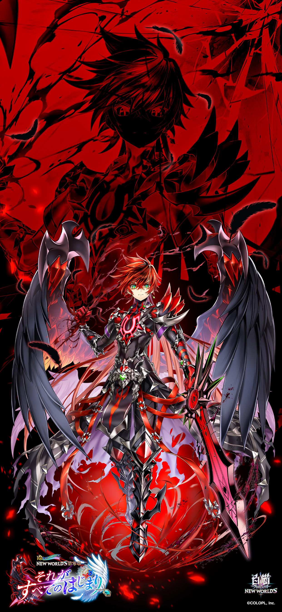

### [破事氵] 有哪些能放心入脑的二游

Made by ngapost2md (c) ludoux [GitHub Repo](https://github.com/ludoux/ngapost2md)

----

##### 0.[0] \<pid:0\> 2024-01-29 19:34:52 by wdmy123
现在玩二游真找不到以前初次尝试的那种感觉了。
都说别入脑，但不如脑玩二游干嘛？这除了那种“陪伴”感觉外，全方位被其他游戏爆杀。<h4 class='subtitle'></h4>不求工业糖精写得水不水，但至少别整大烂活(牛头人)，这要求很难吗？

----

##### 1.[0] \<pid:740485205\> 2024-01-29 19:36:45 by yaoguanh
不知道，等楼下推荐

----

##### 2.[0] \<pid:740485220\> 2024-01-29 19:36:51 by ee艺术家～
尘白可以来试试，文案大哥剧情写的可好了

----

##### 3.[2] \<pid:740485364\> 2024-01-29 19:37:41 by 茂盛的植物
尘白文本量虽然少
但你是绝对主角  
还有千年，虽然要跑路，但趁着这段时间白嫖看剧情也可以
这游戏人设很不错，游戏里有往期剧情回顾

----

##### 5.[0] \<pid:740485500\> 2024-01-29 19:38:28 by A_sys
去日本和韩国淘，手游以外的gal，音声，甚至主播圈都大把的

----

##### 6.[7] \<pid:740485520\> 2024-01-29 19:38:36 by 开胃骑兵
非要入脑建议别玩，手游又不是什么必需品

----

##### 7.[1] \<pid:740485554\> 2024-01-29 19:38:47 by nanimonoK
那我只能推荐LO了

----

##### 8.[1] \<pid:740485618\> 2024-01-29 19:39:14 by Madfrogkygdiddy
建议不玩，真的。

----

##### 9.[2] \<pid:740485637\> 2024-01-29 19:39:20 by wanderer573
无，包括小说，动画。如果你要&quot;入脑&quot;的话，建议拿起笔自己来
哥们给你捧场

----

##### 10.[5] \<pid:740485749\> 2024-01-29 19:39:59 by UID64792814
别入脑了大哥
你的大脑装不了一点有用的东西吗

----

##### 11.[1] \<pid:740485847\> 2024-01-29 19:40:30 by 笑死我了AAA
没有，建议自己创作

----

##### 12.[1] \<pid:740485871\> 2024-01-29 19:40:38 by 有男不玩，是米不碰
入脑这个东西，在需要不断更新剧情延长生命线的手游上就不是一个能确定的东西。
不如划定个自己的底线，被侵犯了就跑。
这也是有男不玩让大家共鸣的基础嘛。

----

##### 13.[1] \<pid:740485910\> 2024-01-29 19:40:51 by 妈妈再打我几下
我挺想知道入脑是什么感觉，玩了二十多年游戏从来没入脑过

----

##### 14.[3] \<pid:740485936\> 2024-01-29 19:40:57 by Dorothy_Goddess
别入脑了，最次最次学学猛干，让别人尖叫抓挠不香吗

----

##### 15.[0] \<pid:740486024\> 2024-01-29 19:41:28 by 计算机系宝可梦天王
正经galgame~~不正经的也行~~

----

##### 16.[1] \<pid:740486061\> 2024-01-29 19:41:41 by abasiyaluo2
真没有，二游不值得，这么想入脑找几本教材看看吧，入脑了可以受益终身。

----

##### 17.[0] \<pid:740486325\> 2024-01-29 19:43:21 by Asiz1379
单机都容易出幺蛾子,现在都没有多少敢无脑入的单机,持续运营的二游,你要赌它未来不会脑抽,等到运营真脑抽的时候你又舍不舍得无视投入直接弃坑?反正有能力就别玩二游

----

##### 18.[0] \<pid:740486451\> 2024-01-29 19:44:08 by 我想静静2023
老牌二游场CY的GBFlink，虽然是主机、pc端，但其实二游感觉很重的，至少我玩了一天都不腻的，也挺便宜的....
偏向ACG的主机游戏、PC游戏、网文、同人、番剧，提供的服务质量其实都比国内手游好很多，他们其实早就不是所谓的动漫二游从业者了，而是单纯冲着收入而来的“打工人”，只是会粗糙的模仿和贴标签而已。
想清楚这个，就知道国内二游全部是冲着逼氪来的，只会在一个雷到另外一个雷中徘徊，不如下定决心直接跳出来.....真的出脑了，会发现在二游死磕完全是恶心自己，ACG系的东西只要你找，外面挺多的。

----

##### 19.[0] \<pid:740486601\> 2024-01-29 19:45:02 by 矿泉水放生大师
不建议入脑，就当个仙人掌浇浇水就完事了

----

##### 20.[0] \<pid:740486691\> 2024-01-29 19:45:37 by 就是百宝袋
什么游戏剧情都是人写的，指不定哪天就爆雷出个李猛干

----

##### 21.[1] \<pid:740486738\> 2024-01-29 19:45:53 by DxhSN2022
那么你可以找找已经死掉的ip，比如闪乱神乐。
说实话这个系列如果放到今天，绝对要被河豚深度入侵。(还要被车百合，里面是真有百合元素的)
可惜(还好)它在还比较美好的时代就寄了。

看看贴吧介绍，多么~~纯真~~啊。(“绅士”这个词多久没见过了)

----

##### 22.[0] \<pid:740486844\> 2024-01-29 19:46:33 by 咲猪满月
>[jump](#pid740486451) 我想静静2023(2024-01-29 19:44) 说: 
>
>老牌二游场CY的GBFlink，虽然是主机、pc端，但其实二游感觉很重的，至少我玩了一天都不腻的，也挺便宜的....
>偏向ACG的主机游戏、PC游戏、网文、同人、番剧，提供的服务质量其实都比国内手游好很多，他们其实早就不是所谓的动漫二游从业者了，而是单纯冲着收入而来的“打工人”，只是会粗糙的模仿和贴标签而已。
>想清楚这个，就知道国内二游全部是冲着逼氪来的，只会在一个雷到另外一个雷中徘徊，不如下定决心直接跳出来.....真的出脑了，会发现在二游死磕完全是恶心自己，ACG系的东西只要你找，外面挺多的

GBF都能吹啊，卧槽  鬼子学院联动的那个？

----

##### 23.[0] \<pid:740486924\> 2024-01-29 19:47:02 by 无名猫猫头
其实哪个二游都不建议入脑，毕竟只是一个取悦或者消磨碎片时间的工具  
而且这玩意，一时不暴雷不能说明永远不暴雷，玩的开心的时候就玩，不开心的时候就扔掉，认清楚自己的地位，自己是他的消费者爷爷是他们需要伺候的对象就好

----

##### 24.[0] \<pid:740487232\> 2024-01-29 19:48:55 by 玩他喵的
>[jump](#pid740485910) 妈妈再打我几下(2024-01-29 19:40) 说: 
>
>我挺想知道入脑是什么感觉，玩了二十多年游戏从来没入脑过

不知道，入脑我是从v圈里看到的，大意是指沉浸在主播的虚拟人设虚拟生活里  
放进二游里我也不知道怎么表达，可能是指沉浸在故事与角色关系里？

----

##### 25.[0] \<pid:740487701\> 2024-01-29 19:51:53 by wzyyyys
千年之旅，白嫖着玩

----

##### 26.[0] \<pid:740487907\> 2024-01-29 19:53:18 by 踏上征程u
本月最后一周：千年，和1.3版本及以后的尘白，目前国产二游就这俩。  
之后的事谁又能说得准呢。

----

##### 27.[0] \<pid:740487915\> 2024-01-29 19:53:20 by 蟑螂体系
入脑不建议找手游

----

##### 28.[0] \<pid:740488069\> 2024-01-29 19:54:16 by 好累，想睡
大概没有，好玩就玩，不好玩就润，社区不能车厂商的要不赶紧润要不卸载社区

----

##### 29.[0] \<pid:740488087\> 2024-01-29 19:54:20 by sadifenchen7
首先排除所有国产。

毕竟蝈女无处不在。

----

##### 30.[0] \<pid:740488149\> 2024-01-29 19:54:39 by DGVHJKCX
你为什么非得玩二游？

----

##### 31.[0] \<pid:740488165\> 2024-01-29 19:54:45 by em76599
我直说了
非在一堆屎里找玉米粒？

----

##### 32.[0] \<pid:740488322\> 2024-01-29 19:55:42 by 我想静静2023
>[jump](#pid740486844) 咲猪满月(2024-01-29 19:46):

说的是今天主机端那个，网页那个基本弃了，还真不是很了解最近发生了啥，主机游戏反正一次性消费，挺便宜的，国内二游基本是缅北，越花钱越恶心自己，尤其是舟、白荆、狐仙崩铁，一个比一个缅北

----

##### 33.[0] \<pid:740488868\> 2024-01-29 19:58:56 by nYearBurst
没有，所有二游都是暴雷或者在暴雷的路上。真要入脑还是远离二游的好

----

##### 34.[0] \<pid:740491291\> 2024-01-29 20:13:57 by 8991aiih
灵魂潮汐：除了产能低以外全部符合

----

##### 35.[0] \<pid:740492256\> 2024-01-29 20:20:31 by 蓝冰·白夜
不懂为什么一定要玩二游,说要陪伴- -.但二游的陪伴效果也很烂啊-.-...

不如来玩白猫吧- -.虽然没有各种虚情假意的倒贴和后宫,一夫一妻制.但是男女主历尽艰辛同舟共济,花了现实时间7年才走到一起,期间无数次出生入死,豁出性命拯救对方,一点点从无到有建立起来的感情,不比三天两头翻车劈腿或者舔过一次再无下文的工业糖精甜一万倍- -.

每年都有男主力挽狂澜极限逆风翻盘的爽局- -.反派有一个算一个全部偿命,还没有二游这一系列的毁三观剧情- -.

马上10周年主线完结- -.第3年后主线保质保量,每年质量上天且环环相扣,动辄跨3/4/5/6/7年埋伏笔并回收,且全程0吃书伏笔全回收更不是二游可以想象的- -.

红头发的是你,白头发的是你老婆- -.

<a href="javascript:;" onclick="collapse(this);">+</a>折叠几张以前的图,还有更多没发的- -.不然太长了 ...

----

##### 36.[0] \<pid:740492342\> 2024-01-29 20:21:09 by 右手边03
自己写自己看好了

----

##### 37.[0] \<pid:740492771\> 2024-01-29 20:24:08 by 夭蔚房卯屋全
>[jump](#pid740487232) 玩他喵的(2024-01-29 19:48) 说: 
>
>不知道，入脑我是从v圈里看到的，大意是指沉浸在主播的虚拟人设虚拟生活里  
>放进二游里我也不知道怎么表达，可能是指沉浸在故事与角色关系里？

沉浸在厂商虚拟人设的幸福世界里

----

##### 38.[0] \<pid:740507370\> 2024-01-29 22:09:32 by 蹦哒的鱼鱼
按我自己的标准，感觉没有能放心的。

----

##### 39.[0] \<pid:740507706\> 2024-01-29 22:11:58 by I防御之王I
冷门游戏可以入吧，不过也各有各的冷点，看你是不是喜欢了，喜欢rpg的话比如另一个伊甸？虽然也不算很好玩

----

##### 40.[0] \<pid:740508231\> 2024-01-29 22:15:37 by miao123177
BA
目前有日服领先2年半的内容 没啥大雷
就算有 前面也有日服帮忙踩 可以提前跳车

----

##### 41.[0] \<pid:740508321\> 2024-01-29 22:16:16 by 己顾杜壬魏张
还不如养宠物呢。

----

##### 42.[0] \<pid:740508382\> 2024-01-29 22:16:39 by Redbaby
你还想一辈子玩二游吗？不然什么二游不都有出脑的那一天。

----

##### 43.[0] \<pid:740521877\> 2024-01-30 00:02:45 by ypsys
>[jump](#pid740492256) 蓝冰·白夜(2024-01-29 20:20) 说: 
>
>不懂为什么一定要玩二游,说要陪伴- -.但二游的陪伴效果也很烂啊-.-...
>
>不如来玩白猫吧- -.虽然没有各种虚情假意的倒贴和后宫,一夫一妻制.但是男女主历尽艰辛同舟共济,花了现实时间7年才走到一起,期间无数次出生入死,豁出性命拯救对方,一点点从无到有建立起来的感情,不比三天两头翻车劈腿或者舔过一次再无下文的工业糖精甜一万倍- -.
>
>每年都有男主力挽狂澜极限逆风翻盘的爽局- -.反派有一个算一个全部偿命,还没有二游这一系列的毁三观剧情- -.
>
>马上10周年主线完结- -.第3年后主线保质

能再次看到你安利白猫，我居然产生了些许泪目的感觉，之前我毫无波澜，沧海桑田后我决定试试

----

##### 44.[0] \<pid:740521949\> 2024-01-30 00:03:29 by poiclear
你不读书工作的吗？

----

##### 45.[0] \<pid:740661647\> 2024-01-30 17:45:57 by 蓝冰·白夜
>[jump](#pid740521877) ypsys(2024-01-30 00:02) 说: 
>
>能再次看到你安利白猫，我居然有些许泪目的感觉

昨天睡前刷一下还是你说你打算去玩玩,今天再看已经编辑没了.

不过说真的- -...天天吹陪伴,哪个二游能有白猫男女主这种近200小时全语音剧情,10年下来情比金坚年年疯狂发糖的陪伴度啊- -...都不说各种出生入死豁出生命就为了救对方这种等级的付出,何况人家剧情还超神.

我感觉最大且唯一的问题是可能明天更新的剧情里男主要死了- -.............看PV里简直是插满了flag,各种细节都暗示可能要暂时退场——前面那张图里女主在哭,手里捏着的是男主的项链.

搞不好要过一段时间男主才能靠打破第4面墙回到白猫的世界- -.毕竟是高维世界(现实)空降的.

----

##### 46.[1] \<pid:740663437\> 2024-01-30 17:54:11 by 无寿之梦
二游不配，想入脑建议极乐迪斯科。

----

##### 47.[0] \<pid:740664074\> 2024-01-30 17:57:10 by lucifiniczw
建议别入脑，就算文案不出问题，你也说不好有没有学长娇妻让你恶心

----

##### 48.[0] \<pid:740665036\> 2024-01-30 18:01:52 by 爱吃菠萝披萨的永乐
少女前线2追放

----

##### 49.[0] \<pid:740668665\> 2024-01-30 18:20:48 by 软萌的白狐狸
二游这种提供情绪价值的就是要入脑才开心啊，不过现在作妖的太多了，尘白ba这种起码目前还算形势一片大好

----

##### 50.[0] \<pid:740670315\> 2024-01-30 18:30:00 by 这里是狗粮爱好者协会
>[jump](#pid740661647) 蓝冰·白夜(2024-01-30 17:45) 说: 
>
>昨天睡前刷一下还是你说你打算去玩玩,今天再看已经编辑没了.
>
>不过说真的- -...天天吹陪伴,哪个二游能有白猫男女主这种近200小时全语音剧情,10年下来情比金坚年年疯狂发糖的陪伴度啊- -...都不说各种出生入死豁出生命就为了救对方这种等级的付出,何况人家剧情还超神.
>
>我感觉最大且唯一的问题是可能明天更新的剧情里男主要死了- -.............看PV里简直是插满了flag,各种细节都暗示可能要暂时退场——前面那张图里女主在哭,手里捏着的是男主的项链.
>
>搞不好要

感兴趣了，Mark一下，不知道自建新号体验如何

----

##### 51.[0] \<pid:740674489\> 2024-01-30 18:54:29 by 蓝冰·白夜
>[jump](#pid740670315) 这里是狗粮爱好者协会(2024-01-30 18:30) 说: 
>
>感兴趣了，Mark一下，不知道自建新号体验如何

我把隔壁的QA贴一点过来吧- -...

常见问题:需要买钻号/初始开局吗?钻号/初始相对自开的优劣又是怎样呢?

<a href="javascript:;" onclick="collapse(this);">+</a>懒得看长篇大论的话,结论很简单,不需要,自开就可以了.尤其不要买成品号 ...
这游戏单纯签到是几乎搞不到钻的:每天只有一次转盘有1/4的概率得到5钻,其他的靠修BUG补偿——很频繁,但是因为每次都只有5钻且会根据是否持有受BUG影响角色来追加补偿,所以钻号一个月顶了天也就百来钻.一个钻号想要更多的钻总不可能去给你手动推图- -.那就只能开外挂发包过图了...如此就可能被秋后算账,任意时间开始,随机封最少1周,最多无期徒刑.封停的内容最低是禁投票,再强力一点就封掉所有活动协力的参与,再高一档就直接封新活动的游玩变阉割版的单机游戏.

另外钻号的帐号密码会非常奇怪,难以记忆,你也根本不知道钻号的密保问题是啥;用钻号时看剧情也会很麻烦(因为他很可能已经打过不少了顺序是乱的).

目前&quot;据说&quot;稍微安全一点的钻号自带的钻大概是3000-5000,如果你够肝,这差不多就是你15-60小时游玩时间内能获得的钻量,这个数字大约是自开裸建帐号后你能从回忆和主线中挖到的钻量的1/18.相比纯自开最大的优势是可以开局直接抽一波有稍微厉害一点的角色可以用来推图——当自开的你同样抽到第一个限定角色后就没什么区别了.

我是更建议自建- -.反正不太浪费第一年你的钻基本是花不完的.省一点两年都花不完.能自定义帐号密码密保还不用担心被封的优势太大了.

你买一个成品号,能获得的东西包括:可能存在的暂时很难拿到的强力武器;一大堆暂时很难集齐,要等复刻的石板;一大堆你完全不认识是谁的角色;相对裸开而言大概要造1-2个月的建筑属性——在这些的支持下你会更容易通过最高难度的关卡——但是请注意,哪怕你直接裸开一个号,只要抽到当期的角色,熟悉角色职业机制,操作一般的情况下你就已经能打掉最高难度的关卡了,差距大约是一般RPG选择easy难度和hard难度这么点大,却一来要亏钱,二来要亏掉海量的库存钻.真的非常非常非常亏本.

唯一的例外是你有什么无论如何都想获得的已经绝版的联动角色,那可以考虑找个初始开局——此外任何情况下都不推荐购买其他人的帐号,哪怕你可以完全忽视安全方面的问题.如同之前所说的,这游戏的活动钻都是不会复刻的,拿过就没有了,你买的帐号玩的时间越久,他消耗掉的岛钻就越多,这都等于是你永久性地亏掉了这些钻——买号进游戏第一时间亏5W+RMB不是开玩笑的.

关于其他常见问题和新人入坑起步应该优先做的事:

1.

<a href="javascript:;" onclick="collapse(this);">+</a>如果是自建,想刷一下初始的话,附节奏榜与当期初期评价,更新于2022/4/28: ...
<b>卡池里的4星角色花1秒钟吃个药/刷一下好感升到100就会变成5星,所以4星角色其实就已经是这个游戏的最高稀有度了</b>- -.

重点警告:其实纠结强度没什么必要,如果能找到自己喜欢的角色,然后用他/她/它一直玩下去,游戏体验会好得多~技能觉醒实装完成的现在强度已经是无所谓的东西了,除了打打决战刷素材以外没用的,即使要死追强度也有太多替代品/平时歪出来的人可用了- -.萌新期钻矿多所以多抽点广撒网找真爱倒是没什么所谓,有喜欢的角色的话只要每年为他留30发11连的钻就可以确保未来抽齐了~

如果是目标轻松快乐地玩,直接抽当期池子开局就可以了——当期池子里每有X个角色,总概率即为X*0.625%+1%.当池子里角色数X为4或4个以上时,第一页盖章最后会有一次保底;当X等于3时,第15-20发11连会触发第一次保底;当X等于2时,第20发11连会触发第一次保底.后面都相同.单点概率因为1%的5星概率会均摊,所以2人时最高1.125%,7人时最低0.768%.

当期池子评测目前无限期咕咕中- -...因为所有人都太强,关卡强度在GP暂停更新后严重跟不上角色实力-.-...900个以上角色随便掏一个出来都能打穿所有游戏内容...没什么做评测的意义了- -.

建议看爱抽吧~实在想刷也可以利用现在送的2次10选1和大量必5券- -.注意参照下面的10选1推荐表.伊南娜和4周年爱丽丝这种都是可以用一辈子的- -.

这鬼游戏节奏榜一共有4家- -...但是内斗很厉害...不要太相信节奏榜就是了.[gamewith全角色节奏榜](https://gamewith.jp/shironeko/article/show/4040 )

<b>PS.如果你玩的是台服,台服只要打完活动内的&quot;巴隆道场,职业之卷&quot;,就可以在任务板子拿到一发10选1,从邮箱中拿出来后就可以使用一次10选1,参考内容可以看这个帖子内我的其他回复,善用只看目标回复的功能</b>:[url](http://bbs.nga.cn/read.php?tid=28202516&amp;page=5#pid544445879Anchor)

1.5.

<a href="javascript:;" onclick="collapse(this);">+</a>剧情党想要的整体时间线+推荐剧集,不明白的词都是活动标题,括号里是回忆筛选的选项 ...
游戏整体时间线是这样的:zero chronicle(3周年,这个也叫0岛,是主线的序章,就你刚进游戏看到的片段详细展开)&gt;&gt;&gt;几千上万年&gt;&gt;&gt;gravity horizon(6周年)&gt;&gt;几百上千年&gt;&gt;runaway horizon(horizon系列都是6周年)&gt;5年&gt;主线开始,主线1-11岛,以及大部分0-3年期间的活动时间点&gt;&gt;主线12岛&gt;4魔幻兽(顺序是苍炎的暴风雨&gt;trouble traveler&gt;亡国之翼&gt;カオスエンブリオ)+world end(4周年)&gt;主线13岛&gt;霸战+dark ragnarok(5周年)&gt;主线14岛&gt;extend horizon&gt;crisis horizon&gt;original horizon(6周年)&gt;主线15岛+主线16岛(7周年,一部主线完结)==&gt;NEW world&#39;s第一章&gt;fragment origin&gt;fragment nexus&gt;fragment road&gt;fragment versus(8周年).

<b>346周年的部分可以参考这个楼层的内容,搭配其中的PV观看能略微提升游戏体验</b>:[url](http://bbs.nga.cn/read.php?tid=14497925&amp;page=656#pid638772888Anchor)

这一系列剧情会通过各种细节与伏笔相互呼应,随着对整个故事了解的加深,得到的感动会层层叠加不断加强.主角们长达7年的爱情长跑,最终收获果实时的甜度是真的报表的~

主线里剧情不错的部分是1.8.9(1和9其实作为单章而言质量都有点微妙但是后续相关不少,1岛3个难度的剧情里有海量后续伏笔,9岛则关联15岛和16岛).10.11.13.14,3周年(稍微有点薄弱但是演出和沉浸感做得不错,关联大部分剧情,建议最好在主线11岛通关后看完这个,不过单独跳出去先看这个然后转4周年连续剧也不是不可以——因为质量较高,能更好的维持热情,主线2-7岛确实有点无聊),4周年(前面3个魔幻兽纯铺垫,第4个魔幻兽开始高潮迭起),6周年(开幕和终章都很精彩),5周年有点争议但其实也还不错,注意5周年终章和6周年全套都没进回忆.然后主线2-7岛是纯展开世界观,非常王道,没什么大冲突.

体验最佳是:主线1-11(12无关紧要)===&gt;zero chronicle(3周年相关,回忆)==&gt;(4魔幻兽+world end)(4周年相关,回忆)==&gt;主线13岛==&gt;(霸战的王权+dark ragnarok)(5周年相关,回忆)===&gt;主线14岛==&gt;gravity/runaway/extend/crisis/original horizon5部曲(6周年相关,日服已经进了回忆,台服等3个月)==&gt;主线15/16岛完结第一部转进第二部.

周年连续剧基本全是插叙/补充,所以其实只要先看了zero chronicle,就可以按顺序/跳年份来补周年连续剧- -.这里面只有zero chronicle是硬关联后面所有剧情<b>.所以如果主线2-7觉得太枯燥啃不下去,完全可以直接从zero chronicle开始转4周年连续剧,充值大量热情</b>- -.在打完34周年之前主线剧情约等于没看过-.-...

NEW:主线15章和主线16章都很不错,极大幅度收拢了前面的伏笔们铺了一个新高潮出来.这游戏总算还没忘记自己是个王道JRPG.演出效果做得挺好的(除了中间的剑雨,到时候自然就知道了).

NEW!新世界一章直接关联8周年连续剧,追8周年连续剧之前建议至少补完45周年连续剧- -...

<b>NEW!8/9/10周年的剧情已确认相互关联,或者说整个第二部的剧情都是相互强关联的,且目前跟一部主线的3/4/5/6/7周年都有强关联= =...建议还是推完一部主线之后再推第二部.</b>

注意除了主线1岛以外的hard和nightmare都是没啥深意的- -.基本都是讲队友们的日常.

NEW:在最新的主线16章里,Kings Crown与brave the lion的剧情也被认定进了主线剧情中.如果进度已经打到了16章还没看过brave the lion,可以考虑补一下,虽然影响很小.KC主要是和0岛以及16岛有点关系,但是牵连很薄弱.

回忆里的还不错的严肃正剧支线系列有:over drive红莲(质量顺序3=4&gt;2&gt;1,不过整体都不错而且会互相呼应);brave the lion(1非常薄弱,2不错,3后段拉跨但是有不少伏笔,4不错,顺便完了可以看一下讨灭士加鲁加);帝国战旗(铺垫是在2周年,但是2周年后半剧情虎头蛇尾,12都还行,贡献了不少BGM);光焰冰暗(1期有点一般,但是二期force of fang很不错);lost weather cord(吃姐弟糖的话可能会觉得不错).

别的或搞笑或温馨的故事太多了就不一一列举了= =.随缘看吧.

音乐播放器路线建议先打blooming blaze或者パイレーツシンフォニア,3.4.5.6周年也都有不错的OP/ED,其他的随缘慢慢收集就好.

----

##### 52.[0] \<pid:740675061\> 2024-01-30 18:57:54 by Noel。
我也是尘白ba

----

##### 53.[0] \<pid:740675678\> 2024-01-30 19:01:26 by 蓝冰·白夜
>[jump](#pid740674489) 蓝冰·白夜(2024-01-30 18:54) 说: 
>
>我把隔壁的QA贴一点过来吧- -...
>
>常见问题:需要买钻号/初始开局吗?钻号/初始相对自开的优劣又是怎样呢?
>[collapse=懒得看长篇大论的话,结论很简单,不需要,自开就可以了.尤其不要买成品号]
>这游戏单纯签到是几乎搞不到钻的:每天只有一次转盘有1/4的概率得到5钻,其他的靠修BUG补偿——很频繁,但是因为每次都只有5钻且会根据是否持有受BUG影响角色来追加补偿,所以钻号一个月顶了天也就百来钻.一个钻号想要更多

回复过长不编辑了怕吞- -...补充一下.

这个回复里的支线推荐挺过时的- -...现在的话优先推荐救命的邪眼,over drive红莲1-5,和叛逆的色彩- -...叙事和节奏相比以前的东西强了不少.尤其救命2和红莲5摆脱了从0描绘世界观更是高潮不断- -...叛逆色彩1和2相对有些无聊,但3是很不错的- -.既然有叛逆色彩,那就顺便加一个the world of guilty 2.这俩剧情有关联且BG糖挺甜- -.

----

##### 54.[0] \<pid:740689664\> 2024-01-30 20:26:57 by 235711
别玩国产。
实在要玩，别玩有男的

