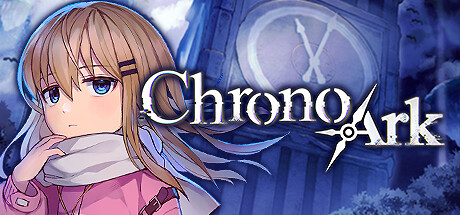

### [破事氵]有些人真的是玩着玩着就把自己玩成XZ了

Made by ngapost2md (c) ludoux [GitHub Repo](https://github.com/ludoux/ngapost2md)

----

##### 0.[20] \<pid:0\> 2024-01-29 19:46:12 by OLWSBV
本人玩舟，但是有男不玩，高强度观察手综，我发现从去年八月开始手综的大部分节奏核心都是反XXN，而这次的节奏我根据今天一天的观察下来基本确定这个核心没有变，虽然有些其他游戏XZ混进来狂欢，但是那无所谓，我只希望一些入脑还没那么深的兄弟看清楚一点，攻击游戏或者制作人只是手段之一，重点还是在反XXN上，不要当了孝子而不自知。

在对立这么严重的互联网，或者说二游圈子里，虽然我个人不喜欢极端，但有人在帮我极端的时候，我起码会尊重一下我自己的染色体，不会跑出来当理中客甚至唱反调。

----

##### 1.[2] \<pid:740507005\> 2024-01-29 22:07:03 by skq000
多新鲜的事，开服入坑就发现了

----

##### 2.[2] \<pid:740507791\> 2024-01-29 22:12:27 by a1385782946
确实，我是不明白厂商的声誉，对你玩家来说很重要吗？搁那整那么努力，还不如想想当你要去维护厂商的声誉的时候，是不是什么东西入脑了啊，你到底是什么身份啊？

----

##### 3.[1] \<pid:740507996\> 2024-01-29 22:13:58 by EEEdwars
鹰角我想不通有什么值得孝的，不觉得掉价吗？换游科来还差不多。

----

##### 4.[0] \<pid:740508309\> 2024-01-29 22:16:10 by ASWGgn00
>[jump](#pid0) OLWSBV(2024-01-29 19:46) 说: 
>
>本人玩舟，但是有男不玩，高强度观察手综，我发现从去年八月开始手综的大部分节奏核心都是反XXN，而这次的节奏我根据今天一天的观察下来基本确定这个核心没有变，虽然有些其他游戏XZ混进来狂欢，但是那无所谓，我只希望一些入脑还没那么深的兄弟看清楚一点，攻击游戏或者制作人只是手段之一，重点还是在反XXN上，不要当了孝子而不自知。
>
>在对立这么严重的互联网，或者说二游圈子里，虽然我个人不喜欢极端，但有人在帮我极端的时候，我起码会尊重一下我自己的染色体，不会跑出来当理中客甚至唱反调。

支持

----

##### 5.[2] \<pid:740508533\> 2024-01-29 22:17:47 by 一缕辰光
>[jump](#pid740507996) EEEdwars(2024-01-29 22:13) 说: 
>
>鹰角我想不通有什么值得孝的，不觉得掉价吗？换游科来还差不多。

别掉自己价，游科也没必要孝，黑悟空好玩玩家会支持的，2077，边境，星空这几位刚出售，也是一堆人出脑

----

##### 6.[2] \<pid:740508731\> 2024-01-29 22:19:10 by 影响567
将自己代入到ta心中的厂商形象了呗

----

##### 7.[2] \<pid:740508850\> 2024-01-29 22:20:07 by Frost_Wind
很奇怪，总有人喜欢玩厂商养成

----

##### 8.[0] \<pid:740509017\> 2024-01-29 22:21:22 by EEEdwars
>[jump](#pid740508533) 一缕辰光(2024-01-29 22:17) 说: 
>
>别掉自己价，游科也没必要孝，黑悟空好玩玩家会支持的，2077，边境，星空这几位刚出售，也是一堆人出脑

就冲去年那个试玩反馈，这个真的会无脑入的。

话说来自星尘做的是真的烂啊，渲染建模一坨，我现在就等着看发售后的乐子了。

----

##### 9.[0] \<pid:740509033\> 2024-01-29 22:21:32 by 矿泉水放生大师
>[jump](#pid740507996) EEEdwars(2024-01-29 22:13) 说: 
>
>鹰角我想不通有什么值得孝的，不觉得掉价吗？换游科来还差不多。

游科也没必要，咱是来玩游戏的又不是来找赛博爹的

----

##### 10.[1] \<pid:740510011\> 2024-01-29 22:28:57 by jihuohaier
我也提一嘴，某些人要真喜欢鹰角这公司的话我建议你也得去多怼一下那些尖叫抓挠的XXN
你瞅瞅那帮货一天到晚嗷嗷着要官方满足她们什么逼玩意儿，真让官方以为那才是市场真正需要按XXN满意的来改就等着流水爆炸，一个游戏公司脑子不清楚被夺舍了啥下场去年看了不少了吧

公司的根本还是盈利，真热爱它的话不会想让他天天亏损吧？这都想不清楚的话那只能说明所谓的“孝”只是个皮，你只是在借所谓的热爱满足自己的某些个人欲望和认同感

----

##### 11.[0] \<pid:740510035\> 2024-01-29 22:29:11 by xy288
被厂商pua了呗，天天念叨yj平等创似所有玩家，真以为是雪之下雪乃啊

----

##### 12.[1] \<pid:740510432\> 2024-01-29 22:32:27 by AiakosG
>[jump](#pid740507791) a1385782946(2024-01-29 22:12) 说: 
>
>确实，我是不明白厂商的声誉，对你玩家来说很重要吗？搁那整那么努力，还不如想想当你要去维护厂商的声誉的时候，是不是什么东西入脑了啊，你到底是什么身份啊？

人家那么有货那么有品的人，玩XX那么有品那么有货的游戏那叫双向奔赴，你批判XX对它们来说无异于攻击它们自身，那反应当然大了

----

##### 13.[2] \<pid:740511313\> 2024-01-29 22:38:58 by 丙寇徐庚宁马
男性更容易被宏大叙事忽悠，容易有厂商用户身份认同和厂商用户荣誉感
这点女宝比较强，她们普遍是粉giegie但是不粉公司
从“XXX我真恨我推在你手上”之类的话术就能看出来

她们是把喜欢的角色和厂商分的很清楚的
这点你如果逛过炸裂前的理查就能发现，她们经常粥米双休而且彼此不会因为厂商屁股打架
也绝不会抱着用户身份认同参与游戏群体之间的厂商骂战

就像玩粥的女的就经常用原神的性别比例喷粥
玩原的女的喜欢用粥的角色设计来喷原的丑

手综这次炸裂被屠版，本质也是男性更注重厂商屁股
比如原出午餐肉，那原的男玩家直接怒喷的不多，甚至会被内部堵嘴
很多还会在其他玩家群体面前维护这种厂商做出的违反男玩家利益的事情
所以全女角色游戏受众群体，和殖民这里的棉花群体在性别立场上冲突太大
必然导致决裂

手综如果性转是女性社群，就会出现一致要帅哥，只会喷公司的情况
不会因为玩的游戏的公司被喷媚男就集体荣誉感受打击破防
然后捅前一天还在战壕里喷统一仇恨目标的隔壁人刀子

----

##### 14.[0] \<pid:740512089\> 2024-01-29 22:44:56 by 琴枯柳
“玩粥，但是有男不玩”，周游差不多得了，别释义定义了  。
哦不好意思看错了，下一个

----

##### 15.[3] \<pid:740512593\> 2024-01-29 22:48:44 by 蹦哒的鱼鱼
当了孝子一般来说就是不自知的

----

##### 16.[1] \<pid:740513283\> 2024-01-29 22:54:04 by 老北京育马王
确实 游戏公司不知道有什么好追捧的 本质不还是要爆玩家的米

----

##### 17.[0] \<pid:740513302\> 2024-01-29 22:54:14 by 琴枯柳
可能玩着玩着就杂交了吧，孟德尔遗传定律知道吧，可能染色体混种了变成xxn了。

----

##### 18.[0] \<pid:740513533\> 2024-01-29 22:56:05 by 奸奇至尊巫师
>[jump](#pid740507996) EEEdwars(2024-01-29 22:13):

游科也不行，你要学习那维莱特的品德，就像卡普空可以随时在卡婊和动作天尊的称号之间灵活转换一样留后路

----

##### 19.[1] \<pid:740513569\> 2024-01-29 22:56:25 by 东方谷早苗
粥版版务aoe手综，
理论上应该手综反车粥版版务
但是车版务在任何情况下都是会直接死的。
所以车粥版xxn，
车着车着车到yj上了，车到粥友身上了。
对号入座的粥友反抗。
打击感来了，加强车粥友。

反正我是无所谓车不车粥友啊，毕竟我不会对号入座。
但是我建议车粥友的时候加一句xxn4000+，不忘初心。

————
xxn4000+

----

##### 20.[0] \<pid:740513580\> 2024-01-29 22:56:30 by poiclear
这说明你上网冲浪冲的少了，真把厂商当爹的人还是少数，大部分xz都只是为自己的审美观或者价值观站台而已。
比如小米用户觉得性价比是买东西第一位，华为用户觉得民族感情品牌价值是买东西第一位，原神玩家觉得开放世界高质量美术3d建模是手游里最cool的，粥玩家觉得每天开脚本刷一下体力，出新活动了无压力享受游戏乐趣是最关键的，舰b玩家觉得免费抽卡看大奶奶是手游唯一价值所在
这些玩家关心谁在做游戏吗？无非是相互骂战之时被转化成相互贬低各自的观点，都感觉受到了冒犯而已。所谓为游戏辩护，不过是为自己的观念辩护的附属品。
所以骂战永无止息，因为没有哪个人是能通过语言改变一个人的观念的，所谓经济基础决定上层建筑在微观上表现如此。

----

##### 21.[1] \<pid:740514733\> 2024-01-29 23:05:50 by limao527
厂商孝子信仰唯心主义“以后我就成了你”。内心相信玄学但行动上又唯物主义作为暴白是看在母公司有钱加制作类型是多面手，只在性骚扰丑闻期间担心过，毕竟没钱没人是巧妇难为无米之炊。

----

##### 22.[1] \<pid:740515026\> 2024-01-29 23:08:06 by 苍色洋流
>[jump](#pid740507791) a1385782946(2024-01-29 22:12) 说: 
>
>确实，我是不明白厂商的声誉，对你玩家来说很重要吗？搁那整那么努力，还不如想想当你要去维护厂商的声誉的时候，是不是什么东西入脑了啊，你到底是什么身份啊？

大胆！！！
那是厂商吗？那可是别人比亲爹还亲的野爹啊

----

##### 23.[1] \<pid:740535624\> 2024-01-30 03:08:43 by 软萌的白狐狸
有些人可不止攻击厂商了，玩家在玩也是该当同罪，不过我反正学会自适应切割了，网上傻逼言论这么多总不可能都当真吧

----

##### 24.[0] \<pid:740535772\> 2024-01-30 03:13:32 by cav_ly
>[jump](#pid740535624) 软萌的白狐狸(2024-01-30 03:08) 说: 
>
>有些人可不止攻击厂商了，玩家在玩也是该当同罪，不过我反正学会自适应切割了，网上傻逼言论这么多总不可能都当真吧

盲猜你想说追放？

----

##### 25.[1] \<pid:740551103\> 2024-01-30 08:58:32 by 无寿之梦
放弃助人心态，尊重他人选择，孝来孝去跟个狗样。
所有的服务性游戏厂家都是想把玩家当狗的，别说国内这些被孝出病的，哪怕是nx、cy本质上也一样，最终脱离所有想把玩家当狗的厂商才是正经。

所以我从玩舟，变成玩舟了

----

##### 26.[1] \<pid:740552041\> 2024-01-30 09:04:21 by beast_lV
还有喜欢搞带入的“我是XX会怎么怎么做”，什么精神股东

----

##### 27.[0] \<pid:740552487\> 2024-01-30 09:07:23 by 命之歧路
帕鲁帕鲁是一个方面，you know who又是另一个方面，

说明其实很多人不是不孝敬原神，只是没有遇见自己的那一款原神

----

##### 28.[0] \<pid:740553205\> 2024-01-30 09:11:38 by 巴基和比约恩
>[jump](#pid740513580) poiclear(2024-01-29 22:56) 说: 
>
>这说明你上网冲浪冲的少了，真把厂商当爹的人还是少数，大部分xz都只是为自己的审美观或者价值观站台而已。
>比如小米用户觉得性价比是买东西第一位，华为用户觉得民族感情品牌价值是买东西第一位，原神玩家觉得开放世界高质量美术3d建模是手游里最cool的，粥玩家觉得每天开脚本刷一下体力，出新活动了无压力享受游戏乐趣是最关键的，舰b玩家觉得免费抽卡看大奶奶是手游唯一价值所在
>这些玩家关心谁在做游戏吗？无非是相互骂战之时被转化成相互贬低各自的观点，都感觉受到了冒犯而已。所谓为游戏辩护，不过是为自己的观念辩护的

然而太多人从喜爱出发无视某些客观事实那就是不理智了啊
比如违法犯罪行为，比如用权限割头皮，比如公然抄袭

这跟自己的“审美喜好”有什么关系？为什么连这也要维护，这就是道德认知都扭曲的“价值观”吗

----

##### 29.[0] \<pid:740555261\> 2024-01-30 09:23:52 by 新年才醒
>[jump](#pid740553205) 巴基和比约恩(2024-01-30 09:11):

批判的武器又无法替代武器的批判， 就论坛来说   论坛规则的执行是靠版主的权限来背书  而坛规没法自己来限制版主

----

##### 30.[0] \<pid:740555671\> 2024-01-30 09:26:06 by 久万久万
今天手综哥们攻击性没那么高了吗，前几天完全不敢冒头，就怕哥们一激动把我也打了

----

##### 31.[0] \<pid:740556378\> 2024-01-30 09:29:45 by 老猫饼又贩了
实际上国游还算好了，就手游来说 日游孝子就孝得多

----

##### 32.[0] \<pid:740556756\> 2024-01-30 09:31:52 by 今日鸽
>[jump](#pid740555671) 久万久万(2024-01-30 09:26) 说: 
>
>今天手综哥们攻击性没那么高了吗，前几天完全不敢冒头，就怕哥们一激动把我也打了

攻击力高的头都没了，剩下的不就是攻击性低的了么，这就是获得性遗传

----

##### 33.[0] \<pid:740556922\> 2024-01-30 09:32:49 by cvolser
>[jump](#pid740513580) poiclear(2024-01-29 22:56):

到舟这没绷住
BYD一个产品的卖点是第三方脚本是吧

----

##### 34.[0] \<pid:740557567\> 2024-01-30 09:36:18 by wuhen6669
就有一种感觉兄弟们你们知道吗，我玩的游戏，他们玩的好像叫那个公司养成啊

----

##### 35.[0] \<pid:740557691\> 2024-01-30 09:37:06 by over0074
>[jump](#pid740509017) EEEdwars(2024-01-29 22:21) 说: 
>
>就冲去年那个试玩反馈，这个真的会无脑入的。
>
>话说来自星尘做的是真的烂啊，渲染建模一坨，我现在就等着看发售后的乐子了。

试玩手感如何？
真是音乐游戏吗?

