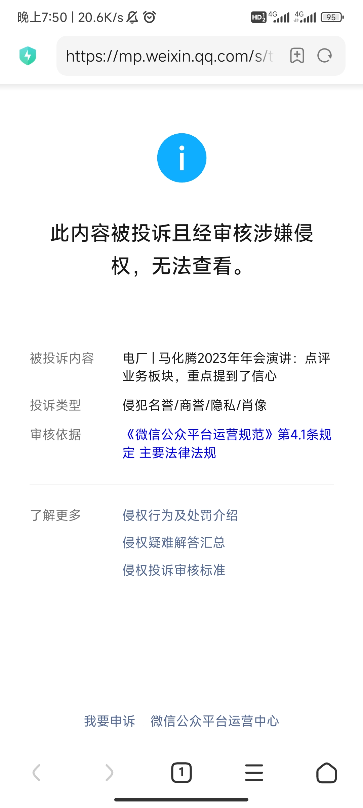

### [破事氵][新闻]马化腾点评腾讯游戏：“毫无建树的感觉”，《元梦之星》要全力以赴

Made by ngapost2md (c) ludoux [GitHub Repo](https://github.com/ludoux/ngapost2md)

----

##### 0.[0] \<pid:0\> 2024-01-29 19:56:56 by 凯鲁亚
1月29日，腾讯在深圳召开公司年会。腾讯董事会主席、CEO马化腾在谈到游戏业务时表示，腾讯游戏好像是躺在成功的功劳簿上，过去一年感觉好像毫无建树，无所适从，虽然推出了新品，但没有想象中那么好。

在谈到腾讯最近两个月大力推广的《元梦之星》时，他表示虽然来得晚，但对腾讯来说，不仅是一款游戏，其偏社交的成分是腾讯的大本营，因此肯定要全力以赴，并且要求所有业务与之结合，探索共同发展。

在谈到游戏出海时，马化腾指出游戏是腾讯国际化的最大希望，接下来要在软件和游戏研发方面横向做透、做扎实，而不是在一个纵深角度跟其他游戏公司或硬件厂商为敌，要找准自己的主业并且聚焦。

----

##### 1.[0] \<pid:740488701\> 2024-01-29 19:57:55 by 凯鲁亚
[url](https://mp.weixin.qq.com/s/tz2kfNPQI-M-n9Xua__D-g)

----

##### 2.[0] \<pid:740489069\> 2024-01-29 20:00:09 by 焚心绚华绘
藤子是真下了大力，也确实是入场晚了。期待春节大战

----

##### 3.[3] \<pid:740489387\> 2024-01-29 20:02:05 by 纸注疏狂
确实毫无建树，发点力来看看

----

##### 4.[0] \<pid:740490242\> 2024-01-29 20:07:14 by 矿泉水放生大师
加大力度抢占新生代市场

----

##### 5.[0] \<pid:740490668\> 2024-01-29 20:10:00 by 第十九扇门的背后
游戏出海，我之前在哪看到的说是游戏行业内部消息来着？

----

##### 6.[0] \<pid:740490981\> 2024-01-29 20:11:57 by 巴基和比约恩
元梦是社交游戏大本营 笑死 果然是被偷家了所以急的
蹲着看春节大战  
所以只有23年被挑战了，前面都不算吗藤子？！

----

##### 7.[0] \<pid:740491217\> 2024-01-29 20:13:32 by abasiyaluo2
大本营那应该多拿点新东西出来啊，只是对标友商可抢不来人

----

##### 8.[0] \<pid:740491364\> 2024-01-29 20:14:25 by 我不会。
>[jump](#pid740490981) 巴基和比约恩(2024-01-29 20:11) 说: 
>
>元梦是社交游戏大本营 笑死 果然是被偷家了所以急的
>蹲着看春节大战  
>所以只有23年被挑战了，前面都不算吗藤子？！

这是2024年的建树吗？太喜欢了，多来点。

----

##### 9.[0] \<pid:740492596\> 2024-01-29 20:22:52 by aisqgl
>[jump](#pid740491364) 我不会。(2024-01-29 20:14) 说: 
>
>编辑：点错了，本来想直接回复的。
>
>这是2024年的建树吗？太喜欢了，多来点。
>
>

握草，猛盒犹也只是在角落偷偷加，藤子直接放画面中间？

----

##### 10.[0] \<pid:740492735\> 2024-01-29 20:23:50 by 别大珂
好光荣啊腾讯的游戏发家史，是怎么一步一步走到今天来着

----

##### 11.[0] \<pid:740493366\> 2024-01-29 20:28:21 by daxi101
自研IP没戏了，接着买新的外国IP乖乖上供版权费吧

----

##### 12.[0] \<pid:740495152\> 2024-01-29 20:41:06 by enashm
一两年前就在说了
最大竞争对手猪厂这几年陆续出了永劫无间，哈利波特魔法觉醒，蛋仔派对，逆水寒手游，燕云十六声。你甭管这些游戏后续运营的怎么样，但至少猪厂证明了自己有连续出爆款的能力，内部是有活力的
鹅厂这边，你能记起的上一个爆款的鹅厂自研是啥时候？就连元梦之星，在那么大宣传力度下最后表现也就那样，内部明显是有问题的，也就是农药和吃鸡的营收护城河太深，能趴在上面偷大懒，但确实是没出新货的能力了

----

##### 13.[3] \<pid:740504766\> 2024-01-29 21:50:01 by jblz4743
农药和吃鸡还能保藤子10年逍遥

----

##### 14.[0] \<pid:740504927\> 2024-01-29 21:51:10 by xxqssh
文章没了

----

##### 15.[0] \<pid:740505458\> 2024-01-29 21:55:13 by 炎弹
王世界能不能给米哈游一个下马威啊

----

##### 16.[0] \<pid:740505480\> 2024-01-29 21:55:24 by 泡泡猪酱
建议发大力，把网易蚕食了，看看到时候谁叫谁爸爸。

----

##### 17.[0] \<pid:740506122\> 2024-01-29 22:00:22 by SSSxSTAR
>[jump](#pid740491364) 我不会。(2024-01-29 20:14):

 
这种就很JB搞笑，他明明可以避免的，但他就不，还要放中间

----

##### 18.[5] \<pid:740506590\> 2024-01-29 22:03:59 by 黑色的玉米粒
丁三石前几年下狠手治理了一下游戏部门，还是有收获的。
藤子的游戏部门早开始梦游了，内部和之前的暴雪差不多。
看b站那个被暴雪裁了的幕刃，藤子内部也不少这种。

----

##### 19.[0] \<pid:740506778\> 2024-01-29 22:05:20 by kiyota119
这两年网易确实有各方面的亮点，腾讯不知道在干啥子

----

##### 20.[0] \<pid:740506925\> 2024-01-29 22:06:24 by HNFTYH
元梦之星写轮眼复制的够快了，才差一年就上了，但没办法，抖音太强了，蛋仔派对靠抖音打下的基础确实抵御了藤子第一波冲击，就看春节这场大战了。

----

##### 21.[0] \<pid:740506985\> 2024-01-29 22:06:56 by coldse
>[jump](#pid740492735) 别大珂(2024-01-29 20:23):

又要开写轮眼了吗

----

##### 22.[0] \<pid:740507364\> 2024-01-29 22:09:28 by 翻翻羊
当初我在一串儿压元梦赢的帖子里压了蛋仔给自己点个赞。

----

##### 23.[1] \<pid:740507538\> 2024-01-29 22:10:53 by 0nE。
>[jump](#pid740506590) 黑色的玉米粒(2024-01-29 22:03) 说: 
>
>丁三石前几年下狠手治理了一下游戏部门，还是有收获的。
>藤子的游戏部门早开始梦游了，内部和之前的暴雪差不多。
>看b站那个被暴雪裁了的幕刃，藤子内部也不少这种。

企鹅的波刚都直接出镜了的，可以去搜搜天刀的那个女的，公款追星，还有实装自己的皮套

----

##### 24.[0] \<pid:740525102\> 2024-01-30 00:31:57 by 金隅
但是也不要吹网易吧，只有逆水寒是他压成功了的，不过估计摆脱不了mmo的曲线，只是慢一点，蛋仔起死回生得莫名其妙，车球顶一小会又下去了，最近那个乙女游戏也是半成品估计马上腰斩，其他游戏营收主体都在降，策划运营更是臭名远扬，我也从yys开始能玩的基本都试一试变成了质疑再质疑。这些游戏还不如交给腾讯

----

##### 25.[0] \<pid:740525559\> 2024-01-30 00:36:18 by 一颗魔法螺丝
不会以为暴雪那个女的是个例吧
越是大厂这种吃白响的人就越多

这种所谓的“精英”不知道有多少人全是混进去的

----

##### 26.[0] \<pid:740526886\> 2024-01-30 00:48:37 by 食发鬼见不到一天
腾讯这几年研发确实有点拉了，新游戏新玩法研发方面感觉不如wy，感觉就像躺在功劳簿上混吃等死一样

----

##### 27.[0] \<pid:740527636\> 2024-01-30 00:56:30 by ohgscn
>[jump](#pid740526886) 食发鬼见不到一天(2024-01-30 00:48) 说: 
>
>腾讯这几年研发确实有点拉了，新游戏新玩法研发方面感觉不如wy，感觉就像躺在功劳簿上混吃等死一样

相比wy这两年的新作不断，tx确实很慢，更别说wy在单机和网游都有发力，多面开花，反观tx还在吃剩饭

----

##### 28.[0] \<pid:740546610\> 2024-01-30 08:26:06 by zwh51262
能看出藤子有点急了，农最近换了一批策划，更新速度就像打了鸡血一样，别管好活烂活总之相比以前至少是在做了，评价为还不错，加大力度

----

##### 29.[0] \<pid:740552577\> 2024-01-30 09:07:55 by Red二媚
自研的逆战现在已经数值迭代到无力回天，bug扎堆，肆意修改道具数据，pvp挂狗横行
举办的比赛还能将观战视角账号投票踢出去
这就是琳琅自研天美运营啊，藤子你赶紧内差吧，一抓一个准

----

##### 30.[0] \<pid:740553452\> 2024-01-30 09:13:02 by WWE女王莱温斯基
>[jump](#pid740546610) zwh51262(2024-01-30 08:26):

别  我还在幻想某一天农药里挂钩遍地呢

----

##### 31.[0] \<pid:740555991\> 2024-01-30 09:27:44 by 鳄鱼力0
苟史元梦，皮肤品质越高，皮肤品质越低
白色品质的衣服能自由搭配自定义表情
橙色品质绑定全身一套外加司马脸
你是懂美工的

----

##### 32.[0] \<pid:740556247\> 2024-01-30 09:28:56 by 阳光低调行事
>[jump](#pid0) 凯鲁亚(2024-01-29 19:56):

帖一条，农现在拉满了，更新速度和之前不是一个量级的。尤其是皮肤方面。不过农的体量过大，招惹的仙女也是顶级的。所以别问NGA为什么没人讨论农，农的社区环境几乎被仙女垄断。比赛KPL也是走的养成偶像那套，一诺就是按头营销的典范，不过集美就吃这一套。喜欢挑战自我的可以去看下一诺微博下面的评论，催吐效果拉满。

----

##### 33.[0] \<pid:740556379\> 2024-01-30 09:29:46 by 元英kuura
还挺中肯的

----

##### 34.[0] \<pid:740557069\> 2024-01-30 09:33:34 by 我不懂饭圈
藤子内部饭圈化也很严重，我真玩LOL和王者，我真看kpl和LOL，~~我真有学姐在藤子~~。

LOL今年流量基本歇逼，躺在功劳簿上躺昏迷了；农倒是蒸，但饭圈化也严重；其他游戏也好不了多少，最典型的天刀组，懂得都懂了，策划直接把自己“美化”后做进去。

----

##### 35.[0] \<pid:740557161\> 2024-01-30 09:34:12 by キキキ気
>[jump](#pid740525102) 金隅(2024-01-30 00:31) 说: 
>
>但是也不要吹网易吧，只有逆水寒是他压成功了的，不过估计摆脱不了mmo的曲线，只是慢一点，蛋仔起死回生得莫名其妙，车球顶一小会又下去了，最近那个乙女游戏也是半成品估计马上腰斩，其他游戏营收主体都在降，策划运营更是臭名远扬，我也从yys开始能玩的基本都试一试变成了质疑再质疑。这些游戏还不如交给腾讯

交给tx就不要太搞笑了吧

代理的命运方舟最近那么大节奏 试探玩家完全不把你当人看 

还在说交给tx实在是搞笑呢  都是半斤八两的策划
网易还有点审美 tx就是灾难

----

##### 36.[0] \<pid:740557326\> 2024-01-30 09:35:06 by Mr_Chen257
>[jump](#pid740489387) 纸注疏狂(2024-01-29 20:02) 说: 
>
>确实毫无建树，发点力来看看

发力？ 是指再抄几个游戏然后加上惊天宣发和买量吗

----

##### 37.[0] \<pid:740558384\> 2024-01-30 09:40:55 by 流火火
>[jump](#pid740525102) 金隅(2024-01-30 00:31):

网易最大的问题是他运营，但是他新游确实这几年能压着tx打，tx除了元梦之星上一个大火的游戏都什么时候了

----

##### 38.[0] \<pid:740559996\> 2024-01-30 09:49:13 by 少封号多积德
网吧三巨头现在是啥情况
只知道 lol被韩国挨个暴打 
毒奶粉搞了波大的
cf完全没存在感

----

##### 39.[0] \<pid:740560228\> 2024-01-30 09:50:26 by 雪人畏冷
路径依赖的腾讯

还是在国内狠狠的割草吧

国外水太深就不要去趟了

----

##### 40.[0] \<pid:740563984\> 2024-01-30 10:09:29 by anda2200
网易主要精力放在游戏上，腾讯摊子拉太大，很难集中精力搞游戏，就算口头吩咐下去，下面照旧阳奉阴违该干嘛干嘛

----

##### 41.[0] \<pid:740598564\> 2024-01-30 12:46:33 by 五零四老五
流水前几名的游戏不已经都是tx的了吗，他还要怎么样啊，真的要彻底实现垄断？

----

##### 42.[0] \<pid:740602330\> 2024-01-30 13:06:23 by 长门有希的游戏
这么一说确实腾讯好久没爆款游戏了，网易这几年出了好几个爆款了吧，虽然后续运营不佳

----

##### 43.[0] \<pid:740602843\> 2024-01-30 13:09:18 by dferxxj
>[jump](#pid740598564) 五零四老五(2024-01-30 12:46) 说: 
>
>流水前几名的游戏不已经都是tx的了吗，他还要怎么样啊，真的要彻底实现垄断？

有危机意识才是对的，既要有老东西爆金币，也要有新接班人，要是只能坐吃山空，那可不是什么好事

----

##### 44.[1] \<pid:740683183\> 2024-01-30 19:45:37 by 金隅
>[jump](#pid740557161) キキキ気(2024-01-30 09:34):

命运方舟我没关注过不做评价，金铲铲呢，英雄联盟呢，穿越火线呢，哪怕qq飞车天天酷跑呢，王者吃鸡都先不谈，其他几个没有人吹突然爆了但是难道不算运营平稳吗，前面几个都算褒义蒸蒸日上吧，后面的老东西也活得好好的。还有wy有审美也是过去式了，yys画风越走越偏我气得上来就是去给新皮肤打低分的，几千的天赏头和卖卡面的游戏还率先用ai人人可骂。

----

##### 45.[0] \<pid:740684019\> 2024-01-30 19:51:09 by jackoker

都锁隐了，可信度

----

##### 46.[0] \<pid:740685227\> 2024-01-30 19:59:18 by shiningmumei
>[jump](#pid740559996) 少封号多积德(2024-01-30 09:49):

还是三巨头，没竞争对手

----

##### 47.[0] \<pid:740687619\> 2024-01-30 20:14:48 by キキキ気
>[jump](#pid740683183) 金隅(2024-01-30 19:45) 说: 
>
>命运方舟我没关注过不做评价，金铲铲呢，英雄联盟呢，穿越火线呢，哪怕qq飞车天天酷跑呢，王者吃鸡都先不谈，其他几个没有人吹突然爆了但是难道不算运营平稳吗，前面几个都算褒义蒸蒸日上吧，后面的老东西也活得好好的。还有wy有审美也是过去式了，yys画风越走越偏我气得上来就是去给新皮肤打低分的，几千的天赏头和卖卡面的游戏还率先用ai人人可骂。

….. 还在英雄联盟呢
外服五块钱的皮肤 国服卖多少？有多少皮肤恶心人

王者现在都不花米玩不到新英雄了

----

##### 48.[0] \<pid:740689838\> 2024-01-30 20:28:01 by woo000
大公司的惯性，老马就算是你也把握不住，一个大的体系下从最高层到拧螺丝的打工人全都急功近利，什么最长的计划就是几个月就要出利润，你炒打工的可以，你还能从最高到最低全炒了？

