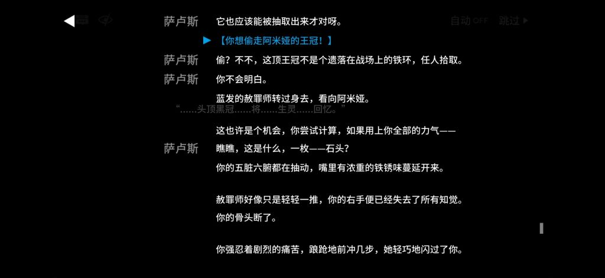
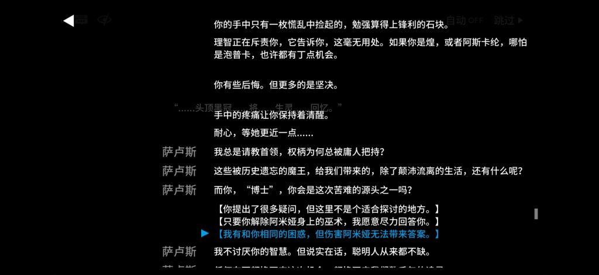

### [杂谈氵] 论棉花游戏的剧情

Made by ngapost2md (c) ludoux [GitHub Repo](https://github.com/ludoux/ngapost2md)

----

##### 0.[12] \<pid:0\> 2024-01-29 20:20:14 by ZYQGZENX
就棉花游戏的剧情而言
也就是棉花们捂嘴捂得严和大家为了反米团结才不对你上称
就你那投石哥布林的文案，遇到解牛者/鱿鱼/贱长排雷的强度

<b>有些事不上称没四两重，上称了一千斤也打不住</b>

----

##### 1.[10] \<pid:740492498\> 2024-01-29 20:22:10 by 好累，想睡
主线除了第八章，没人推荐的含金量，但第八章连着后面一起看是个什么水平我不好说

----

##### 2.[8] \<pid:740492516\> 2024-01-29 20:22:16 by 肯定是假的
那剧情最弱智的就是信息量太低，谜语人汴京就算了
他们BB半天一点有用的东西都没有才是最关键的
就之前吹爆的孤星，前面7关还是老套水字数的故事
就最后一节给了些信息，然后就无了
关键还不少人吹字数多你知道吧，哎呦字数多剧情可好啦

----

##### 3.[3] \<pid:740492704\> 2024-01-29 20:23:37 by asteroidsssss
来人，上9—21

----

##### 4.[5] \<pid:740493123\> 2024-01-29 20:26:41 by rream_kly
确切来讲刺石哥布林，不过其实也没差，其实可以更激烈点的，叫吃屎哥布林，让每个看来剧情的博士心情好似吃了屎的哥布林。

花上百小时，画上上千块钱，抽出来却一个个剧情上装逼给玩家脸色，但是在玩家手中却是没手没脚的巨婴，然后把一群要人喂的巨婴一个个喂到精二专三，结果到了关键时候一个个都不在有自己的生活

----

##### 5.[0] \<pid:740493128\> 2024-01-29 20:26:43 by nextGenerationBell
要上称的话可以去雪吧，雪吧每天高强度上称。

之前主线里的炮弹生产一天还是半天，被雪吧挂的热度挺高，你想要的节奏雪吧绝对不会放过的

----

##### 6.[0] \<pid:740493340\> 2024-01-29 20:28:12 by seiya5924
群像剧，你不是大地的主角，角色有自己的生活，喜欢龙傲天警告

----

##### 7.[9] \<pid:740493680\> 2024-01-29 20:30:36 by 平原兆力使
虽然大家一直在那吹孤星，但说实话可能是我退坑了。我是不怎么喜欢克里斯滕，尤其是看到wb上都在吹她独立伟大，什么火箭发射代表人类的进取，还有她的什么新cp。可那火箭升空去外太空一好像没有什么技术积累，二好像还是花了大量能源和耗材只为了她的开心。我就有点恶心。

----

##### 8.[2] \<pid:740493758\> 2024-01-29 20:31:13 by 鶸萌
一两个月前刺猬猫那边的方舟同人就是以角色有自己的生活为主的，然后投石哥布林也有自己的生活捏

----

##### 9.[0] \<pid:740493843\> 2024-01-29 20:31:54 by 我不会。
>[jump](#pid740493123) rream_kly(2024-01-29 20:26) 说: 
>
>确切来讲刺石哥布林，不过其实也没差，其实可以更激烈点的，叫吃屎哥布林，让每个看来剧情的博士心情好似吃了屎的哥布林。
>
>花上百小时，画上上千块钱，抽出来却一个个剧情上装逼给玩家脸色，但是在玩家手中却是没手没脚的巨婴，然后把一群要人喂的巨婴一个个喂

明日方舟有买过因为剧情演出超神出圈的新闻稿吗？该不会其实自己也知道这剧情写得就一坨，让路人看了直摇头吧。

----

##### 10.[5] \<pid:740493890\> 2024-01-29 20:32:14 by 好累，想睡
>[jump](#pid740493680) 平原兆力使(2024-01-29 20:30) 说: 
>
>虽然大家一直在那吹孤星，但说实话可能是我退坑了。我是不怎么喜欢克里斯滕，尤其是看到wb上都在吹她独立伟大，什么火箭发射代表人类的进取，还有她的什么新cp。可那火箭升空去外太空一好像没有什么技术积累，二好像还是花了大量能源和耗材只为了她的开心。我就有点恶心。

“不要发出不合适的声音”，粥社区是这样的，还得等这群傻逼碰瓷到阿米娅才能青蒜

----

##### 11.[3] \<pid:740494172\> 2024-01-29 20:33:54 by ZYQGZENX
>[jump](#pid740493128) nextGenerationBell(2024-01-29 20:26):

你是没听懂我说的啊
解牛者/鱿鱼2/贱长的强度那是包括B吧，fate系贴吧，2ch吧等所有acg文化相关贴吧，所有二游相关贴吧，nga虎扑等所有论坛开嘲的程度
B站视频和各种p图安排上的强度

----

##### 12.[2] \<pid:740494821\> 2024-01-29 20:38:30 by 桓远
现在的群体都是厕妹波刚呀，那有什么好看的？

2周年红斯卡蒂的剧情看得人昏昏欲睡，告诉我这剧情是好剧情？

除了整合运动的6~8有点好看以外，这游戏的剧情没几个好看的。

信息熵这么低

----

##### 13.[1] \<pid:740495173\> 2024-01-29 20:41:15 by 平原兆力使
>[jump](#pid740493890) 好累，想睡(2024-01-29 20:32) 说: 
>
>“不要发出不合适的声音”，粥社区是这样的，还得等这群傻逼碰瓷到阿米娅才能青蒜

阿米娅剧情里的出场次数其实也挺少的。只能说不会写就不要去写

----

##### 14.[0] \<pid:740495541\> 2024-01-29 20:43:57 by 好累，想睡
>[jump](#pid740495173) 平原兆力使(2024-01-29 20:41) 说: 
>
>阿米娅剧情里的出场次数其实也挺少的。只能说不会写就不要去写

阿米娅塑造也就那样，普普通通，从开服就能一眼望到底的人设，和其他力捧成功的不是一个水平

----

##### 15.[0] \<pid:740497163\> 2024-01-29 20:55:42 by cimaka
舟有部分ss单独拿出来其实还是不错的，至少从故事节奏、故事完整度和故事立意的角度来看可读性还是比较不错的，比如长夜、画中人和风雪，但吹上天的孤星在我这评价其实比较低，虽说主题是想向星辰大海和文明前进上靠，但克里斯滕的主要动力和人类文明进步还是有偏差，对比下战双的绝海星火可以说在立意上的差距非常明显。星辰大海可以绝对理性可以不当人，但主观动力如果不够“宏大”在我这就是差一筹，缺少了文明层次上的浪漫，在人类文明进步的主题里你搞什么“个人无意的一步却是人类文明的一大步”我觉得格局很低。

舟你要说群像剧很优秀那我只能说这可太群像了，主线拽不住支线的群像也是群像的话，群像含金量也太低了。

说具体点，马丁的冰与火之歌所有的人和事都围绕铁王座和异鬼两条线展开，而另一个参考玄鉴仙族的主题“家族修仙”，再对比下舟的群像，基本一眼就能看出问题所在。

----

##### 16.[0] \<pid:740497438\> 2024-01-29 20:57:34 by nextGenerationBell
>[jump](#pid740494172) ZYQGZENX(2024-01-29 20:33):

那能沾边的只有缪缪小贾了，当初仙高强度刷了一阵，后来可能觉得没意思就改刷弓弓了。

别的再挖也不好挖，虽然粥cp党极多，但是剧情里情爱描写极少，就那一点还集中于npc，被经常车的赫德雷伊内丝cp最早也是npc。剩下的整天不是这片大地就是人类苦难，唯一一个有星域的小兵还是玩的fsn声优梗。

----

##### 17.[2] \<pid:740504541\> 2024-01-29 21:47:55 by 游戏中年人
>[jump](#pid740493843) 我不会。(2024-01-29 20:31) 说: 
>
>明日方舟有买过因为剧情演出超神出圈的新闻稿吗？该不会其实自己也知道这剧情写得就一坨，让路人看了直摇头吧。

买过机核的推广吧，我退坑那会还在机核看到了那几个玩单机的捏着鼻子吹明日方舟

----

##### 18.[2] \<pid:740504778\> 2024-01-29 21:50:06 by 平原兆力使
>[jump](#pid740497163) cimaka(2024-01-29 20:55):

粥的群像剧确实挺怪的。一般的群像剧总会有一个详细的枝干，但粥的就感觉飘忽不定。虽然常常有人把这片大地作为主角，但说实话把故事舞台当枝干有点搞。

----

##### 19.[0] \<pid:740505131\> 2024-01-29 21:52:38 by 袁卫英
最近几年的几个游戏玩下来只能说好歹是个有skip的正常游戏吧，不如说剧情垃圾的二游多了去了，剧情再垃圾只要能skip，就会有部分玩家是完全不关心剧情的，抽卡只看立绘、强度和cv，剧情里变成小丑变成路人变成绞肉机变成公交车rbq什么的都无所谓，反正不看剧情

----

##### 20.[0] \<pid:740505709\> 2024-01-29 21:57:07 by 至尊亚历山大
skip键救了它的水平

----

##### 21.[1] \<pid:740506290\> 2024-01-29 22:01:52 by neverlands1
将进酒解读
[url](https://b23.tv/gzlGWx5)

----

##### 22.[3] \<pid:740506597\> 2024-01-29 22:04:04 by 虚无丶冥王
剧情那股子“话剧风”几年了都没见收敛，所以需要大量字数才能勉强讲明白一个故事，结果还是端出崔金这么一坨

博士也真心建议删了。牛皮吹的震天响，驴稍微磕碰着，什么恶灵棋手的标签全丢了，变成个只会哇哇乱叫的低能，然后别的角色都在忙自己的生活，玩家就只能忍着恶心看小丑的独角戏

----

##### 23.[1] \<pid:740506776\> 2024-01-29 22:05:20 by ZYQGZENX
>[jump](#pid740505131) 袁卫英(2024-01-29 21:52):

烫知识，鱿鱼2的剧情也可以skip
除了O会跳过人生外，剧情能skip并不能构成洗白/剧情没问题的条件

----

##### 24.[0] \<pid:740506880\> 2024-01-29 22:06:01 by -河里炭-
yysy 剧情很低能 到处致敬抄袭 
结果被吹封神

----

##### 25.[0] \<pid:740507222\> 2024-01-29 22:08:33 by 好累，想睡
>[jump](#pid740506290) neverlands1(2024-01-29 22:01) 说: 
>
>将进酒解读
>[url](https://b23.tv/gzlGWx5)

属于看懂了将进酒没看懂yj，yj表明了不敢碰红线键政的态度，耐不住世界观吸引过来的键政人，鹰得的，得自己受着

----

##### 26.[0] \<pid:740507544\> 2024-01-29 22:10:54 by 零九二五0925
>[jump](#pid740497163) cimaka(2024-01-29 20:55):

粥的群像剧摊子铺的极其之大，拿冰与火之歌作比喻就是九大家族加铁王座加异鬼各一条线，这还不够，还要再加九大贸易城邦、多斯拉克人、被多斯拉克人终结的诸多古代文明、奴隶湾、瓦雷利亚和魁尔斯再各一条线
不过这也有好处，就是写方舟同人的时候完全可以想写啥写啥，选择特别多写起来特别自由

----

##### 27.[0] \<pid:740507690\> 2024-01-29 22:11:51 by 尚未转职枪兵的幸运E
>[jump](#pid740506597) 虚无丶冥王(2024-01-29 22:04) 说: 
>
>剧情那股子“话剧风”几年了都没见收敛，所以需要大量字数才能勉强讲明白一个故事，结果还是端出崔金这么一坨
>
>博士也真心建议删了。牛皮吹的震天响，驴稍微磕碰着，什么恶灵棋手的标签全丢了，变成个只会哇哇乱叫的低能，然后别的角色都在忙自己的生活，玩家就只能忍着恶心看小丑的独角戏

这个也正常，因为千年也这样。玩了这么多年我也没搞懂王子到底干了啥，只知道他到哪就草到哪了

----

##### 28.[0] \<pid:740508891\> 2024-01-29 22:20:26 by 袁卫英
>[jump](#pid740506776) ZYQGZENX(2024-01-29 22:05):

鱿鱼2的褒姒可不止是剧情雷造成的啊，要玩法玩法坐牢，要福利福利没有，自家论坛容不得一局抱怨，就算丁点剧情不看你也躲不开星和犹相关的美术私货，真的完全只是剧情问题？

----

##### 29.[0] \<pid:740508941\> 2024-01-29 22:20:48 by 开疆拓宇
>[jump](#pid740494821) 桓远(2024-01-29 20:38):

虽然但是，二周年深海剧情差是公认的

----

##### 30.[0] \<pid:740509419\> 2024-01-29 22:24:44 by 开疆拓宇
>[jump](#pid740492516) 肯定是假的(2024-01-29 20:22):

粥剧情之前最难绷的可能就是为了配合关卡的战斗，总要加一些可有可无的冲突，比如敌人又追上来了，敌人又双叒叕追上来了

----

##### 31.[0] \<pid:740509421\> 2024-01-29 22:24:46 by 桓远
>[jump](#pid740508941) 开疆拓宇(2024-01-29 22:20):

反正对我来说，那个剧情就是让我退坑的根源。

看的要睡觉，之后的剧情缺了一点也不想补了，渐渐地就退坑了。

----

##### 33.[2] \<pid:740511761\> 2024-01-29 22:42:24 by GrayLetters
方舟的剧情风评能那么好那是因为绝大多数的方舟玩家都算skip党，你不会真以为方舟那又臭又长的文案一般人会看得下去吧？就是剧情强如FGO，人家官方都说过大多数玩家剧情都是skip的。
绝大多数玩家对方舟剧情的了解都是从B站的方舟剧情UP那得来的，人家那剧情UP真的是把那冗长的剧情文案理清楚，剔除垃圾的部分，挑好的部分嚼碎了喂给方舟萌萌人的，在方舟萌萌人眼里方舟的剧情当然就好了，因为他们看到的东西本来就都是剧情UP有意二次加工过后的产物。
我一直觉得一个三观正常，有独立思考能力的人在认真看完方舟剧情后应该是很难喜欢凯尔希这个老女人的，而凯尔希能在粥粥人里人气那么高真的全是拜杨颜这人把凯尔希美化成“前妻”所赐

----

##### 34.[3] \<pid:740512276\> 2024-01-29 22:46:22 by magicjhf
>[jump](#pid740508891) 袁卫英(2024-01-29 22:20):

有一说一，你不觉得你刚刚说的这些内容恰好符合么？

----

##### 35.[3] \<pid:740514696\> 2024-01-29 23:05:33 by 不知道存不存在的用户名
>[jump](#pid740504778) 平原兆力使(2024-01-29 21:50):

因为它根本不是群像啊

你见过 一章一个主角然后基本不再出现，下一章又出来个全新的人物当主角，不仅这两段剧情之间没什么联系，而且这种新增还是随着游戏年龄的增长肉眼可见的无上限 这样的群像吗？

与其说这摊稀得是群像，不如说它正在用一种小白文剧情写不下去的时候常见的解决方法——换地图，只不过它为了卖卡同时还换掉了主角罢了

当然，对粥的目标用户来说它也不需要是真的群像，只要有这个名头满足哇我们好有文学性好高端和龙傲天故事不一样 的心理需求就行了

----

##### 36.[2] \<pid:740515644\> 2024-01-29 23:13:13 by 袁卫英
>[jump](#pid740512276) magicjhf(2024-01-29 22:46):

那我只能说恨鱿鱼2没能生在19年，早几年开服哪会是这b样？还有，鱿鱼2还得在游戏里加点男人才行，不然就没有xxnbw兢兢业业地干活了

----

##### 37.[4] \<pid:740515967\> 2024-01-29 23:15:57 by 平原兆力使
>[jump](#pid740514696) 不知道存不存在的用户名(2024-01-29 23:05):

确实，主要是每次看到b站还有贴吧那边有孝子拿三国演义和水浒传来碰瓷他们所爱的粥剧情，就挺难崩的。粥感觉是挺普通的二游剧情水平吧，

----

##### 38.[5] \<pid:740516068\> 2024-01-29 23:16:50 by 蓝冰·白夜
大家都在骂舟的剧情- -...那我反其道而行之吧,有没有舟玩家能推荐一下,你们觉得舟这几年下来写得最好的剧情- -...我去看一下天花板到底是个什么水平- -.

如果刚需前置铺垫麻烦一并说一下- -...最好是独立成篇不需要看其他铺垫预热的- -.只要带铺垫的和不带铺垫的差距在1分以内,就优先不带铺垫的- -.

----

##### 39.[2] \<pid:740516580\> 2024-01-29 23:20:39 by 不知道存不存在的用户名
>[jump](#pid740515967) 平原兆力使(2024-01-29 23:15):

碰水浒是真让人蚌埠住

水浒武十回，林十回，鲁十回，宋十回立住了多少人物形象。

粥别说立住人物形象了，就你这个博士一百回里作为主角出场能有十回吗哦，抱歉，连提到名字加在一起才7%啊

----

##### 40.[1] \<pid:740516722\> 2024-01-29 23:21:44 by 荣光之音
>[jump](#pid740515967) 平原兆力使(2024-01-29 23:15) 说: 
>
>确实，主要是每次看到b站还有贴吧那边有孝子拿三国演义和水浒传来碰瓷他们所爱的粥剧情，就挺难崩的。粥感觉是挺普通的二游剧情水平吧，

首先xxn4000+，然后我觉得不如世界级剧情再度超神

----

##### 41.[6] \<pid:740516749\> 2024-01-29 23:21:57 by 我老婆是个死宅
如果是几天前，敢说哥布林这三个字，要不了50楼就得有人进来考考你了同时还会帮你手机自动下载某些游戏

----

##### 42.[0] \<pid:740517531\> 2024-01-29 23:27:36 by ljn23500
>[jump](#pid740516749) 我老婆是个死宅(2024-01-29 23:21) 说: 
>
>如果是几天前，敢说哥布林这三个字，要不了50楼就得有人进来考考你了同时还会帮你手机自动下载某些游戏

哥布林是啥

----

##### 43.[0] \<pid:740517838\> 2024-01-29 23:30:05 by 东方谷早苗
>[jump](#pid740507544) 零九二五0925(2024-01-29 22:10):

粥的群像更多的是国家/地区的群像吧。每个地区都有自己的主题。每个地区的人物性格简直像星座书对星座性格描述的一样都能套在一个模板里。然后如果a地区的人跑到b地区就会出现xx星座的上升星座xx一样，兼有ab两个地区的主题风格。

----

##### 44.[0] \<pid:740518478\> 2024-01-29 23:34:52 by 尚未转职枪兵的幸运E
>[jump](#pid740517531) ljn23500(2024-01-29 23:27):

好像是说博士智酱人设崩塌了？

----

##### 45.[0] \<pid:740518937\> 2024-01-29 23:38:57 by 零九二五0925
>[jump](#pid740517838) 东方谷早苗(2024-01-29 23:30):

~~国家/地区刻板印象大杂烩是吧~~
这也是方舟同人文好写的一个原因，完全可以根据现实刻板印象和一点方舟基础世界观设定自创一个城市和一些角色写自己想写的故事，穿插几个游戏人物就算一篇同人文了

----

##### 46.[0] \<pid:740518953\> 2024-01-29 23:39:02 by 好累，想睡
>[jump](#pid740516068) 蓝冰·白夜(2024-01-29 23:16) 说: 
>
>大家都在骂舟的剧情- -...那我反其道而行之吧,有没有舟玩家能推荐一下,你们觉得舟这几年下来写得最好的剧情- -...我去看一下天花板到底是个什么水平- -.
>
>如果刚需前置铺垫麻烦一并说一下- -...最好是独立成篇不需要看其他铺垫预热的- -.只要带铺垫的和不带铺垫的差距在1分以内,就优先不带铺垫的- -.

最合适应该是火山旅梦吧，比较温馨的一个故事，prts看看艾雅法拉，诗怀雅，锡兰，拜松的人物档案就能看了

----

##### 47.[3] \<pid:740519335\> 2024-01-29 23:42:21 by Linde1997
我突然想到一个月前在还在手综一个帖子里，看到一堆人吹自己是什么大地党，我之前听都没听过，一看是玩粥的。感觉和什么硬核不媚宅一样，鉴定为装B

----

##### 48.[0] \<pid:740519394\> 2024-01-29 23:42:50 by 平原兆力使
>[jump](#pid740516722) 荣光之音(2024-01-29 23:21):

圆的话，确实是更搞笑，尤其是阴湿文案一边暗搓搓得黑人，一边又叫孝子们吹太细了，米桑太细了

----

##### 49.[0] \<pid:740519637\> 2024-01-29 23:44:40 by ZYQGZENX
怎么后排棉花们团建起来了
你们是什么牛皮鲜吗

----

##### 50.[4] \<pid:740519720\> 2024-01-29 23:45:28 by 平原兆力使
>[jump](#pid740519335) Linde1997(2024-01-29 23:42):

大地党其实就是以前少前的剧情党设定党。但其实是有一大批孝子披着剧情党设定党的皮来高高在上规训其他玩家。

----

##### 51.[1] \<pid:740520358\> 2024-01-29 23:50:43 by 9343260317I
我tm版本都跟不上.jpg
为什么把那个叫棉花？

----

##### 52.[1] \<pid:740520568\> 2024-01-29 23:52:25 by rream_kly
>[jump](#pid740519720) 平原兆力使(2024-01-29 23:45):

然后一看设定集(这里指第一版)，发现毫无关于大地有价值的信息，既没有介绍有不同国家的背景，也没有介绍其他的政治实体，也没有介绍历史，连一份世界地图都没有，发现所谓的背景不过是想到哪编到哪不知道后面接手的文案有没有找补，不过反正再找补，我是不会再回去了，我可再也不想被鹰角当成sm对象玩看录像惩罚耐久游戏了

----

##### 53.[2] \<pid:740520780\> 2024-01-29 23:54:02 by Linde1997
>[jump](#pid740519720) 平原兆力使(2024-01-29 23:45) 说: 
>
>大地党其实就是以前少前的剧情党设定党。但其实是有一大批孝子披着剧情党设定党的皮来高高在上规训其他玩家。

谢谢科普，之前没接触过粥，对粥的认知还停留在第二定律，这下刻板印象+1了

----

##### 54.[1] \<pid:740521336\> 2024-01-29 23:58:25 by c-mood
>[jump](#pid740504778) 平原兆力使(2024-01-29 21:50) 说: 
>
>粥的群像剧确实挺怪的。一般的群像剧总会有一个详细的枝干，但粥的就感觉飘忽不定。虽然常常有人把这片大地作为主角，但说实话把故事舞台当枝干有点搞。

因为舟剧情根本不是群像剧，他那个是p着群像皮的单元剧，这个论点说过很多次了。
不是人多就配叫做群像剧的，更何况舟在大多数情况下是靠着描写不同地区而达成的伪·人多。如果说把他那剧情掰开了，揉碎了，一五一十仔细分开来看，你会发现在不同的时刻和不同的地区是存在绝对主角的，而且比重明显跟其他人不一样，待遇也截然不同，某种意义上称之为龙傲天也不为过。

----

##### 55.[4] \<pid:740521667\> 2024-01-30 00:00:51 by 平原兆力使
>[jump](#pid740521336) c-mood(2024-01-29 23:58):

我知道，只不过之前孝子们常常拿三国演义和水浒传来碰瓷吹自己群像剧，才说他的群像剧不及格

----

##### 56.[1] \<pid:740521919\> 2024-01-30 00:03:10 by 弗罗西诺内
舟版集美标记，出现7次

----

##### 57.[6] \<pid:740525101\> 2024-01-30 00:31:55 by blranger
坦白地讲开服的时候粥游这东西的剧情世界观是属于超市赠品级别，本质是个画师大oc集合，我是不觉得真详细设定的世界观与剧情会出现武器照抄现实品牌，干员档案跟着抄的情况，剧情初期也就是那种画师oc自嗨的级别，转机的话主要在长夜临光吧，起码看出来写的是个专业的，博士形象与地位也是长夜临光与风雪过镜开始抬头，不过后来又按回去了，估计还是画师oc的电阻更高，咧嘴谷当时预告时还有一堆人期待博士能有些篇幅，现在回来再看也是难绷

----

##### 58.[0] \<pid:740526105\> 2024-01-30 00:41:20 by fervent987
>[jump](#pid740521919) 弗罗西诺内(2024-01-30 00:03) 说: 
>
>舟版集美标记，出现7次

？？？这贴里都没几个人说话是怎么出现七次的，这个统计是帖子数还是人头数啊 别吓我

----

##### 59.[0] \<pid:740526242\> 2024-01-30 00:42:40 by 弗罗西诺内
>[jump](#pid740526105) fervent987(2024-01-30 00:41) 说: 
>
>？？？这贴里都没几个人说话是怎么出现七次的，这个统计是帖子数还是人头数啊 别吓我

有七层楼是有这个标记的,不是七个人

----

##### 60.[0] \<pid:740526503\> 2024-01-30 00:45:00 by 平原兆力使
>[jump](#pid740526242) 弗罗西诺内(2024-01-30 00:42) 说: 
>
>有七层楼是有这个标记的,不是七个人

啊，我就是第七楼

----

##### 61.[6] \<pid:740526531\> 2024-01-30 00:45:16 by 就是百宝袋
>[jump](#pid740526242) 弗罗西诺内(2024-01-30 00:42) 说: 
>
>有七层楼是有这个标记的,不是七个人

集美们这么哈人是吧，一边在那边说不想看手综，一边又要硬凑上来吹你的粥

----

##### 62.[3] \<pid:740526618\> 2024-01-30 00:46:08 by 弗罗西诺内
>[jump](#pid740526503) 平原兆力使(2024-01-30 00:45) 说: 
>
>啊，我就是第七楼

呃,不是第七层,是七个不同的楼层

----

##### 63.[8] \<pid:740526857\> 2024-01-30 00:48:19 by 就是百宝袋
第二定律不就是形容粥的典中典角色有自己生活，反正我周围要不就是全跳，要不看剧情的普遍都喜欢磕cp。

----

##### 64.[0] \<pid:740527046\> 2024-01-30 00:50:25 by ZYQGZENX
>[jump](#pid740526618) 弗罗西诺内(2024-01-30 00:46):

介意指出来吗，让我也标记一下
如果危险就算了， 安全为上

----

##### 65.[0] \<pid:740527291\> 2024-01-30 00:53:05 by 弗罗西诺内
>[jump](#pid740527046) ZYQGZENX(2024-01-30 00:50) 说: 
>
>介意指出来吗，让我也标记一下
>如果危险就算了， 安全为上

等调查员复活,会有link的。集美们也不是特别没礼貌,我以后只会说次数,不会点名。

----

##### 66.[0] \<pid:740527503\> 2024-01-30 00:55:13 by 尚未转职枪兵的幸运E
>[jump](#pid740525101) blranger(2024-01-30 00:31) 说: 
>坦白地讲开服的时候粥游这东西的剧情世界观是属于超市赠品级别，本质是个画师大oc集合，我是不觉得真详细设定的世界观与剧情会出现武器照抄现实品牌，干员档案跟着抄的情况，剧情初期也就是那种画师oc自嗨的级......

这个大概也是和千年学的，千年的乱七八糟势力非常多。看板娘更是北方大国的公主，然后这个大国到现在总计出了应该不到五个角色来着(这游戏各类有名有姓的角色已经上千人了，不过大多数除了自己的剧情内查无此人的程度)。游戏内公主的宝剑也全是幻想中的剑，技能名字里头有写叫啥。千年的王子在活动剧情里绝大多数情况都是不说话的，只有政务官安娜在说话。

----

##### 67.[1] \<pid:740529278\> 2024-01-30 01:17:12 by Campanula※
能skip，赢！

----

##### 68.[1] \<pid:740530603\> 2024-01-30 01:33:29 by Maxwell039
群众都是愚昧的，都需要精英们的救赎和开导，凡是推动剧情大步前进的角色，不是种族牛逼就是有各种buff，主角团辩经辩不过对方打也打不过对方，最后只能靠爆种来取得胜利。这种血统论至上，充满小资自我感动的世界观也不知道键政小鬼怎么敢称是“人民史观”并碰瓷康米的。

