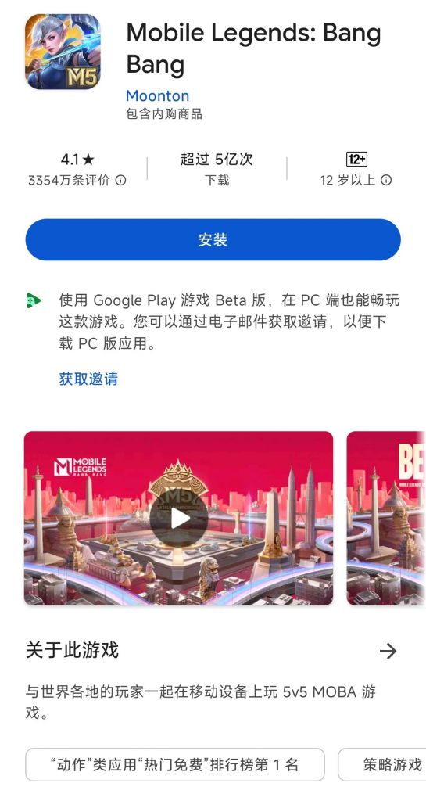
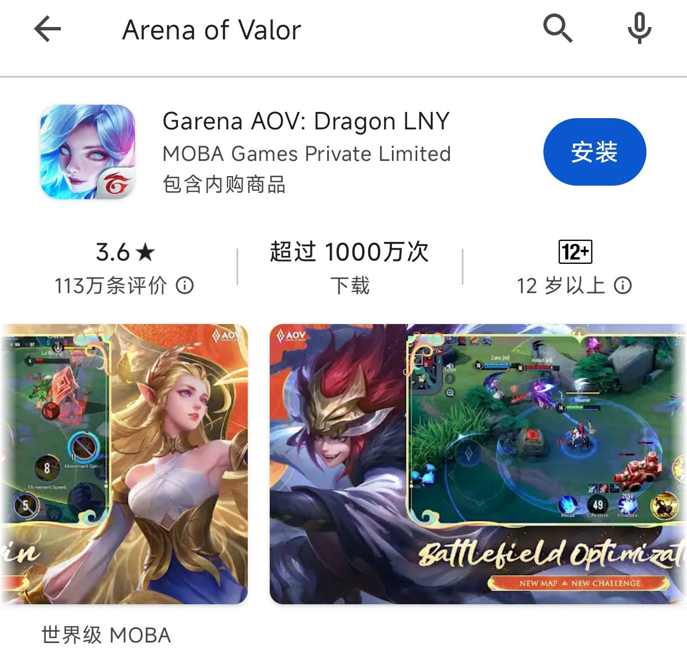

### [破事氵] 没了渠道优势的tx什么水平？

Made by ngapost2md (c) ludoux [GitHub Repo](https://github.com/ludoux/ngapost2md)

----

##### 0.[0] \<pid:0\> 2024-01-29 23:21:14 by gajz22
比如tx要出海游戏，qq和微信p用没有

----

##### 1.[0] \<pid:740517041\> 2024-01-29 23:24:00 by 蓝梦公司
买一堆外国公司，靠穷举法

----

##### 2.[0] \<pid:740517116\> 2024-01-29 23:24:33 by whitewine
把软件当服务业，tx在服务业打不过海外大厂那毫无疑问的。肯定还是本地人更会服务本地人，更别说文化滤镜。但再怎么说，tx做的还是服务业。

----

##### 3.[1] \<pid:740517204\> 2024-01-29 23:25:10 by 明日下山
有钱一切好说的水平

~~你的超能力是什么？   ——有钱。~~

----

##### 4.[0] \<pid:740517323\> 2024-01-29 23:26:03 by 流炎丶望月
没有渠道优势的情况腾讯的海外代表游戏公司不就是拳头吗？拳头什么水平嘛也就那样.

----

##### 5.[0] \<pid:740517572\> 2024-01-29 23:27:54 by poiclear
>[jump](#pid740517323) 流炎丶望月(2024-01-29 23:26) 说: 
>
>没有渠道优势的情况腾讯的海外代表游戏公司不就是拳头吗？拳头什么水平嘛也就那样.

拳头不算大厂？我看拳头手底下不是有两款爆品吗

----

##### 6.[0] \<pid:740517588\> 2024-01-29 23:28:01 by orange淞鸦
LOL的水平，天刀的水平
总之就是买公司抽卡吧
玩法吃网易屁股但是把网易吃掉了

----

##### 7.[0] \<pid:740517664\> 2024-01-29 23:28:43 by 鬼岛巨人一米四
你不会忘了tx本质上是渠道公司，而不是什么游戏公司了吧？

----

##### 8.[0] \<pid:740517696\> 2024-01-29 23:28:56 by 爱姆汉德桑
他有钞能力啊

----

##### 9.[0] \<pid:740517782\> 2024-01-29 23:29:36 by 好累，想睡
藤子有钱啊，能拒绝藤子的大钞票的海外也没多少吧

----

##### 10.[0] \<pid:740517910\> 2024-01-29 23:30:36 by 霸瞳天星
腾子不出海，只会给外国游戏厂大撒币~~眼光只能说一般，期货成功的也就拉瑞安还不是最大股东，拳头已经是lol做出来之后才投资的~~

----

##### 11.[0] \<pid:740518087\> 2024-01-29 23:31:54 by 奸奇至尊巫师
他有钱，直接把各路大厂投个遍，你就说算不算腾讯的影响范围吧

----

##### 12.[0] \<pid:740518092\> 2024-01-29 23:31:58 by 纸注疏狂
>[jump](#pid740517572) poiclear(2024-01-29 23:27):

认真来说，拳头的lol只是在国内和韩国算的大爆，不然也不会一直是中韩对抗赛。
瓦没玩过不清楚。

----

##### 13.[0] \<pid:740518576\> 2024-01-29 23:35:41 by 流炎丶望月
>[jump](#pid740518092) 纸注疏狂(2024-01-29 23:31):

LOL曾经在欧美也是大爆,不过成绩太烂了慢慢就凉了.
就算在21年LOL(含云顶)月活跃玩家数量是1.8亿.近10年来稳稳的世界第一端游.

----

##### 14.[1] \<pid:740518816\> 2024-01-29 23:37:48 by 出云琥珀
一坨狗屎，属于狂抄加买广撒网，然后国服特供活动捞钱，属于以量取胜的那种，捞到一个爆款就赚，没捞到让对手少一个选择也不亏的这种，但是大部分成绩都不怎么样

----

##### 15.[0] \<pid:740519189\> 2024-01-29 23:41:00 by 东方谷早苗
>[jump](#pid740517572) poiclear(2024-01-29 23:27):

拳头高情商叫深耕王牌产品，低情商叫10年只端的出一个瓦洛兰特。
端游界的尾气厂。

----

##### 16.[0] \<pid:740519669\> 2024-01-29 23:44:58 by 乌拉旗舰号
没有微信和QQ，王者在国外是打不过沐瞳的无尽对决的水平

----

##### 17.[0] \<pid:740519734\> 2024-01-29 23:45:34 by lleevvin
ea的水平

----

##### 18.[0] \<pid:740520403\> 2024-01-29 23:51:02 by 流炎丶望月
>[jump](#pid740519189) 东方谷早苗(2024-01-29 23:41):

其实这10年真正的产品是抄自走棋出的云顶之弈，让LOL第二春.

----

##### 19.[1] \<pid:740520582\> 2024-01-29 23:52:33 by Calliope-Ange
有些人是不是不知道level infinite是腾讯马甲

----

##### 20.[0] \<pid:740520796\> 2024-01-29 23:54:09 by hantangmeng1
天使投资人

今年tga最佳游戏《博德之门3》的开发商拉瑞安，就有腾讯的注资。

----

##### 21.[0] \<pid:740521131\> 2024-01-29 23:56:59 by Stghost097
海外的腾讯更接近一个仁慈版的维旺迪吧，自己不做也不发行游戏(除了直系工作室搞的IP衍生作)，但是作为资本方控股开发商和部分渠道、收购IP搞衍生品来参与行业

类似维旺迪的资本公司其实21世纪初的北美/欧洲游戏产业有不少，只不过慢慢地专业开发商/发行商自身积累了足够的资本(再加上资本公司普遍不干人事)就把这批人挤出了，腾讯过于有钱又愿意给比较宽松的条件所以成了少数的例外。

