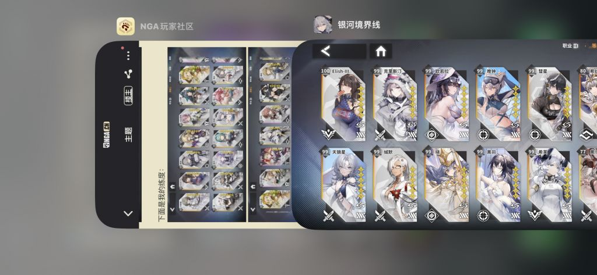

### [安利] 看了那么久烧钱2，还是忍不住安利一下银河境界线

Made by ngapost2md (c) ludoux [GitHub Repo](https://github.com/ludoux/ngapost2md)

----

##### 0.[0] \<pid:0\> 2024-01-29 23:49:35 by 南瓜头茶壶
羽中所有做错了的东西，银河境界线都有现成的答案。
只证明一件事：不是xcom系转手游有问题，是羽中菜。

简单介绍一下：
itb+火纹+xcom系统

同样是分职业，但绝大部分同职业角色都有共通基础特性，可替换性非常高
比如大部分的前锋都有攻击后再动，大部分的哨兵都具有无视威胁范围/不造成威胁范围，飞行的特性等等
而每个角色好感50以后(非常容易达到，几乎白送)就可以开启专属武器

专属武器每2级1个配件槽位，最多3个槽位
配件分1-3级，主要获取方式是基地8小时挂机生产*3，大部分机制都可以在配件里找到
包括但不限于复活，第一回合免死，再动，增加移动/攻击范围，先制追击，增加控制时间，对特定职业特攻，生命吸取/回复等等

3-5星角色全部可以通过免费的公共招聘抽到，6星限定结束入常驻。
同时练角色非常容易，30/60级两次突破就可以开满所有功能，60级以上只增加少量属性，命座只增加少量属性
没有强行通过天气逼迫玩家分队的做法，解题思路非常自由

角色成长率被压的很低，满配角色几乎没有超过400血量的，让战棋的感觉非常足
所以我真心推荐大家来试试银河境界线，然后看看烧钱2做出来的到底是个什么战棋

----

##### 1.[0] \<pid:740520801\> 2024-01-29 23:54:14 by 咸鱼34337435
信赖值不是25解锁角色武器吗，另外公招能出6  
然后目前战棋手游里轻量化确实银河是不错的。

----

##### 2.[0] \<pid:740522199\> 2024-01-30 00:05:48 by 南瓜头茶壶
>[jump](#pid740520801) 咸鱼34337435(2024-01-29 23:54):

谢谢，记反了，已经改过来了
6星我是真没欧到出过所以以为没有，5星倒是出了好多了

----

##### 3.[2] \<pid:740522589\> 2024-01-30 00:08:51 by 星姐专用检疫合格章
但是羽中参照的是原神啊

----

##### 4.[2] \<pid:740522658\> 2024-01-30 00:09:36 by 浮世之华
被一众牛鬼蛇神搞怕了，想先问几个问题
1.抽卡压力大吗？一个池子多少保底，一个版本几个池子，能拿多少抽
2.体力够用吗
3.肝吗
4.有无pvp，如果有，pvp给的资源多吗，如果没有，那有没有排行榜这一类东西存在，如有，是否影响资源获取
5.关卡难度高吗，是否有高难，如有，高难收获的资源多吗
6.剧情犯病吗
7.如果入坑，推荐自建还是初始
大致想问的就这些，有空的话，麻烦大佬简单回复一下

----

##### 5.[0] \<pid:740522861\> 2024-01-30 00:11:12 by 装甲空母大凤号_
男人呢？  有男不玩

----

##### 6.[0] \<pid:740522947\> 2024-01-30 00:11:57 by 若你听歌可眼红
能活下去么，我看雾境序列上半年就该埋了，千年之旅今年可能也会埋了

----

##### 7.[0] \<pid:740523132\> 2024-01-30 00:13:37 by ZGDX夜
你确定被烧钱2恶心的用户是奔着玩法去玩烧钱2的吗

----

##### 8.[0] \<pid:740523257\> 2024-01-30 00:14:48 by 浮世之华
>[jump](#pid740522861) 装甲空母大凤号_(2024-01-30 00:11) 说: 
>
>男人呢？  有男不玩

没记错的话应该是有的，之前出的时候，我就因为有男角色，担心搞两头恰的操作没入坑，想着要不等少前二，然后少前二爆了，这游戏也忘记了，最后入了xcom

----

##### 9.[0] \<pid:740523462\> 2024-01-30 00:16:45 by 电脑玩家mens
tap上看到过，本来以为是全女，结果有极低比例的男角色现在已经不想碰这种了，只能说有男不玩

----

##### 10.[1] \<pid:740523602\> 2024-01-30 00:18:00 by 茂盛的植物
剧情犯病吗
手游玩法就不必说了
哦，有男人啊。那怕是两头恰

----

##### 11.[0] \<pid:740523886\> 2024-01-30 00:20:40 by sal0814
有男不玩

----

##### 12.[1] \<pid:740523969\> 2024-01-30 00:21:34 by 南瓜头茶壶
>[jump](#pid740522658) 浮世之华(2024-01-30 00:09):

1-这个很难回答，6星你如果想白嫖拿全肯定是不现实的，但是因为3-5星功能齐全，实际上没那么大压力，更何况成长率压的很低，所以脑部乘区上限可以很高
2-够用，作为月卡党开服到现在我都拉了起码15个60，甚至还有闲钱去拉75
3-不肝，不想打任务的话3倍扫荡录像金币/经验本90体力一次，早晚看2次录像收个菜就好
4-无pvp，新系统有pve排行榜，中等难度拿全资源奖励，最高3个档次只有牌子/名片奖励
5-关卡基本都是要用点脑子的，虽然有auto，但auto仅限于平时资源本/练度碾压/没有无伤要求的本。主线本满星过完可以直接扫荡不用看录像
6-hmm，基本是对着银河英雄传的致敬作品，文案中规中矩咯，也不影响什么。
7-我从来都是自建，所以我没办法做出推荐，但我目前的box也没感觉有什么特别想玩的玩不到，而且这个游戏目前比较小众，所以你可以试着看看有没你喜欢的咸鱼号

大致就是这样

----

##### 13.[0] \<pid:740524084\> 2024-01-30 00:22:35 by 音无Kanade
没玩过，但知道有做少前攻略的up，因为玩了这游戏并表示比少前好玩，于是被结晶们批斗怨恨至今的

----

##### 14.[0] \<pid:740524111\> 2024-01-30 00:22:50 by 八方不动两面
有男不玩

----

##### 15.[0] \<pid:740524265\> 2024-01-30 00:24:21 by 浮世之华
>[jump](#pid740523969) 南瓜头茶壶(2024-01-30 00:21) 说: 
>
>1-这个很难回答，6星你如果想白嫖拿全肯定是不现实的，但是因为3-5星功能齐全，实际上没那么大压力，更何况成长率压的很低，所以脑部乘区上限可以很高
>2-够用，作为月卡党开服到现在我都拉了起码15个60，甚至还有闲钱去拉75
>3-不肝，不想打任务的话3倍扫荡录像金币/经验本90体力一次，早晚看2次录像收个菜就好
>4-无pvp，新系统有pve排行榜，中等难度拿全资源奖励，最高3个档次只有牌子/名片奖励
>5-关卡基本都是要用点脑子的，虽然有auto，但auto仅限于平时资源本/练度碾压/没有无伤要求的

行，谢谢lz，我去闲鱼什么看一眼，如果初始便宜就入一个初始入坑好了，毕竟错过了开服红利

----

##### 16.[0] \<pid:740524267\> 2024-01-30 00:24:22 by 南瓜头茶壶
>[jump](#pid740523602) 茂盛的植物(2024-01-30 00:18):

实际上真的不是那种披着皮舔卡的游戏
所以我认为对战棋爱好者来说这是无关紧要的
当然如果是想找舔卡盆栽，那的确不适合

----

##### 17.[0] \<pid:740524285\> 2024-01-30 00:24:29 by 咸鱼34337435
>[jump](#pid740522658) 浮世之华(2024-01-30 00:09) 说: 
>
>被一众牛鬼蛇神搞怕了，想先问几个问题
>1.抽卡压力大吗？一个池子多少保底，一个版本几个池子，能拿多少抽
>2.体力够用吗
>3.肝吗
>4.有无pvp，如果有，pvp给的资源多吗，如果没有，那有没有排行榜这一类东西存在，如有，是否影响资源获取
>5.关卡难度高吗，是否有高难，如有，高难收获的资源多吗
>6.剧情犯病吗
>7.如果入坑，推荐自建还是初始
>大致想问的就这些，有空的话，麻烦大佬简单回复一下

1.参考舟的池子，期望30抽出头一个6星，但是150抽才保底up，极端情况会出现150抽歪7.8个6星
2.不氪体力活动搬空商店足够
3.最肝的是每月刷新的肉鸽，其他的过完剧情就可以扫荡、三倍自动战斗(是的，主线可以扫荡，资源本只有三倍体力自动战斗，我也不知道为啥执着这个。)
4.无pvp无排名(目前涉及评分的类爬塔活动也是给自己看的分，高难度只有头像框这种奖励)
5.在战棋里偏简单，不喜欢钻研的话部分boss可能需要看攻略。活动困难图对刚精二60级练度来说压力挺大(80级敌人)每关奖励和普通难度一样，反正我自己困难不碰boss也没感觉亏多少。
6.标准的太空歌剧题材，致敬银河英雄传说，没有ml相关要素，你是标准的指挥官，有具体指挥细节那种。一个类似女主的角色是你学生。
7.我个人感觉都行，没什么强度压力。3 4星角色练了将来替换下来可以给5 6星角色当挂件。如果要初始的话看看天迴和晚钟

----

##### 18.[3] \<pid:740524381\> 2024-01-30 00:25:20 by wzyyyys
有男角色，群像剧，硬核不媚宅，社区态度：麻辣仙人闹麻了。想玩的自己掂量掂量是不是受众把

----

##### 19.[0] \<pid:740524425\> 2024-01-30 00:25:48 by 浮世之华
>[jump](#pid740524285) 咸鱼34337435(2024-01-30 00:24) 说: 
>
>1.参考舟的池子，期望30抽出头一个6星，但是150抽才保底up，极端情况会出现150抽歪7.8个6星
>2.不氪体力活动搬空商店足够
>3.最肝的是每月刷新的肉鸽，其他的过完剧情就可以扫荡、三倍自动战斗(是的，主线可以扫荡，资源本只有三倍体力自动战斗，我也不知道为啥执着这个。)
>4.有无pvp无排名(目前涉及评分的类爬塔活动也是给自己看的分，高难度只有头像框这种奖励)
>5.在战棋里偏简单，不喜欢钻研的话部分boss可能需要看攻略。活动困难图对刚精二60级练度来说压力挺大(80级敌人)每关奖励和普通

好的，谢谢大佬，那我去看一下有没有你说的这种初始号

----

##### 20.[0] \<pid:740524598\> 2024-01-30 00:27:11 by 南瓜头茶壶
>[jump](#pid740522947) 若你听歌可眼红(2024-01-30 00:11):

我只能说希望能活下去吧，毕竟看起来投入比吴京要小很多，并且老板听说是那种有矿的追梦党
我也挺喜欢这个游戏的，自然希望有更多的人来玩，即使白嫖也不会错过什么

----

##### 21.[0] \<pid:740524872\> 2024-01-30 00:29:40 by 咸鱼34337435
>[jump](#pid740522199) 南瓜头茶壶(2024-01-30 00:05) 说: 
>
>谢谢，记反了，已经改过来了
>6星我是真没欧到出过所以以为没有，5星倒是出了好多了

我反过来，两个6，1个5

----

##### 22.[0] \<pid:740524895\> 2024-01-30 00:29:56 by 茂盛的植物
  对不起
好像跟本帖无关

----

##### 23.[2] \<pid:740524958\> 2024-01-30 00:30:41 by 装甲空母大凤号_
>[jump](#pid740524381) wzyyyys(2024-01-30 00:25):

我趣，你说的这不是我们卡拉比丘的社区吗

----

##### 24.[0] \<pid:740525074\> 2024-01-30 00:31:40 by 南瓜头茶壶
>[jump](#pid740524895) 茂盛的植物(2024-01-30 00:29):

是啊，而且还在更新呢...过几天要出1.6了

----

##### 25.[1] \<pid:740525079\> 2024-01-30 00:31:42 by 谷朔
这种游戏不会有xxn玩的，反倒比一些游戏安全太多

----

##### 26.[0] \<pid:740525313\> 2024-01-30 00:33:48 by 弈宸。
>[jump](#pid740524598) 南瓜头茶壶(2024-01-30 00:27) 说: 
>
>我只能说希望能活下去吧，毕竟看起来投入比吴京要小很多，并且老板听说是那种有矿的追梦党
>我也挺喜欢这个游戏的，自然希望有更多的人来玩，即使白嫖也不会错过什么

帮你顶顶吧，现在数值正常，不恶心玩家的游戏都难得一见了

----

##### 27.[0] \<pid:740526731\> 2024-01-30 00:47:09 by ninesky1985
银河与其说xcom不如说皇家骑士团这种吧

----

##### 28.[0] \<pid:740527244\> 2024-01-30 00:52:33 by 袁卫英
我开服的时候下载了，结果见面教程关反复卡死过不去，十分钟就卸了，甚至没抽到卡

----

##### 29.[0] \<pid:740545966\> 2024-01-30 08:20:10 by 南瓜头茶壶

自顶外加说明一下吧
我看到很多在刷nbw的，那也是个人自由
实际上来说游戏女男比在8比2左右，一个是这种银河战争题材的没几个男的会很奇怪
一个是战棋...像我这样喜欢这个题材的女性是少数，所以他们担心的一些事情我觉的没什么必要，也不是游戏的重点
大部分轻度玩家都不会选择这个题材的，而且虽然银河境界线已经做了不少轻量化了，一昧无脑莽还是莽不过去的
所以也就推荐给真的喜欢这个题材，对难度有一定耐受，而不是想找电子盆栽的人

----

##### 30.[0] \<pid:740546707\> 2024-01-30 08:26:58 by MBT96B
这跟xcom有关系？

----

##### 31.[0] \<pid:740547835\> 2024-01-30 08:35:49 by MBT96B
而且作为卡池有男的游戏，银河境界线官网角色介绍里至今还没有男角色吧？

----

##### 32.[0] \<pid:740548291\> 2024-01-30 08:39:17 by zhushin1
这玩意开服尝试过了…然后被战斗画面劝退…跟天地劫钢岚什么的也差太多了……

----

##### 33.[0] \<pid:740548349\> 2024-01-30 08:39:44 by 噢你可惜呀
>[jump](#pid740522861) 装甲空母大凤号_(2024-01-30 00:11) 说: 
>
>男人呢？  有男不玩

不用想了，其实本来我是打算入坑的，但是新手池出的就是一个看上去很拽的男角色，然后我就跑了…

----

##### 34.[0] \<pid:740549160\> 2024-01-30 08:45:45 by 西皮解有点数
银河境界线这种取向能拉少前破防的玩家？

----

##### 35.[0] \<pid:740550844\> 2024-01-30 08:56:50 by 夜风天浪
这游戏主要是大头小人表现的不好看……

虽然玩法不容易吸引xxn ，但涩气上也不行啊

----

##### 36.[0] \<pid:740558830\> 2024-01-30 09:43:16 by 玩他喵的
手综立场是有男不玩啊，你这一般向指挥官类主角来这讨不到好处的

----

##### 37.[0] \<pid:740559918\> 2024-01-30 09:48:53 by 我为板砖狂
>[jump](#pid740522658) 浮世之华(2024-01-30 00:09):

福利算中等偏下，开服月卡党偶尔补个68通行证全图鉴问题不大，没pvp，养成完了开自动就能过，美术还可以，首通石头可以买皮肤，别的其实都一般般，顺便其他人看着不是事，但手综补充一句，手综一贯想要的ml也是没有的，某些角色也都是有羁绊cp的，而且你想要女角色大概率会被社区玩家教育，这个没办法的
体验上没有特别好，也没有特别差，有个70分的样子，大概是那种空窗期你玩着不会断签，有喜欢的游戏就忘了有这个游戏的水平吧

----

##### 38.[0] \<pid:740559932\> 2024-01-30 09:48:55 by 艾尔伯特爱因斯坦
跟xcom比辱了，最多算猴版皇骑

----

##### 39.[0] \<pid:740567315\> 2024-01-30 10:25:25 by 六月而已
>[jump](#pid740522658) 浮世之华(2024-01-30 00:09) 说: 
>
>被一众牛鬼蛇神搞怕了，想先问几个问题
>1.抽卡压力大吗？一个池子多少保底，一个版本几个池子，能拿多少抽
>2.体力够用吗
>3.肝吗
>4.有无pvp，如果有，pvp给的资源多吗，如果没有，那有没有排行榜这一类东西存在，如有，是否影响资源获取
>5.关卡难度高吗，是否有高难，如有，高难收获的资源多吗
>6.剧情犯病吗
>7.如果入坑，推荐自建还是初始
>大致想问的就这些，有空的话，麻烦大佬简单回复一下

1.抽卡压力大吗？一个池子多少保底，一个版本几个池子，能拿多少抽
压力不大，但是建议买号入，虽然都是六星角色，但是强度差距很大，还有很多策略卡，有和没有会导致玩的很难受，不过b站上有无6x通关攻略，现在来看还好，一个版本双限定池，80小保底 150大保底，

注意的是养成资源虽然不缺，但是抽数很少，大小月卡一起每个月才一次小保底()，这是我觉的现在最不好的一点

2.体力够用吗
体力在充月卡的情况下够用

3.肝吗
不肝，月本马上改版，不知道改版了怎么样

4.有无pvp，如果有，pvp给的资源多吗，如果没有，那有没有排行榜这一类东西存在，如有，是否影响资源获取
无pvp

5.关卡难度高吗，是否有高难，如有，高难收获的资源多吗
有高难关 但是练度到了可以平推，活动高难只影响头像框获取

6.剧情犯病吗
暂时没犯，但是有男

7.如果入坑，推荐自建还是初始

初始，纯富哥除外，不然只建议初始或者成品

这游戏除了抽给的少，其他暂时还好，至于有男，因为一开始是，银英联动入的所以还好，然后。每个角色都有gif式的l2d，满好感再给一套

然后虽然一个角色不要抽几只，但是也不是抽到就能用，他需要一个叫。模组的东西，模组每个角色一个专属，两个通用，倒是不用抽，但是小号获取也有难度，而且效果强大，金色威风模组让第一回合伤害必定暴击，金色激励让有15几率再动等，

----

##### 40.[2] \<pid:740568845\> 2024-01-30 10:33:01 by 最喜欢樱了
算了吧，b站自研的缅北二游√都不玩，这游戏有男角色，但是宣发一个南的都没有，结果一玩游戏，哦豁

----

##### 41.[3] \<pid:740570881\> 2024-01-30 10:41:50 by 今日鸽
首先就是有男……
而且讲真，追放从头到脚都是一坨，但至少皮看着光鲜，如果你真心想安利，可以放几张高质量的角色立绘，描述下整体的美术风格，是偏科幻机能风吗？有涩涩吗？至少能吸引到对这部分有要求的人
最后说一句难听的，二游都是高消费，如果游戏本身小众，未来营收不稳定，入坑的人会安心氪金吗？尘白一开始的褒姒样，和西山居的跑路前科劝退了很多人，还是靠后续的稳定更新逐渐回血的，银河境界线的厂商有没有做相应的努力？

----

##### 42.[2] \<pid:740570919\> 2024-01-30 10:42:04 by zxtapple
入个毛，纯纯天坑。开服那几个上蹿下跳的孝子前两天我点开专区看就剩一个了，吹都吹不动了。

角色有自己的生活，有男，卡池人物池150井，爆率低，礼包性价比低，抽卡资源给的也不多，大头绑定肉鸽月度奖励想拿必须要去打。
最几把逆天属于模组，这东西上下限差距极大，每个月有限抽奖完事就是基建靠脸赌。但是厂商绝逼控制几率，金色模组出率平均一周一个就不错了，还要在一堆垃圾中roll那么几个能用的。 为什么糊逼凉游那肯定有它道理的

----

##### 43.[0] \<pid:740571378\> 2024-01-30 10:44:04 by 夜用加长型黑又硬
>[jump](#pid740525079) 谷朔(2024-01-30 00:31):

xxn不玩不代表制作组不想吸引xxn，卡拉彼丘这种枪男游戏不是一样给集美滑轨

----

##### 44.[0] \<pid:740571445\> 2024-01-30 10:44:23 by zxtapple
>[jump](#pid740522658) 浮世之华(2024-01-30 00:09) 说: 
>
>被一众牛鬼蛇神搞怕了，想先问几个问题
>1.抽卡压力大吗？一个池子多少保底，一个版本几个池子，能拿多少抽
>2.体力够用吗
>3.肝吗
>4.有无pvp，如果有，pvp给的资源多吗，如果没有，那有没有排行榜这一类东西存在，如有，是否影响资源获取
>5.关卡难度高吗，是否有高难，如有，高难收获的资源多吗
>6.剧情犯病吗
>7.如果入坑，推荐自建还是初始
>大致想问的就这些，有空的话，麻烦大佬简单回复一下

别玩，快跑， 实在想玩先看我前面回复，然后再决定是否试玩

----

##### 45.[0] \<pid:740586139\> 2024-01-30 11:46:54 by 南瓜头茶壶
>[jump](#pid740570919) zxtapple(2024-01-30 10:42):

我是觉的你根本就没玩过，只是看了几个流量视频而已
我不能代表别人，我只氪了月卡，下面是我的box：
6星10人

下面是我的练度：

基本满了2页以上

而且我不明白资源大头在肉鸽这个说法是哪里来的...我甚至前1个月没时间都是扫荡主线浪费体力，肉鸽都没碰过
你能对你的话进行一个科学的说明吗？

----

##### 46.[0] \<pid:740587727\> 2024-01-30 11:54:11 by 南瓜头茶壶
>[jump](#pid740570919) zxtapple(2024-01-30 10:42):

哦，还有你说的模组
hmm，这个不像是你说的“1个星期出1个”的概率吧，而且你为什么不提一下每次活动商店都有，外加回收废件的材料还可以去商店里买/赌3级模组呢？

----

##### 47.[2] \<pid:740592490\> 2024-01-30 12:17:11 by lucifiniczw
有男不玩。。说银河题材没男的奇怪的，都2游了，都82开了，就别在这里拿一般向当盾了，真游戏性好你就是做一堆太空绿皮我也玩的下去。  我玩xcom队里一堆星际罐头我一样打得开心 ，me三部曲两年刷一次我也没觉得克洛根人哪里让我不舒服了。  玩土豆2的有几个是真冲游戏性去的，是单机厂都倒闭了吗？

----

##### 48.[0] \<pid:740592657\> 2024-01-30 12:18:00 by 整点鼠鼠
这游戏还活着啊

----

##### 49.[0] \<pid:740593068\> 2024-01-30 12:19:50 by Vol
大头娃娃就算了，我推荐你玩战场女武神。

----

##### 50.[0] \<pid:740594572\> 2024-01-30 12:26:57 by zxtapple
>[jump](#pid740586139) 南瓜头茶壶(2024-01-30 11:46) 说: 
>
>我是觉的你根本就没玩过，只是看了几个流量视频而已
>我不能代表别人，我只氪了月卡，下面是我的box：
>6星10人
>
>
>下面是我的练度：
>
>
>
>
>基本满了2页以上
>
>而且我不明白资源大头在肉鸽

哦是吗？有没有可能我真的玩了总结的这些

