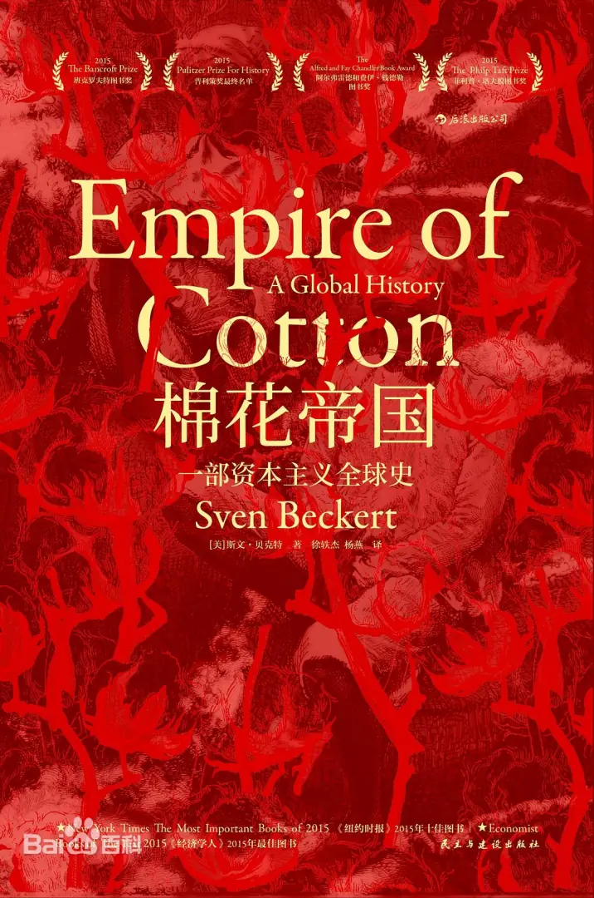
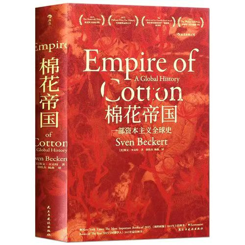

### [破事氵] 先评选出我个人认为的本月最佳手游，然后是聊聊历史第二弹

Made by ngapost2md (c) ludoux [GitHub Repo](https://github.com/ludoux/ngapost2md)

----

##### 0.[3] \<pid:0\> 2024-01-30 00:35:08 by AMINOS1991
毋庸置疑，仅就2024年1月来说，NGA手综版绝对是本月最佳手游。这款游戏包含了PVP、快速版本迭代、公会战、操作简单、对零氪玩家友好、活跃用户多等等要素，简直是拉满了。

然后是聊聊历史第二弹，这次向各位推荐一本书。
那就是大名鼎鼎的<b>《棉花帝国》</b>

下面内容复制自豆瓣，可以不看
————————————————
 内容简介

棉花产品在我们的生活中无处不在，以至于我们往往难以注意到它的重要性。但棉花产业的历史实际上是与近代资本主义的历史紧密关联在一起，理解棉花产业发展史是理解资本主义和当代世界的关键。本书作者斯文·贝克特通过叙述棉花产业发展的历史，解释了欧洲国家和资本家如何在短时间内重塑了这个世界历史上最重要的一项产业，并进而改变了整个世界面貌的。

本书是名副其实的全球史，内容涉及五大洲，将非洲的贩奴贸易和红海贸易联系在了一起，将美国南北战争和印度棉花种植联系在了一起。在贝克特波澜壮阔的巨著中，商人、商业资本家、经纪人、代理人、国家官僚、工业资本家、佃农、自耕农、奴隶都有自己的角色，贝克特清楚地表明，这些人的命运是如何与近代资本主义发展联系在一起的，又是如何塑造我们现在这个存在着巨大不平等的世界的。本书告诉我们，并不存在一个所谓的“全球化”资本主义阶段，资本主义从一开始就是全球化的。

----

##### 1.[0] \<pid:740525903\> 2024-01-30 00:39:31 by AMINOS1991
封面图上传失败，有好心人可以补一下封面图

----

##### 2.[0] \<pid:740528625\> 2024-01-30 01:08:29 by 笑死我了AAA

----

##### 3.[0] \<pid:740528700\> 2024-01-30 01:09:25 by 弈宸。
这本书我还真看过  

