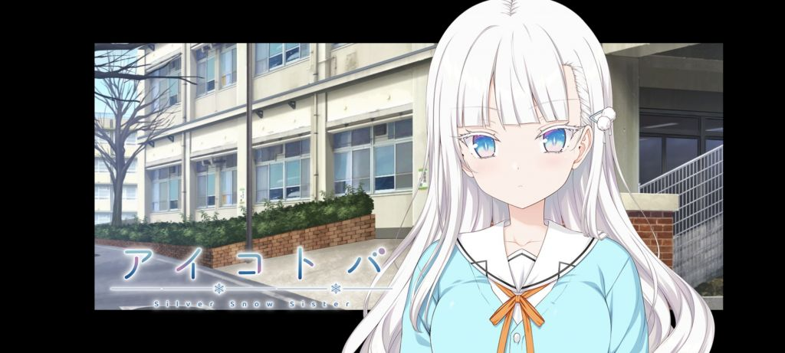

### [安利]希望正在争吵的大家进这个帖子里休息休息

Made by ngapost2md (c) ludoux [GitHub Repo](https://github.com/ludoux/ngapost2md)

----

##### 0.[1] \<pid:0\> 2024-01-30 01:18:28 by 杨靖泽
因为银音可爱捏

----

##### 1.[9] \<pid:740529776\> 2024-01-30 01:23:35 by 齐布_
可以来看看堆雪人

----

##### 2.[0] \<pid:740529869\> 2024-01-30 01:24:37 by 帝辛子受
>[jump](#pid0) 杨靖泽(2024-01-30 01:18) 说: 
>
>因为银音可爱捏

有一说一，这个纯爱挺好用的

----

##### 3.[0] \<pid:740529944\> 2024-01-30 01:25:20 by 好累，想睡
海豹真不错  
アイコトバ -Silver Snow Sister-

----

##### 4.[0] \<pid:740529953\> 2024-01-30 01:25:32 by kdde5467
东野圭吾的恶意是真的很好看

----

##### 5.[0] \<pid:740530046\> 2024-01-30 01:26:42 by mianmi123
宅男好奇问问，这什么番

----

##### 6.[0] \<pid:740530057\> 2024-01-30 01:26:47 by mp36969
什么游戏

----

##### 7.[0] \<pid:740530171\> 2024-01-30 01:28:20 by 帝辛子受
>[jump](#pid740530046) mianmi123(2024-01-30 01:26) 说: 
>
>宅男好奇问问，这什么番

纯爱黄油，hcg非常好，让我滨州旋转

----

##### 8.[0] \<pid:740530218\> 2024-01-30 01:28:59 by 高天流云之歌
>[jump](#pid740529776) 齐布_(2024-01-30 01:23) 说: 
>
>可以来看看堆雪人
>

京观是吧

----

##### 9.[0] \<pid:740530251\> 2024-01-30 01:29:27 by mianmi123
>[jump](#pid740530171) 帝辛子受(2024-01-30 01:28):

所以叫啥啊

