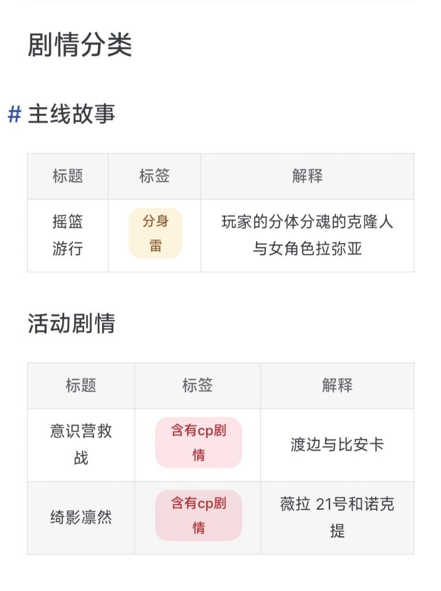
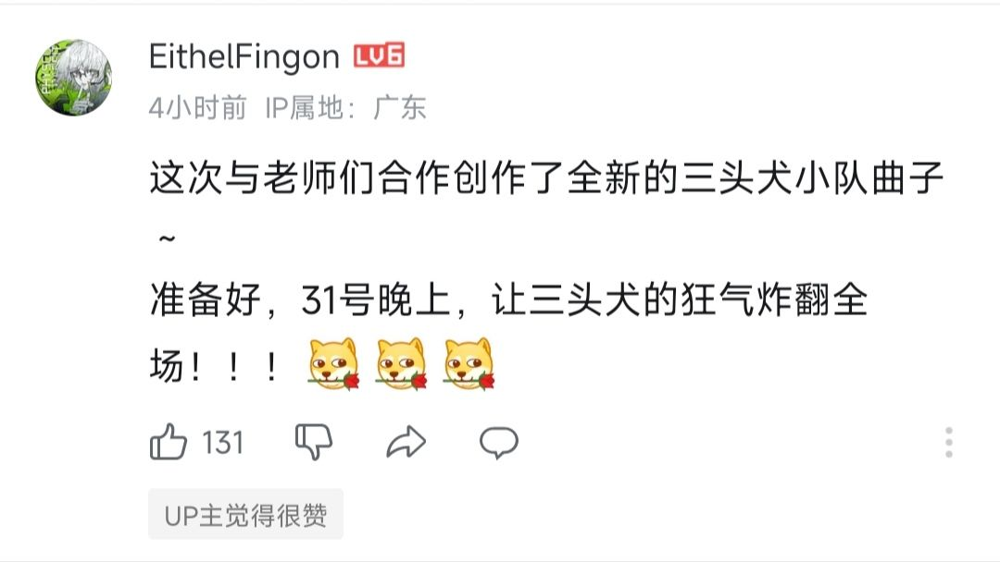
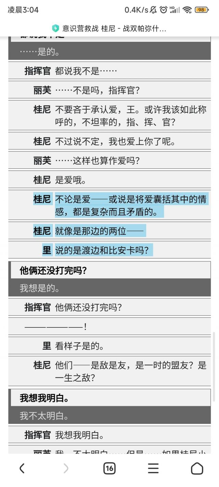
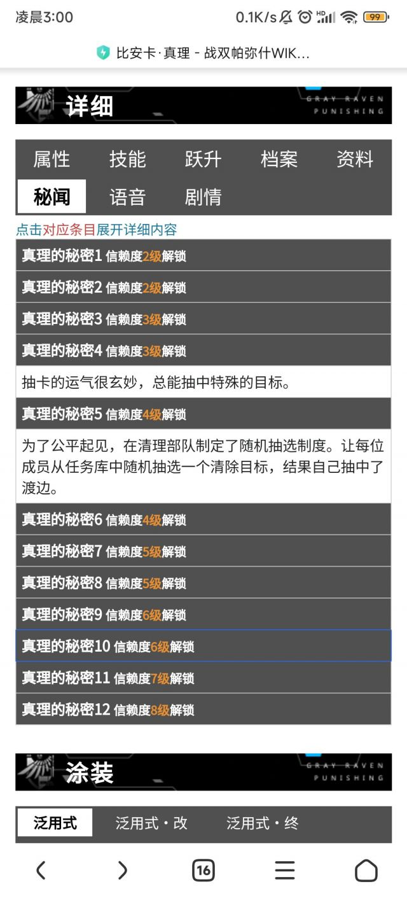
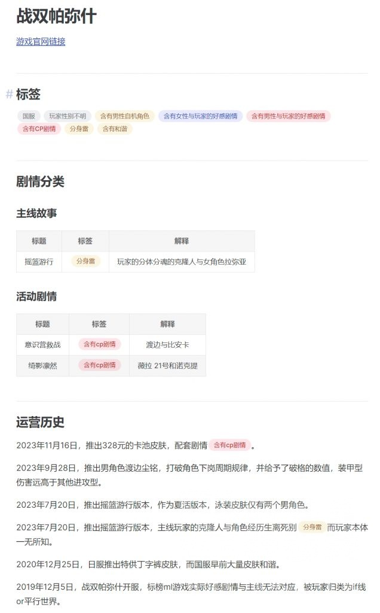
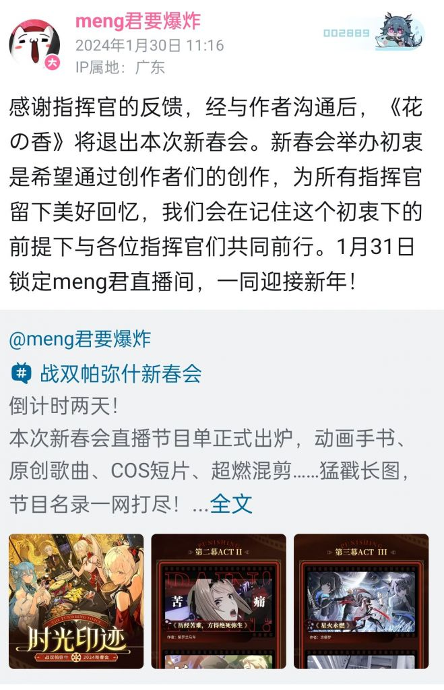

### [提问]战双是一般向游戏？

Made by ngapost2md (c) ludoux [GitHub Repo](https://github.com/ludoux/ngapost2md)

----

##### 0.[0] \<pid:0\> 2024-01-30 01:25:09 by terry424
比安卡渡边这对CP，开服那会就有人磕，但我记得这种人即便是在双版也是过街老鼠人人喊打，磕NM呢磕，我算是开服玩家，就雷毛含英那会AFK了几个版本，我印象里无论是主线还是支线，以及各角色的好感度剧情里库洛的文案都没塞什么私货，如果有能不能截图给我看看？
至于说战双要做一般向的，呃，这个一般向的定义是啥？不会是只要有男角色就是一般向吧？逛瓜版，这个一般向应该是指混入各种XP？比如基佬，百合之类，战双也四年了，到目前为止有过哪怕一点点文案上的疑似吗？
还有人说商单是厂家来试探底线的，我只能说战双不是少前，四年了，真有官方塞的一般向私货早就爆完了，而不是现在拿个商单的二创在那捕风捉影。

当然就目前的形势来看，你说有男不玩，那我只能说你对，因为确实有男角色，可你要说战双官方卖CP，我只能说能不能来个实锤让我开开眼。

至于鸣潮，雷点可多了，不过跟战双没关系，我也没打算玩，看切片该喷喷。

既然在手综发帖，也做好了被喷的准备，但如果你有不同意见希望能发点官方的实锤给我看看，毕竟战双里文本那么多，肯定有我没注意到的地方。

----

##### 2.[0] \<pid:740530260\> 2024-01-30 01:29:32 by 共揽星辰
[url](https://gachagamescape.github.io)

另外新春会又可以美美的磕三头犬连体婴了捏

----

##### 3.[14] \<pid:740530316\> 2024-01-30 01:30:18 by wzyyyys
剧情确实好，文案确实没私货，ml浓度确实高，社区环境小从雨也确实不捂嘴，xxn也确实没发癫，cp也确实没人磕，所以大伙都快去玩吧，那么什么时候清算那些在冲不可燃垃圾的麻辣仙人呢？

----

##### 4.[5] \<pid:740530346\> 2024-01-30 01:30:36 by yaoguanh
别一般向了
混厕向！

----

##### 5.[5] \<pid:740530353\> 2024-01-30 01:30:40 by Dorothy_Goddess
是不是一般向我不知道，看着双版那性别楼我只能说妥妥的混厕向

----

##### 6.[0] \<pid:740530437\> 2024-01-30 01:31:38 by 夭蔚房卯屋全
反驳一点，少钱一的私货是因为少前二牵扯出来的，毕竟正常人都没往那边去想，只有了案底才会去怀疑

----

##### 7.[6] \<pid:740530498\> 2024-01-30 01:32:23 by 帝辛子受
你猜手综这么久战双的人敢来吹tm是所谓的ml大厂出的游戏吗

----

##### 8.[2] \<pid:740530710\> 2024-01-30 01:35:01 by 咸鱼二十九号
手综发过一个三头犬的图....一般混厕向确认

----

##### 9.[7] \<pid:740530797\> 2024-01-30 01:36:15 by 单杀成瘾
就一点就能爆杀你所谓的战双是什么ml游戏了吧？请问好感剧情和主线剧情对得上吗？对不上不是妥妥的缅北游戏？少女前线就是这么切割戒指誓约的哦。

----

##### 10.[1] \<pid:740530947\> 2024-01-30 01:38:10 by mp36969
你没明白ml cp只是矛盾之一，有男不玩主要代表的是性别矛盾，看鸣潮社区那个含女量，我只能说尊重祝福，反正我不玩没必要给自己找不痛快

----

##### 11.[1] \<pid:740530963\> 2024-01-30 01:38:18 by Milan米兰
我战双的断断续续出坑回坑最后应该是21年底露娜第一个s(那个白衣双马尾的好像叫黯灭?)彻底出坑。
二次元男性向游戏要么就一般向(混厕)要么就ml呗，但以ml的角度看战双让人郁闷的点也太多了吧，首先虽然里人设还行但开局男角多少有些不舒服，加上渡比这cp开服就有不少莫名其妙的发糖角度，我玩的那会还有三个露西亚的问题，红莲的记忆被格式化了变了个新机体很难让人觉得舒服吧?
还有露娜和白毛露西亚至少到我退坑的时候很难看出和首席有啥关系吧?磕姐妹的给罗兰那个烂玩意加戏的倒不少

----

##### 12.[0] \<pid:740531020\> 2024-01-30 01:39:06 by fpgafusa
>[jump](#pid740530797) 单杀成瘾(2024-01-30 01:36) 说: 
>
>就一点就能爆杀你所谓的战双是什么ml游戏了吧？请问好感剧情和主线剧情对得上吗？对不上不是妥妥的缅北游戏？少女前线就是这么切割戒指誓约的哦。

我方阵营的角色的好感和主线能对上的，敌方阵营的角色因为阵营敌对的缘故，导致好感剧情写出来一股子if味。

----

##### 13.[0] \<pid:740531359\> 2024-01-30 01:43:37 by fpgafusa
>[jump](#pid740530963) Milan米兰(2024-01-30 01:38) 说: 
>
>我战双的断断续续出坑回坑最后应该是21年底露娜第一个s(那个白衣双马尾的好像叫黯灭?)彻底出坑。
>二次元男性向游戏要么就一般向(混厕)要么就ml呗，但以ml的角度看战双让人郁闷的点也太多了吧，首先虽然里人设还行但开局男角多少有些不舒服，加上渡比这cp开服就有不少莫名其妙的发糖角度，我玩的那会还有三个露西亚的问题，红莲的记忆被格式化了变了个新机体很难让人觉得舒服吧?
>还有露娜和白毛露西亚至少到我退坑的时候很难看出和首席有啥关系吧?磕姐妹的给罗兰那个烂玩意加戏的倒不少

其实三个露西亚在媚玩家方面是利好，因为前两个露西亚太脸麻无口了，库洛见它推得女主没人气，直接刀了，换了一个粘人小娇妻的全新性格的露西亚。

----

##### 14.[3] \<pid:740531795\> 2024-01-30 01:49:33 by Milan米兰
>[jump](#pid740531359) fpgafusa(2024-01-30 01:43):

也有道理，不过我比较喜欢的是白毛和露娜这姐妹两，看这两迟迟不进我队里还有罗兰和加百列这两总看着不舒服(当然也有刷的累具体原因现在想不起来了都)让我直接退坑了。
战双反正就这样吧，吃点崩3吃剩的，估计鸣潮也是吃点原神吃剩的

----

##### 15.[1] \<pid:740531796\> 2024-01-30 01:49:33 by 我是社管有男不玩
>[jump](#pid740531359) fpgafusa(2024-01-30 01:43):

还在洗洗洗洗洗
赶紧把渡边刀了我就信你这屁话

----

##### 16.[2] \<pid:740531917\> 2024-01-30 01:51:15 by Dorothy_Goddess
>[jump](#pid740530498) 帝辛子受(2024-01-30 01:32) 说: 
>
>你猜手综这么久战双的人敢来吹tm是所谓的ml大厂出的游戏吗

诶还真有人来吹过，然后被永乐菠萝哥车翻了

----

##### 17.[3] \<pid:740532117\> 2024-01-30 01:54:10 by abasiyaluo2
如果按照战双玩家的说法是全员ml，那么男角色ml到底是卖给谁的呢，不至于是特意卖给男玩家的吧？所以我还是倾向于战双不是纯男性向。纯男性向游戏的男角色可以有各种定位，比如损友，前辈之类的，但是一般不会是ml。

----

##### 18.[1] \<pid:740532219\> 2024-01-30 01:55:32 by 噬祂
ml cp在手综已经退版本了，有男不玩不让社区混仙女才是主要论点，如果kl在鸣潮坚持ml剧情但又想扩圈引xnn的话，这个论点大概会在主要群体狠狠加速了

----

##### 19.[0] \<pid:740532409\> 2024-01-30 01:58:41 by fpgafusa
>[jump](#pid740532117) abasiyaluo2(2024-01-30 01:54) 说: 
>
>如果按照战双玩家的说法是全员ml，那么男角色ml到底是卖给谁的呢，不至于是特意卖给男玩家的吧？所以我还是倾向于战双不是纯男性向。纯男性向游戏的男角色可以有各种定位，比如损友，前辈之类的，但是一般不会是ml。

卖给女玩家和男同的

----

##### 20.[0] \<pid:740532432\> 2024-01-30 01:59:03 by terry424
>[jump](#pid740532117) abasiyaluo2(2024-01-30 01:54) 说: 
>
>如果按照战双玩家的说法是全员ml，那么男角色ml到底是卖给谁的呢，不至于是特意卖给男玩家的吧？所以我还是倾向于战双不是纯男性向。纯男性向游戏的男角色可以有各种定位，但是一般不会是ml吧。

这个是因为战双的首席 官方从来没有说是男的
看代入了
里面的男角色好感剧情 升满 如果带入男指 比如我 会感到不适
如果是女指就是ML味很浓
所以我男角色好感从来不练 只练女

但这个跟一般向还是区别很大吧 至少所有角色都是围着玩家转

----

##### 21.[2] \<pid:740532592\> 2024-01-30 02:01:54 by NATFproposal
>[jump](#pid740532432) terry424(2024-01-30 01:59) 说: 
>
>这个是因为战双的首席 官方从来没有说是男的
>看代入了
>里面的男角色好感剧情 升满 如果带入男指 比如我 会感到不适
>如果是女指就是ML味很浓
>所以我男角色好感从来不练 只练女
>
>但这个跟一般向还是区别很大吧 至少所有角色都是围着玩家转

在手游社区“一般向”这个定义最早由粥社区的xxn作为铺菌毯话术使用，海猫亲口说的。定义就是“卡池男女角色都有”。你这说的“一般向”又是什么呢。

----

##### 22.[0] \<pid:740532828\> 2024-01-30 02:05:46 by abasiyaluo2
>[jump](#pid740532432) terry424(2024-01-30 01:59):

那只是因为现在这类型游戏被污名化了而已，从来没有规定说男女角色都有的游戏，就一定是得不给主控镜头，或者角色有自己生活的。
你可以说战双是一个比较照顾玩家感受的()游戏。

----

##### 23.[0] \<pid:740532932\> 2024-01-30 02:07:26 by terry424
>[jump](#pid740532592) NATFproposal(2024-01-30 02:01) 说: 
>
>在手游社区“一般向”这个定义最早由粥社区的xxn作为铺菌毯话术使用，海猫亲口说的。定义就是“卡池男女角色都有”。你这说的“一般向”又是什么呢。

我看手综车原一般向好像因为出的角色官方明确给了百合什么属性吧？我以为一般向指包括各种XP的游戏

----

##### 24.[0] \<pid:740533047\> 2024-01-30 02:09:53 by terry424
>[jump](#pid740530797) 单杀成瘾(2024-01-30 01:36) 说: 
>
>就一点就能爆杀你所谓的战双是什么ml游戏了吧？请问好感剧情和主线剧情对得上吗？对不上不是妥妥的缅北游戏？少女前线就是这么切割戒指誓约的哦。

之前世界观还没铺开 所以角色好感剧情有点类似于IF线
当然你当成未来线也没问题

最近的角色好感剧情已经和主线接轨了

----

##### 25.[0] \<pid:740533174\> 2024-01-30 02:12:08 by abasiyaluo2
>[jump](#pid740532932) terry424(2024-01-30 02:07):

一般向在国内二游语境里通常是和男性向、女性向并列的，也就是指没有限定目标受众性别的游戏，和它卖啥xp关系倒是不大。当然目前的一般向二游基本都是那种啥都卖一点的状态，因此也有个贬称叫“混厕向”。

----

##### 26.[0] \<pid:740533182\> 2024-01-30 02:12:17 by sbsx123
>[jump](#pid740532828) abasiyaluo2(2024-01-30 02:05) 说: 
>
>那只是因为现在这类型游戏被污名化了而已，从来没有规定说男女角色都有的游戏，就一定是得不给主控镜头，或者角色有自己生活的。
>你可以说战双是一个比较照顾玩家感受的()游戏。

男女都有，然后都ml，到底照顾了谁的感受，双性恋吗？

----

##### 30.[0] \<pid:740533293\> 2024-01-30 02:14:25 by terry424
>[jump](#pid740533182) sbsx123(2024-01-30 02:12) 说: 
>
>男女都有，然后都ml，到底照顾了谁的感受，双性恋吗？

你可以自己选择增加谁的好感度啊
初始都是冷淡 最高8级
我只送女角色礼物
男角色都是冷淡

----

##### 31.[0] \<pid:740533361\> 2024-01-30 02:15:40 by abasiyaluo2
>[jump](#pid740533182) sbsx123(2024-01-30 02:12):

可以这么说吧，也有一部分人虽然不是双性恋，但并不反感同性角色对自己示好。因为二游本身是一个rpg，想象力丰富的人完全可以根据剧情灵活地切换想象中自己的形象。自己是男/女性，并不影响在想象中扮演一个异性和同性角色谈恋爱，毕竟这是一件新鲜有趣的事。

----

##### 32.[0] \<pid:740533445\> 2024-01-30 02:17:25 by sbsx123
>[jump](#pid740533293) terry424(2024-01-30 02:14) 说: 
>
>你可以自己选择增加谁的好感度啊
>初始都是冷淡 最高8级
>我只送女角色礼物
>男角色都是冷淡

所以你主线里不会遇到男角色吗，男角色对你的态度是ml还是冷淡呢？如果是ml，那我会不适，如果是冷淡，那同理女角色也会是冷淡，我还是不适

----

##### 33.[0] \<pid:740533448\> 2024-01-30 02:17:27 by terry424
>[jump](#pid740533174) abasiyaluo2(2024-01-30 02:12) 说: 
>
>一般向在国内二游语境里通常是和男性向、女性向并列的，也就是指没有限定目标受众性别的游戏，和它卖啥xp关系倒是不大。当然目前的一般向二游基本都是那种啥都卖一点的状态，因此也有个贬称叫“混厕向”。

那这么说确实是一般向
但混厕缅北之类的
我个人觉得还扣不到战双头上
个人意见
如果秉着矫枉必须过正的态度的话
要扣帽子我也不反驳就是了

----

##### 34.[1] \<pid:740533540\> 2024-01-30 02:19:02 by 血晓柳莺
战双跟传统的一般向游戏确实不一样，但是泥潭战双的性别楼非常败路人缘  ，起码在泥潭你是别想听到好话了。至于我……经历了白毛那事后我还能凹了战双三年已经够可以了，老面包枫落早跑了，整个群也就还剩小鱼跟我手里还有号

----

##### 35.[3] \<pid:740533572\> 2024-01-30 02:19:32 by 共揽星辰
>[jump](#pid740533445) sbsx123(2024-01-30 02:17) 说: 
>
>所以你主线里不会遇到男角色吗，男角色对你的态度是ml还是冷淡呢？如果是ml，那我会不适，如果是冷淡，那同理女角色也会是冷淡，我还是不适

四年了就一个极昼好感剧情能接上主线你还想主线里女角色ml？就一个女主鸦羽算主线里的

----

##### 36.[0] \<pid:740533679\> 2024-01-30 02:21:42 by mp36969
>[jump](#pid740533293) terry424(2024-01-30 02:14) 说: 
>
>你可以自己选择增加谁的好感度啊
>初始都是冷淡 最高8级
>我只送女角色礼物
>男角色都是冷淡

你没抓住问题的根本，男角色存在本身就是在挤压女ml受众的生存空间。厂商出角色是要占产能的，你出一个男角色就变相等于我少了一个老婆，还有男女角色之间人际关系等乱七八糟的问题，再加上引流来的集美，更加会挤压宅男生存空间。你爱玩你就自己玩，你要出来推荐的话我只能说有男不玩，没那个心思跟厂商和集美们勾心斗角

----

##### 37.[0] \<pid:740533689\> 2024-01-30 02:21:54 by terry424
>[jump](#pid740533445) sbsx123(2024-01-30 02:17) 说: 
>
>所以你主线里不会遇到男角色吗，男角色对你的态度是ml还是冷淡呢？如果是ml，那我会不适，如果是冷淡，那同理女角色也会是冷淡，我还是不适

战双里玩家扮演的是首席 剧情又是末世生存
遇见男角色基本是战友 或者是玩家的崇拜者
不是除了ML就是冷漠的

----

##### 38.[0] \<pid:740533690\> 2024-01-30 02:21:54 by 血晓柳莺
>[jump](#pid740533572) 共揽星辰(2024-01-30 02:19) 说: 
>
>四年了就一个极昼好感剧情能接上主线你还想主线里女角色ml？就一个女主鸦羽算主线里的

那我觉得深痕人鱼还是算的，虽然人鱼逆天分身雷，据我所知单纯被这剧情恶心推坑的我两个群就有3个10w氪

----

##### 39.[0] \<pid:740533726\> 2024-01-30 02:22:39 by sbsx123
>[jump](#pid740533572) 共揽星辰(2024-01-30 02:19) 说: 
>
>四年了就一个极昼好感剧情能接上主线你还想主线里女角色ml？就一个女主鸦羽算主线里的

那不就是缅北吗，和有没有男角色关系都不大了，直接让我想起了骑士哥对少前誓约的评价  

----

##### 40.[0] \<pid:740533740\> 2024-01-30 02:22:59 by terry424
>[jump](#pid740533572) 共揽星辰(2024-01-30 02:19) 说: 
>
>四年了就一个极昼好感剧情能接上主线你还想主线里女角色ml？就一个女主鸦羽算主线里的

曲和鱼的好感剧情你没看？

----

##### 41.[0] \<pid:740533838\> 2024-01-30 02:25:02 by 共揽星辰
>[jump](#pid740533740) terry424(2024-01-30 02:22) 说: 
>
>曲和鱼的好感剧情你没看？

你都说鱼了不把分身雷也讲讲

----

##### 42.[2] \<pid:740533843\> 2024-01-30 02:25:05 by askask311
>[jump](#pid740533361) abasiyaluo2(2024-01-30 02:15) 说: 
>
>可以这么说吧，也有一部分人虽然不是双性恋，但并不反感同性角色对自己示好。因为二游本身是一个rpg，想象力丰富的人完全可以根据剧情灵活地切换想象中自己的形象。自己是男/女性，并不影响在想象中扮演一个异性和同性角色谈恋爱，毕竟这是一件新鲜有趣的事。

不好意思，大多数人反感   某男角色结算动画的时候猛一贴过来给我恶心坏了

----

##### 43.[0] \<pid:740533884\> 2024-01-30 02:26:05 by terry424
>[jump](#pid740533726) sbsx123(2024-01-30 02:22) 说: 
>
>那不就是缅北吗，和有没有男角色关系都不大了，直接让我想起了骑士哥对少前誓约的评价

所以人云亦云要不得
最近的几个女角色很明确的好感剧情跟主线接轨

至于其他的
就拿真理来说 我记得她的好感剧情是跟玩家在休假的时候一日约会
那你觉得这种算不算跟主线有关呢？
就算无关 难道算缅北？

----

##### 44.[1] \<pid:740533891\> 2024-01-30 02:26:10 by 单杀成瘾
>[jump](#pid740533047) terry424(2024-01-30 02:09) 说: 
>
>之前世界观还没铺开 所以角色好感剧情有点类似于IF线
>当然你当成未来线也没问题
>
>最近的角色好感剧情已经和主线接轨了

骗骗哥们可以别把自己也骗了。

----

##### 45.[0] \<pid:740533988\> 2024-01-30 02:28:16 by abasiyaluo2
>[jump](#pid740533843) askask311(2024-01-30 02:25):

所以我只是说一部分人嘛，大部分人肯定不是这样的。
但是这类人真的是有的，而且搞创作的基本上都是这类人，因为创作同时涉及到不同性别的角色，如果没法想象不同人的心理，那根本创作不出可信的内容。

----

##### 46.[0] \<pid:740534026\> 2024-01-30 02:29:06 by terry424
>[jump](#pid740533838) 共揽星辰(2024-01-30 02:25) 说: 
>
>你都说鱼了不把分身雷也讲讲

摇篮游行
就因为涉及了克隆 分身这种桥段 不管写的好不好 全部判定为雷 是不是过于武断了？

一千个人眼里有一千个哈姆雷特

我想说至少大多数人眼里摇篮游行写的很好
2023年第一神章也不过分

----

##### 47.[0] \<pid:740534077\> 2024-01-30 02:30:10 by terry424
>[jump](#pid740533891) 单杀成瘾(2024-01-30 02:26) 说: 
>
>骗骗哥们可以别把自己也骗了。

深痕的好感剧情我忘记了

鱼和曲 但凡你看了主线和好感剧情 就知道是一个时间线的

----

##### 48.[0] \<pid:740534101\> 2024-01-30 02:30:31 by sbsx123
>[jump](#pid740533988) abasiyaluo2(2024-01-30 02:28) 说: 
>
>所以我只是说一部分人嘛，大部分人肯定不是这样的。
>但是这类人真的是有的，而且搞创作的基本上都是这类人，因为创作同时涉及到不同性别的角色，如果没法想象不同人的心理，那根本创作不出可信的内容。

这类人确实有，但也不必扩大化，创作者需要有这种能力，不代表一定会乐在其中

----

##### 50.[0] \<pid:740534233\> 2024-01-30 02:33:30 by sbsx123
>[jump](#pid740533884) terry424(2024-01-30 02:26) 说: 
>
>所以人云亦云要不得
>最近的几个女角色很明确的好感剧情跟主线接轨
>
>至于其他的
>就拿真理来说 我记得她的好感剧情是跟玩家在休假的时候一日约会
>那你觉得这种算不算跟主线有关呢？
>就算无关 难道算缅北？

那么有没有说这个休假约会发生在主线的哪个时间点呢？主线里这个时间点前后角色和主角的关系有没有变化呢？如果没有，也能说和主线有关？

----

##### 51.[3] \<pid:740534260\> 2024-01-30 02:33:59 by 血晓柳莺
>[jump](#pid740534026) terry424(2024-01-30 02:29) 说: 
>
>摇篮游行
>就因为涉及了克隆 分身这种桥段 不管写的好不好 全部判定为雷 是不是过于武断了？
>
>一千个人眼里有一千个哈姆雷特
>
>我想说至少大多数人眼里摇篮游行写的很好
>2023年第一神章也不过分

那真别了，因为这事我叼了4个群的文案孝子不敢说话了，说白了手游剧情就那样，矮子里挑高个子。另一方面，确实有人因为这剧情推坑，那这剧情抛开雷点能让人入坑吗？答案是no 所以一个会让人推坑不能拉人入坑的剧情我觉得拉米亚的流水已经回答了他的价值

----

##### 52.[0] \<pid:740534329\> 2024-01-30 02:35:11 by 血晓柳莺
>[jump](#pid740534233) sbsx123(2024-01-30 02:33) 说: 
>
>那么有没有说这个休假约会发生在主线的哪个时间点呢？主线里这个时间点前后角色和主角的关系有没有变化呢？如果没有，也能说和主线有关？

那有点牵强了朋友，好感剧情本来就应该偏日常一点啊

----

##### 53.[2] \<pid:740534441\> 2024-01-30 02:37:44 by 共揽星辰
>[jump](#pid740534329) 血晓柳莺(2024-01-30 02:35) 说: 
>
>那有点牵强了朋友，好感剧情本来就应该偏日常一点啊

NIKKE的好感剧情，你在主线描写里第一次遇到一些角色的时候，明显是好感剧情后的相识程度了。

----

##### 54.[2] \<pid:740534471\> 2024-01-30 02:38:20 by sbsx123
>[jump](#pid740534329) 血晓柳莺(2024-01-30 02:35) 说: 
>
>那有点牵强了朋友，好感剧情本来就应该偏日常一点啊

好感剧情当然应该偏日常，但角色和主角的关系应该和主线是一样的，是“真的发生了的事件”

----

##### 55.[0] \<pid:740534625\> 2024-01-30 02:41:51 by terry424
>[jump](#pid740534233) sbsx123(2024-01-30 02:33) 说: 
>
>那么有没有说这个休假约会发生在主线的哪个时间点呢？主线里这个时间点前后角色和主角的关系有没有变化呢？如果没有，也能说和主线有关？

战双不像某些游戏明确上垒或者结婚那种
最多就是希望能永远在一起的程度
拿比安卡来说 主线里确实越往后 她跟玩家关系是越好的

----

##### 56.[0] \<pid:740534772\> 2024-01-30 02:45:16 by terry424
>[jump](#pid740534260) 血晓柳莺(2024-01-30 02:33) 说: 
>
>那真别了，因为这事我叼了4个群的文案孝子不敢说话了，说白了手游剧情就那样，矮子里挑高个子。另一方面，确实有人因为这剧情推坑，那这剧情抛开雷点能让人入坑吗？答案是no 所以一个会让人推坑不能拉人入坑的剧情我觉得拉米亚的流水已经回答了他的价值

论坛我基本只看NGA双版 还有B站的战双视频
我基本没有看见过吐槽摇篮游行的剧情爆雷的
你如果不说
我还真不知道有氪佬会因为这个退坑

因为战双有不好的节奏 比如渡边是火甲 这两地方一大堆喷的

----

##### 57.[0] \<pid:740534786\> 2024-01-30 02:45:26 by 血晓柳莺
>[jump](#pid740534471) sbsx123(2024-01-30 02:38) 说: 
>
>好感剧情当然应该偏日常，但角色和主角的关系应该和主线是一样的，是“真的发生了的事件”

那我觉得除了维拉这个角色，其他角色还是有随主线更亲近主角的

----

##### 58.[2] \<pid:740534827\> 2024-01-30 02:46:26 by 共揽星辰
>[jump](#pid740534026) terry424(2024-01-30 02:29) 说: 
>
>摇篮游行
>就因为涉及了克隆 分身这种桥段 不管写的好不好 全部判定为雷 是不是过于武断了？
>
>一千个人眼里有一千个哈姆雷特
>
>我想说至少大多数人眼里摇篮游行写的很好
>2023年第一神章也不过分

你搁这搞笑呢，打着ml幌子的二次元手游整出分身雷然后谈文学，请问作者是列夫托尔斯泰还是陀思妥耶夫斯基啊。你所谓的大多数是哪个大多数啊，我认知的大多数对剧情的要求是“可以不看但不能恶心人”。连网文都不如的东西还给你哈姆雷特上了。

----

##### 59.[0] \<pid:740534927\> 2024-01-30 02:48:52 by terry424
>[jump](#pid740534827) 共揽星辰(2024-01-30 02:46) 说: 
>
>你隔这搞笑呢，打着ml幌子的二次元手游整出分身雷然后谈文学，请问作者是列夫托尔斯还是陀思妥耶夫斯基啊。你所谓的大多数是哪个大多数啊，我认知的大多数对剧情的要求是“可以不看但不能恶心人”。连网文都不如的东西还给你哈姆雷特上了。

不是 ML跟分身冲突？
摇篮游行怎么就恶心玩家了？
鱼又不是跟分身谈恋爱  

大多数指的双版跟B站 
其他地方我不怎么逛 要不你指个路
很多觉得摇篮游行很烂的地方？

----

##### 60.[2] \<pid:740534979\> 2024-01-30 02:49:56 by Mortalwisdom
对战双来说mlcp很重要吗？不，重要的是比安卡作为商品能否被玩家认同的价值
kl流水低的时候靠哪些角色来挽回你再清楚不过了吧.我就说这么多，另外我还是更喜欢红莲
垃圾kl

----

##### 61.[4] \<pid:740535046\> 2024-01-30 02:51:40 by 共揽星辰
>[jump](#pid740534927) terry424(2024-01-30 02:48) 说: 
>
>不是 ML跟分身冲突？
>摇篮游行怎么就恶心玩家了？
>鱼又不是跟分身谈恋爱  
>
>大多数指的双版跟B站 
>其他地方我不怎么逛 要不你指个路
>很多觉得摇篮游行很烂的地方？

over了 
分身和ml不冲突，战双ml玩家笑话喜加一

----

##### 62.[0] \<pid:740535102\> 2024-01-30 02:53:30 by abasiyaluo2
>[jump](#pid740534827) 共揽星辰(2024-01-30 02:46):

战双具体啥问题不太了解啊，但长篇科幻题材作品里，分身/复制人真的属于老梗了，普遍到我甚至想不到有哪个长篇连载的科幻娱乐作品是没有涉及到这个内容的。

----

##### 63.[0] \<pid:740535159\> 2024-01-30 02:54:59 by terry424
>[jump](#pid740535046) 共揽星辰(2024-01-30 02:51) 说: 
>
>over了 
>分身和ml不冲突，战双ml玩家笑话喜加一

所以到底哪冲突了能指教一下？  

你分身如果跟鱼产生了感情纠葛 那这么说没问题
但根本没有这个桥段 何来冲突一说？

----

##### 64.[0] \<pid:740535244\> 2024-01-30 02:57:03 by a257b103
>[jump](#pid740535046) 共揽星辰(2024-01-30 02:51) 说: 
>
>over了 
>分身和ml不冲突，战双ml玩家笑话喜加一

又让我想起来前几天手综某个评论:库洛这种ml神厂，实属爆笑如雷。

----

##### 65.[2] \<pid:740535571\> 2024-01-30 03:06:53 by Noel。

交给大家评判

----

##### 66.[1] \<pid:740535648\> 2024-01-30 03:09:23 by abasiyaluo2
>[jump](#pid740535571) Noel。(2024-01-30 03:06):

这种只能说你如果真嗑ml的话，绝对算雷。
被在文案里暗搓搓cue的cp恶心到的经历，我也不是没有。
所以我一直都在呼吁不管卖什么，都不应该两头恰。两头恰可以说是玩家对立的来源之一，也会恶心到大部分人——不管你到底支持哪一边。

----

##### 67.[0] \<pid:740535954\> 2024-01-30 03:18:47 by tengshenga5
>[jump](#pid740535571) Noel。(2024-01-30 03:06) 说: 
>
>
>交给大家评判

这个是故意擦边的，有人甚至拿情感是个大类来反驳。要么水平低劣，要么故意的，要么粗心无审查。

----

##### 68.[2] \<pid:740536073\> 2024-01-30 03:23:10 by 墨樰§
感觉尾气厂很想两头恰啊 赶紧把所有cp都端上来吧，想看加速了

----

##### 69.[0] \<pid:740536606\> 2024-01-30 03:46:53 by askask311
>[jump](#pid740535159) terry424(2024-01-30 02:54) 说: 
>
>所以到底哪冲突了能指教一下？  
>
>你分身如果跟鱼产生了感情纠葛 那这么说没问题
>但根本没有这个桥段 何来冲突一说？

你有没有想过，不管有没有感情纠葛(而且有没有感情本来就是主观的东西，我觉得没有，你觉得有怎么办？)
用分身和女角色产生本体那里没有的记忆和经历，这本身就是雷点

分身雷连起点大神都要退避不去触碰 你双文案估计是自视太高，以为自己笔力高到哪里去了，结果还不是引起了一堆人的不适？
后面又假惺惺的让&amp;#128031;来装傻说什么“我不太明白，但你就是你啊”   鸡贼得笑死个人

----

##### 70.[0] \<pid:740536846\> 2024-01-30 03:56:46 by terry424
>[jump](#pid740536606) askask311(2024-01-30 03:46) 说: 
>
>你有没有想过，不管有没有感情纠葛(而且有没有感情本来就是主观的东西，我觉得没有，你觉得有怎么办？)
>用分身和女角色产生本体那里没有的记忆和经历，这本身就是雷点
>
>分身雷连起点大神都要退避不去触碰 你双文案估计是自视太高，以为自己笔力高到哪里去了，结果还不是引起了一堆人的不适？
>后面又假惺惺的让&amp;#128031;来装傻说什么“我不太明白，但你就是你啊”   鸡贼得笑死个人

这个我要说一下 网文写得好并不代表笔力强
比如那个爱潜水的乌贼 我看过他的奥数神座 书是好书 情节什么蛮好 但笔力真的很一般 
而战双的文案水平 抛开剧情不谈 在遣词造句方面可以说是爆杀网文作者 文学素养不低的

至于你说的分身暴雷 我只能说我获得信息来源主要是B站和NGA 这俩地方大多数人并不认为这是雷点
可能贴吧里意见比较多？我没去看过

----

##### 71.[3] \<pid:740536973\> 2024-01-30 04:02:24 by askask311
>[jump](#pid740536846) terry424(2024-01-30 03:56) 说: 
>
>这个我要说一下 网文写得好并不代表笔力强
>比如那个爱潜水的乌贼 我看过他的奥数神座 书是好书 情节什么蛮好 但笔力真的很一般 
>而战双的文案水平 抛开剧情不谈 在遣词造句方面可以说是爆杀网文作者 文学素养不低的
>
>至于你说的分身暴雷 我只能说我获得信息来源主要是B站和NGA 这俩地方大多数人并不认为这是雷点
>可能贴吧里意见比较多？我没去看过

那我就换个说法，记忆相同的分身算不算自己，在记忆出现差异的一瞬间那以后又算不算不同的人
这种牵扯到哲学的东西 一直以来都有争议，碰了这个话题又一脸无辜地“哪里雷了”简直可笑

2游文案本来就是连写网文都没人看的文科渣滓，你游也不例外，可别在网文作者身上找优越感了，不配真的

你可别身边即全部了，渡比经典意识营救你都没看过，很难确定你那大部分是些什么大部分

----

##### 72.[0] \<pid:740537170\> 2024-01-30 04:10:27 by wzyyyys
话说要不你去豚吧跟这个老哥对下线？[url](https://tieba.baidu.com/p/8421828623?&amp;share=9105&amp;fr=sharewise&amp;is_video=false&amp;unique=39455739901F277D75C18F2BE9BBB0B1&amp;st=1706558961&amp;client_type=1&amp;client_version=12.47.1.0&amp;sfc=copy&amp;share_from=post)

----

##### 73.[0] \<pid:740537197\> 2024-01-30 04:11:50 by wzyyyys
>[jump](#pid740537170) wzyyyys(2024-01-30 04:10) 说: 
>
>话说要不你去豚吧跟这个老哥对下线？[url](https://tieba.baidu.com/p/8421828623?&amp;share=9105&amp;fr=sharewise&amp;is_video=false&amp;unique=39455739901F277D75C18F2BE9BBB0B1&amp;st=1706558961&amp;client_type=1&amp;client_version=12.47.1.0&amp;sfc=copy&amp;share_from=post)

不过我也不清楚他说的是真是假，你俩好好汴下京

----

##### 74.[0] \<pid:740537337\> 2024-01-30 04:18:39 by 兔子草123456
啊?看看鸣潮现在这个样子，还能说kl不是参照战双的目标用户去做的么?
一般向就一般向吧别洗了，在专版骗骗自己人还行，总归还是有个人剧情能ml一下咯。来这骗人就有点莫名其妙了

----

##### 75.[1] \<pid:740537495\> 2024-01-30 04:26:21 by 血晓柳莺
>[jump](#pid740536606) askask311(2024-01-30 03:46) 说: 
>
>你有没有想过，不管有没有感情纠葛(而且有没有感情本来就是主观的东西，我觉得没有，你觉得有怎么办？)
>用分身和女角色产生本体那里没有的记忆和经历，这本身就是雷点
>
>分身雷连起点大神都要退避不去触碰 你双文案估计是自视太高，以为自己笔力高到哪里去了，结果还不是引起了一堆人的不适？
>后面又假惺惺的让&amp;#128031;来装傻说什么“我不太明白，但你就是你啊”   鸡贼得笑死个人

错了，这是笔力低的体现。正是因为文案水平不够，才要以悲剧手法来拉动读者的情感，最简单的方法是啥？死人。  但是主角不能死，所以他们聪明的小脑袋瓜啪就安排个分身去替死

----

##### 76.[0] \<pid:740537643\> 2024-01-30 04:34:22 by 血晓柳莺
哦对了，我很喜欢辰十一写的一段话
现在，你终于来到我的面前，而我已经成为一个善良、和蔼的猴子。无欲无求对不对！你呢，又有一份男女之爱在牵挂，所以这时候取经大业，就有问题了！请问，还如何凑成取经小队？”孙悟空向左右问道。 
  “死女人！”庄俾梵插嘴道。 
  “宾果！”悟空打了一个响指：“又回到了老套路，当命中注定成就一番大事业的英雄人物，应该如何迎来他命运的转折呢？” 
  “死女人！”拉米尔·汗如是说。 
  “当一个走到尽头的爱情故事，该如何收获自己的结局呢？”悟空又问。 
  安倍晴明抢答道：“死女人！” 
  “当一个执迷不悟，执着男女之情，就差那么一点点的大乘弟子，如何领悟佛法真谛，天降大任与斯人呢？” 
  魔术师感慨道：“死女人！” 
  “所以，大家都看出来了。但事情发展到这个地步，段小姐……她的命运已经不言自明，这时候最好的结果应该是我杀了段小姐，然后你来降服我，对不对？”

以死人来拉动读者情感好用吗？ 好用。高明吗？不高明。

----

##### 77.[0] \<pid:740537803\> 2024-01-30 04:42:20 by terry424
>[jump](#pid740537337) 兔子草123456(2024-01-30 04:18) 说: 
>
>啊?看看鸣潮现在这个样子，还能说kl不是参照战双的目标用户去做的么?
>一般向就一般向吧别洗了，在专版骗骗自己人还行，总归还是有个人剧情能ml一下咯。来这骗人就有点莫名其妙了

鸣潮确实 不过这俩游戏的文案应该不是一批人
现在全网群嘲少前2的文案组 
也没怎么喷云图吧

----

##### 78.[0] \<pid:740550575\> 2024-01-30 08:55:08 by 六出雪花
>[jump](#pid740530174) schiller2333(2024-01-30 01:28) 说: 
>
>坛里一个老哥建的网页，不知道这位老哥的头皮还在不在
>

怎么没有曲两千

----

##### 79.[0] \<pid:740550779\> 2024-01-30 08:56:27 by 止水-3
我之前俩号可是应为车库洛没的对于库洛我只能说谨慎发言

----

##### 80.[0] \<pid:740551143\> 2024-01-30 08:58:48 by sadudas
战双确实是全员ml的，但是男角女角都没落下，所以是典型的混厕。

----

##### 81.[2] \<pid:740552012\> 2024-01-30 09:04:12 by 隐身中的阿卡林
从他开服抄崩三还有男女角色不就能看出来想两头恰一般向吗？
这帮两头恰的二游最后流水人气没法看，只得低下头求宅男氪金捏

----

##### 82.[0] \<pid:740553016\> 2024-01-30 09:10:28 by 十月音落
>[jump](#pid740536973) askask311(2024-01-30 04:02) 说: 
>
>那我就换个说法，记忆相同的分身算不算自己，在记忆出现差异的一瞬间那以后又算不算不同的人
>这种牵扯到哲学的东西 一直以来都有争议，碰了这个话题又一脸无辜地“哪里雷了”简直可笑
>
>2游文案本来就是连写网文都没人看的文科渣滓，你游也不例外，可别在网文作者身上找优越感了，不配真的
>
>你可别身边即全部了，渡比经典意识营救你都没看过，很难确定你那大部分是些什么大部分

记忆相同，信念相同，人格相同，的克隆人如果活着和女角色发生关系那肯定不妥，但是这不是写死了吗？女角色就算喜欢克隆人，我和他是克隆体，我们经历一样，记忆一样，干的事也一样，几乎完全是一样的个体，那么他死了，我是不是就是他？女角色和他发生关系是不是就是和我发生关系？  你说的记忆出现差异的一瞬间并不会影响到这个人的人格，除非思维方式出现了偏差，比如我丢垃圾会丢到一个垃圾桶(士郎)，但是克隆人因为经历了XXX，垃圾直接丢到马路上(红A)，但是显然克隆指挥官没到这一步

----

##### 83.[0] \<pid:740553298\> 2024-01-30 09:12:10 by askask311
>[jump](#pid740553016) 十月音落(2024-01-30 09:10) 说: 
>
>记忆相同，信念相同，人格相同，的克隆人如果活着和女角色发生关系那肯定不妥，但是这不是写死了吗？女角色就算喜欢克隆人，我和他是克隆体，我们经历一样，记忆一样，干的事也一样，几乎完全是一样的个体，那么他死了，我是不是就是他？女角色和他发生关系是不是就是和我发生关系？

还是您理解到位，是的 确实和他发生关系就是和你发生关系

----

##### 84.[0] \<pid:740556322\> 2024-01-30 09:29:22 by 久远寺呱呱
>[jump](#pid740534927) terry424(2024-01-30 02:48) 说: 
>
>不是 ML跟分身冲突？
>摇篮游行怎么就恶心玩家了？
>鱼又不是跟分身谈恋爱  
>
>大多数指的双版跟B站 
>其他地方我不怎么逛 要不你指个路
>很多觉得摇篮游行很烂的地方？

摇篮游行刚出的那段时间不管是b站，还是版内我可都看过一种言论，点赞的还不少“手席真身死在海底才好，让假的顶替，那就太神作啦”，惊为天人。

----

##### 85.[3] \<pid:740556595\> 2024-01-30 09:30:49 by 露露缇雅丨泽金
>[jump](#pid740553016) 十月音落(2024-01-30 09:10) 说: 
>
>记忆相同，信念相同，人格相同，的克隆人如果活着和女角色发生关系那肯定不妥，但是这不是写死了吗？女角色就算喜欢克隆人，我和他是克隆体，我们经历一样，记忆一样，干的事也一样，几乎完全是一样的个体，那么他死了，我是不是就是他？女角色和他发生关系是不是就是和我发生关系？  你说的记忆出现差异的一瞬间并不会影响到这个人的人格，除非思维方式出现了偏差，比如我丢垃圾会丢到一个垃圾桶(士郎)，但是克隆人因为经历了XXX，垃圾直接丢到马路上(红A)，但是显然克隆指挥官没到这一步  ，如果这能算是被牛的话，那异度之

喜欢分身然后拿主身当代餐？

这丢网文里属于多看一眼就会爆炸的级别了

不信你自己去书院问问

我是明白有些文案端出答辩还不自知是为啥了，说不定还沾沾自喜我写的不错呢

----

##### 86.[0] \<pid:740561048\> 2024-01-30 09:54:36 by warland
我只能说有男不玩就是为你战双这种混厕向贴膜准备的

----

##### 87.[0] \<pid:740561379\> 2024-01-30 09:56:20 by wstc061102
战双应该算是女玩家的缅北游戏

----

##### 88.[0] \<pid:740561387\> 2024-01-30 09:56:22 by kawmdgt
三头犬叒改人设搞连体以来原本ml浓度很高的薇拉和21号就和玩家拉开社交距离，主线里和玩家关系最近的反而成了在之前从未联系过的唯一男诺克提。然后主线里还要垫一句诺克提可能出的事让薇拉的表情比玩家失踪更烦躁。

原本一直高糖的黑卡池皮肤剧情拿来写亲密无间的三头犬(直播原话)玩家不仅酱油还有个不论选什么选项都会被薇拉当狗训的桥段。我是不是还得庆幸这段剧情不仅故事没讲好，角色之间的关系也没讲好，不然又要被剧情厨把对内容有意见的抓出来批斗？

----

##### 89.[0] \<pid:740565064\> 2024-01-30 10:14:36 by 测试变数
>[jump](#pid740556595) 露露缇雅丨泽金(2024-01-30 09:30) 说: 
>
>喜欢分身然后拿主身当代餐？
>
>这丢网文里属于多看一眼就会爆炸的级别了
>
>不信你自己去书院问问
>
>我是明白有些文案端出答辩还不自知是为啥了，说不定还沾沾自喜我写的不错呢

那手综的ml神游 碧蓝档案 在黑子和普雷纳帕特斯出来的时候也没少人说分身雷啊

重要的不是什么分身雷 而是剧情本体的走向

----

##### 90.[0] \<pid:740565282\> 2024-01-30 10:15:39 by 最喜欢樱了
搞分身搞cp。这就是我们尾气厂孝子说的ml仙人啊，你们有没有这种ml仙人啊？

----

##### 91.[0] \<pid:740571799\> 2024-01-30 10:46:07 by chun1674
>[jump](#pid740532117) abasiyaluo2(2024-01-30 01:54) 说: 
>如果按照战双玩家的说法是全员ml，那么男角色ml到底是卖给谁的呢，不至于是特意卖给男玩家的吧？所以我还是倾向于战双不是纯男性向。纯男性向游戏的男角色可以有各种定位，比如损友，前辈之类的，但是一般不会......

这还用说，卖给女的啊

你还别说，渡边在男角色里算是比较有好兄弟感觉的了

----

##### 92.[1] \<pid:740575036\> 2024-01-30 11:00:11 by chun1674
没有哦，硬要说的话比安卡和千子呗。甚至比安卡渡边这两剧情里的直接交集也就比安卡撤退的时候两个人在冰原上见过，渡边是掩护撤退的部队的人。他两交集应该是渡边的兄弟，但具体忘了。

但是一是意识营救战，二是间章情头，三是这两个人真能通过冰原串起来。kl又不改，笔在人家手里，磕上了，产粮了，还通过官方间接让你知道了，咋办嘛，要不你报警吧

----

##### 93.[0] \<pid:740576928\> 2024-01-30 11:08:14 by 轻烟鸿影
孝子：ml神游，指里面男的也ml，那么这一定不会招来某些厕所里的东西，对吧
现在只是情势所迫按头写女的ml，你看看某二字测试“你怎么还在啊”，不就疯狂抬头要表达起来了？

----

##### 94.[1] \<pid:740578240\> 2024-01-30 11:13:53 by 八方不动两面
战双就是证明有男不玩的活证据

----

##### 95.[0] \<pid:740579612\> 2024-01-30 11:19:36 by 小五ロリ
库洛作为知名尾气厂与米最大的区别就在于库洛撞墙了会滑跪罢了，战双内测如此，鸣潮内测也是如此
有钱了就去迎合XXN，没钱了就指望男玩家爆米，谁让xxn爆不出米呢

----

##### 96.[1] \<pid:740581094\> 2024-01-30 11:25:47 by Yonagi景
一款让麻辣仙人捏鼻绕道走的ml神游，幽默kl

----

##### 97.[0] \<pid:740581958\> 2024-01-30 11:29:17 by chun1674
>[jump](#pid740579612) 小五ロリ(2024-01-30 11:19) 说: 
>库洛作为知名尾气厂与米最大的区别就在于库洛撞墙了会滑跪罢了，战双内测如此，鸣潮内测也是如此
>有钱了就去迎合XXN，没钱了就指望男玩家爆米，谁让xxn爆不出米呢

你别说，渡边之后下一个男S万事大概率3月就上了，我已经开始期待流水了

----

##### 98.[1] \<pid:740583885\> 2024-01-30 11:37:15 by 狼牙破神势
坚持能和一眼把比仙贝脸还熟悉的车轱辘话复读背诵说话内容半点营养没有差过营养快线瓶盖的打滚“理客中”好好讲道理，手综老哥真是太温柔了

----

##### 99.[0] \<pid:740584209\> 2024-01-30 11:38:37 by SailorOfMeans
>[jump](#pid740581958) chun1674(2024-01-30 11:29) 说: 
>
>你别说，渡边之后下一个男S万事大概率3月就上了，我已经开始期待流水了

3月应该是含英，万事估计要到再下个版本五月初

----

##### 100.[0] \<pid:740586177\> 2024-01-30 11:47:04 by asd92570689
怎么嘴硬分身的我在y吧都看八百遍了，吹也没用不喜欢看就是不喜欢看，爱写写后果自己担

----

##### 101.[1] \<pid:740587574\> 2024-01-30 11:53:33 by 迷糊的小闲酱
我看战双水楼还挺支持二创自由卖CP的，怎么就不是一般向了

----

##### 102.[0] \<pid:740587876\> 2024-01-30 11:54:49 by chun1674
>[jump](#pid740584209) SailorOfMeans(2024-01-30 11:38) 说: 
>3月应该是含英，万事估计要到再下个版本五月初

我不好说，前瞻万事有pv含英只有一张图，感觉还是万事先

----

##### 103.[0] \<pid:740588261\> 2024-01-30 11:56:32 by 帝辛子受
>[jump](#pid740581094) Yonagi景(2024-01-30 11:25):

笑死，手综几个最眼熟的ml玩家，没有一个不骂战双的，自称ml大厂有点好笑了

----

##### 104.[1] \<pid:740592855\> 2024-01-30 12:18:50 by 里夫刘

目前来说库洛官方处理还是比较得当。如果打算玩库洛游戏的话，发现xxn作妖要积极反馈，对官方还是要听其言，观其行。

----

##### 105.[2] \<pid:740593696\> 2024-01-30 12:22:47 by 无名的无名。
我是绝不会相信一个坚持不懈出男角色，新作强行一碗水端平的公司会讨好男玩家搞ml

----

##### 106.[0] \<pid:740595001\> 2024-01-30 12:29:08 by 不知道存不存在的用户名
>[jump](#pid740556322) 久远寺呱呱(2024-01-30 09:29):

鉴定为刚接触文娱作品的小屁孩，我猜他们也一定是吴闲云的忠实拥趸

----

##### 107.[0] \<pid:740595438\> 2024-01-30 12:31:14 by chun1674
>[jump](#pid740592855) 里夫刘(2024-01-30 12:18) 说: 
>
>目前来说库洛官方处理还是比较得当。如果打算玩库洛游戏的话，发现xxn作妖要积极反馈，......

他家怂得很，上版本还问是不是很在乎角色对玩家的陪伴感，以前玩家操控角色剧情下线久了还问过是不是很在乎玩家操控角色的参与感

----

##### 108.[0] \<pid:740595667\> 2024-01-30 12:32:22 by 苍色洋流
>[jump](#pid740535571) Noel。(2024-01-30 03:06) 说: 
>
>
>交给大家评判

只能说，什么时候战双把这些遗留垃圾删了改了，彻底做切割了，什么时候风评才可能回正

----

##### 109.[3] \<pid:740596310\> 2024-01-30 12:35:30 by 紬木沙罗
>[jump](#pid740595438) chun1674(2024-01-30 12:31) 说: 
>
>他家怂得很，上版本还问是不是很在乎角色对玩家的陪伴感，以前玩家操控角色剧情下线久了还问过是不是很在乎玩家操控角色的参与感

怂那是因为目前战双只能靠男ml玩家爆流水了

捏着鼻子认怂罢了，不然还需要玩家自己来鞭策？

等鸣潮拉到一波集美反攻我敢说库洛作的比米鹰还狠

----

##### 110.[1] \<pid:740596676\> 2024-01-30 12:37:11 by 不知道存不存在的用户名
>[jump](#pid740596310) 紬木沙罗(2024-01-30 12:35):

我可真是太期待鸣潮了

狠狠地踩油门加速，提早跑路带来的正反馈越来越高

----

##### 111.[0] \<pid:740597319\> 2024-01-30 12:40:12 by chun1674
>[jump](#pid740596310) 紬木沙罗(2024-01-30 12:35) 说: 
>
>怂那是因为目前战双只能靠男ml玩家爆流水了
>捏着鼻子认怂罢了，不然还需要玩家自己来鞭策？
>等鸣潮拉到一波集美反攻我敢说库洛作的比米鹰还狠

那可不，我玩战双我自己还不知道。说kl家是ml那我确实承认是ml，但是讨好的到底是不是全是男玩家我就不好说了

鸣潮开服新手池如果不是自选歪到小男孩我都不敢想，战双走过的路鸣潮肯定又要走一遍

----

##### 112.[1] \<pid:740597498\> 2024-01-30 12:41:06 by 露露缇雅丨泽金
>[jump](#pid740592855) 里夫刘(2024-01-30 12:18):

就从那个官方给同人女发的邮件来看

不久说明库洛知道自家养的都是些CP畜吗？

就这不整顿不清洗，搁这儿发一句话不要上cp

不只能说官方根子里面屁股就是歪的吗

只能说感谢同人女自爆帮我排雷

希望明朝和追悼2一样急速暴毙

----

##### 113.[0] \<pid:740598442\> 2024-01-30 12:45:58 by 苍色洋流
>[jump](#pid740533884) terry424(2024-01-30 02:26) 说: 
>
>所以人云亦云要不得
>最近的几个女角色很明确的好感剧情跟主线接轨
>
>至于其他的
>就拿真理来说 我记得她的好感剧情是跟玩家在休假的时候一日约会
>那你觉得这种算不算跟主线有关呢？
>就算无关 难道算缅北？

我觉得要一码归一码
有几个女角色明确的好感剧情跟主线接轨是值得一夸，尤其点名表扬启明
但相对的，那么多不接轨的被骂也没什么问题吧

至于你举例的这种我觉得很好处理，主线里对话时稍微提一嘴当初就可以了  

另外，混厕味儿太重也是事实

----

##### 114.[0] \<pid:740599390\> 2024-01-30 12:50:42 by 黎明星hai
话说鱼喜欢过海还那个分身吗？是因为海分身喜欢首席的吗？

----

##### 115.[0] \<pid:740600387\> 2024-01-30 12:55:42 by 懶人丶殤
有些游戏内容就算是ml，但只要是有男和女的角色，都会被这里定义成混厕，因为会吸引男女玩家，社区就是这样

----

##### 116.[0] \<pid:740602389\> 2024-01-30 13:06:38 by 夏娜·F·清英
无非又要说意识营救战和摇篮那点逼事了 我就很直接 想玩自己看 接受不了那就别玩 反正不玩我又不会少根头发

对于简单地判定“有雷”“缅北”“有男”就能定性整个作品的 我的评价是能这么做判断的应该也不太在乎玩不玩 不玩也罢

一般向这个定义本身就不清晰 从ml角度讲肯定是ml 从男女的角度讲基本可以算一般向
虽然男女角色不太平衡 但是这个数量的男角色肯定是要划进一般向的了
因为非一般向≠男ml

----

##### 117.[4] \<pid:740604827\> 2024-01-30 13:19:53 by DrGMP
>[jump](#pid740602389) 夏娜·F·清英(2024-01-30 13:06) 说: 
>
>无非又要说意识营救战和摇篮那点逼事了 我就很直接 想玩自己看 接受不了那就别玩 反正不玩我又不会少根头发
>
>对于简单地判定“有雷”“缅北”“有男”就能定性整个作品的 我的评价是能这么做判断的应该也不太在乎玩不玩 不玩也罢
>
>一般向这个定义本身就不清晰 从ml角度讲肯定是ml 从男女的角度讲基本可以算一般向
>虽然男女角色不太平衡 但是这个数量的男角色肯定是要划进一般向的了
>因为非一般向≠男ml

直接说爱玩玩不玩滚就行了，大可不必打这么多字

----

##### 118.[1] \<pid:740606665\> 2024-01-30 13:30:02 by 露露缇雅丨泽金
>[jump](#pid740602389) 夏娜·F·清英(2024-01-30 13:06):

孝子又来手棕布道了

很可惜这里有男不玩啊，你这B玩意第一时间就被枪毙了

----

##### 119.[0] \<pid:740668019\> 2024-01-30 18:17:10 by 夏娜·F·清英
>[jump](#pid740604827) DrGMP(2024-01-30 13:19) 说: 
>
>直接说爱玩玩不玩滚就行了，大可不必打这么多字

那不然呢 不玩还要我求你吗
没说六字只是我选择一种更和平的表达方式 这也是不必要的吗

----

##### 120.[0] \<pid:740668591\> 2024-01-30 18:20:23 by 无聊毁灭世界
有男就是铁一般向。战双我从露西亚的人鱼皮肤剧情入坑品鉴够多了

----

##### 121.[2] \<pid:740670025\> 2024-01-30 18:28:20 by 无聊毁灭世界
>[jump](#pid740534927) terry424(2024-01-30 02:48) 说: 
>
>不是 ML跟分身冲突？
>摇篮游行怎么就恶心玩家了？
>鱼又不是跟分身谈恋爱  
>
>大多数指的双版跟B站 
>其他地方我不怎么逛 要不你指个路
>很多觉得摇篮游行很烂的地方？

战双运营这么久早就把我这种玩家筛出去了，又不是少前2，你觉得战双有什么配浪费时间回踩的吗？少前2闹这么大，老玩家粉转黑才是主力，战双这种游戏清理我们这种宅男玩家都是不声不响的，反正没投入啥感情，不舒服了就跑路

----

##### 122.[0] \<pid:740671780\> 2024-01-30 18:38:26 by sadudas
>[jump](#pid740670025) 无聊毁灭世界(2024-01-30 18:28):

我还真就是退坑回踩的，退坑两个事，策划是真他妈会恶心兄弟：
1.黑岩联动，A机(通俗地说，约等于原4星/舟4星，原4星是因为我记得原没有3星角色)不开198尸块礼包，导致厨子要花价值超过1kRMB的抽卡资源去抽，非厨子则根本不可能入池，约等于直接跳过活动
在这个活动中我提过这个问题，说建议像之前的A版本一样出个尸块礼包，大家都开心，被孝子骂在A机找强度
2.渡边落地火T，这个就是纯纯的不尊重玩家和制作组之间的约定俗成，导致原火T提前下岗，基本上所有的轮换/补阵容用的规则在这一个版本倒塌
我现在很偶尔在提起它的时候会去看一眼七麦，看看它黑岩联动版本的流水不如之前的A版本，S渡边/S曲版本流水不如S人鱼/S21版本
希望下个版本新跑道S露娜能带给库洛一些流水上的自信捏
鸣潮也不可能去玩了，再ml再舔玩家也不玩，策划又不当人，我玩不是给自己找不痛快嘛

----

##### 123.[0] \<pid:740672209\> 2024-01-30 18:41:08 by seiya5924
有男不玩，混厕不玩，性别模糊不玩

----

##### 124.[0] \<pid:740672816\> 2024-01-30 18:44:43 by 无聊毁灭世界
>[jump](#pid740671780) sadudas(2024-01-30 18:38) 说: 
>
>我还真就是退坑回踩的，退坑两个事，策划是真他妈会恶心兄弟：
>1.黑岩联动，A机(通俗地说，约等于原4星/舟4星，原4星是因为我记得原没有3星角色)不开198尸块礼包，导致厨子要花价值超过1kRMB的抽卡资源去抽，非厨子则根本不可能入池，约等于直接跳过活动
>在这个活动中我提过这个问题，说建议像之前的A版本一样出个尸块礼包，大家都开心，被孝子骂在A机找强度
>2.渡边落地火T，这个就是纯纯的不尊重玩家和制作组之间的约定俗成，导致原火T提前下岗，基本上所有的轮换/补阵容用的规则在这一个版本倒塌
>我现在很

我玩二游从来不在乎策划作妖什么逼氪，只要别在角色上投入的情感恶心我就行。

要求就这么低战双如果说有什么少前2行为那是没有的，只是这情感因为有男角色的存在总觉得不舒服，时不时就刺一下。

战双肯定不适合投入感情的宅男玩的

----

##### 125.[0] \<pid:740673518\> 2024-01-30 18:48:54 by sadudas
>[jump](#pid740672816) 无聊毁灭世界(2024-01-30 18:44):

那我刚好跟你反过来，对我来说剧情和角色能自圆其说怎么着都行，甚至他摇篮游行那个分身雷都雷不到我，但是我很在意策划作不作妖，很在意游戏定价几何
只能说啊，战双现在这个情况是他自己选的，我在场外看得真的很开心，联动版本+S版本+A+S连续流水打不过前面的同类版本(单联动版本还可以说是攒卡了，但是后面连续打不过就只能说明玩家是真不氪/真跑路了，甚至S曲还是个有直播重点宣发了的版本)实在是太好笑了

----

##### 126.[0] \<pid:740674490\> 2024-01-30 18:54:29 by 无聊毁灭世界
>[jump](#pid740673518) sadudas(2024-01-30 18:48) 说: 
>
>那我刚好跟你反过来，对我来说剧情和角色能自圆其说怎么着都行，甚至他摇篮游行那个分身雷都雷不到我，但是我很在意策划作不作妖，很在意游戏定价几何
>只能说啊，战双现在这个情况是他自己选的，我在场外看得真的很开心，联动版本+S版本+A+S连续流水打不过前面的同类版本(单联动版本还可以说是攒卡了，但是后面连续打不过就只能说明玩家是真不氪/真跑路了)实在是太好笑了

你是玩手游的玩家
我不是对我来说所有的二游不如单机一根毛。要啥游戏性
我cs打了几千个小时，各类500小时以上的游戏也不少，完全没必要在手游氪金找乐趣。手游对我唯一的价值只有角色陪伴

