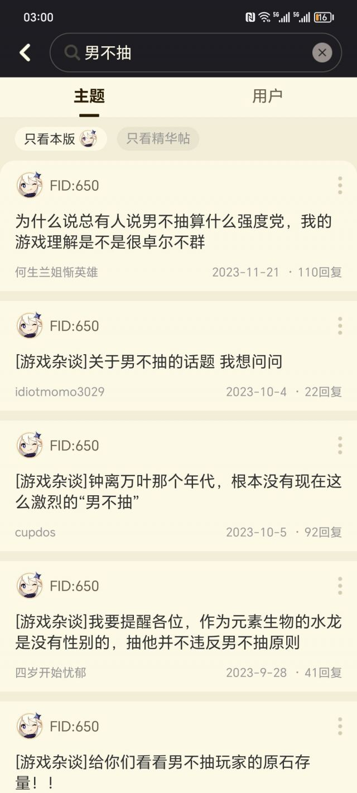
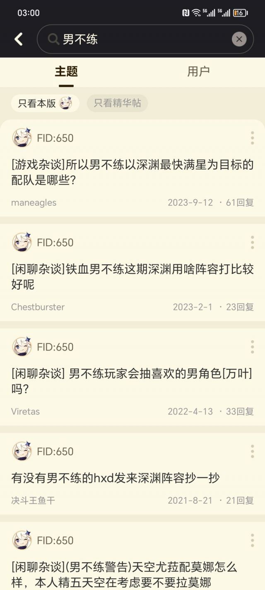
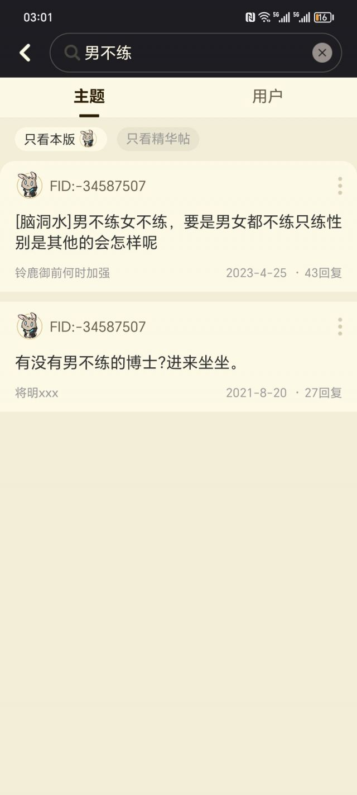
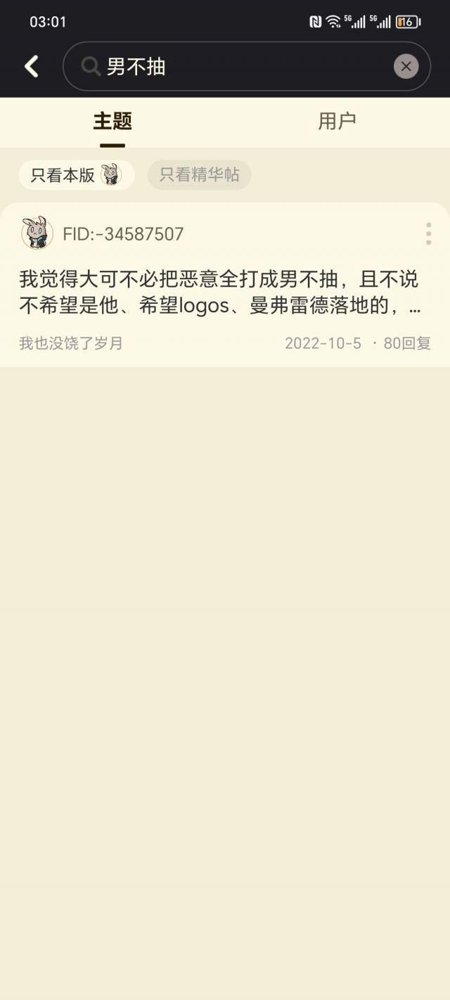

### [破事氵]发现一件好玩的事。

Made by ngapost2md (c) ludoux [GitHub Repo](https://github.com/ludoux/ngapost2md)

----

##### 0.[10] \<pid:0\> 2024-01-30 03:07:49 by 新水良真黑
这两个版块对于男不抽、练的画风完全不一样。粥版就没几个讨论男不抽，练的，反而原版就很随意

----

##### 1.[3] \<pid:740535637\> 2024-01-30 03:09:03 by 弈宸。
或许有个板块的相关帖子和这三晚的手综一个待遇吧

----

##### 2.[5] \<pid:740535686\> 2024-01-30 03:10:41 by mianmi123
米粥99，这俩郎才女貌，我们就别打扰了

----

##### 3.[2] \<pid:740535747\> 2024-01-30 03:12:54 by A_sys
你再看看全男队

----

##### 4.[2] \<pid:740535790\> 2024-01-30 03:13:53 by 辛殷柳甲魏陆
粥的社区因为xxn多并且抱团控评处于女性控场的局面，而且很关注性别议题，对男女角色资源咖位，以及玩家群体对男女角色的态度极其敏锐

所以女角色只要性张力大点或者男角色强度弱点，马上节奏爆炸。要不然手综怎么会流传那么多粥版拳师图。

----

##### 5.[0] \<pid:740535810\> 2024-01-30 03:14:20 by 共揽星辰
粥版版主心善，见不得有人不用马脸

----

##### 6.[1] \<pid:740535844\> 2024-01-30 03:15:28 by abasiyaluo2
对啊，所以才说其实原那边男不练不算啥敏感话题

----

##### 7.[6] \<pid:740535851\> 2024-01-30 03:15:41 by sbsx123
原版我以前真待过，女不练点赞多，男不练会被踩+yygq，不过确实没到粥版那种会被斩杀的程度。然后还有原版特色的男不练然后点开有钟离万叶

----

##### 8.[0] \<pid:740535874\> 2024-01-30 03:16:32 by 新水良真黑
>[jump](#pid740535747) A_sys(2024-01-30 03:12) 说: 
>
>你再看看全男队

这个发的贴就多了点了

----

##### 9.[4] \<pid:740535980\> 2024-01-30 03:19:27 by 新水良真黑
>[jump](#pid740535851) sbsx123(2024-01-30 03:15) 说: 
>
>原版我以前真待过，女不练点赞多，男不练会被踩+yygq，不过确实没到粥版那种会被斩杀的程度

以前我也呆过原版，那时候xxn多的时候男不抽和女不抽相互ky，可也没到粥现在的程度所以还真理解不了

----

##### 10.[2] \<pid:740536026\> 2024-01-30 03:21:04 by ling泠。
有男不玩的亚种都有这么大威力
难怪纯良棉花人会应激跨版割头皮

----

##### 11.[2] \<pid:740536061\> 2024-01-30 03:22:31 by 我不会。
舟版的大手太温暖了。以前版务还装一下，现在直接不演了。

----

##### 12.[0] \<pid:740536111\> 2024-01-30 03:24:44 by 末流晴天
游戏模式也占一部分吧。原就4个角色。舟好像是12个吧。考虑到强度分布，舟的男不抽/练确实毕竟难。

----

##### 13.[0] \<pid:740536147\> 2024-01-30 03:26:05 by 鱼下时光
我看了一下，粥男6一共19个，好用的没几个
女6一共68个
粥6星以下绝大部分没啥用

----

##### 14.[0] \<pid:740536909\> 2024-01-30 03:59:05 by 鬼岛巨人一米四
>[jump](#pid740535851) sbsx123(2024-01-30 03:15) 说: 
>
>原版我以前真待过，女不练点赞多，男不练会被踩+yygq，不过确实没到粥版那种会被斩杀的程度。然后还有原版特色的男不练然后点开有钟离万叶

这不也是钟离万叶教大家的有男不玩吗

强度绑定，你不玩她家咯咯都不行

----

##### 15.[0] \<pid:740537350\> 2024-01-30 04:19:11 by glotia
和挺多因素有关系的，最大的关系是狗屎圣遗物养成系统和垃圾的要死的福利导致很多人没得选，只能x不抽x不练，有群众基础堵不了嘴的。

----

##### 16.[0] \<pid:740571872\> 2024-01-30 10:46:29 by Rosmonetis
原版现在xxn也不占上风了
基本都在剑斗 或者匿名带节奏

----

##### 17.[0] \<pid:740573519\> 2024-01-30 10:53:43 by UID3244105
说明两坨屎里粥版的女厕味更臭呗

----

##### 18.[0] \<pid:740574886\> 2024-01-30 10:59:36 by dferxxj
原和粥版的区别就差一次大静谧腾笼换鸟罢了

----

##### 19.[3] \<pid:740575499\> 2024-01-30 11:02:15 by 暗影观察者
那群xxn我恨不得它们原地爆炸来让世界清净些

----

##### 20.[0] \<pid:740576320\> 2024-01-30 11:05:38 by dandanlong
>[jump](#pid740536147) 鱼下时光(2024-01-30 03:26) 说: 
>
>我看了一下，粥男6一共19个，好用的没几个
>女6一共68个
>粥6星以下绝大部分没啥用

我觉得占到快30%已经很不合理了，3%还差不多

----

##### 21.[0] \<pid:740581752\> 2024-01-30 11:28:25 by 癸宁廖丑邹虞
粥版这边很早以前就对“男不抽”“男不练”高度敏感了，早就处于虚空索敌的阶段了
我讲个小故事:
2022年9月，那月不是玛恩纳实装嘛，然后惯例的开始强度预测，只是这次不一样，基本所有保守一点的拉表格会被团建“见不得男六强”，实际上我觉得强度预测有保守有夸张的很正常，但到玛恩纳这里就是只准估好的，哦，还有一堆查成分“男不抽”的roll奖。
然后虚空开了那么多天男不抽男不练，结果到实装那天结果出来确实强，有没有所谓的zng破防呢？没有。
接着有趣的事情来了，集美们自己憋不住了，发了个帖问“查询男不抽男不练心态”，然后热评不出意料都在虚空开破防zng。你懂了吧，集美们一直卖惨男六都不强男六待遇差，一旦有了就马上跳你脸上还有说成是你先找事儿，给点阳光就灿烂，给点洪水就泛滥。

