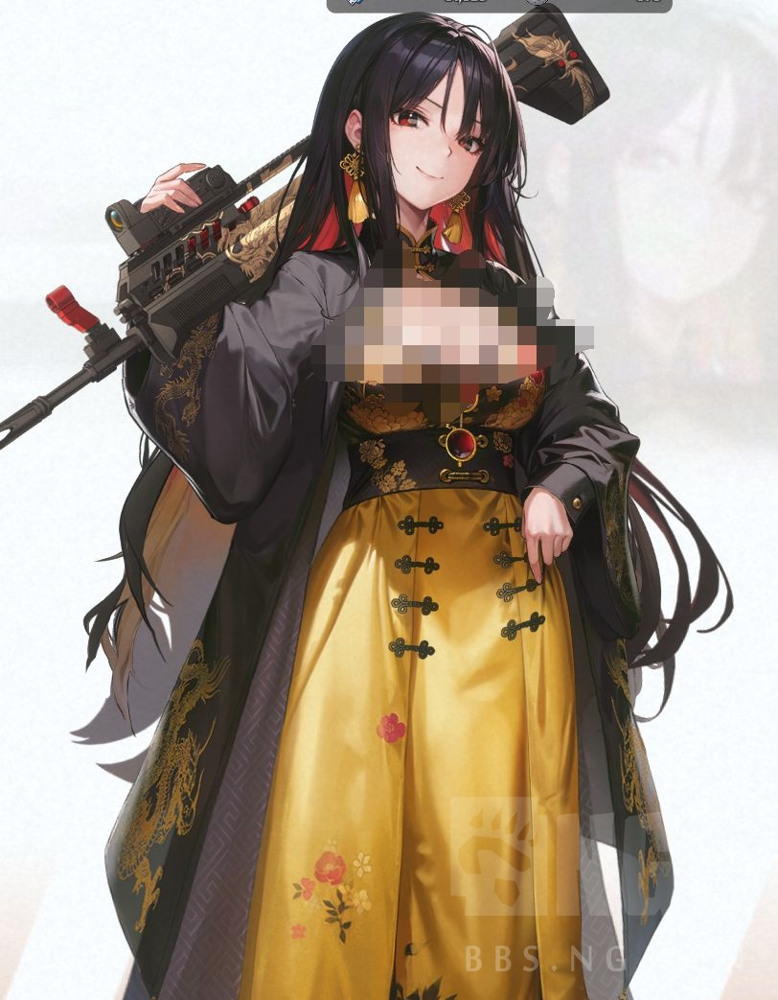
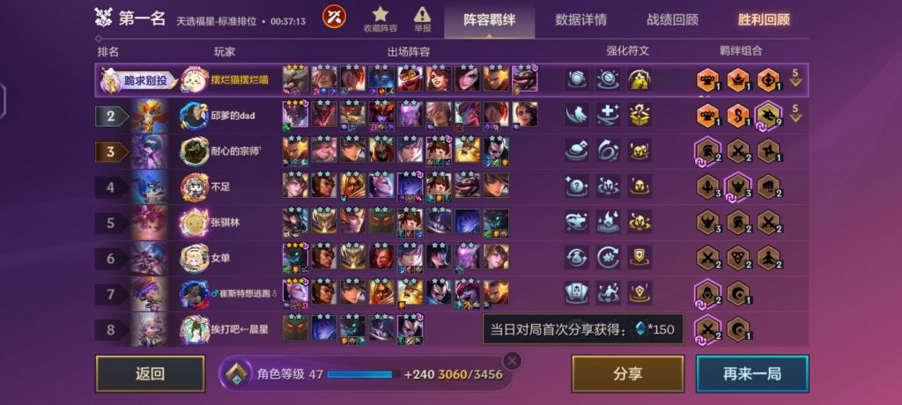

### [讨论] 我一个读书人感觉不太对劲，看不懂发生了什么

Made by ngapost2md (c) ludoux [GitHub Repo](https://github.com/ludoux/ngapost2md)

----

##### 0.[12] \<pid:0\> 2024-01-30 10:49:45 by 黄前久美子子
本人以前是在日不落市读博的，读了4年多了，说是读博其实也就是打打下手混混日子，大家都有自己的生活，就这么混着。一直听说隔壁市有个旅行者联盟和列车联盟，好像是HSH一样，总跟这学校网上对线，好像还有线下真实的，挺吓人的。
本来就这么混着，但是感觉这个学校越来越不对劲了，前几个月好像隔壁市的两个联盟被打击了一波，也是好事，但是自从边境的某个小村出事之后就不对劲了。
那个村就是一群人在家里复读“有男不玩”，不知道有什么魔力，吸引了不少被隔壁两个联盟害的人过去。然后我们学校里的人说这是异端，要严厉打击，我也不太懂，离这么远有什么好打击的..跟学校有什么关系啊。
然后好像发生了一些事，我也不知道怎么回事，这个村突然没什么声音了，总感觉毛毛的。
正好隔壁有个岛国在招什么..指挥官，好像指挥什么妮姬打仗的，我心一横，干脆就走边境找了条船去应聘指挥官了。
入职之后才知道是真的舒服啊，大家都很热情，比以前那种冷淡的环境好多了，以前还时不时被校长按头导师pua，在这完全不存在，手下的人都很亲密指挥官。
装备也不错，发到手里的第一把就是十成新的95，带弹鼓的。比以前在鱿鱼村用过的87新95好用多了。
现在想了想就是后悔啊，怎么没早点过去当指挥官呢，唉。
最后，有男不玩。

----

##### 1.[0] \<pid:740574223\> 2024-01-30 10:56:37 by 黄前久美子子
啥也不说了，感谢手综，有男不玩，你们有没有这样的95啊

----

##### 2.[1] \<pid:740574396\> 2024-01-30 10:57:27 by GENGAR53880

早上刚打的两把95

