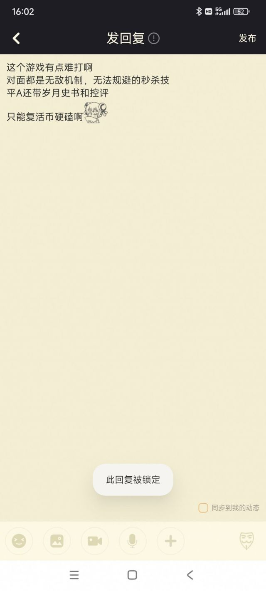

### [破事氵] 宅男二游规则怪谈

Made by ngapost2md (c) ludoux [GitHub Repo](https://github.com/ludoux/ngapost2md)

----

##### 0.[5] \<pid:0\> 2024-01-30 15:40:12 by PersonaZzz
欢迎来到这个奇幻世界，我的朋友。尽管生活的重力太过沉重，但你还是设法挣脱开现实的束缚来到这里。尽管这里并不是心灵的港湾，但你还是能在这里享受一些现实中无法获得的快乐。然而，你千万不要因为片刻的安逸而放松警惕。黑暗的未知存在仍然在跟踪着你。
   作为一个过来人，我愿意给予你一些庇护，但同样的。请务必遵守一下规则。虽然我不敢保证规则能在关键时刻救你一命，但至少能让你不被黑暗生物啃的只剩骨头。不是么？

一、金钱是往返于现实和此处的重要道具。请不要将其毫无意义地消耗掉，你的身上的金钱是黑暗生物和地精商人都觊觎的东西。保护好它，就像保护自己的孩子那样。

二、地精商人拥有各种各样新奇的玩意儿能满足你的需求，但你千万要注意。有些无良的地精商人将自己从其他部落的地精商人获得的商品进行仿制，并把仿制品卖的比原商品价格还高。你如果不嫌去其他城镇麻烦的话，建议别从这些地精商人这购买东西。

三、某些黑暗生物会伪装成你梦中情人的样子进行诱惑。但说难听点，我的朋友。你的梦中情人怎么会来到这个地方呢？不要被黑暗生物所魅惑，如果你想寻求婚姻，那还是等你哪天决心离开这里吧。

四、地精商人的商品并不一定符合你的要求，你可以选择其他商人进行交易。但请注意，贪婪的地精商人也在和黑暗生物进行交易。
   当你发现长期合作的地精商人的商店突然充斥着亵渎的商品时，请务必大喊圣言录&quot;有男不玩&quot;并拒绝为此付款。相信我，你不会喜欢那些玩意儿的。这是黑暗生物和地精的交易产品，但账单算在了你的头上。

五、黑暗生物并不是属于一个种族的，但尽管它们互相争斗。但千万不要试图帮助其中一方，远离它们，离的越远越好。

六、时时刻刻念诵圣言录，你无需因此进行任何花费。为何不多念几声呢？
&quot;有男不玩&quot;&quot;有男不玩&quot;&quot;有男不玩&quot;

七、远离那些黑暗生物的走狗和被魅惑的人。他们不值得同情。也不要和它们产生冲突，远离它们。
这些堕落的人甚至比黑暗生物还要可怕，有传言说它们是几个大地精签订灵魂契约收来的奴隶。
如果它们尝试蛊惑你，你只需重复圣言录的内容即可。

这只是你来到这个世界首先要遵循的规则，朋友。事实上，现实和这里都不容易。
当你和某个地精商人签订契约或选择自己的住址后，还有其他要遵循的规则，但这是之后的事情了。不是吗？

----

##### 1.[1] \<pid:740633194\> 2024-01-30 15:41:45 by solasl
>[jump](#pid0) PersonaZzz(2024-01-30 15:40) 说: 
>
>欢迎来到这个奇幻世界，我的朋友。尽管生活的重力太过沉重，但你还是设法挣脱开现实的束缚来到这里。尽管这里并不是心灵的港湾，但你还是能在这里享受一些现实中无法获得的快乐。然而，你千万不要因为片刻的安逸而放松警惕。黑暗的未知存在仍然在跟踪着你。
>   作为一个过来人，我愿意给予你一些庇护，但同样的。请务必遵守一下规则。虽然我不敢保证规则能在关键时刻救你一命，但至少能让你不被黑暗生物啃的只剩骨头。不是么？
>
>一、金钱是往返于现实和此处的重要道具。请不要将其毫无意义地消耗掉，你的身上的金钱是黑暗生物和地精

幽暗地域大冒险，不小心的冒险家要被夺心魔嘬头皮哦。

----

##### 2.[3] \<pid:740633468\> 2024-01-30 15:42:58 by 94646843z
玩十年二游只因没有顺应厂商和仙女，现在沦为麻辣畜

----

##### 3.[0] \<pid:740633480\> 2024-01-30 15:43:01 by 弗罗西诺内
传奇调查员每周会帮你更新黑暗标记的寻找范围,你可以用黑暗标记避开黑暗生物,判断一片区域内的危险程度。

----

##### 4.[2] \<pid:740633900\> 2024-01-30 15:44:57 by PersonaZzz
>[jump](#pid740633480) 弗罗西诺内(2024-01-30 15:43):

感谢评论

也欢迎各位老哥补充规则

----

##### 5.[8] \<pid:740634046\> 2024-01-30 15:45:40 by yoooov
八、适时发出“我女我也”“有男不玩”还有人类雌性的色图，可以激怒并分辨巨魔，但是未被惊扰的女巫也是敌人

----

##### 6.[2] \<pid:740634246\> 2024-01-30 15:46:39 by sagara_al
第三条怎么想起博德3梦中情人一转变夺心魔了

----

##### 7.[4] \<pid:740634693\> 2024-01-30 15:48:42 by jbwww
在这一路上你会遇到
头皮捕手
京观谈判专家
69人体蜈蚣
早雌晚雄星人
……

----

##### 9.[0] \<pid:740635139\> 2024-01-30 15:50:41 by PersonaZzz
>[jump](#pid740634246) sagara_al(2024-01-30 15:46):

其实我是想写魅魔，但黑暗生物的颜值和魅魔没得比。

然后博德之门3的那个梦中情人不是ea版吗？正式版变守护者了。

----

##### 10.[0] \<pid:740635306\> 2024-01-30 15:51:24 by NeonKight
>[jump](#pid740633194) solasl(2024-01-30 15:41) 说: 
>
>幽暗地域大冒险，不小心的冒险家要被夺心魔嘬头皮哦。

我们吉斯洋基人就是来找夺心魔

----

##### 11.[7] \<pid:740635412\> 2024-01-30 15:51:53 by 弱智吧同学
太恐怖了，隔壁直接发完言就死了，直接命案现场
哦，帖子也没了

----

##### 12.[3] \<pid:740635984\> 2024-01-30 15:54:33 by PersonaZzz
>[jump](#pid740635412) 弱智吧同学(2024-01-30 15:51):

那是城镇生活的规则。
有些城镇已经是黑暗生物掌管的地方了

----

##### 13.[0] \<pid:740636972\> 2024-01-30 15:59:00 by 第十九扇门的背后
我战战兢兢的活着，偶尔瞧见几个行路人触碰不能说的禁忌，还没来得及开口提醒，人就已经在我眼前消失的无影无踪，我想开口，嘴唇闭闭合合最终化作一声叹息，拉上了围巾继续赶路

----

##### 14.[0] \<pid:740637075\> 2024-01-30 15:59:30 by 心海心海心
太好玩了，嫉妒你的才华，插个眼
警惕任何看起来友好甚至跟你一起念圣言的人，也不要在吃东西的时候跟它们争论要不要麻辣

----

##### 15.[0] \<pid:740637403\> 2024-01-30 16:01:03 by sagara_al
>[jump](#pid740635139) PersonaZzz(2024-01-30 15:50) 说: 
>
>其实我是想写魅魔，但黑暗生物的颜值和魅魔没得比。
>
>然后博德之门3的那个梦中情人不是ea版吗？正式版变守护者了。

只是名字改成守护者
本质上还是读心出你最喜欢的形象

----

##### 16.[0] \<pid:740637560\> 2024-01-30 16:01:51 by sagara_al
>[jump](#pid740635306) NeonKight(2024-01-30 15:51) 说: 
>
>我们吉斯洋基人就是来找夺心魔

养鸡人还是攻击性太高了
我选择做有男不玩的泽莱人武僧

----

##### 17.[1] \<pid:740637740\> 2024-01-30 16:02:44 by solasl
补充 拒绝踏入任何卓尔主导的城市，也要拒绝卓尔的请求帮卓尔做事，避免成为卓尔家族争权夺利的牺牲品。

----

##### 18.[1] \<pid:740637849\> 2024-01-30 16:03:15 by NATFproposal

这个规则好像有点严苛了啊

----

##### 19.[0] \<pid:740637948\> 2024-01-30 16:03:45 by solasl
>[jump](#pid740636972) 第十九扇门的背后(2024-01-30 15:59) 说: 
>
>我战战兢兢的活着，偶尔瞧见几个行路人触碰不能说的禁忌，还没来得及开口提醒，人就已经在我眼前消失的无影无踪，我想开口，嘴唇闭闭合合最终化作一声叹息，拉上了围巾继续赶路

大概是被黑暗中的夺心魔掳走用触手嘬头皮了吧

----

##### 20.[0] \<pid:740639598\> 2024-01-30 16:11:05 by solasl
幽暗地域冒险者手记
众所周知，幽暗地域主要生活着地底生物

----

##### 21.[0] \<pid:740640043\> 2024-01-30 16:12:59 by PersonaZzz
>[jump](#pid740637075) 心海心海心(2024-01-30 15:59):

这玩意儿也不算才华。把心里想的写出来，慢慢就写了不少了。
我觉得手综区得有活儿。
规则怪谈这种活挺好的。希望大伙多评论 也参与进来。

----

##### 22.[1] \<pid:740640457\> 2024-01-30 16:14:54 by 一曲浮生
>[jump](#pid740637075) 心海心海心(2024-01-30 15:59) 说: 
>
>太好玩了，嫉妒你的才华，插个眼
>警惕任何看起来友好甚至跟你一起念圣言的人，也不要在吃东西的时候跟它们争论要不要麻辣  
>这个世界的棉花是一种很危险的生物，尽量远离

可以去本周热帖的高楼贴去爬楼玩，能发现不少

----

##### 23.[0] \<pid:740640763\> 2024-01-30 16:16:19 by PersonaZzz
>[jump](#pid740637849) NATFproposal(2024-01-30 16:03):

不要念诵黑暗生物的真名。凡有言，必被知

----

##### 24.[0] \<pid:740646300\> 2024-01-30 16:40:20 by solasl
>[jump](#pid740639598) solasl(2024-01-30 16:11) 说: 
>
>幽暗地域冒险者手记
>众所周知，幽暗地域的主要居民是地底生物，包括卓尔、夺心魔、牛头人和灰矮人等等，而卓尔无疑是位居较高地位的智慧生物，牛头人、灰矮人都是卓尔的奴仆种族，不论是卓尔的神秘美丽的名声还是地底的宝藏都吸引着地标的冒险者们来到这片不见天日的异域探索，我曾见过太多初出茅庐的冒险者永远的留在这里。

卓尔篇
卓尔是信仰蛛后罗丝的精灵，残忍、冷酷、诡计似乎是卓尔种族的名片，不谙世事的冒险者在面对女卓尔故作楚楚可怜的请求后，多半会冲昏头脑，殊不知卓尔骨子里的冷血让她们纷争不断，对外奴役其他幽暗地域的种族、挑起卓尔城邦之间的争斗、对内城内家族间、家族内都是阴谋四起、这到底是为了搏得罗丝的赏识还是卓尔残酷的天性就不得而知了，在家族争斗中出力的雇佣兵失去利用价值之后就会变成祭品，当然也有甘愿被奴役的。
夺心魔篇
夺心魔的来源一直众说纷纭、但相对一致的结论是夺心魔是来自遥远星界的异界生物、只有一些学者才能从卷宗中窥探到一点夺心魔帝国的阴影，并因此噤若寒蝉，夺心魔没有灵魂、种族的繁衍依靠食脑虫的寄生、整个转化阶段持续数日，并且基本不可逆，夺心魔的食谱主要是高等智慧生物的大脑，并且由于它们对于人类食物毫无兴趣，并且无法产生味觉，但越是智慧的人的大脑越是受到它们喜爱，毕竟这是它们冰冷意志所能接触到的唯一特殊刺激。它们通常在幽暗地域的偏僻位置建立聚集地，不管是路过的原住民还是外来者都会成为它们餐桌上的一道菜，它们通常用心灵异能震慑猎物、从背后轻柔的用触手打开猎物的颅骨，吸食脑浆。它们行动起来用灵能操纵身体，无声无息，是幽暗地域谈之色变的掠食者。
今天的幽暗地域冒险者手记就读到这里了，希望冒险者们在幽暗地域探索的时候都能提高警惕。

----

##### 25.[2] \<pid:740647526\> 2024-01-30 16:45:28 by 齐布_
笑得想死
谁把这帖子备份一下我想搞个汇总
别等会逛一圈回来规则书被地精撕了

----

##### 26.[0] \<pid:740650624\> 2024-01-30 16:58:15 by solasl
>[jump](#pid740646300) solasl(2024-01-30 16:40) 说: 
>
>卓尔篇
>卓尔是信仰蛛后罗丝的精灵，残忍、冷酷、诡计似乎是卓尔种族的名片，不谙世事的冒险者在面对女卓尔故作楚楚可怜的请求后，多半会冲昏头脑，殊不知卓尔骨子里的冷血让她们纷争不断，对外奴役其他幽暗地域的种族、挑起卓尔城邦之间的争斗、对内城内家族间、家族内都是阴谋四起、这到底是为了搏得罗丝的赏识还是卓尔残酷的天性就不得而知了，在家族争斗中出力的雇佣兵失去利用价值之后就会变成祭品，当然也有甘愿被奴役的。
>夺心魔篇
>夺心魔的来源一直众说纷纭、但相对一致的结论是夺心魔是来自遥远星界的异界生

牛头人篇
幽暗地域的另一种居民就是牛头人。它们通常以卓尔的奴隶身份出现，毕竟在幽暗地域的智慧生物中卓尔一家独大，并且牛头人健壮的体魄和力量，是卓尔很好的帮手，解决了卓尔体型瘦削不以力量见长的问题，看家护院都离不开它。由于卓尔的种族原因，男性卓尔的地位很低、并且可以被女牧师随意处死，“两位卓尔精灵之间最好的正常浪漫关系就像一位被宠坏的孩子和她训练有素、听话的狗一样，主人有权以任何理由杀死这条狗。”女性卓尔解决生理需求也并不必须男性卓尔、牛头人就是卓尔很好的选择、并且一些牛头人也乐在其中甚至将从护卫变成面首这一过程视为救赎，尽心尽力的保护卓尔。
(ps：但大部分牛头人都死在了有机会变成面首之前)

----

##### 27.[0] \<pid:740650923\> 2024-01-30 16:59:34 by ck正义
扩写了一道？

----

##### 28.[0] \<pid:740651048\> 2024-01-30 17:00:09 by PersonaZzz
>[jump](#pid740650624) solasl(2024-01-30 16:58):

做好文档备份保存啊
哥们儿你这个设定丰富可以单读成篇了

----

##### 29.[1] \<pid:740651381\> 2024-01-30 17:01:35 by PersonaZzz
>[jump](#pid740650923) ck正义(2024-01-30 16:59):

修正了一些文笔不通顺的地方
其实我本意是坛友每人都提一条规则怪谈的。
但是点赞和回复好少。2024年不是规则怪谈的年代了

----

##### 30.[1] \<pid:740651425\> 2024-01-30 17:01:47 by solasl
>[jump](#pid740651048) PersonaZzz(2024-01-30 17:00) 说: 
>
>做好文档备份保存啊
>哥们儿你这个设定丰富可以单读成篇了

等都写完了单独发一帖讲述一下幽暗地域探索指南

----

##### 31.[0] \<pid:740652402\> 2024-01-30 17:06:10 by ck正义
>[jump](#pid740651381) PersonaZzz(2024-01-30 17:01):

往日和和睦睦的坛友现在却一个个消失不见或者用怪异仿佛要吃人般的眼神窥视着你也是一种怪谈

----

##### 32.[0] \<pid:740655145\> 2024-01-30 17:17:19 by PersonaZzz
>[jump](#pid740652402) ck正义(2024-01-30 17:06):

他们已经被黑暗生物处理掉了

还有些败类自愿沦为了黑暗生物和大地精的奴隶

----

##### 33.[1] \<pid:740655272\> 2024-01-30 17:17:51 by 心海心海心
>[jump](#pid740651381) PersonaZzz(2024-01-30 17:01) 说: 
>
>修正了一些文笔不通顺的地方
>其实我本意是坛友每人都提一条规则怪谈的。
>但是点赞和回复好少。2024年不是规则怪谈的年代了

没办法，好多活跃老哥都被噶了

----

##### 34.[0] \<pid:740655654\> 2024-01-30 17:19:23 by 超越型莫德雷德
cy支持一下

----

##### 35.[0] \<pid:740655986\> 2024-01-30 17:20:42 by NATFproposal
>[jump](#pid740651381) PersonaZzz(2024-01-30 17:01) 说: 
>
>修正了一些文笔不通顺的地方
>其实我本意是坛友每人都提一条规则怪谈的。
>但是点赞和回复好少。2024年不是规则怪谈的年代了

太平间有这个回复量已经很不错了

