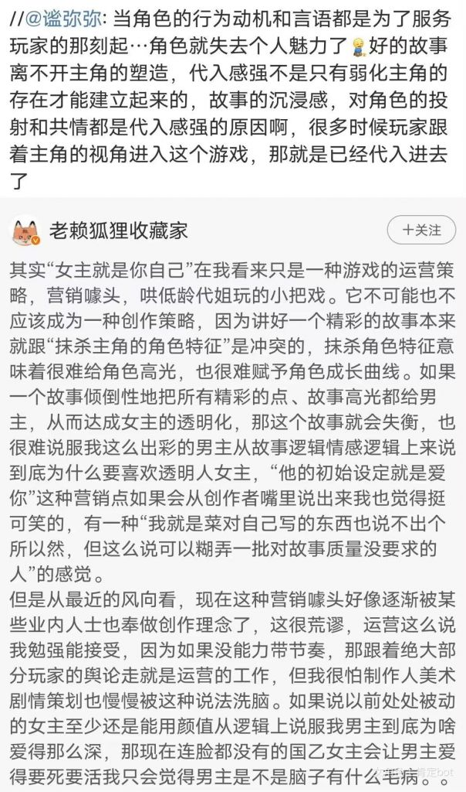

### [破事氵]发个图来解析一种女性为什么要在一般向扎根的可能

Made by ngapost2md (c) ludoux [GitHub Repo](https://github.com/ludoux/ngapost2md)

----

##### 0.[6] \<pid:0\> 2024-01-30 17:53:50 by 云藤

没有映射，只是讨论，图内乙游，我说完了，别噶我头皮，  
评论引用：
虽然爱的核心是不管你是谁你有什么样的性格品质都会被爱也值得被爱，但是一点特征都没有的纯皮囊只会让人觉得这是滥情，根本不是那种爱，哪怕女主浑身都是缺点那好歹也是个独立的人啊

笑死，没独立人格是个皮套她就能代了那她又是什么，意思是也没有自己的人格呗。女主身上可以有多面性甚至可以有性格割裂的部分这都没关系，反正有很多男主可以喜欢她不同的特点，挑一个最符合自己感觉的代不就完了，又或者她们真的很喜欢臆想自己是小三那只好便宜她们了。

----

##### 1.[7] \<pid:740663770\> 2024-01-30 17:55:52 by linkaM
这不就是经典腐蛆白河豚话术吗 
我觉得男/女主一无是处，虾头男/女凭什么被喜欢凭什么要拆散我cp  
但他们磕cp的理由也只有两张立绘罢了

----

##### 2.[6] \<pid:740663888\> 2024-01-30 17:56:24 by 唉！社管
 
第一步 圈地 
第二步 打拳并以道德为高地 把游戏往自己想要的方向改
第三步 驱逐原住民
去看看晋江怎么死的

----

##### 3.[3] \<pid:740663996\> 2024-01-30 17:56:53 by 我是社管有男不玩
爱有什么理由吗 
我家狗蠢笨肥懒胆子小还不叫 简直是喜乐蒂之耻
我也很爱它啊

从来没有被爱过人才会给爱找理由吧

----

##### 4.[0] \<pid:740664364\> 2024-01-30 17:58:36 by 蓝梦公司
这不是当年腐女龟训国乙解的话术吗？不过现在的那边的战况好像已经变成“日乙并非国乙法外之地”了……

----

##### 5.[1] \<pid:740664795\> 2024-01-30 18:00:41 by sadudas
我对二游确实从来没有过什么代入感，剧情和人物发展合理都行，但是运营游戏本来也是服务业，你服务玩家的自然是要讨好玩家的，就看你想讨好哪批人了。
国乙我不好说，但所谓“一般向”的二游在这块儿肯定会面对更复杂的情况。要知道现在是男女对立问题尖锐化的环境，几乎没可能同时讨好两个性别的。
对待“一般向”二游，如果希望服务商讨好自己，那就应该让服务商认清现实，到底哪方用户才是付费主体。也就是说，最后还是回归到那四个字。
记得捂紧钱包。

举个例子来说，战双帕弥什最近半年的收入我看了我就能笑出声期待过年大活爆米捏

----

##### 6.[4] \<pid:740664844\> 2024-01-30 18:00:56 by mp36969
人家乙解好歹真靠自己的力量创建了一个让自己舒适的女性向游戏环境，这帮寄生虫除了寄生在男性圈子里恶心人还会干嘛

----

##### 7.[3] \<pid:740665202\> 2024-01-30 18:02:40 by 五枝星穗
搞笑，爱可是人类最大课题之一，有的是角度塑造
写不好错的是“角色爱你”吗？

----

##### 8.[1] \<pid:740665292\> 2024-01-30 18:03:10 by noppa2
看起来说得头头是道的一堆字，但是这对于<b>有男不玩</b>毫无意义

----

##### 9.[0] \<pid:740665348\> 2024-01-30 18:03:24 by 逝者森林
我觉得理由更简单
就不存在圈地自萌的群体，更精确地说：
不可能控制圈子的所有用户，不在无关内容下扩散自己的内容。

而这种扩散最终会造成互相抢地盘的现象。
说难听点，就人性角度，大多数人比起合理发言，更期望看到“自己的人”哪里都是，造成一种自己就是最受欢迎的那种错觉。  

你看看现在什么圈子没有xxn？需要合理性吗？

----

##### 10.[0] \<pid:740665498\> 2024-01-30 18:04:14 by 诸爱得彼福
写不好不是你自己能力问题吗，还能怪题材

----

##### 11.[0] \<pid:740667491\> 2024-01-30 18:14:26 by 善恶天平
“游戏角色只为玩家服务就失去了个人魅力”

我先不论把虚拟人物当做真人有多可笑，有没有一种可能，无论是小说还是漫画还是影视剧，虚拟人物本质是和剧情互相服务？ 
游戏作为服务行业一种，为玩家服务本身就是理所当然的事情，何来“为玩家服务就失去魅力”这一说？ 我的评价是：思维简单，认知短浅，情绪用事，建议和米锁死

----

##### 12.[0] \<pid:740670169\> 2024-01-30 18:29:03 by 袁卫英
做个假设就能想清楚了

假设，碧蓝(大碧蓝或者小碧蓝皆可)抽风出了一个完美帅气男，加上宣发到位，会不会引来一群xxn呢？
再假设，某个乙游也抽风出了一个丰乳肥臀女，宣发到位，也会有大把宅男抢着去玩吗？

所以说啊，羽中赶紧做几个男人放卡池里还有救

----

##### 13.[1] \<pid:740678893\> 2024-01-30 19:20:06 by 冠位章鱼丸子
说得好，但是我有男不玩，作为我的有男不玩信条里面的优秀作品举例子，女装学院里面6条线三个娚主和主角的互动也不是一开始就建立起来的啊。。

----

##### 14.[1] \<pid:740679464\> 2024-01-30 19:23:26 by rream_kly
这下不得不支持国乙法了，有些人就是下贱瞧不起自己，连被爱的渴求都不敢正大光明的表达出来，还要否决别人对被爱的渴求。

----

##### 15.[2] \<pid:740681430\> 2024-01-30 19:34:52 by 炒鸡内金
所以为什么国乙解打女主党嘛，你都是花了钱的大老爷了还得被这群人规训你不配代入女主，女主那么优秀，不优秀的女主凭什么被男主爱，这种人还没被国乙解打死都算手下留情了

----

##### 16.[0] \<pid:740681979\> 2024-01-30 19:38:01 by 给名狂魔
蟑螂是这样的  不过无所谓 我有男不玩

----

##### 17.[1] \<pid:740682127\> 2024-01-30 19:38:56 by linkaM
>[jump](#pid740665202) 五枝星穗(2024-01-30 18:02) 说: 
>
>搞笑，爱可是人类最大课题之一，有的是角度塑造
>写不好错的是“角色爱你”吗？

真的跟着他们思路去对“角色爱你”的合理性吹毛求疵就是中了圈套了，角色优秀也就一张jpg一个建模几行文字设定，玩家可是真的厂商衣食父母凭啥不配被爱
而且他们喷“写的不好”的出发点本身就不是到底好不好而是拆了他们cp
真一般向游戏比如nsh都有厕妹圈地借人设磕cp然后被ml剧情破防骂主角不配被原著角色关心喜欢应该滚去和游戏原创角色锁死的

----

##### 18.[0] \<pid:740682958\> 2024-01-30 19:44:15 by 丿夕日坂
腐蛆和白盒豚是整个ACG界的公敌，它们说的话让精神科的大夫听了都恨不得直接拉去实验室。

----

##### 19.[2] \<pid:740683716\> 2024-01-30 19:49:21 by 是香蕉哦~
单就现实来说没错，没啥特点的人没人喜欢。有显著特质的人会被对上电波的人喜欢。但这是游戏啊，这类游戏不是设定的玩法就是里面的角色都爱玩家主角么？可以说这种游戏直接设定的好感和喜爱质量很低而且很假，这没问题。
但很多游戏都有设计功力不足显得质量很低表现得又很假甚至逻辑硬伤的一面。但大部分玩家只需要简单的快乐就行了，打游戏不是搞搞文学鉴赏。况且游戏制作团队的文化水平公认的还不如网文作者。所以，在路边摊里找高档纯手工奢侈品是不是搞错了什么。

----

##### 20.[0] \<pid:740685795\> 2024-01-30 20:02:57 by 花散里爱洗铁路
这其实就是一个化用的问题，你看看女性用户最火热的同人区就明白了，她们只能在别人的基础上搞东西，离了拐杖就不能走路你还能指望什么呢？

