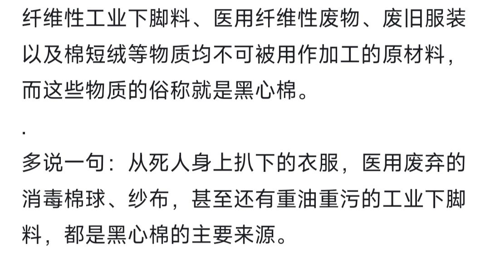

### [杂谈氵]米米米碡坏事做尽

Made by ngapost2md (c) ludoux [GitHub Repo](https://github.com/ludoux/ngapost2md)

----

##### 0.[5] \<pid:0\> 2024-01-30 18:10:04 by 爱波西米亚
再割头皮我就跑路了?
名词解释
黑心棉就是劣质絮用纤维制品，具有以下特征：
1、呆白而无光泽。

2、手感无弹力。

3、不光滑，易粘连衣物。

4、双手扯断束纤维断裂整齐，纤维强力极低。

5、有化学漂白处理有异味。

经过漂白处理的“黑心棉”对人体危害极大。它不但破坏了棉纤维表皮的蜡质层，而且纤维中腔和胞壁也吸收了大量的化学物质，直接接触人体会引起瘙痒过敏、呼吸困难等症状，长期使用会使人得病。
黑心棉：不管表面装饰的多么冰清玉洁，高贵优雅，但内芯散发着恶臭。
碡(zhou)

----

##### 1.[2] \<pid:740666716\> 2024-01-30 18:10:31 by 肯定是假的
都怪MXZ都怪MXZ

