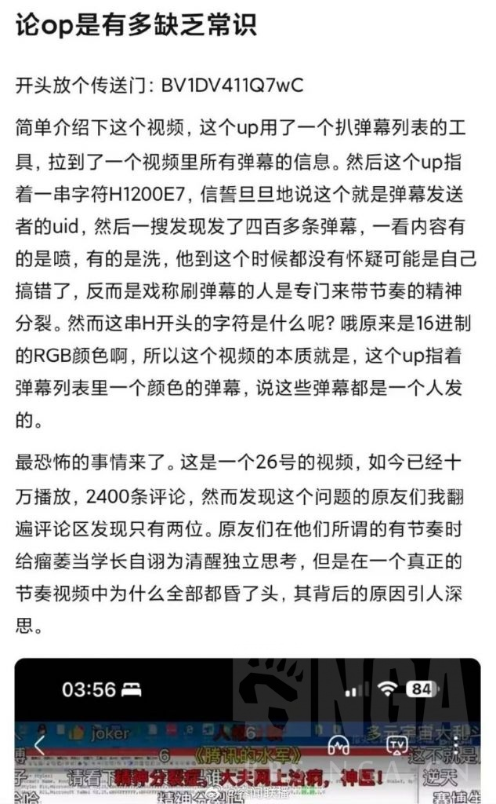
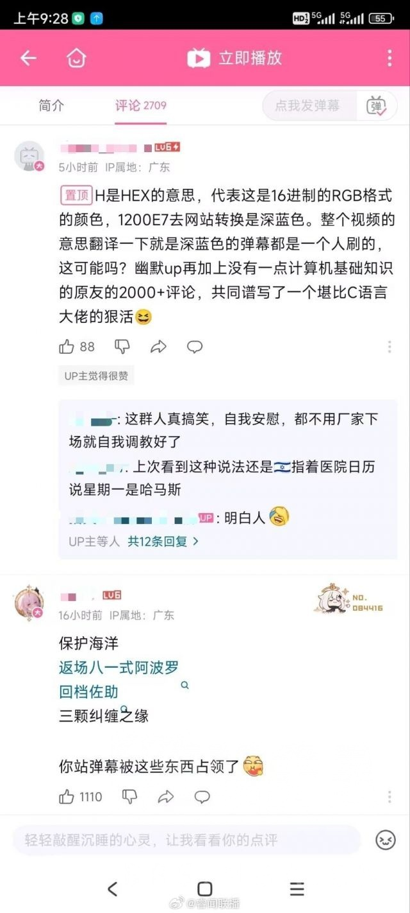
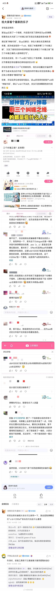
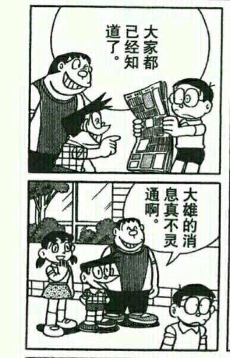

### [新闻] c语言大神通过神秘字符找出米黑反串水军！

Made by ngapost2md (c) ludoux [GitHub Repo](https://github.com/ludoux/ngapost2md)

----

##### 0.[0] \<pid:0\> 2024-01-30 19:53:00 by 吔！呱！
节目效果太强了

----

##### 1.[0] \<pid:740684455\> 2024-01-30 19:53:55 by 吔！呱！

----

##### 2.[3] \<pid:740684483\> 2024-01-30 19:54:06 by 94646843z
[url](https://ngabbs.com/read.php?tid=39148214)

----

##### 3.[2] \<pid:740684918\> 2024-01-30 19:57:01 by 阳光低调行事
笑了，手综已经失去反米的能力了。N个反米帖外加几个老熟人出手都远不如之前。

很委屈吧？现在一想原来之前反米本质和帮着魈解打散解一样，真的麻了。这被图图一圈，最正义最委屈的粥U居然连点赞都不来了。原形毕露。

