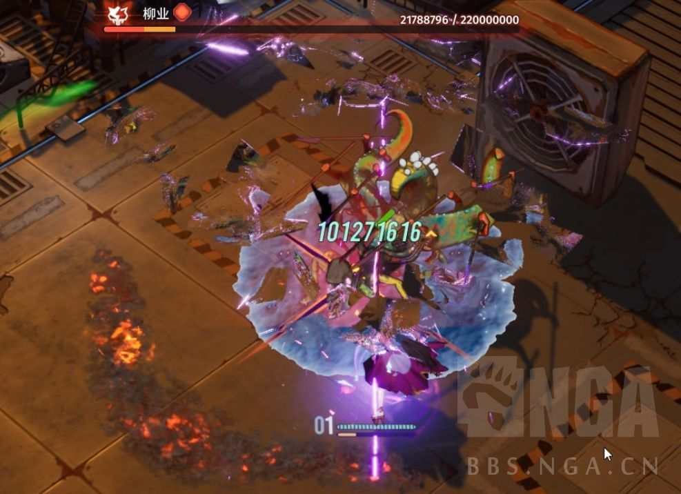

### [破事氵]开服不到一个月，小技能数值就膨胀到了一个亿。

Made by ngapost2md (c) ludoux [GitHub Repo](https://github.com/ludoux/ngapost2md)

----

##### 0.[0] \<pid:0\> 2024-01-30 20:47:07 by 隆火百炼丶安逸
过一年还不得以兆京垓为伤害单位。

----

##### 1.[0] \<pid:740693070\> 2024-01-30 20:48:08 by rream_kly
这是哪款游戏？

----

##### 2.[0] \<pid:740693259\> 2024-01-30 20:49:25 by 隆火百炼丶安逸
>[jump](#pid740693070) rream_kly(2024-01-30 20:48) 说: 
>
>这是哪款游戏？

白荆回廊

----

##### 3.[1] \<pid:740693376\> 2024-01-30 20:50:04 by 大狗跳小狗叫
虽然白荆有男不玩，但有没有一种可能，目前正在逐渐解除对装备(烙痕)与角色等级的限制，所以小技能的伤害回归到了某一等级应有的伤害，而非出了一个数值爆表的新角色。

----

##### 4.[3] \<pid:740693466\> 2024-01-30 20:50:35 by 热die鱼
就这BOSS血条来说，
感觉这完全是制作组意料之中的事情？

----

##### 5.[0] \<pid:740693736\> 2024-01-30 20:52:09 by 友達募集哒
数值膨胀被诟病的本质是逼氪，而不是大数字，没逼氪看大数字也没什么不好的吧。  
电脑里有一款因为代码上限，搞数值压缩不让玩家看大数字的网游.jpg。

----

##### 6.[0] \<pid:740693984\> 2024-01-30 20:53:35 by 无花果的夏天
>[jump](#pid740693736) 友達募集哒(2024-01-30 20:52):

除了某14的5.x版本大数字爆屎山外，确实是数字越大越好，只要别逼我氪

----

##### 7.[0] \<pid:740695477\> 2024-01-30 21:03:54 by 旋律丨
看见京为单位，我还以为是暗黑

----

##### 8.[0] \<pid:740695792\> 2024-01-30 21:05:58 by asfgshrth
烙痕搭配好，猴出来的伤害高的吓人，我也干出过一亿的大数字

----

##### 9.[0] \<pid:740697685\> 2024-01-30 21:18:23 by 爪子超凶
所以是新角色能打出这种输出，整体输出能力远远超过老角色吗？这游戏我是真云都没云
藤子的数值其实一直都不错的，我感觉不至于犯这种错误

----

##### 10.[0] \<pid:740698370\> 2024-01-30 21:22:50 by ╰浅殇刷7
>[jump](#pid740697685) 爪子超凶(2024-01-30 21:18) 说: 
>
>所以是新角色能打出这种输出，整体输出能力远远超过老角色吗？这游戏我是真云都没云
>藤子的数值其实一直都不错的，我感觉不至于犯这种错误

这是5星开服角色打出的输出，最高是6星

----

##### 11.[0] \<pid:740718719\> 2024-01-30 23:44:06 by 爪子超凶
>[jump](#pid740698370) 浅殇刷7(2024-01-30 21:22) 说: 
>
>这是5星开服角色打出的输出，最高是6星

那看起来没啥问题啊大概数值就是这么设置的。
位数多看起来吓人而已？

