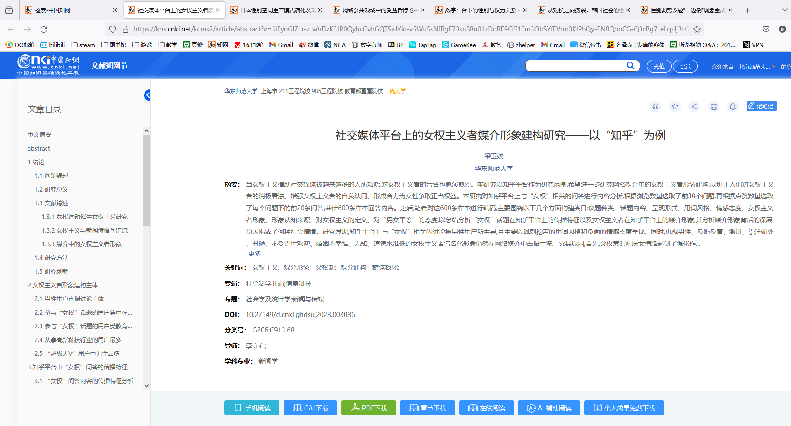
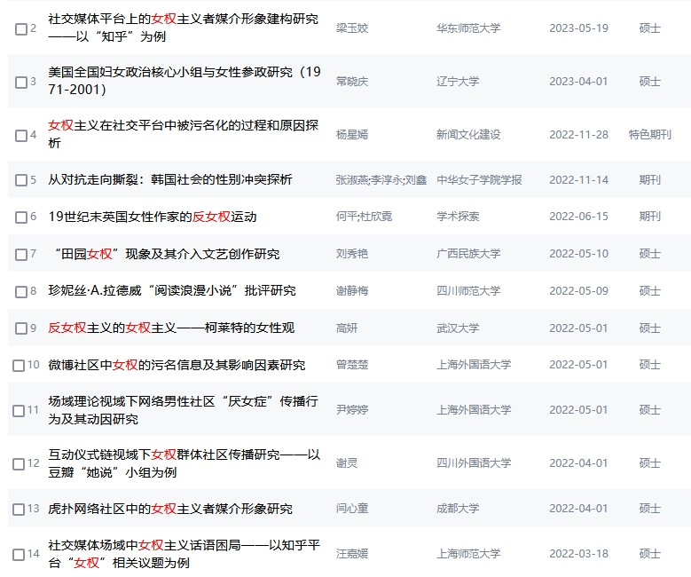

### [破事氵]给各位推荐卢诗翰的&lt;性别战争三十年&gt;

Made by ngapost2md (c) ludoux [GitHub Repo](https://github.com/ludoux/ngapost2md)

----

##### 0.[0] \<pid:0\> 2024-01-31 02:05:11 by 支援型梅尔特
[url](https://card.weibo.com/article/m/show/id/2309404685100695814412)
了解一下来龙去脉有助于更好的选择处理方式
还有就是每日必修
<b>有男不玩</b>

----

##### 1.[1] \<pid:740733079\> 2024-01-31 02:07:32 by 对对双双
几年前就火过一阵子了，应该在网上冲浪的多数人都看过了吧
还真是居然都700多w浏览量了

----

##### 2.[0] \<pid:740733258\> 2024-01-31 02:10:31 by yaoguanh
这文章的深刻性说实话我觉得还是差了点。

我想看点更专业的分析这个问题的书籍或者论文

----

##### 3.[0] \<pid:740733304\> 2024-01-31 02:11:30 by 绝望之诗
然后这人去接原神商单开始吹原神了，还是星铁我忘了

----

##### 4.[0] \<pid:740733348\> 2024-01-31 02:12:32 by UID3244105
>[jump](#pid740733258) yaoguanh(2024-01-31 02:10) 说: 
>
>这文章的深刻性说实话我觉得还是差了点。
>
>我想看点更专业的分析这个问题的书籍或者论文

科普来说足够了，太专业反而没多少人愿意看

----

##### 5.[2] \<pid:740733362\> 2024-01-31 02:12:50 by isaaclgf

总觉得一个月前还在车他，一搜果然就有了
所有游戏，所有人都是用得着的时候吹上天，用不着就使劲批判就完事了

----

##### 6.[0] \<pid:740733526\> 2024-01-31 02:16:18 by yaoguanh
>[jump](#pid740733348) UID3244105(2024-01-31 02:12) 说: 
>
>科普来说足够了，太专业反而没多少人愿意看

正如楼下那个他吹星铁翻车的图，他这个文章我早就看过但我早就觉得里面缺专业性的东西。所以我才想看看专业性的书或者论文。

所以有没有坛u推荐点

----

##### 7.[0] \<pid:740733675\> 2024-01-31 02:19:18 by 被ban了了了
他吹米都吹上天了

----

##### 9.[0] \<pid:740734137\> 2024-01-31 02:28:06 by 為往圣继绝学
>[jump](#pid740733304) 绝望之诗(2024-01-31 02:11) 说: 
>
>然后这人去接原神商单开始吹原神了，还是星铁我忘了

其實也點評了和諧

甚至暗示了米內部有xxn

----

##### 10.[0] \<pid:740734290\> 2024-01-31 02:30:58 by 哈布斯堡紫泉
>[jump](#pid740733675) 被ban了了了(2024-01-31 02:19) 说: 
>
>他吹米都吹上天了

不如说米给这几个反女权kol都发了商单倒是挺怪的

----

##### 11.[2] \<pid:740734309\> 2024-01-31 02:31:15 by 為往圣继绝学
>[jump](#pid740733258) yaoguanh(2024-01-31 02:10) 说: 
>
>这文章的深刻性说实话我觉得还是差了点。
>
>我想看点更专业的分析这个问题的书籍或者论文

估計沒有

這話题在中日欧美都不政確，你敢寫你這輩子都別想混學術圈了，而民間人士的水平終究是比較參差的，盧算裏面水平不錯的了。而民間人士經濟上也衹能像盧那樣各種接商單來養自己

在棒子可能有點土壤，但棒子的思想水平

----

##### 12.[0] \<pid:740734452\> 2024-01-31 02:34:39 by UID3244105
>[jump](#pid740733526) yaoguanh(2024-01-31 02:16) 说: 
>
>正如楼下那个他吹星铁翻车的图，他这个文章我早就看过但我早就觉得里面缺专业性的东西。所以我才想看看专业性的书或者论文。
>
>所以有没有坛u推荐点

这我还真不专业，对韩国只知道这些年的一点皮毛，对冈本倒是凭兴趣通过一些报道、纪录片、女权小说稍稍看了一点杂七杂八的东西，等楼下的坛友补充吧。

----

##### 13.[0] \<pid:740734755\> 2024-01-31 02:41:22 by 94646843z
从当年果子狸777之类的玩意在微博疯狂打拳到现在才几年，就已经全面失守了。
最搞笑的还是集美和龟跑来扣帽说极端，人家女拳在哪学韩国斜角天天图图xdz啥的挂嘴边，来说反女拳极端，双标玩的明明白白。
想要战胜仙女你得把你的底线降低到和她同等水平，不然怎么可能打得过双标狗(当然了，不能违法犯罪)

----

##### 14.[0] \<pid:740735723\> 2024-01-31 03:05:56 by 星河夜遥
大致搜了下，几个标签页大家感兴趣可以去看看

----

##### 15.[0] \<pid:740735857\> 2024-01-31 03:09:22 by 7X28X9
知网找找，应该还是由研究社科的做这个方向研究，不过语言会偏隐晦和学术化，毕竟不能写个论文变成激化矛盾了

不过我没动力结婚，再怎么吵，最多影响我看不了男性向文娱，大不了现实中撸铁呗，还能陪陪父母，母亲才是最爱自己的女性啊

----

##### 16.[0] \<pid:740736257\> 2024-01-31 03:22:01 by 鬼岛巨人一米四
>[jump](#pid740733304) 绝望之诗(2024-01-31 02:11) 说: 
>
>然后这人去接原神商单开始吹原神了，还是星铁我忘了

我关注的几个反女权大v都发了，应该是给的多吧

所以说尽管去年年初复刻卡池卖的不错，我都怀疑去年整年米桑盈利没盈利，这里面又让xxn吃了多少回扣

基本上市面上大点的APP都有他家广告，各路不沾边的博主都有他的推广，这成本可不是小数目

----

##### 17.[3] \<pid:740736605\> 2024-01-31 03:33:50 by 鬼岛巨人一米四
>[jump](#pid740733362) isaaclgf(2024-01-31 02:12) 说: 
>
>
>总觉得一个月前还在车他，一搜果然就有了
>所有游戏，所有人都是用得着的时候吹上天，用不着就使劲批判就完事了

他恰饭≠他的文章不能看

他是圈外人，不太清楚恰这口饭对我们的观感是什么，因为米哈游可能对很多不了解的人来说，比如说国新区的大叔们，是个“优秀上沪互联网企业”

----

##### 18.[0] \<pid:740736746\> 2024-01-31 03:38:40 by darbox
念这么多经不如一句“有男不玩”

----

##### 19.[0] \<pid:740737663\> 2024-01-31 04:12:01 by 羿阳君
卢老爷那一套说实话过时了
他的研究范围一直是欧美日韩女权，那些女权要么有更高的被压一头，要么已经半死不活了
他的思路基本都是 欧美的女权有什么，那是因为有代价的，代价是什么什么什么，你不能只要权力不要义务
但国内女拳早就闹到既要又要还要了，你怎么能和她们讲道理呢
当然，文章还是有价值的，不过主要还是在分析日韩，国内未来怎么走还是难说，我是觉得大概率走日系躺平派的再说吧，大家护好钱包比什么都重要

