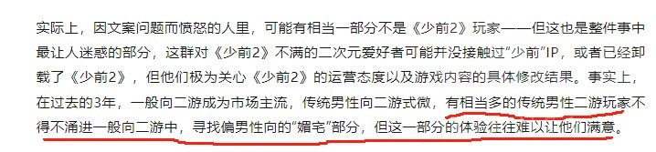
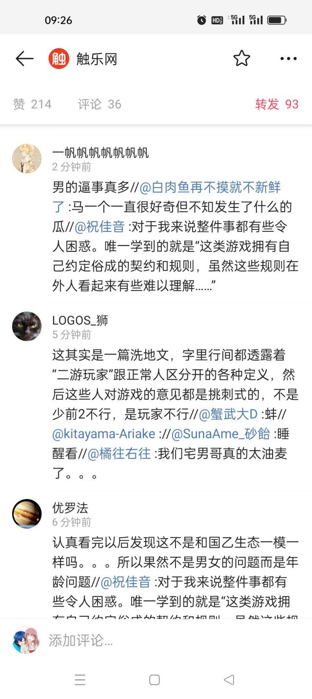
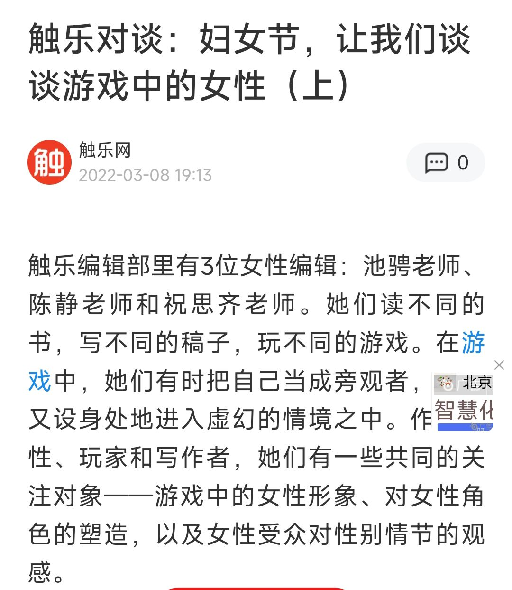

### [破事氵]少前2这下真成耻辱柱本柱了

Made by ngapost2md (c) ludoux [GitHub Repo](https://github.com/ludoux/ngapost2md)

----

##### 0.[6] \<pid:0\> 2024-01-31 02:25:32 by 简在鼠心
刚刚触乐网发了一片总结少前2这段时间节奏的文章。

触乐嘛，了解的朋友应该都知道，它屁股是骑墙但比较偏厂商的，定位有点接近游戏媒体里的胡锡进。

这次这篇竟然罕见没太避重就轻，把少前2节奏的几个关键点都写进去了，对散爆的定调基本是战犯级的。

众所周知，一个事件，如果到了连触乐这样的骑墙媒体都要出来为玩家说两句好话的时候，那被针对的主体在业内基本是完全臭掉了。

只能羽中的惊世智慧已经到了连同行都为之错愕，力求切割的地步了。

原文链接：[url](https://mp.weixin.qq.com/s/Wl1_il-nEoUbSnROeMWBkA)

试一下发长图：

----

##### 1.[1] \<pid:740744434\> 2024-01-31 08:03:53 by asd92570689
懂不懂什么叫惊世智慧啊

----

##### 2.[3] \<pid:740744544\> 2024-01-31 08:04:57 by Dorothy_Goddess
触乐这篇也在洗，攻击石英队长来着

----

##### 3.[3] \<pid:740744547\> 2024-01-31 08:04:58 by wzjzoo1022
长图发的挺好的，下次别发了。

----

##### 4.[0] \<pid:740744560\> 2024-01-31 08:05:07 by 白告姬
图好像还是压糊了
但对于这种自带原文链接的行为我必须点个赞

----

##### 5.[1] \<pid:740744604\> 2024-01-31 08:05:33 by 黄前久美子子
怕不是哪个小编真玩少前
或者干脆写出来要好处费的 钱到删帖那种

----

##### 6.[0] \<pid:740745229\> 2024-01-31 08:11:42 by LtheMelonEater
这个问员工说舅舅全是假的也是老话术了，属于骂羽中但是稳军心那一档

我们虽然流水跌了，但是有沉默大多数在，还是能活的，你们别怕继续氪啊.jpg

全女二游新的都挨拳了我们还没挨快来玩我的游戏啊.jpg

外面的舅舅都是假的，我们项目组没大问题，不会影响开发你们继续玩啊.jpg

经典明黑暗洗话术

----

##### 7.[2] \<pid:740746191\> 2024-01-31 08:20:20 by 豆沙团团
从事七年的游戏工作者小祥，原来大祥老师你还做游戏啊

----

##### 8.[1] \<pid:740746472\> 2024-01-31 08:22:37 by 自备作战整合
熟悉触乐的人，都知道名篇：因爱之名

----

##### 9.[0] \<pid:740746599\> 2024-01-31 08:23:48 by RetAeDoG
触乐是谁

----

##### 10.[0] \<pid:740746600\> 2024-01-31 08:23:48 by 我是社管有男不玩
新活动剧情删的裤衩都凑不齐完整一条的当口怒斥舅舅胡说
掩耳盗铃的味道是不是重了点

----

##### 11.[0] \<pid:740746687\> 2024-01-31 08:24:28 by 壮士断袖
事件大差不差，但总觉得有一股异味在里面。

----

##### 12.[2] \<pid:740746805\> 2024-01-31 08:25:20 by JusticeSKL
这篇文章尽力洗了，只不过散爆烂事实在太多。
说到底还是在说玩家极端，我不知道公司都肆无忌惮成这样了玩家还算极端吗？

----

##### 14.[0] \<pid:740747911\> 2024-01-31 08:34:13 by 致命投球手
我问一下哪里领显微镜？

----

##### 15.[1] \<pid:740748526\> 2024-01-31 08:38:39 by 冷月冷月冷
这不是还在洗明里暗里都在说是玩家的错

----

##### 16.[0] \<pid:740748763\> 2024-01-31 08:40:12 by 高坂瑠璃
这就是重金请来的公关公司的手笔么

----

##### 17.[0] \<pid:740749341\> 2024-01-31 08:43:48 by 艾陆可
看完了，怎么又是谣言又是玩家过于敏感啊

----

##### 18.[0] \<pid:740749664\> 2024-01-31 08:45:42 by 快捷键将２２２
为什么要骂黄总？因为黄总把业内一直想做也在做的事毫无技巧毫无前戏的笨拙的做了出来，把业内阴湿的德性暴露在了玩家面前，其他友商看见黄总的自爆行为都担心自己这栏的玩家也回过味了，能不给黄总落井下石吗

----

##### 19.[1] \<pid:740750091\> 2024-01-31 08:48:20 by 7thheaven_rs
春江水暖鸭先知。冷也是。

----

##### 20.[1] \<pid:740750249\> 2024-01-31 08:49:20 by wusaochen
读完第一感觉暗示二游玩家太极端了，ml人在拿散爆出气，对于散爆的破事，文章大部分都以“玩家认为”“玩家并不满意”的角度出发整理了事件过程，散爆对应的错误处理只用了寥寥几笔，所以通篇感受是ml人情绪很大，有点无理取闹

难道是新的公关在铺垫拉拢无知路人吗，虽然我不知道这ip臭的还有没有路人

----

##### 21.[0] \<pid:740750492\> 2024-01-31 08:50:45 by 围观群众老王
你的截图就很整蛊，像是芝麻糊一样

----

##### 22.[0] \<pid:740750796\> 2024-01-31 08:52:38 by btpeterpan
最后吹所谓的沉默的“大多数”，我只能说有本事硬气一辈子，等着节后数据大涨。

想凭借点话术就抹杀玩家们对散爆的抵制，太天真了

从某种意义上来说，已经是敌我矛盾了

----

##### 23.[0] \<pid:740751836\> 2024-01-31 08:58:34 by 泥浆小怪兽
感觉还是有点怪，一边说一般向要有极高游戏性，满足大部分人的需求，但是又把宅男排除开，意思就二游玩家不算正常玩家，还是极端那种。女性玩乙游是正常的，男性就不能有自己乙游了吗。

----

##### 24.[0] \<pid:740754753\> 2024-01-31 09:14:40 by 打脸才有意义
说白了 还是在尬洗厂家。可见媒体的屁股在哪。  
什么叫<b>传统二游玩家大量涌进一般向游戏</b>，明明是大量缅北游戏假装二游骗玩家入坑。
虽然整理的还算全。。。。。不过其心可诛。

----

##### 25.[6] \<pid:740755062\> 2024-01-31 09:16:17 by d1y2w3
这文章的遣词造句到处充满着对男性向媚宅二游的瞧不起，看似在说散爆，实则在说你们宅男屁事怎么这么多

----

##### 26.[3] \<pid:740755787\> 2024-01-31 09:20:08 by NecoMaster
这篇文章屁股歪到不能再歪了，春秋笔法完全不提女性凝视和xxn对传统二游的入侵，字里行间都在暗示你们这帮原住民不愿意乖乖被割头皮的不满

----

##### 27.[0] \<pid:740756041\> 2024-01-31 09:21:32 by 雨中樱花
羽中可是真的觉得玩家不买单那就是玩家的问题不是游戏和它这个傻逼的问题，这就很乐了

----

##### 28.[2] \<pid:740756094\> 2024-01-31 09:21:49 by 我想静静2023
他这个是一半事实一半扭曲的高明洗地，看样子是请了大手。
几个关键被模糊了，首先原一开始是个鸡儿的一般向，开局四女一男萝莉御姐少女都有是一般向，他说的像是所谓ml玩家去一般向游戏讨饭，但实际上是根本没有什么ml不ml分类，这就是厂商做出来分裂玩家的概念，事实是只有男性向二次元，而这类作品为了所谓扩圈开始转向招揽xxn，给自己起来一个所谓一般向的名字，可笑，真正一般向是灌篮高手小排球，不是你这样各种扭曲xxnxp大集合。
他拐了原神，说是跟原神学的，却没说原把自己折腾成啥样了，完全颠倒因果，不是玩家主动入侵是你厂商主动转向背叛原来花钱的受众。
文章很高明，但用意可比尬洗恶心多了。
有男不玩，你继续骗，反正骗不到我们

----

##### 29.[0] \<pid:740756991\> 2024-01-31 09:26:20 by waterstars
>[jump](#pid740756094) 我想静静2023(2024-01-31 09:21) 说: 
>
>他这个是一半事实一半扭曲的高明洗地，看样子是请了大手。
>几个关键被模糊了，首先原一开始是个鸡儿的一般向，开局四女一男萝莉御姐少女都有是一般向，他说的像是所谓ml玩家去一般向游戏讨饭，但实际上是根本没有什么ml不ml分类，这就是厂商做出来分裂玩家的概念，事实是只有男性向二次元，而这类作品为了所谓扩圈开始转向招揽xxn，给自己起来一个所谓一般向的名字，可笑，真正一般向是灌篮高手小排球，不是你这样各种扭曲xxnxp大集合。
>他拐了原神，说是跟原神学的，却没说原把自己折腾成啥样了，完全颠倒因果，不是玩家

看完同感  

提到黛烟就“一部分ml人认为黛烟是自己老婆，自己被绿了”

只字不提少前1的95是可以签契约送戒指穿婚纱的

当然了，如果写这个文章的人不知道戒指和婚纱是什么东西，是用来干啥的，那可以原谅。

----

##### 30.[0] \<pid:740757529\> 2024-01-31 09:28:51 by 狼牙破神势
游戏自媒体喜来乐，是帝国董事长之喜啊，芜！

----

##### 31.[2] \<pid:740757831\> 2024-01-31 09:30:16 by Vanitas0
触乐还是厉害，跟当年那篇《因爱之名》一样，明贬暗洗，我觉得需要小队长出面给这个文章定下性，不然很多人被他们骗过去了。

下面截图中间那位说得很好。
建议都去触乐微博看看这篇，转发里全是集美在嘲讽，再看看祝佳音转发里说的啥，态度很明显了

----

##### 32.[0] \<pid:740758108\> 2024-01-31 09:31:40 by 瑞之海、凤之空
是不是当初写麦当劳的也是他们

----

##### 33.[0] \<pid:740758240\> 2024-01-31 09:32:15 by 米开朗基罗
这就是请来的公关大手子？

----

##### 34.[5] \<pid:740758341\> 2024-01-31 09:32:40 by 牟薇
触乐网的屁股本来就不站在男玩家这边啊，这篇经典文章楼友都没看过？

----

##### 35.[1] \<pid:740759391\> 2024-01-31 09:37:44 by 潜水企鹅
记得瓜版有说过狱中花重金找社管洗地，还有真假舅舅，要求商单明贬暗扬，这篇可是标准的洗地文，不知道值不值5位数呢？

----

##### 36.[0] \<pid:740759802\> 2024-01-31 09:39:38 by zclh
这篇洗地挺贵的吧

----

##### 37.[0] \<pid:740760037\> 2024-01-31 09:40:42 by ltfyyz
触乐这几年完全没有以前那种态度了，微博互动量也低的可怜，把自己运营没了的典型。

----

##### 38.[0] \<pid:740760530\> 2024-01-31 09:43:03 by 安塞腰鼓对
>[jump](#pid740750249) wusaochen(2024-01-31 08:49):

也就逮着男玩家踩了

----

##### 39.[1] \<pid:740762168\> 2024-01-31 09:51:02 by XXNnmsl
很喜欢触乐幕刃的几句话
“虽然我对尼尔机械纪元里的小男孩9s发情，但是2b太男凝了。”
“虽然我玩乙游b都要扣烂，但是galgame消失能让世界更美好。”
建议所有人都品读一下触乐网之前妇女节发的几篇雌文，感受一下幕刃的双标和逆天程度，这就是我们高学历高审美有文化的理智女人啊，真是处处又生生啊。

----

##### 40.[0] \<pid:740763607\> 2024-01-31 09:57:31 by liyunhao
这文章明早是春秋笔法拉满了，暗着损玩家群体

----

##### 41.[0] \<pid:740764055\> 2024-01-31 09:59:30 by D-命运
翀从16年分家学到的不会只有买水军通稿吧

----

##### 42.[3] \<pid:740765322\> 2024-01-31 10:05:00 by 安塞腰鼓对
男玩家吵=钱少事多
女玩家吵=正常发声争取权益

----

##### 43.[1] \<pid:740765805\> 2024-01-31 10:07:16 by aluba000
这篇的问题在于把制作组设定为蠢
但有吃过一些瓜的人都知道

他们是坏

----

##### 44.[0] \<pid:740766228\> 2024-01-31 10:09:13 by xiebazhi110
我就直说了，这通篇下来，所有涉及事实存在部分的都没什么问题，一些小的问题无须在意

但是除了事实存在的部分，所有针对玩家以及本身就在厂商边上的屁股的部分，都有各种各样的隐喻，偷梁换柱，欲盖弥彰

烧钱2的失败不是放烟花，而是注定的事实，在玩家都没入场的时候散爆自己的问题导致的

----

##### 45.[2] \<pid:740766558\> 2024-01-31 10:10:48 by vvvster
粗看了下，应该是明切瓜暗洗地。不过想到是触乐，也就释然了。

其中有把很大一部份意见归于“不玩游戏的玩家”，他没想过这些没怎么玩的很多都是一代的玩家，只不过因为各种各样的事没能继续，现在想在2代捡起来却被厂商背叛。他们忘了这游戏是有一代的，玩家是冲着这IP而不是冲着这游戏来的。

话说回来，可能这就是羽中眼中的对节奏的看法，也难怪会做出种种对反馈和节奏进行放置的奇怪举动，毕竟他眼中这些都是不爆米的。

----

##### 46.[0] \<pid:740766703\> 2024-01-31 10:11:33 by 巴基和比约恩
这文章最后的内容才是重点啦
背叛基本盘的没有好下场

----

##### 47.[1] \<pid:740770633\> 2024-01-31 10:29:56 by GiGaFotress
烧遍整个森林这个说法非常搞笑，汤里有老鼠屎还不让捞呗

----

##### 48.[0] \<pid:740772118\> 2024-01-31 10:36:40 by 月酱月酱
站厂商那个不是简中简？说什么背叛ml，玩家要的什么搞不清楚，说的很懂一样。了解玩家需求还不是框框爆米，原神一直骂的烧鸡大伙不都很喜欢，一换小男孩流水暴死。fgo的公主米都给b站爆自信了。交错战线上榜看得外面涩涩眼都红了。

----

##### 49.[0] \<pid:740772272\> 2024-01-31 10:37:19 by 推推白牛
>[jump](#pid740750249) wusaochen(2024-01-31 08:49):

如果用主流视角看的话，写得其实没问题。
你把这篇文章当作一篇“给不知道二次元的圈外人看也能看懂”的文章，那少前2这次事件里很多的节奏，在他们看来，可能就正如文章所描述的那样。

所以这文章对不对，得看视角是在主流人群还是“圈内”人。而作者的视角显然是前者，所以很多遣词用句会带着一种来自主流的凝视。
很多地方都是“玩家认为”“部分玩家觉得”，好像在对圈外人读者说——反正舆论是这样的，但事情我没定性哦，到底是游戏有问题还是玩家有问题，你们读者自己判断哦。

题外话，很多年前接入坑二次元文娱产品时，是真的觉得这是个虽然虚幻但十分美丽的异世界。想逃离了现实的压力，就去二次元里打发时间就好了，三次元不听不看不知道。
然而这几年来，不管媒体还是创作者还是用户，主流入侵的大势所趋，越发地不可避免了，真遗憾。

----

##### 50.[0] \<pid:740773449\> 2024-01-31 10:42:36 by 春风与酒不如你
谢谢你，下次别发了，贴个链接就行了

----

##### 51.[0] \<pid:740773802\> 2024-01-31 10:44:11 by mityberry
>[jump](#pid740766558) vvvster(2024-01-31 10:10) 说: 
>
>粗看了下，应该是明切瓜暗洗地。不过想到是触乐，也就释然了。
>
>其中有把很大一部份意见归于“不玩游戏的玩家”，他没想过这些没怎么玩的很多都是一代的玩家，只不过因为各种各样的事没能继续，现在想在2代捡起来却被厂商背叛。他们忘了这游戏是有一代的，玩家是冲着这IP而不是冲着这游戏来的。
>
>话说回来，可能这就是羽中眼中的对节奏的看法，也难怪会做出种种对反馈和节奏进行放置的奇怪举动，毕竟他眼中这些都是不爆米的。

是这样的，一个游戏不引流路人怎么可能畅销榜前列呢，老玩家哪来那么多米

----

##### 53.[0] \<pid:740775795\> 2024-01-31 10:52:45 by 随机生成的id
通篇明贬暗洗，还所有爆料是假的那你TM倒是拿个真的出来啊，还暗戳戳说玩家思维不正常，我可去你的吧，你要我掏钱我要你满足我要求这有什么不对?当年触乐写个《少女前线以爱之名》给阵面站台现在写个这东西给羽中站台是吧?我当年因为触乐是大软的人弄得而关注这媒体，现在TM给我搞这出?

----

##### 54.[0] \<pid:740776812\> 2024-01-31 10:56:58 by 高咲侑Official
千言万语不如一句<b>有男不玩</b>，因为有男，所以不玩<b>少女前线2：追放</b>

----

##### 55.[0] \<pid:740777694\> 2024-01-31 11:00:50 by D-命运
>[jump](#pid740775795) 随机生成的id(2024-01-31 10:52) 说: 
>
>通篇明贬暗洗，还所有爆料是假的那你TM倒是拿个真的出来啊，还暗戳戳说玩家思维不正常，我可去你的吧，你要我掏钱我要你满足我要求这有什么不对?当年触乐写个《少女前线以爱之名》给阵面站台现在写个这东西给羽中站台是吧?我当年因为触乐是大软的人弄得而关注这媒体，现在TM给我搞这出?

有一说一，因爱之名是黄翀出钱买的

----

##### 56.[0] \<pid:740778253\> 2024-01-31 11:03:15 by 少封号多积德
通篇都在说二游玩家不是正常人

可我认为二游玩家还是太温柔了 毕竟少前2还没死透

----

##### 57.[0] \<pid:740779186\> 2024-01-31 11:07:21 by 随机生成的id
>[jump](#pid740777694) D-命运(2024-01-31 11:00) 说: 
>
>有一说一，因爱之名是黄翀出钱买的

我靠，我当年读完以爱之名只觉得羽中真出生，把同寝室共患难的兄弟都踹了，里头那句“对方派出女公关”我记到现在(要是我记错了就对不起)

----

##### 58.[1] \<pid:740779764\> 2024-01-31 11:09:42 by 玉之龙
>[jump](#pid740777694) D-命运(2024-01-31 11:00):

小子们已经岁成是姚桑买的了

----

##### 59.[0] \<pid:740783267\> 2024-01-31 11:23:58 by 汤圆史莱姆
顶级文案，真能骗过路人

----

##### 60.[1] \<pid:740785094\> 2024-01-31 11:31:32 by tmacx4
他要不再稍微提一下女性向市场现在什么尺度？然后这文章就可以炸了

----

##### 61.[0] \<pid:740787626\> 2024-01-31 11:42:28 by Hemerocallis5
有种xxn强忍着装理中客，避重就轻夹私货写流水账，给羽中洗地的感觉

----

##### 62.[0] \<pid:740794580\> 2024-01-31 12:14:29 by vvvster
首先前面开头先摆出这一段，定下基调。

[传统二游设计中那些小众的、见不得光的部分被磨灭，许多厂商认为，“媚宅”由一个小圈子内包含特定含义的中性词变成了贬义词。传统的男性向二游玩家逐渐处于失势的地位。]

暗戳戳的把玩家对剧情的意见往媚宅方向引，先把反对分子打上媚宅的，见不得光的标签。 中间谈的那些191事件，跟恐怖分子谈暧昧的角色ooc，还有鱿鱼素材其实都和媚宅无关。但他这么一写，没有关注整个事件的局外人如果只看开头和结尾，就被他忽悠过去了。即使是有点关注的人，也会以为整个问题的基调是因为少前不媚宅，不ML。

中途这一段

[(雷蒙夫人)这一事件中，“二游玩家”和“其他玩家”有着泾渭分明的感受：在普通玩家眼里，两个游戏角色之间产生感情十分常见——她们并不一定非要爱上主角；但在一部分二游玩家心目中，延续了前作世界观的《少前2》是一款“全女ML”游戏，它(以及大部分二游)的设计逻辑和一般游戏不一样。]

先分化意见群体和读者，把有意见的玩家打成ML，这里故意不提角色是有前作基础的，有云图打底的角色被写ooc，把一个前作表现果敢的上过战场的在云图里外柔内刚的角色写成同情恐怖分子的傻白甜。把前作玩家对ooc的愤怒和正常玩家对同情恐怖分子这一立场的厌恶都扭曲成为“有意见是因为不ML”。

在后面这一段

[我问毛毛：“什么是‘实质性’？”

“说到底，既然是测试，大家帮它测出毛病了，这是玩家在给游戏打白工，它不表示一下，就是不把玩家当回事。更何况它的内容已经严重伤害了玩家的感情。”毛毛说，“它可以承诺公测之后给我们补偿资源，也可以画可爱的女角色道歉图配在官方公告中。我们不想看像AI一样过于‘官方’的文字，我们希望能感受到项目组是真的明白‘自己错了’。”
毛毛用全女ML游戏《蔚蓝档案》向我举例“可爱的女角色道歉图”
简单来说，玩家们认为这是态度问题。而当某个问题上升为“态度问题”的时候，它往往就在一定程度上脱离了理性范畴，进入到感性的博弈之中。]

这段则是把“态度问题”简单化，玩家是因为厂家没有“用可爱女角色道歉”而觉得态度有问题的？ 态度问题是因为内测散爆对玩家意见反馈装死和对191事件反馈迅速引起的对比点燃的！但凡当时立刻出公告和处理意见，哪怕不立刻处理也能灭掉一半的火。根本用不着“可爱的女角色”来道歉。更不要说散爆在12月开服后剧情“如改”，养成材料卡死，还有送的抽卡资源朝三暮四，而这就是散爆对玩家反馈的态度！
后面再一句“脱离了理性范畴，进入感性的博弈”暗示玩家是因为感性上头，意见“不理性”。所以厂家后续不处理情有可原。洗地痕迹如此明显。

[实际上，因文案问题而愤怒的人里，可能有相当一部分不是《少前2》玩家——但这也是整件事中最让人迷惑的部分，这群对《少前2》不满的二次元爱好者可能并没接触过“少前”IP，或者已经卸载了《少前2》，但他们极为关心《少前2》的运营态度以及游戏内容的具体修改结果。事实上，在过去的3年，一般向二游成为市场主流，传统男性向二游式微，有相当多的传统男性二游玩家不得不涌进一般向二游中，寻找偏男性向的“媚宅”部分，但这一部分的体验往往难以让他们满意。]

这里先把玩家分成“不是少前2玩家”和“是少前2玩家”，把因为愤怒退坑，和还在玩一代和云图，正在考虑入坑的那部分潜在玩家分割出来，实际就是暗示“你们没玩，对黛烟剧情没有发言权”。

再用
[换句话说，自黛烟卡池后，从世界观、剧情方面来说，玩家们不再觉得《少前2》是一款“媚宅”游戏了。]

把反对玩家的意见粗暴的总结成是因为“黛烟不媚宅了”。在不玩游戏的人里埋下“客观”的种子。在后面的托洛洛等剧情里，也依然是粗暴的把意见归为“不理性”，“因为不ML”。然后这部份在旁人看来就是“现在环境变一般向了，所以ML人不能接受散爆的改变所以不理性地表达意见”。事实上即使是不ML的人眼里，角色的OOC、与前作不统一和在剧情里三观不正也是很大的问题，这文章避而不谈。

[我们也采访到了一位散爆员工，他告诉触乐编辑：“受限于保密协议，我们不能透露太多。但目前网上这些‘舅舅党’(爆料内部消息的公司员工、或跟内部员工有联系的亲友)的爆料没有一个是真的。至于这些‘舅舅党’的身份是不是真的，我觉得也不是，不然为什么要放假料呢？”]

这里粗暴的通过否定“舅舅”的身份来否定爆料的真实性。把“舅舅”的消息全部否定来否定玩家意见的合理性，忽略了其实有真假掺半的可能。让人对“爆料”不看内容就先拒绝相信。

[时隔2个半月，2024年1月29日，《少前2》项目组在各大平台发布动态“制作组致信”，并通过游戏内同步公告来进行资源补偿。这是《少前2》至今最正式的书面公关。]

这里故意忽略了羽中前后公关过多少次，10月一次，11月北兰岛一次，12月stn一次，1月17日开发者日志一次，这才导致玩家对1月29日这次公告拒绝相信。次次都接受鞭策，他改了吗？

[除了实际参与声讨的人，我们采访了一些仍旧在玩《少前2》、但在社交媒体上保持沉默的玩家。拥有7年经验的资深游戏市场从业者小祥告诉我：“我们可能是被迫沉默的大多数，现在只要在论坛让人知道你正在玩《少前2》，就会被扣各种各样的帽子，所以我只在小群里聊游戏相关的内容。”]

这里特意提到一部份激进玩家对剩下玩家的“戴帽子”，营造一种被迫害的感觉，想激起对剩下的玩家的同情。搞感情攻势。

[那么——放烟花仅仅是个开始。烟花将树点着了，火势不会因树的倒塌就变小，而是会越烧越大，直到燃尽整片森林。]

这就是威胁了，“你们点了火，将来烧的可能是整片森林，要深思啊”，说教溢于言表。

这么明显的洗地稿子，怕不是公关出力了。

----

##### 63.[2] \<pid:740797624\> 2024-01-31 12:29:58 by xiaqigepoming
>[jump](#pid740746805) JusticeSKL(2024-01-31 08:25) 说: 
>
>这篇文章尽力洗了，只不过散爆烂事实在太多。
>说到底还是在说玩家极端，我不知道公司都肆无忌惮成这样了玩家还算极端吗？

确实极端，有点极端温和了

----

##### 64.[1] \<pid:740798729\> 2024-01-31 12:35:34 by waterstars
>[jump](#pid740797624) xiaqigepoming(2024-01-31 12:29):

到现在为止羽中脸上还没有化学制剂，ml人战斗力跟日本恋爱轻小说读者一比简直就是腊鸡

----

##### 65.[0] \<pid:740807323\> 2024-01-31 13:20:39 by 卜尸小号
冲了一万五，不提养成就嗯夸美术
真的有如此抽象的玩家吗

----

##### 66.[0] \<pid:740807719\> 2024-01-31 13:22:45 by A1ik
  不如看这篇文章会不会被公关掉。如果会，那我信一点。如果不会，那这篇就是来洗的。

----

##### 67.[0] \<pid:740813954\> 2024-01-31 13:54:47 by black–magician
几点全都在攻击玩家，把玩家描写成没有理性，盲目跟风，下体动物，只要看漂亮纸片人就能满足的没有大脑的生物，这不算洗还能什么算洗？

----

##### 68.[0] \<pid:740814360\> 2024-01-31 13:56:57 by black–magician
>[jump](#pid740750249) wusaochen(2024-01-31 08:49) 说: 
>
>读完第一感觉暗示二游玩家太极端了，ml人在拿散爆出气，对于散爆的破事，文章大部分都以“玩家认为”“玩家并不满意”的角度出发整理了事件过程，散爆对应的错误处理只用了寥寥几笔，所以通篇感受是ml人情绪很大，有点无理取闹
>
>难道是新的公关在铺垫拉拢无知路人吗，虽然我不知道这ip臭的还有没有路人

这篇文章更像是给局外人或者其他厂商看的，
目的是你看散包已经这么努力了，这帮臭要饭的还这么挑挑拣拣的

----

##### 69.[0] \<pid:740815889\> 2024-01-31 14:04:24 by 一曲浮生
等我有钱了一定买个看得清图的手机

