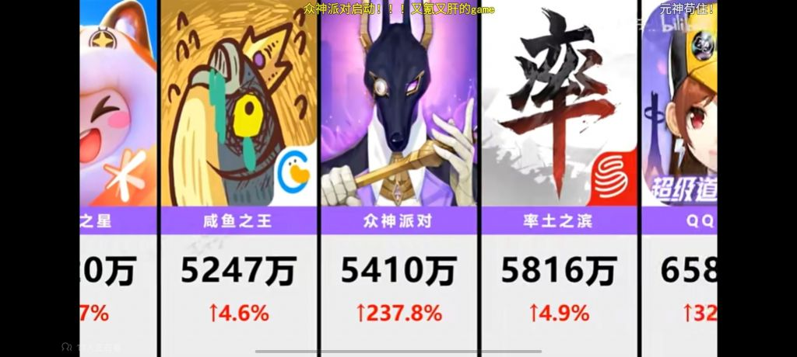

### [破事氵]到底谁在氪莉莉丝手游啊

Made by ngapost2md (c) ludoux [GitHub Repo](https://github.com/ludoux/ngapost2md)

----

##### 0.[0] \<pid:0\> 2024-01-31 04:04:05 by 磨tehrun姆穴

周流水五千万 好像比铃兰白荆少前钢岚开服高了吧？

----

##### 1.[0] \<pid:740737661\> 2024-01-31 04:11:53 by 尤琪亚
不要小看莉莉丝的诱氪能力啊
简直行业独一档的级别，当初玩剑与远征，氪金氪的就突出一个莫名其妙。

----

##### 2.[0] \<pid:740737699\> 2024-01-31 04:13:37 by 磨tehrun姆穴
>[jump](#pid740737661) 尤琪亚(2024-01-31 04:11) 说: 
>
>不要小看莉莉丝的诱氪能力啊
>简直行业独一档的级别，当初玩剑与远征，氪金氪的就突出一个莫名其妙。

这游戏的讨论度是其他游戏的零头 流水却高过其他几个显眼包

----

##### 3.[1] \<pid:740737760\> 2024-01-31 04:16:30 by 奏雾休止晴
说到底 二游的爆米能力也就那样 钱少事多声音大 莉莉丝游戏雇些客服服务好几个老板就好了 无氪零氪只是大佬们的游戏内容

----

##### 4.[0] \<pid:740737813\> 2024-01-31 04:19:13 by 磨tehrun姆穴
>[jump](#pid740737760) 奏雾休止晴(2024-01-31 04:16) 说: 
>
>说到底 二游的爆米能力也就那样 钱少事多声音大 莉莉丝游戏雇些客服服务好几个老板就好了 无氪零氪只是大佬们的游戏内容

还行 比起其他魔灵like pvp要素没那么多
闪卡获取途径也不难

----

##### 5.[1] \<pid:740738648\> 2024-01-31 05:01:00 by 断神霹雳001
不是，咸鱼之王这种都能这么高我觉得已经没啥不好理解的了。

----

##### 6.[0] \<pid:740738748\> 2024-01-31 05:06:16 by 血晓柳莺
>[jump](#pid740738648) 断神霹雳001(2024-01-31 05:01) 说: 
>
>不是，咸鱼之王这种都能这么高我觉得已经没啥不好理解的了。

咸鱼之王可比二游好玩太多了纯上瘾

----

##### 7.[0] \<pid:740739220\> 2024-01-31 05:34:01 by 铸匠熔金
>[jump](#pid740738748) 血晓柳莺(2024-01-31 05:06) 说: 
>
>咸鱼之王可比二游好玩太多了纯上瘾

那莉莉丝系的养成也是一样啊，蜜月期究极上瘾，比意义不明的刷词条爽多了，而且其实人家设计的战斗是很有深度的。

----

##### 8.[0] \<pid:740739778\> 2024-01-31 06:06:44 by 铸匠熔金
>[jump](#pid740737661) 尤琪亚(2024-01-31 04:11) 说: 
>
>不要小看莉莉丝的诱氪能力啊
>简直行业独一档的级别，当初玩剑与远征，氪金氪的就突出一个莫名其妙。

就我浅显的游戏经验来说，剑与远征应该是国内手游里玩动态氪金礼包玩得最花最诱人的。随玩家的某些行动刷出来的礼包数量多且性价比高到爆炸不说，给的东西还刚好是刷礼包的关键点急需的，可以说是究极的瞌睡送枕头了

----

##### 9.[0] \<pid:740744974\> 2024-01-31 08:09:13 by poiclear
莉莉丝已经是行业内的中流砥柱了，你以为开玩笑的

----

##### 10.[0] \<pid:740745086\> 2024-01-31 08:10:24 by 不死的3000
>[jump](#pid740738648) 断神霹雳001(2024-01-31 05:01) 说: 
>
>不是，咸鱼之王这种都能这么高我觉得已经没啥不好理解的了。

咸鱼之王的游戏性已经比普通二游高很多了，只是这版基本没几个玩的

----

##### 11.[0] \<pid:740745239\> 2024-01-31 08:11:50 by 逐月之星辰
莉莉丝在培养用户氪金习惯上可以算首屈一指的。

----

##### 12.[0] \<pid:740745561\> 2024-01-31 08:14:45 by A兰斯洛特
莉莉丝做的游戏，不管是游戏性还是诱氪能力，都是一等一的

