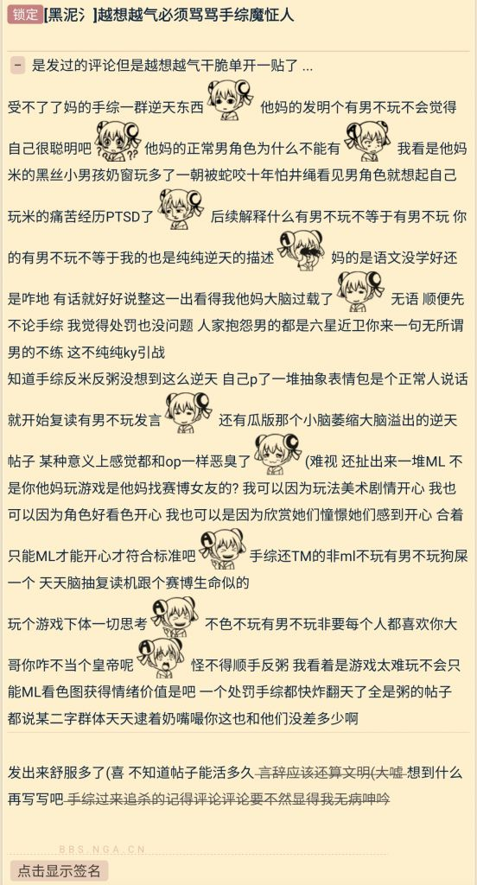

### [破事氵] 所以说咱还是不知道为什么有男不玩会让人破防

Made by ngapost2md (c) ludoux [GitHub Repo](https://github.com/ludoux/ngapost2md)

----

##### 0.[1] \<pid:0\> 2024-01-31 04:07:25 by 不可以色色的记录者！
看着这群人用最恶毒的话去辱骂男不玩，但是男不玩本质只是男性玩家的自我防御，为什么会让这群人破防呢

----

##### 1.[0] \<pid:740738142\> 2024-01-31 04:33:19 by 野獣の先輩
放有男不玩，放有男不玩！
一破，有男不玩！
双连，有男不玩！
三连，有男不玩！
四连，有男不玩！
五连，有男不玩！

----

##### 2.[3] \<pid:740738205\> 2024-01-31 04:36:08 by mianmi123
而且要是个例也就算了，但这俩天光是破防过来跳脸的，就几十个了
那些没胆子跳脸的有多少不敢想……

----

##### 3.[4] \<pid:740738246\> 2024-01-31 04:38:01 by 好累想睡1
自我意识过剩导致的

----

##### 4.[0] \<pid:740738251\> 2024-01-31 04:38:11 by 咸鱼二十九号
喷有男不玩但开头就抛出个若至问题

鉴定为无法理解有男不玩的字面意义

----

##### 5.[0] \<pid:740738269\> 2024-01-31 04:38:50 by mianmi123
>[jump](#pid740738246) 好累想睡1(2024-01-31 04:38):

哥们，我胆子小，截图能别带上我么

----

##### 6.[0] \<pid:740738337\> 2024-01-31 04:42:37 by 94646843z
还在扣op帽子，米粥69锁死吧。
下体思考属实难绷，集美为了男角色急眼的时候难道是用大脑思考？

----

##### 7.[0] \<pid:740738339\> 2024-01-31 04:42:41 by 好累想睡1
>[jump](#pid740738269) mianmi123(2024-01-31 04:38) 说: 
>
>哥们，我胆子小，截图能别带上我么

改了

----

##### 8.[1] \<pid:740738402\> 2024-01-31 04:46:13 by mianmi123
>[jump](#pid740738339) 好累想睡1(2024-01-31 04:42):

谢了，虽然我可能这几天已经被截图放其他地方了就是了
不过自己看到还是挺尴尬的

----

##### 9.[1] \<pid:740738485\> 2024-01-31 04:50:59 by RavenFubuki
虽然原文是讨论社科理论，但感觉也符合这里的问题

