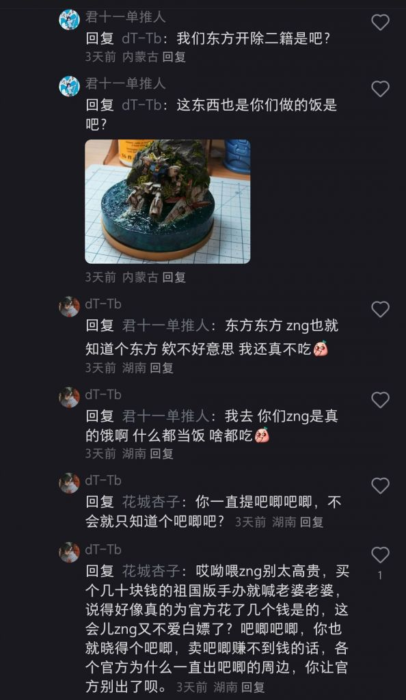
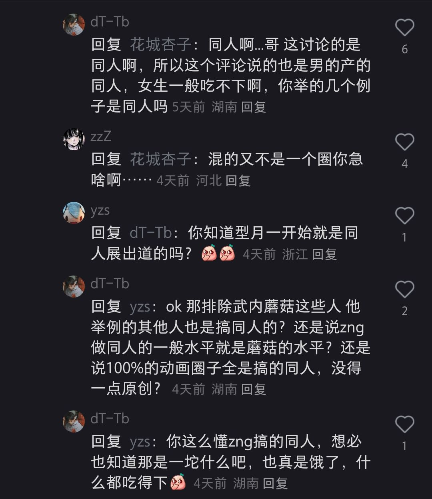

### [杂谈氵]二次元这圈子从17年之后就开始被那个逐步鸠占鹊巢了吧

Made by ngapost2md (c) ludoux [GitHub Repo](https://github.com/ludoux/ngapost2md)

----

##### 0.[4] \<pid:0\> 2024-01-31 07:07:23 by CourierSix
我印象中这种把周边叫谷子，看同人叫吃饭的那个都得是17年以后才大规模出现
而且这群人都十分默契的无视同人三大奇迹和大量知名作品ip都是宅男的同人社团起家(也可能是她们根本不知道，毕竟都是把二次元当潮流单品的货色)，以及不把诸如剧情梳理，动漫评测，作画剪辑，MMD，游戏攻略，MOD制作，汉化补丁，同人游戏等的高门槛创作当成宅男的同人创作，以购买铁章为荣，甚至觉得买铁章&gt;买BD
   

----

##### 1.[0] \<pid:740741455\> 2024-01-31 07:14:37 by 蜷守惠理
是真的。
谷子吃饭吧唧，味太他妈大

----

##### 2.[15] \<pid:740741511\> 2024-01-31 07:15:44 by CourierSix
>[jump](#pid740741455) 蜷守惠理(2024-01-31 07:14) 说: 
>
>是真的。
>谷子吃饭吧唧，味太他妈大

我最不能理解的就是她们坚持觉得买个破铁章贡献能比买bd光盘大

----

##### 3.[6] \<pid:740741549\> 2024-01-31 07:16:52 by 胖子猎人
>[jump](#pid740741511) CourierSix(2024-01-31 07:15) 说: 
>
>我最不能理解的就是她们坚持觉得买个破铁章贡献能比买bd光盘大

她们都觉得写点没技术的同人文贡献大

----

##### 4.[9] \<pid:740741588\> 2024-01-31 07:17:28 by 不可以色色的记录者！
典中典女玩家买周边&gt;男玩家在游戏里氪金   

----

##### 5.[0] \<pid:740741617\> 2024-01-31 07:18:16 by tikbnm
你这么说还真是，这些东西确实17年左右之后大量出现在视野

----

##### 6.[0] \<pid:740741652\> 2024-01-31 07:19:03 by 野獣の先輩
再想想，17年发生了什么

----

##### 7.[3] \<pid:740741725\> 2024-01-31 07:20:48 by CourierSix
>[jump](#pid740741549) 胖子猎人(2024-01-31 07:16) 说: 
>
>她们都觉得写点没技术的同人文贡献大

在她们眼里那个性别写的感情细腻的同人文才算有水平。什么？汉化补丁？模组作者？同人游戏？以她们的智力恐怕根本理解不了这些东西和是个人就能写的同人文之间有多大的天堑

----

##### 8.[1] \<pid:740741726\> 2024-01-31 07:20:50 by inficyclone
>[jump](#pid740741588) 不可以色色的记录者！(2024-01-31 07:17) 说: 
>
>典中典女玩家买周边&gt;男玩家在游戏里氪金   

戳啦

二级市场倒卖不知是真是假的n手铁皮塑料大于蝻壬的一切

----

##### 9.[0] \<pid:740741768\> 2024-01-31 07:21:44 by 北辰琉歌
不懂就问这几百日元一个的铁章多少个可以凑动画片一集出来

----

##### 10.[2] \<pid:740741803\> 2024-01-31 07:22:35 by CourierSix
>[jump](#pid740741652) 野獣の先輩(2024-01-31 07:19) 说: 
>
>再想想，17年发生了什么

它英第二季开播？印象中第一次看见这群令人作呕的畜生就是在当年的它英弹幕和评论区

----

##### 11.[0] \<pid:740741896\> 2024-01-31 07:24:40 by XXNnmsl
呃呃，幕刃是这样的，经典鸠占鹊巢

----

##### 12.[0] \<pid:740741952\> 2024-01-31 07:25:44 by mianmi123
可怕的还是，同人文写多了真的会去教作者怎么写东西的
更可怕的是，不知不觉，有些人开始写的不再是同人文了

----

##### 13.[1] \<pid:740741957\> 2024-01-31 07:25:52 by 方天厥德
>[jump](#pid740741652) 野獣の先輩(2024-01-31 07:19):

限韩令？

----

##### 14.[0] \<pid:740742060\> 2024-01-31 07:28:18 by Kazw
是真的，你看看你们自己的话语是不是被这些东西污染了

----

##### 15.[0] \<pid:740742068\> 2024-01-31 07:28:26 by CourierSix
>[jump](#pid740741768) 北辰琉歌(2024-01-31 07:21) 说: 
>
>不懂就问这几百日元一个的铁章多少个可以凑动画片一集出来

在二手市场多转几圈，二手市场交易额或许就能搓一分钟动画了吧

----

##### 16.[0] \<pid:740742203\> 2024-01-31 07:31:03 by wtq
二次元和ACGer就不是一回事，我玩游戏看动画，30年前就开始了，但是跟你们二次元不熟。
东方也是老东西了，难道你们就自认二次元？

----

##### 17.[1] \<pid:740742224\> 2024-01-31 07:31:21 by 蜷守惠理
>[jump](#pid740741652) 野獣の先輩(2024-01-31 07:19):

版号也是16年中开始实行的，自那以后文娱真是没一天好日子

----

##### 18.[6] \<pid:740742286\> 2024-01-31 07:32:30 by 云卷云舒1234
这套酸酸的话术就是饭圈传出来的，而最大的饭圈是什么可能大部分人不太记得了，我来帮你们回忆一下。
是韩流。

17年确实是个关键的时间节点，因为16年禁棒令导致一大票饭圈女孩急需寻找新的坑。

----

##### 19.[0] \<pid:740742335\> 2024-01-31 07:33:19 by 不可以色色的记录者！
>[jump](#pid740741652) 野獣の先輩(2024-01-31 07:19):

咪蒙？

----

##### 20.[0] \<pid:740742385\> 2024-01-31 07:34:12 by 野獣の先輩
当年射出的子弹，终于正中了我的眉心.jpg

----

##### 21.[0] \<pid:740742447\> 2024-01-31 07:35:22 by mianmi123
>[jump](#pid740742203) wtq(2024-01-31 07:31):

不熟最好，大家分圈子真的没啥事
我也是acgn全碰，但我自认二次元。

其实吧，自认啥都行。
哪怕不自认二次元、还有你口中那个ACGer  都无所谓

只要不同喜好的人能分开喜欢自己的东西最好
楼主吐槽的还是圈子越来越在重合了吧

嘛，不过现在这样各种圈子混起来，也确实不全是用户在扩张的问题就是了
还是有些复杂的..

----

##### 22.[0] \<pid:740742579\> 2024-01-31 07:37:30 by rina酱鸭
最早的同人女难道不是盗墓笔记时候就有了吗，17年又是什么个说法

----

##### 23.[0] \<pid:740742652\> 2024-01-31 07:38:48 by 野獣の先輩
再想想，某个2023百大up在17年中旬出过高达seed的解说视频，想清楚了吗？再想想？什么时候才有所谓我们女性观众才救了高达ip这个说法的？

----

##### 24.[0] \<pid:740742687\> 2024-01-31 07:39:23 by fsm4545
韩国欧巴圈内容逆输入，16年就开始了，都是和平演变，现在你不说谷子，xxn只会嘲你土(猴区帖子有感)

----

##### 25.[0] \<pid:740742843\> 2024-01-31 07:42:00 by 星空观测
>[jump](#pid740742203) wtq(2024-01-31 07:31) 说: 
>
>二次元和ACGer就不是一回事，我玩游戏看动画，30年前就开始了，但是跟你们二次元不熟。
>东方也是老东西了，难道你们就自认二次元？

多大了还在这里认不认
看着你不像40岁的人……

----

##### 26.[0] \<pid:740742993\> 2024-01-31 07:44:36 by 胖子猎人
>[jump](#pid740741803) CourierSix(2024-01-31 07:22) 说: 
>
>它英第二季开播？印象中第一次看见这群令人作呕的畜生就是在当年的它英弹幕和评论区

要说的话，更早以前就有，当年论坛去钢炼专区找漫画看，进去就一股恶臭，因为03版动画，一堆xcn在哪发癫，记得还有骂女主的贴，看的反胃

----

##### 27.[0] \<pid:740743013\> 2024-01-31 07:44:56 by scoutqq
>[jump](#pid740742579) rina酱鸭(2024-01-31 07:37) 说: 
>
>最早的同人女难道不是盗墓笔记时候就有了吗，17年又是什么个说法

盗墓笔记自己不就是个同人?

----

##### 28.[0] \<pid:740743017\> 2024-01-31 07:45:03 by SarDurkn_
个人认为更早一点，在14年lovelive成功一波万象天引之后就开始了。
当时就微博开始莫名其妙的宣传“三坑”之流的概念，还把一般二次元宅不能说摸不着头脑，只能说毫无兴趣的汉服也强行列入其中，更把持了cosplay这么一个之前一直以diy为主自娱自乐的小圈子的话语权，变成了美美花钱美美修图，靠装逼撕逼滥交指挥粉丝出击为生的名利场了。
那个时候就已经是某些性别的社交时尚单品了

----

##### 29.[1] \<pid:740743094\> 2024-01-31 07:46:20 by 巴基和比约恩
>[jump](#pid740742579) rina酱鸭(2024-01-31 07:37) 说: 
>
>最早的同人女难道不是盗墓笔记时候就有了吗，17年又是什么个说法

咋可能是盗墓笔记

最早90年代日本动漫进来的时候就有很多同人女和女粉
藏马，流川枫，佐助 ETC

----

##### 30.[0] \<pid:740743122\> 2024-01-31 07:46:48 by 蜷守惠理
>[jump](#pid740742579) rina酱鸭(2024-01-31 07:37):

说的二次元

----

##### 31.[0] \<pid:740743126\> 2024-01-31 07:46:52 by CourierSix
>[jump](#pid740742579) rina酱鸭(2024-01-31 07:37) 说: 
>
>最早的同人女难道不是盗墓笔记时候就有了吗，17年又是什么个说法

17年大规模冒头啊
后面它英被摁死了之后消停了一会，没想到是在视野盲区让它们发育上了

----

##### 32.[0] \<pid:740743238\> 2024-01-31 07:48:24 by 噢你可惜呀
艹的，进来看了主楼差点被熏死！

----

##### 33.[0] \<pid:740743334\> 2024-01-31 07:49:48 by 野獣の先輩
>[jump](#pid740743094) 巴基和比约恩(2024-01-31 07:46) 说: 
>
>咋可能是盗墓笔记
>
>最早90年代日本动漫进来的时候就有很多同人女和女粉
>藏马，流川枫，佐助 ETC

不过17年我觉得还有一个很关键的点，智能机的初步普及

----

##### 34.[0] \<pid:740743508\> 2024-01-31 07:52:16 by 巴基和比约恩
>[jump](#pid740743334) 野獣の先輩(2024-01-31 07:49) 说: 
>
>不过17年我觉得还有一个很关键的点，智能机的初步普及

是的，互联网下沉，导致大量低龄和粉圈妹妹入侵二次元
本来应该去当棒粉流量粉的脑瘫都来追纸片人了(尤其2游)

----

##### 35.[0] \<pid:740743780\> 2024-01-31 07:56:01 by 胖子猎人
>[jump](#pid740743126) CourierSix(2024-01-31 07:46) 说: 
>
>17年大规模冒头啊
>后面它英被摁死了之后消停了一会，没想到是在视野盲区让它们发育上了

实际上还要算上境外势力搞的女拳运动，稀宗上台后，狗粮续上，她们立马疯狂增长，所以我一直希望懂王赢，他真会断狗粮

----

##### 36.[0] \<pid:740743864\> 2024-01-31 07:57:04 by 北辰琉歌
>[jump](#pid740742068) CourierSix(2024-01-31 07:28) 说: 
>
>在二手市场多转几圈，二手市场交易额或许就能搓一分钟动画了吧

集美们一人从另外一个集美手里买一次几千日元的铁章，兜兜转转就大于买bd辣！

----

##### 37.[0] \<pid:740743941\> 2024-01-31 07:57:53 by 野獣の先輩
>[jump](#pid740743780) 胖子猎人(2024-01-31 07:56) 说: 
>
>实际上还要算上境外势力搞的女拳运动，稀宗上台后，狗粮续上，她们立马疯狂增长，所以我一直希望懂王赢，他真会断狗粮

举个例子，不知道会不会炸帖

----

##### 38.[0] \<pid:740744580\> 2024-01-31 08:05:16 by CourierSix
>[jump](#pid740743017) SarDurkn_(2024-01-31 07:45) 说: 
>
>个人认为更早一点，在14年lovelive成功一波万象天引之后就开始了。
>当时就微博开始莫名其妙的宣传“三坑”之流的概念，还把一般二次元宅不能说摸不着头脑，只能说毫无兴趣的汉服也强行列入其中，更把持了cosplay这么一个之前一直以diy为主自娱自乐的小圈子的话语权，变成了美美花钱美美修图，靠装逼撕逼滥交指挥粉丝出击为生的名利场了。
>那个时候就已经是某些性别的社交时尚单品了

14年就成了它们的名利场了吗……那个真是无孔不入啊

----

##### 39.[0] \<pid:740744589\> 2024-01-31 08:05:23 by dkas333
起点上那么多写同人文的直接当没有是吧

----

##### 40.[4] \<pid:740744805\> 2024-01-31 08:07:33 by CourierSix
>[jump](#pid740744589) dkas333(2024-01-31 08:05) 说: 
>
>起点上那么多写同人文的直接当没有是吧

没有它们推崇的“那个性别作者所独有的细腻感情描写”，一律视为不存在

----

##### 41.[1] \<pid:740744916\> 2024-01-31 08:08:31 by 巴基和比约恩
早年参加过几次CP和各种漫展，都是男女作者都有的，啥时候宅男哥就被开除同人了？？？？
就是不知道啥时候开始怎么对面开始踩男的了，可能的确跟田园女拳泛滥也有关系

----

##### 42.[1] \<pid:740744973\> 2024-01-31 08:09:13 by scoutqq
>[jump](#pid740744805) CourierSix(2024-01-31 08:07) 说: 
>
>没有它们推崇的“那个性别作者所独有的细腻感情描写”，一律视为不存在

写啊啊啊啊啊啊啊啊啊写多了导致的

----

##### 43.[0] \<pid:740745435\> 2024-01-31 08:13:38 by rina酱鸭
>[jump](#pid740743094) 巴基和比约恩(2024-01-31 07:46) 说: 
>
>咋可能是盗墓笔记
>
>最早90年代日本动漫进来的时候就有很多同人女和女粉
>藏马，流川枫，佐助 ETC

是啊所以17年又是什么鬼

----

##### 44.[0] \<pid:740745576\> 2024-01-31 08:14:49 by 二刺螈之王师傅
>[jump](#pid740742203) wtq(2024-01-31 07:31):

说的话二次元就不是铁板一块，也不是什么圈，只能说是一种宽泛的称呼。可以细分为无数个小圈子。a看高达、b追偶像、c玩黄游，看上去都是二次元可能还有交集，但是之间的差别大多了。小圈子内部、小圈子之间的战争都好多次了。

----

##### 45.[1] \<pid:740745746\> 2024-01-31 08:16:27 by 巴基和比约恩
>[jump](#pid740745435) rina酱鸭(2024-01-31 08:13) 说: 
>
>是啊所以17年又是什么鬼

本来二次元是个小圈子啦，不管男女人都少
17年手机扩圈叠加限韩令叠加女拳，导致原来少量的宅女圈圈被低龄粉圈xxn占领

----

##### 46.[0] \<pid:740745764\> 2024-01-31 08:16:39 by Kikkom
如果说1617年左右，感觉是微博上火的女玩家多的二游比如阴阳师和偶像梦幻祭引流的

----

##### 47.[1] \<pid:740746669\> 2024-01-31 08:24:17 by 不再嘴硬
是，但鉴于这是手游区，不建议继续展开，没意义
你以为某群体作为第一波被铜仁女砸的群体会最早醒悟，实际上人家到现在也其乐融融，活生生一个老二次龟

----

##### 48.[0] \<pid:740746956\> 2024-01-31 08:26:38 by fluffydog
真正的二次元早就圈地自萌了，xxn们进不去圈子

----

##### 49.[0] \<pid:740747261\> 2024-01-31 08:29:13 by x峰55
17年还有诶罗芒阿老师那事

----

##### 50.[0] \<pid:740750082\> 2024-01-31 08:48:18 by 奔波奔波霸
你猜为什么当年有个专有名词同人女出现

----

##### 51.[0] \<pid:740750289\> 2024-01-31 08:49:32 by asue12345
它们磕的cp 原作是男人写的，它们玩的乙游是男人做的，然后它们说男人没做出贡献
讲个有趣的事，之前有一个非常火的女性向偶像企划叫偶像梦幻祭，但你猜猜ES的主笔是谁，性别是啥？

----

##### 52.[0] \<pid:740750550\> 2024-01-31 08:51:06 by -巫鱼-
还有狒板也是，点草一下，已经臭不可闻了

----

##### 53.[0] \<pid:740750756\> 2024-01-31 08:52:26 by 快捷键将２２２
真是他妈到哪哪臭的木柱

----

##### 54.[0] \<pid:740751207\> 2024-01-31 08:54:58 by 梦丿花火灬
不混圈，只看作品，国内文娱一个不碰，目前体验良好。
从那群不明生物大量涌入acg圈开始就能明显感觉到不同，为了一个男角色撕逼吵架的情况变多了，而且饭圈那一套话术开始随处可见，饭圈化的作品也变多，他英文豪野犬咒回，已经到了没法好好讨论作品的程度。

----

##### 55.[0] \<pid:740752082\> 2024-01-31 08:59:45 by 煌树茉美香的书
谷子不是十年前就有的说法？

----

##### 56.[0] \<pid:740752565\> 2024-01-31 09:02:39 by 哈布斯堡紫泉
>[jump](#pid740743780) 胖子猎人(2024-01-31 07:56) 说: 
>
>实际上还要算上境外势力搞的女拳运动，稀宗上台后，狗粮续上，她们立马疯狂增长，所以我一直希望懂王赢，他真会断狗粮

拳师都境外势力了何尝不是一种龟

----

##### 57.[3] \<pid:740753047\> 2024-01-31 09:05:24 by 狼牙破神势
我到现在都不懂这种无脑消费话术对真的爱好以及借爱好表达创作有嘚吧作用，整的当年自己搞同人创作的时候好像总是自己的问题和周围格格不入，结果一看水平不是围绕着画师嗯舔就是破修辞过度文章在那嗯炫，满足社交交际求所谓“自我认同”远远大于真的要表达、创作些有价值东西，顿觉自己搞了那么久就是纯纯牛刀杀鸡自己骗自己直接跑路，老老实实钻研琢磨原创真切提高自己水平不比什么都强。
不过某些离了赛博环境就会缺氧嗷嗷嘶鸣的造物是不会离开自己的生态圈了。

----

##### 58.[0] \<pid:740753664\> 2024-01-31 09:08:51 by CourierSix
>[jump](#pid740753047) 狼牙破神势(2024-01-31 09:05) 说: 
>
>我到现在都不懂这种无脑消费话术对真的爱好以及借爱好表达创作有嘚吧作用，整的当年自己搞同人创作的时候好像总是自己的问题和周围格格不入，结果一看水平不是围绕着画师嗯舔就是破修辞过度文章在那嗯炫，满足社交交际求所谓“自我认同”远远大于真的要表达、创作些有价值东西，顿觉自己搞了那么久就是纯纯牛刀杀鸡自己骗自己直接跑路，老老实实钻研琢磨原创真切提高自己水平不比什么都强。
>不过某些离了赛博环境就会缺氧嗷嗷嘶鸣的造物是不会离开自己的生态圈了。

同人女是一种需要靠吮吸其他人的认可来给它们填补自身的空虚的蜱虫

----

##### 59.[0] \<pid:740753787\> 2024-01-31 09:09:30 by 为下水道干杯
木构都已经重新定义了同人的词义了，那还能怎么样

----

##### 60.[0] \<pid:740757627\> 2024-01-31 09:29:18 by biubiu222
谷圈和仙女重合度确实高

