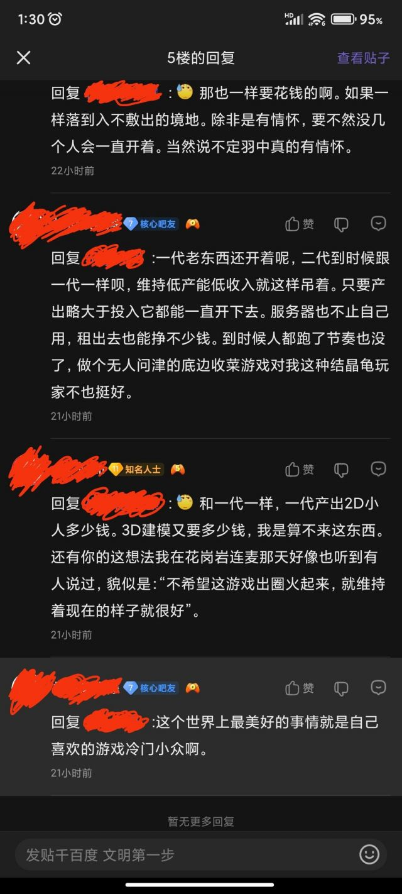

### [破事氵]少前2算不算一手好牌打的稀烂

Made by ngapost2md (c) ludoux [GitHub Repo](https://github.com/ludoux/ngapost2md)

----

##### 0.[0] \<pid:0\> 2024-01-31 09:29:52 by 社区管理工
公厕前 还是挺期待的 毕竟还可以吹一手建模 
到现在 光看节奏 还以为它不是全女ml游戏呢
要是没这些暴雷 现在ml游戏式微的环境 应该还是能爆不少米吧是不是项目管理除了大问题 做这么久 投入这么多 能吹的只有建模

----

##### 1.[0] \<pid:740758897\> 2024-01-31 09:35:14 by bwbbs
风口猪现原形罢了

----

##### 2.[7] \<pid:740758941\> 2024-01-31 09:35:31 by 八号套筒扳手
回过头去看，能称得上好牌的总共就两张，建模和IP知名度
IP这块因为绑定了有些逆天老玩家，你还很难确定这是不是张好牌

----

##### 3.[3] \<pid:740759030\> 2024-01-31 09:35:57 by sadudas
他有个锤子的好牌

----

##### 4.[0] \<pid:740759265\> 2024-01-31 09:37:07 by 你好再见88
好牌？抛开那个暴雷最大的剧情，那个数值付费的战棋玩法真的会好玩么

----

##### 5.[0] \<pid:740759266\> 2024-01-31 09:37:07 by 第十九扇门的背后
本质就那样了，好牌？之前大伙以为一手好牌罢了，就连牌手牌技都是臭的

----

##### 6.[0] \<pid:740759796\> 2024-01-31 09:39:37 by Maudy
>[jump](#pid740758941) 八号套筒扳手(2024-01-31 09:35):

绝对算是好牌了，早年间国内二游就那几家，少前虽然现在流水不行但是名声还是在那的，只要说起枪娘必定会提到少前，至于逆天老玩家，这属于见怪不怪了，反正真正去玩的玩家才多少，了解的人不算多，真要那么多人玩也不会是现在这个流水了

----

##### 7.[0] \<pid:740760829\> 2024-01-31 09:44:35 by 目遮人
比起好牌，看着更像是四张三，还分开打了

----

##### 8.[1] \<pid:740761018\> 2024-01-31 09:45:33 by VanDarg
到现在 光看节奏 还以为它不是全女ml游戏

少前二是全女麻辣？谁说的？你？

----

##### 9.[0] \<pid:740761426\> 2024-01-31 09:47:33 by 炽天使の心
算好牌，这建模，如果没有剧情雷，流水超过之前和谐前的交错问题不大吧？，还能收获一批死忠粉跟全女游戏玩家的拥护，毕竟当下一堆二游都是一般向，不止一个妮姬玩家跟我说要不是有剧情雷他就入坑了

----

##### 10.[0] \<pid:740761545\> 2024-01-31 09:48:12 by 野獣の先輩
>[jump](#pid740760829) 目遮人(2024-01-31 09:44) 说: 
>
>比起好牌，看着更像是四张三，还分开打了

他只有有一张三，腾子以为他有两张所以说给了他两张，没想到他只有一张三，搞到最后屁没崩出来一个

----

##### 11.[0] \<pid:740761864\> 2024-01-31 09:49:38 by 八号套筒扳手
>[jump](#pid740759796) Maudy(2024-01-31 09:39):

可别，以前就有结晶把万氪气走的事，现在专版也有人在砍难度之后哀嚎硬核没了的。你总不能让这些玩意在社群里发酵吧

----

##### 12.[0] \<pid:740762531\> 2024-01-31 09:52:39 by 小米暖手宝
就说建模，前脚米和丫丁公布的新模型被喷成一坨 然后这嗨丝质感正好高他俩一头，这是最大的赢点，包括到现在，和量角器脸相比，这建模也足够能打~~但被发现夹私货了~~

----

##### 13.[0] \<pid:740762821\> 2024-01-31 09:54:08 by 转生之我在泥潭当刁民
少前这个ip一生就没好过几天

----

##### 14.[0] \<pid:740762959\> 2024-01-31 09:54:41 by Maudy
>[jump](#pid740761864) 八号套筒扳手(2024-01-31 09:49):

是我太小看他们了，这么看真是思配苦

----

##### 15.[2] \<pid:740762964\> 2024-01-31 09:54:43 by aluba000
是不是好牌不评论
但只知这货总想出老千，但技术稀烂频被抓还嘴硬
对家终于受不了，直接抄起凳子打得头破血流

----

##### 16.[0] \<pid:740763232\> 2024-01-31 09:55:54 by 星守骑士
不要看到券全女就以为是ml。

----

##### 17.[0] \<pid:740763543\> 2024-01-31 09:57:13 by ★星の在り処☆
羽中也可以算是个天才了，要说天时少前2开服时候就没什么高质量的新二游和他同期发售，要说地利当时全女二游的呼声正盛大家都想要一款新的全女ml游戏，要说人和他有前作的粉丝基础，天时地利人和都占了还能把自己玩蹦所以说我是真的看不懂这位帝国的董事长，明明可以靠着优秀的建模做一个3d版的碧蓝航线出来躺着赚钱，可他非要选择弹幕最多的打法把自己炸了，可能他有受虐倾向吧

----

##### 18.[0] \<pid:740763833\> 2024-01-31 09:58:32 by tmacx4
一个项目一个公司最重要的牌是人力资本，而少前2的这部分是羽中和星姐领先，你说他是好牌还是烂牌

----

##### 19.[0] \<pid:740763850\> 2024-01-31 09:58:36 by Mellemia
好牌个p，美式战旗在手游用户内接受度无限接近于零，各种精英手游up主打纵火者几个小时搞不清为什么自己没伤害

少钱前这个硬核军武ip的核心用户的需求也是和泛用户格格不入，依托现实的世界观更是随便做都是大雷，所以你看现在原粥之类的新ip哪个不是完全架空

除了美术资源什么都是负资产

----

##### 20.[0] \<pid:740764235\> 2024-01-31 10:00:18 by Vanitas0
没有剧情节奏他也是个烂游戏，剧情节奏反而帮忙掩盖了其他的问题

----

##### 21.[1] \<pid:740764514\> 2024-01-31 10:01:33 by norman220
难道他是全女麻辣游戏？？

----

##### 22.[0] \<pid:740764816\> 2024-01-31 10:02:43 by AgedVanQwQ
好的建模和配音可以给玩家带来最基本的观感愉悦。但这个牌虽然好但只靠一张牌未免太少了点。

----

##### 23.[0] \<pid:740765067\> 2024-01-31 10:03:50 by 共揽星辰
>[jump](#pid740759030) sadudas(2024-01-31 09:35) 说: 
>
>他有个锤子的好牌

你玩个23年的新fps游戏都能在社区看到416的枪皮mod

----

##### 24.[0] \<pid:740765475\> 2024-01-31 10:05:47 by 染血的学园
只要文案不暴雷，哪怕氪金玩法优化等等这些全是一坨，玩家也会为它留一个“重新下载”的选项，留有最基本的信任，只要能在几年里修个大概顺便送点东西，玩家也不会介以这些错误然而。。。就是这个然而，它文案暴雷了，把所有的信任打上了负号再翻上几倍

----

##### 25.[1] \<pid:740765538\> 2024-01-31 10:06:05 by 服部加奈美
我现在是感觉除了游戏性本身之外，游戏内容也谈不上好牌打得稀烂了。

有没有一种可能在某公务员贵族女眷占多的地方大环境舆论中讨好男性incel(我不想用这个词，但我希望你们能理解它们怎么称呼你们)是死线中的死线呢？

它的好牌是手上握着一堆反男性审美人才，打的坏很可能是曾经有大量男性受众的问题。

它本可以成为像是林中之夜那样的里程碑级别的作品。

编辑：问题指的是——一般带货号如果在最初的几个星期积累的粉丝以男性为主是需要回炉重造的。

是不是前些天听到淘宝京东没在贬损雄性消费者就沾沾自喜了？还早得很呢。

----

##### 26.[1] \<pid:740765607\> 2024-01-31 10:06:22 by 晨暮之星
“好牌”，我有点怀疑是不是少前玩家的滤镜当它是好牌，宣传出去让别人也这么认为。就像冲某工作室那次，真的是顺风浪输了，而不是本来就不该打这仗？

----

##### 27.[0] \<pid:740765700\> 2024-01-31 10:06:49 by sz233000
交错战线才像一手好牌的那个
开服赶上蝗虫燃烧自家ip等着羽化结果顺便为其作势，“一般向”风头正旺时给宅男一支强心剂
~~会不会打得稀烂有待观察~~

----

##### 28.[1] \<pid:740765986\> 2024-01-31 10:08:09 by Guidetowel-MK4
少前2，实亡于少前1。

还是手综看得太少了才会觉得他有一手好牌。

----

##### 29.[0] \<pid:740766187\> 2024-01-31 10:09:02 by ConfusedLantern
它顶多占一个知名度。战棋玩法就已经能劝退一群人了。

----

##### 30.[0] \<pid:740766721\> 2024-01-31 10:11:39 by 咸心蘸大酱
真要说一手好牌不至于，做不了加倍苟下去还是没问题的

可惜，4个3拆俩对打，几个菜啊喝成这样

----

##### 31.[0] \<pid:740766875\> 2024-01-31 10:12:19 by 悬崖边的不倒翁
如果少前2做成尘白现在这样 估计流水是要爆炸的

----

##### 32.[0] \<pid:740767864\> 2024-01-31 10:16:45 by sans147
战棋玩法天生不适合弱软保 然后就是 战棋游戏抽卡整米池 我寻思我都抽不到新角色 我没棋子我玩nm的战棋啊

----

##### 33.[1] \<pid:740767892\> 2024-01-31 10:16:52 by 尤琪亚
好牌个屁
游戏性一坨
数值一坨
哪怕一堆人吹的ip知名度，我不知道你们把他放多高，在我这边定位也就是一个二流小厂的系列游戏，甚至都不配跟“ip”这个词沾边。

----

##### 34.[0] \<pid:740768840\> 2024-01-31 10:21:24 by 932661769A
文案暴雷加速了出脑的过程，不暴雷说不定真能活个一年半载的。

----

##### 35.[0] \<pid:740769030\> 2024-01-31 10:22:18 by 客远适弃前
>[jump](#pid740761864) 八号套筒扳手(2024-01-31 09:49) 说: 
>
>可别，以前就有结晶把万氪气走的事，现在专版也有人在砍难度之后哀嚎硬核没了的。你总不能让这些玩意在社群里发酵吧

我云图弃坑的最后一根稻草就是被翀小子追着咬气的，不然还得再吊着几个月才会删，不过也感谢翀小子，让我能提前出狱

----

##### 36.[0] \<pid:740775592\> 2024-01-31 10:51:53 by A1ik
>[jump](#pid740758941) 八号套筒扳手(2024-01-31 09:35) 说: 
>
>回过头去看，能称得上好牌的总共就两张，建模和IP知名度
>IP这块因为绑定了有些逆天老玩家，你还很难确定这是不是张好牌

 确实很逆天，有些结晶不仅不想让新玩家入坑，还不想让羽中哥哥赚钱。羽中要是知道他的簇拥有不少这样的人，不知道会是个什么想法。

----

##### 37.[0] \<pid:740788737\> 2024-01-31 11:47:18 by 丿夕日坂
少妇2那个建模还能吹，评价是3D区逛太少了导致的(迫真)

----

##### 38.[0] \<pid:740788988\> 2024-01-31 11:48:27 by 小五ロリ
少前1难道就不算一手好牌打得稀烂了？

----

##### 39.[0] \<pid:740789440\> 2024-01-31 11:50:33 by 宿火乱稀星
不管是不是好牌，少前，云图，追放都说明了羽中根本不会打牌，一把给你输了。

----

##### 40.[0] \<pid:740790796\> 2024-01-31 11:56:47 by lucifiniczw
我要是没看过登神长阶我真信了好牌

----

##### 41.[0] \<pid:740791621\> 2024-01-31 12:00:35 by bgpk52
少前ip有个屁的知名度 也就在二游圈子小有名气 记住还是小有名气，这算好牌？

----

##### 43.[0] \<pid:740793433\> 2024-01-31 12:09:08 by mie001
它好牌只有在一开始只是宣传的时候是好牌。从开始说自己是xcom-like开始这牌就逐渐变臭，到了3测各种问题爆发出来的时候就很臭了。95甚至都不算是炸出来的第一个雷，只是最响的那个罢了
而假意下跪，修了俩月，结果几乎没改就上线的那一天起，这个牌已经完了

----

##### 44.[0] \<pid:740793459\> 2024-01-31 12:09:15 by Aramil11
有没有可能,“散爆”本身就是副烂牌
烂牌出什么都是烂的,你就说它前两作哪个没烂吧

----

##### 45.[0] \<pid:740797008\> 2024-01-31 12:26:45 by silverbbb
作为四测前挺期待少前2，且没玩过一代的玩家，我觉得美少女+枪械人形+美式战旗的组合怎么看都很稳，美式战旗虽然小众，但那是因为xcom之类的美式战旗单局游戏时间较长且难度较大导致的，本身玩法上侧重利用掩体这个基本的策略，玩家在低难度下只需要用很简单的策略就可以击败数量和强度上远超自己的敌人。并且战旗本身就兼容较长的养成流程，像紫龙系战旗手游也有稳定的收入。
然后我没想到羽中就楞恶心人+想爆米，各种反人类设定和瞧不起玩家的态度，愣是玩砸了。

----

##### 46.[0] \<pid:740803474\> 2024-01-31 12:59:41 by 捏方便面
毕竟玩家觉得是好牌的部分在羽中心里恰恰是无所谓的

----

##### 47.[0] \<pid:740805692\> 2024-01-31 13:11:35 by 单杀成瘾
这比游戏的社区环境就不是正常人能玩下去的。

