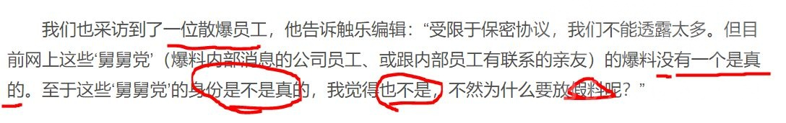
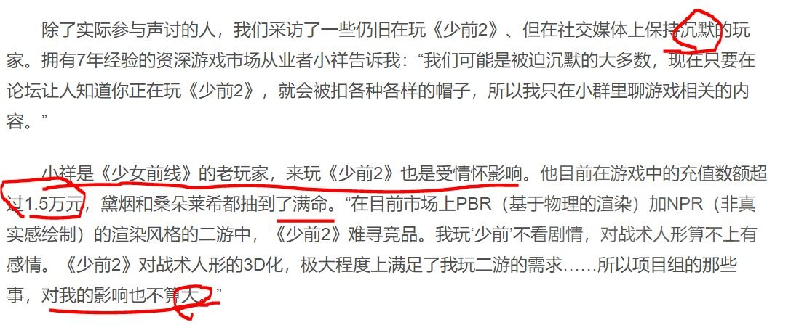

### [破事氵] 触乐昨日发布少前2阶段总结文章(《少女前线2：追放》：期待、共情与愤怒)，部分细节疑似另有用意

Made by ngapost2md (c) ludoux [GitHub Repo](https://github.com/ludoux/ngapost2md)

----

##### 0.[2] \<pid:0\> 2024-01-31 12:05:38 by NOLANELD
文章大部分还算客观，但部分事件细节与字眼使用疑似另有用意
比如：
1.模糊抵制少前2的玩家成分，试图将玩家的情绪模糊定性为无理取闹

2.试图将“一瘸一拐”的恶意，往文学表达方向洗白

3.对鱿鱼事件一笔带过，丝毫未提及钕圈私货，并隐晦地质疑玩家行为“越线”

4.似乎有意将玩家的行为导向开盒，挖掘项目组个人隐私(但玩家对除羽中之外的了解不多，lz很好奇六点姐到底是什么人)

5.引用散爆员工发言，否定“舅舅”的一切爆料(啊对对对，也不知道活动剧情开天窗的是谁呢？)

6.特别挑选一位业内，重氪，且沉默的玩家为例，似乎想要表明，“沉默的大多数”仍然支持散爆(lz很好奇，剧情数值双爆炸，玩什么呢？？)

文章指路：[url](https://www.chuapp.com/article/289781.html)
各位可以自行前往观摩

----

##### 1.[0] \<pid:740808685\> 2024-01-31 13:28:00 by 卜尸小号
那个重氪是真的抽象，理解不能
这是不是也侧面说明，就算是软文，也很难描绘一个符合逻辑的居然还愿意重氪少前2 的冤大头出来

----

##### 2.[0] \<pid:740808936\> 2024-01-31 13:29:32 by 阳光彩虹小尼马
看完了，套个中立皮还是歪屁股暗搓搓的把锅甩到玩家头上

