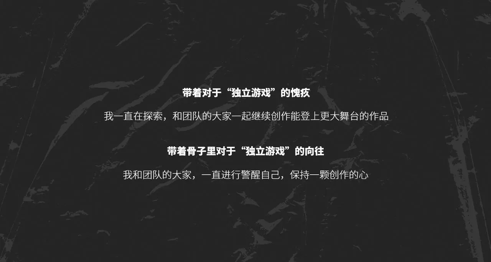
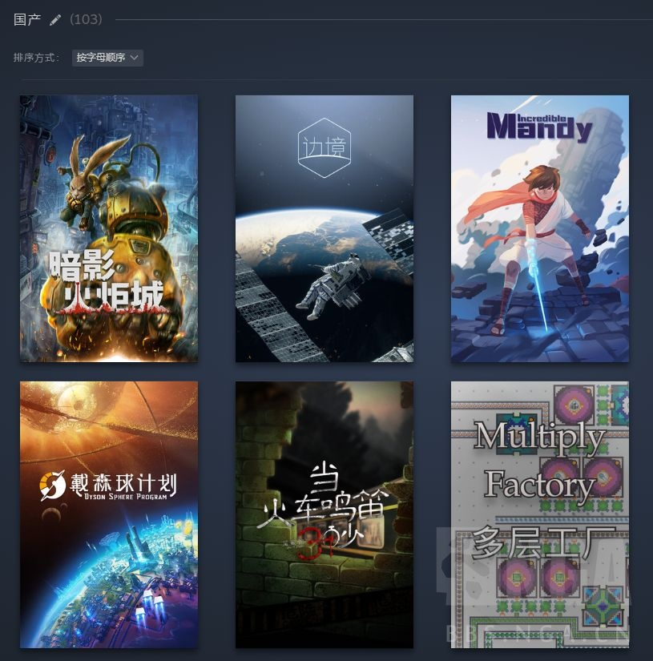

### [破事氵] “怀着对独立游戏的愧疚”是什么梗

Made by ngapost2md (c) ludoux [GitHub Repo](https://github.com/ludoux/ngapost2md)

----

##### 0.[0] \<pid:0\> 2024-01-31 14:14:23 by iaaaaaaaaaaaaaaa
是和“技术宅拯救世界”一样的东西吗
赎罪券什么时候端上来？

----

##### 1.[0] \<pid:740818213\> 2024-01-31 14:15:19 by 茂盛的植物
这又是什么工作室

----

##### 2.[12] \<pid:740818231\> 2024-01-31 14:15:24 by 舟原混沌九六
文青无病呻吟

----

##### 3.[12] \<pid:740818285\> 2024-01-31 14:15:39 by mianmi123
这啥游戏，避个雷

----

##### 4.[7] \<pid:740818556\> 2024-01-31 14:16:50 by タウィル
怀着对独立游戏的愧疚不会是指

抄了个独立游戏吧?

----

##### 5.[15] \<pid:740818598\> 2024-01-31 14:17:03 by Madfrogkygdiddy
不就是方舟么，海猫自己的演讲里说的，
17年核聚变机核开后门把明日方舟放到了独立游戏展区里。以他们当时的实力是没啥买商业游戏展位的钱的。
钟其翔对于自己一个商业游戏，蹭了独立游戏展位这事一直是这个说法。
至于赎罪券，鹰角自己投了好几个游戏了。表面功夫算是还在做。

----

##### 6.[0] \<pid:740818665\> 2024-01-31 14:17:23 by 听狗哭的声音
倒是报个名字

----

##### 7.[2] \<pid:740818787\> 2024-01-31 14:17:56 by lsgbz
鉴定为想吸主机天龙人的流量了

----

##### 8.[3] \<pid:740819068\> 2024-01-31 14:19:08 by ggg1414
叶公还就内个好龙

----

##### 9.[13] \<pid:740819282\> 2024-01-31 14:20:22 by lucifiniczw
做氪金手游的就别舔着脸蹭独立游戏了  至今没见过几个真的赚了钱就好好回归初心的。反倒是真正热爱的不停的在创作独立游戏。

----

##### 10.[14] \<pid:740819551\> 2024-01-31 14:21:39 by 蓝梦公司
哈哈，这是我们明日方舟的梗，没想到这都出圈了，下次记得标明出处

----

##### 11.[0] \<pid:740819687\> 2024-01-31 14:22:15 by 玩他喵的
>[jump](#pid740819282) lucifiniczw(2024-01-31 14:20) 说: 
>
>做氪金手游的就别舔着脸蹭独立游戏了

别搞，你这样让游科怎么下台，更何况开发商业游戏和独立游戏本来就不是对立的

----

##### 12.[4] \<pid:740820195\> 2024-01-31 14:24:30 by lucifiniczw
>[jump](#pid740819687) 玩他喵的(2024-01-31 14:22) 说: 
>
>别搞，你这样让游科怎么下台，更何况开发商业游戏和独立游戏本来就不是对立的

严格说黑神话悟空不能算独立游戏。 最佳独立游戏每年提名放在那里。可以参考一下。当然你有自己的定义我没意见。
今年tga独立游戏提名是这几个
《COCOON》 (Geometric Interactive / Annapurna Interactive)
《潜水员戴夫》 (MINTROCKET)
《渔帆暗涌》 (Black Salt Games / Team17)
《星之海》 (Sabotage Studio)
《Viewfinder》 (Sad Owl Studios / Thunderful Games)
当然这并不影响如果黑神话悟空能达到他宣传的内容的标准我是无比支持的。

----

##### 13.[2] \<pid:740820362\> 2024-01-31 14:25:13 by 我是社管有男不玩
24年了 
上游厂高投入追技术代差 中游厂玩法更新  下游厂媚宅换皮练手 下三滥搞赛博仙人跳
怎么还有人在凹独立游戏情怀

----

##### 14.[1] \<pid:740820444\> 2024-01-31 14:25:35 by 茂盛的植物
>[jump](#pid740819687) 玩他喵的(2024-01-31 14:22) 说: 
>
>别搞，你这样让游科怎么下台，更何况开发商业游戏和独立游戏本来就不是对立的

黑神话原来算独立游戏吗

----

##### 15.[4] \<pid:740821791\> 2024-01-31 14:31:52 by 优香真的只有45kg
68赎罪券不是在卖了吗
识相的就赶紧替yj赎罪去，别不识好歹

----

##### 16.[0] \<pid:740821916\> 2024-01-31 14:32:28 by 玩他喵的
>[jump](#pid740820444) 茂盛的植物(2024-01-31 14:25) 说: 
>
>黑神话原来算独立游戏吗

来到了游戏圈的究极问题，什么是独立游戏
这只是一种表达，你就当是国单就好了，揪字眼没意思的，毕竟来自星尘也不是独立游戏

----

##### 17.[0] \<pid:740822094\> 2024-01-31 14:33:17 by kaze02
什么时候把“喷子们赢了 幻死了”再端上来吧 我等不及了

----

##### 18.[0] \<pid:740822660\> 2024-01-31 14:35:54 by 不明嚼栗-奥罗
你说得对，但是2月28日 来自星尘发售，买断制，如何评价？

----

##### 19.[4] \<pid:740823133\> 2024-01-31 14:38:18 by 优香真的只有45kg
>[jump](#pid740822660) 不明嚼栗-奥罗(2024-01-31 14:35) 说: 
>
>你说得对，但是2月28日 来自星尘发售，买断制，如何评价？

让玩家花68替yj赎罪我觉得不行

----

##### 20.[0] \<pid:740823411\> 2024-01-31 14:39:39 by ArthKurt
这不是开拓芯的演讲稿吗
确实很矫情，钟其祥读的稿子都有点味道读起来还没感情每次都让人绷不住
但开拓芯这个项目(计划?)也扶持了很多独立单机了吧
实事至少是在做的

----

##### 21.[0] \<pid:740823606\> 2024-01-31 14:40:35 by 玩他喵的
>[jump](#pid740820195) lucifiniczw(2024-01-31 14:24) 说: 
>
>严格说黑神话悟空不能算独立游戏。 最佳独立游戏每年提名放在那里。可以参考一下。当然你有自己的定义我没意见。
>今年tga独立游戏提名是这几个
>《COCOON》 (Geometric Interactive / Annapurna Interactive)
>《潜水员戴夫》 (MINTROCKET)
>《渔帆暗涌》 (Black Salt Games / Team17)
>《星之海》 (Sabotage Studio)
>《Viewfinder》 (Sad Owl Studios / Thu

你说得对，但是潜水员戴夫制作组的母公司是nexon，发行推广出了不少力，tga提名时蜥蜴菌那里还有过一番讨论来着

按照分类来说黑悟空也算商业游戏，其实我想表达的就是开发商业游戏和开发独立/单机游戏这两件事并不矛盾，一巴掌打死对游戏行业没有什么好处，游戏最后风评还是看质量说话

----

##### 22.[0] \<pid:740824182\> 2024-01-31 14:43:12 by 不明嚼栗-奥罗
>[jump](#pid740823133) 优香真的只有45kg(2024-01-31 14:38) 说: 
>
>让玩家花68替yj赎罪我觉得不行

你就说做没做单机吧

----

##### 23.[0] \<pid:740824464\> 2024-01-31 14:44:36 by 优香真的只有45kg
>[jump](#pid740823411) ArthKurt(2024-01-31 14:39) 说: 
>
>这不是开拓芯的演讲稿吗
>确实很矫情，钟其祥读的稿子都有点味道读起来还没感情每次都让人绷不住
>但开拓芯这个项目(计划?)也扶持了很多独立单机了吧
>实事至少是在做的

资本的投资获取回报或者说扩大在再生产的行为，总能有xz往喜爱游戏上洗。
不懂你们的脑回路。

----

##### 24.[0] \<pid:740825179\> 2024-01-31 14:47:53 by ArthKurt
>[jump](#pid740824464) 优香真的只有45kg(2024-01-31 14:44) 说: 
>
>资本的投资获取回报或者说扩大在再生产的行为，总能有xz往喜爱游戏上洗。
>不懂你们的脑回路。

你在说什么啊 说的又不是来自星尘
扶持的独立单机是弈仙牌 魔女加把劲那些

----

##### 25.[1] \<pid:740825397\> 2024-01-31 14:48:53 by lucifiniczw
>[jump](#pid740823606) 玩他喵的(2024-01-31 14:40) 说: 
>
>你说得对，但是潜水员戴夫制作组的母公司是nexon，发行推广出了不少力，tga提名时蜥蜴菌那里还有过一番讨论来着
>
>按照分类来说黑悟空也算商业游戏，其实我想表达的就是开发商业游戏和开发独立/单机游戏这两件事并不矛盾，一巴掌打死对游戏行业没有什么好处，游戏最后风评还是看质量说话

首先潜水员戴夫今年进入独立游戏评选本身就产生了很大的争议，争议的点就在于发行商。其次我本人也不是什么独立游戏原教旨主义者。但是黑神话从各个角度都不符合独立游戏的标准。 
关于潜水员戴夫，我复制一段
“Geoff Keighley回应了《潜水员戴夫》获得TGA年度独立游戏提名的争议，他表示独立游戏是宽泛的术语，媒体评审团决定了这是款独立游戏。本作开发者Mint Rocket是韩国大型发行商Nexon内部的小团队。”
独立游戏不等于不能有商业成功，我没说过这俩非要划开界限。商业游戏也不是不能有追求，恰恰相反很多出色的商业游戏也是有很高的艺术高度。但是这俩确实不是完全画等号的东西。  单机买断制游戏≠独立游戏。。我已经懒得解释了。  而且独立游戏本来就容易产生天龙人，高贵党。。你觉得对那就对。我个人对所有热爱游戏创作而不是仅仅对赚钱感兴趣的创作者的敬意是一致的。  至于商业厂掉头回去回归初心专门做独立游戏。。。只能说可能我还是玩的太少了。我见过扶持独立游戏制作人创作的，培养ip的，但是目的是什么。。

----

##### 26.[4] \<pid:740825875\> 2024-01-31 14:51:01 by 优香真的只有45kg
>[jump](#pid740825179) ArthKurt(2024-01-31 14:47) 说: 
>
>你在说什么啊 说的又不是来自星尘
>扶持的独立单机是弈仙牌 魔女加把劲那些

那不就是投资行为？
难道是白给的投资？
赚钱就赚钱不寒碜，别装行吗？

----

##### 27.[6] \<pid:740826252\> 2024-01-31 14:52:49 by 怀素o
都是游戏公司投资，说的我还以为吹投资核聚变，火箭，元宇宙的是yj，扶持独立游戏的是mhy呢

----

##### 28.[0] \<pid:740826641\> 2024-01-31 14:54:37 by ArthKurt
>[jump](#pid740825875) 优香真的只有45kg(2024-01-31 14:51) 说: 
>
>那不就是投资行为？
>难道是白给的投资？
>赚钱就赚钱不寒碜，别装行吗？

单机赚多少啊更别说还有一大堆竞赛游戏根本不会卖
你直接说厂商花钱买赎罪券洗白自己更合适点

----

##### 29.[0] \<pid:740826652\> 2024-01-31 14:54:39 by sadudas
>[jump](#pid740825875) 优香真的只有45kg(2024-01-31 14:51):

有一说一的话，独立游戏的制作组还确实挺需要投资的，而独立游戏做出来之后长啥样也没人说得好，所以投资各个独立游戏制作组这件事确实可以算得上是一种对制作组的帮助。
至于其中有没有什么投机心理啊，反哺心理啊，这些就真不是我这种臭打游戏的考虑的破事了。

----

##### 30.[4] \<pid:740826840\> 2024-01-31 14:55:26 by 黄前久美子子
别问，问就某个公司立项4个一般向一个合家欢还有个乙女古风魂like，就是没有 男 性 向 哦~
某个单机看画师案底应该是轻百合+一般向
男性向真是低贱呢，克苏鲁凝视，暮光利刃军团举报
买谁家单机都不买给一般向输血的玩意
有男不玩

----

##### 31.[0] \<pid:740827550\> 2024-01-31 14:58:38 by 煤滤镜
这就是鹰角合作弄的开拓芯项目吧

----

##### 32.[0] \<pid:740827940\> 2024-01-31 15:00:23 by poiclear
>[jump](#pid740825875) 优香真的只有45kg(2024-01-31 14:51) 说: 
>
>那不就是投资行为？
>难道是白给的投资？
>赚钱就赚钱不寒碜，别装行吗？

那就只能做同人游戏了，商业游戏哪有不沾铜臭味的，只有带学生靠爱发电可能给你整出来你要的干净游戏了

----

##### 33.[4] \<pid:740828166\> 2024-01-31 15:01:19 by asbeersloth
>[jump](#pid740825875) 优香真的只有45kg(2024-01-31 14:51) 说: 
>
>那不就是投资行为？
>难道是白给的投资？
>赚钱就赚钱不寒碜，别装行吗？

好奇你怎么评价索尼的中国之星计划
也是给独立游戏投资

----

##### 34.[0] \<pid:740829069\> 2024-01-31 15:05:22 by KanadeLover
之前手综有个帖子高赞是说做单机是搞饭圈，加上上面那位投资独立游戏是赎罪卷，我觉得这个立体防御已经无敌了，再加上做手游是不要脸坑钱，我劝鹰角速速自裁以谢天下。

----

##### 35.[2] \<pid:740830364\> 2024-01-31 15:10:45 by 阳光低调行事
>[jump](#pid740819687) 玩他喵的(2024-01-31 14:22) 说: 
>
>别搞，你这样让游科怎么下台，更何况开发商业游戏和独立游戏本来就不是对立的

黑神话是标准的商业游戏。而且还是商业游戏中的顶流3A游戏。独立游戏是3A游戏的对立面。小作坊小制作好玩为代表。

顺道一提国内独立游戏活的还是很滋润的，甚至对标国外有些过于好混了，不需要海猫在这装。

----

##### 36.[0] \<pid:740830566\> 2024-01-31 15:11:33 by 我才没名字呢
>[jump](#pid740825875) 优香真的只有45kg(2024-01-31 14:51):

要是独立游戏真赚钱真值得投资那就不“独立”了

----

##### 37.[0] \<pid:740830929\> 2024-01-31 15:13:08 by 对对双双
>[jump](#pid740829069) KanadeLover(2024-01-31 15:05):

小x盒上垃圾手游厂商做单机污染环境罪该万死，手综里手游厂商做单机背刺用户罪该万死

----

##### 38.[3] \<pid:740832423\> 2024-01-31 15:19:45 by whzfjk
具体的独立开发案例值得尊敬，并且可以被划归为独立游戏，但独立游戏这整体业态就一普通的菜市场，有肉鸽就几万个肉鸽，有幸存者就几万个幸存者，还动不动来个大厂同人，讲道理跟国产手游套养成框架也没什么区别了。

总而言之先怀抱一下对千年战争的愧疚吧，比如请青色三号来出张卡什么的。

----

##### 39.[0] \<pid:740833204\> 2024-01-31 15:23:06 by 优香真的只有45kg
>[jump](#pid740830566) 我才没名字呢(2024-01-31 15:11) 说: 
>
>要是独立游戏真赚钱真值得投资那就不“独立”了

是不是在你们眼里不到60%利润率都叫不挣钱啊？

----

##### 40.[2] \<pid:740835813\> 2024-01-31 15:34:00 by 阳光低调行事
>[jump](#pid0) iaaaaaaaaaaaaaaa(2024-01-31 14:14):

贴一条。现在国单独立游戏活的非常滋润，而且比国外好混多了。真正难的是黑神话这种3A大作。去年大卖的完蛋了被美女包围开发成本极低，制作人和开发人都是老板自己，唯一大头就演员和视频制作。总成本估计用不了来自星辰1个月的。希望百合cp68元大作能力压小作坊出品。别到时候被人吊打，您老还在那同情独立游戏。我寻思到时候还是先同情下自己吧。

----

##### 41.[0] \<pid:740836991\> 2024-01-31 15:38:46 by Penfish
之前每年去weplay都能看到独立游戏活动yj有赞助的，今年开拓芯也加了个单独展台，带了一批独立游戏参展的
什么都没了解过光看几个最火的就觉得已经了解国内独立游戏了有点坐井观天了

----

##### 42.[0] \<pid:740844497\> 2024-01-31 16:12:19 by 因果交流电波
>[jump](#pid740835813) 阳光低调行事(2024-01-31 15:34):

滋润是怎么个滋润法？
一般独立游戏开发者steam能卖一千份吗？

----

##### 43.[0] \<pid:740846859\> 2024-01-31 16:23:05 by 向着天空的彼方
说说客套和场面话罢了, 可某些&quot;货&quot;连场面也不愿维护;

----

##### 44.[0] \<pid:740855106\> 2024-01-31 16:58:53 by orange88662
做手游玩手游是赛博原罪，需要独立游戏这个赎罪劵，我愿称其为赛博红衣大主教

----

##### 45.[0] \<pid:740855811\> 2024-01-31 17:02:11 by 我是彭老师的僵尸粉
骂YJ做买断制游戏的，都是MXZ吗？

明明YJ有很多黑点非要挑这个？

这不是米孝子最喜欢的奶嘴吗？

----

##### 46.[0] \<pid:740860235\> 2024-01-31 17:22:41 by 虎符白灵
>[jump](#pid740826840) 黄前久美子子(2024-01-31 14:55) 说: 
>
>别问，问就某个公司立项4个一般向一个合家欢还有个乙女古风魂like，就是没有 男 性 向 哦~
>某个单机看画师案底应该是轻百合+一般向
>男性向真是低贱呢，克苏鲁凝视，暮光利刃军团举报
>买谁家单机都不买给一般向输血的玩意
>有男不玩
>编辑：1提示7赞，点踩的这也能急？重复一下你钟总事实你急什么呢？

然而这里说的是开拓芯，来自星尘本来也没说是独游，开拓芯投资那一部分里才有几个，关注下没准有全女后宫呢

----

##### 47.[0] \<pid:740861158\> 2024-01-31 17:26:56 by Dorothy_Goddess
>[jump](#pid740855811) 我是彭老师的僵尸粉(2024-01-31 17:02) 说: 
>
>骂YJ做买断制游戏的，都是MXZ吗？
>
>明明YJ有很多黑点非要挑这个？
>
>这不是米孝子最喜欢的奶嘴吗？

没啊，让一个资本厂商回归到应有的位置上而已。
隔壁棒子的shift up八年磨一剑，给自己两款抽卡手游赎罪的PS5大作星刃也没见棒子吹成啥样啊。

----

##### 48.[0] \<pid:740861247\> 2024-01-31 17:27:20 by 零九二五0925
>[jump](#pid740820195) lucifiniczw(2024-01-31 14:24):

潜水员戴夫算不算独立游戏其实是有争议的，因为MINTROCKET是NEXON旗下子品牌

----

##### 49.[0] \<pid:740862782\> 2024-01-31 17:34:49 by ZYQGZENX
正常投资行为吹到手游圈拯救独立游戏第一人不就是过了？
就像大陆秀夫当初被吹一年四开一样，让舆论回到正常位置而已

还有注意后排棉花出没视奸，没有名字哥都出来了

----

##### 50.[6] \<pid:740865887\> 2024-01-31 17:49:45 by 西施包子铺账房
在明知自家底下母畜多的情况下不驱赶母畜，给它消费买它的游戏就是付赛博彩礼，黑猴好歹喷母畜被母畜追着咬呢

----

##### 51.[0] \<pid:740866800\> 2024-01-31 17:54:06 by lucifiniczw
>[jump](#pid740861247) 零九二五0925(2024-01-31 17:27) 说: 
>
>潜水员戴夫算不算独立游戏其实是有争议的，因为MINTROCKET是NEXON旗下子品牌

你好像回错人了，我回帖表达的就是这个意思  同一个观点 。也可能是你没看我第二段回复

----

##### 52.[0] \<pid:740867602\> 2024-01-31 17:57:42 by 我是彭老师的僵尸粉
>[jump](#pid740861158) Dorothy_Goddess(2024-01-31 17:26):

一个资本厂商脑子有问题在中国做买断制游戏。

我还是觉得集中黑YJ硬核不媚宅，迎合小仙女，角色有自己的生活比较好。

我实在无法和MXZ共用一个理由黑YJ

在我这反米是核心利益

----

##### 53.[0] \<pid:740868106\> 2024-01-31 18:00:12 by 沙坡村高级魔法师
>[jump](#pid740835813) 阳光低调行事(2024-01-31 15:34) 说: 
>
>贴一条。现在国单独立游戏活的非常滋润，而且比国外好混多了。真正难的是黑神话这种3A大作。去年大卖的完蛋了被美女包围开发成本极低，制作人和开发人都是老板自己，唯一大头就演员和视频制作。总成本估计用不了来自星辰1个月的。希望百合cp68元大作能力压小作坊出品。别到时候被人吊打，您老还在那同情独立游戏。我寻思到时候还是先同情下自己吧。

手综的独立游戏仙人还是搞笑，国产独立游戏滋润这种话都说出来了，要不你来给我那些因为拿不到版号而解散制作组的朋友发年终奖吧

你猜一下我库存里这上百款国产游戏里面，回本的有几个？

----

##### 54.[0] \<pid:740869870\> 2024-01-31 18:08:58 by poiclear
>[jump](#pid740868106) 沙坡村高级魔法师(2024-01-31 18:00) 说: 
>
>手综的独立游戏仙人还是搞笑，国产独立游戏滋润这种话都说出来了，要不你来给我那些因为拿不到版号而解散制作组的朋友发年终奖吧
>
>你猜一下我库存里这上百款国产游戏里面，回本的有几个？
>

你不明白，这个逻辑是自洽的
国内独立游戏活得好——有国产卖不出去说明没水平/剧情垃圾/玩法抄袭/讨好xxn/题材落后——这种垃圾游戏该死——不该死的国内独立游戏活得好

----

##### 55.[1] \<pid:740869951\> 2024-01-31 18:09:24 by 羽毛147萝卜
容许我问一句:yj做单机还搞百合cp女主这些东西，是不是还想把某些不可名状的群体往单机圈引啊？

我知道不少单机都有女自机，但不好意思，将混厕发扬光大的yj不配嗷。

----

##### 56.[2] \<pid:740870383\> 2024-01-31 18:11:43 by kareemjabbar
只有太監才會大肆誇耀皇上成功站起來了
對常人而言那只是自然的生殖能力

----

##### 57.[0] \<pid:740870459\> 2024-01-31 18:12:10 by 优香真的只有45kg
>[jump](#pid740869870) poiclear(2024-01-31 18:08) 说: 
>
>你不明白，这个逻辑是自洽的
>国内独立游戏活得好——有国产卖不出去说明没水平/剧情垃圾/玩法抄袭/讨好xxn/题材落后——这种垃圾游戏该死——不该死的国内独立游戏活得好

单机确实是这样的，没法像yj养孝子做出来一坨都有人当atm送钱

----

##### 58.[0] \<pid:740870807\> 2024-01-31 18:13:58 by 寂静都市
>[jump](#pid740870459) 优香真的只有45kg(2024-01-31 18:12):

这下一坨了

----

##### 59.[1] \<pid:740870920\> 2024-01-31 18:14:33 by MCquin
>[jump](#pid740869951) 羽毛147萝卜(2024-01-31 18:09) 说: 
>
>容许我问一句:yj做单机还搞百合cp女主这些东西，是不是还想把某些不可名状的群体往单机圈引啊？
>
>我知道不少单机都有女自机，但不好意思，将混厕发扬光大的yj不配嗷。

什么时候让你产生了单机游戏圈xxn少的错觉最近的bd3且不说，之前极乐迪斯科那个集美only同人展也是够乐

xxn会自发的在每一个她们觉得可以磕磕磕的地方聚集起来

----

##### 60.[4] \<pid:740871405\> 2024-01-31 18:17:17 by 阳光低调行事
>[jump](#pid740868106) 沙坡村高级魔法师(2024-01-31 18:00) 说: 
>
>手综的独立游戏仙人还是搞笑，国产独立游戏滋润这种话都说出来了，要不你来给我那些因为拿不到版号而解散制作组的朋友发年终奖吧
>
>你猜一下我库存里这上百款国产游戏里面，回本的有几个？
>

逗乐，海外不挂皮的独立游戏什么样的？另外独立游戏赛道就是穷哥们为爱发电赛道。你要是不服可以拉投资走商业游戏的路。

笑了有商业的路不走，嫌弃独立不赚钱？

来你告诉我 被美女包围了这种游戏在海外能有这规模的销量吗？国内这环境还不好？国外你能叫上名的独立游戏有多少不是有皮的？纯小作坊的才几个？而且人家什么质量？

独立游戏还是随便赚钱，那商业游戏是干什么的？粥u的逻辑真的感人。国内游戏圈唯一不输欧美的环境，而且薅老外羊毛的各种rpg和肉鸽出了多少？

最后跟一句滚回粥版发癫。粥u真的剑，主板都宣战了，还没事来手综巡逻。

真是米粥99，仙驱也爱吹米投资了XX。

----

##### 61.[0] \<pid:740871513\> 2024-01-31 18:17:56 by 玩他喵的
>[jump](#pid740835813) 阳光低调行事(2024-01-31 15:34) 说: 
>
>贴一条。现在国单独立游戏活的非常滋润，而且比国外好混多了。真正难的是黑神话这种3A大作。去年大卖的完蛋了被美女包围开发成本极低，制作人和开发人都是老板自己，唯一大头就演员和视频制作。总成本估计用不了来自星辰1个月的。希望百合cp68元大作能力压小作坊出品。别到时候被人吊打，您老还在那同情独立游戏。我寻思到时候还是先同情下自己吧。

你居然拿出了最不典型的游戏作为例子，但凡你说戴森球呢

----

##### 62.[0] \<pid:740871773\> 2024-01-31 18:19:12 by 寂静都市
>[jump](#pid740871405) 阳光低调行事(2024-01-31 18:17):

这下环境好了，真不愧是立体防御，对了，你先别急

----

##### 63.[0] \<pid:740873147\> 2024-01-31 18:27:00 by 莎莉丶夜刃
做独立游戏就该一辈子当个穷哥们给别人乐是吧？

----

##### 64.[0] \<pid:740875666\> 2024-01-31 18:41:02 by 沙坡村高级魔法师
>[jump](#pid740871405) 阳光低调行事(2024-01-31 18:17) 说: 
>
>逗乐，海外不挂皮的独立游戏什么样的？另外独立游戏赛道就是穷哥们为爱发电赛道。你要是不服可以拉投资走商业游戏的路。
>
>笑了有商业的路不走，嫌弃独立不赚钱？
>
>来你告诉我 被美女包围了这种游戏在海外能有这规模的销量吗？国内这环境还不好？国外你能叫上名的独立游戏有多少不是有皮的？纯小作坊的才几个？而且人家什么质量？
>
>独立游戏还是随便赚钱，那商业游戏是干什么的？粥u的逻辑真的感人。国内游戏圈唯一不输欧美的环境，而且薅老外羊毛的各种rpg和肉鸽出了多少？
>
>最后跟一句滚回粥版发癫。粥u真的剑，主板都宣战

你要是能把那些因为去年十二月草案而被打解散的制作组复活了，然后把我朋友欠的两个月薪水补上，那我就认你说的国产独游很滋润了

还是说你重新定义的独游，必须是一两人在卧室里做开发，吃饭全靠积蓄和社会救助，过着有上顿没下顿的日子的团队才算是独游啊。那确实挺滋润的，1000个这样的团队里面火了1个，你踩着饿死的999个兄弟，指着那一个团队说，“国产独立游戏现在已经很滋润了”

另外你最好把你的库存带上，别是买了几个爆款就开始来吹逼了

