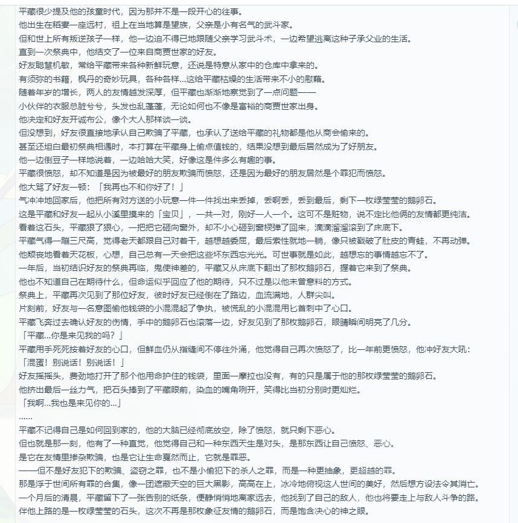
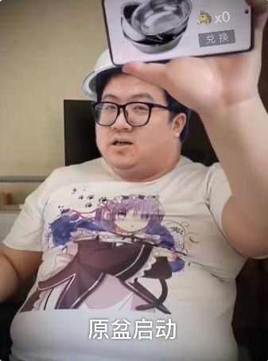

### [破事氵]讲点老话，谈谈盒厂在风系小男孩上的卖梗电商

Made by ngapost2md (c) ludoux [GitHub Repo](https://github.com/ludoux/ngapost2md)

----

##### 0.[0] \<pid:0\> 2024-01-31 15:58:40 by 白川付田
首先，盒厂卖了五个风系小男孩。为什么没有风系成男呢？

第一位温迪，少年，登风神之前死了友人至交，传说任务里面还提了不少

第二位魈，少年，当夜叉死了四个同僚，其中一位还是典型大哥系塑造，在后面璃月间章提到

到魈实装开始，玩家圈开始流传“风神发神之眼男性只给矮子发，女性则不管”。盒厂或许瞅准了这一点能搞宣发的机会，风系男角色就只乐意出少年了。

于是呢，第三位万叶，依旧是矮子少年。无巧不成书，他死了友人，还成了稻妻篇主线的关键线索。

而应该是从这里开始，风系小男孩“克友人”的梗开始流传

第四位是鹿野院平藏，矮子少年，风男里唯一一个四星，邀约剧情下来没有提到友人
但这样完事了吗？角色故事依旧很唐突地死了个人让这位平藏“有所感悟启发”
在这里开始，盒厂表现出了很明确的玩自己梗倾向

至于第五位，散兵。
“三度背叛”这个来自3.1，在此前的稻妻里不曾提过散兵的第三次背叛是找了个快死的小孩自顾自破防
第二次的背叛里他也死了恩人，但加这第三次到底是为了玩梗包饺子还是干啥，我反正看不懂

总结，盒厂好不容易造了梗，就想要彻底消费。仿佛祥林嫂一般“逢人就说起他的事情来，一来二去大家都听腻了”
可惜祥林嫂还真是经受苦难下来不知出路
不像有的逼数没有的文案玩着这点破梗路径依赖当奶嘴嘬
所以盒厂，是不是该继续推出崭新的风系小男孩了？罗白先生那么憔悴，一定是一整年没有出风系小男孩导致的吧？

----

##### 1.[1] \<pid:740842338\> 2024-01-31 16:02:41 by 顺劈带暴击
什么时候轮到那几个风系小男孩死

----

##### 2.[1] \<pid:740842994\> 2024-01-31 16:05:27 by ncqbxh
说到平藏，当时角色背景故事，讲他神之眼怎么来的就死人了

----

##### 3.[0] \<pid:740843367\> 2024-01-31 16:07:12 by 今麦郎550
啊，温迪是男的？

----

##### 4.[0] \<pid:740843469\> 2024-01-31 16:07:38 by NＯ10999
梗shit

----

##### 5.[2] \<pid:740843676\> 2024-01-31 16:08:37 by Dorothy_Goddess
别说了，再说不锈钢脸盆就要叮当响了

----

##### 6.[0] \<pid:740844945\> 2024-01-31 16:14:24 by coldse
今年神父推荐口味的是冰系小男孩，特点是温柔腼腆内向。从相对正常的重云，到有些逆天的米卡再到完全病态的菲米尼 诸君喜欢吗？

对了，请大家放心神父并没有放弃风系小男孩。这不春节池子up两个风系小男孩的星怒。 “晚安，我在”

