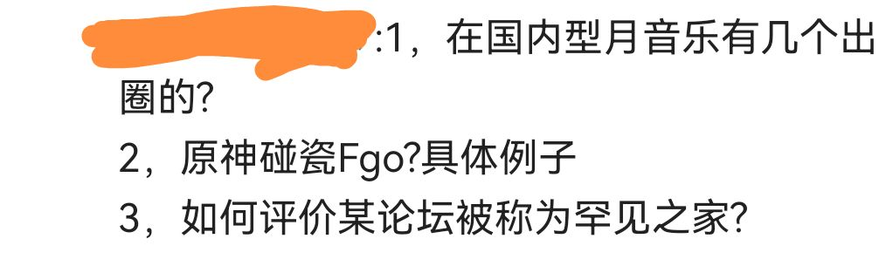
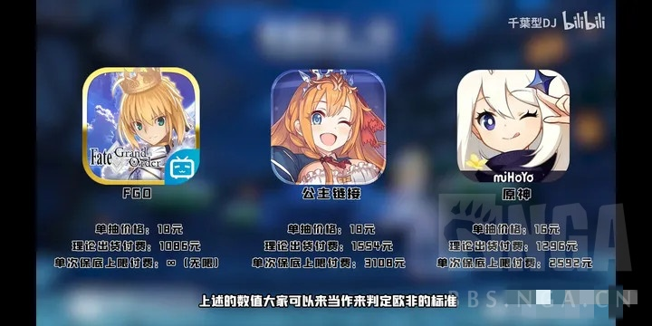

### [破事氵]不懂就问 原神没碰瓷过fgo 所以那些拿fgo拄拐的言论都是反串是吗？

Made by ngapost2md (c) ludoux [GitHub Repo](https://github.com/ludoux/ngapost2md)

----

##### 0.[0] \<pid:0\> 2024-01-31 17:54:57 by 寒号冰
以及 型月的音乐没有米哈游出圈 所以型月的音乐不如米哈游 这句话对吗

----

##### 1.[0] \<pid:740867235\> 2024-01-31 17:55:59 by sadudas
我没记错的话原神的卡池是可以跟FGO碰一碰的，当然这已经是原开服时期的陈年烂谷了

----

##### 2.[0] \<pid:740867287\> 2024-01-31 17:56:14 by wyfmmmmm
开服比卡池啊

----

##### 3.[0] \<pid:740867396\> 2024-01-31 17:56:46 by 流星风暴惩戒
他都玩原神了，那他说的一定是对的

----

##### 4.[0] \<pid:740867729\> 2024-01-31 17:58:19 by Dorothy_Goddess
型月音乐没出圈的乐死，型月音乐可是央视版权库常客，17年就有用06版音乐的节目了

----

##### 5.[0] \<pid:740867787\> 2024-01-31 17:58:38 by kiyota119
开服时候比过卡池，还比过原的命座和fgo的宝具，说fgo不氪宝具=残疾人(我还回了一句那你原不氪命座是人彘

----

##### 6.[0] \<pid:740868566\> 2024-01-31 18:02:24 by 汤圆史莱姆
闹麻了，原神音乐出圈指劈瓜吗。为什么能出自己不知道吗  
顺便fgo万能拐，也没比米家好多少，抽个五宝和原神六命差不了多少6000左右吧。原7000。但却是纸片人

----

##### 7.[3] \<pid:740868769\> 2024-01-31 18:03:28 by 很委屈吧，那个时候
说实在话18-20开服的手游一出卡池节奏哪个不把fgo当拐杖用，但像米这种拐完说都是帆船的仅有这一家了吧

----

##### 8.[0] \<pid:740869089\> 2024-01-31 18:04:59 by poiclear
fgo的音乐我确实不清楚，fsn的音乐这个是出了名的

----

##### 9.[2] \<pid:740869690\> 2024-01-31 18:08:04 by 清风挽伈
B站就没罕见了？回形针和谷阿莫不是B站的？

----

##### 10.[0] \<pid:740870245\> 2024-01-31 18:10:56 by 清蒸大狸子
美术就不说了，3个技能升级就是抄的FGO，卡最后一级9-&gt;10, 王冠抄的结晶。70%限定池进一步改成95%限定池

----

##### 11.[0] \<pid:740870579\> 2024-01-31 18:12:47 by BaiduNetdiskDownload
跟原没关系哦，克拉拉

----

##### 12.[0] \<pid:740870674\> 2024-01-31 18:13:19 by 呵呵不会取名
差不多得了，近五年稍微出点圈的二游哪个没拿fgo拄过拐，甚至拄拐这个词都是fgo的

----

##### 13.[0] \<pid:740871928\> 2024-01-31 18:20:06 by 咕哒小五郎
色彩和emiya都挺好的吧

----

##### 14.[0] \<pid:740872125\> 2024-01-31 18:21:17 by 癸严池庚阮雷
他说型月音乐没有原神出圈你就信，你也就这样了

----

##### 15.[0] \<pid:740872983\> 2024-01-31 18:26:05 by 真红眼教授
经典回顾

----

##### 16.[6] \<pid:740873182\> 2024-01-31 18:27:14 by maosama27
真当人不记得了？
当年谁的商单视频，比fgo和&amp;#9898;的抽卡价格
FGO圣晶石按一颗一颗单买的价格折算抽卡价格
FGO当年连仅一次的300抽保底都没，再叠加一颗一颗买圣晶石折算出来的逆天十连价格，算出来原神抽卡出5星的数学期望金额都tm比FGO高
哄堂大笑了

感谢15楼老哥的截图，就是千葉型DJ这个逼，当年出了视频就取关了完全想不起来叫什么

----

##### 17.[0] \<pid:740873653\> 2024-01-31 18:29:51 by 溪木镇村霸
>[jump](#pid740867729) Dorothy_Goddess(2024-01-31 17:58) 说: 
>
>型月音乐没出圈的乐死，型月音乐可是央视版权库常客，17年就有用06版音乐的节目了

经典悲情曲目“呆毛王的荣耀”

----

##### 18.[4] \<pid:740873940\> 2024-01-31 18:31:26 by GhostLeader117
op们的脸皮厚度那是连对肃正防御看了都要自叹不如的水平。当初原神上线的时候找千叶型DJ这b人在那里比卡池都还记忆犹新。最乐的是有人算了原和FGO的期望出率，原算上小保底还打不赢FGO，要算大保底才能领先一点，给了当时觉得FGO卡池是天底下最烂卡池的我一点小小的米家震撼。

----

##### 19.[0] \<pid:740874119\> 2024-01-31 18:32:24 by 废案君
fgo和型月还是不一样的啊。

fsn和动画确实有很多名曲。fgo本身没什么的吧？
大多数都是比较小众的，ccc联动的女神変生很喜欢

----

##### 20.[0] \<pid:740874409\> 2024-01-31 18:33:58 by 神圣的卡苟斯
>[jump](#pid740867235) sadudas(2024-01-31 17:55) 说: 
>
>我没记错的话原神的卡池是可以跟FGO碰一碰的，当然这已经是原开服时期的陈年烂谷了

已经是原开服时期的陈年烂谷了 X
已经是FGO没保底时的陈年烂谷了 √
有保底的游戏和没保底打的有来有回着实精彩

----

##### 21.[0] \<pid:740874487\> 2024-01-31 18:34:18 by 寒号冰
>[jump](#pid740872983) 真红眼教授(2024-01-31 18:26) 说: 
>
>经典回顾
>
>

这辈子都忘不了的传世经典()

----

##### 22.[0] \<pid:740874497\> 2024-01-31 18:34:21 by 圣光会哇哦你
人设不也一直在“致敬”吗？

----

##### 23.[0] \<pid:740874671\> 2024-01-31 18:35:16 by maosama27
>[jump](#pid740868566) 汤圆史莱姆(2024-01-31 18:02):

6等分石块，那逆天还是米逆天
米哈游做FGO那3个技能和被动全得拆石块里
一宝能用的打手，不存在的
拐抽一宝完全体，更是不存在

----

##### 24.[0] \<pid:740874985\> 2024-01-31 18:37:05 by oftc3121
>[jump](#pid740874119) 废案君(2024-01-31 18:32) 说: 
>
>fgo和型月还是不一样的啊。
>
>fsn和动画确实有很多名曲。fgo本身没什么的吧？
>大多数都是比较小众的，ccc联动的女神変生很喜欢

星辰诞生时刻，明镜肆水，最后的勇者
2.6的各种bgm

----

##### 25.[1] \<pid:740875103\> 2024-01-31 18:37:51 by maosama27
>[jump](#pid740874409) 神圣的卡苟斯(2024-01-31 18:33):

何止有来有回
甚至小输一筹
和当年卡池公认坑的一逼的FGO能小输的卡池概率，现在全被大面积推广
都不好说到底哪个国家的玩家才是氪金母猪了

----

##### 26.[1] \<pid:740875583\> 2024-01-31 18:40:30 by 神圣的卡苟斯
>[jump](#pid740875103) maosama27(2024-01-31 18:37) 说: 
>
>何止有来有回
>甚至小输一筹
>和当年卡池公认坑的一逼的FGO能小输的卡池概率，现在全被大面积推广
>都不好说到底哪个国家的玩家才是氪金母猪了

瘤萎在畜牧业的贡献遥遥领先

----

##### 27.[0] \<pid:740875755\> 2024-01-31 18:41:31 by NeonKight
别的不说FGO一宝C呆 奥伯龙和5宝C呆奥伯龙 至少有90%以上的相似度 也就个别情况或者厨力打法可能要高宝

----

##### 28.[0] \<pid:740875843\> 2024-01-31 18:42:04 by 废案君
>[jump](#pid740874985) oftc3121(2024-01-31 18:37):

出于个人原因对2.6和2.7确实不怎么感冒，我在2.5.2写烂了后就退了fgo了。

----

##### 29.[0] \<pid:740876064\> 2024-01-31 18:43:25 by Germanuim
居然没一个人提美露莘

----

##### 30.[0] \<pid:740876249\> 2024-01-31 18:44:37 by oftc3121
>[jump](#pid740876064) Germanuim(2024-01-31 18:43) 说: 
>
>居然没一个人提美露莘

崩3迷迭活动开头还是照抄切嗣在废墟中找到士郎那段~~不会正好是猛干写的活动吧~~

----

##### 31.[0] \<pid:740877469\> 2024-01-31 18:51:37 by 汤圆史莱姆
>[jump](#pid740874671) maosama27(2024-01-31 18:35):

6等分？七等分！
对我来说我喜欢的都是直接拉满的，区别不大。反而FGO更恶心，心里没底。我是经历过7单1宝的，167石那种，当时人都麻了

----

##### 32.[2] \<pid:740877917\> 2024-01-31 18:54:16 by NeonKight
>[jump](#pid740876064) Germanuim(2024-01-31 18:43) 说: 
>
>居然没一个人提美露莘

美露莘这个事情抽象的是在于原典是法国神话 就是星巴克标上那个鱼人 从龙骸中复活是型月二创 可能O的美露莘也是妖精国出来的

----

##### 33.[1] \<pid:740878042\> 2024-01-31 18:55:04 by Stghost097
1.型月相关作品音乐出圈的太多了，FZ动画、新FSN、空境贡献了多少二刺螈神曲梶浦由记总听说过吧，第一次见到从这个视角踩型月的。
2.一有游戏的抽卡系统被喷、游戏性垃圾被喷，我就知道FGO要遭殃了fgo对米氏卡池可是强力拐。
3.

----

##### 34.[2] \<pid:740878065\> 2024-01-31 18:55:13 by 神圣的卡苟斯
>[jump](#pid740877469) 汤圆史莱姆(2024-01-31 18:51) 说: 
>
>6等分？七等分！
>对我来说我喜欢的都是直接拉满的，区别不大。反而FGO更恶心，心里没底。我是经历过7单1宝的，167石那种，当时人都麻了

专武呢6+5你想跑那5？

----

##### 35.[0] \<pid:740878133\> 2024-01-31 18:55:42 by 汤圆史莱姆
>[jump](#pid740876249) oftc3121(2024-01-31 18:44):

有啥好提的，谁不知道米桑出道著作flyme2themoon，鸡爪都给你还原了。看不看月还用说

----

##### 36.[1] \<pid:740878390\> 2024-01-31 18:57:04 by 瑞之海、凤之空
比罕见谁能比的过米家啊。

----

##### 37.[0] \<pid:740878951\> 2024-01-31 19:00:32 by 汤圆史莱姆
>[jump](#pid740878065) 神圣的卡苟斯(2024-01-31 18:55):

5000左右，没算进角色成本里

----

##### 38.[0] \<pid:740879526\> 2024-01-31 19:04:02 by 神圣的卡苟斯
>[jump](#pid740878951) 汤圆史莱姆(2024-01-31 19:00) 说: 
>
>5000左右，没算进角色成本里

专武绑定越深就该算入角色成本，你月扣个黑杯下来给新打手可没有属性适配问题

----

##### 39.[1] \<pid:740879981\> 2024-01-31 19:06:55 by Yosoroみお
>[jump](#pid740872983) 真红眼教授(2024-01-31 18:26):

原来我结哥抽卡这么贵

----

##### 40.[0] \<pid:740880394\> 2024-01-31 19:09:36 by 汤圆史莱姆
>[jump](#pid740879526) 神圣的卡苟斯(2024-01-31 19:04):

确实，FGO不用特意抽礼装，都在一个池子里，歪着歪着就满了

----

##### 41.[1] \<pid:740880406\> 2024-01-31 19:09:42 by 大一新生
丸子有一期新从者“旅行者”的视频，无数OP去ky那条黄毛狗，古战场遗迹还有呢

----

##### 42.[2] \<pid:740881411\> 2024-01-31 19:15:55 by maosama27
>[jump](#pid740877469) 汤圆史莱姆(2024-01-31 18:51):

这个只能FGO方差大，但是正常角色就是5张毕业，比隔壁12张毕业不是一个等级

fgo这破游戏，只能说抽的够多，概率整体来说是正常的
抽的多，千是石一宝早晚会碰到，我CBA当年1600+石头才出了第一张，属于是过新年氪金氪到神志不清了，不过也叫拐一张就完全体了，伽摩也是千石一宝，打乱了氪金计划，但很难否认这都是极端情况，运气好的时候不也是1-2个十连就结束了
FGO没保底这事最有说服力的是大肠老师没退坑的时候的抽卡记录，千石一宝也有，快速毕业也有，均下来概率确实在合理值
数学期望不会说谎，开服玩到现在了，整体下来就是比米便宜，更不用说现在时装了一次保底，拐抽起来明显没有以前那么两眼一黑

----

##### 43.[0] \<pid:740882851\> 2024-01-31 19:24:28 by 汤圆史莱姆
>[jump](#pid740881411) maosama27(2024-01-31 19:15):

是便宜点，6000左右。米就算6+1也要8000了

----

##### 44.[3] \<pid:740883009\> 2024-01-31 19:25:30 by 热die鱼
>[jump](#pid740874119) 废案君(2024-01-31 18:32) 说: 
>
>fgo和型月还是不一样的啊。
>
>fsn和动画确实有很多名曲。fgo本身没什么的吧？
>大多数都是比较小众的，ccc联动的女神変生很喜欢

但是原文不是型月音乐嘛，
你怎么自己改了个辩题开始发挥了

