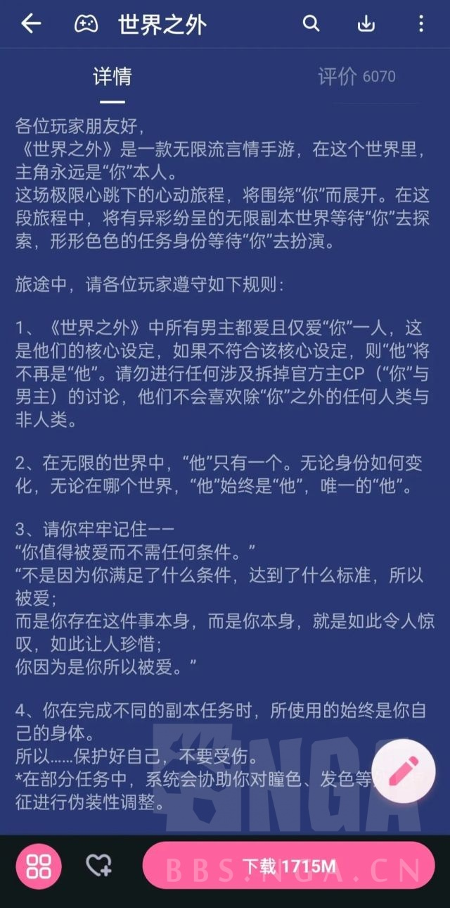

### [破事氵] 该说不说的，乙游这公告是真直球啊

Made by ngapost2md (c) ludoux [GitHub Repo](https://github.com/ludoux/ngapost2md)

----

##### 0.[3] \<pid:0\> 2024-01-31 19:20:15 by 津天之龙

宅向二游即使媚宅也少见这么直接表忠心的，更别说一堆简介“更新世界的锋芒”这种虚空上价值的假大空。

说实话我一直觉得集美们在各个领域对自身权益的敏感性相比国男实在是遥遥领先了。乙游对腐女开炮；某些题材直接禁男~~反肖战都不要男的~~；晋江看文之前查作者性别；见过自夸自己玩的游戏文案全是女性所以懂女生的~~这个不知道真假~~；甚至建构了一个不输给rh的“辱女”政治正确，一旦沾了辱女就奔走相告全方位抵制。

女性群体搞这些的时候国男还是一片混沌的状态，也就近两年才逐渐回过味来

回到原图话题，我感觉经过了这么多节奏今后新出的还想恰宅男米的作品可能也会逐渐走到直球表忠心的道路上，集美确实遥遥领先

----

##### 1.[2] \<pid:740885026\> 2024-01-31 19:37:07 by oududu
所以现在开始有男不玩，立刻，马上！

----

##### 2.[1] \<pid:740885301\> 2024-01-31 19:39:00 by rream_kly
我们男玩家也想有这样的待遇，决定了，我要向乙女玩家的国乙法学习

----

##### 3.[1] \<pid:740885679\> 2024-01-31 19:41:27 by 药师鬼
你去看看这家官博下面是怎么骂官方的 ，比手综的厉害多了

