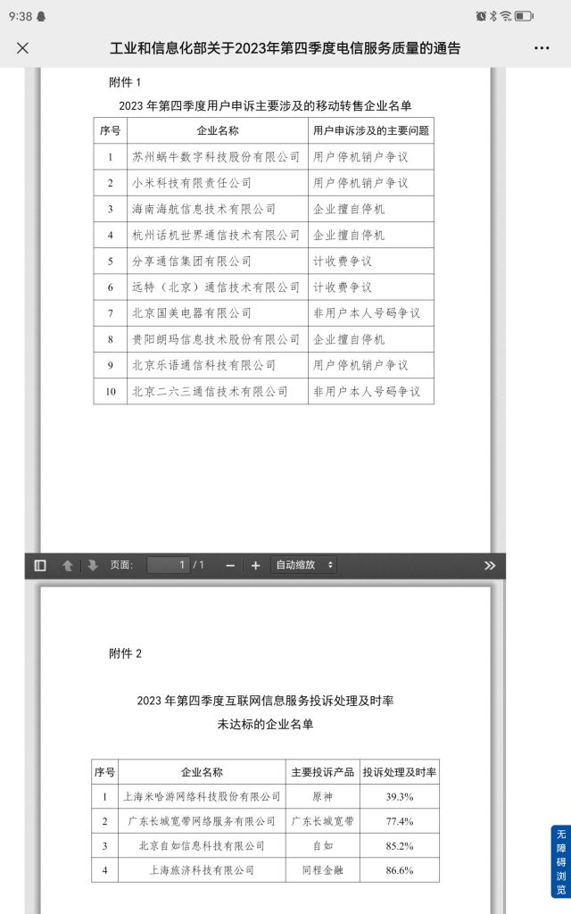
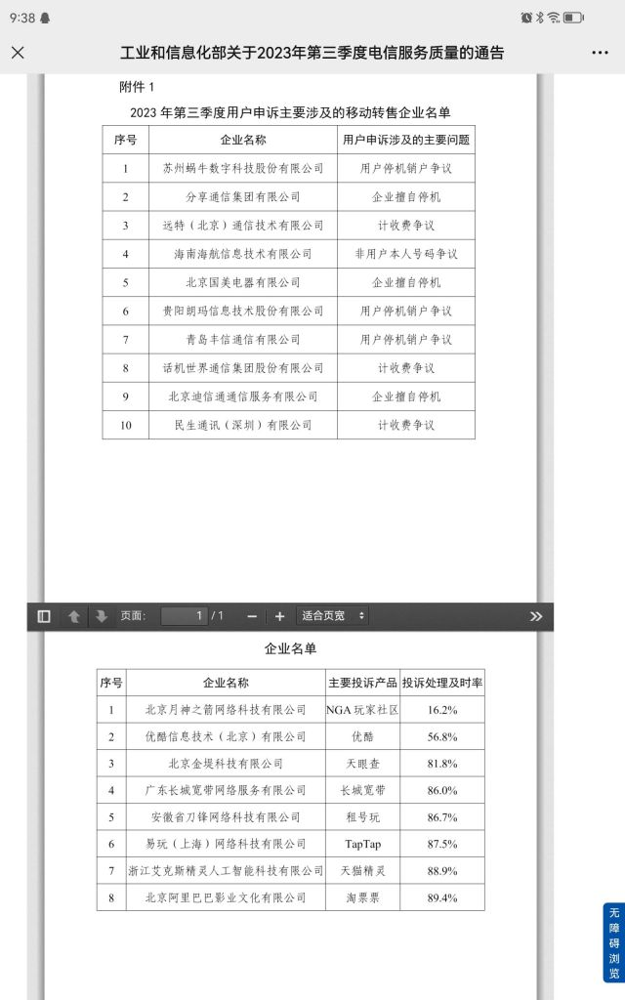
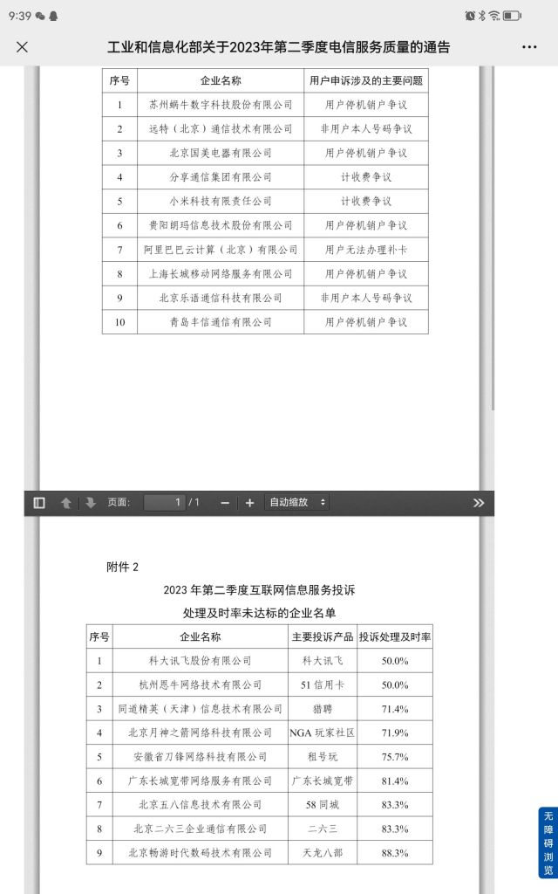

### [杂谈氵]看了下M家的新瓜，顺藤摸了一下，觉得挺乐的，下面放了共四个季度的截图

Made by ngapost2md (c) ludoux [GitHub Repo](https://github.com/ludoux/ngapost2md)

----

##### 0.[0] \<pid:0\> 2024-01-31 21:44:23 by 随手的潇洒

 
可惜没有披露具体的投诉项目。

----

##### 1.[0] \<pid:740905157\> 2024-01-31 21:46:41 by 止水-3
确实有点乐，盒厂应得的

----

##### 2.[0] \<pid:740905210\> 2024-01-31 21:47:05 by A_sys
上黑猫投诉搜

----

##### 3.[0] \<pid:740905320\> 2024-01-31 21:47:49 by 牧野不留姬
他这个回复率和回复主要项目还对应不上，不是一家的，奇怪

----

##### 4.[0] \<pid:740905983\> 2024-01-31 21:52:40 by zcj233
这个数据变化之快速，
变化幅度之大。
我只觉得数据太奇怪了，参考价值有限。

举个例子，
一个小学测身高，
第一年最高1.5，次高1.4
第二年最高1.9，次高1.1
第三年最高1.6，次高1.3。
每年还不是同一个人。
这身高测得多半有问题。

总不可能，
米四季度不做人，但前三个季度就是大好人。
泥潭就三季度不做人，然后光速改。

厂商如果这么容易改，那么就不会名声变成这样。

而且，除了长城，好像没什么重复的。
不科学。

----

##### 5.[0] \<pid:740907070\> 2024-01-31 22:00:12 by 随手的潇洒
补一个12315的投诉截图，大家看个乐子就行了。有兴趣的可以自己去查

