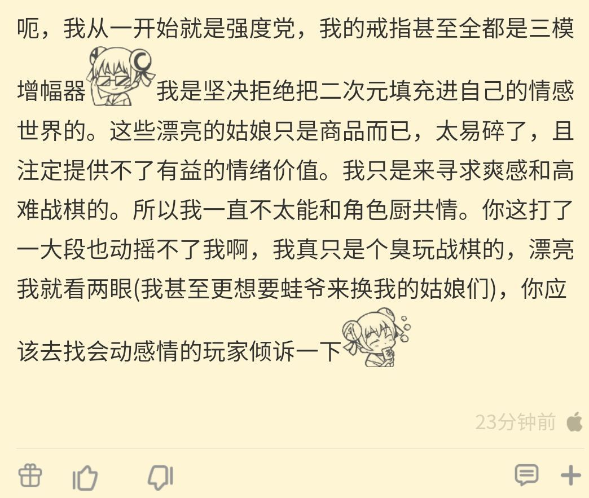

### [搬运] 搬运一篇对面少前老玩家的文章

Made by ngapost2md (c) ludoux [GitHub Repo](https://github.com/ludoux/ngapost2md)

----

##### 0.[4] \<pid:0\> 2024-01-31 21:50:51 by JAPGoroshi
原文其实没多少人看(对面少前2板块就没几个人)，但写的真好，值得一读
原文是白字写的，只有选中才能看到内容，加粗的部分是没有选中就能看到的文字。
以下正文<h4 class='subtitle'></h4>
[心得]《少女前線2追放，一場關於背叛的盛宴》

純粹有感而發，這場戲從去年十月追到現在，有些話不吐不快，大家看個樂呵就行，不用較真

&#39;<b>對感情的背叛必將遭受最猛烈的還擊</b>&#39;

萬萬沒想到，《少女前線2》這場爆雷鬧劇的火苗自從去年十月初點燃後一直沒有絲毫熄滅的跡象，不單陪伴我們跨越新年，直到筆者下筆的一月末依然在用熊熊燃燒的烈火證明著自己的生命力，聞風而來的吃瓜群眾可能是第一次嚐到吃撐的滋味，紛紛表示有點消化不良。

在開始之前，筆者想先問大家一個問題。

請問大家認在兩個獨立個體之間，甚麼行為是最不可饒恕的呢？

筆者的答案是&#39;<b>背叛</b>&#39;，特別是感情的背叛。

抽取、培養——這是主流二次元手遊都具備的標籤，製作組通過美術、語音、模型、劇情塑造等各種方式把一個個性格迴異的角色精緻的包裝起來，再通過獲取和培養的過程，用他們向玩家換取時間、精力和金錢，完成一次又一次的交易，而這種交易的一切前提都是建基於玩家的愛。

既然決定要談少女前線這場爆雷風波，那麼我們就不妨扯下遮羞布，給二遊角色所販賣的本質下一個定義吧——

<b>情緒價值</b>。

是的，用四字概括足以。

不論你是偏重感情的玩家，希望角色的百般嫵媚只為你一人；是重養成，希望將喜愛的角色培養至極限殺穿一切副本，挑戰遊戲極限內容；還是重劇情演出，希望角色可以在舞台上閃光發亮，盡情揮灑魅力的玩家，都離不開這四個字。一個二遊虛擬角色，既可以是玩家的賽博老婆老公，也可以是玩家悉心培養的賽博樹苗。

他真傻，為甚麼要花真金白銀買那麼多換裝呢，不都只是一張插畫嗎
他真傻，為甚麼要向那麼多相同的角色發戒指呢
他真傻，為甚麼要耗費大量時間精力把一個角色培養到極限呢
……他真傻……為甚麼……

或許大家不時可以看見類似的質疑，為了這點東西而已，值得嗎

或許是愛的證明，或許是為了填補生活空虛，也或許根本沒有為甚麼——因為情緒價值，就是如此，並非可以簡單量化之物。

對少女前線這個已步入夕陽西下階段的老IP來說，二代的消息猶如一記強心針，令無數依舊在一代和云圖堅守的老指揮官翹首以盼，期待這個他們所愛的名字重振雄風，同時在新的故事中跟眾人形再續前緣。大家所設想的未來是如此美好，以致把一切可能遭遇的風險和不安因素都拋諸腦後，深信屬於少女前線的太陽終將再次升起。

然後他們等來了一場盛大的背叛。

一場沒有鮮血，沒有硝煙，但足夠殺死人心的背叛。

到底人們是甚麼時侯發現遭受背叛的端倪呢……是追放開服前幾個月零碎的解包，不斷有人預警黛煙等角色擁有極其炸裂，不堪入目的劇情的時侯嗎，還是某位散爆文案在NGA大放厥詞指少前初代的戒指只有讓死宅爆米一個功能，言談間毫不掩飾對玩家的厭惡和敵視的時侯嗎……但這些都不重要了，因為很快在十月初，大家都親眼見證了背叛的發生。

<b>黛煙死了</b>。

散爆下賤做作的文案用一柄名為雷蒙的刀殺死了她。

塑造一個備受玩家喜愛的角色到底需要美術編劇和聲優付出多大的努力和時間呢，我不知道，但我知道要殺死她只需要一個不及格的寫手。

他們似乎在呼應NGA那位文案的狂言，正在無所不用其極的把他們心目中並非目標受眾的老婆黨後宮黨驅逐出去，用行動證明玩家在初代包括戒指在內的一切消費都只是一場鬧劇，製作組內部從來沒有正視過你們的情緒價值，所有會認為角色是賽博老婆的死宅都是我們恨不得馬上擺脫的低等存在，如此這般，在少女前線的光明未來中沒有骯髒猥褻的死宅的位置。

然而事態很快脫離了他們的控制。

奇怪，這老婆黨怎麼越打越多了。

不對勁啊，上頭不是說我們要向高貴的一般向揚帆高歌猛進嗎，不是說死宅很好哄可以隨便忽悠，只需要把他們當作提供養份的定期ATM嗎，不是說我們的角色被視作賽博老婆是種侮辱，必須讓她們擁有自己的生活嗎，怎麼一看開服流水如此慘淡，哎喲，怎麼節奏還出圈了，少前整個IP都變成笑柄了，這這這這這跟當初預想的不一樣啊，羽中哥哥，救一下啊！

羽中這時才終於從&#39;硬核不媚宅&#39;的夢中驚醒——不對，我們無從揣測當時人的想法，他由始至終不認為自己訂下的大方向有誤，一切風波都是來自友商的背刺，是來自網友的惡意節奏的可能性或許更高。畢竟如果從網絡上各種消息了解羽中其人的話，會發現&#39;剛愎自用&#39;四字最符合他的形象。

在筆者下筆的時侯，追放的瓜依然在不斷刷新，今天的版本是關於身為爆雷導火索的那個男人——雷蒙的身份之謎。瓜的詳細內容就不在此複述，請有興趣的朋友移步B站石英小隊隊長的動態，筆者只提醒一下大家吃瓜時不需要將內容視作100%準確，保持輕鬆平常的心態即可。

在&#39;瓜保真&#39;的前提下進行推論，即雷蒙本身不單是男性人形，更會與黛煙等人組成季風樂隊活動，經歷十年的風雨纏綿，而作為玩家角色的指揮官在其中並沒有任何角色和位置可言，只是一個拋棄了人形，出走十年的賽博奴隸主而已。在眾人形的新生活中沒有，也不需要你這個人。

你，是多餘的，是阻礙角色追求自己生活的最大阻力。

其實，從前的老婆黨，可以說是最好哄的群體之一了。

精美立繪，甜言蜜語，一切在現實難求的元素和美夢，我們將其託付在二次元遊戲的角色之中。是啊，誰不知道這是商品，誰不知道角色口中令人搔癢難耐、情意綿綿語句甚至很可能出自同性寫手之手，誰不知道這是在用&#39;金錢換取被愛&#39;的交易，對老婆黨這種訴求單純的群體而言，這就是一場甘願戴上面具以物質換取一絲愛和慰藉的美夢。

但是偏偏有人認為他們不配這場美夢。

就算老婆黨明明已經傾注了大量金錢時間和精力，也有人認為他們是低賤的，是骯髒的，是上不台面的低等物種，他們所求的夢不值一提，自己作為生產內容的一方可以任意蹂躪貶低他們的存在。

今天，羽中高舉著硬核的大旗，對自己依賴發家的老婆黨施以最殘酷的背刺，決意把指揮官跟所有角色切割開來。如果他依然想不通為甚麼節奏會來得如此猛烈，依然迷失在自己沒有錯，追放立項的大方向沒有錯的幻覺之中，那麼本文的第一句話將是最有力的完美回擊。

&#39;<b>對感情的背叛必將遭受最猛烈的還擊</b>&#39;

這場名為背叛的盛宴即會以何種方式落幕，筆者會繼續跟大家一起見證。

----

##### 1.[2] \<pid:740906016\> 2024-01-31 21:52:50 by ftz1993721
没人看是因为不用看
大家在立场上是一致的，在情感上是相通的。

我们都是被卡拉连接的赛博普罗托斯。

----

##### 2.[1] \<pid:740906071\> 2024-01-31 21:53:12 by 猛男银鸽
太长不看

----

##### 3.[2] \<pid:740906210\> 2024-01-31 21:54:10 by JAPGoroshi
>[jump](#pid740906071) 猛男银鸽(2024-01-31 21:53) 说: 
>
>太长不看

确实，应该已经比这次烧钱2的活动剧情长了

----

##### 4.[0] \<pid:740906298\> 2024-01-31 21:54:51 by JusticeSKL
删的好快啊

----

##### 5.[4] \<pid:740906445\> 2024-01-31 21:55:50 by 94646843z
因为写的人是从感情角度出发，而土豆2的学长最不关心的就是这玩意。

在二游里追求游戏性呢

