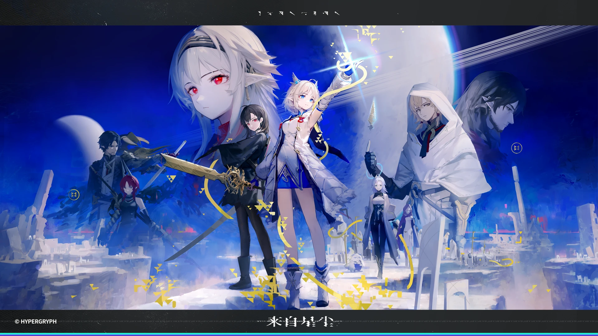

### [安利] [杂谈氵] 白泥们觉得有所谓的来看看鹰角赎罪券《来自星尘》吧！

Made by ngapost2md (c) ludoux [GitHub Repo](https://github.com/ludoux/ngapost2md)

----

##### 0.[0] \<pid:0\> 2024-02-01 00:00:40 by 我不会。

<a href="javascript:;" onclick="collapse(this);">+</a>致手综er ...
首先，“有男不玩”，我相信短短四个字绝对已经成为了手综er的共识。在“有男不玩”的前提下，《来自星尘》值不值得去体验呢？请听我娓娓道来。

[url](https://www.bilibili.com/video/BV1aD4y1f76y/?vd_source=b289b53134e72738133213f974a7e2db)

从上面这个pv中，我们可以很清楚的看到该游戏是有男人的，而且以他们制作精良程度来看，戏份应该是不会少的。但是，请注意！！男角色是自机角色还是以反派的形式出现，我们不得而知。如果很在意这方面，那我的建议是观望一下，不要被“国产单机”简简单单地骗走了你钱包里的钱！68块钱已经不少了，充到原神里就是一张大月卡，约等价于4753原石=670美元=158张小月卡。oh my god！你能给同样是3DRPG的原神做奴隶<b>13年</b>啊！所以，钱包在你手里，手综er们真的可以等上线之后再想想要不要下单。

最后，拉到最下面看“有男不玩”的丑态。

接下来是正题：

<a href="javascript:;" onclick="collapse(this);">+</a>游戏名 ...
《来自星尘》，这是即将推出的冒险游戏，由鹰角网络开发和发行。官方宣称这是一款“没有内购的”买断制产品，游戏于2024年2月27日在全球同步发售，定价68元人民币。

<a href="javascript:;" onclick="collapse(this);">+</a>游戏平台 ...
适用于<b>Android和iOS</b>平台。
目前没有PC版本，想要在PC端上体验，要上<b>模拟器</b>，官方推荐的是网易mumu模拟器。

<a href="javascript:;" onclick="collapse(this);">+</a>官网、预售链接 ...
[url](https://exa.hypergryph.com/#homepage)

<a href="javascript:;" onclick="collapse(this);">+</a>战斗系统 ...
采用了半回合制“光影协同”——回合制+即时战斗模式。

玩家控制的角色每次使用技能消耗1点“行动点数”，出招的顺序由玩家任意控制。每个角色最多可以配置3个技能，各角色可交替使用技能。部分技能存在“波流”还是“粒象”两种表现状态，玩家需在战斗前先决定采用“波流”还是“粒象”战斗状态。游戏中可使用“连招”，玩家可在战斗前为每个角色配置连招，并且根据不同敌人的情况灵活使用。

游戏在回合制的基础上加入了即时反应的战斗系统和一定的动作元素。<b>在敌方攻击时，按下角色的头像可以防御降低伤害。</b>还可在敌方角色<b>即将击中玩家角色时按下反击键进行“弹反”</b>，操作若成功则可使玩家角色不受到伤害并进行反击，但若操作失败则玩家角色比防御受到更多的伤害。

<a href="javascript:;" onclick="collapse(this);">+</a>其他玩法 ...
根据官网的介绍，在这个游戏里还有小世界探索，以及料理、打造物品等玩法，等你来探索。

<a href="javascript:;" onclick="collapse(this);">+</a>游戏内容 ...
~~你说得对，但是~~《来自星尘》是由大鹰帝国自主研发的一款首款买断制3DRPG手游。游戏发生在一颗围绕其恒星同步自转的行星，在这里，存在着高度发达的文明，且没有遭到外星文明的影响。你将扮演一位来自地球的调查员，因收到登录异星调查情报的任务，意外与异星人相逢，自此开始了一场结伴旅行。

<a href="javascript:;" onclick="collapse(this);">+</a>目前公开的游戏角色 ...
薇^3~~，薇薇薇，薇的三次方，~~疑似真主角，因为官网跳出来的人物第一个就是她，冒险的旅途由她的视角展开？虽然是一国的公主，但是与其他人没有权力关系。身边有一只形影不离、鸟鸟怪叫的锰。
 

雁，疑似第二主角，是地球派往外星的调差员。

星，与薇^3是旧识，同样身为一国的公主，出来冒险原因是为了她的国家。

<a href="javascript:;" onclick="collapse(this);">+</a>推荐理由 ...
这是鹰角继明日方舟多年之后，推出来的第二款手游。从pv可以看得出来，鹰角这么多年的技术积累不是白费的，模型和渲染都有独到之处。

有喜欢恰烂钱的某媒体xx葡萄指出，游戏采用了写实渲染(PBR)和卡通渲染(NPR)的混合渲染风格。它的设计使其尽可能地“兼顾趣味性和易操作”，且其“波流”和“粒象”状态的设计营造出一种“先冷静思考，再快速释放”的游戏节奏，且买断制的付费模式使《来自星尘》的定位在“小而精”的范畴，将与《明日方舟》这种成熟产品拉开差异，也让本游戏“更适合用来试验和展示项目组目前的技术能力”。该媒体游戏xx还认为在买断制游戏在中国大陆逐渐流行的趋势下，《来自星尘》或许正让鹰角成为“二次元赛道上买断制游戏的领潮者”。

有Pocket Gamer评价称，游戏拥有“令人惊叹的视觉效果和华丽的动画”，其战斗系统“使玩家在每次遇到敌人时都能保持警惕性”，且战斗在美丽的3D图形中进行，“绝对令人眼花缭乱”。

就连远在另一个地方的麦克阿瑟评价道，他手下的兵仔每天都在期待着这款游戏，它能很好的锻炼大脑思考能力与反应速度。而他本人虽然已经玩不动游戏了，但是他坚信这款《来自星尘》一定可以帮助大鹰帝国再造辉煌。

<a href="javascript:;" onclick="collapse(this);">+</a>一些碎碎念 ...
如果你进了手综，发现有些不明生物在碎碎碎一些莫名其妙的东西，什么“棉花”，“有男不玩”，“割头皮”诸如此类的可笑幼稚的东西，我在这里做个简单的总结。

近期论坛上发生了一些无理取闹的节奏，最喜欢岁月史书的亡灵们一而再、再而三地攻占这片纯洁的棉花地。看我上一篇搬运帖子就知道了，有些不明生物甚至还岁到了知乎上去，试图拉拢不明真相的路人来攻击我们负重前行的版务。幸好知乎那边及时出手，免得事态影响过大，被他们岁月史书过去了。如今，对比其他论坛，能这么和谐讨论的地方已经是不多见的了。

[url](https://zhuanlan.zhihu.com/p/680615867)
借用这篇帖子的最后一句话，仍然有一群人执拗的想追求根本不可能的东西：公平，公平，还是公平。如果你也追求这些理所应当、但现在困难重重的东西，可以私信这篇作文的作者。他曾经为了追求这些，转生了四次。

另外，用前几天看到的一番话，做一个总结。无论这个论坛发生了什么，都是无法影响到大鹰帝国的崛起。究其原因，大鹰帝国是有“根”的，帝国有技术，推出来的每一款游戏都具备碾压其他游戏的“游戏性”。无论其他人再怎么鸟鸟怪叫，都影响不了这个既定事实。祝大鹰帝国福星高照、敦睦邦交、名利双收、神来气旺！

----

##### 1.[0] \<pid:740923890\> 2024-02-01 00:04:41 by 我爱烧鸡
我只想问剧情怎么样

----

##### 2.[3] \<pid:740924067\> 2024-02-01 00:06:05 by 香风智乃i
>[jump](#pid740923890) 我爱烧鸡(2024-02-01 00:04):

还没上线，你问剧情？

----

##### 3.[0] \<pid:740924074\> 2024-02-01 00:06:09 by 的SD敢达
是网易mumu模拟器吧

----

##### 4.[2] \<pid:740924094\> 2024-02-01 00:06:19 by 星空凛录
感觉不如独立思考

----

##### 5.[6] \<pid:740924171\> 2024-02-01 00:06:47 by 苏癸酉
模型还不如一些同人MMD

----

##### 6.[0] \<pid:740924176\> 2024-02-01 00:06:50 by 她们的流仪
唉，先放盆馒头在这

----

##### 7.[0] \<pid:740924362\> 2024-02-01 00:08:12 by 我不会。
>[jump](#pid740924074) 的SD敢达(2024-02-01 00:06) 说: 
>
>是网易mumu模拟器吧

yes！收到！立刻改！

----

##### 8.[0] \<pid:740924557\> 2024-02-01 00:09:33 by 我爱烧鸡
>[jump](#pid740924067) 香风智乃i(2024-02-01 00:06) 说: 
>
>还没上线，你问剧情？

无所谓，我会等风评

----

##### 9.[0] \<pid:740924598\> 2024-02-01 00:09:54 by 东方谷早苗
韩国展上看试玩那位狂搓玻璃，比小朋友打王者还激烈，战斗系统这么紧张刺激的么

----

##### 10.[11] \<pid:740924643\> 2024-02-01 00:10:14 by blyewid
你串的太厉害，我甚至不知道要不要说一句有男不玩
我换个说法吧，支持尊重每个准备玩的pong友

----

##### 11.[0] \<pid:740924752\> 2024-02-01 00:11:00 by ZGDX夜
宣传图这脸总让我觉得是ai画的

----

##### 12.[5] \<pid:740924761\> 2024-02-01 00:11:04 by 黄前久美子子
有男不玩 没有的话这主美是百合豚 有男不玩

----

##### 13.[5] \<pid:740924772\> 2024-02-01 00:11:08 by 林间小树
支持，但有男不玩

----

##### 14.[0] \<pid:740924891\> 2024-02-01 00:12:04 by asteroidsssss
太佩服了

----

##### 15.[1] \<pid:740924958\> 2024-02-01 00:12:35 by 快捷键将２２２
有男不玩，有女我也不玩，反正就是不玩

----

##### 16.[1] \<pid:740924970\> 2024-02-01 00:12:41 by fervent159
占个楼，看看智商

----

##### 17.[1] \<pid:740925050\> 2024-02-01 00:13:16 by malsjkpo
我会在恋活里面支持这款游戏的
另外，有男不玩

----

##### 18.[2] \<pid:740925061\> 2024-02-01 00:13:19 by 有男不玩，是米不碰
客观的推荐需要客观的环境。
我说完了。

----

##### 19.[1] \<pid:740925068\> 2024-02-01 00:13:22 by 你说的对但NGA是
没头皮不玩

----

##### 20.[0] \<pid:740925150\> 2024-02-01 00:14:03 by 弗罗西诺内
这当然是一条通往名人堂的坎坷路途,对这个游戏,对我们来说,有时很容易,有时很困难。

